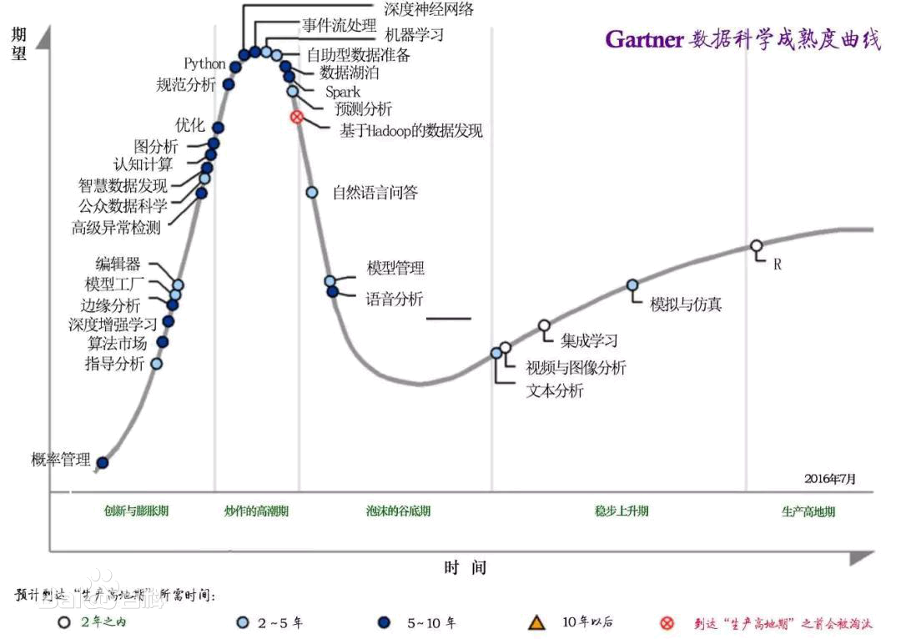

## 大数据
Big Data

- 2^0    1字节(Byte)=8位(bit)
- 2^10   1KB( Kilobyte，千字节)=1024B
- 2^20   1MB( Megabyte，兆字节)=1024KB
- 2^30   1GB( Gigabyte，吉字节，千兆)=1024MB
- 2^40   1TB( Trillionbyte，万亿字节，太字节)=1024GB
- 2^50   1PB( Petabyte，千万亿字节，拍字节)=1024TB
- 2^60   1EB( Exabyte，百亿亿字节，艾字节)=1024PB
- 2^70   1ZB(Zettabyte，十万亿亿字节，泽字节)=1024EB
- 2^80   1YB( Yottabyte，一亿亿亿字节，尧字节)=1024ZB
- 2^90   1BB( Brontobyte，千亿亿亿字节)=1024YB

### 概述

大数据是一个领域，它处理分析、系统地从中提取信息或以其他方式处理传统数据处理应用软件无法处理的过大或复杂的数据集的方法。具有多个字段（列）的数据提供更大的统计能力，而具有更高复杂性（更多属性或列）的数据可能会导致更高的错误发现率。大数据分析挑战包括捕获数据、数据存储、数据分析、搜索、共享、传输、可视化、 查询、更新、信息隐私和数据来源。大数据最初与三个关键概念相关联：容量、多样性和速度。大数据分析给抽样带来了挑战，因此以前只允许观察和抽样。因此，大数据通常包括大小超过传统软件在可接受的时间和价值内处理能力的数据。

大数据一词目前的用法往往是指使用预测分析、用户行为分析或某些其他高级数据分析方法，这些方法从大数据中提取价值，很少涉及特定大小的数据集。“毫无疑问，现在可用的数据量确实很大，但这并不是这个新数据生态系统最相关的特征。”  对数据集的分析可以找到“发现商业趋势、预防疾病、打击犯罪等”的新关联。科学家、企业高管、医疗从业者、广告和政府互联网搜索、金融科技、医疗保健分析、地理信息系统、城市信息学和商业信息学等领域的大型数据集经常遇到困难。科学家在e-Science工作中遇到限制，包括气象学、基因组学、 连接组学、复杂的物理模拟、生物学和环境研究。

可用数据集的大小和数量迅速增长，因为数据是由移动设备、廉价且数量众多的信息传感物联网设备、航空（遥感）、软件日志、相机、麦克风、射频识别等设备收集的。(RFID) 阅读器和无线传感器网络。 自 1980 年代以来，世界人均技术存储信息能力大约每 40 个月翻一番；截至 2012 年，每天生成 2.5艾字节（2.5×2^60字节）的数据。根据IDC报告预测，2013 年至 2020 年间，全球数据量预计将从 4.4泽字节呈指数增长至 44 泽字节。到 2025 年，IDC 预测将有 163 泽字节的数据。大型企业面临的一个问题是确定谁应该拥有影响整个组织的大数据计划。

用于可视化数据的关系数据库管理系统和桌面统计软件包通常难以处理和分析大数据。大数据的处理和分析可能需要“在数十、数百甚至数千台服务器上运行的大规模并行软件”。什么才算是“大数据”，这取决于分析它的人及其工具的能力。此外，扩展能力使大数据成为一个移动目标。“对于一些组织来说，第一次面对数百GB的数据可能会引发重新考虑数据管理选项的需要。对于其他组织，在数据大小成为重要考虑因素之前可能需要数十或数百 TB。”

大数据指的是在传统数据处理应用软件不足以处理的大或复杂的数据集的术语。

大数据也可以定义为来自各种来源的大量非结构化或结构化数据。

大数据是指无法在一定时间范围内用常规软件工具进行捕捉、管理和处理的数据集合，是需要新处理模式才能具有更强的决策力、洞察发现力和流程优化能力的大、高增长率和多样化的信息资产。

从学术角度而言，大数据的出现促成广泛主题的新颖研究。这也导致各种大数据统计方法的发展。大数据并没有统计学的抽样方法；它只是观察和追踪发生的事情。因此，大数据通常包含的数据大小超出传统软件在可接受的时间内处理的能力。

大数据指不用随机分析法（抽样调查）这样捷径，而采用所有数据进行分析处理。

由于近期的技术进步，发布新数据的便捷性以及全球大多数政府对高透明度的要求，大数据分析在现代研究中越来越突出。

#### 起源

截至2012年，技术上可在合理时间内分析处理的数据集大小单位为艾字节（EB）。在许多领域，由于数据集过度庞大，科学家经常在分析处理上遭遇限制和阻碍；这些领域包括气象学、基因组学、神经网络体学、复杂的物理模拟，以及生物和环境研究。这样的限制也对网络搜索、金融与经济信息学造成影响。数据集大小增长的部分原因来自于信息持续从各种来源被广泛收集，这些来源包括搭载感测设备的移动设备、高空感测科技（遥感）、软件记录、相机、麦克风、无线射频识别（RFID）和无线感测网络。自1980年代起，现代科技可存储数据的容量每40个月即增加一倍；截至2012年，全世界每天产生2.5艾字节（2.5×1018字节）的数据。

大数据几乎无法使用大多数的数据库管理系统处理，而必须使用“在数十、数百甚至数千台服务器上同时平行运行的软件”（电脑集群是其中一种常用方式）。大数据的定义取决于持有数据组的机构之能力，以及其平常用来处理分析数据的软件之能力。“对某些组织来说，第一次面对数百GB的数据集可能让他们需要重新思考数据管理的选项。对于其他组织来说，数据集可能需要达到数十或数百TB才会对他们造成困扰。”

随着大数据被越来越多的提及，有些人惊呼大数据时代已经到来了，2012年《纽约时报》的一篇专栏中写到，“大数据”时代已经降临，在商业、经济及其他领域中，决策将日益基于数据和分析而作出，而并非基于经验和直觉。但是并不是所有人都对大数据感兴趣，有些人甚至认为这是商学院或咨询公司用来哗众取宠的时髦术语(buzzword)，看起来很新颖，但只是把传统重新包装，之前在学术研究或者政策决策中也有大数据的支撑，大数据并不是一件新兴事物。

大数据时代的来临带来无数的机遇，但是与此同时个人或机构的隐私权也极有可能受到冲击，大数据包含各种个人信息数据，现有的隐私保护法律或政策无力解决这些新出现的问题。有人提出，大数据时代，个人是否拥有“被遗忘权”，被遗忘权即是否有权利要求数据商不保留自己的某些信息，大数据时代信息为某些互联网巨头所控制，但是数据商收集任何数据未必都获得用户的许可，其对数据的控制权不具有合法性。2014年5月13日欧盟法院就“被遗忘权”（Case of Right to be Forgotten）一案作出裁定，判决谷歌应根据用户请求删除不完整的、无关紧要的、不相关的数据以保证数据不出现在搜索结果中。这说明在大数据时代，加强对用户个人权利的尊重才是时势所趋的潮流。

#### 定义
大数据一词自 1990 年代以来一直在使用，有些人认为是美国计算机科学家和企业家 John R. Mashey 普及了该术语。

大数据通常包括大小超出常用软件工具在可容忍的经过时间内捕获、策划、管理和处理数据的能力的数据集。大数据哲学包括非结构化、半结构化和结构化数据，但主要关注非结构化数据。大数据“规模”是一个不断变化的目标；截至 2012 年，单一数据集的大小从数太字节（TB）至数十兆亿字节（PB）不等。

大数据需要一套具有新集成形式的技术和技术，以从多样化、复杂和大规模的数据集中揭示洞察力。

一些组织添加了“多样性”、“真实性”和其他各种“V”来描述它，这是一些行业权威挑战的修订。 大数据的Vs通常被称为“三V”、“四V”和“五V”。它们代表了大数据在数量、种类、速度、真实性和价值方面的品质。 可变性通常作为大数据的附加质量包括在内。

2018 年的定义指出“大数据是需要并行计算工具来处理数据的地方”，并指出，“这代表了通过并行编程理论所使用的计算机科学的明显且明确定义的变化，以及某些保证和功能通过由Codd的关系模型“。

大数据必须借由计算机对数据进行统计、比对、解析方能得出客观结果。

数据挖掘（data mining）则是在探讨用以解析大数据的方法。

大数据需要特殊的技术，以有效地处理大量的容忍经过时间内的数据。适用于特殊大数据的技术，包括大规模并行处理（MPP）数据库、数据挖掘、分布式文件系统、分布式数据库、云计算平台、互联网和可扩展的存储系统。

##### 大数据与商业智能
概念的日益成熟更鲜明地描绘了“大数据”和“商业智能”之间的区别：

1. 商业智能使用应用数学工具和具有高信息密度数据的描述性统计来衡量事物、检测趋势等。
2. 大数据使用数学分析、优化、归纳统计和非线性系统识别的概念，从信息密度低的大数据集中推断规律（回归、非线性关系和因果关系），以揭示关系和依赖关系，或对结果和行为进行预测

#### 特征
大数据可以用以下特征来描述：

**体积 Volume** 生成和存储的数据量。数据的大小决定了它的价值和潜在洞察力，以及它是否可以被视为大数据。大数据的大小通常大于 TB 和 PB。

**种类 Variety** 数据的类型和性质。早期的 RDBMS 等技术能够高效地处理结构化数据。然而，从结构化到半结构化或非结构化的类型和性质的变化对现有工具和技术提出了挑战。大数据技术发展的主要目的是捕获、存储和处理以高速（速度）和巨大（容量）生成的半结构化和非结构化（各种）数据。后来，这些工具和技术被探索并用于处理结构化数据，但更适合用于存储。最终，结构化数据的处理仍然是可选的，要么使用大数据，要么使用传统的 RDBMS。这有助于分析数据，以有效利用通过社交媒体、日志文件、传感器等。大数据从文本、图像、音频、视频中提取；加上它完成了缺失的部分数据融合。

**速度 Velocity** 数据生成和处理的速度，以满足增长和发展道路上的需求和挑战。大数据通常是实时可用的。与小数据相比，大数据的产生更加持续。与大数据相关的两种速度是生成频率和处理、记录和发布频率。

**真实性 Veracity** 数据的真实性或可靠性，是指数据质量和数据价值。大数据不仅必须规模大，而且必须可靠，才能在分析中实现价值。捕获数据的数据质量可能会有很大差异，从而影响准确的分析。

**价值 Value** 通过处理和分析大型数据集可以获得的信息价值。价值也可以通过评估大数据的其他质量来衡量。 价值也可能代表从大数据分析中检索到的信息的盈利能力。

**变化性 Variability** 大数据格式、结构或来源不断变化的特征。大数据可以包括结构化、非结构化或结构化和非结构化数据的组合。大数据分析可以整合来自多个来源的原始数据。原始数据的处理还可能涉及将非结构化数据转换为结构化数据。

大数据的其他可能特征是：

**穷尽 Exhaustive** 是否整个系统（即 n=all) 是否被捕获或记录。大数据可能包括也可能不包括来自来源的所有可用数据。

**细粒度和独特的词汇 Fine-grained and uniquely lexical** 分别收集每个元素的每个元素的特定数据的比例以及元素及其特征是否被正确索引或识别。

**关系型 Relational** 如果收集的数据包含可以对不同数据集进行合并或荟萃分析的公共字段。

**外延的 Extensional** 如果可以轻松添加或更改所收集数据的每个元素中的新字段。

**可扩展性 Scalability** 如果大数据存储系统的规模可以迅速扩大。

- 容量（Volume）：数据的大小决定所考虑的数据的价值和潜在的信息；
- 种类（Variety）：数据类型的多样性；
- 速度（Velocity）：指获得数据的速度；
- 可变性（Variability）：妨碍了处理和有效地管理数据的过程。
- 真实性（Veracity）：数据的质量。
- 复杂性（Complexity）：数据量巨大，来源多渠道。 
- 价值（value）：合理运用大数据，以低成本创造高价值。

### 技术
麦肯锡全球研究所2011 年的一份报告将大数据的主要组成部分和生态系统描述如下：

- 分析数据的技术，例如A/B 测试、机器学习和自然语言处理
- 大数据技术，如商业智能、云计算和数据库
- 可视化，例如图表、图形和其他数据显示

多维大数据也可以表示为OLAP数据立方体，或者数学上的张量。阵列数据库系统已经着手为这种数据类型提供存储和高级查询支持。应用于大数据的其他技术包括高效的基于张量的计算，如多线性子空间学习，大规模并行处理 ( MPP ) 数据库，基于搜索的应用程序，数据挖掘， 分布式文件系统，分布式缓存（例如，突发缓冲区和Memcached），分布式数据库、云和基于 HPC 的基础设施（应用程序、存储和计算资源）、和互联网。[需要引用]尽管已经开发了许多方法和技术，但利用大数据进行机器学习仍然很困难。

一些MPP关系数据库能够存储和管理 PB 级的数据。隐式是加载、监视、备份和优化RDBMS 中大数据表的使用的能力。

DARPA的拓扑数据分析计划寻求大数据集的基本结构，并于 2008 年随着一家名为“ Ayasdi ”的公司的成立而公开上市。

大数据分析过程的从业者通常反对速度较慢的共享存储，更喜欢各种形式的直连存储 ( DAS )，从固态驱动器 ( SSD ) 到埋在并行处理节点中的高容量SATA磁盘。共享存储架构——存储区域网络(SAN) 和网络附加存储(NAS)——的看法是它们相对缓慢、复杂且昂贵。这些品质与依靠系统性能、商品基础设施和低成本而蓬勃发展的大数据分析系统不一致。

实时或接近实时的信息传递是大数据分析的定义特征之一。因此，无论何时何地都可以避免延迟。直接连接的内存或磁盘中的数据是好的——位于FC SAN连接另一端的内存或磁盘上的数据不是。分析应用程序所需规模的SAN成本远高于其他存储技术。

#### 存储
大数据存储库以多种形式存在，通常由具有特殊需求的公司构建。从 1990 年代开始，商业供应商历来为大数据提供并行数据库管理系统。多年来，WinterCorp 发布了最大的数据库报告。【34】

Teradata公司于 1984 年推出了并行处理DBC 1012系统。Teradata 系统在 1992 年率先存储和分析了 1 TB 的数据。1991年硬盘驱动器为 2.5 GB，因此大数据的定义根据Kryder 定律不断发展。Teradata 于 2007 年安装了第一个基于 PB 级 RDBMS 的系统。截至 2017 年，已安装了几十个 PB 级 Teradata 关系数据库，其中最大的超过 50 PB。直到 2008 年的系统都是 100% 结构化的关系数据。从那时起，Teradata 添加了非结构化数据类型，包括XML、JSON和 Avro。

2000 年，Seisint Inc.（现为LexisNexis Risk Solutions）开发了一个基于C++的分布式数据处理和查询平台，称为HPCC 系统平台。该系统跨多个商品服务器自动分区、分发、存储和交付结构化、半结构化和非结构化数据。用户可以使用称为 ECL 的声明性数据流编程语言编写数据处理管道和查询。在 ECL 中工作的数据分析师不需要预先定义数据模式，而是可以专注于手头的特定问题，在开发解决方案时以最佳方式重塑数据。2004 年，LexisNexis 收购了 Seisint Inc. 和他们的高速并行处理平台，并在 2008 年收购 Choicepoint Inc. 时成功地使用该平台集成了该公司的数据系统。 2011 年，HPCC 系统平台在 Apache v2.0 License下开源。

几十年来，CERN和其他物理实验收集了大数据集，通常通过高吞吐量计算进行分析，而不是通过当前“大数据”运动通常所指的 map-reduce 架构进行分析。

2004 年，Google发表了一篇论文，介绍了一个名为MapReduce的过程，该过程使用了类似的架构。MapReduce 概念提供了一个并行处理模型，并发布了相关的实现来处理大数据。使用 MapReduce，查询被拆分和分布在并行节点上并并行处理（“映射”步骤）。然后收集并交付结果（“减少”步骤）。该框架非常成功，因此其他人想要复制该算法。因此，一个名为“ Hadoop ”的 Apache 开源项目采用了 MapReduce 框架的实现。 Apache Spark 于 2012 年开发，以应对 MapReduce 范式的限制，因为它增加了设置许多操作的能力（不仅仅是先映射后减少）。

MIKE2.0是一种开放的信息管理方法，它承认由于标题为“大数据解决方案”的文章中确定的大数据影响而需要进行修订。该方法从有用的数据源排列、相互关系的复杂性以及删除（或修改）单个记录的难度方面处理大数据。

2012 年的研究表明，多层架构是解决大数据问题的一种选择。分布式并行架构将数据分布在多台服务器上; 这些并行执行环境可以显着提高数据处理速度。这种架构将数据插入并行的DBMS，实现MapReduce和Hadoop框架的使用。这种类型的框架通过使用前端应用程序服务器来使处理能力对最终用户透明。

数据湖允许组织将其重点从集中控制转移到共享模型，以响应不断变化的信息管理动态。。这可以将数据快速隔离到数据湖中，从而减少开销时间。

#### Hadoop
##### 起源于 Google
2003 年的 11 月份，Google 发表了第一篇论文《The Google File System》，简称 GFS。主要内容是如何解决分布式存储的问题。

2004 年 12 月份，Google 发表了第二篇论文《MapReduce：Simplified Data Processing on Large Clusters》。讨论在大规模集群下一种简化了的数据处理模型，解决的是分布式计算的问题。 

2006 年的时候，Google 发表了第三篇论文，叫《Bigtable: A Distributed Storage System for Structured Data》。解决的是大规模结构化数据的存储和查询问题。

人们通常认为，大数据起源于谷歌的“三驾马车”：谷歌文件系统、MapReduce 和 BigTable，这三篇论文分别发表于 2003年、2004年和 2007年。2007年亚马逊也发表了一篇关于 Dynamo系统的论文。这几篇论文奠定了大数据时代的基础。

Google搜索引擎提供的互联网用户的信息检索功能。其实主要是很简单的两件事： 
一是数据采集，也就是网页的爬取； 
二是数据搜索，也就是索引的构建； 
数据采集离不开存储，索引的构建也需要大量计算，所以存储容器和计算能力贯穿搜索引擎的整个更迭过程。 
在互联网早期，互联网产品用户规模都不是很大，很少的人会关注分布式解决方案，都在单体机器上寻找解决方案，也就是在硬件上下功夫； 
而Google在当时的互联网界，不管是用户规模还是所产生数据量都是TOP级别的。所以，对分布式和集群等方式，解决存储方式研究较早，同时也采用横向拓展的思路，去研发系统。

Google作为互联网泡沫破灭后第一次上市的大型 IT公司，它的市值在上市之后飞速增长。原因在于，Google的广告业务做得非常成功，而广告业务成功的很大一部分原因是它用了大数据技术。当时，很多相关的互联网企业因此都认为大数据是改变自己命运的机会，因此纷纷加入大数据圈子，入局的有微软、阿里巴巴、雅虎、Facebook、LinkedIn、Twitter等公司。

##### Hadoop 的产生
最早关注 Google 大数据论文的是一个程序员，Lucene项目的创始人 Doug Cutting。Doug Cutting 是一个开源系统爱好者，和 Google 差不多同期也实现了一个开源版本的搜索引擎。但是，他的引擎始终无法做到 Google 这么快的搜索和索引构建能力，当 Google 发表了这两篇论文之后，Doug Cutting 受到了启发，就实现了开源版本的 GFS 和 MapReduce。

到了2006年，DC 开发的类似MapReduce功能的大数据技术，被独立出来，单独开发运维。这个也就是不就后被命名为 Hadoop 的产品。 该体系里面包含分布式文件系统 HDFS 以及大数据计算引擎 MapReduce。

Doug Cutting 曾经解释说 Hadoop 这个名字其实是他儿子的一个毛绒玩具大象的名字，包括现在大家看到的 Hadoop 的黄色大象 Logo，其实也是来自于这个玩具大象的启发。不过现在我们说玩转大数据的时候，常常说让大象能跳舞，也是在形象的强调 Hadoop 给大数据带来的灵活计算的能力。

2008年，Hadoop 正式成为 Apache 的顶级项目，自此，Hadoop 彻底火了起来，也被更多的人熟知。

##### 抱团取暖的 Hadoop 生态圈
2008年的时候，大部分公司围绕在一个叫作 Hadoop的项目周围，这个项目最初开始于 2006年 1月，是“大数据之父”道格 · 卡丁（Doug Cutting）把他对谷歌文件系统、MapReduce的实现，从爬虫项目 Nutch里独立出来形成的。Hadoop的主要贡献者是雅虎，Facebook、LinkedIn、Twitter等公司也都贡献了一些影响深远的项目。

Hadoop系统，在 2008年 6月就比较稳定了。有一次 Hadoop在硅谷的活动，这个活动上雅虎的 Hadoop开发人员非常兴奋，因为他们第一次拿到了全球排序算法的冠军。那个会场设置在雅虎，Facebook、LinkedIn和 Twitter的人也都出席了。这些公司除了对 Hadoop的贡献以外，雅虎贡献了 Pig、Facebook贡献了 Hive、LinkedIn贡献了 Kafka、Twitter贡献了 Storm。

Hadoop以外的系统主要有两个：一个是微软自己研发的 Cosmos，中文叫作“宇宙”；另外一个系统是阿里巴巴的 ODPS。

微软自己研发 Cosmos的原因很简单：一方面，微软当时和开源社区关系不好，无法和雅虎一起合作；另一方面，微软当时虽然是“帝国没落”，但仍感觉自己很厉害，有信心凭借一己之力“造轮子”。

整个 Cosmos的技术架构有很多方面像谷歌。当时我们每个新人入门的时候，组内资深老人总是把谷歌的几篇论文给新人，帮助他们入门。可见微软虽然觉得自己厉害，但是没能改变参考谷歌系统的本质。

阿里巴巴在决定做大数据的时候，实际上成立了两个团队：一个是在 Hadoop基础上做开源系统，另一个是自研一套叫作 ODPS的系统。两边都投入很多人，但是最后 ODPS得到了大力支持，Hadoop团队衰弱了。

##### 一场大论战

2008年的大数据圈里发生了一次非常引人瞩目的事件。这次事件的一方是数据库领域的元老级人物迈克尔 · 斯通布雷克（Michael Stonebraker）和大卫 · 德威特（David Dewitt），另外一方是主导了谷歌技术发展的杰夫 · 迪恩（Jeff Dean）。这两群人就谷歌“三驾马车”之一的 MapReduce是创新还是倒退，争得不可开交。

传统数据库一方以一篇“MapReduce：一个巨大的倒退”（MapReduce：a Step Backward）博文掀起了这场论战。他们认为 MapReduce是数据库领域的人早就淘汰了的，不值一提。但是谷歌那批人觉得 MapReduce是一个伟大的发明。

此次事件影响深远，但是当时双方的观点都太绝对了。两方面都有道理，但是两方面谁都没有看到对方正确的地方。业界有些人则看明白了，并经过论证和思考开发了新系统，比如 Spark。

##### Hadoop 的生意经
在 Hadoop 开源中赚钱的标志是 Cloudera 公司的诞生。

2009年，几个人有感于现在的 Hadoop难用，觉得如果能够让 Hadoop这套系统可以变得更容易安装、更好用，可以卖给其他企业赚钱。所以，这几个人成立了一家叫作 Cloudera的公司来做这个生意，并推出了一个 Hadoop版本。

之后有了另外一家公司，叫 MapR。它的印度 CTO原来在谷歌文件系统组工作，他觉得 Hadoop的文件系统太差，就自己在印度召集了一群哥们儿，重新写了一个和 Hadoop兼容的文件系统，做了一个叫作 MapR的 Hadoop版本。

之后雅虎里面做 Hadoop的团队从雅虎分离出来，成立了 Hortonworks。

最终整个 Hadoop市场变成了三家分销商的天下。

##### 交互式查询的风波
大数据发展史中，谷歌经常扮演“搅局”的角色，这次谷歌发表了一篇论文，介绍了一个叫作 Dremel的系统，也就是现在的 BigQuery。简单来说，BigQuery可以帮助用户很快查到所要的结果。

BigQuery推出后大家都觉得 Hive太慢了，三大 Hadoop分销商都对交互式查询提出了自己的做法。Cloudera做了一个叫作 Impala的项目，这是一个相对蛮成功的产品，到今天还有比较大的影响力；MapR提出了一个叫作 Drill的项目；Hortonworks的做法是干脆努力提高 Hadoop上的查询语言 Hive的查询效率。

##### 后 MapReduce 时代
Hadoop发展过程中一个标志性的公司是 Facebook。Facebook开始是开源系统里面非常重要的一个角色，它在 Hive上投入了大量的资源。但是，Facebook在 2012年转做了 Presto。Presto查询速度非常快，也没有用到 MapReduce，它的势头很猛，很快就战胜了 Hive。

另外一个是伯克利大学 AMP 实验室开发的 Spark，Spark 的兴起算是 Hadoop 生态圈一个比较关键的转折点。Spark的战略非常牛，最开始他们没有跟 Hive 一争高下，而是选择了机器学习。Spark兴起以后，慢慢地花了很多力气做 SQL，最近 Spark又在努力做流计算。

除了 Spark 以外，还有另外一个产品叫 Flink。在国内，阿里巴巴用 Flink 用得比较多。Flink是德国柏林理工大学团队在 2014年重新开始的一个项目。他们 2008年做了一个项目，但是失败了。这几年的流计算领域，主要就是 Spark 和 Flink 在竞争。

#### 数据来源类型
大数据获取之来源影响其应用之效益与质量，依照获取的直接程度一般可分为三种：

1. 第一方数据(First Party Data)：为己方单位自己和消费者、用户、目标客群交互产生的数据，具有高质量、高价值的特性，但易局限于既有顾客数据，如企业搜集的顾客交易数据、追踪用户在APP上的浏览行为等，拥有者可弹性地使用于分析研究、营销推广等。
2. 第二方数据(Second Party Data)：取自第一方的数据，通常与第一方具有合作、联盟或契约关系，因此可共享或采购第一方数据。如：订房品牌与飞机品牌共享数据，当客人购买某一方的商品后，另一单位即可推荐他相关的旅游产品；或是已知某单位具有己方想要的数据，透过议定采购，直接从第一方获取数据。
3. 第三方数据(Third Party Data)：提供数据的来源单位，并非产出该数据的原始者，该数据即为第三方数据。通常提供第三方数据的单位为数据供应商，其广泛搜集各式数据，并贩售给数据需求者，其数据可来自第一方、第二方与其他第三方数据，如爬取网络公开数据、市调公司所发布的研究调查、经去识别化的交易信息等。

### 应用
大数据极大地增加了对信息管理专家的需求，以至于Software AG、Oracle Corporation、IBM、Microsoft、SAP、EMC、HP和Dell在专门从事数据管理和分析的软件公司上花费了超过 150 亿美元。2010 年，这个行业价值超过 1000 亿美元，并且以每年近 10% 的速度增长：大约是整个软件行业的两倍。

发达经济体越来越多地使用数据密集型技术。全球有 46 亿移动电话用户，有 10 亿至 20 亿人访问互联网。 1990 年至 2005 年间，全球有超过 10 亿人进入中产阶级，这意味着更多的人变得更加识字，这反过来又导致了信息的增长。全球通过电信网络交换信息的有效容量在 1986 年为 281 PB，1993年为 471 PB，2000 年为 2.2 EB，2007年为 65 EB ，预测互联网流量为每年 667 EB1014 [ 52]。]根据一项估计，全球存储的信息中有三分之一采用字母数字文本和静止图像数据的形式，这是对大多数大数据应用程序最有用的格式。这也显示了尚未使用的数据（即视频和音频内容的形式）的潜力。

虽然许多供应商提供现成的大数据解决方案，但专家建议在公司拥有足够的技术能力的情况下，开发定制的内部解决方案来解决公司手头的问题。

大数据的应用示例包括大科学、RFID、感测设备网络、天文学、大气学、交通运输、基因组学、生物学、大社会数据分析、互联网文件处理、制作互联网搜索引擎索引、通信记录明细、军事侦查、金融大数据，医疗大数据，社交网络、通勤时间预测、医疗记录、照片图像和影像封存、大规模的电子商务等。

大数据类产品分为：数据采集、存储管理、分析与挖掘、数据流通、基础技术、大数据应用、行业应用等。

1) 零售: 随着市场竞争的加剧，零售业务越来越难做。企业主往往是在寻找渠道来更好地理解和服务客户。每一秒都有大量的数据，对来自社交媒体、忠诚计划、客户交易等渠道的所有数据进行适当的分析可以帮助他们获得竞争优势。

2) 通信: 电信服务提供商分析大的数据，以做出重要的商业决策，比如扩大客户基础。

3) 金融服务: 几乎所有顶级金融机构，从保险到零售银行，库克都为他们的金融服务提供大数据服务。这些金融公司面临的重大挑战是，它们庞大的多结构数据分布在不同的系统中。分析大数据可以在很多方面帮助他们，比如客户分析、欺诈分析、合规分析和运营分析。

##### 政府
在政府流程中使用和采用大数据可以提高成本、生产力和创新的效率，但并非没有缺陷。数据分析通常需要政府的多个部门（中央和地方）协同工作，并创建新的创新流程来实现预期的结果。一个使用大数据的常见政府组织是国家安全局 ( NSA )，他们不断监控 Internet 的活动，以寻找其系统可能发现的可疑或非法活动的潜在模式。

民事登记和生命统计(CRVS) 收集从出生到死亡的所有证书状态。CRVS 是政府大数据的来源。

目前，发达国家的政府部门开始推广大数据的应用。2012年奥巴马政府投资近两亿美元开始推行《大数据的研究与发展计划》，本计划涉及美国国防部、美国卫生与公共服务部门等多个联邦部门和机构，意在通过提高从大型复杂的的数据中提取知识的能力，进而加快科学和工程的开发，保障国家安全。

国际卫生学教授汉斯·罗斯林使用“Trendalyzer”工具软件呈现两百多年以来全球人类的人口统计数据，跟其他数据交叉比对，例如收入、宗教、能源使用量等。

中国政府计划创建全面的个人信用评分体系，其包含不少对个人行为的评定，有关指标会影响到个人贷款、工作、签证等生活活动。除获取网络数据外，中国政府还希望从科技公司获得分类和分析信息的云端计算能力，透过城市监控摄像机、智能手机、政府数据库等搜集数据，以建造智能城市和安全城市。

##### 国际发展
关于有效利用信息和通信技术促进发展（也称为“ICT4D”）的研究表明，大数据技术可以做出重要贡献，但也对国际发展提出了独特的挑战。 大数据分析的进步为改进关键发展领域的决策提供了具有成本效益的机会，例如医疗保健、就业、经济生产力、犯罪、安全、自然灾害和资源管理。  此外，用户生成的数据提供了新的机会，让闻所未闻的人发声。然而，发展中地区面临的长期挑战，如技术基础设施不足以及经济和人力资源稀缺，加剧了对大数据的现有担忧，如隐私、不完善的方法和互操作性问题。 “发展大数据”的挑战目前对通过机器学习，被称为“人工智能发展（AI4D）这个数据的应用发展。

*好处*
大数据促进发展的一个主要实际应用是“以数据脱贫”。 2015 年，Blumenstock 及其同事根据手机元数据预测了贫困和财富，2016 年，Jean 及其同事结合卫星图像和机器学习来预测贫困。使用数字追踪数据来研究拉丁美洲的劳动力市场和数字经济，希尔伯特及其同事 认为数字追踪数据有几个好处，例如：

- 专题覆盖范围：包括以前难以或无法衡量的领域
- 地理覆盖范围：我们的国际资源为几乎所有国家提供了大量可比较的数据，包括通常不包括在国际清单中的许多小国
- 详细程度：提供具有许多相互关联的变量和新方面（如网络连接）的细粒度数据
- 及时性和时间序列：图表可以在收集后的几天内生成

*挑战*
同时，使用数字踪迹数据代替传统调查数据并不能消除在国际定量分析领域工作时所涉及的传统挑战。优先事项发生了变化，但基本讨论保持不变。主要挑战包括：

- 代表性。传统的发展统计主要关注随机调查样本的代表性，而数字追踪数据从来都不是随机样本。
- 普遍性。虽然观测数据总是很好地代表了这个来源，但它只代表了它所代表的东西，仅此而已。虽然很容易将一个平台的特定观察概括为更广泛的环境，但这通常是非常具有欺骗性的。
- 协调。数字追踪数据仍然需要指标的国际统一。它增加了所谓的“数据融合”的挑战，即不同来源的协调。
- 数据过载。分析师和机构不习惯有效处理大量变量，而这可以通过交互式仪表板有效地完成。从业者仍然缺乏一个标准的工作流程，可以让研究人员、用户和政策制定者有效地进行工作。

##### 社会学
大数据产生的背景离不开Facebook等社交网络的兴起，人们每天通过这种自媒体传播信息或者沟通交流，由此产生的信息被网络记录下来，社会学家可以在这些数据的基础上分析人类的行为模式、交往方式等。美国的涂尔干计划就是依据个人在社交网络上的数据分析其自杀倾向，该计划从美军退役士兵中拣选受试者，透过Facebook的行动app收集资料，并将用户的活动数据传送到一个医疗资料库。收集完成的数据会接受人工智能系统分析，接着利用预测程序来即时监视受测者是否出现一般认为具伤害性的行为。

##### 巨大科学
大型强子对撞机中有1亿5000万个传感器，每秒发送4000万次的数据。实验中每秒产生将近6亿次的对撞，在过滤去除99.999%的撞击数据后，得到约100次的有用撞击数据。

将撞击结果数据过滤处理后仅记录0.001%的有用数据，全部四个对撞机的数据量复制前每年产生25拍字节（PB），复制后为200拍字节。

如果将所有实验中的数据在不过滤的情况下全部记录，数据量将会变得过度庞大且极难处理。每年数据量在复制前将会达到1.5亿拍字节，等于每天有近500艾字节（EB）的数据量。这个数字代表每天实验将产生相当于500垓（5×1020）字节的数据，是全世界所有数据源总和的200倍。

##### 医疗保健
大数据分析通过提供个性化医疗和处方分析、临床风险干预和预测分析、减少浪费和护理可变性、患者数据的自动外部和内部报告、标准化医疗术语和患者登记以及分散的点解决方案，帮助医疗保健改善。   一些需要改进的领域比实际实施更具抱负。医疗保健系统内生成的数据水平并非微不足道。随着移动医疗、电子医疗和可穿戴技术的进一步采用，数据量将继续增加。这包括电子健康记录数据、影像数据、患者生成的数据、传感器数据和其他形式的难以处理的数据。现在，此类环境更需要更加关注数据和信息质量。 “大数据通常意味着‘脏数据’，数据不准确的比例随着数据量的增长而增加。” 大数据规模的人工检查是不可能的，健康服务迫切需要智能工具来控制和处理遗漏信息的准确性和可信度。虽然医疗保健中的大量信息现在是电子的，但它属于大数据保护伞，因为大多数信息是非结构化的且难以使用。大数据在医疗保健中的使用带来了重大的伦理挑战，从个人权利、隐私和自主权的风险到透明度和信任。

健康研究中的大数据在探索性生物医学研究方面特别有前途，因为数据驱动的分析可以比假设驱动的研究更快地推进。然后，可以在传统的、假设驱动的后续生物学研究和最终的临床研究中测试数据分析中看到的趋势。

在医疗保健领域，一个严重依赖大数据的相关应用子领域是医学中的计算机辅助诊断。 例如，对于癫痫监测，习惯上每天创建 5 到 10 GB 的数据。 同样，乳房断层合成的单个未压缩图像平均为 450 MB 的数据。  这些只是计算机辅助诊断使用大数据的众多例子中的一小部分。因此，大数据已被公认为计算机辅助诊断系统需要克服的七大关键挑战之一，以达到更高的性能水平。 

在COVID-19 大流行期间，提出大数据是为了尽量减少疾病的影响。大数据的重要应用包括最大限度地减少病毒的传播、病例识别和医疗发展。

政府使用大数据来跟踪感染者，以尽量减少传播。早期采用者包括中国大陆、台湾、韩国和以色列。

##### 教育
一个麦肯锡全球研究所研究发现，150万名训练有素的数据专业人员和管理人员短缺和一些大学包括田纳西大学和加州大学伯克利分校，创造了硕士课程，以满足这种需求。私人新兵训练营也开发了满足这种需求的程序，包括像数据孵化器这样的免费程序或像大会这样的付费程序。在特定的营销领域，Wedel 和 Kannan 强调的问题之一是营销有几个子域（例如，广告、促销、产品开发、品牌），它们都使用不同类型的数据。因为一刀切的分析解决方案是不可取的，商学院应该让营销经理准备好对这些子领域中使用的所有不同技术有广泛的了解，以便全面了解并与分析师有效合作。

##### 媒体
要了解媒体如何使用大数据，首先需要为媒体流程所使用的机制提供一些背景信息。Nick Canry 和 Joseph Turow 建议媒体和广告从业者将大数据视为有关数百万人的许多可操作的信息点。该行业似乎正在摆脱使用特定媒体环境（如报纸、杂志或电视节目）的传统方法，转而利用可在最佳时间在最佳地点接触目标人群的技术来吸引消费者。最终目标是服务或传达（从统计上讲）符合消费者心态的信息或内容。例如，数据挖掘活动。

- 以消费者为目标（用于营销人员的广告）
- 数据抓取
- 数据新闻：出版商和记者使用大数据工具来提供独特和创新的见解和信息图表。

英国公共服务电视广播公司Channel 4是大数据和数据分析领域的领导者。

##### 保险
健康保险提供商正在收集有关社会“健康决定因素”的数据，例如食品和电视消费、婚姻状况、衣服尺寸和购买习惯，并据此预测健康成本，以便发现客户的健康问题。这些预测目前是否被用于定价是有争议的。

##### 物联网 (IoT)
大数据和物联网协同工作。从 IoT 设备提取的数据提供了设备互连的映射。媒体行业、公司和政府已使用此类映射来更准确地定位受众并提高媒体效率。物联网也越来越多地被用作收集传感数据的手段，这种传感数据已用于医疗、制造和运输环境。

数字创新专家凯文·阿什顿( Kevin Ashton) 在这句话中定义了物联网：“如果我们拥有能够了解事物的一切的计算机——使用他们在没有任何帮助的情况下收集的数据“我们——我们将能够跟踪和计算一切，并大大减少浪费、损失和成本。我们会知道什么时候需要更换、修理或召回，以及它们是新鲜的还是过去的。”

##### 信息技术
尤其是自 2015 年以来，大数据在业务运营中成为一种重要工具，可帮助员工提高工作效率并简化信息技术(IT)的收集和分发。使用大数据解决企业内的 IT 和数据收集问题称为IT 运营分析(ITOA)。通过将大数据原理应用到机器智能和深度计算的概念中，IT 部门可以预测潜在问题并在问题发生之前提供解决方案。在此期间，ITOA 业务也开始在系统管理中发挥重要作用通过提供将各个数据孤岛整合在一起的平台，并从整个系统而不是孤立的数据口袋中产生洞察力。

##### 商业
运用数据挖掘技术，分析网络声量，以了解客户行为、市场需求，做营销策略参考与商业决策支持，或是应用于品牌管理，经营网络口碑、掌握负面事件等。如电信运营商透过品牌的网络讨论数据，即时找出负面事件进行处理，减低负面讨论在网络扩散后所可能引发的形象危害。

- 亚马逊公司，在2005年的时点，这间公司是世界上最大的以LINUX为基础的三大数据库之一。
- Walmart 每小时处理超过 100 万笔客户交易，这些交易被导入数据库，估计包含超过 2.5 PB（2560 TB）的数据——相当于美国国会图书馆所有书籍所含信息的 167 倍。
- Facebook，处理500亿枚的用户照片。
- 全世界商业数据的数量，统计全部的企业全体、推计每1.2年会倍增。
- 西雅图文德米尔不动产分析约1亿匿名司机的GPS信号，提供购入新房子的客户从该地点使用交通工具(汽车、脚踏车等)至公司等地的通勤时间估计值。
- 软银，每个月约处理10亿件（2014年3月现在）的手机LOG情报，并用其改善手机信号的信号强度。
- 大企业对大数据技能需求量大，吸引了许多大学诸如伯克利大学开专门提供受过大数据训练的毕业者的大学部门。硅谷纽约为主《The Data Incubator》公司，2012年成立，焦点是数据科学与大数据企业培训，提供国际大数据培训服务。

### 研究活动
2012 年 3 月，美国白宫宣布了一项全国性的“大数据计划”，该计划由六个联邦部门和机构组成，为大数据研究项目投入了超过 2 亿美元。

该计划包括在五年内向加州大学伯克利分校的 AMPLab 提供1000 万美元的国家科学基金会“计算探索”赠款。 AMPLab 还从DARPA和十多个工业赞助商那里获得资金，并使用大数据来解决从预测交通拥堵到抗击癌症的广泛问题。

白宫大数据倡议还包括能源部承诺在五年内提供 2500 万美元的资金，以建立可扩展数据管理、分析和可视化 (SDAV) 研究所，由能源部的劳伦斯伯克利国家研究所领导。实验室。SDAV 研究所旨在汇集六个国家实验室和七所大学的专业知识，开发新工具，帮助科学家管理和可视化部门超级计算机上的数据。

美国马萨诸塞州于 2012 年 5 月宣布了马萨诸塞州大数据计划，该计划从州政府和私营公司向各种研究机构提供资金。在麻省理工学院举办的英特尔科学与技术中心为大数据麻省理工学院计算机科学和人工智能实验室，结合政府，企业和机构的资金和科研力量。

欧盟委员会正在通过其第七个框架计划资助为期两年的大数据公私论坛，让公司、学者和其他利益相关者参与讨论大数据问题。该项目旨在制定研究和创新战略，以指导欧盟委员会在成功实施大数据经济方面的支持行动。该项目的成果将用作其下一个框架计划Horizo​​n 2020 的投入。

2014 年 3 月，美国工程教育学会展示了大数据中的加密搜索和集群形成。Gautam Siwach 参与了麻省理工学院计算机科学与人工智能实验室应对大数据的挑战UNH 研究组的 Amir Esmailpour 和 Amir Esmailpour 研究了大数据的关键特征，如集群的形成及其互连。他们通过提供技术中的原始定义和实时示例，专注于大数据的安全性以及该术语在云接口中以加密形式存在的不同类型数据的方向。此外，他们提出了一种识别编码技术的方法，以加快对加密文本的搜索，从而增强大数据的安全性。

英国政府于 2014 年 3 月宣布成立艾伦图灵研究所，以计算机先驱和密码破译者的名字命名，该研究所将专注于收集和分析大型数据集的新方法。

在滑铁卢大学斯特拉特福德校区加拿大开放数据体验 (CODE) 灵感日，参与者展示了如何使用数据可视化来增加对大数据集的理解和吸引力，并将他们的故事传达给世界。

计算社会科学 ——任何人都可以使用谷歌和推特等大数据持有者提供的应用程序编程接口 (API) 进行社会和行为科学的研究。这些 API 通常是免费提供的。 Tobias Preis 等人。使用谷歌趋势数据证明，来自人均国内生产总值 (GDP) 较高国家的互联网用户更有可能搜索有关未来的信息，而不是有关过去的信息。调查结果表明，在线行为与现实世界的经济指标之间可能存在联系。  该研究的作者根据来年（2011 年）的搜索量与前一年（2009 年）的搜索量之比检查了 Google 查询日志，他们将其称为“未来导向指数”。他们将未来导向指数与每个国家的人均 GDP 进行了比较，发现谷歌用户更多地询问未来的国家有更高的 GDP 的强烈趋势。

Tobias Preis和他的同事 Helen Susannah Moat 和H. Eugene Stanley介绍了一种方法，使用基于 Google Trends 提供的搜索量数据的交易策略来识别股票市场走势的在线前兆。他们的分析，谷歌对不同金融相关的98项，发表在搜索量的科学报告，表明，在搜索量增加了财务相关检索词往往在金融市场先于大面积亏损。      

大数据集带来了以前不存在的算法挑战。因此，一些人认为需要从根本上改变处理方式。

现代大数据集算法研讨会 (MMDS) 汇集了计算机科学家、统计学家、数学家和数据分析从业者，讨论大数据的算法挑战。关于大数据，这种数量级的概念是相对的。正如它所说的“如果过去有任何指导意义，那么在不久的将来很可能不会考虑今天的大数据。” 

##### 大数据采样
关于大数据集的一个研究问题是，是否有必要查看完整数据以得出有关数据属性的某些结论？也许一个样本就已经足够好。

大数据这个名称本身就包含一个与大小相关的术语，这是大数据的一个重要特征。但抽样能够从更大的数据集中选择正确的数据点来估计整个人口的特征。

在制造过程中，可以在很短的时间间隔内获得不同类型的感官数据，例如声学、振动、压力、电流、电压和控制器数据。要预测停机时间，可能不需要查看所有数据，但样本可能就足够了。

大数据可以按各种数据点类别进行细分，例如人口统计数据、心理数据、行为数据和交易数据。借助大量数据点，营销人员能够创建和使用更多定制的消费者细分，以进行更具战略性的定位。

在大数据的采样算法方面已经做了一些工作。已经开发了用于采样 Twitter 数据的理论公式。

### 批评
对大数据范式的批评有两种形式：一种质疑方法本身的含义，另一种质疑目前的做法。这种批评的一种方法是关键数据研究领域。

##### 对大数据范式的批判
“一个关键的问题是，我们对导致大数据典型网络特征出现的潜在经验微观过程知之甚少。” 在他们的批评中，Snijders、Matzat和Reips指出，通常对数学属性做出非常强烈的假设，而这些假设可能根本无法反映在微过程级别上真正发生的事情。马克格雷厄姆对克里斯安德森关于大数据将意味着理论终结的断言提出了广泛的批评：特别关注大数据必须始终在其社会、经济和政治背景下进行背景化的概念。即使公司投资八位数和九位数的金额来从供应商和客户的信息流中获得洞察力，也只有不到 40% 的员工拥有足够成熟的流程和技能来做到这一点。《哈佛商业评论》的一篇文章称，要克服这种洞察力缺陷，大数据无论分析得多么全面或充分，都必须辅以“大判断”。

与此大致相同，有人指出，基于大数据分析的决策不可避免地“像过去一样由世界提供信息，或者充其量是现在的样子”。根据过去经验的大量数据，如果未来与过去相似，算法可以预测未来的发展。如果系统对未来的动态变化（如果它不是一个平稳的过程），过去就不能说明未来。为了在不断变化的环境中进行预测，有必要对系统动态有透彻的了解，这需要理论。作为对这种批评的回应，Alemany Oliver 和 Vayre 建议使用“溯因推理作为研究过程的第一步，以便为消费者的数字踪迹提供背景信息并产生新的理论”。 此外，有人建议将大数据方法与计算机模拟相结合，例如基于代理的模型和复杂系统。通过基于相互依赖算法集合的计算机模拟，基于代理的模型在预测甚至未知未来场景的社会复杂性的结果方面越来越好。 最后，使用多变量方法探测数据的潜在结构，例如因子分析和聚类分析已被证明是有用的分析方法，远远超出通常用于较小数据集的双变量方法（交叉表）。

在健康和生物学领域，传统的科学方法基于实验。对于这些方法，限制因素是可以证实或反驳初始假设的相关数据。 生物科学现在接受了一个新假设：由大量数据（组学）提供的信息（没有先验假设）与基于实验的传统方法互补，有时是必要的。 在大规模方法中，制定相关假设来解释数据是限制因素。搜索逻辑颠倒和归纳的限制（“科学与哲学的荣耀丑闻”，CD Broad, 1926) 被考虑。

大数据时代的来临带来无数的机遇，但是与此同时个人或机构的隐私权也极有可能受到冲击，大数据包含各种个人信息数据，现有的隐私保护法律或政策无力解决这些新出现的问题。

有人提出，大数据时代，个人是否拥有“被遗忘权”，被遗忘权即是否有权利要求数据商不保留自己的某些信息，大数据时代信息为某些互联网巨头所控制，但是数据商收集任何数据未必都获得用户的许可，其对数据的控制权不具有合法性。

2014年5月13日欧盟法院就“被遗忘权”（Case of Right to be Forgotten）一案作出裁定，判决谷歌应根据用户请求删除不完整的、无关紧要的、不相关的数据以保证数据不出现在搜索结果中。这说明在大数据时代，加强对用户个人权利的尊重才是时势所趋的潮流。

隐私权倡导者担心增加个人身份信息的存储和集成对隐私构成的威胁；专家小组发布了各种政策建议，以使实践符合对隐私的期望。  媒体、公司甚至政府在数个案例中滥用大数据，几乎每个支撑社会的基本机构都丧失了信任。

Nayef Al-Rodhan 认为，在大数据和拥有大量信息的大公司的背景下，需要一种新的社会契约来保护个人自由，并且应该在大数据的使用进行监控和更好地监管国家和国际层面。 Barocas 和 Nissenbaum 认为，保护个人用户的一种方法是了解所收集信息的类型、与谁共享信息、在何种限制下以及出于何种目的。

##### “大数据杀熟”现象
在很多人看来,“大数据杀熟”的一个显著特征,就是每个人的订单价格可能都不一样,但从经济学角度来看,并非所有的价差都被归为大数据杀熟而受到批判,比如差异化定价,就是对市场供需的合理调节,这种行为事实上已经被社会所接受了。

在来咖智库举行的一场关于“大数据杀熟”的主题直播中,中国社会科学院财经院研究室副主任、清华大学中国经济思想与实践研究院研究员冯煦明就专门分析了传统差异化定价与大数据杀熟的异同。他列举了日常生活中常见的三类传统差异化定价现象。

第一类是潮汐定价,比如五一假期的机票、酒店费用,比平时的要贵,这是供给需求变化所产生的市场化调节行为。

第二类叫动态定价,比如大家订机票时,都知道越早订越便宜,临近日期就会变得很贵,这里面就存在确定性溢价和折价的因素。

第三类就是线下消费中已经较为常见的、在经济学中被称为“价格歧视”行为,如学生老人半价票、超市打折券、游乐场两部收费制、集贸市场砍价等等。

“大数据杀熟”与传统差异化定价的一个本质区别在于:消费者是否知道自己被价格歧视了,商家是否存在不同定价的隐瞒行为。

在传统的差异化定价中,消费者面对的信息往往是透明的,一般不存在商家隐瞒信息的行为,消费者在明知存在不同价格的情况下,根据自身实际情况做出行为决策。例如,消费者在购买机票或电影票时,明知自己支付的价格可能跟别人不一样,知道自己是买的是高价机票还是低价机票,是半价电影票还是全价电影票,但出于自身需要的考虑自愿选择支付高价或低价。但在“大数据杀熟”中,信息往往是不透明的,商家会有意隐瞒差异化定价的事实,消费者完全被蒙在鼓里,在这种情况下消费者的高价支付行为是在不知情的情况下做出的,是非自愿的。

简单来说,区别“大数据杀熟”与传统差异化定价可以用一个简单而行之有效的判定标准,即商家是否隐瞒了不同定价的存在,消费者在做出购买决策的时候是否明知存在不同的价格。

##### 对“V”模型的批评
大数据的“V”模型令人担忧，因为它以计算可扩展性为中心，缺乏信息的可感知性和可理解性。这导致了认知大数据的框架，该框架根据以下特征描述了大数据应用：

- 数据完整性：理解数据中的不明显
- 数据相关性、因果关系和可预测性：因果关系不是实现可预测性的必要条件
- 可解释性和可解释性：人类希望理解并接受他们所理解的，而算法无法处理这一点
- 自动化决策水平：支持自动化决策和算法自学习的算法

##### 对新颖性的批评
大型数据集已被计算机器分析了一个多世纪，包括由IBM的穿孔卡片机执行的美国人口普查分析，该机器计算统计数据，包括整个大陆人口的均值和方差。最近几十年，CERN等科学实验产生了与当前商业“大数据”规模相似的数据。然而，科学实验倾向于使用专门定制的高性能计算（超级计算）集群和网格来分析他们的数据，而不是像当前的商业浪潮中的廉价商品计算机云，这意味着文化和技术的差异堆。

##### 对大数据执行的批评
Ulf-Dietrich Reips和 Uwe Matzat在 2014 年写道，大数据已成为科学研究中的“时尚”。研究员达娜·博伊德 (danah boyd ) 提出了对科学中使用大数据的担忧，因为过于关注处理大量数据而忽视了诸如选择代表性样本之类的原则。这种方法可能会导致结果以一种或另一种方式存在偏差。跨异构数据资源的集成——有些可能被认为是大数据，而另一些则不是——带来了巨大的后勤和分析挑战，但许多研究人员认为，这种集成可能代表最有前途的科学新前沿。 在具有挑衅性的文章“大数据的关键问题”中，作者将大数据称为神话的一部分：“大数据集提供了更高形式的智能和知识 [...]真实性、客观性和准确性”。大数据的用户往往“迷失在庞大的数字中”，“大数据的工作仍然是主观的，它量化的东西不一定更接近客观事实”。在BI域的最新发展，诸如在大数据的可用性主动报告特别目标的改进，通过自动过滤的非有用数据和相关性。大结构充满虚假的相关性，要么是因为非因果巧合（真正大数定律），要么是大随机性的唯一性质（拉姆齐理论），要么是由于存在未包含的因素，所以早期实验者制作大型数字数据库“不言自明”并彻底改变科学方法的希望受到质疑。

与分析较小的数据集相比，大数据分析通常是肤浅的。在许多大数据项目中，并没有发生大数据分析，但挑战在于数据预处理的提取、转换、加载部分。

大数据是一个流行词和一个“含糊的术语”， 但同时也是企业家、顾问、科学家和媒体的“痴迷” 。近年来，谷歌流感趋势等大数据展示未能提供良好的预测，将流感爆发夸大了两倍。同样，奥斯卡奖仅基于 Twitter 的选举预测往往偏离目标。大数据通常与小数据面临同样的挑战；添加更多数据并不能解决偏差问题，但可能会强调其他问题。尤其是 Twitter 等数据源并不能代表总体人口，从这些来源得出的结果可能会导致错误的结论。谷歌翻译——基于文本的大数据统计分析——在翻译网页方面做得很好。然而，来自专业领域的结果可能会有很大的偏差。另一方面，大数据也可能带来新的问题，比如多重比较问题：同时测试大量假设可能会产生许多错误地显示为重要的错误结果。Ioannidis 认为“大多数已发表的研究结果都是错误的” 由于本质上相同的结果：当许多科学团队和研究人员各自进行许多实验（即处理大量科学数据；尽管不是使用大数据技术）， “显着”结果为假的可能性会迅速增加——当只公布阳性结果时更是如此。此外，大数据分析结果的好坏取决于它们所基于的模型。在一个例子中，大数据参与了尝试预测 2016 年美国总统选举的结果，并取得了不同程度的成功。

##### 对大数据警务和监视的批评
大数据已被执法机构和公司等机构用于警务和监视。由于与传统的警务方法相比，基于数据的监控不太明显，因此不太可能出现对大数据警务的反对。根据 Sarah Brayne 的Big Data Surveillance: The Case of Policing，大数据警务可以通过三种方式再现现有的社会不平等：

- 通过使用数学和无偏见算法的理由来加强对犯罪嫌疑人的监视
- 增加执法人员追踪和加剧刑事司法系统中现有种族过度代表的范围和人数
- 鼓励社会成员放弃与会产生数字痕迹的机构的互动，从而为社会包容制造障碍

如果这些潜在问题得不到纠正或监管，大数据监管的影响可能会继续影响社会等级制度。Brayne 还指出，认真使用大数据监管可以防止个人层面的偏见成为机构偏见。

### 市场
大数据的出现提升了对信息管理专家的需求，Software AG、Oracle、IBM、微软、SAP、易安信、惠普和戴尔已在多间数据管理分析专门公司上花费超过150亿美元。在2010年，数据管理分析产业市值超过1,000亿美元，并以每年将近10%的速度成长，是整个软件产业成长速度的两倍。

经济的开发成长促进了密集数据科技的使用,也促成发展了相对于信息经济的数据经济。全世界共有约46亿的移动电话用户，并有10至20亿人链接互联网。自1990年起至2005年间，全世界有超过10亿人进入中产阶级，收入的增加造成了识字率的提升，更进而带动信息量的成长。全世界透过电信网络交换信息的容量在1986年为281兆亿字节（PB），1993年为471兆亿字节，2000年时增长为2.2艾字节（EB），在2007年则为65艾字节。根据预测，在2013年互联网每年的信息流量将会达到667艾字节。

### 未来
大数据时代的有些未来是可以预见的。

第一是数据库能力的提升。谷歌的 Spanner 和亚马逊的 Redshift 都体现了这种变化：数据库的能力越来越强，它可以解决很多大数据的问题。

第二点是大数据平台的发展非常强调实时性。流计算现在变得非常重要。

第三点是 AI给大数据准备了什么。谷歌的一篇论文中说到，我们可以通过 AI技术给大数据建立更好的索引。

### 大数据分析
在维克托·迈尔-舍恩伯格及肯尼斯·库克耶编写的《大数据时代》 中大数据分析指不用随机分析法（抽样调查）这样的捷径，而采用所有数据进行分析处理，因此不用考虑数据的分布状态（抽样数据是需要考虑样本分布是否有偏，是否与总体一致）也不用考虑假设检验，这点也是大数据分析与一般数据分析的一个区别。

#### 大数据分析师
- 理论要求：统计学、概率论和数据库、数据挖掘、JAVA基础、Linux基础。
- 工具要求：
    + 必要： SQL、Hadoop、HDFS、Mapreduce、Mahout、Hive、Spark
    + 可选：RHadoop、Hbase、ZooKeeper等
- 分析方法要求：熟练掌握hadoop集群搭建；熟悉nosql数据库的原理及特征，并会运用在相关的场景；熟练运用mahout、spark提供的进行大数据分析的数据挖掘算法，包括聚类（kmeans算法、canopy算法）、分类（贝叶斯算法、随机森林算法）、主题推荐（基于物品的推荐、基于用户的推荐）等算法的原理和使用范围。
- 业务分析能力：熟悉hadoop+hive+spark进行大数据分析的架构设计，并能针对不同的业务提出大数据架构的解决思路。掌握hadoop+hive+ Spark+tableau平台上Spark MLlib、SparkSQL的功能与应用场景，根据不同的数据业务需求选择合适的组件进行分析与处理。并对基于Spark框架提出的模型进行对比分析与完善。
- 结果展现能力：报告能体现大数据分析的优势，能清楚地阐述数据采集、大数据处理过程及最终结果的解读，同时提出模型的优化和改进之处，以利于提升大数据分析的商业价值。

#### 数据分析 Data Analysis
数据分析是一个涉及到应用算法或机械程序，以得出有用的业务见解的过程。数据分析的技巧和技术被广泛应用于工业中，以做出明智的决定来验证或否定当前的模型和理论。

数据分析是指用适当的统计分析方法对收集来的大量数据进行分析，提取有用信息和形成结论而对数据加以详细研究和概括总结的过程。数据分析包含“数据”和“分析”两个方面一方面包括手机、加工和整理数据，另一方面也包括分析数据，从中提取有价值的信息并形成对业务有帮助的结论。数据分析的成果通常以分析报告的形式呈现。对于数据分析报告，分析就是论点，数据就是论据，两者缺一不可。

基于统计分析方法做数据分析：例如回归分析、方差分析等；

1. 能源管理:大多数公司使用数据分析进行能源管理，包括智能电网能源、公用事业公司的建筑自动化、能源优化和能源分配。主要重点是管理服务中断、监控网络设备和调度人员。在公用事业的网络性能中集成数以百万计的数据点，可以让工程师利用分析技术监控他们的网络。
2. 医疗:成本压力是医院面临的主要挑战，这也限制了医院有效治疗许多病人。机器和仪器数据证明是有益的跟踪和优化治疗，以及病人的流量和使用设备可以跟踪。这有助于提高医疗质量，预计将提高1%的效率，从而在全球范围内节省630多亿美元的医疗费用。
3. 游戏:在游戏中收集数据以优化和花费是数据分析的主要优势。那些制造游戏的公司能够更好地洞察用户的喜好、厌恶和关系。
4. 旅游:通过网络博客分析、移动数据分析、社交媒体数据分析，优化购买体验。顾客的喜好和欲望可以被提取出来。定制的报价和套餐可以根据客户的后续浏览情况进行推广，帮助公司实现更好的转化率。

##### 传统数据分析与大数据分析的三方面异同

1. 在分析方法上，两者并没有本质不同。

    数据分析的核心工作是人对数据指标的分析、思考和解读，人脑所能承载的数据量是极其有限的。所以，无论是“传统数据分析”，还是“大数据分析”，均需要将原始数据按照分析思路进行统计处理，得到概要性的统计结果供人分析。两者在这个过程中是类似的，区别只是原始数据量大小所导致处理方式的不同。

2. 在对统计学知识的使用重心上，两者存在较大的不同。

    “传统数据分析”使用的知识主要围绕“能否通过少量的抽样数据来推测真实世界”的主题展开。“大数据分析”主要是利用各种类型的全量数据（不是抽样数据），设计统计方案，得到兼具细致和置信的统计结论。

3. 与机器学习模型的关系上，两者有着本质差别。

    “传统数据分析”在大部分时候，只是将机器学习模型当黑盒工具来辅助分析数据。而“大数据分析”，更多时候是两者的紧密结合，大数据分析产出的不仅是一份分析效果测评，后续基于此来升级产品。在大数据分析的场景中，数据分析往往是数据加墨的前奏，数据建模是数据分析的成果。

##### 数据分析师
- 理论要求：统计学、概率论和数理统计、多元统计分析、时间序列、数据挖掘。
- 工具要求：必要：Excel、SQL可选：SPSS MODELER、R、Python、SAS等
- 分析方法要求：除掌握基本数据处理及分析方法以外，还应掌握高级数据分析及数据挖掘方法（多元线性回归法，贝叶斯，神经网络，决策树，聚类分析法，关联规则，时间序列，支持向量机，集成学习等）和可视化技术。
- 业务分析能力：可以将业务目标转化为数据分析目标；熟悉常用算法和数据结构，熟悉企业数据库构架建设；针对不同分析主体，可以熟练的进行维度分析，能够从大数据中搜集并提取信息；通过相关数据分析方法，结合一个或多个数据分析软件完成对大数据的处理和分析。
- 结果展现能力：报告体现数据挖掘的整体流程，层层阐述信息的收集、模型的构建、结果的验证和解读，对行业进行评估，优化和决策。

#### 数据科学

Data Science

数据科学是利用科学方法、流程、算法和系统从数据中提取价值的跨学科领域。数据科学家综合利用一系列技能（包括统计学、计算机科学和业务知识）来分析从网络、智能手机、客户、传感器和其他来源收集的数据。

数据科学揭示趋势并产生见解，企业可以利用这些见解做出更好的决策并推出更多创新产品和服务。数据是创新的基石，但是只有数据科学家从数据中收集信息，然后采取行动，才能实现数据的价值。 

利用数据学习知识的学科。

数据科学是一个跨学科的领域，包含所有与结构化和非结构化数据相关的内容。

从准备、清理、分析和源于有用的视角开始。它结合了数学、统计学、智能数据捕获、编程、问题解决、数据清理、不同的观察角度、准备和数据对齐。

简而言之，它是对数据进行处理的几种技术和流程的组合，以获得有价值的业务视角。通过使用科学的方法、算法、流程和系统来有效地提取信息，这些信息可以被业务用来做出关键的业务决策。

1. 推荐系统:推荐系统可以预测某个用户是否愿意购买某个商品，并帮助用户快速找到相关产品。许多行业巨头，如亚马逊，正在使用推荐系统，通过使用他们以前的搜索结果，根据用户的喜好来推广他们的建议和产品。
2. 数字广告:数字广告是最新的趋势，也是比传统广告形式获得更高CTR的广告。无论是华丽的展示横幅还是交互式的数字广告牌，数字科学算法是这些数字广告成功背后的支撑。
3. 网络搜索:搜索引擎可以在很短的时间内得到任何结果。有没有想过，到底是哪一种有助于提高精确度?

##### 历史
自1946年第一台通用计算机发明以来，科学研究的实验模拟产出了大量数据，并依靠算法发现其中规律。

1974年，着名计算机科学家、图灵奖获得者Peter Naur在其着作《计算机方法的简明调研（Concise Survey of Computer Methods）》的前言中首次明确提出了数据科学（Data Science）的概念，“数据科学是一门基于数据处理的科学”，并提到了数据科学与数据学（Datalogy）的区别——前者是解决数据（问题）的科学（the science of dealing with data），而后者侧重于数据处理及其在教育领域中的应用（the science of data and of data processes and its place in education）。

Peter Naur首次明确提出数据科学的概念之后，数据科学研究经历了一段漫长的沉默期。

直到2001年，当时在贝尔实验室工作的William S. Cleveland在学术期刊International Statistical Review上发表题为《数据科学——拓展统计学技术领域的行动计划（Data Science: an Action Plan for Expanding the Technical Areas of the Field of Statistics》的论文，主张数据科学是统计学的一个重要研究方向，数据科学再度受到统计学领域的关注。

之后，2013年，Mattmann C A和 Dhar V在《自然（Nature）》和《美国计算机学会通讯（Communications of the ACM）》 上分别发表题为《计算——数据科学的愿景（Computing: A vision for data science）》和《数据科学与预测（Data science and prediction）》论文，从计算机科学与技术视角讨论数据科学的内涵，使数据科学纳入计算机科学与技术专业的研究范畴。

然而，数据科学被更多人关注是因为后来发生了三个标志性事件：一是Patil DJ和 Davenport T H于2012年在哈佛商业评论上发表题为《数据科学家——21世纪最性感的职业（Data scientist: the sexiest job of the 21st century）》；二是2012年大数据思维首次应用于美国总统大选，成就奥巴马，击败罗姆尼，成功连任；三是美国白宫于2015年首次设立数据科学家的岗位，并聘请Patil DJ作为白宫第一任首席数据科学家。

Gartner的调研及其新兴技术成长曲线（Gartner's 2014 Hype Cycle for Emerging Technologies）表示，数据科学的发展于2014年7月已经接近创新与膨胀期的末端，将在2~5年之内开始应用于生产高地期（plateau of Productivity）。同时，Gartner的另一项研究揭示了数据科学本身的成长曲线（Hype Cycle for Data Science）。从中可以看出，数据科学的各组成部分的成熟度不同：R的成熟度最高，已广泛应用于生产活动；其次是模拟与仿真、集成学习、视频与图像分析、文本分析等，正在趋于成熟，即将投入实际应用；基于Hadoop的数据发现可能要消失；语音分析、模型管理、自然语言问答等已经渡过了炒作期，正在走向实际应用；公众数据科学、模型工厂、算法市场（经济）、规范分析等正处于高速发展之中。

#### 人工智能
人工智能，缩写AI，全称是 Artificial Intelligence。

人工智能是帮助我们把人所积累的业务经验和知识，固化到系统。人工智能是计算机科学的一个分支，它企图了解智能的实质，并生产出一种新的能以人类智能相似的方式做出反应的智能机器。

#### 商业智能
商业智能，英文是Business Intelligence，缩写BI，又称商业智慧或商务智能。

早在1996年，加特纳集团（Gartner Group）提出BI的定义：商业智能描述了一系列的概念和方法，通过应用基于事实的支持系统来辅助商业决策的制定。它可以帮助企业梳理其生产关系，培养依托数据做决策的基础和习惯。

BI梳理生产关系，AI是先进生产力。从商业智能走向人工智能，中间会隔着数据挖掘。而商务智能系统中的数据可以是企业其他业务系统中的大数据，所以大数据是最基本的前提，大数据是生产资料。

