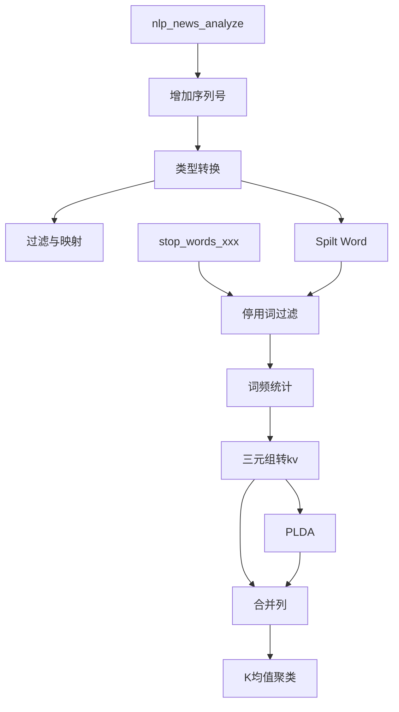

## Machine Learning
机器学习，ML

人类擅长并行处理（模式识别），但不擅长顺序处理（逻辑验证），而机器正好相反。人类看一眼就知道眼前是一只猫，而机器需学习上千万张猫的图片来提取特征，才能进行判断。

机器学习是指机器通过统计学算法，对大量历史数据进行学习，进而利用生成的经验模型指导业务。

目前机器学习主要应用在以下场景：

- 营销类场景：商品推荐、用户群体画像或广告精准投放。
- 金融类场景：贷款发放预测、金融风险控制、股票走势预测或黄金价格预测。
- 社交网络服务关系挖掘场景：微博粉丝领袖分析或社交关系链分析。
- 文本类场景：新闻分类、关键词提取、文章摘要或文本内容分析。
- 非结构化数据处理场景：图片分类或图片文本内容提取。
- 其它各类预测场景：降雨预测或足球比赛结果预测。

机器学习包括传统机器学习和深度学习。传统机器学习分为以下几类：

有监督学习（Supervised Learning）：每个样本都有对应的期望值，通过搭建模型，实现从输入特征向量到目标值的映射。例如解决回归和分类问题。

无监督学习（Unsupervised Learning）：所有样本没有目标值，期望从数据本身发现一些潜在规律。例如解决聚类问题。

增强学习（Reinforcement Learning）：相对比较复杂，系统和外界环境不断交互，根据外界反馈决定自身行为，达到长期目标最优化。例如阿尔法围棋和无人驾驶。

#### 预处理工具组件

##### 采样与过滤

随机采样、加权采样、过滤与映射、分层采样

##### 数据合并

JOIN、合并列、合并行

##### 拆分
##### 增加序列号
##### 格式转换
##### 类型转换
##### 缺失值填充
##### 归一化
##### 标准化
##### KV to Table
##### Table to KV

#### 特征工程

##### 特征重要性评估

线性模型特征重要性、随机森林特征重要性评估

GBDT特征重要性

**线性模型特征重要性**

计算线性模型的特征重要性，包括线性回归和二分类逻辑回归，支持稀疏和稠密数据格式。

##### 特征变换

特征尺度变换、特征异常平滑、异常检测模块、特征离散、主成分分析PCA

**特征尺度变换**

特征尺度变换算法对数值类特征进行尺度变换。

阿里云的特征尺度变换算法组件支持对稠密或稀疏的数值类特征进行常见的尺度变换（log2、log10、ln、abs及sqrt等）。

**特征异常平滑**

将输入特征中包含异常的数据平滑到一定区间。

特征平滑算法只是将异常取值的特征值修正为正常值，本身不过滤或删除任何记录，输入数据维度和条数均不变。

1. ZScore平滑 
如果特征分布遵循正态分布，则噪音一般集中在-3×alpha和3×alpha之外，ZScore是将该范围的数据平滑到[-3×alpha,3×alpha]之间。

例如，某个特征遵循正态分布，均值为0，标准差为3。因此，-10的特征值会被识别为异常而修正为-3×3+0，即为-9。同理10会被修正为3×3+0，即为9。

2. 百分位平滑 
用于将分布不在[minPer, maxPer]的数据平滑到minPer和maxPer这两个分位点。

例如，age特征取值0～200，设置minPer为0，maxPer为50%，则不在0～100的特征取值都会被修正成0或100。

3. 阈值平滑 
用于将分布不在[minThresh, maxThresh]的数据平滑到minThresh和maxThresh这两个数据点。

例如，age特征取值0～200，设置minThresh为10，maxThresh为80，则不在0～80的特征取值都会被修正成0或80。

**异常检测**

异常检测用于检测连续值和枚举值类特征的数据，帮助挖掘数据中的异常点。

异常检测的方法包括箱型图（Box-plot）和AVF（Attribute Value Frequency）：

- 箱型图用于检测连续值类特征的数据，根据箱线图最大值和最小值检测异常特征。
- AVF用于检测枚举值类特征的数据，根据枚举特征的取值频率及阈值检测异常特征。

**特征离散**

特征离散算法是将连续性特征按照一定的规则进行离散化。

阿里云的离散模块的功能如下：

- 支持稠密数值类特征离散。
- 支持等频离散和等距离离散等无监督离散。
	+ 说明 无监督离散的特征离散默认为等距离离散。
- 支持基于Gini增益离散和基于熵增益离散等有监督离散。
	+ 说明 标签类特征离散必须是枚举类型STRING或BIGINT类型。

**主成分分析PCA**

主成分分析PCA是研究如何通过少数主成分揭示多个变量间的内部结构，考察多个变量间相关性的一种多元统计方法。PCA从原始变量中导出少数主成分，使它们尽可能多地保留原始变量的信息，并且彼此间互不相关，作为新的综合指标。

阿里云的主成分分析算法组件实现了降维和降噪的功能，仅支持稠密数据格式。

**奇异值分解**

奇异值分解（Singular Value Decomposition）是线性代数中一种重要的矩阵分解，是矩阵分析中正规矩阵求对角化的推广。在信号处理、统计学等领域有重要应用。

奇异值分解的公式为X = U S V’。

##### 特征选择

过滤式特征选择

特征重要性过滤为线性特征重要性、GBDT特征重要性和随机森林特征重要性等组件提供过滤功能，过滤TopN的特征。

##### 特征生成

特征编码、one-hot编码

**one-hot编码**

one-hot编码，也称独热编码，对于每一个特征，如果它有m个可能值，那么经过独热编码后，就变成了m个二元特征。此外，这些特征互斥，每次只有一个激活。因此，经过独热编码后数据会变成稀疏的，输出结果也是KV的稀疏结构。

**特征编码**

将非线性特征通过GBDT编码成线性特征。

特征编码由决策树和Ensemble算法挖掘新特征的一种策略，特征来自一个或多个特征组成的决策树叶子结点的one-hot结果。

例如，有三棵树，共有12个叶子结点。根据树的顺序依次编码为0~11号特征，其中第一棵树的叶子结点占据0~3号特征，第二棵树占据4~7号特征，第三棵树占据8~11号特征。该编码策略可以有效转换GBDT非线性特征为线性特征。

#### 统计分析

数据视图、全表统计、经验概率密度图、百分位、箱线图、散点图、直方图（多字段）、离散值特征分析

假设检验：卡方拟合性检验、卡方独立性检验、协方差、相关关系矩阵、双样本T检验、单样本T检验、正态检验、洛伦茨曲线、皮尔森系数

直方图（Histogram）又称质量分布图，是一种统计报告图，由一系列高度不等的纵向条纹或线段表示数据分布的情况。 通常，横轴表示数据类型，纵轴表示分布情况。

皮尔森系数是一种线性相关系数，用于反映两个变量线性相关程度的统计量。机器学习中，皮尔森系数用于计算输入表或分区两列（数值列）的Pearson相关系数，计算结果输出至输出表。

百分位是统计学术语，用于计算数据表列数据的百分位。一组数据从小到大排序，并计算相应数据的百分位，则某百分位所对应数据的值称为该百分位的百分位数。

百分位仅支持Bigint，Double和Datetime类型的数据计算百分位。
计算百分位时，空列跳过。如果全部为空列，则报错。

离散值特征分析统计离散特征的分布情况。包括gini，entropy，gini gain，information gain，information gain ratio等指标。

计算每个离散值对应的gini，entropy，计算单列对应的gini gain，information gain，information gain ratio。

单样本T检验旨在检验某个变量的总体均值与某个指定值之间是否存在显著差异，其检验的样本必须总体服从正态分布。

卡方拟合性检验适用于变量为类别型变量的场景，旨在检验单个多项分类型变量在各分类间的实际观测次数与理论次数是否一致，其零假设为观测次数与理论次数无差异。

在概率论和统计学中，协方差用于衡量两个变量的总体误差。方差是协方差的一种特殊情况，即当两个变量是相同的情况。期望值分别为E(X) =μ与E(Y)=ν的两个实数，其随机变量X与Y之间的协方差定义为：cov(X, Y)=E((X - μ) (Y - ν))。

经验概率密度图采用经验分布和内核分布两种算法：

- 经验分布
当无法得到精确的参数分布时，需要从数据中估计概率分布从而得到非参数分布。更详细介绍请参见经验分布。

- 内核分布
算法中采用内核分布估计样本数据的概率密度，与直方图类似，都是代表样本数据的分布情况。区别是内核分布通过叠加各部分数据而产生连续平滑的分布曲线，而直方图呈现的是离散地数据分布。采用内核分布时，非样本数据点的概率密度并非0，而是各样本抽样点在内核分布下的概率密度的加权叠加。当前算法的内核分布采用高斯分布。

箱形图是一种用作显示一组数据分散情况的统计图。它主要用于反映原始数据分布的特征，还可以进行多组数据分布特征的比较。

散点图是指在回归分析中，数据点在直角坐标系平面上的分布图。

相关系数算法用于计算一个矩阵中每列之间的相关系数，取值范围为[-1,1]。系统计算时，count数按两列间同时非空的元素个数计算，两两列之间可能不同。

正态性检验通过观测值判断总体是否服从正态分布，是统计判决中重要的一种特殊的拟合优度假设检验。本文为您介绍PAI-Studio提供的正态检验。

正态检验组件由Anderson-Darling Test、Kolmogorov-Smirnov Test和QQ图检验方法组成。

- Anderson-Darling Test是将样本数据的经验累积分布函数与假设数据呈正态分布时期望的分布进行比较。如果实测差异足够大，该检验将否定总体呈正态分布的假设。
- Kolmogorov-Smirnov是比较两个观测值分布的检验方法。
- QQ图通过把测试样本数据的分位数与已知分布相比较，从而来检验数据的分布情况。在样本量＞1000时，系统会采样进行计算并输出QQ图，因此图中的数据点不一定覆盖所有样本。

通过洛伦兹曲线，您可以直观地看到一个国家或地区收入分配状况。洛伦兹曲线的弯曲程度反映了收入分配的不平等程度。弯曲程度越大，收入分配越不平等。

画一个矩形，矩形的高用于衡量社会财富的百分比，将之分为N等份，每一等分为1/N的社会总财富。在矩形的长上，将所有家庭从最贫者到最富者自左向右排列，也分为N等分，第一个等份代表收入最低的1/N的家庭。在这个矩形中，将每1/N的家庭所有拥有的财富的占比累积起来，并将相应的点画在图中，便得到了一条曲线就是洛伦兹曲线。

#### 常用机器学习算法
##### 二分类

GBDT二分类、PS-SMART二分类训练、线性支持向量机、逻辑回归二分类

AdaBoost二分类、PS逻辑回归二分类（输出表/输出模型）、CART树二分类

**线性支持向量机**

支持向量机SVM（Support Vector Machine）是基于统计学习理论的一种机器学习方法，通过寻求结构风险最小化，提高学习机泛化能力，从而实现经验风险和置信范围最小化。

**逻辑回归二分类**

逻辑回归（Logistic Regression）是经典的二分类算法，广泛应用于广告及搜索场景。

支持稀疏及稠密数据格式。

**GBDT二分类**

GBDT（Gradient Boosting Decesion Tree）二分类算法的原理是设置阈值，如果特征值大于阈值，则为正例，反之为负例。

**PS-SMART二分类**

参数服务器PS（Parameter Server）致力于解决大规模的离线及在线训练任务，SMART（Scalable Multiple Additive Regression Tree）是GBDT（Gradient Boosting Decesion Tree）基于PS实现的迭代算法。PS-SMART支持百亿样本及几十万特征的训练任务，可以在上千节点中运行。同时，PS-SMART支持多种数据格式及直方图近似等优化技术。

**PS逻辑回归二分类**

PS逻辑回归支持千亿样本、十亿特征的二分类训练任务。

PS逻辑回归二分类组件的目标列仅支持数值类型，且0表示负例，1表示正例。如果表数据是STRING类型，则需要进行类型转换。例如，分类目标是Good/Bad字符串，需要转换为1/0。

如果数据是KV格式，则特征ID必须为正整数，特征值必须为实数。如果特征ID为字符串类型，则需要序列化。如果特征值为类别型字符串，需要进行特征离散化等特征工程处理。

##### 多分类

PS-SMART多分类、K近邻、逻辑回归多分类、随机森林、朴素贝叶斯

AdaBoost多分类

**PS-SMART多分类**

虽然PS-SMART多分类组件支持数十万特征任务，但是消耗资源大且运行速度慢，可以使用GBDT类算法进行训练。GBDT类算法适合直接使用连续特征进行训练，除需要对类别特征进行One-Hot编码（筛除低频特征）外，不建议对其他连续型数值特征进行离散化。

PS-SMART算法会引入随机性。例如，data_sample_ratio及fea_sample_ratio表示的数据和特征采样、算法使用的直方图近似优化及局部Sketch归并为全局Sketch的顺序随机性。虽然多个Worker分布式执行时，树结构不同，但是从理论上可以保证模型效果相近。如果您在训练过程中，使用相同数据和参数，多次得到的结果不一致，属于正常现象。

如果需要加速训练，可以增大计算核心数。因为PS-SMART算法需要所有服务器获得资源后，才能开始训练，所以集群忙碌时，申请较多资源会增加等待时间。

**K近邻**

K近邻算法进行分类的原理是针对预测表的每行数据，从训练表中选择与其距离最近的K条记录，将这K条记录中类别数量最多的类，作为该行的类别。

**逻辑回归多分类**

**随机森林**

随机森林是一个包括多决策树的分类器，其分类结果由单棵树输出类别的众数决定。

**朴素贝叶斯**

朴素贝叶斯是一种基于独立假设的贝叶斯定理的概率分类算法。

##### 聚类

K均值聚类、DBSCAN

**K均值聚类**

K均值聚类首先随机选择K个对象作为每个簇的初始聚类中心，然后计算剩余对象与各簇中心的距离，将其分配至距离最近的簇，再重新计算每个簇的聚类中心。该算法假设聚类对象为空间向量，且以各聚类内部的均方误差和最小为目标，不断地进行计算迭代，直到准则函数收敛。

如果使用夹角余玹距离，则某些聚类可能为空，即聚类数量小于K。因为初始化的K个中心点（向量）可能是平行向量，所以按顺序遍历中心点时，样本不会被分配至后面的中心点（平行向量）。建议通过外部输入中心表的方式，使用线下准备好的K个中心点。

如果输入表中存在NULL或空值，则系统报错Algo Job Failed-System Error-Null feature value found。建议使用缺省值进行填充。
使用稀疏格式数据作输入时，如果最大列编号超过2,000,000，则系统报错Algo Job Failed-System Error-Feature count can’t be more than 2000000。建议从0或1开始，重新对列进行编号。

如果中心点模型过大导致写失败，则系统报错Algo Job Failed-System Error-kIOError:Write failed for message: comparison_measure。建议将稀疏矩阵的列从0或1开始，重新编号。如果模型规模col\*centerCount>27,0000,000，则只能通过命令行的方式，去除modelName参数，再重新执行聚类。

如果输入表的列名存在SQL关键字，则系统报错FAILED: Failed Task createCenterTable:kOtherError:ODPS-0130161:[1,558] Parse exception - invalid token ‘,’, expect ‘’)’’。

**DBSCAN**

DBSCAN（Density Based Spatial Clustering of Applications with Noise）是一种基于数据密度的无监督聚类算法。在聚类空间的特定区域内，使用指定的半径阈值和数量阈值，筛选核心点及其领域点。通过密度可达及密度相连理论，实现数据点聚类

##### 回归

GBDT回归、线性回归、PS线性回归、PS-SMART回归

**GBDT回归**

梯度渐进回归树GBDT（Gradient Boosting Decesion Tree）是一种迭代决策树算法，适用于线性及非线性回归场景。

**线性回归**

线性回归（Linear Regression）是分析因变量和多个自变量之间的线性关系模型。

**PS线性回归**

**PS-SMART回归**

##### 关联推荐

##### 推荐算法

graphSage

ALSTopK 预测
ALS 评分预测
ALS 矩阵分解

交替最小二乘ALS（Alternating Least Squares）算法的原理是对稀疏矩阵进行模型分解，评估缺失项的值，从而得到基本的训练模型。在协同过滤分类方面，ALS算法属于User-Item CF（Collaborative Filtering），兼顾User和Item项，也称为混合CF。

FM 预测
FM 训练

FM（Factorization Machine）算法兼顾特征之间的相互作用，是一种非线性模型，适用于电商、广告及直播的推荐场景。

FM(fx、ml、yl、yz、wx、zq)预测
FM(fx、ml、yl、yz、wx、zq)训练

PS-LR预测

FastText分类预测
FastText分类训练

Embedding提取

向量召回评估

DeepFM

基于item的协同过滤etrec，输入为两列，输出为item之间的相似度TopN。

##### 评估

二分类评估、回归模型评估、聚类模型评估、混淆矩阵、多分类评估

**二分类评估**

二分类评估通过计算AUC、KS及F1 Score指标，输出KS曲线、PR曲线、ROC曲线、LIFT Chart及Gain Chart。

**回归模型评估**

回归模型评估是指基于预测结果和原始结果，评估回归算法模型的优劣性，从而输出评估指标及残差直方图。

**聚类模型评估**

基于原始数据和聚类结果，评估聚类模型的优劣性，从而输出评估指标。

评估指标Calinski-Harabasz又称VRC（Variance Ratio Criterion），其计算公式如下：
$$
VRC_k=\frac{SS_B}{SS_W}\times\frac{(N-k)}{(k-1)}\\
SS_B=\sum\limits_{i=1}^{k}n_i{\Vert{m_i-m}\Vert}^2\\
SS_W=\sum\limits_{i=1}^{k}\sum\limits_{x\in{c_i}}{\Vert{x-m_i}\Vert}^2\\

\begin{array}{lll}
SS_B：聚类之间的方差。\\
SS_W：聚类内的方差。\\
k：聚类中心点的数量。\\
m_i：聚类的中心点。\\
m：输入数据的均值。\\
x：数据点。\\
c_i：第i个聚类。\\
N：记录的总数量。\\
k：聚类中心点的数量。\\
\end{array}
$$

**混淆矩阵**

混淆矩阵（Confusion Matrix）适用于监督学习，与无监督学习中的匹配矩阵对应。在精度评价中，混淆矩阵主要用于比较分类结果和实际测量值，可以将分类结果的精度显示在一个矩阵中。

**多分类评估**

多分类评估是指基于分类模型的预测结果和原始结果，评估多分类算法模型的优劣性，从而输出评估指标（例如Accuracy、Kappa及F1-Score）。

##### 预测

CART树预测

#### 垂直应用领域

##### 文本分析

Spilt Word
Spilt Word(生成模型)
三元组转kv
字符串相似度
字符串相似度-topN
停用词过滤
ngram-count
文本摘要
关键词抽取
文本拆分
语义向量距离
条件随机场
条件随机场预测
文章相似度
词频统计
TF-IDF
PMI
Doc2Vec
PLDA
Word2Vec

**文本分类**

以原始文本作为输入，输出类别标签。

基于BERT的文本分类模型、传统深度文本分类（例如TextCNN）模型及PAI自研的DGCNN模型。

**Spilt Word**

词法分析，对指定列的内容进行分词，分词后的各个词语之间以空格分隔。配置词性标注或语义标注相关参数，将分词、词性标注和语义标注结果一同输出，其中词性标注分隔符为正斜线（/），语义标注分隔符为竖线（|）。

Split Word支持中文淘宝分词（TAOBAO_CHN）和互联网分词（INTERNET_CHN）。

**三元组转kv**

三元组转kv算法组件用于将三元组表（row,col,value）转换为kv表（row,[col_id:value]）。

三元组（row,col,value）表的数据类型为“XXD”或“XXL”，“X”表示任意数据类型，“D”表示DOUBLE数据类型，“L”表示BIGINT数据类型。转换为kv表后，row和value的数据类型与原始输入数据类型一致，col_id是BIGINT数据类型，并输出col的索引表映射到col_id。

**字符串相似度**

计算字符串相似度是机器学习领域的一个基本操作，主要用于信息检索、自然语言处理和生物信息学等领域。

字符串相似度算法有Levenshtein（Levenshtein Distance）、lCS（Longest Common SubString）、SSK（String Subsequence Kernel）、Cosine（Cosine）和Simhash_Hamming五种相似度计算方式，支持两两计算。

Levenshtein支持计算距离和相似度。
距离在参数中表示为levenshtein。
相似度=1-距离。在参数中表示为levenshtein_sim。

lCS支持计算距离和相似度。
距离在参数中表示为lcs。
相似度=1-距离。相似度在参数中表示为lcs_sim。

SSK支持计算相似度，在参数中表示为ssk。

Cosine支持计算相似度，在参数中表示为cosine。

Simhash_Hamming，其中SimHash算法是把原始的文本映射为64位的二进制指纹，Hamming Distance则是计算二进制指纹在相同位置上不同字符的个数，支持计算距离和相似度。

距离在参数中表示为simhash_hamming。
相似度=1-距离/64.0。相似度在参数中表示为simhash_hamming_sim。

**BERT文本向量化**

BERT文本向量化是以原始文本作为输入，系统提取特征后输出一个向量序列。还可以将CLS输出的向量经过Dense后的向量作为整个句子的句向量。

BERT文本向量化组件以原始文本作为输入，端到端输出经过BERT后的向量。

**停用词过滤**

停用词过滤算法是文本分析中的一个预处理方法，用于过滤分词结果中的噪声（例如的、是或啊）。

停用词过滤算法的两个输入桩为输入表和停用词表。输入表为需要过滤停用词的表。停用词表的格式为一列，每行对应一个停用词。

**ngram-count**

ngram-count是语言模型训练其中一个步骤。在词的基础上生成n-gram，并统计在全部语料集上，对应n-gram的个数。其结果是全局的个数，而不是单个文档的个数。

**文本摘要**

文本摘要是文献中简单连贯的短文，能够全面准确地反映该文献的中心思想。自动文摘利用计算机自动从原始文献中提取摘要内容。

文本摘要算法基于TextRank，通过提取文档中已存在的句子形成摘要。

**关键词抽取**

关键词抽取是自然语言处理中的重要技术之一，具体是指从文本中将与这篇文章意义相关性最强的一些词抽取出来。该算法基于TextRank，根据PageRank算法思想，利用局部词汇之间关系（共现窗口）构建网络，并计算单词的重要性，最终选取权重大的作为关键词。

常用流程如下：

- 原始语料
- 分词
- 使用词过滤
- 关键词抽取

**句子拆分**

将一段文本按标点进行句子拆分。该组件主要用于文本摘要前的预处理，将一段文本拆分成一句一行的形式。

**语义向量距离**
基于算法语义向量结果（如Word2Vec生成的词向量），计算给定的词（或者句子）的扩展词（或者扩展句），即计算其中某一向量距离最近的向量集合。其中一个用法是，基于Word2Vec生成的词向量结果，根据输入的词返回最为相似的词列表。

**词频统计**

词频统计是指输入一些字符串（手动输入或者从指定的文件读取），用程序来统计这些字符串中总共有多少个单词，每个单词出现的次数。单词的总数（即为Total）为不重复的单词数总和。本文为您介绍PAI-Studio提供的词频统计。

词频指词的频率，即词在一定的语料中出现的次数。请在对文档进行分词的基础上，按行保序输出对应文档ID列（docId）对应的词，统计指定文档ID列对应文档内容（docContent）的词频。

**TF-IDF**

TF-IDF（Term Frequency-Inverse Document Frequency）是一种用于资讯检索与文本挖掘的常用加权技术。通常在搜索引擎中应用，可以作为文件与用户查询之间相关程度的度量或评级。

TF词频（Term Frequency）是指某一个给定的词语在该文件中出现的次数。IDF反文档频率（Inverse Document Frequency）是指如果包含词条的文档越少，IDF越大，则说明词条的类别区分能力越强。

TF-IDF是一种统计方法，用于评估字词或文件的重要程度。例如：

在文件集中的字词会随着出现次数的增加呈正比增加趋势。
在语料库中的文件会随着出现频率的增加呈反比下降趋势。

TF-IDF组件基于词频统计算法的输出结果（而不是基于原始文档），计算各词语对于各文章的TF-IDF值。

**PLDA**

主题模型用于在一系列文档中发现抽象主题（topic）的一种统计模型。

LDA（Latent Dirichlet allocation）是一种主题模型，它可以按照概率分布的形式给出文档集中每篇文档的主题。LDA也是一种无监督学习算法，在训练时您无需手工标注的训练集，仅需要在文档集中指定主题的数量K即可（K即为PLDA参数topic）。

LDA首先由David M. Blei、Andrew Y. Ng和Michael I. Jordan于2003年提出，在文本挖掘领域应用于文本主题识别、文本分类和文本相似度计算等方面。

**Word2Vec**

Word2Vec，通过训练，将词映射为K维度空间向量，且支持对表示词的向量进行操作并和语义相对应。输入为单词列或词汇表，输出为词向量表和词汇表。

**Doc2Vec**

将文章映射为向量。输入为词汇表，输出为文档向量表、词向量表或词汇表。

**条件随机场**

条件随机场CRF（conditional random field）是给定一组输入随机变量条件下，另一组输出随机变量条件的概率分布模型，其特点是假设输出随机变量构成马尔可夫随机场。条件随机场可用于不同的预测问题，主要应用于标注问题中，其中最典型的是线性链（linear chain）。

**文章相似度**

文章相似度是在字符串相似度的基础上，基于词，计算两两文章或者句子之间的相似度。文章或句子需要以空格分割，计算方式和字符串相似度类似。

**互信息**

互信息（Mutual Information）是信息论里一种有用的信息度量，它可以看成是一个随机变量中包含的另一个随机变量的信息量，或者说是一个随机变量由于已知另一个随机变量而减少的不确定性。

本算法统计若干文章中所有词的共现情况，计算两两之间的PMI（point mutual information）。其定义为：PMI(x,y)=ln(p(x,y)/(p(x)p(y)))=ln(#(x,y)D/(#x#y))。其中，#(x,y)为pair(x,y)的count数，D为pair的总数。若x、y在同一个窗口出现，那么#x+=1; #y+=1;#(x,y)+=1。

##### 搜索推荐
##### 图像处理

**数据转tfrecord**

在分布式集群数据加速方案中，通过把输入数据转为tfrecord，供给下游的图像分类、图像检测、OCR或图像自监督模型训练。

数据转tfrecord算法组件可以将标注生成的数据转换成tfrecord格式，从而用于图像类模型训练。

**图像分类训练**

各种主流的卷积神经网络

- Resnet系列： resnet-v1、resnet-v2。
- Inception系列：inception_v1、inception_v2、inception_v3、inception_v4。
- Vgg系列：vgg_16、vgg_19。
- MobileNet系列：mobilenet-v1、mobilenet-v2、mobilenet-v3。
- EfficientNet

**图像检测训练**

各种主流的检测模型

- SSD
- Faster-RCNN
- RFCN
- YoloV5

**图像分割训练**

各种主流的卷积神经网络

- 语义分割：DeepLab-V3
- Instance分割：Mask-RCNN

**视频分类训练**

主流的3D卷积神经网络

- X3D系列的X3D-XS
- X3D-M
- X3D-L。

**图像自监督训练**

对于相似图像匹配场景或图像检索场景，可用图像自监督训练算法将原始的尚未标注的图像直接进行训练，从而获得用于图像特征提取的模型。

图像自监督算法提供主流自监督算法，包括MoCo v2、SwAV及MoBY。在无需标注的情况下对图像进行模型训练，从而获得模型用于图像特征提取。该特征广泛应用于图像匹配（去重）、图像检索、推荐系统等场景。 此外，上述算法还可以搭配不同的网络结构使用，例如ResNet50、 ViT及Swin-Transformer。

**端到端的文字识别训练**

通过端到端的文字识别训练算法获得的训练模型，能够检测识别任意角度、任意形状的文字。

阿里云端到端文字识别算法组件能够检测识别任意角度、任意形状的文字，并且提供基于阿里巴巴的大数据进行训练的预训练模型，开发者只需要提供几百到1000张图片即可完成对应场景的文字检测识别。

##### 音视频处理

ASR

##### 网络分析

**k-Core**

一个图的k-Core是指反复去除度小于或等于k的节点后，所剩余的子图。如果一个节点存在于k-Core，而在 (k+1)-Core中被移去，那么此节点的核数（coreness）为k。因此所有度为1的节点的核数必然为0，节点核数的最大值被称为图的核数。

**单源最短距离**

单源最短路径使用Dijkstra算法，给定起点，输出该点和其他所有节点的最短路径。

**PageRank**

PageRank起源于网页的搜索排序，即使用网页的链接结构计算每个网页的等级排名。

PageRank的基本思路是：

- 如果一个网页被其他多个网页指向，这说明该网页比较重要或者质量较高。
- 除考虑网页的链接数量，还考虑网页本身的权重级别，以及该网页有多少链接链到其它网页。
- 对于用户构成的人际网络，除了用户本身的影响力之外，边的权重也是重要因素之一。

例如新浪微博的某个用户，会更容易影响粉丝中关系比较亲密的家人、同学、同事等，而对陌生的弱关系粉丝影响较小。在人际网络中，边的权重等价于用户与用户之间的关系强弱指数。

带链接权重的PageRank公式为：

$$
W(A)=(1-d) + d * (\sum\limits_iW(i)*C(Ai))\\
\begin{array}{lll}
W(i)：节点i的权重。\\
C(Ai)：链接权重。\\
d：阻尼系数。\\
W(A)：算法迭代稳定后的节点权重，即每个用户的影响力指数。\\
\end{array}
$$

**标签传播聚类**

标签传播算法LPA（Label Propagation Algorithm）是基于图的半监督学习方法，其基本思路是节点的标签（community）依赖其相邻节点的标签信息，影响程度由节点相似度决定，并通过传播迭代更新达到稳定。

图聚类是根据图的拓扑结构，进行子图的划分，使得子图内部节点的连接较多，子图之间的连接较少。

**标签传播分类**

标签传播分类为半监督的分类算法，原理为用已标记节点的标签信息去预测未标记节点的标签信息。

标签传播分类算法的基本思路：在算法执行过程中，每个节点的标签按相似度传播给相邻节点，在节点传播的每一步，每个节点根据相邻节点的标签来更新自己的标签。与该节点相似度越大，其相邻节点对其标注的影响权值越大，相似节点的标签越趋于一致，其标签就越容易传播。在标签传播过程中，保持已标注数据的标签不变，使其像一个源头把标签传向未标注数据。最终，当迭代过程结束时，相似节点的概率分布也趋于相似，可以划分到同一个类别中，从而完成标签传播过程。

**Modularity**

Modularity是一种评估社区网络结构的指标，用来评估网络结构中划分出来社区的紧密程度，通常0.3以上是比较明显的社区结构。

**最大联通子图**

在无向图G中，若从顶点A到顶点B有路径相连，则称A和B是连通的。在图G中存在若干子图，如果其中每个子图中所有顶点之间都是连通的，但在不同子图间不存在顶点连通，那么称图G的这些子图为最大连通子图。

**点聚类系数**

在无向图G中，计算每一个节点周围的稠密度，星状网络稠密度为0，全联通网络稠密度为1。

**边聚类系数**

边聚类系数算法是指在无向图G中，计算每一条边周围的稠密度。

**计数三角形**

计数三角形是指在无向图G中，输出所有三角形。

**树深度**

对于众多树状网络，树深度组件能够输出每个节点的所处深度和树ID。

##### 金融板块

**分箱**

通过分箱组件可以进行特征离散化，即将连续的数据进行分段，使其变为多个离散化区间。分箱组件支持等频分箱、等宽分箱及自动分箱。

**数据转换模块**

通过数据转换模块可以对数据进行归一化、离散化、Index化或WOE转换。

**评分卡训练**
**评分卡预测**

对原始数据根据评分卡训练组件产出的模型结果进行预测打分。

**样本稳定指数（PSI）**

样本稳定指数（PSI）是衡量样本变化所产生的偏移量的一种重要指标，通常用于衡量样本的稳定程度。

样本稳定指数（PSI）通常用于衡量样本的稳定程度。例如样本在两个月份之间的变化是否稳定，如果变量的PSI值小于0.1，则表示变化不太显著。如果PSI值在0.1到0.25之间，则表示有比较显著的变化。如果PSI值大于0.25，则表示变量变化比较剧烈，需要特殊关注。

通过画图的方法可以衡量样本在不同时刻的稳定性，即将待比较的变量离散化成N个分箱，然后计算样本分别在各个分箱中的数量及比例，并以柱状图的形式呈现出来。

该方法可以直观地查看某个变量在两批样本上是否有剧烈的变化，但是无法量化，从而无法实现对样本稳定性的自动监控。因此PSI就显得尤为重要，PSI的计算公式如下。
$PSI=\sum((Actual\%-Expected\%)\times(ln(\frac{Actual\%}{Expected\%})))$

##### 时间序列

x13-arima
x13-auto_arima

**x13-arima**

x13-arima是基于开源X-13ARIMA-SEATS封装的针对季节性调整的Arima算法。

Arima全称为自回归积分滑动平均模型（Autoregressive Integrated Moving Average Model），是由博克思（Box）和詹金斯（Jenkins）于70年代初提出的著名时间序列预测方法，所以又称为box-jenkins模型、博克思-詹金斯法。

**x13-auto-arima**

x13-auto-arima包括自动ARIMA模型选择程序，主要基于TRMO（1996）及后续修订中实施的Gomez和Maravall（1998）的程序。

x13_auto_arima选择过程如下：

default model esitmation

当frequency = 1时，默认模型是(0,1,1) 。

当frequency > 1时，默认模型是(0,1,1)(0,1,1)。

identication of dierencing orders

如果设置了diff 和 seasonalDiff，则跳过此步骤。

使用Unit root test (wiki )确定差分d，和季节性差分D。

identication of ARMA model orders

根据 BIC(wiki) 准则选择最合适的模型， 其参数maxOrder、maxSeasonalOrder在此步骤起作用。

comparison of identified model with default model

使用Ljung-Box Q statistic(wiki) 比较模型，如果两个模型均是不可接受的，则使用(3,d,1)(0,D,1)模型。

final model checks

#### 深度学习：DNN、CNN、LSTM/RNN、自定义算法

### 学习策略
粗略地说，有三种学习策略：

1. 监督学习(Supervised Learning) 
最简单的方法。在已知结果的（足够大的）测试数据集之下使用。学习过程如下：

    1. 首先对数据集进行处理。
    2. 将输出与已知结果进行比较。
    3. 调整神经网络并重复测试。

如深度学习

2. 半监督学习（Semi-supervised Learning）

3. 无监督的学习(Un-supervised Learnin) 
如果没有现成的测试数据，并且可以从所需的行为中获得某种成本函数，则非常有用。成本函数告诉神经网络离目标有多远。然后，网络可以在处理实际数据时动态调整其参数。

4. 强化学习(Reinforced Learning) 
'胡萝卜加大棒'的方法。如果神经网络产生连续动作，可以使用这个方法。用奖励来激励网络向正确的方向调整，如果走错了路则会受到惩罚。慢慢的网络会倾向于选择正确的动作，并避免错误的行为。

#### 半监督学习

#### Artificial Neural Network
人工神经网络 (ANN)是指由大量的处理单元(神经元) 互相连接而形成的复杂网络结构，是对人脑组织结构和运行机制的某种抽象、简化和模拟。ANN 以数学模型模拟神经元活动，是基于模仿大脑神经网络结构和功能而建立的一种信息处理系统。

ANN 不需要知道输入输出之间的确切关系，不需大量参数，只需要知道引起输出变化的非恒定因素，即非常量性参数。因此与传统的数据处理方法相比，神经网络技术在处理模糊数据、随机性数据、非线性数据方面具有明显优势，对规模大、结构复杂、信息不明确的系统尤为适用。

由 Minsley 和 Papert 提出的多层前向神经元网络(也称多层感知器)是目前最为常用的网络结构。

人工神经网络具有自学习、自组织、自适应以及很强的非线性函数逼近能力，拥有强大的容错性。它可以实现仿真、二值图像识别、预测以及模糊控制等功能。

在运用人工手段模仿人类智能行为的研究上有两种主导思想，即结构主义和功能主义。功能主义成了传统人工智能理论的研究基础。结构主义从分析人脑神经网络的微观结构入手，抓住人脑结构的主要特征，即简单的非线性神经元之间复杂而又灵活的连接关系，深刻揭示了人脑认识过程，创立了人工神经网络的理论。

人工神经元最简单模型－感知机，给平面中的点分类。

ANN 已经成功应用于许多领域的问题：

- 通过模式识别对数据进行分类。“ 这张照片上有一棵树吗？”
- 当测试数据与通常模式不匹配时，检测异常或新奇。 “卡车司机是否有可能入睡？”　“这些地震事件是正常地面运动还是大地震的预兆？”
- 通过过滤，分离或压缩等来处理信号。
- 估测目标函数 - 对预测和预报很有用。 “这场风暴会变成龙卷风吗？”

- 人脸识别
- 语音识别
- 手写体识别
- 文本翻译
- 智力游戏（通常是棋盘游戏或纸牌游戏）
- 自动驾驶汽车和机器人
- 还有太多应用！

##### 神经元：构建神经网络的基本模块
任何人工神经网络的基本成分是人工神经元。 它们不仅以其生物学对应物命名，而且还以我们大脑中神经元的行为为模型。

就像生物神经元具有接收信号的树突，处理信号的细胞体，以及将信号发送到其他神经元的轴突一样，人工神经元具有多个输入通道，信号处理单元和一个可以通向众多人工神经单元的输出通道。

神经元内部的计算实际上是多么简单。 确定地有以下三个处理步骤：

1. 每个输入信号都按一定比例放大或缩小

    当信号进入时，它会乘以分配给该特定输入的权重值。也就是说，如果神经元有三个输入，那么它们三个的权重都可以单独调整。在学习期间，神经网络可以基于最后测试结果的误差来调整权重。

2. 累加所有信号

    在这一步骤中，将修正过的输入信号相加得到单个值(总和）。在此步骤中，还要给总和添加偏移量。这种偏移称为偏差(bias)。神经网络还在学习中调整偏差。

    神奇的事情就是在这个时候发生的！一开始，所有神经元都被赋予随机权重和随机偏差。在每次学习迭代之后，权重和偏差逐渐位移，以使下一次结果更接近期望的输出。这样，神经网络逐渐习得我们所需要的模型状态。

3. 激活

    最后，神经元计算的结果变成输出信号。这是通过将结果馈送到激活函数（也称为传递函数）来完成的。

##### 激活函数
在计算机网络中，一个节点的激活函数定义了该节点在给定的输入或输入的集合下的输出。标准的计算机芯片电路可以看作是根据输入得到开（1）或关（0）输出的数字电路激活函数。这与神经网络中的线性感知机的行为类似。然而，只有非线性激活函数才允许这种网络仅使用少量节点来计算非平凡问题。 在人工神经网络中，这个功能也被称为传递函数。

Sigmoid函数是一个在生物学中常见的S型函数，也称为S型生长曲线。在信息科学中，由于其单增以及反函数单增等性质，Sigmoid函数常被用作神经网络的激活函数，将变量映射到0,1之间。

sigmoid函数也叫Logistic函数，用于隐层神经元输出，取值范围为(0,1)，它可以将一个实数映射到(0,1)的区间，可以用来做二分类。在特征相差比较复杂或是相差不是特别大时效果比较好。Sigmoid作为激活函数有以下优缺点：
优点：平滑、易于求导。
缺点：激活函数计算量大，反向传播求误差梯度时，求导涉及除法；反向传播时，很容易就会出现梯度消失的情况，从而无法完成深层网络的训练。

sigmoid函数和tanh函数是研究早期被广泛使用的2种激活函数。两者都为S 型饱和函数。 当sigmoid 函数输入的值趋于正无穷或负无穷时，梯度会趋近零，从而发生梯度弥散现象。sigmoid函数的输出恒为正值，不是以零为中心的，这会导致权值更新时只能朝一个方向更新，从而影响收敛速度。tanh 激活函数是sigmoid 函数的改进版，是以零为中心的对称函数，收敛速度快，不容易出现 loss 值晃动，但是无法解决梯度弥散的问题。2个函数的计算量都是指数级的，计算相对复杂。softsign 函数是 tanh 函数的改进版，为 S 型饱和函数，以零为中心，值域为（−1，1）。

损失函数与随机梯度下降方法

反向传播与梯度下降

链式求导法则

过拟合问题
一个好的经验法则是，训练数据点的总数至少应该是神经网络中参数数的2到3倍，尽管数据样本的精确数量取决于手头的特定模型。一般来说，参数较多的模型被认为具有较高的容量，为了获得对未知测试数据的泛化能力，模型需要更多的数据。在机器学习中，过拟合的概念常被理解为偏差和方差之间的权衡。

##### 感知机 Perceptron
激活函数的最基本形式是一个简单的二元方程，这个方程只有两个可能的结果。

尽管看起来如此简单，但该函数有一个非常复杂的名称：Heaviside Step 函数。 如果输入为正或零，则此函数返回1;对于任何负输入，此函数返回0。 使用这样的激活函数的神经元被称为感知机。

神经网络的基础模型是感知机，因此神经网络也可以叫做多层感知机(Multi-layer Perceptron)，简称MLP。单层感知机叫做感知机，多层感知机(MLP)≈人工神经网络(ANN)。

#### Convolutional Neural Network
卷积神经网络，CNN

#### RNN
递归神经网络，RNN

#### Deep Neural Network
深度神经网络，DNN

#### Graph Neural Network
图神经网络，GNN

#### Graph Convolutional Neural Network
图卷积神经网络，GCNN

#### （Gated Graph Neural Network）
门控图神经网络，GGNN

统计的模型如马尔可夫随机场（Markov Random Field--MRF）

神经网络模型

全连接神经网络（Fully Connected Neural Network）以及多层神经网络，都是传统神经网络，由于参数多计算(学习这些参数)的复杂度很高，因此实用性不强没有得到足够的重视。直到近些年卷积神经网络的横空出世，深度神经网络（Deep Neural Network）已基本秒杀其他一切传统方法，缺点是需要有标签的庞大的数据集以及训练时间过长（计算机资源）。

深度学习，即卷积神经网络模型（Convolutional Neural Networks）。

偏微分方程（变分法等），最后通常转化成一个能量函数最小化的优化问题。

机器学习里最重要的四类问题（按学习的结果分类）：

预测（Prediction）--可以用如回归（Regression）等模型。

聚类（Clustering）--如K-means方法。

分类（Classification）--如支持向量机法（Support Vector Machine, SVM）。

降维（Dimensional reduction）--如主成份分析法（Principal component analysis (PCA)--纯矩阵运算）。

为什么要降维呢？因为通常情况下，一个自变量x就是一个维度，机器学习中动不动就几百万维，运算复杂度非常高。但是几百万维度里，可能其中几百维就包含了95%的信息。因此为了运算效率，舍弃5%的信息，我们需要从几百万维中找出这包含95%信息的维度。这就是降维问题。

### 智能标注

文本、图像、视频、音频打标

#### 文本类

##### 实体识别
实体识别NER标注任务是对文本中的具体内容进行框选，并添加标签。

应用场景：商品主体词识别、新闻主体词识别等。

##### 文本分类
文本分类（Text Classification）是指在一组固定的分类标签集合中，找到与输入文本内容相匹配的一个或多个分类标签，并将其分配给该输入文本。该分类模板支持单标签和多标签。

应用场景：新闻推荐、知识管理及垃圾信息过滤等。

##### 实体关系
实体关系（三元组和Knowledge Graph）标注任务，主要是针对知识图谱的场景，对实体词之前的关系添加标签。

应用场景：知识图谱等。

#### 图像类

##### 图片OCR
图片OCR（Optical Character Recognition）任务首先将输入图像中的文字转换为文本格式，再根据文字信息类别对输入图像进行分组。

应用场景：证件识别、票据识别、车牌识别及银行卡识别等。

##### 目标检测
目标检测（Object Detection）标注任务是对图像中的具体目标进行定位，常用矩形框工具。

应用场景：车辆检测、行人检测及图片搜索等。

##### 图像分类
图像分类（Image Classification）是指从一组固定的分类标签集合中，找到与输入图像内容相匹配的一个或多个分类标签，并将其分配给该输入图像。该模板支持单标签和多标签图像分类。

应用场景：图片分类、拍照识图、图片搜索及内容推荐等。

#### 视频类

##### 视频分类
视频分类（Video Classification）是指在一组固定的分类标签集合中，找出与输入视频内容相匹配的一个或多个分类标签，并将其分配给该输入视频。该模板支持单标签和多标签分类。

应用场景：视频监控、直播推荐及短视频推荐等。

#### 音频类

##### 音频分类
音频分类（Audio Classification）是指从一组固定的分类标签集合中，找到与输入音频内容相匹配的一个或多个分类标签，并将其分配给该输入音频。该模板支持单标签和多标签音频分类。

应用场景：场景声音分类等。

##### 音频分割
音频分割（Audio segmentation）是指将一段音频通过识别后，利用波形图将音频分割成多段，并匹配上不同的标签内容。

应用场景：对话内容分析等。

##### 音频识别
音频识别ASR是指将一段音频识别为文本内容，同时可以进行相应标签的匹配。

应用场景：方言识别等。

### 文本分析
随着互联网的发展，网络上已经有大量文本数据的积累。传统的互联网媒体的分类以及打标等操作主要通过人肉处理的方式进行，效率低、成本高。

文本分析常见需求：文本分类、文本打标签（长文本、短文本）、文本情感分析等。

#### 文本分类

文本分类常见算法：

1. 基于语义向量距离：将文本按照语义映射成高维向量特征，通过向量距离进行分类。
2. 基于文本关键词、主题：首先提取文本的关键词、主题等信息，然后通过这些词语的对照关系进行分类。

数据源->分词->过滤->词向量生成->LDA->聚类

##### 主题模型-LDA算法

$$
\rho(词语|文档)=\sum_{主题}\rho(词语|主题)*\rho(主题|文档)
$$

##### KMeans算法

1. 设置分类K值
2. 设置初始质心簇的位置
3. 不断迭代寻找新分类簇的簇心点
4. 收敛完成聚类

##### 新闻自动分类

#### 文本打标签

#### 文本情感分析
