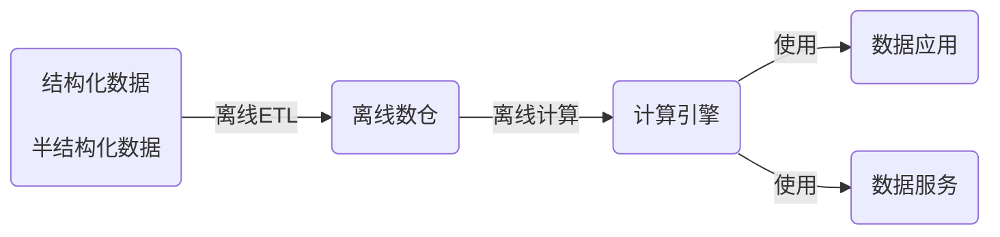
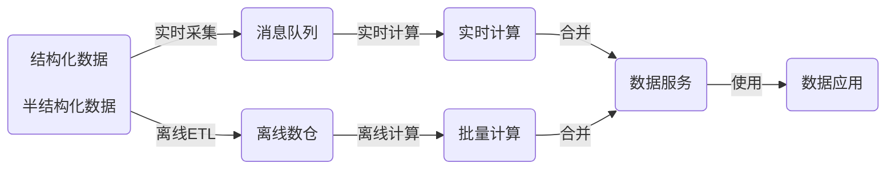
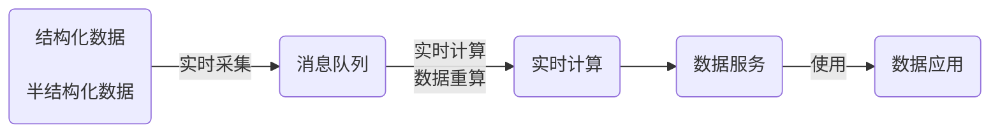
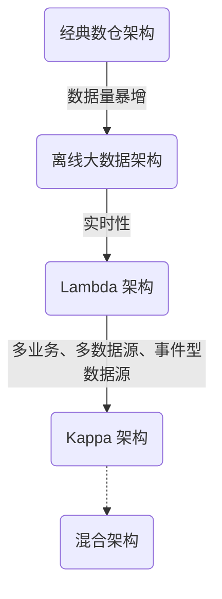

## Data Warehouse
数据仓库

数据仓库是一个面向主题的（Subject Oriented）、集成的（Integrated）、相对稳定的（Non-Volatile）、反映历史变化的（Time Variant）数据集合。用于支持管理决策（Decision Making Support）。

数据仓库是伴随着企业信息化发展起来的，在企业信息化的过程中，随着信息化工具的升级和新工具的应用，数据量变得越来越大，数据格式越来越多，决策要求越来越苛刻，数据仓库技术也在不停的发展。

早期数据仓库构建主要指的是把企业的业务数据库如 ERP、CRM、SCM 等数据按照决策分析的要求建模并汇总到数据仓库引擎中，其应用以报表为主，目的是支持管理层和业务人员决策（中长期策略型决策）。

随着IT技术走向互联网、移动化，数据源变得越来越丰富，在原来业务数据库的基础上出现了非结构化数据，比如网站 log，IoT 设备数据，APP 埋点数据等，这些数据量比以往结构化的数据大了几个量级，对 ETL 过程、存储都提出了更高的要求。

互联网的在线特性也将业务需求推向了实时化，随时根据当前客户行为而调整策略变得越来越常见，比如大促过程中库存管理，运营管理等（即既有中远期策略型，也有短期操作型）；同时公司业务互联网化之后导致同时服务的客户剧增，有些情况人工难以完全处理，这就需要机器自动决策，比如欺诈检测和用户审核。

总结来看，对数据仓库的需求可以抽象成两方面：实时产生结果、处理和保存大量异构数据。


### 概要

数据仓库的定义：数据管理、存储、计算、建模的方法论，是一种过程处理方法。<br>
数据仓库的特点：面向主题的、集成的、稳定的、反映历史变化。<br>
数据仓库的组成：元数据、数据建模、实现代码、血缘关系、规范准则。<br>
数仓在整个数据体系中的位置：数据采集->数据接入->数据仓库->数据报表/数据分析/数据挖掘。<br>

#### 数据库和数据仓库的对比
从逻辑、概念层面来看数据仓库和数据库其实是一样的，它们都是通过某种数据库软件，基于某种数据模型来组织管理数据。但是他们的侧重点不同：通常数据库更关注业务交易处理（OLTP）层面；而数据仓库关注数据分析（OLAP）层面。

数据库和数据仓库的本质区别在于传统的数据库是一个存储引擎，而数据仓库是一套数据组织和应用的方法论，是需要很多的支持系统来协助（包含类似数据库这样的存储系统），最后达到支持分析决策的目的。

数据库一般都会追求响应速度、数据的一致性等特点。所以我们在设计数据库模型上一般都会遵循一些范式，比如1NF、2NF、3NF等。目的都是为了减少数据的冗余和相应速度等。

而数据仓库强调的是数据分析的效率，复杂查询的响应速度和数据之间的相关性之类的分析。所以，数据仓库一般都是多维模型，有较多的数据冗余，但是同时查询的效率也会提高。从某种意义上来说，数据仓库就是反范式设计的数据库。

|数据库|数据仓库|备注|
|---|---|---|
|用于记录状态，面向事务|用于分析决策，面向主题|
|服务业务系统，作为数据源|服务数据分析师等|
|一般存储最新状态的业务数据|存储历史数据|数据仓库存在部分清除机制，历史数据并不是永久保存|
|严格遵循范式，避免冗余|为了方便使用故意引入部分冗余|
|数据量偏小|大数据量|分布式数据库也能存储大量数据|
|承载体一般为mysql、oracle等传统的关系型数据库|承载体一般为hive、greenplum等|也有部分使用oracle等传统数据库做数仓的|

| 数据库 | 数据仓库 |
| -------------------- | -------------------------- |
| 表结构相对复杂       | 表结构相对简单             |
| 存储结构相对紧凑     | 存储结构相对松散           |
| 较少数据冗余         | 较多数据冗余               |
| 一般读、写都有优化   | 一般只有读优化             |
| 相对简单的读、写查询 | 相对复杂的读查询           |
| 单次操作数据量较少   | 单次操作涉及数据量相对较大 |

#### 为什么要建设数仓

建立数据仓库最重要的目的就是要把事务处理与数据分析解耦合，增加系统的可拓展性。

数据仓库就是为了业务处理和数据分析解耦的。如果我们不解耦合，也就是我们的数据分析直接来自业务库，导致在数据分析的时候存在几个问题。

**结构复杂、大规模查询慢**

业务库一般是针对业务专门设计的，为了减少数据冗余，会遵循3NF范式。这就导致表之间的关系其实是一张网，通过外键、主键之类的进行关联。我们很多的业务表信息都是一堆编码，通过编码去关联详情。

此时如果对于一些数据分析涉及到具体详情信息，我们可能需要通过多层关联才能得到，这就给分析数据增加很大的复杂度。

此时如果每个表都是大表，数据量都很大，那么我们就可以带薪蹲坑了（编码一分钟，执行九分钟）。

如果在同一个数据库还能勉强做，如果数据满天星，mysql、mongo、hdfs哪里都有的话，老实说这个时候做关联操作实在是有心无力。


**脏数据乱入**

业务库一般存储了所有的业务数据，与此同时，在业务过程中可能由于各种原因比如网络、宕机、数据校验不完善等原因，会产生一些列脏数据。

脏数据包括但不限于以下情况：

| 脏数据情况  | 案例 |
| --- | --- |
| 核心数据为空 | uid、odrId为null |
| 数据不合法   |手机号码、身份证、日期之类的不符合规范 |
| 数据错误 |   比如在线时长、登陆时长超过合理值 |
| 数据重复 |   数据重复上报 |

如果我们在做数据分析的时候还得对于所有的脏数据再处理一次，那这效率。

如果拿数据支持管理决策，一不小心因为处理脏数据不完善，搞个错误数据，误了公司决策，这个锅你背得动吗？


**无法反应历史**

业务库一般的不会存储很长历史的数据以保证响应速度，这样对于我们需要做一个历史衍变、趋势之类的数据分析，单靠业务库就已经很难实现了。

而历史趋势对于我们后续的决策是很有借鉴意义。比如营收，销量之类的做个历史分析


##### 建设数仓可以带来以下的好处：

1. 方便沟通交流
2. 提高排查问题的效率
3. 提高数据开发的效率
    - 代码复用、表复用等
    - 复杂任务解耦（分散到各层或层内的不同表上）
4. 提高数据质量，避免数据口径不一致等问题
5. 减少存储成本和计算成本

无数仓或者数仓建设得不好常见的问题：

1. 数据资产模糊
    - 不知道有什么数据、该找谁要数据
    - 数据如何生成和更新的
    - 数据存储和计算资源评估缺乏必要的信息
2. 数据质量低
    - 字段命名不规范、口径不一致
    - 条件的过滤和规则等的理解差异带来的算法不一致
3. 重复建设
    - 无中间表或中间表建设的差，每次从原始数据取，数据开发周期长
    - 代码臃肿
    - 最底层取数据，带来存储和计算资源的浪费，同时滋生数据口径不一致问题
4. 底层轻微的改变对上层影响巨大
    - 业务数据轻微改动
    - 底层逻辑轻微改动
    - 底层数据异常
5. 问题定位难，周期长
    - 上下游依赖混乱
    - 任务上线容易，下线难，生命周期难以管理
    - 复杂问题耦合在一起
6. 频繁的临时性需求
    - 多维度拆解：OLAP、培养提高需求提出人的能力
    - 同质类似的小需求：即席查询、固化、详细自查、模板、培养提高需求提出人的能力

问题痛点和解决方案


虽然数仓建设能带来诸多的益处，但其是一个庞大复杂耗时的工程，需要一些支持系统的配合，比如说元数据管理系统、调度系统等，而且也并不是所有的业务一开始都要建设数仓，要根据业务发展所处的状态和未来的发展趋势以及分析决策的复杂性等综合评判。

虽然数仓可以不做，但是要做的话一定要提前规划和基本的规范制定，自由散漫野性生长的数仓有不如无。

#### 数仓应用
数仓建设的本质目的是支撑分析决策，那分析决策依赖什么样的数据，数仓建设是如何保障这些数据高效正确产出的。面向业务数据指标建设数仓，同时兼顾其它可能的扩展情况，是数仓建设的整体思路。

数仓对上层数据应用的支持主要体现在三个方面：业务监控数据（大盘数据洞察）、数据挖掘(用户画像、推荐等）、数据分析(业务诊断、提升优化等)。其中按支持的优先级来分，首先就是业务监控数据，然后是数据分析、再然后数据挖掘。这也是数据应用由浅到深的递进。

##### 业务监控支持
业务监控支持是数仓建设的主要也是最基础的服务对象。首先梳理业务，划分出业务主题，然后梳理指标体系，自顶向下的建设，主要体现在以下方面：

- 对指标体系进行分类，根据指标分类来建设数据主题集市
- 对维度进行抽象，根据抽象出的维度来建设维表，然后根据维表的生成方式配置调度策略、是线下录入还是线上生成，更新机制是日定时更新还是触发更新，以及维度的变化情况等

##### 数据分析支持
业务监控搭建起来了数据体系的基本框架，然而还是框架外的灵活数据分析需求，比如OLAP多维分析、交叉分析等，从这个角度来讲，数仓建设的中间表的维度一定要足够丰富，模型的选择上为了兼顾使用的方便性，一般以星型模型为主，同时尽可能的采用维度退化的方式，另外单主题多行为阶段的漏斗宽表和多主题多行为的宽表也能为数据分析提供极大的便利。

##### 数据挖掘支持
数据挖掘支持是在数据分析的基础上对用户行为宽表的要求更进步强化了，同时要兼顾维度的丰富性。

### 数据仓库架构

从1990年 Inmon 提出数据仓库概念到今天，数据架构经历了最初的传统数仓架构——离线数仓库——离线大数据架构、Lambda 架构、Kappa 架构以及 Flink 的火热带出的流批一体架构，数据架构技术不断演进，本质是在往流批一体的方向发展，让用户能以最自然、最小的成本完成实时计算。

##### 传统数仓架构



这是比较传统的一种方式，结构或半结构化数据通过离线ETL定期加载到离线数据，之后通过计算引擎取得结果，供前端使用。这里的离线数仓+计算引擎，通常是使用大型商业数据库来承担，例如Oracle、DB2、Teradata等。

##### 离线大数据架构

随着数据规模的不断增大，传统数仓方式难以承载海量数据。随着大数据技术的普及，采用大数据技术来承载存储与计算任务。当然，也可以使用传传统数据库集群或MPP架构数据库来完成。例如Hadoop+Hive/Spark、Oracle RAC、GreenPlum等。

数据源通过离线的方式导入到离线数据中。下游应用根据业务需求选择直接读取 DM 或加一层数据服务，比如 MySQL 或 Redis。数据仓库从模型层面分为三层：

ODS，操作数据层，保存原始数据；

DWD，数据仓库明细层，根据主题定义好事实与维度表，保存最细粒度的事实数据；

DM，数据集市/轻度汇总层，在 DWD 层的基础之上根据不同的业务需求做轻度汇总；

典型的数仓存储是 HDFS/Hive，ETL 可以是 MapReduce 脚本或 HiveSQL。


##### Lambda架构



随着业务的发展，随着业务的发展，人们对数据实时性提出了更高的要求。此时，出现了Lambda架构，其将对实时性要求高的部分拆分出来，增加条实时计算链路。从源头开始做流式改造，将数据发送到消息队列中，实时计算引擎消费队列数据，完成实时数据的增量计算。

与此同时，批量处理部分依然存在，实时与批量并行运行。最终由统一的数据服务层合并结果给于前端。一般是以批量处理结果为准，实时结果主要为快速响应。

**Lambda 架构问题**

1. 同样的需求需要开发两套一样的代码：这是 Lambda 架构最大的问题，两套代码不仅仅意味着开发困难（同样的需求，一个在批处理引擎上实现，一个在流处理引擎上实现，还要分别构造数据测试保证两者结果一致），后期维护更加困难，比如需求变更后需要分别更改两套代码，独立测试结果，且两个作业需要同步上线。

2. 资源占用增多：同样的逻辑计算两次，整体资源占用会增多，多出实时计算这部分

##### Kappa架构



Lambda架构，一个比较严重的问题就是需要维护两套逻辑。一部分在批量引擎实现，一部分在流式引擎实现，维护成本很高。此外，对资源消耗也较大。而后面诞生的Kappa架构，正是为了解决上述问题。其在数据需要重新处理或数据变更时，可通过历史数据重新处理来完成。

方式是通过上游重放完成(从数据源拉取数据重新计算)。Kappa架构最大的问题是流式重新处理历史的吞吐能力会低于批处理，但这个可以通过增加计算资源来弥补。

Lambda 架构虽然满足了实时的需求，但带来了更多的开发与运维工作，其架构背景是流处理引擎还不完善，流处理的结果只作为临时的、近似的值提供参考。后来随着 Flink 等流处理引擎的出现，流处理技术很成熟了，这时为了解决两套代码的问题，LickedIn 的 Jay Kreps 提出了 Kappa 架构。

Kappa 架构可以认为是 Lambda 架构的简化版（只要移除 lambda 架构中的批处理部分即可）。

在 Kappa 架构中，需求修改或历史数据重新处理都通过上游重放完成。

Kappa 架构最大的问题是流式重新处理历史的吞吐能力会低于批处理，但这个可以通过增加计算资源来弥补。

##### 混合架构

上述架构各有其适应场景，有时需要综合使用上述架构组合满足实际需求。当然这也必将带来架构的复杂度。用户应根据自身需求，有所取舍。在一般大多数场景下，是可以使用单一架构解决问题。现在很多产品在流批一体、海量、实时性方面也有非常好的表现，可以考虑这种“全能手”解决问题。



在真实的场景中，很多时候并不是完全规范的 Lambda 架构或 Kappa 架构，可以是两者的混合，比如大部分实时指标使用 Kappa 架构完成计算，少量关键指标（比如金额相关）使用 Lambda 架构用批处理重新计算，增加一次校对过程。

Kappa 架构并不是中间结果完全不落地，现在很多大数据系统都需要支持机器学习（离线训练），所以实时中间结果需要落地对应的存储引擎供机器学习使用，另外有时候还需要对明细数据查询，这种场景也需要把实时明细层写出到对应的引擎中。后面案例会涉及到。

### 实时数仓和离线数仓

#### 实时数仓建设思路

计算框架选型：storm/flink等实时计算框架，强烈推荐flink，其『批量合一』的特性及活跃的开源社区，有逐渐替代spark的趋势。

数据存储选型：首要考虑查询效率，其次是插入、更新等问题，可选择apache druid，不过在数据更新上存在缺陷，选型时注意该问题频繁更新的数据建议不要采用该方案。当然存储这块需要具体问题具体分析，不同场景下hbase、redis等都是可选项。

实时数仓分层：为更好的统一管理数据，实时数仓可采用离线数仓的数据模型进行分层处理，可以分为实时明细层写入druid等查询效率高的存储方便下游使用；轻度汇总层对数据进行汇总分析后供下游使用。

数据流转方案：实时数仓的数据来源可以为kafka消息队列，这样可以做到队列中的数据即可以写入数据湖用于批量分析，也可以实时处理，下游可以写入数据集市供业务使。

##### 菜鸟实时数仓案例

基于业务系统的数据，数据模型采用中间层的设计理念，建设仓配实时数仓；计算引擎，选择更易用、性能表现更佳的实时计算作为主要的计算引擎；数据服务，选择天工数据服务中间件，避免直连数据库，且基于天工可以做到主备链路灵活配置秒级切换；数据应用，围绕大促全链路，从活动计划、活动备货、活动直播、活动售后、活动复盘五个维度，建设仓配大促数据体系。

不管是从计算成本，还是从易用性，还是从复用性，还是从一致性等等，都必须避免烟囱式的开发模式，而是以中间层的方式建设仓配实时数仓。与离线中间层基本一致，将实时中间层分为两层。

第一层 DWD 公共实时明细层。实时计算订阅业务数据消息队列，然后通过数据清洗、多数据源 join、流式数据与离线维度信息等的组合，将一些相同粒度的业务系统、维表中的维度属性全部关联到一起，增加数据易用性和复用性，得到最终的实时明细数据。这部分数据有两个分支，一部分直接落地到 ADS，供实时明细查询使用，一部分再发送到消息队列中，供下层计算使用。

第二层 DWS 公共实时汇总层。以数据域+业务域的理念建设公共汇总层，与离线数仓不同的是，这里汇总层分为轻度汇总层和高度汇总层，并同时产出，轻度汇总层写入 ADS，用于前端产品复杂的 olap 查询场景，满足自助分析和产出报表的需求；高度汇总层写入 Hbase，用于前端比较简单的 kv 查询场景，提升查询性能，比如实时大屏等。

##### 美团点评基于Flink的实时数仓平台实践

最底层是收集层，这一层负责收集用户的实时数据，包括 Binlog、后端服务日志以及 IoT 数据，经过日志收集团队和 DB 收集团队的处理，数据将会被收集到 Kafka 中。这些数据不只是参与实时计算，也会参与离线计算。

收集层之上是存储层，这一层除了使用 Kafka 做消息通道之外，还会基于 HDFS 做状态数据存储以及基于 HBase 做维度数据的存储。

存储层之上是引擎层，包括 Storm 和 Flink。实时计算平台会在引擎层为用户提供一些框架的封装以及公共包和组件的支持。

在引擎层之上就是平台层了，平台层从数据、任务和资源三个视角去管理。

架构的最上层是应用层，包括了实时数仓、机器学习、数据同步以及事件驱动应用等。

从功能角度来看，美团点评的实时计算平台主要包括作业和资源管理两个方面的功能。其中，作业部分包括作业配置、作业发布以及作业状态三个方面的功能。

在作业配置方面，则包括作业设置、运行时设置以及拓扑结构设置；

在作业发布方面，则包括版本管理、编译/发布/回滚等；

作业状态则包括运行时状态、自定义指标和报警以及命令/运行时日志等。

在资源管理方面，则为用户提供了多租户资源隔离以及资源交付和部署的能力。

#### 实时数仓与离线数仓的对比

首先，从架构上，实时数仓与离线数仓有比较明显的区别，实时数仓以 Kappa 架构为主，而离线数仓以传统大数据架构为主。Lambda 架构可以认为是两者的中间态。

其次，从建设方法上，实时数仓和离线数仓基本还是沿用传统的数仓主题建模理论，产出事实宽表。另外实时数仓中实时流数据的 join 有隐藏时间语义，在建设中需注意。

最后，从数据保障看，实时数仓因为要保证实时性，所以对数据量的变化较为敏感。在大促等场景下需要提前做好压测和主备保障工作，这是与离线数据的一个较为明显的区别。

综上，实时数仓主要解决数据时效性问题，结合机器学习框架可以处理实时推荐、实时获取广告投放效果等智能化业务场景。实时数仓的建设应早日提上日程，未来企业对数据时效性的要求会越来越高，实时数仓会很好的解决该问题。


### 数仓建设
##### 基本概念
- 业务板块：比数据域更高维度的业务划分方法，适用于庞大的业务系统。
- 维度：维度建模由Ralph Kimball提出。维度模型主张从分析决策的需求出发构建模型，为分析需求服务。维度是度量的环境，是我们观察业务的角度，用来反映业务的一类属性。属性的集合构成维度，维度也可以称为实体对象。例如，在分析交易过程时，可以通过买家、卖家、商品和时间等维度描述交易发生的环境。
- 属性（维度属性）：维度所包含的表示维度的列称为维度属性。维度属性是查询约束条件、分组和报表标签生成的基本来源，是数据易用性的关键。
- 度量：在维度建模中，将度量称为事实，将环境描述为维度，维度是用于分析事实所需要的多样环境。度量通常为数值型数据，作为事实逻辑表的事实。
- 指标：指标分为原子指标和派生指标。原子指标是基于某一业务事件行为下的度量，是业务定义中不可再拆分的指标，是具有明确业务含义的名词，体现明确的业务统计口径和计算逻辑，例如支付金额。
- 原子指标=业务过程+度量。
- 派生指标=时间周期+修饰词+原子指标，派生指标可以理解为对原子指标业务统计范围的圈定。
- 业务限定：统计的业务范围，筛选出符合业务规则的记录（类似于SQL中where后的条件，不包括时间区间）。
- 统计周期：统计的时间范围，例如最近一天，最近30天等（类似于SQL中where后的时间条件）。
- 统计粒度：统计分析的对象或视角，定义数据需要汇总的程度，可理解为聚合运算时的分组条件（类似于SQL中的group by的对象）。粒度是维度的一个组合，指明您的统计范围。例如，某个指标是某个卖家在某个省份的成交额，则粒度就是卖家、地区这两个维度的组合。如果您需要统计全表的数据，则粒度为全表。在指定粒度时，您需要充分考虑到业务和维度的关系。统计粒度常作为派生指标的修饰词而存在。

#### 流程分解
数据仓库设计的具体流程，从业务需求分析、逻辑设计、物理设计、数仓的初始化方法以及更新方法。

数据调研（业务调研、需求分析）、数据域划分、构建总线矩阵（明确业务过程所属数据域、明确维度和业务过程关系）、明细模型设计（构建DIM、构建DWD）、明确统计指标（原子指标、派生指标、构建DWS、构建ADS）、数仓优化、结果验证

从数仓的组成上来分以下几个模块进行数仓的建设：

##### 数仓规划策略
分层、分线、分主题（数据集市）

在阿里巴巴的数据体系中，我们建议将数据仓库分为三层，自下而上为：数据引入层（ODS，Operation Data Store）、数据公共层（CDM，Common Data Model）和数据应用层（ADS，Application Data Service）。

- 数据引入层ODS

存放未经过处理的原始数据至数据仓库系统，结构上与源系统保持一致，是数据仓库的数据准备区。

在ODS层分为三部分：数据准备区、离线数据和准实时数据区。

ODS层到DIM层的ETL（萃取（Extract）、转置（Transform）及加载（Load））处理，处理完成后会同步到所有存储系统。ODS层和DWD层会放在数据中间件中，供下游订阅使用。而DWS层和ADS层的数据通常会落地到在线存储系统中，下游通过接口调用的形式使用。

- 数据公共层CDM

又称通用数据模型层，包括DIM维度表、DWD和DWS，由ODS层数据加工而成。主要完成数据加工与整合，建立一致性的维度，构建可复用的面向分析和统计的明细事实表，以及汇总公共粒度的指标。

公共维度层（DIM）：基于维度建模理念思想，建立整个企业的一致性维度。降低数据计算口径和算法不统一风险。公共维度层的表通常也被称为逻辑维度表，维度和维度逻辑表通常一一对应。

公共汇总粒度事实层（DWS）：以分析的主题对象作为建模驱动，基于上层的应用和产品的指标需求，构建公共粒度的汇总指标事实表，以宽表化手段物理化模型。构建命名规范、口径一致的统计指标，为上层提供公共指标，建立汇总宽表、明细事实表。公共汇总粒度事实层的表通常也被称为汇总逻辑表，用于存放派生指标数据。

明细粒度事实层（DWD）：以业务过程作为建模驱动，基于每个具体的业务过程特点，构建最细粒度的明细层事实表。可以结合企业的数据使用特点，将明细事实表的某些重要维度属性字段做适当冗余，即宽表化处理。明细粒度事实层的表通常也被称为逻辑事实表。

- 数据应用层ADS

存放数据产品个性化的统计指标数据。根据CDM与ODS层加工生成。

**层次调用规范**

ADS应用层优先调用数据仓库公共层数据。如果已经存在CDM层数据，不允许ADS应用层跨过CDM中间层从ODS层重复加工数据。CDM中间层应该积极了解应用层数据的建设需求，将公用的数据沉淀到公共层，为其他数据层次提供数据服务。同时，ADS应用层也需积极配合CDM中间层进行持续的数据公共建设的改造。避免出现过度的ODS层引用、不合理的数据复制和子集合冗余。总体遵循的层次调用原则如下：

- ODS层数据不能直接被应用层任务引用。如果中间层没有沉淀的ODS层数据，则通过CDM层的视图访问。CDM层视图必须使用调度程序进行封装，保持视图的可维护性与可管理性。
- CDM层任务的深度不宜过大（建议不超过10层）。
- 一个计算刷新任务只允许一个输出表，特殊情况除外。
- 如果多个任务刷新输出一个表（不同任务插入不同的分区），DataWorks上需要建立一个虚拟任务，依赖多个任务的刷新和输出。通常，下游应该依赖此虚拟任务。
- CDM汇总层优先调用CDM明细层，可累加指标计算。CDM汇总层尽量优先调用已经产出的粗粒度汇总层，避免大量汇总层数据直接从海量的明细数据层中计算得出。
- CDM明细层累计快照事实表优先调用CDM事务型事实表，保持数据的一致性产出。
- 有针对性地建设CDM公共汇总层，避免应用层过度引用和依赖CDM层明细数据。

##### 数仓模型思想
ER模型、维度模型、DataVault

在数据仓库中，我们数据的设计模型一般采用星型结构。主要有两部分组成：事实表、维度表.

**事实表**

处于星星结构的中心，存储某种业务各个维度的数据，其中各个维度一般都是对应编码。

比如订单表

**维度表**

维度表可以看作是事实表的发散表，对应着事实表里面的每一个维度。

分析数据的步骤就变成了下面模式化的步骤：

1. 选择分析主题(营收、登陆、时长等)
2. 找相关业务表（即营收事实表、登陆事实表、时间事实表等）
3. 根据分析数据需求确定维度（即确定事实表需要关联的维度表）
4. 计算结果(关联需要的维度后计算结果)

##### 数仓设计原则
下沉、分区、扩展

##### 数据开发实施
代码、调度

**ETL**

数据仓库一般都是通过etl一天更新一次。

在数据仓库中，我们对于模型在设计方面最基本的要求有几点：

- 数据字段类型统一：同一个含义的字段要类型一致（比如，登陆、消费都有用户id，要么都是int、要么都是string）。
- 命名要规范：采用驼峰或分隔要统一，切勿混用，不要出现usrId,musr_id同时出现的情况
- 相同含义的字段保持一致：比如手机号码,决定用msdn 就不要在出现phoneNumber 之类的
- 缺省值处理：对于缺省值或异常错误的数据要有默认值。方便分析的时候删选过滤。
- 字段命名可理解：不要乱七八糟乱取名字，便于理解的名字，最好维护一个英文缩写表。

脏数据对我们数据分析的影响很大，所以对于每一个业务，我们在etl的数据清洗过程中就对脏数据进行处理，同时把业务数据按照我们数据模型设计的规范导入到数据仓库。

**快速复杂查询**

快速复杂查询不是说执行一个复杂的sql能够很快返回结果。而是我们通过建立合理、规范的数据仓库，使得原本在业务库需要通过各种关联才得到的结果在数据仓库中可以用过简单关联和计算就得到到结果。

单靠仓库本身的比如hive查询可能需要花费较长的时间，因为基于mapreduce，是硬伤，但是我们可以通过将构建多维查询比如通过kylin、druid、clickhouse等将所有的查询可能保存下来，达到秒级查询效率也是可以。


##### 数仓规范建设
表命名规范、字段命名、代码开发规范、任务调度规范

**层次命名规范**

对于ODS层项目，建议以ods结尾，例如asale_ods。
对于CDM层项目，建议以cdm结尾，例如asale_cdm。
ADS应用层数据分为两类：
数据报表、数据分析等以bi结尾，例如asale_bi。
数据产品应用以app结尾，例如asale_app。

公共维度汇总层（DIM）维表命名规范：

dim_{业务板块名称/pub}_{维度定义}[_{自定义命名标签}]

pub是与具体业务板块无关或各个业务板块都可公用的维度。例如，时间维度。

举例如下：<br>
公共区域维表dim_pub_area<br>
A公司电商板块的商品全量表dim_asale_itm<br>

公共汇总事实表命名规范：

dws_{业务板块缩写/pub}_{数据域缩写}_{数据粒度缩写}[_{自定义表命名标签缩写}]_{统计时间周期范围缩写}。

关于统计实际周期范围缩写，缺省情况下，离线计算应该包括最近一天（_1d），最近N天（_nd）和历史截至当天（_td）三个表。如果出现_nd的表字段过多需要拆分时，只允许以一个统计周期单元作为原子拆分。即一个统计周期拆分一个表，例如最近7天（_1w）拆分一个表。不允许拆分出来的一个表存储多个统计周期。<br>
对于小时表（无论是天刷新还是小时刷新），都用_hh 来表示。<br>
对于分钟表（无论是天刷新还是小时刷新），都用_mm来表示。<br>

举例如下：<br>
dws_asale_trd_byr_subpay_1d（A电商公司买家粒度交易分阶段付款一日汇总事实表）<br>
dws_asale_trd_byr_subpay_td（A电商公司买家粒度分阶段付款截至当日汇总表）<br>
dws_asale_trd_byr_cod_nd（A电商公司买家粒度货到付款交易汇总事实表）<br>
dws_asale_itm_slr_td（A电商公司卖家粒度商品截至当日存量汇总表）<br>
dws_asale_itm_slr_hh（A电商公司卖家粒度商品小时汇总表）---维度为小时<br>
dws_asale_itm_slr_mm（A电商公司卖家粒度商品分钟汇总表）---维度为分钟<br>

### 最佳实践

#### 表设计最佳实践
维表的设计需要注意：

    + 建议维表单表信息不超过1000万条。
    + 维表与其他表进行Join时，建议您使用Map Join。
    + 避免过于频繁的更新维表的数据。
    
    还需要从下列方面进行考虑：
    - 维表中数据的稳定性。
    例如，A公司电商会员通常不会出现消亡，但会员数据可能在任何时候更新，此时要考虑创建单个分区存储全量数据。如果存在不会更新的记录，您可能需要分别创建历史表与日常表。日常表用于存放当前有效的记录，保持表的数据量不会膨胀；历史表根据消亡时间插入对应分区，使用单个分区存放分区对应时间的消亡记录。
    
    - 维表是否需要垂直拆分。
    如果一个维表存在大量属性不被使用，或由于承载过多属性字段导致查询变慢，则需要考虑对字段进行拆分，创建多个维表。
    
    - 维表是否需要水平拆分。
    如果记录之间有明显的界限，可以考虑拆成多个表或设计成多级分区。
    
    - 核心维表的产出时间。通常有严格的要求。
    
    设计维表的主要步骤如下：
    
    1. 初步定义维度。
    保证维度的一致性。
    
    2. 确定主维表（中心事实表，本教程中采用星型模型）。
    此处的主维表通常是数据引入层（ODS）表，直接与业务系统同步。例如，s_auction是与前台商品中心系统同步的商品表，此表即是主维表。
    
    3. 确定相关维表。
    数据仓库是业务源系统的数据整合，不同业务系统或者同一业务系统中的表之间存在关联性。根据对业务的梳理，确定哪些表和主维表存在关联关系，并选择其中的某些表用于生成维度属性。以商品维度为例，根据对业务逻辑的梳理，可以得到商品与类目、卖家和店铺等维度存在关联关系。
    
    4. 确定维度属性。
    主要包括两个阶段。第一个阶段是从主维表中选择维度属性或生成新的维度属性；第二个阶段是从相关维表中选择维度属性或生成新的维度属性。以商品维度为例，从主维表（s_auction）、类目、卖家和店铺等相关维表中选择维度属性或生成新的维度属性。维度属性的设计需要注意：
        + 尽可能生成丰富的维度属性。
        + 尽可能多地给出富有意义的文字性描述。
        + 区分数值型属性和事实。
        + 尽量沉淀出通用的维度属性。


### 数仓性能优化
针对数仓的性能优化，主要是针对表和数据分布的优化。表设计的最佳实践请参见表设计最佳实践。

##### Hash Clustering
Hash Clustering 表的优势在于可以实现Bucket Pruning优化、Aggregation优化以及存储优化。在创建表时，使用clustered by指定Hash Key后，MaxCompute将对指定列进行Hash运算，按照Hash值分散到各个Bucket里。Hash Key值的选择原则为选择重复键值少的列。Hash Clustering表的使用方法详情请参见修改表的Hash Clustering属性。

如何转化为Hash Clustering表：
```sql
ALTER TABLE table_name [CLUSTERED BY (col_name [, col_name, ...]) [SORTED BY (col_name [ASC | DESC] [, col_name [ASC | DESC] ...])] INTO number_of_buckets BUCKETS]
```
ALTER TABLE语句适用于存量表，在增加了新的聚集属性之后，新的分区将做Hash Clustering存储。

创建完Hash Clustering表后，您可以使用INSERT OVERWRITE语句将源表转化为Hash Clustering表。

Hash Clustering 表存在以下限制：

- 不支持INSERT INTO语句，只能通过INSERT OVERWRITE来添加数据。
- 不支持直接使用tunnel upload命令将数据导入到range cluster表，因为tunnel上传的数据是无序的。

##### 表的其他优化技巧
- 建议您严格遵循表设计规范。
- 中间表的利用：适用于数据量非常大，下游任务很多的表。
- 拆表：适用于个别字段产出极慢的情况，您可以将字段拆分为单独的表。
- 合表：随着数仓的发展，针对业务重叠或重复的表，您可以进行任务和数据合并。
- 拉链表：合理利用拉链表能减少您的存储消耗，关于拉链存储的详情请参见拉链存储。
- 利用MaxCompute表的特殊功能：详情请参见MaxCompute表的高级功能。

### ClickHouse
Yandex（俄罗斯的“百度”）在2016年6月15日开源了一个数据分析的数据库，名字叫做ClickHouse，这对保守俄罗斯人来说是个特大事。更让人惊讶的是，这个列式存储数据库的跑分要超过很多流行的商业MPP数据库软件，例如Vertica。如果你没有听过Vertica，那你一定听过 Michael Stonebraker，2014年图灵奖的获得者，PostgreSQL和Ingres发明者（Sybase和SQL Server都是继承 Ingres而来的）, Paradigm4和SciDB的创办者。Michael Stonebraker于2005年创办Vertica公司，后来该公司被HP收购，HP Vertica成为MPP列式存储商业数据库的高性能代表，Facebook就购买了Vertica数据用于用户行为分析。

ClickHouse实际上来源于内部的几个项目的整合，项目起源于2011年左右。到2013年的时候，ClickHouse的性能就和Vertica大致相同；2015年12月，ClickHouse的数量已经达到11万亿行，数据表有200多列，主集群的服务器数量也从初期的60台到394台。

最大的应用来自于Yandex的统计分析服务Yandex.Metrica，类似于 Google Analytics(GA)，帮助网站或移动应用进行数据分析和精细化运营工具，据称Yandex.Metrica为世界上第二大的网站分析平台。ClickHouse在这个应用中，部署了近四百台机器，每天支持200亿的事件和历史总记录超过13万亿条记录，这些记录都存有原始数据（非聚合数据），随时可以使用SQL查询和分析，生成用户报告。

简单的说，ClickHouse作为分析型数据库，有三大特点：一是跑分快， 二是功能多 ，三是文艺范

1. 跑分快： ClickHouse跑分是Vertica的5倍快：

    ClickHouse性能超过了市面上大部分的列式存储数据库，相比传统的数据ClickHouse要快100-1000X，ClickHouse还是有非常大的优势：

    100Million 数据集：ClickHouse比Vertica约快5倍，比Hive快279倍，比My SQL快801倍

    1Billion 数据集：ClickHouse比Vertica约快5倍，MySQL和Hive已经无法完成任务了


2. 功能多：ClickHouse支持数据统计分析各种场景
    + 支持类SQL查询，
    + 支持繁多库函数（例如IP转化，URL分析等，预估计算/HyperLoglog等）
    + 支持数组(Array)和嵌套数据结构(Nested Data Structure)
    + 支持数据库异地复制部署

3. 文艺范：目前ClickHouse的限制很多，生来就是为小资服务的
    + 目前只支持Ubuntu系统
    + 不提供设计和架构文档，设计很神秘的样子，只有开源的C++源码
    + 不理睬Hadoop生态，走自己的路

ClickHouse是一个面向联机分析处理(OLAP)的开源的面向列式存储的DBMS，简称CK, 与Hadoop, Spark相比，ClickHouse很轻量级。ClickHouse支持线性扩展，简单方便，高可靠性，高容错。


### Druid
### Kudu（+Impala）
### IndexR
### 华为Carbondata
### 腾讯Hermes
### 沈阳延云YDB
