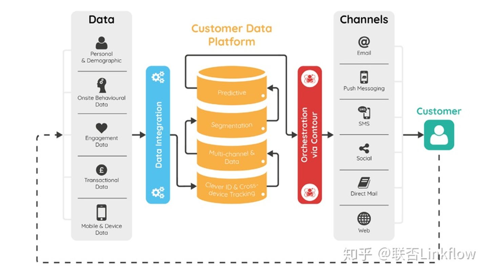
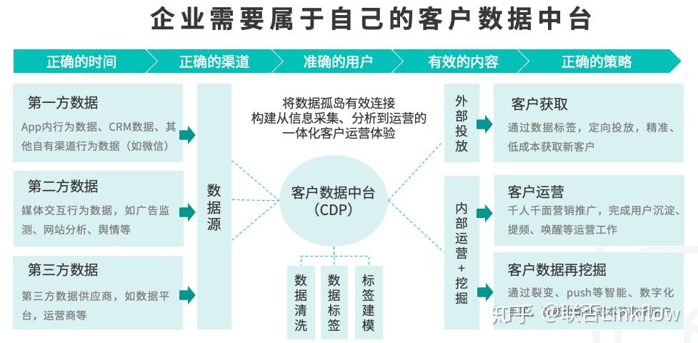
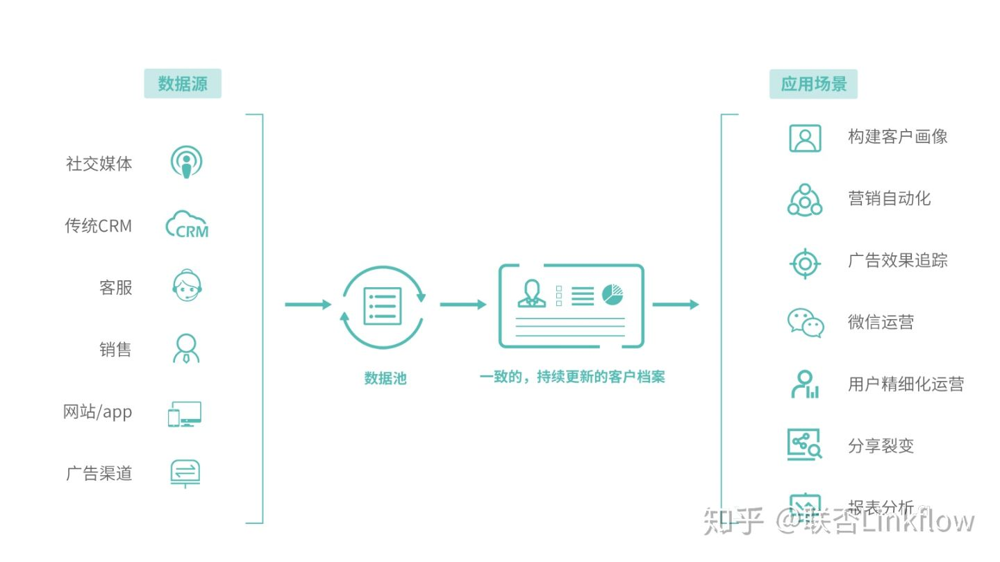
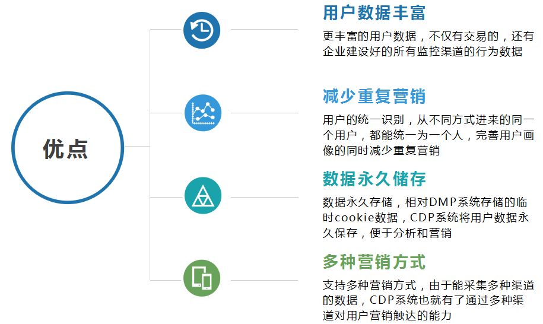
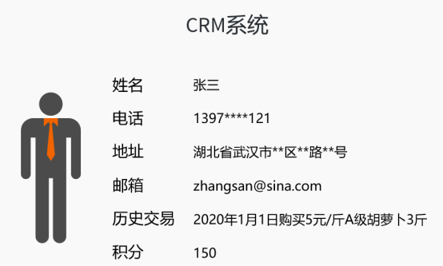
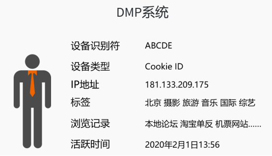
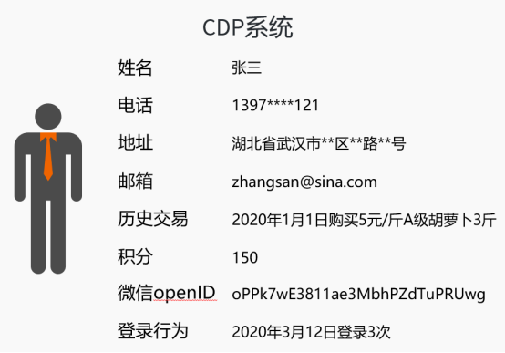
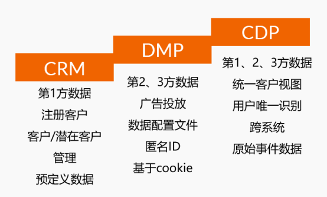

## Customer Data Platform
客户数据中台（CDP）

David Raab 在2013年首次提出了Customer Data Platform（CDP）的概念。并且如此定义CDP：

CDP 的目标是汇集所有客户数据并将数据存储在统一的、可多部门访问的数据平台中，让企业各个部门都可以轻松使用。

我们早就听说过“客户数据中心”或”单一客户视图” 或 “360 度客户档案”的故事。但在现实中没有一个平台类型能汇集所有的数据, 并同时满足不同业务部门的数据需求。

每个业务部门依赖的是客户数据的不同方面，他们都有自己的运用场景。但这些各自产生的新的、孤立的、片面的客户数据，却无法快速同步，甚至团队之间还怀疑对方数据是否正确。因此，企业需要一个统一真实的数据源来描述客户，而不是任由客户的不同维度数据由不同部门各自存储。

### CDP 三大特征

1. 数据能收进来（Link） 
CDP 可以快速连接来自市场、销售、客服等各部门的各类数据源中存储的客户数据。不管是实名客户，还是匿名客户，都可以在CDP中根据业务定义得到合并。为企业提供了完整的、不断更新的客户画像，而不是流于表面的统计数据。

2. 数据能流出去（Flow） 
CDP 有能力快速对接企业内外部的各种数据源，包括广告投放、CRM、客服系统、网站、微信、App、大数据分析与 BI 等等。只有数据流动起来，CDP 才能产生更大的价值。

3. 业务驱动 
CDP 是为业务人员驱动建立的，而不是 IT 人员。业务人员可以自行决定需要什么数据源、如何对用户打标签、把数据传递到哪些平台等等。CDP 应该有极其简单的界面，业务团队可以直接在 CDP 上进行操作，而不是依赖于 IT 部门。

    也许在初次设置的时候，需要一些IT部门的参与，但设置完成后，业务团队基本可以完全控制数据的使用和流动。

    传统的数据仓库（或者数据中台）是由 IT 团队构建和运行的，要求懂得很高技术知识的人员才能使用，所以业务人员是没法操作的。 

### CDP 四大优点

### CRM、DMP、CDP 系统

CRM 系统：客户关系管理（Customer Relationship Management），搜集历史交易数据，为更好的销售提供方式和工具

DMP 系统：数据管理平台（Data Management Platform），搜集网站上匿名用户行为数据，提供给企业更好的广告投放方案

CDP 系统：客户数据中台（Customer Data Platform），搜集企业所有渠道历史用户交易/行为数据，为更好地营销提供数据基础

#### 数据获取
- CRM 系统主要获取第1方数据；
- DMP 系统主要获取第2方，少量第3方数据；
- CDP 系统则主要获取第1方，部分第2、3方数据。

> 第1方数据：指企业自己从用户那获取的数据。比如用户在淘宝购买一个手表，企业可获得其姓名、电话、地址、购买商品、积分数，接着通过历史数据的计算，获得该用户的RFM、回购周期、客单价、商品偏好等数据。 
> 第2方数据：企业从合作企业那获得的数据。比如用户在视频网站浏览，网站平台可以获得该用户的播放数据、搜索数据、播放时长、完播率等数据，将这些数据加工后提供给企业，以便于精准投放广告。 
> 第3方数据：企业从其他平台购买的数据。比如通过支付一定费用，向调研公司购买的市场分析数据。

#### 系统功能
- CRM 系统：服务于销售部门，主要存储交易用户的数据，主要是静态的；
- DMP 系统：服务于广告投放部门，主要存储受众临时数据，极为动态；
- CDP 系统：服务于用户运营部门，结合了静态、动态数据，主要做精细化用户运营。

在2017年前，各个公司的新增流量日子还过得去，所以 DMP 系统和 CRM 系统一个做新客引入，一个做老客维护，算是井水不犯河水，相安无事。但是互联网“流量荒”的时代，倒逼运营者思考如何获取更多的新用户，和留住老用户，这2个系统就进入了大家的视野，一个能拉新，一个能留存，要是结合起来呢？开源节流岂不妙哉？所以，CDP系统应运而生！

#### 用户管理范围
- CRM 系统：只记录购买过的用户购买过的用户才能被称为用户，CRM小伙会把这些人的订单数据详详细细地记在小本本上，至于其他来逛逛或者瞟一眼的，是不放在眼里的。
- DMP 系统：只记录来访问的流量，并且保存期不超过90天。先建一个平台，薅海量的人过来用，DMP小伙就把这些用户的数据记下来，转手给广告主说：来我这投广告，人多效果还好。不过他记性不好，过了一两个月就会把前边的用户忘了。
- CDP 系统：记录来访问的流量，并将其转化为用户。来买来逛的都是用户，CDP小伙子能记住每一个人的名字和长相，就算来瞟一眼啥也不说的，他也能记下这个用户的样子并打个标记：备胎第847105号

#### 用户数据应用
1. CRM 系统：根据已成交顾客历史购买记录分析

翻翻收银系统，周末张大妈来我这买了5斤黑风山土猪肉，花了300块，这已经是第3次买了，估计她喜欢吃。估摸着现在已经4天，应该快吃完了，要不发条短信跟她说我们新的土猪肉又到货了。

2. DMP 系统：根据流量行为分析

看看监控录像，周末有个瘦高个眼睛有点大的中年大妈来我这逛，看到黑风山土猪肉的广告买了，这人还问了一下卤牛肉多少钱。我得跟卖猪肉的广告商说，看旁边卤牛肉的大妈也有可能看你的猪肉，所以广告可以摆到牛肉摊上去。什么？她上个月也来过？完全不记得。

3. CDP 系统：根据历史/潜在用户行为分析

根据店内/外监控录像、收银员反馈显示，周末瘦高个，眼睛大的中年大妈张大妈，从胡同口走了20分钟来我这买了5斤黑风山土猪肉，原价301块，她硬是和收银员磨蹭了半个小时抹了个零头，还说着自己表弟一家要来做客，得买点他们没吃过的好玩意给他们尝尝。

与我合作的小区保安说，她表弟一家还没走，估计还在她家住着。那我就跟张大妈说说，刚到的南极冰川特级海参，原价8888，现价888，送货上门要不要？电话、短信、微信一起轰炸，还有在她家窗户上贴个广告，保证她绝对能看到！

#### 营销手段
1. CRM 系统：只能记录交易信息，运营者只能通过有限的数据“猜”用户在想什么，现在需要什么，所以在信息不充足的前提下，“猜”不准那是常有的事。

2. DMP 系统：无法知道这个用户是谁，每个人在它的眼里只是一串代码，同时企业一般不会保存90天以前的数据，所以对之前访问过的用户可能是不认识的。另外其服务对象主要为广告主，也就是提供给广告主投广告的参考依据。

3. CDP 系统：可以记录用户的行为、购买数据，并与自营或合作的渠道打通数据，设置一张大网。运营者就像蛛网中的蜘蛛，蛛网中的任何风吹草动都能了然于心。

#### 一家饭馆的案例

以前我只知道食客点了什么菜，付了多少钱，吃完后的评价，和多久来一趟。 
我只能安排服务员小姐姐见到他时打声招呼：“张先生好，今天是不是又想点一份糖醋排骨？”

现在我知道他眼神在哪个菜上注视的时间更长，等菜的时候是玩斗地主还是王者荣耀，喜欢用一次性筷子还是塑料筷子，一杯汽水喝了几口，甚至我可以安排名叫CDP的小伙子，跟踪他从哪来，到哪去，沿路还干了什么事。 
我可以在他下班的沿途贴上糖醋排骨、糖醋里脊、糖醋带鱼的活动广告，知道他还有半个小时就要来，给他习惯的位置预先留出来，换上一个他平时看的更顺眼的服务员，娇滴滴地发个嗲，顺手多卖2瓶可乐，一瓶现在喝，一瓶回家喝，省的他回家路上路过那个711还要再买一瓶汽水…… 
再写下去，就是一本《如何压榨一个顾客的最大价值》，其实CDP就是干这事的。 