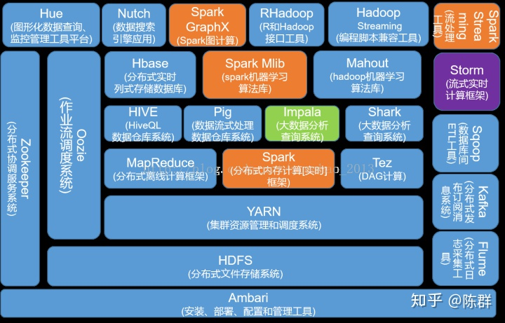

## Hadoop

Hadoop官方网站：http://hadoop.apache.org/

Hadoop 是一个由 Apache 基金会所开发的分布式系统基础架构，主要解决海量数据的存储和海量数据的分析计算问题。

广义上讲，Hadoop 通常是指一个更广泛的概念--Hadoop 生态圈。


##### MapReduce 跑的慢的原因
MapReduce 优化方法主要从六个方面考虑：数据输入、Map 阶段、Reduce 阶段、IO 传输、数据倾斜问题和常用的调优参数。


### 概述

单一节点的服务器计算能力已经达到瓶颈。

利用云计算的分布式技术获取网络中强大的计算存储资源，将消耗大量计算资源的复杂计算通过网络分布到多节点上进行计算，是当前一种高效的解决方案。

难题是输入文件的优化处理，分布式任务的运行管理等。

对于传统的数据库，当涉及到处理大量的可伸缩数据，这是一个繁忙的任务，只能通过单一的数据库瓶颈来处理这些数据。


谷歌使用一种称为 MapReduce 的算法解决了这个问题。这个算法将任务分成小份，并将它们分配到多台计算机，并且从这些机器收集结果并综合，形成了结果数据集。


Doug Cutting 在研究Nutch开源搜索引擎时，受到谷歌发表的两篇论文的启发，使用谷歌提供的解决方案，发展出了分布式计算框架 MapReduce 和分布式存储系统 HDFS。2006年，Doug Cutting预感到研发出的数据处理技术有着更大的潜力，便把MapReduce和HDFS从Nutch中独立出来，合成一个后开源了，取名为Hadoop。

Hadoop 使用的 MapReduce 算法运行，其中数据在使用其他并行处理的应用程序。总之，Hadoop用于开发可以执行完整的统计分析大数据的应用程序。


Hadoop 是使用 Java 编写，允许分布在集群，使用简单的编程模型的计算机大型数据集处理的 Apache 的开源框架。 Hadoop框架应用工程提供跨计算机集群的分布式存储和计算的环境。 Hadoop 是专为从单一服务器到上千台机器扩展，每个机器都可以提供本地计算和存储。

Hadoop 实质上更多是一个分布式数据基础设施: 它将巨大的数据集分派到一个由普通计算机组成的集群中的多个节点进行存储，意味着您不需要购买和维护昂贵的服务器硬件。

#### 类似技术

##### Spark
Spark 是一个快速(基于内存)，通用，可扩展的集群计算引擎。加州大学伯克利分校的实验室开发，它在Hadoop的基础上进行了一些架构上的改良。专门用来对那些分布式存储的大数据进行处理的工具，它并不会进行分布式数据的存储。

Spark 断电后内存数据会丢失，所以Spark不能用于处理需要长期保存的数据。

Spark 实现了高效的 DAG 执行引擎, 可以通过基于内存来高效处理数据流。

Spark 支持 Scala, Java, Python, R 和 SQL 脚本, 并提供了超过 80 种高性能的算法, 非常容易创建并行 App。

与 Hadoop 的 MapReduce 相比, Spark 基于内存的运算是 MapReduce 的 100 倍.基于硬盘的运算也要快 10 倍以上。

- 2009 年，Spark 诞生于 UC Berkeley(加州大学伯克利分校, CAL) 的 AMP 实验室, 项目采用 Scala 编程语言编写。
- 2010 年, Spark 正式对外开源。
- 2013 年 6 月, 进入 Apache 孵化器。
- 2014 年, 成为 Apache 的顶级项目。

当前百度的 Spark 已应用于大搜索、直达号、百度大数据等业务；

阿里利用 GraphX 构建了大规模的图计算和图挖掘系统，实现了很多生产系统的推荐算法；

腾讯Spark集群达到 8000 台的规模，是当前已知的世界上最大的 Spark 集群。


#### Storm
Strom是推特Twitter主推的分布式计算系统。它在Hadoop的基础上提供了实时运算的特性，可以实时的处理大数据流。

Storm不进行数据的收集和存储工作，它直接通过网络实时的接受数据并且实时的处理数据，然后直接通过网络实时的传回结果。


#### 商业背景

同年，为了进一步发展Hadoop，Doug Cutting决定加入互联网公司里最大的雅虎。Doug Cutting当时可能并没有意识到，一个大数据时代的序幕就这样被拉开了。因为当时的雅虎，正在面对谷歌的围攻，如何在低成本的条件下让雅虎搜索更智能，是雅虎必须迈过去的坎。为此雅虎开始尝试Hadoop，Hadoop的集群规模很快过千。Doug Cutting也有机会与雅虎副总裁Amr Awadallah相识。

Amr Awadallah从中看到了商机，并于2008年最终与几个志同道合的人一起，创立了Cloudera。而Doug Cutting一年后也加入到了Cloudera，出任CTO。

转眼到了2011年，作为Hadoop的发祥地，雅虎公司将整个Hadoop团队全体的拆分出去，正式成立一家名字叫做Hortonworks的公司。

2013年，Mike Olson信心十足的写下了《The Cloudera Model》，表示Cloudera已经找到了Hadoop上成功的商业模式。那时的Cloudera，可以说是大数据领域最耀眼的星。2014年，Cloudera正式进入中国。

2014年Hortonworks上市，是企业级全球数据管理平台，同时也是服务和解决方案的领先供应商，为100强企业中的一多半提供“任何类型数据”的可操作信息，已经成为世界第二大数据服务商。

在Hadoop的世界中，规模最大、知名度最高的公司就是Cloudera。CDH提供强大的部署、管理和监控工具，通过Cloudera Manager的Web UI安装和管理集群，并且通过Hue浏览器端的Web控制台上与Hadoop集群进行交互来分析处理数据。

随着云计算的发展，催生了亚马逊AWS等巨头，他们也会提供托管的Hadoop/Spark服务，如AWS的Elastic Map Reduce(EMR)，不仅集成在云平台内部而且成本也更低。而对象存储服务，如AWS S3，Azure Blob存储和Google云端存储，从成本上来说，也低于Hadoop的存储成本。但是，对于重视数据资产的企业来说依旧需要Cloudera产品。Cloudera也一直致力于向云计算转型。

2018年，在怒斥云厂商为吸血鬼而收效甚微之后，Redis和Mongo两家公司直接修改了开源协议，不再允许云厂商提供托管服务。

2018年，同为开源平台的Cloudera与Hortonworks公司宣布以52亿美元的价格合并。
2018年10月Cloudera合并Hortonworks，表示新的公司将成为行业领导者，为客户提供更好的平台，创建世界首个企业数据云，并将在云计算、物联网和容器技术等领域继续发力。这对Hadoop的发展方向是一个打击，但也意味着Hadoop的标准将更加统一，将有更多资金投入新技术的研究。

Cloudera 2019 年宣布，从2019年11月开始，所有新版本，包括当前软件的更新和维护版本，现有客户均需有效产品订阅才能访问获取。从2021年1月31日开始，所有Cloudera软件都需要有效的订阅进行访问。这包括以下产品的所有先前版本：包含Apache Hadoop的 Cloudera 发行版 (CDH)，Hortonworks Data Platform (HDP)，Data Flow (HDF / CDF) 和Cloudera Data Science Workbench (CDSW) 。

2020年，Cloudera大中华区总经理徐晋这样介绍了Cloudera：“Cloudera现在定位成为一家企业数据云的公司，我们的产品100%开源。创立12年来，我们致力于服务全球几千家头部或者大中型的客户，目前全球最大的十家银行里面有八家是我们的客户，在全球各个国家大概有将近40多家政府机构在使用Cloudera的大数据平台，而在汽车制造行业，前十位的汽车制造都在应用Cloudera的产品。此外我们还覆盖到了高科技行业、医药行业。”

而谈及国内市场，徐晋给出了这样的数字：国内最大的20家银行中，有12家是Cloudera的客户。三大电信运营商全部采用了Cloudera的产品，排名前十的券商里Cloudera已与其中八家建立了业务联系，在国内最大的七家保险公司里面有六家采用了Cloudera的产品。在传统强项——汽车制造行业之中，排名前十的厂商都是Cloudera的客户。

近日，Cloudera发布了Cloudera Data Platform Private Cloud(CDP私有云)，进一步完善了整套企业数据云愿景。

### Hadoop 发行版本
Hadoop三大发行版本：Apache、Cloudera、Hortonworks。

Apache版本最原始（最基础）的版本，所有发行版均基于这个版本进行改进。对于入门学习最好。<br>
Cloudera在大型互联网企业中用的较多。<br>
Hortonworks文档较好。<br>

1. Apache Hadoop
    + 官网地址：http://hadoop.apache.org/releases.html
    + 下载地址：https://archive.apache.org/dist/hadoop/common/
    + 优点：完全开源免费，社区活跃，文档、资料详实
    + 缺点：
        1. 版本管理比较混乱，各种版本层出不穷，很难选择，选择其他生态组件时，比如Hive，Sqoop，Flume，Spark等，需要考虑兼容性问题、版本匹配问题、组件冲突问题、编译问题等。
        2. 集群安装部署复杂，需要编写大量配置文件，分发到每台节点，容易出错，效率低。
        3. 集群运维复杂，需要安装第三方软件辅助。

2. Cloudera Hadoop，Cloudera’s Distribution Including Apache Hadoop，简称CDH
    + 官网地址：https://www.cloudera.com/downloads/cdh/5-10-0.html
    + 下载地址：http://archive-primary.cloudera.com/cdh5/cdh/5/
    + 优点：
        1. 版本管理清晰。CDH3、CDH4、CDH5等。
        2. 版本更新快。通常情况，比如CDH每个季度会有一个update，每一年会有一个release。
        3. 集群安装部署简单。提供了部署、安装、配置工具，大大提高了集群部署的效率。
        4. 运维简单。提供了管理、监控、诊断、配置修改的工具，管理配置方便，定位问题快速、准确，使运维工作简单，有效。
    + 缺点：涉及到厂商锁定的问题。

3. Hortonworks Hadoop，Hortonworks Data Platform，简称HDP
    + 官网地址：https://hortonworks.com/products/data-center/hdp/
    + 下载地址：https://hortonworks.com/downloads/#data-platform


#### Hadoop 三大发行商
在 Hadoop 的发展史上，有三家公司不得不提，分别是 Cloudera、Hortonworks 和 MapR。

- Cloudera 主要是发布 Hadoop 商业版和商用工具，其核心组件 CDH 开源免费，与 Apache 社区同步；而数据治理和系统管理组件闭源，用户需要获得商业许可，除此之外，商业组件也会提供企业生产环境中必需的运维功能。

    （1）2008年成立的Cloudera是最早将Hadoop商用的公司，为合作伙伴提供Hadoop的商用解决方案，主要是包括支持、咨询服务、培训。<br>
    （2）2009年Hadoop的创始人Doug Cutting也加盟Cloudera公司。Cloudera产品主要为CDH，Cloudera Manager，Cloudera Support<br>
    （3）CDH是Cloudera的Hadoop发行版，完全开源，比Apache Hadoop在兼容性，安全性，稳定性上有所增强。<br>
    （4）Cloudera Manager是集群的软件分发及管理监控平台，可以在几个小时内部署好一个Hadoop集群，并对集群的节点及服务进行实时监控。ClouderaSupport即是对Hadoop的技术支持。<br>
    （5）Cloudera的标价为每年每个节点4000美元。Cloudera开发并贡献了可实时处理大数据的Impala项目。<br>

- Hortonworks 的商业模式是 100% 完全开源的策略，所有产品开源，用户可免费使用。真正用来盈利的是技术服务支持。

    （1）2011年成立的Hortonworks是雅虎与硅谷风投公司Benchmark Capital合资组建。<br>
    （2）公司成立之初就吸纳了大约25名至30名专门研究Hadoop的雅虎工程师，上述工程师均在2005年开始协助雅虎开发Hadoop，贡献了Hadoop 80%的代码。<br>
    （3）雅虎工程副总裁、雅虎Hadoop开发团队负责人EricBaldeschwieler出任Hortonworks的首席执行官。<br>
    （4）Hortonworks的主打产品是Hortonworks Data Platform（HDP），也同样是100%开源的产品，HDP除常见的项目外还包括了Ambari，一款开源的安装和管理系统。<br>
    （5）HCatalog，一个元数据管理系统，HCatalog现已集成到Facebook开源的Hive中。Hortonworks的Stinger开创性的极大的优化了Hive项目。Hortonworks为入门提供了一个非常好的，易于使用的沙盒。<br>
    （6）Hortonworks开发了很多增强特性并提交至核心主干，这使得Apache Hadoop能够在包括Window Server和Windows Azure在内的Microsoft Windows平台上本地运行。定价以集群为基础，每10个节点每年为12500美元。<br>

- MapR 的商业模式遵循了传统软件厂商的模式，采用私有化实现，用户通过购买软件许可来使用。

    （1）MapR 成立于 2009 年，创始人 M.C.Srivas 来自于 Google。

虽然三家公司的商业模式不尽相同，但是都曾从 Hadoop 中获得了红利，Cloudera 的估值在顶峰时高达 41 亿美元，而 Hortonworks 和 MapR 的估值也曾超过 10 亿美元。

不过，2018 年 10 月，Cloudera 和 Hortonworks 宣布合并，Cloudera 的股东将拥有新公司 60% 的股权，Hortonworks 的股东持有 40% 的股权。合并时，双方对于未来的盈利能力信心十足，“到 2020 年预计每年收入有望超过 10 亿美元。”但是，事情发展并不如预期，合并半年多后，2019 年 6 月 6 日美股开盘，Cloudera 股价暴跌 43%，曾经 41 亿美元的估值缩水为 14 亿美元。

相比于抱团取暖的 Cloudera 和 Hortonworks，MapR 的处境更为艰难了，甚至走到了“闭店裁员”的窘境。外媒爆料曾经估值 10 亿美元的 MapR 向加州就业发展局提交文件，称“如果再未能获得新的资金注入，MapR 可能会裁员 122 人，并关闭位于 Santa Clara 的总部。”，MapR 裁员将于 6 月 14 日生效，但是就在前几日，有消息称 MapR 将寻找新资金的最后期限延长到了 7 月 9 日。


#### CDH
Cloudera Express 和 Cloudera Enterprise，在发布、配置和管理，监控，诊断，集成四个部分的功能是相同的。只有在高级管理功能中有区别，Cloudera Enterprise 拥有这些功能，而 Cloudera Express 则没有。

CDH5现在依旧是市场上用的最多，推得最广的版本，客户认可度也较高。同时，CDH5经过快5年的迭代也是目前最成熟和稳定的版本，各个组件跟随着社区版的更新迭代，已经把各个组件的bug修复得很完善。另外，无论是国外还是国内支持案例也多，国内可以找到很多相关的实施案例供参考，可以节省运维人力、物力成本。最后CDH5的周边生态圈支持也比较丰富，无论是开源还是商业产品，ETL工具，调度工具，报表工具，BI工具等。

CDH6的更新较大，很多组件也都是大版本更新，引入了很多激动人心的新功能，同时各个组件也修复了大量已知的问题和安全漏洞。比如HDFS的纠删码用于冷数据降低存储成本又保证了数据的可用性，NameNode和YARN的联邦解决大规模集群的性能瓶颈问题，YARN引入GPU支持，未来会引入docker支持等。长远来看，从Hadoop2升级到Hadoop3或者从CDH5升级到CDH6是必须的，因为无论是社区还是Cloudera从现在开始开始都会将开发重心转移到Hadoop3或CDH6上，而CDH5则主要以维护和修复bug为主。

| 产品列表（版本）         | 停止支持时间 |
| ------------------------ | ------------ |
| Cloudera Enterprise 6.3  | 2022年3月    |
| Cloudera Enterprise 6.2  | 2022年3月    |
| Cloudera Enterprise 6.1  | 2021年12月   |
| Cloudera Enterprise 6.0  | 2021年8月    |
| Cloudera Enterprise 5.16 | 2020年12月   |
| Cloudera Enterprise 5.15 | 2020年12月   |
| Cloudera Enterprise 5.14 | 2020年12月   |
| Cloudera Enterprise 5.13 | 2020年10月   |
| Cloudera Enterprise 5.12 | 2020年7月    |
| Cloudera Enterprise 5.11 | 已停止       |
| Cloudera Enterprise 5.10 | 已停止       |
| Cloudera Enterprise 5.9  | 已停止       |

CDH6是基于Hadoop3同时包含大量其他组件的大版本更新的发布版本，许多用户考虑到未来CDH的版本主要是基于CDH6，而CDH5会慢慢的停止更新，所以考虑新搭集群使用CDH6，或者想把已有的CDH5集群升级到CDH6。第一个问题就是需要考虑CDH5和CDH6的差别，通过分析一些差异看能否将已有的应用迁移或者直接部署到CDH6，兼容性稳定性是否存在问题等。以下主要基于CDH5.16.1和CDH6.1.1进行比较。

Cloudera于2018年8月30日正式发布CDH6.0.0，至2019年2月19日，迭代版本为CDH6.1.1。

2020年2月4日Cloudera宣布正式发布CDH6.3.3。从CDH6.3.3开始，将不再提供免费版(Cloudera Express)。

##### 组件版本对比

| 组件               | CDH5.16.1   | CDH6.1.1 |
| ------------------ | ----------- | -------- |
| Cloudera Manager   | 5.16.1      | 6.1.1    |
| CDSW               | 1.5         | 1.5      |
| Cloudera Navigator | 2.15.1      | 6.1.1    |
| Flume-ng           | 1.6.0       | 1.8.0    |
| Hadoop             | 2.6.0       | 3.0.0    |
| HBase              | 1.2.0       | 2.1.0    |
| Hive               | 1.1.0       | 2.1.1    |
| Hue                | 3.9.0       | 3.9.0    |
| Impala             | 2.12.0      | 3.1.0    |
| Oozie              | 4.1.0       | 5.0.0    |
| Pig                | 0.12.0      | 0.17.0   |
| Sentry             | 1.5.1       | 2.1.0    |
| Solr               | 4.10.3      | 7.4.0    |
| Spark              | 1.6.0/2.3.0 | 2.4.0    |
| Sqoop              | 1.4.6       | 1.4.7    |
| Sqoop2             | 1.99.5      | 无       |
| Zookeeper          | 3.4.5       | 3.4.5    |
| Kafka              | 1.0.1       | 2.0.0    |
| Kudu               | 1.7.0       | 1.8.0    |

##### 操作系统支持

| 操作系统                        | CDH5.16.1                                                    | CDH6.1.1                                        |
| ------------------------------- | ------------------------------------------------------------ | ----------------------------------------------- |
| RHEL/CentOS/OL with RHCK kernel | 7.6, 7.5, 7.4, 7.3, 7.2, 7.1, 6.10, 6.9 , 6.8, 6.7, 6.6, 6.5, 6.4, 5.11, 5.10, 5.7 | 7.6, 7.5, 7.4, 7.3, 7.2, 6.10, 6.9 , 6.8        |
| Oracle Linux (OL)               | 7.5, 7.4, 7.3, 7.2, 7.1 (UEK default), 6.9, 6.8 (UEK R2, R4), 6.7, 6.6, 6.5 (UEK R2, R3), 6.4 (UEK R2), 5.11, 5.10, 5.7 (UEK R2) | 7.4, 7.3, 7.2 (UEK default), 6.10 (UEK default) |
| SLES                            | 12 SP3, 12 SP2, 12 SP1, 11 SP4, 11 SP3                       | 12 SP3, 12 SP2                                  |
| Ubuntu                          | 16.04 LTS (Xenial), 14.04 LTS (Trusty)                       | 16.04 LTS (Xenial)                              |
| Debian                          | 8.9, 8.4, 8.2 (Jessie), 7.8, 7.1, 7.0 (Wheezy)               | 不支持                                          |

##### 元数据库支持

| 数据库     | CDH5.16.1                                       | CDH6.1.1                      |
| ---------- | ----------------------------------------------- | ----------------------------- |
| MySQL      | 5.1, 5.5, 5.6, 5.7                              | 5.7                           |
| MariaDB    | 5.5, 10.0                                       | 5.5, 10.0                     |
| PostgreSQL | 8.1, 8.3, 8.4, 9.1, 9.2, 9.3, 9.4, 9.5, 9.6, 10 | 8.4, 9.2, 9.4, 9.5, 9.6, 10.x |
| Oracle     | 11g R2, 12c R1, 12.2                            | 12.2                          |

##### JDK支持

| JDK     | CDH5.16.1                                                    | CDH6.1.1                                                     |
| ------- | ------------------------------------------------------------ | ------------------------------------------------------------ |
| JDK7    | 1.7u55, 1.7u67, 1.7u75, 1.7u80                               | 不支持                                                       |
| JDK8    | 1.8u31, 1.8u74, 1.8u91, 1.8u102, 1.8u111, 1.8u121, 1.8u131, 1.8u144, 1.8u162, 1.8u181 | 1.8u31, 1.8u74, 1.8u91, 1.8u102, 1.8u111, 1.8u121, 1.8u131, 1.8u141, 1.8u162, 1.8u181 |
| OpenJDK | 1.8u181(CDH5.16之前的版本不支持OpenJDK)                      | 1.8u181                                                      |

##### 其他

**单用户模式**

在安装CDH时，一般都是使用root或具有sudo权限的用户安装的，如果大家有注意会发现用于管理每台主机上的Hadoop进程的Cloudera Manager Agent服务（cloudera-scm-agent）是以root用户身份运行的。

但是在有些企业，运维部门有严格的要求，需要CDH使用自己的用户来管理即不能随便使用root，比如要求cloudera-scm-agent服务以其他用户进行启停和管理。从Cloudera Manager 5.3开始Cloudera提供了single user mode，来满足这种要求。在单用户模式下，Cloudera Manager Agent和所有由Cloudera Manager管理的服务进程都可以由配置的用户来启动。单用户模式优先考虑Hadoop与系统其余进程之间的隔离，而不是Hadoop进程之间的隔离。对于Cloudera Manager的部署，单用户模式是全局的，适用于由该Cloudera Manager管理的所有集群。默认情况下，单用户是cloudera-scm。

从CDH6开始，不再支持单用户模式，安装必须使用root或具有sudo权限的用户安装。


#### CDP
在Cloudera和Hortonworks合并后，Cloudera公司推出了新一代的数据平台产品 CDP Data Center（以下简称为CDP），在2019年11月30日已经正式GA。

CDP Hybrid Cloud、CDP Private Cloud

CDP的版本号延续了之前CDH的版本号，从7.0开始，目前最新的版本号为7.0.3.0。

那么CDP对比之前的 Cloudera Enterprise Data Hub（CDH企业版）与 HDP Enterprise Plus（HDP企业版）到底在组件上发生了哪些变化呢？

由于HDP在国内市场上的市场占有量很小，大部分公司都是采用CDH，所以对于HDP带来的一些东西，使用CDH的用户和开发人员会比较陌生，下面列出了CDP中的组件一些变化。

**CDP、CDH、HDP中都包含的部分**

- Apache Hadoop（HDFS/YARN/MR）
- Apache HBase
- Apache Hive
- Apache Oozie
- Apache Spark
- Apache Sqoop
- Apache Zookeeper
- Apache Parquet
- Apache Phoenix（*CDH中需要额外安装）

基本上只是版本做了一定的升级。如果你之前是使用CDH的用户，那么其中值得一提的是Hive的版本在CDP中使用的是3.1.2，对比CDH6来说是很大的升级（CDH6中Hive为2.1.1）。之前Cloudera在组件的选择上是比较保守的，对比之下Hortonworks的策略会比较激进（HDP已经上了Hive3），会更贴近社区最新的版本。

Hive 3的几个重要新特性：

- 默认执行引擎变更为TEZ
- 默认开启ACID支持，用于支持事务
- LLAP支持，用于支持秒级、毫秒级的实时查询

客户端方面彻底废弃掉了Hive CLI，这也意味着beeline成为唯一选择

CDH中存在，CDP还在准备中的部分：Apache Accumulo、Navigator Encrypt、Key HSM。实际实施中这些用的都不多，而且迟早会加入到CDP中，不需要太过关注。

**CDP、CDH中都包含的部分**

- Apache Avro
- Cloudera Manager
- Hue
- Apache Impala
- Key Trustee Server
- Apache Kudu
- Apache Solr
- Apache Kafka（*CDH中需要额外安装）

HDP中存在，CDP还在准备中的部分：Apache Druid、Apache Knox、Apache Livy、Ranger KMS、Apache Zeppelin。其中最需要关注的就是Apache Druid。Apache Druid是一款实时大数据分析引擎。（注意它与阿里巴巴出品的一款数据库连接池Druid恰好重名，但实际是两款不同的软件，两者之间并没有什么关系。）

Apache Druid能快速地对海量数据进行实时存储和多维度实时分析。在快速查询、水平扩展、实时数据摄入和分析这三方面都有良好的支持。本质上来说就是一款时序数据库，能很方便的对时间驱动型的数据进行快速的分析查询。

需要注意的是为了达到高性能，Druid牺牲了很多方面的特性，例如并不支持完整的SQL语义特性（只提供有限制的join支持）。所以Druid并非是Hive或者Impala的替代品，它们之间是一种相互增强的关系，例如以下场景：选用Hive或Impala用于构建离线数据仓库或数据集市，然后在这个基础上，将需要进行多维分析查询的数据放入Druid进行加工，来给多维分析类系统提供数据接口。

**CDP、HDP中都包含的部分**

- Apache Atlas
- Apache Ranger
- Apache ORC
- Apache Tez

在CDP中，有两个之前CDH的组件被去除，一个是Apache Sentry，用于安全授权；一个是Cloudera Navigator，用于元数据管理与审计。被去除的原因在于在CDP中它们的功能已经被其他组件所替代，CDP将会使用以Ranger+Knox+Atlas为中心的安全授权与审计方案。对于使用CDH的用户来说，这部分的变化是最大的。

而Apache ORC虽然之前在CDH中其实一直能够使用，但Impala本身对ORC格式的支持非常差，在CDH中无论是在Impala还是Hive中使用ORC格式，都一直没有受到CDH的支持和推荐（CDH都推荐使用Parquet格式）。其实这本身有点商业策略考量的意味：在未合并前，社区中Parquet项目由Cloudera主导，而ORC项目由Hortonworks主导。其实这两种格式在整个Hadoop生态圈中都有着广泛的应用，合并之后CDP中自然是两者都需要提供官方支持了。

Tez也基本上处于同样的理由（商业策略考量），所以之前CDH中的Hive一直是无法直接使用Tez的（选项页面直接选择的话，只能选择MR和Spark作为引擎）。现在合并后并不存在这个商业策略考量的问题了。

**CDP全新加入的部分**

- Apache Ozone（技术预览版）
    1. Ozone是一个可伸缩的、冗余的、分布式的Hadoop对象存储。
    2. 基于Apache Spark、YARN和Hive等框架的应用程序无需任何修改就可以直接在Ozone上工作。
    3. Ozone建立在具有高可用性的复制块存储层上，这个存储层被称为Hadoop Distributed Data Store(HDDS)

    简单来说，Ozone就是为了解决HDFS现存的受到NameNode严重制约的超大规模的扩展能力问题以及存储小文件的问题而设计的，Ozone被设计成支持数百亿（在未来甚至更多）的文件和块。

    目前Ozone还处于技术预览版阶段，如果有时间做一些基本了解即可，目前还不会有用于实际生产环境的可能性。


##### CDP 7
在使用HDP集群那个年代，hive on tez 配合orc存储和SparkSQL，已经可以在大数据平台实现现在很多供应商所说的HTAP了，当时使用sqoop+pig+tez+hive+oozie+falcon跑批，用phoenix+hbase+kafka+spark跑流任务。那时候觉得orc+hive+hplsql真好用，比vertica好用太多太多。

接触CDH集群，第一次用到impala，任务量一上去，经常会爆内存，后来还专门了解了impala的优化。impala对于orc格式仅能做到只读，不过Cloudera也有kudu作为他们介于OLAP和OLTP之间的产物供使用，实际使用效果也不错。

两家合并后半年的时间 CDF就出现了，结果发现，这不就是NIFI嘛

这次CDP7，不会像从CDH5升级CDH6一样令人开心，CDH6目前使用感受不错，偶尔有小BUG也还能忍受。 CDH5里很多组件版本太老，很多企业在线上使用CDH5好多年可能都不敢升级了，当然也可以自己安装高版本的应用，但不享受厂商的售后服务。CDP7相比于CDH6整体停下来就是想告诉我们一句话 "上云！"

一直在围绕"云" 大谈特谈，支持公有云，私有云，本地部署方式。

国外有AWS,Azure,Google，国内有阿里，腾讯，华为，很遗憾，CDP7目前只支持AWS和Azure，跟国内云厂商还没谈好合作，所以国内公有云短期内是没别惦记了。

Ozone要等到CDP7.2才能支持。

再来说说私有云，CDP7的私有云的前提是先部署CDP7的数据中心版本，也就是跟CDH6类似的安装部署方式，本地部署。数据存储方式还是HDFS，暂不支持Ozone对象存储。然后私有云部署方式相比于数据中心版有什么好处呢，是DevOps还是存储计算分离？ 消耗更大的网络带宽换来的优势是否值得还需要再好好思考一番。

最后就是数据中心版本CDP-DC， 我们也可以叫他CDH7，本质上就是对CDH6进行了组件的升级，将部分CDH的组件替换成HDP的组件，比如sentry变成了ranger，navigator变成了atlas， hive2升级到hive3。 其他的组件都大差不差，和CDH6.3相比区别不大。

升级的时候，sentry的权限如何同步到ranger，是否有风险？ 目前仅支持从CDH5升级到CDP7，还不支持CDH6升级CDP7。

HDFS的小文件问题被大家诟病，Ozone对象存储也是千呼万唤始出来，然而有点晚了。云厂商发展的太快，包装好的服务拿来直接就能用，CDH和HDP斗了那么久，各自都造了不少轮子，合并之后也开始把功能重叠的做替换，好想感叹一句"大数据的轮子咋就那么多呢？"  DeltaLake、Hudi、Iceberg还没整明白呢，那边一下子冒出好多HTAP的数据库厂商。咋那么多功能重叠的组件呢，唉！ 愿hadoop生态越来越好越来越好纯净。

最关键的一点：CDP的组件代码在github上找不到，是不再开源了，CDP7以后就没有社区版了。


### Hadoop 部署

#### Hadoop 运行模式
Hadoop 运行模式包括：本地模式、伪分布式模式以及完全分布式模式。

本地运行模式不需要额外的设置，只需要执行相应的jar包就可以了。不需要任何的集群配置，本地运行模式其实也是一种单节点模式。

伪分布模式可以把MapReduce程序直接运行在HDFS上，
也可以选择运行在Yarn上。

#### 配置文件说明
Hadoop 配置文件分两类：默认配置文件和自定义配置文件，只有用户想修改某一默认
配置值时，才需要修改自定义配置文件，更改相应属性值。

（1）默认配置文件：<br>
[core-default.xml] hadoop-common-2.7.2.jar/core-default.xml<br>
[hdfs-default.xml] hadoop-hdfs-2.7.2.jar/hdfs-default.xml<br>
[yarn-default.xml] hadoop-yarn-common-2.7.2.jar/yarn-default.xml<br>
[mapred-default.xml] hadoop-mapreduce-client-core-2.7.2.jar/mapred-default.xml<br>

（2）自定义配置文件：<br>
core-site.xml、hdfs-site.xml、yarn-site.xml、mapred-site.xml四个配置文件存放在$HADOOP_HOME/etc/hadoop这个路径上，可以根据项目需求重新进行修改配置。<br>

#### 本地运行模式-官方 Grep 案例
```bash
# 在hadoop-2.7.2文件下面创建一个input文件夹
cd $HADOOP_HOME
mkdir input
# 将Hadoop的xml配置文件复制到input
cp etc/hadoop/*.xml input
# 执行share目录下的MapReduce程序
bin/hadoop jar share/hadoop/mapreduce/hadoop-mapreduce-examples-2.7.2.jar \
grep input output 'dfs[a-z.]+'
# 查看输出结果
cat output/*
```

#### 本地运行模式-官方 WordCount 案例
```
在hadoop-2.7.2文件下面创建一个wcinput文件夹
cd $HADOOP_HOME
mkdir wcinput
在wcinput文件下创建一个wc.input文件
cd wcinput
touch wc.input
编辑wc.input文件
vi wc.input
在文件中输入如下内容
hadoop yarn
hadoop mapreduce
atguigu
atguigu
保存退出：：wq
回到Hadoop目录，执行share目录下的MapReduce程序
bin/hadoop jar share/hadoop/mapreduce/hadoop-mapreduce-examples-2.7.2.jar
wordcount wcinput wcoutput
查看输出结果
cat wcoutput/part-r-00000
```

#### 伪分布式运行模式-启动 HDFS 并运行 MapReduce 程序
```
（1）配置集群
（a）配置：hadoop-env.sh
配置JAVA_HOME
（b）配置：core-site.xml
<!--指定HDFS中NameNode的地址-->
<property>
    <name>fs.defaultFS</name>
    <value>hdfs://hadoop101:9000</value>
</property>
<!--指定Hadoop运行时产生文件的存储目录-->
<property>
    <name>hadoop.tmp.dir</name>
    <value>/opt/hadoop/tmp</value>
</property>
（c）配置：hdfs-site.xml
<!--指定HDFS副本的数量-->
<property>
<name>dfs.replication</name>
<value>1</value>
</property>
（2）启动集群
（a）格式化NameNode（第一次启动时格式化，以后就不要总格式化）
bin/hdfs namenode -format
（b）启动NameNode
sbin/hadoop-daemon.sh start namenode
（c）启动DataNode
sbin/hadoop-daemon.sh start datanode
（3）查看集群
（a）查看是否启动成功
jps #注意：jps是JDK中的命令，不是Linux命令。
（b）web端查看HDFS文件系统
http://hadoop101:50070/dfshealth.html#tab-overview
（c）查看产生的Log日志
（d）思考：为什么不能一直格式化NameNode，格式化NameNode，要注意什么？
注意：格式化NameNode，会产生新的集群id,导致NameNode和DataNode的集群id不一致，集群找不到已往数据。所以，格式NameNode时，一定要先删除data数据和log日志，然后再格式化NameNode。
（4）操作集群
（a）在HDFS文件系统上创建一个input文件夹
bin/hdfs dfs -mkdir -p /user/input
（b）将测试文件内容上传到文件系统上
bin/hdfs dfs -put wcinput/wc.input /user/input/
（c）查看上传的文件是否正确
bin/hdfs dfs -ls /user/input/
bin/hdfs dfs -cat /user/input/wc.input
（d）运行MapReduce程序
bin/hadoop jar share/hadoop/mapreduce/hadoop-mapreduce-examples-2.7.2.jar wordcount /user/input/ /user/output
（e）查看输出结果
bin/hdfs dfs -cat /user/output/*
（f）将测试文件内容下载到本地
hdfs dfs -get /user/output/part-r-00000./wcoutput/
（g）删除输出结果
hdfs dfs -rm -r /user/output
```

#### 伪分布式运行模式-启动 YARN 并运行 MapReduce 程序
```
（1）配置集群
（a）配置yarn-env.sh
配置JAVA_HOME
（b）配置yarn-site.xml
<!--Reducer获取数据的方式-->
<property>
    <name>yarn.nodemanager.aux-services</name>
    <value>mapreduce_shuffle</value>
</property>
<!--指定YARN的ResourceManager的地址-->
<!--wsl2 中需要设置未0.0.0.0，不然无法访问-->
<property>
    <name>yarn.resourcemanager.hostname</name>
    <value>hadoop101</value>
</property>
（c）配置：mapred-env.sh
配置JAVA_HOME
（d）配置：(对mapred-site.xml.template重新命名为)mapred-site.xml
<!--指定MR运行在YARN上-->
<property>
    <name>mapreduce.framework.name</name>
    <value>yarn</value>
</property>
（2）启动集群
（a）启动前必须保证NameNode和DataNode已经启动
（b）启动ResourceManager
sbin/yarn-daemon.sh start resourcemanager
（c）启动NodeManager
sbin/yarn-daemon.sh start nodemanager
（3）集群操作
（a）YARN的浏览器页面查看http://hadoop101:8088/cluster
（b）删除文件系统上的output文件
bin/hdfs dfs -rm -R /user/output
（c）执行MapReduce程序
bin/hadoop jar share/hadoop/mapreduce/hadoop-mapreduce-examples-2.7.2.jar wordcount /user/input /user/output
（d）查看运行结果
bin/hdfs dfs -cat /user/output/*
```

#### 伪分布式运行模式-配置历史服务器
```
（1）配置mapred-site.xml
vi mapred-site.xml
在该文件里面增加如下配置。
<!--历史服务器端地址-->
<property>
    <name>mapreduce.jobhistory.address</name>
    <value>hadoop101:10020</value>
</property>
<!--历史服务器web端地址-->
<property>
    <name>mapreduce.jobhistory.webapp.address</name>
    <value>hadoop101:19888</value>
</property>
（2）启动历史服务器
sbin/mr-jobhistory-daemon.sh start historyserver
（3）查看历史服务器是否启动
jps
（4）查看JobHistory http://hadoop101:19888/jobhistory
```

#### 伪分布式运行模式-配置日志的聚集
日志聚集概念：应用运行完成以后，将程序运行日志信息上传到HDFS系统上。
注意：开启日志聚集功能，需要重新启动NodeManager、ResourceManager和HistoryManager。
```
（1）配置yarn-site.xml
vi yarn-site.xml
在该文件里面增加如下配置。
<!--日志聚集功能使能-->
<property>
    <name>yarn.log-aggregation-enable</name>
    <value>true</value>
</property>
<!--日志保留时间设置7天-->
<property>
    <name>yarn.log-aggregation.retain-seconds</name>
    <value>604800</value>
</property>
（2）关闭NodeManager、ResourceManager和HistoryManager
sbin/yarn-daemon.sh stop resourcemanager
sbin/yarn-daemon.sh stop nodemanager
sbin/mr-jobhistory-daemon.sh stop historyserver
（3）启动NodeManager、ResourceManager和HistoryManager
sbin/yarn-daemon.sh start resourcemanager
sbin/yarn-daemon.sh start nodemanager
sbin/mr-jobhistory-daemon.sh start historyserver
（4）删除HDFS上已经存在的输出文件
bin/hdfs dfs -rm -R /user/atguigu/output
（5）执行WordCount程序
hadoop jar share/hadoop/mapreduce/hadoop-mapreduce-examples-2.7.2.jar wordcount /user/atguigu/input 
/user/atguigu/output
（6）查看日志http://hadoop101:19888/jobhistory
```

#### 完全分布式运行模式
1. 准备客户机（关闭防火墙、静态ip、主机名称）
2. 安装JDK
3. 配置环境变量
4. 安装Hadoop
5. 配置环境变量
6. 配置集群
7. 单点启动
8. 配置ssh
9. 群起并测试集群

#### Hadoop编译源码
```
1.准备工作：CentOS联网、jar包准备(hadoop源码、JDK8、maven、ant、protobuf)
（1）hadoop-2.7.2-src.tar.gz
（2）jdk-8u144-linux-x64.tar.gz
（3）apache-ant-1.9.9-bin.tar.gz（build工具，打包用的）
（4）apache-maven-3.0.5-bin.tar.gz
（5）protobuf-2.5.0.tar.gz（序列化的框架）
注意：采用root角色编译，减少文件夹权限出现问题
2.jar包安装：
（1）JDK解压、配置环境变量JAVA_HOME和PATH
（2）Maven解压、配置MAVEN_HOME和PATH
（3）ant解压、配置ANT_HOME和PATH
（4）安装glibc-headers和g++命令如下
yum install glibc-headers
yum install gcc-c++
（5）安装make和cmake
yum install make
yum install cmake
（6）解压protobuf，进入到解压后protobuf主目录，/opt/module/protobuf-2.5.0，
然后相继执行命令
tar -zxvf protobuf-2.5.0.tar.gz -C /opt/module/
cd /opt/module/protobuf-2.5.0/
./configure
make
make check
make install
ldconfig

vi /etc/profile
#LD_LIBRARY_PATH
export LD_LIBRARY_PATH=/opt/module/protobuf-2.5.0
export PATH=$PATH:$LD_LIBRARY_PATH
source/etc/profile
（7）安装openssl库、安装ncurses-devel库
yum install openssl-devel
yum install ncurses-devel
3.编译源码
（1）解压源码到/opt/目录
tar -zxvf hadoop-2.7.2-src.tar.gz -C /opt/
（2）进入到hadoop源码主目录
cd /opt/hadoop-2.7.2-src
（3）通过maven执行编译命令
mvn package -Pdist,native -DskipTests -Dtar
等待时间30分钟左右，最终成功是全部SUCCESS，
（4）成功的64位hadoop包在/opt/hadoop-2.7.2-src/hadoop-dist/target下
4.编译源码过程中常见的问题及解决方案
（1）MAVEN install时候JVM内存溢出
处理方式：在环境配置文件和maven的执行文件均可调整MAVEN_OPT的heap大小。
（2）编译期间maven报错。可能网络阻塞问题导致依赖库下载不完整导致，多次执行命令
（一次通过比较难）。
（3）报ant、protobuf等错误，插件下载未完整或者插件版本问题，最开始链接有较多特殊
情况，同时推荐2.7.0版本的问题汇总帖子http://www.tuicool.com/articles/IBn63qf
```

### Hadoop 原理
#### Hadoop 架构
Hadoop 主要有两个层次，即：

- 加工/计算层(MapReduce)
- 存储层(Hadoop 分布式文件系统)


MapReduce 程序可在 Apache 的开源框架 Hadoop 上运行。在 Hadoop1.x时代 MapReduce 同时处理业务逻辑运算和资源调度，耦合性较大；在 Hadoop2.x时代，增加了 Yarn，Yarn 只负责资源的调度，MapReduce 只负责运算。

MapReduce 是一种并行编程模型，用于编写普通硬件的设计，谷歌对大量数据的高效处理(多TB数据集)的分布式应用在大型集群(数千个节点)以及可靠的容错方式。

MapReduce 将计算过程分为两个阶段：Map 和 Reduce。<br>
1）Map 阶段并行处理输入数据<br>
2）Reduce 阶段对 Map 结果进行汇总<br>

Hadoop 分布式文件系统（Hadoop Distributed File System，简称 HDFS）是基于谷歌文件系统（GFS），并提供了一个设计在普通硬件上运行的分布式文件系统。它与现有的分布式文件系统有许多相似之处。来自其他分布式文件系统的差别是显著。它高度容错并设计成部署在低成本的硬件。提供了高吞吐量的应用数据访问，并且适用于具有大数据集的应用程序。

除了上面提到的两个核心组件，Hadoop 的框架还包括以下两个模块：

- Hadoop 通用：这是 Java 库和其他 Hadoop 组件所需的实用工具。

- Hadoop YARN ：Yet Another Resource Negotiator，这是作业调度和集群资源管理的框架。


Hadoop 运行整个计算机集群代码。这个过程包括以下核心任务由 Hadoop 执行：

- 数据最初分为目录和文件。文件分为128M和64M（128M最好）统一大小块。
- 然后这些文件被分布在不同的群集节点，以便进一步处理。
- HDFS，本地文件系统的顶端、监管处理。
- 块复制处理硬件故障。
- 检查代码已成功执行。
- 执行发生映射之间，减少阶段的排序。
- 发送排序的数据到某一计算机。
- 为每个作业编写的调试日志。

#### Hadoop 特点

- Hadoop框架允许用户快速地编写和测试的分布式系统。有效并在整个机器和反过来自动分配数据和工作，利用CPU内核的基本平行度。

- Hadoop不依赖于硬件，以提供容错和高可用性（FTHA），而Hadoop库本身已被设计在应用层可以检测和处理故障。

- 服务器可以添加或从集群动态删除，Hadoop可继续不中断地运行。

- Hadoop的的另一大优势在于，除了是开源的，因为它是基于Java并兼容所有的平台。


#### Hadoop CLI

```bash
hadoop namenode --format
hadoop-daemon.sh start namenode
hadoop-daemon.sh start datanode
hadoop-daemon.sh stop namenode
hadoop-daemon.sh stop datanode

hadoop fs -ls /
hadoop jar ./share/hadoop/mapreduce/hadoop-mapreduce-examples-2.10.1.jar wordcount input out

mr-jobhistory-daemon.sh start historyserver
```

```
Usage: hadoop [--config confdir] [COMMAND | CLASSNAME]
  CLASSNAME            run the class named CLASSNAME
 or
  where COMMAND is one of:
  fs                   run a generic filesystem user client
  version              print the version
  jar <jar>            run a jar file
                       note: please use "yarn jar" to launch
                             YARN applications, not this command.
  checknative [-a|-h]  check native hadoop and compression libraries availability
  distcp <srcurl> <desturl> copy file or directories recursively
  archive -archiveName NAME -p <parent path> <src>* <dest> create a hadoop archive
  classpath            prints the class path needed to get the
                       Hadoop jar and the required libraries
  credential           interact with credential providers
  daemonlog            get/set the log level for each daemon
  trace                view and modify Hadoop tracing settings

Most commands print help when invoked w/o parameters.


Usage: hadoop fs [generic options]
        [-appendToFile <localsrc> ... <dst>]
        [-cat [-ignoreCrc] <src> ...]
        [-checksum <src> ...]
        [-chgrp [-R] GROUP PATH...]
        [-chmod [-R] <MODE[,MODE]... | OCTALMODE> PATH...]
        [-chown [-R] [OWNER][:[GROUP]] PATH...]
        [-copyFromLocal [-f] [-p] [-l] [-d] <localsrc> ... <dst>]
        [-copyToLocal [-f] [-p] [-ignoreCrc] [-crc] <src> ... <localdst>]
        [-count [-q] [-h] [-v] [-t [<storage type>]] [-u] [-x] <path> ...]
        [-cp [-f] [-p | -p[topax]] [-d] <src> ... <dst>]
        [-createSnapshot <snapshotDir> [<snapshotName>]]
        [-deleteSnapshot <snapshotDir> <snapshotName>]
        [-df [-h] [<path> ...]]
        [-du [-s] [-h] [-x] <path> ...]
        [-expunge]
        [-find <path> ... <expression> ...]
        [-get [-f] [-p] [-ignoreCrc] [-crc] <src> ... <localdst>]
        [-getfacl [-R] <path>]
        [-getfattr [-R] {-n name | -d} [-e en] <path>]
        [-getmerge [-nl] [-skip-empty-file] <src> <localdst>]
        [-help [cmd ...]]
        [-ls [-C] [-d] [-h] [-q] [-R] [-t] [-S] [-r] [-u] [-e] [<path> ...]]
        [-ls2 [-C] [-d] [-h] [-q] [-R] [-t] [-S] [-r] [-u] [-e] [<path> ...]]
        [-mkdir [-p] <path> ...]
        [-moveFromLocal <localsrc> ... <dst>]
        [-moveToLocal <src> <localdst>]
        [-mv <src> ... <dst>]
        [-put [-f] [-p] [-l] [-d] <localsrc> ... <dst>]
        [-renameSnapshot <snapshotDir> <oldName> <newName>]
        [-rm [-f] [-r|-R] [-skipTrash] [-safely] <src> ...]
        [-rm2 [-f] [-r|-R] [-skipTrash] [-safely] <src> ...]
        [-rmdir [--ignore-fail-on-non-empty] <dir> ...]
        [-setfacl [-R] [{-b|-k} {-m|-x <acl_spec>} <path>]|[--set <acl_spec> <path>]]
        [-setfattr {-n name [-v value] | -x name} <path>]
        [-setrep [-R] [-w] <rep> <path> ...]
        [-stat [format] <path> ...]
        [-tail [-f] <file>]
        [-test -[defsz] <path>]
        [-text [-ignoreCrc] <src> ...]
        [-touchz <path> ...]
        [-truncate [-w] <length> <path> ...]
        [-usage [cmd ...]]

Generic options supported are
-conf <configuration file>     specify an application configuration file
-D <property=value>            use value for given property
-fs <file:///|hdfs://namenode:port> specify default filesystem URL to use, overrides 'fs.defaultFS' property from configurations.
-jt <local|resourcemanager:port>    specify a ResourceManager
-files <comma separated list of files>    specify comma separated files to be copied to the map reduce cluster
-libjars <comma separated list of jars>    specify comma separated jar files to include in the classpath.
-archives <comma separated list of archives>    specify comma separated archives to be unarchived on the compute machines.

The general command line syntax is
command [genericOptions] [commandOptions]
```

### 最佳实践

#### 作业类型

MR作业，hive作业，hive sql作业，spark作业，spark sql作业，spark streaming作业，spark shell作业，shell作业

sqoop作业，pig作业，Flink作业，Presto SQL作业，Impala SQL作业

##### MapReduce 作业
hadoop jar xxx.jar [MainClass] -D xxx ....

作业内容：/path/to/hadoop-mapreduce-client-jobclient-2.6.0-tests.jar sleep -m 3 -r 3 -mt 100 -rt 100

##### hive 作业
hive [user provided parameters]

作业内容：-f ossref://path/to/uservisits_aggre_hdfs.hive
```hive
USE DEFAULT;
DROP TABLE uservisits;
CREATE EXTERNAL TABLE IF NOT EXISTS uservisits (sourceIP STRING,destURL STRING,visitDate STRING,adRevenue DOUBLE,userAgent STRING,countryCode STRING,languageCode STRING,searchWord STRING,duration INT) ROW FORMAT DELIMITED FIELDS TERMINATED BY ',' STORED AS SEQUENCEFILE LOCATION '/HiBench/Aggregation/Input/uservisits';
DROP TABLE uservisits_aggre;
CREATE EXTERNAL TABLE IF NOT EXISTS uservisits_aggre (sourceIP STRING, sumAdRevenue DOUBLE) STORED AS SEQUENCEFILE LOCATION '/HiBench/Aggregation/Output/uservisits_aggre';
INSERT OVERWRITE TABLE uservisits_aggre SELECT sourceIP, SUM(adRevenue) FROM uservisits GROUP BY sourceIP;
```

##### hive sql 作业
hive -e {SQL CONTENT}

作业内容：
```sql
-- SQL语句最大不能超过64 KB。
show databases;
show tables;
-- 系统会自动为SELECT语句加上'limit 2000'的限制。
select * from test1;
```

##### pig 作业
pig [user provided parameters]

作业内容：-x mapreduce ossref://emr/checklist/jars/chengtao/pig/script1-hadoop-oss.pig

```pig
 -- Query Phrase Popularity (Hadoop cluster)
 -- This script processes a search query log file from the Excite search engine and finds search phrases that occur with particular high frequency during certain times of the day. 
 -- Register the tutorial JAR file so that the included UDFs can be called in the script.
 REGISTER oss://emr/checklist/jars/chengtao/pig/tutorial.jar;
 -- Use the  PigStorage function to load the excite log file into the “raw” bag as an array of records.
 -- Input: (user,time,query) 
 raw = LOAD 'oss://emr/checklist/data/chengtao/pig/excite.log.bz2' USING PigStorage('\t') AS (user, time, query);
 -- Call the NonURLDetector UDF to remove records if the query field is empty or a URL. 
 clean1 = FILTER raw BY org.apache.pig.tutorial.NonURLDetector(query);
 -- Call the ToLower UDF to change the query field to lowercase. 
 clean2 = FOREACH clean1 GENERATE user, time, org.apache.pig.tutorial.ToLower(query) as query;
 -- Because the log file only contains queries for a single day, we are only interested in the hour.
 -- The excite query log timestamp format is YYMMDDHHMMSS.
 -- Call the ExtractHour UDF to extract the hour (HH) from the time field.
 houred = FOREACH clean2 GENERATE user, org.apache.pig.tutorial.ExtractHour(time) as hour, query;
 -- Call the NGramGenerator UDF to compose the n-grams of the query.
 ngramed1 = FOREACH houred GENERATE user, hour, flatten(org.apache.pig.tutorial.NGramGenerator(query)) as ngram;
 -- Use the  DISTINCT command to get the unique n-grams for all records.
 ngramed2 = DISTINCT ngramed1;
 -- Use the  GROUP command to group records by n-gram and hour. 
 hour_frequency1 = GROUP ngramed2 BY (ngram, hour);
 -- Use the  COUNT function to get the count (occurrences) of each n-gram. 
 hour_frequency2 = FOREACH hour_frequency1 GENERATE flatten($0), COUNT($1) as count;
 -- Use the  GROUP command to group records by n-gram only. 
 -- Each group now corresponds to a distinct n-gram and has the count for each hour.
 uniq_frequency1 = GROUP hour_frequency2 BY group::ngram;
 -- For each group, identify the hour in which this n-gram is used with a particularly high frequency.
 -- Call the ScoreGenerator UDF to calculate a "popularity" score for the n-gram.
 uniq_frequency2 = FOREACH uniq_frequency1 GENERATE flatten($0), flatten(org.apache.pig.tutorial.ScoreGenerator($1));
 -- Use the  FOREACH-GENERATE command to assign names to the fields. 
 uniq_frequency3 = FOREACH uniq_frequency2 GENERATE $1 as hour, $0 as ngram, $2 as score, $3 as count, $4 as mean;
 -- Use the  FILTER command to move all records with a score less than or equal to 2.0.
 filtered_uniq_frequency = FILTER uniq_frequency3 BY score > 2.0;
 -- Use the  ORDER command to sort the remaining records by hour and score. 
 ordered_uniq_frequency = ORDER filtered_uniq_frequency BY hour, score;
 -- Use the  PigStorage function to store the results. 
 -- Output: (hour, n-gram, score, count, average_counts_among_all_hours)
 STORE ordered_uniq_frequency INTO 'oss://emr/checklist/data/chengtao/pig/script1-hadoop-results' USING PigStorage();
```

##### Presto SQL 作业
presto <options> -f {SQL_SCRIPT}

SQL_SCRIPT中保存作业编辑器中填写的SQL语句。如：SELECT * from table1;

默认情况下，Presto查询catalog=hive，schema=default下的数据表，可以通过设置Presto Cli参数来指定不同的Catalog和Schema。Presto SQL作业支持如下两种方式设置Presto Cli参数：

1. 通过环境变量设置<br>
设置密码：如果Presto服务开启了密码认证，可以通过添加名为PRESTO_PASSWORD的环境变量来传入密码。<br>
设置其他参数：可以将参数设置到名为PRESTO_CLI_PARAMS的环境变量中，如PRESTO_CLI_PARAMS="--catalog mysql --schema db1 "。<br>

2. 通过自定义变量<br>
设置密码：在作业自定义变量中添加名为presto.password的变量，即可设置Presto认证密码。<br>
设置其他参数：在作业自定义变量中添加如_presto.xxx的变量，都会被添加到Presto Cli参数列表中，对应的选项为--xxx。<br>

支持如下自定义变量。
```
## 基本参数
* _presto.schema <schema>
* _presto.catalog <catalog>

## 控制/调试参数
* _presto.trace-token <trace token>
* _presto.session <session>...
* _presto.source <source>
* _presto.resource-estimate <resource-estimate>...
* _presto.log-levels-file <log levels file>

## 连接参数
* _presto.server <server>
* _presto.http-proxy <http-proxy>  * ignore-errors
* _presto.socks-proxy <socks-proxy>

## 认证相关参数
* _presto.user <user>
* _presto.password <password>

* _presto.client-info <client-info>
* _presto.client-request-timeout <client request timeout>
* _presto.client-tags <client tags>

* _presto.access-token <access token>
* _presto.truststore-password <truststore password>
* _presto.truststore-path <truststore path>
* _presto.keystore-password <keystore password>
* _presto.keystore-path <keystore path>
* _presto.extra-credential <extra-credential>...

## 高安全相关参数
* _presto.krb5-config-path <krb5 config path>
* _presto.krb5-credential-cache-path <krb5 credential cache path>
* _presto.krb5-disable-remote-service-hostname-canonicalization
* _presto.krb5-keytab-path <krb5 keytab path>
* _presto.krb5-principal <krb5 principal>
* _presto.krb5-remote-service-name <krb5 remote service name>
* _presto.krb5-service-principal-pattern <krb5 remote service principal pattern>
```

##### Impala SQL 作业
impala-shell -f {SQL_CONTENT} [options];

SQL_CONTENT 填写的SQL语句。

options 添加环境变量IMPALA_CLI_PARAMS，例如IMAPAL_CLI_PARAMS="-u hive"。

##### sqoop 作业
sqoop [args]

##### Spark 作业
spark-submit [options] --class [MainClass] xxx.jar args

作业内容： --master yarn-client --driver-memory 7G --executor-memory 5G --executor-cores 1 --num-executors 32 --class com.aliyun.emr.checklist.benchmark.SparkWordCount emr-checklist_2.10-0.1.0.jar oss://emr/checklist/data/wc oss://emr/checklist/data/wc-counts 32

##### Spark Shell 作业
spark-shell

作业内容：
```shell
val count = sc.parallelize(1 to 100).filter { _ =>
  val x = math.random
  val y = math.random
  x*x + y*y < 1
}.count();
println("Pi is roughly ${4.0 * count / 100}")
```

##### Spark Streaming 作业
spark-submit [options] --class [MainClass] xxx.jar args

作业内容：--master yarn-client --driver-memory 7G --executor-memory 5G --executor-cores 1 --num-executors 32 --class com.aliyun.emr.checklist.benchmark.SlsStreaming emr-checklist_2.10-0.1.0.jar <project> <logstore> <accessKey> <secretKey>

##### Spark SQL 作业
spark-sql [options] [cli options] {SQL_CONTENT}        
       
options 添加环境变量SPARK_CLI_PARAMS，例如SPARK_CLI_PARAMS="--executor-memory 1g --executor-cores"

cli options 示例如下：<br>
 -e <quoted-query-string> ：表示运行引号内的SQL查询语句。<br>
-f <filename>：表示运行文件中的SQL语句。<br>

SQL_CONTENT 填写的SQL语句。

##### streaming sql 作业
streaming-sql -f {sql_script}

sql_script中保存着作业编辑器中填写的SQL语句。
```sql

--- 创建SLS数据表。 
CREATE TABLE IF NOT EXISTS ${slsTableName} 
   USING loghub 
   OPTIONS ( 
        sls.project = '${logProjectName}', 
        sls.store = '${logStoreName}', 
        access.key.id = '${accessKeyId}', 
        access.key.secret = '${accessKeySecret}', 
        endpoint = '${endpoint}'
   ); 
--- 导入数据至HDFS。
INSERT INTO 
    ${hdfsTableName} 
SELECT 
    col1, col2 
FROM  ${slsTableName} 
WHERE ${condition}

```

##### Flink 作业

run -m yarn-cluster -yjm 1024 -ytm 2048 ossref://path/to/oss/of/WordCount.jar --input oss://path/to/oss/to/data --output oss://path/to/oss/to/result

**PyFlink作业**

run -m yarn-cluster -yjm 1024 -ytm 2048 -py ossref://path/to/oss/of/word_count.py

#### 作业配置
在作业编辑的过程中，支持在作业参数中设置时间变量通配符。

##### 变量通配符格式
阿里云 E-MapReduce 所支持的变量通配符的格式为${dateexpr-1d}或者${dateexpr-1h}。其中dateexpr表示标准的时间格式表达式，对应的规则如下。

注意 请注意时间格式的大小写。

| 格式 | 描述 |
| ---|--- |
| yyyy | 表示4位的年份。 |
| MM | 表示月份。 |
| dd | 表示天。 |
| HH | 表示24小时制，12小时制使用hh。 |
| mm | 表示分钟。 |
| ss | 表示秒。 |

时间变量可以是包含yyyy年份的任意时间组合，同时支持用加号（+）和减号（-）来分别表示延后和提前。例如，变量${yyyy-MM-dd}表示当前日期，则：
后1年的表示方式：${yyyy+1y}或者${yyyy-MM-dd hh:mm:ss+1y}。
后3月的表示方式：${yyyyMM+3m}或者${yyyy-MM-dd hh:mm:ss+3m}。
前5天的表示方式：${yyyyMMdd-5d}或者${yyyy-MM-dd hh:mm:ss-5d}。


阿里云 E-MapReduce 仅支持小时和天维度的加减，即只支持在dateexpr后面+Nd、-Nd、+Nh、-Nh的形式（dateexpr为时间格式表达式，N为整数）。

时间变量参数必须以yyyy开始，如${yyyy-MM}。如果希望单独获取月份等特定时间区域的值，可以在作业内容中使用如下两个函数提取：

- parseDate(<参数名称>, <时间格式>)：将给定参数转换为Date对象。其中，参数名称为上述配置参数中设置的一个变量名，时间格式为设置该变量时所使用的时间格式。如设置一个变量current_time = ${yyyyMMddHHmmss-1d}，则此处时间格式应设置为yyyyMMddHHmmss。

- formatDate(<Date对象>, <时间格式>)：将给定Date对象转换为给定格式的时间字符串。

函数使用示例：<br>
获取current_time变量的小时字面值：${formatDate(parseDate(current_time, 'yyyyMMddHHmmss'), 'HH')}<br>
获取current_time变量的年字面值：${formatDate(parseDate(current_time, 'yyyyMMddHHmmss'), 'yyyy')}<br>

#### 参数配置

##### HDFS
```hadoop-env.sh
hadoop_secondarynamenode_opts -server -XX:ParallelGCThreads=8 -XX:+UseConcMarkSweepGC -XX:NewRatio=3 -verbose:gc -XX:+PrintGCDetails -XX:+PrintGCTimeStamps -XX:+PrintGCDateStamps -XX:+UseGCLogFileRotation -XX:NumberOfGCLogFiles=5 -XX:GCLogFileSize=100M -XX:CMSInitiatingOccupancyFraction=80 -XX:+UseCMSInitiatingOccupancyOnly -XX:+DisableExplicitGC

yarn_nodemanager_heapsize 1536

hadoop_namenode_heapsize 1792

yarn_resourcemanager_heapsize 2304

hadoop_datanode_opts -Dhadoop.security.logger=ERROR,RFAS $HADOOP_DATANODE_OPTS

hadoop_secondary_namenode_heapsize 1024

hadoop_namenode_opts -server -XX:ParallelGCThreads=8 -XX:+UseConcMarkSweepGC -XX:NewRatio=3 -verbose:gc -XX:+PrintGCDetails -XX:+PrintGCTimeStamps -XX:+PrintGCDateStamps -XX:+UseGCLogFileRotation -XX:NumberOfGCLogFiles=5 -XX:GCLogFileSize=100M -XX:CMSInitiatingOccupancyFraction=80 -XX:+UseCMSInitiatingOccupancyOnly -XX:+DisableExplicitGC

hadoop_datanode_heapsize 1152
```

```hdfs-site.xml
dfs.balancer.address 0.0.0.0:0
dfs.balancer.block-move.timeout 600000
dfs.balancer.kerberos.principal
dfs.balancer.keytab.enabled false
dfs.balancer.keytab.file
dfs.balancer.max-iteration-time 1200000
dfs.balancer.max-no-move-interval 60000

dfs.block.local-path-access.user
dfs.block.scanner.volume.bytes.per.second 1048576
dfs.blockreport.initialDelay 0
dfs.blockreport.intervalMsec 21600000
dfs.blockreport.split.threshold 1000000
dfs.blocksize 134217728

dfs.bytes-per-checksum 512

dfs.cachereport.intervalMsec 10000

dfs.client-write-packet-size 65536
dfs.client.block.write.locateFollowingBlock.initial.delay.ms 400
dfs.client.block.write.locateFollowingBlock.retries 8
dfs.client.block.write.replace-datanode-on-failure.best-effort false
dfs.client.block.write.replace-datanode-on-failure.enable true
dfs.client.block.write.replace-datanode-on-failure.min-replication 0
dfs.client.block.write.replace-datanode-on-failure.policy DEFAULT
dfs.client.block.write.retries 3
dfs.client.cache.drop.behind.reads
dfs.client.cache.drop.behind.writes
dfs.client.cache.readahead
dfs.client.context default
dfs.client.datanode-restart.timeout 30
dfs.client.domain.socket.data.traffic false
dfs.client.failover.connection.retries 0
dfs.client.failover.connection.retries.on.timeouts 0
dfs.client.failover.max.attempts 15
dfs.client.failover.sleep.base.millis 500
dfs.client.failover.sleep.max.millis 15000
dfs.client.file-block-storage-locations.num-threads 10
dfs.client.file-block-storage-locations.timeout.millis 60000
dfs.client.local.interfaces
dfs.client.mmap.cache.size 256
dfs.client.mmap.cache.timeout.ms 3600000
dfs.client.mmap.enabled true
dfs.client.mmap.retry.timeout.ms 300000
dfs.client.read.shortcircuit true
dfs.client.read.shortcircuit.skip.checksum false
dfs.client.read.shortcircuit.streams.cache.expiry.ms 300000
dfs.client.read.shortcircuit.streams.cache.size 256
dfs.client.server-defaults.validity.period.ms 3600000
dfs.client.short.circuit.replica.stale.threshold.ms 1800000
dfs.client.slow.io.warning.threshold.ms 30000
dfs.client.socket.send.buffer.size 0
dfs.client.use.datanode.hostname false
dfs.client.use.legacy.blockreader.local false
dfs.client.write.exclude.nodes.cache.expiry.interval.millis 600000

dfs.data.transfer.protection
dfs.data.transfer.saslproperties.resolver.class

dfs.datanode.available-space-volume-choosing-policy.balanced-space-preference-fraction 0.75f
dfs.datanode.available-space-volume-choosing-policy.balanced-space-threshold 10737418240
dfs.datanode.balance.bandwidthPerSec 104857600
dfs.datanode.balance.max.concurrent.moves 20
dfs.datanode.block-pinning.enabled false
dfs.datanode.block.id.layout.upgrade.threads 12
dfs.datanode.bp-ready.timeout 20
dfs.datanode.cache.revocation.polling.ms 500
dfs.datanode.cache.revocation.timeout.ms 900000

dfs.datanode.data.dir {{ comma() }}file:///mnt/disk{{ idx + 1 }}/hdfs

dfs.datanode.data.dir.perm 755
dfs.datanode.directoryscan.interval 21600
dfs.datanode.directoryscan.threads 1
dfs.datanode.directoryscan.throttle.limit.ms.per.sec 1000
dfs.datanode.drop.cache.behind.reads false
dfs.datanode.drop.cache.behind.writes false
dfs.datanode.du.reserved 8589934592
dfs.datanode.failed.volumes.tolerated 0
dfs.datanode.fsdatasetcache.max.threads.per.volume 4
dfs.datanode.handler.count 30
dfs.datanode.hdfs-blocks-metadata.enabled true
dfs.datanode.imbalance.threshold 10
dfs.datanode.kerberos.principal
dfs.datanode.lifeline.interval.seconds
dfs.datanode.max.locked.memory 0
dfs.datanode.max.transfer.threads 4096
dfs.datanode.metrics.logger.period.seconds 600
dfs.datanode.plugins
dfs.datanode.readahead.bytes 4194304
dfs.datanode.scan.period.hours 504
dfs.datanode.shared.file.descriptor.paths /dev/shm,/tmp
dfs.datanode.slow.io.warning.threshold.ms 300
dfs.datanode.sync.behind.writes false
dfs.datanode.transfer.socket.recv.buffer.size 0
dfs.datanode.transfer.socket.send.buffer.size 0
dfs.datanode.use.datanode.hostname false

dfs.domain.socket.path /var/lib/hadoop-hdfs/dn_socket

dfs.encrypt.data.transfer false
dfs.encrypt.data.transfer.algorithm
dfs.encrypt.data.transfer.cipher.key.bitlength 128
dfs.encrypt.data.transfer.cipher.suites

dfs.ha.automatic-failover.enabled false
dfs.ha.log-roll.period 120
dfs.ha.namenode.id
dfs.ha.namenodes.EXAMPLENAMESERVICE
dfs.ha.tail-edits.period 60
dfs.ha.zkfc.nn.http.timeout.ms 20000

dfs.heartbeat.interval 3

dfs.hosts
dfs.hosts.exclude /etc/ecm/hadoop-conf/dfs.exclude

dfs.http.address 0.0.0.0:50070
dfs.http.client.failover.max.attempts 15
dfs.http.client.failover.sleep.base.millis 500
dfs.http.client.failover.sleep.max.millis 15000
dfs.http.client.retry.max.attempts 10
dfs.http.client.retry.policy.enabled false
dfs.http.client.retry.policy.spec 10000,6,60000,10

dfs.image.compress false
dfs.image.compression.codec org.apache.hadoop.io.compress.DefaultCodec
dfs.image.transfer-bootstrap-standby.bandwidthPerSec 0
dfs.image.transfer.bandwidthPerSec 0
dfs.image.transfer.chunksize 65536
dfs.image.transfer.timeout 60000

dfs.internal.nameservices

dfs.journalnode.kerberos.internal.spnego.principal
dfs.journalnode.kerberos.principal
dfs.journalnode.keytab.file

dfs.lock.suppress.warning.interval 10s

dfs.metrics.percentiles.intervals

dfs.mover.max-no-move-interval 60000

dfs.namenode.accesstime.precision 3600000
dfs.namenode.acls.enabled false
dfs.namenode.audit.log.debug.cmdlist
dfs.namenode.audit.loggers default
dfs.namenode.avoid.read.stale.datanode false
dfs.namenode.avoid.write.stale.datanode false
dfs.namenode.balancer.request.standby true
dfs.namenode.block-placement-policy.default.prefer-local-node true
dfs.namenode.blocks.per.postponedblocks.rescan 10000
dfs.namenode.checkpoint.check.period 60
dfs.namenode.checkpoint.dir file:///mnt/disk1/hdfs/namesecondary
dfs.namenode.checkpoint.edits.dir ${dfs.namenode.checkpoint.dir}
dfs.namenode.checkpoint.max-retries 3
dfs.namenode.checkpoint.period 3600
dfs.namenode.checkpoint.txns 1000000
dfs.namenode.datanode.registration.ip-hostname-check false
dfs.namenode.decommission.blocks.per.interval 500000
dfs.namenode.decommission.interval 30
dfs.namenode.decommission.max.concurrent.tracked.nodes 100
dfs.namenode.delegation.key.update-interval 86400000
dfs.namenode.delegation.token.max-lifetime 604800000
dfs.namenode.delegation.token.renew-interval 86400000
dfs.namenode.edekcacheloader.initial.delay.ms 3000
dfs.namenode.edekcacheloader.interval.ms 1000
dfs.namenode.edit.log.autoroll.check.interval.ms 300000
dfs.namenode.edit.log.autoroll.multiplier.threshold 2.0
dfs.namenode.edits.asynclogging true
dfs.namenode.edits.dir file:///mnt/disk1/hdfs/edits
dfs.namenode.edits.noeditlogchannelflush false
dfs.namenode.enable.retrycache true
dfs.namenode.fs-limits.max-xattr-size 16384
dfs.namenode.fs-limits.max-xattrs-per-inode 32
dfs.namenode.fslock.fair true
dfs.namenode.full.block.report.lease.length.ms 300000
dfs.namenode.handler.count 50
dfs.namenode.hosts.provider.classname org.apache.hadoop.hdfs.server.blockmanagement.HostFileManager
dfs.namenode.http-address 50070
dfs.namenode.http-bind-host 0.0.0.0
dfs.namenode.https-bind-host 0.0.0.0
dfs.namenode.inotify.max.events.per.rpc 1000
dfs.namenode.invalidate.work.pct.per.iteration 0.32f
dfs.namenode.kerberos.internal.spnego.principal ${dfs.web.authentication.kerberos.principal}
dfs.namenode.kerberos.principal
dfs.namenode.kerberos.principal.pattern *
dfs.namenode.keytab.file
dfs.namenode.lease-recheck-interval-ms 2000
dfs.namenode.legacy-oiv-image.dir
dfs.namenode.lifeline.handler.count
dfs.namenode.lifeline.handler.ratio 0.10
dfs.namenode.list.cache.directives.num.responses 100
dfs.namenode.list.cache.pools.num.responses 100
dfs.namenode.list.encryption.zones.num.responses 100
dfs.namenode.list.openfiles.num.responses 1000
dfs.namenode.lock.detailed-metrics.enabled false
dfs.namenode.max-lock-hold-to-release-lease-ms 25
dfs.namenode.max.extra.edits.segments.retained 10000
dfs.namenode.max.full.block.report.leases 6
dfs.namenode.max.objects 0
dfs.namenode.metrics.logger.period.seconds 600
dfs.namenode.name.dir file:///mnt/disk1/hdfs/name
dfs.namenode.num.checkpoints.retained 2
dfs.namenode.num.extra.edits.retained 1000000
dfs.namenode.path.based.cache.block.map.allocation.percent 0.25
dfs.namenode.path.based.cache.refresh.interval.ms 30000
dfs.namenode.path.based.cache.retry.interval.ms 30000
dfs.namenode.plugins
dfs.namenode.quota.init-threads 4
dfs.namenode.read-lock-reporting-threshold-ms 5000
dfs.namenode.reject-unresolved-dn-topology-mapping false
dfs.namenode.replication.interval 3
dfs.namenode.replication.max-streams 100
dfs.namenode.replication.max-streams-hard-limit 100
dfs.namenode.replication.min 1
dfs.namenode.replication.work.multiplier.per.iteration 100
dfs.namenode.resource.check.interval 5000
dfs.namenode.resource.checked.volumes dfs.datanode.keytab.file
dfs.namenode.resource.checked.volumes.minimum 1
dfs.namenode.resource.du.reserved 1073741824
dfs.namenode.retrycache.expirytime.millis 600000
dfs.namenode.retrycache.heap.percent 0.03f
dfs.namenode.rpc-bind-host 0.0.0.0
dfs.namenode.safemode.extension 30000
dfs.namenode.safemode.min.datanodes 0
dfs.namenode.safemode.replication.min
dfs.namenode.safemode.threshold-pct 0.999f
dfs.namenode.service.handler.count 30
dfs.namenode.servicerpc-bind-host 0.0.0.0
dfs.namenode.stale.datanode.interval 30000
dfs.namenode.startup.delay.block.deletion.sec 0
dfs.namenode.support.allow.format true
dfs.namenode.top.enabled true
dfs.namenode.top.num.users 10
dfs.namenode.top.window.num.buckets 10
dfs.namenode.top.windows.minutes 1,5,25
dfs.namenode.upgrade.domain.factor ${dfs.replication}
dfs.namenode.write-lock-reporting-threshold-ms 5000
dfs.namenode.write.stale.datanode.ratio 0.5f
dfs.namenode.xattrs.enabled true

dfs.nameservice.id
dfs.nameservices

dfs.permissions.enabled false
dfs.permissions.superusergroup hadoop

dfs.reformat.disabled false

dfs.replication 2
dfs.replication.max 512

dfs.secondary.namenode.kerberos.internal.spnego.principal ${dfs.web.authentication.kerberos.principal}

dfs.short.circuit.shared.memory.watcher.interrupt.check.ms 60000

dfs.storage.policy.enabled true

dfs.stream-buffer-size 4096

dfs.support.append true

dfs.trustedchannel.resolver.class

dfs.user.home.dir.prefix /user

dfs.web.authentication.kerberos.keytab
dfs.web.authentication.kerberos.principal

dfs.webhdfs.enabled false
dfs.webhdfs.rest-csrf.browser-useragents-regex ^Mozilla.*,^Opera.*
dfs.webhdfs.rest-csrf.custom-header X-XSRF-HEADER
dfs.webhdfs.rest-csrf.enabled false
dfs.webhdfs.rest-csrf.methods-to-ignore GET,OPTIONS,HEAD,TRACE
dfs.webhdfs.socket.connect-timeout 60s
dfs.webhdfs.socket.read-timeout 60s
dfs.webhdfs.ugi.expire.after.access 600000
dfs.webhdfs.use.ipc.callq true
dfs.webhdfs.user.provider.user.pattern ^[A-Za-z_][A-Za-z0-9._-]*[$]?$

dfs.xframe.enabled true
dfs.xframe.value SAMEORIGIN

fs.oss.buffer.dirs {{ comma() }}file:///mnt/disk{{ idx + 1 }}/data

hadoop.fuse.connection.timeout 300
hadoop.fuse.timer.period 5

hadoop.hdfs.configuration.version 1

hadoop.user.group.metrics.percentiles.intervals

httpfs.buffer.size 4096

mapreduce.job.acl-view-job *

nfs.allow.insecure.ports true
nfs.dump.dir /tmp/.hdfs-nfs
nfs.kerberos.principal
nfs.keytab.file
nfs.mountd.port 4242
nfs.rtmax 1048576
nfs.server.port 2049
nfs.wtmax 1048576
```

```core-site.xml
file.blocksize 67108864
file.replication 1

fs.defaultFS hdfs://emr-header-1.cluster-245192:9000
fs.df.interval 60000
fs.du.interval 600000
fs.permissions.umask-mode 026
fs.trash.checkpoint.interval 30
fs.trash.interval 1440

ha.failover-controller.new-active.rpc-timeout.ms 60000
ha.health-monitor.check-interval.ms 1000
ha.zookeeper.parent-znode /hadoop-ha
ha.zookeeper.session-timeout.ms 60000

hadoop.caller.context.enabled false
hadoop.home /usr/lib/hadoop
hadoop.http.authentication.simple.anonymous.allowed false

hadoop.proxyuser.flowagent.groups *
hadoop.proxyuser.flowagent.hosts *
hadoop.proxyuser.hadoop.groups *
hadoop.proxyuser.hadoop.hosts *
hadoop.proxyuser.hbase.groups *
hadoop.proxyuser.hbase.hosts *
hadoop.proxyuser.hdfs.groups *
hadoop.proxyuser.hdfs.hosts *
hadoop.proxyuser.hue.groups *
hadoop.proxyuser.hue.hosts *
hadoop.proxyuser.knox.groups *
hadoop.proxyuser.knox.hosts *
hadoop.proxyuser.livy.groups *
hadoop.proxyuser.livy.hosts *
hadoop.proxyuser.oozie.groups *
hadoop.proxyuser.oozie.hosts *
hadoop.proxyuser.presto.groups *
hadoop.proxyuser.presto.hosts *

hadoop.registry.zk.connection.timeout.ms 15000
hadoop.registry.zk.quorum localhost:2181
hadoop.registry.zk.session.timeout.ms 60000

hadoop.security.auth_to_local RULE:[1:$1] RULE:[2:$1] DEFAULT
hadoop.security.authentication.use.has false

hadoop.tmp.dir /mnt/disk1/hadoop/tmp
hadoop.util.hash.type murmur

io.bytes.per.checksum 512

io.compression.codec.lzo.class com.hadoop.compression.lzo.LzoCodec

io.compression.codecs com.hadoop.compression.lzo.LzoCodec,com.hadoop.compression.lzo.LzopCodec,org.apache.hadoop.io.compress.DefaultCodec,org.apache.hadoop.io.compress.GzipCodec,org.apache.hadoop.io.compress.BZip2Codec,org.apache.hadoop.io.compress.DeflateCodec,org.apache.hadoop.io.compress.SnappyCodec,org.apache.hadoop.io.compress.Lz4Codec

io.file.buffer.size 4096

io.mapfile.bloom.size 1048576
io.seqfile.compress.blocksize 1000000
io.seqfile.local.dir ${hadoop.tmp.dir}/io/local

io.serializations org.apache.hadoop.io.serializer.WritableSerialization,org.apache.hadoop.io.serializer.avro.AvroSpecificSerialization,org.apache.hadoop.io.serializer.avro.AvroReflectSerialization

ipc.client.connect.max.retries 10
ipc.client.connect.max.retries.on.timeouts 45
ipc.client.connect.retry.interval 1000
ipc.client.connect.timeout 20000
ipc.client.connection.maxidletime 10000
ipc.client.idlethreshold 4000
ipc.client.kill.max 10
```

##### YARN
```yarn-env.sh
yarn_resourcemanager_opts
yarn_proxy_heapsize 512
yarn_nodemanager_heapsize 1536
yarn_nodemanager_opts
yarn_resourcemanager_heapsize 2304
yarn_proxyserver_opts
yarn_timelineserver_opts
yarn_timelineserver_heapsize 512

```
```yarn-site.xml
am.liveness-monitor.expiry-interval-ms 600000

yarn.acl.enable false
yarn.admin.acl has
yarn.am.liveness-monitor.expiry-interval-ms 600000
yarn.app.mapreduce.am.labels CORE

yarn.application.classpath $HADOOP_CONF_DIR,$HADOOP_COMMON_HOME/share/hadoop/common/*,$HADOOP_COMMON_HOME/share/hadoop/common/lib/*,$HADOOP_HDFS_HOME/share/hadoop/hdfs/*,$HADOOP_HDFS_HOME/share/hadoop/hdfs/lib/*,$HADOOP_YARN_HOME/share/hadoop/yarn/*,$HADOOP_YARN_HOME/share/hadoop/yarn/lib/*,/opt/apps/extra-jars/*,$HADOOP_HOME/share/hadoop/tools/lib/*

yarn.client.application-client-protocol.poll-interval-ms 200
yarn.client.failover-proxy-provider org.apache.hadoop.yarn.client.ConfiguredRMFailoverProxyProvider

yarn.dispatcher.drain-events.timeout 300000
yarn.dispatcher.exit-on-error true

yarn.fail-fast false
yarn.label.enabled true

yarn.log-aggregation-enable true
yarn.log-aggregation.retain-seconds 604800
yarn.log.server.url http://emr-header-1.cluster-245192:19888/jobhistory/logs

yarn.nm.liveness-monitor.expiry-interval-ms 600000

yarn.nodemanager.aux-services mapreduce_shuffle,spark_shuffle
yarn.nodemanager.aux-services.spark_shuffle.class org.apache.spark.network.yarn.YarnShuffleService
yarn.nodemanager.bind-host 0.0.0.0
yarn.nodemanager.container-executor.class org.apache.hadoop.yarn.server.nodemanager.DefaultContainerExecutor
yarn.nodemanager.container-manager.thread-count 20
yarn.nodemanager.container-metrics.enable false
yarn.nodemanager.container-monitor.interval-ms 3000
yarn.nodemanager.delete.debug-delay-sec 0
yarn.nodemanager.delete.thread-count 4
yarn.nodemanager.disk-health-checker.max-disk-utilization-per-disk-percentage 90.0
yarn.nodemanager.disk-health-checker.min-free-space-per-disk-mb 0
yarn.nodemanager.disk-health-checker.min-healthy-disks 0.25
yarn.nodemanager.labels MASTER

yarn.nodemanager.local-dirs {{ comma() }}file:///mnt/disk{{ idx + 1 }}/yarn

yarn.nodemanager.localizer.client.thread-count 5
yarn.nodemanager.localizer.fetch.thread-count 4

yarn.nodemanager.log-dirs {{ comma() }}file:///mnt/disk{{ idx + 1 }}/log/hadoop-yarn/containers

yarn.nodemanager.process-kill-wait.ms 2000
yarn.nodemanager.remote-app-log-dir hdfs://emr-header-1.cluster-245192:9000/tmp/logs
yarn.nodemanager.resource.cpu-vcores 8
# 集群中某个计算节点分配给nodemanager的最大可用内存，这个最大可用内存不是该节点最大内存，而是该节点最大内存划分出来的给nodemanager使用的内存。
yarn.nodemanager.resource.memory-mb 11584
yarn.nodemanager.sleep-delay-before-sigkill.ms 250
yarn.nodemanager.vmem-check-enabled false
# 虚拟内存的比例，默认是2.1，即每使用1G物理内存，分配2.1的虚拟内存。
yarn.nodemanager.vmem-pmem-ratio 5000

yarn.resourcemanager.address emr-header-1.cluster-245192:8032
yarn.resourcemanager.am.max-attempts 2
yarn.resourcemanager.amlauncher.thread-count 50
yarn.resourcemanager.bind-host 0.0.0.0
yarn.resourcemanager.client.thread-count 50
yarn.resourcemanager.connect.max-wait.ms 900000
yarn.resourcemanager.connect.retry-interval.ms 30000
yarn.resourcemanager.container.liveness-monitor.interval-ms 600000
yarn.resourcemanager.ha.automatic-failover.embedded true
yarn.resourcemanager.ha.automatic-failover.enabled true
yarn.resourcemanager.hostname 0.0.0.0
yarn.resourcemanager.max-completed-applications 10000
yarn.resourcemanager.nodemanager-connect-retries 10
yarn.resourcemanager.nodemanagers.heartbeat-interval-ms 1000
yarn.resourcemanager.nodes.exclude-path /etc/ecm/hadoop-conf/yarn.exclude
yarn.resourcemanager.proxy-user-privileges.enabled false
yarn.resourcemanager.recovery.enabled false
yarn.resourcemanager.resource-tracker.address emr-header-1.cluster-245192:8025
yarn.resourcemanager.resource-tracker.client.thread-count 64
yarn.resourcemanager.scheduler.address emr-header-1.cluster-245192:8030
yarn.resourcemanager.scheduler.class org.apache.hadoop.yarn.server.resourcemanager.scheduler.capacity.CapacityScheduler
yarn.resourcemanager.scheduler.client.thread-count 50
yarn.resourcemanager.store.class org.apache.hadoop.yarn.server.resourcemanager.recovery.ZKRMStateStore
yarn.resourcemanager.system-metrics-publisher.enabled true
yarn.resourcemanager.webapp.address emr-header-1.cluster-245192:8088
yarn.resourcemanager.zk-timeout-ms 60000

yarn.scheduler.fair.allocation.file /etc/ecm/hadoop-conf/fair-scheduler.xml
yarn.scheduler.fair.allow-undeclared-pools true
yarn.scheduler.fair.assignmultiple false
yarn.scheduler.fair.dynamic.max.assign true
yarn.scheduler.fair.locality.threshold.node -1.0
yarn.scheduler.fair.locality.threshold.rack -1.0
yarn.scheduler.fair.max.assign -1
yarn.scheduler.fair.preemption false
yarn.scheduler.fair.preemption.cluster-utilization-threshold 0.8f
yarn.scheduler.fair.sizebasedweight false
yarn.scheduler.fair.update-interval-ms 500
yarn.scheduler.fair.user-as-default-queue false
yarn.scheduler.increment-allocation-mb 1024
yarn.scheduler.increment-allocation-vcores 1
# 指定单个容器(container)可申请的最大内存资源，
yarn.scheduler.maximum-allocation-mb 11584
yarn.scheduler.maximum-allocation-vcores 32
# 指定单个容器(container)可申请的最小内存资源，
yarn.scheduler.minimum-allocation-mb 32

yarn.timeline-service.bind-host 0.0.0.0
yarn.timeline-service.enabled true
yarn.timeline-service.hostname emr-header-1.cluster-245192
yarn.timeline-service.http-cross-origin.enabled true
yarn.timeline-service.store-class org.apache.hadoop.yarn.server.timeline.RollingLevelDBTimelineStore

yarn.web-proxy.address emr-header-1.cluster-245192:20888
```

```mapred-env.sh
jobhistory_heapsize 512

hadoop_job_historyserver_opts -javaagent:/var/lib/ecm-agent/data/jmxetric-1.0.8.jar=host=localhost,port=8649,mode=unicast,wireformat31x=true,process=YARN_JobHistory,config=/var/lib/ecm-agent/data/jmxetric.xml -verbose:gc -XX:+PrintGCDetails -XX:+PrintGCTimeStamps -XX:+PrintGCDateStamps -XX:+UseGCLogFileRotation -XX:NumberOfGCLogFiles=5 -XX:GCLogFileSize=128M -Xloggc:${YARN_LOG_DIR}/jobhistory-gc.log

```

```mapred-site.xml
map.sort.class org.apache.hadoop.util.QuickSort

mapred.local.dir {{ comma() }}file:///mnt/disk{{ idx + 1 }}/mapred/local

mapreduce.am.max-attempts 2

mapreduce.application.classpath $HADOOP_MAPRED_HOME/share/hadoop/mapreduce/*,$HADOOP_MAPRED_HOME/share/hadoop/mapreduce/lib/*,/usr/lib/hadoop-lzo/lib/*

mapreduce.cluster.acls.enabled false
mapreduce.cluster.local.dir {{ comma() }}file:///mnt/disk{{ idx + 1 }}/mapred/local

mapreduce.cluster.temp.dir ${hadoop.tmp.dir}/mapred/temp
mapreduce.framework.name yarn

mapreduce.job.acl-modify-job
mapreduce.job.acl-view-job
mapreduce.job.classloader false
mapreduce.job.counters.max 1000
mapreduce.job.jvm.numtasks 20
mapreduce.job.log4j-properties-file
mapreduce.job.maps 16
mapreduce.job.queuename default
mapreduce.job.reducer.preempt.delay.sec 0
mapreduce.job.reduces 7
mapreduce.job.running.map.limit 0
mapreduce.job.running.reduce.limit 0
mapreduce.job.tags
mapreduce.job.userlog.retain.hours 48

# Jobhistory 历史服务器
mapreduce.jobhistory.address emr-header-1.cluster-245192:10020
mapreduce.jobhistory.admin.acl *
mapreduce.jobhistory.admin.address emr-header-1.cluster-245192:10033
mapreduce.jobhistory.http.policy HTTP_ONLY
mapreduce.jobhistory.recovery.enable false
mapreduce.jobhistory.recovery.store.class org.apache.hadoop.mapreduce.v2.hs.HistoryServerFileSystemStateStoreService
mapreduce.jobhistory.recovery.store.fs.uri ${hadoop.tmp.dir}/mapred/history/recoverystore
mapreduce.jobhistory.store.class
mapreduce.jobhistory.webapp.address emr-header-1.cluster-245192:19888
mapreduce.jobtracker.addressemr-header-1.cluster-245192:8021
mapreduce.jobtracker.http.address emr-header-1.cluster-245192:50030
mapreduce.jobtracker.jobhistory.location
mapreduce.jobtracker.restart.recover false
mapreduce.jobtracker.taskscheduler org.apache.hadoop.mapred.JobQueueTaskScheduler

mapreduce.map.cpu.vcores 1
# 在map阶段的yarnchild进程执行jvm参数，必须小于mapreduce.map.memory.mb
mapreduce.map.java.opts -Xmx1158m -XX:ParallelGCThreads=2 -XX:CICompilerCount=2
mapreduce.map.log.level INFO
# 指定 map 任务时申请的内存
mapreduce.map.memory.mb 1448
mapreduce.map.output.compress true
mapreduce.map.output.compress.codec org.apache.hadoop.io.compress.DefaultCodec
mapreduce.map.sort.spill.percent 0.8
mapreduce.map.speculative true

mapreduce.output.fileoutputformat.compress false
mapreduce.output.fileoutputformat.compress.codec org.apache.hadoop.io.compress.DefaultCodec
mapreduce.output.fileoutputformat.compress.type BLOCK
mapreduce.outputcommitter.class com.aliyun.emr.fs.oss.commit.JindoOssCommitter

mapreduce.reduce.cpu.vcores 1
# 在reduce阶段的yarnchild进程执行jvm参数， 必须小于mapreduce.reduce.memory.mb
mapreduce.reduce.java.opts -Xmx2316m -XX:ParallelGCThreads=2 -XX:CICompilerCount=2
mapreduce.reduce.log.level INFO
# 指定 reduce 任务时申请的内存
mapreduce.reduce.memory.mb 2896
mapreduce.reduce.shuffle.parallelcopies 20
mapreduce.reduce.speculative true

mapreduce.shuffle.manage.os.cache false
mapreduce.shuffle.max.connections 0
mapreduce.shuffle.max.threads 0
mapreduce.shuffle.port 13562
mapreduce.shuffle.ssl.enabled false
mapreduce.shuffle.transfer.buffer.size 131072
mapreduce.shuffle.transferTo.allowed

mapreduce.task.io.sort.factor 48
mapreduce.task.io.sort.mb 200
mapreduce.task.timeout 600000

mapreduce.tasktracker.group
mapreduce.tasktracker.http.address emr-header-1.cluster-245192:50060
mapreduce.tasktracker.http.threads 60
mapreduce.tasktracker.map.tasks.maximum 1
mapreduce.tasktracker.reduce.tasks.maximum 1
mapreduce.tasktracker.taskcontroller org.apache.hadoop.mapred.DefaultTaskController

yarn.app.mapreduce.am.admin.user.env
yarn.app.mapreduce.am.command-opts -Xmx2316m
yarn.app.mapreduce.am.env
yarn.app.mapreduce.am.jhs.backup-dir file:///mnt/disk1/log/hadoop-mapreduce/history
yarn.app.mapreduce.am.jhs.backup.enabled true
yarn.app.mapreduce.am.job.task.listener.thread-count 60
yarn.app.mapreduce.am.resource.cpu-vcores 1
# 指定appMaster的运行内存，默认是1.5G。必须小于 yarn.scheduler.maximum-allocation-mb。
yarn.app.mapreduce.am.resource.mb 2896
yarn.app.mapreduce.am.staging-dir /tmp/hadoop-yarn/staging
yarn.app.mapreduce.client.job.max-retries 0
```

```xml capacity-scheduler
<configuration>
  <property>
    <name>yarn.scheduler.capacity.maximum-applications</name>
    <value>10000</value>
    <description>Maximum number of applications that can be pending and running.</description>
  </property>
  <property>
    <name>yarn.scheduler.capacity.maximum-am-resource-percent</name>
    <value>0.25</value>
    <description>Maximum percent of resources in the cluster which can be used to run application masters i.e. controls number of concurrent running applications.</description>
  </property>
  <property>
    <name>yarn.scheduler.capacity.resource-calculator</name>
    <value>org.apache.hadoop.yarn.util.resource.DefaultResourceCalculator</value>
    <description>The ResourceCalculator implementation to be used to compare Resources in the scheduler.The default i.e. DefaultResourceCalculator only uses Memory while DominantResourceCalculator uses dominant-resource to compare multi-dimensional resources such as Memory, CPU etc.</description>
  </property>
  <property>
    <name>yarn.scheduler.capacity.root.queues</name>
    <value>default</value>
    <description>The queues at the this level (root is the root queue).</description>
  </property>
  <property>
    <name>yarn.scheduler.capacity.root.default.capacity</name>
    <value>100</value>
    <description>Default queue target capacity.</description>
  </property>
  <property>
    <name>yarn.scheduler.capacity.root.default.user-limit-factor</name>
    <value>1</value>
    <description>Default queue user limit a percentage from 0.0 to 1.0.</description>
  </property>
  <property>
    <name>yarn.scheduler.capacity.root.default.maximum-capacity</name>
    <value>100</value>
    <description>The maximum capacity of the default queue.</description>
  </property>
  <property>
    <name>yarn.scheduler.capacity.root.default.state</name>
    <value>RUNNING</value>
    <description>The state of the default queue. State can be one of RUNNING or STOPPED.</description>
  </property>
  <property>
    <name>yarn.scheduler.capacity.root.default.acl_submit_applications</name>
    <value>*</value>
    <description>The ACL of who can submit jobs to the default queue.</description>
  </property>
  <property>
    <name>yarn.scheduler.capacity.root.default.acl_administer_queue</name>
    <value>*</value>
    <description>The ACL of who can administer jobs on the default queue.</description>
  </property>
  <property>
    <name>yarn.scheduler.capacity.node-locality-delay</name>
    <value>-1</value>
    <description>Number of missed scheduling opportunities after which the CapacityScheduler attempts to schedule rack-local containers. Typically this should be set to number of nodes in the cluster.</description>
  </property>
  <property>
    <name>yarn.scheduler.capacity.queue-mappings</name>
    <value></value>
    <description>A list of mappings that will be used to assign jobs to queues. The syntax for this list is [u|g]:[name]:[queue_name][,next mapping]* Typically this list will be used to map users to queues,for example, u:%user:%user maps all users to queues with the same name as the user.</description>
  </property>
  <property>
    <name>yarn.scheduler.capacity.queue-mappings-override.enable</name>
    <value>false</value>
    <description>If a queue mapping is present, will it override the value specified by the user? This can be used by administrators to place jobs in queues that are different than the one specified by the user. The default is false.</description>
  </property>
</configuration>
```

```xml fair-scheduler
<allocations>
  <queue name="root">
    <minResources>10000 mb,10 vcores</minResources>
    <maxRunningApps>50</maxRunningApps>
    <maxAMShare>0.5f</maxAMShare>
    <weight>2.0</weight>
    <schedulingPolicy>fair</schedulingPolicy>
    <aclSubmitApps>*</aclSubmitApps>
    <aclAdministerApps>*</aclAdministerApps>
    <allowPreemptionFrom>true</allowPreemptionFrom>
    <queue name="default">
      <aclSubmitApps>*</aclSubmitApps>
      <minResources>10000 mb,10vcores</minResources>
    </queue>
  </queue>
  <userMaxAppsDefault>50</userMaxAppsDefault>
  <queueMaxAMShareDefault>0.5</queueMaxAMShareDefault>
  <queueMaxAppsDefault>50</queueMaxAppsDefault>
  <defaultQueueSchedulingPolicy>fair</defaultQueueSchedulingPolicy>
</allocations>
```

##### HIVE

```hive-env
HIVE_METASTORE_OPTS -javaagent:/var/lib/ecm-agent/data/jmxetric-1.0.8.jar=host=localhost,port=8649,mode=unicast,wireformat31x=true,process=HIVE_HiveMetaStore,config=/var/lib/ecm-agent/data/jmxetric.xml -verbose:gc -XX:+PrintGCDetails -XX:+PrintGCTimeStamps -XX:+PrintGCDateStamps -XX:+UseGCLogFileRotation -XX:NumberOfGCLogFiles=5 -XX:GCLogFileSize=128M -Xloggc:/var/log/hive/metastore-gc.log

HIVE_SERVER2_HEAPSIZE 512
HIVE_SERVER2_OPTS -javaagent:/var/lib/ecm-agent/data/jmxetric-1.0.8.jar=host=localhost,port=8649,mode=unicast,wireformat31x=true,process=HIVE_HiveServer2,config=/var/lib/ecm-agent/data/jmxetric.xml -verbose:gc -XX:+PrintGCDetails -XX:+PrintGCTimeStamps -XX:+PrintGCDateStamps -XX:+UseGCLogFileRotation -XX:NumberOfGCLogFiles=5 -XX:GCLogFileSize=128M -Xloggc:/var/log/hive/hiveserver2-gc.log

HIVE_AUX_JARS_PATH /opt/apps/hive-delta,/opt/apps/hive-hudi
HIVE_METASTORE_HEAPSIZE 512

```

```hive-site
dlf.catalog.accessKeyId
dlf.catalog.accessKeySecret

fs.jfs.cache.hive-fast-move false

hive.auto.convert.join true
hive.auto.convert.sortmerge.join true

hive.aux.jars.path

hive.blobstore.optimizations.enabled true
hive.blobstore.supported.schemes oss,s3,s3a,s3n
hive.blobstore.use.blobstore.as.scratchdir false

hive.cbo.enable true
hive.compactor.initiator.on false
hive.compactor.worker.threads 0
hive.convert.join.bucket.mapjoin.tez false
hive.downloaded.resources.dir /tmp/${hive.session.id}_resources

hive.exec.compress.output false
hive.exec.dynamic.partition true
hive.exec.dynamic.partition.mode nonstrict
hive.exec.max.created.files 100000
hive.exec.max.dynamic.partitions 1000
hive.exec.max.dynamic.partitions.pernode 100
hive.exec.mode.local.auto false
hive.exec.mode.local.auto.input.files.max 4
hive.exec.mode.local.auto.inputbytes.max 134217728
hive.exec.parallel true
hive.exec.parallel.thread.number 8
hive.exec.post.hooks com.aliyun.emr.meta.hive.hook.LineageLoggerHook,com.aliyun.emr.table.hive.HivePostHook
hive.exec.reducers.bytes.per.reducer 256000000
hive.exec.reducers.max 127
hive.exec.scratchdir /tmp/hive

hive.execution.engine mr

hive.fetch.task.conversion minimal
hive.fetch.task.conversion.threshold 268435456

hive.groupby.skewindata false
hive.ignore.mapjoin.hint true
hive.imetastoreclient.factory.class
hive.jar.path

hive.jindotable.native.enabled false
hive.jindotable.parquet.useEnd true
hive.jobname.length 50

hive.map.aggr true
hive.map.aggr.hash.force.flush.memory.threshold 0.9
hive.map.aggr.hash.min.reduction 0.5
hive.map.aggr.hash.percentmemory 0.5

hive.mapjoin.followby.map.aggr.hash.percentmemory 0.3
hive.mapjoin.hybridgrace.hashtable false
hive.mapjoin.smalltable.filesize 25000000

hive.mapred.reduce.tasks.speculative.execution true

hive.merge.mapfiles true
hive.merge.mapredfiles false
hive.merge.size.per.task 256000000
hive.merge.smallfiles.avgsize 64000000
hive.merge.sparkfiles false
hive.merge.tezfiles true

hive.metastore.client.socket.timeout 600s
hive.metastore.delta.compatible.mode.enabled true
hive.metastore.schema.verification false
hive.metastore.uris thrift://emr-header-1.cluster-245192:9083
hive.metastore.warehouse.dir /user/hive/warehouse

hive.optimize.dynamic.partition.hashjoin true
hive.optimize.skewjoin false

hive.security.metastore.authenticator.manager org.apache.hadoop.hive.ql.security.HadoopDefaultMetastoreAuthenticator
hive.security.metastore.authorization.manager org.apache.hadoop.hive.ql.security.authorization.DefaultHiveMetastoreAuthorizationProvider

hive.skewjoin.key 100000
hive.skewjoin.mapjoin.map.tasks 10000
hive.skewjoin.mapjoin.min.split 33554432

hive.stats.autogather true
hive.stats.column.autogather false
hive.stats.fetch.column.stats true

hive.strict.checks.cartesian.product false
hive.support.concurrency false

hive.tez.auto.reducer.parallelism true
hive.tez.container.size 2896
hive.tez.cpu.vcores -1
hive.tez.java.opts -XX:ParallelGCThreads=2 -XX:CICompilerCount=2

hive.txn.manager org.apache.hadoop.hive.ql.lockmgr.DummyTxnManager

hive.vectorized.adaptor.usage.mode chosen
hive.vectorized.execution.enabled true
hive.vectorized.execution.reduce.enabled true

hive.warehouse.subdir.inherit.perms false
```

```hivemetastore-site
hive.metastore.pre.event.listeners com.aliyun.emr.meta.hive.listener.MetaStorePreAuditListener
allow.console.modify.meta.db true
hive.metastore.event.listeners com.aliyun.emr.meta.hive.listener.MetaStoreListener
javax.jdo.option.ConnectionUserName root
hive.service.metrics.file.frequency 30s
javax.jdo.option.ConnectionDriverName com.mysql.jdbc.Driver
javax.jdo.option.ConnectionPassword •••••••••••
hive.metastore.server.max.threads 1000
javax.jdo.option.ConnectionURL jdbc:mysql://emr-header-1/hivemeta?createDatabaseIfNotExist=true&characterEncoding=UTF-8
hive.metastore.metrics.enabled true
hive.service.metrics.file.location /tmp/hivemetastore_metric.json
hive.metastore.server.min.threads 200

```

```hiveserver2-site
fs.jfs.cache.hive-fast-move false
hive.service.metrics.file.frequency 30000
hive.server2.metrics.enabled true
hive.server2.session.check.interval 1h
hive.server2.idle.operation.timeout 6h
hive.security.authorization.sqlstd.confwhitelist.append tez.*|spark.*|mapred.*|mapreduce.*|ALISA.*|SKYNET.*|QUERY_TIMEOUT_S
hive.server2.logging.operation.enabled true
hive.server2.idle.session.timeout 6h
hive.service.metrics.file.location /tmp/hiveserver2_metric.json
hive.server2.enable.impersonation true

```

```hplsql-site
hplsql.conn.tdconn com.teradata.jdbc.TeraDriver;jdbc:teradata://localhost/database=dbname,logmech=ldap;user;password
hplsql.temp.tables native
hplsql.onerror exception
hplsql.conn.init.hive2conn set mapred.job.queue.name=default;     set hive.execution.engine=mr;     use default;
hplsql.conn.hive2conn org.apache.hive.jdbc.HiveDriver;jdbc:hive2://emr-header-1:10000;hive;hive
hplsql.conn.default hive2conn
hplsql.temp.tables.location /tmp/plhql
hplsql.conn.mysqlconn com.mysql.jdbc.Driver;jdbc:mysql://emr-header-1/test;root;root
hplsql.conn.init.hiveconn set mapred.job.queue.name=default;     set hive.execution.engine=mr;     use default;
hplsql.conn.db2conn com.ibm.db2.jcc.DB2Driver;jdbc:db2://localhost:50001/dbname;user;password
hplsql.temp.tables.schema
hplsql.conn.convert.hiveconn true
hplsql.insert.values native
hplsql.conn.convert.hive2conn true
hplsql.dual.table default.dual
hplsql.conn.hive1conn org.apache.hadoop.hive.jdbc.HiveDriver;jdbc:hive://
hplsql.conn.hiveconn org.apache.hive.jdbc.HiveDriver;jdbc:hive2://
```

##### ZOOKEEPER

```zookeeper-env
zookeeper_heap_size 1024

```

```zoo.cfg
admin_serverAddress DEFAULT
maxSessionTimeout 360000
syncLimit 30
zookeeper_hosts emr-header-1,emr-worker-1,emr-worker-2
clientPortAddress 0.0.0.0
admin_enableServer true
server.2 emr-worker-1:2888:3888
server.1 emr-header-1:2888:3888
admin_serverPort 28080
initLimit 10
tickTime 2000
clientPort 2181
autopurge_snapRetainCount 3
server.3 emr-worker-2:2888:3888
autopurge_purgeInterval 1
zk_data_dirs /mnt/disk1/zookeeper
maxClientCnxns 60

```

##### HBASE

```hbase-env.sh
hbase_thrift_opts $HBASE_JMX_BASE -Dcom.sun.management.jmxremote.port=10103
hbase_regionserver_opts -Xms1536m -Xmx1536m -Xmn256m -verbose:gc -XX:+PrintGCDetails -XX:SurvivorRatio=2 -XX:+UseCMSInitiatingOccupancyOnly -XX:CMSInitiatingOccupancyFraction=85 -Xloggc:$HBASE_LOG_DIR/gc-regionserver.log -XX:PermSize=64m $HBASE_JMX_BASE -Dcom.sun.management.jmxremote.port=10102
hbase_master_opts -Xms128m -Xmx128m -Xmn64m -verbose:gc -XX:+PrintGCDetails -XX:SurvivorRatio=2 -XX:+UseCMSInitiatingOccupancyOnly -XX:CMSInitiatingOccupancyFraction=85 -Xloggc:$HBASE_LOG_DIR/gc-hmaster.log -XX:PermSize=64m $HBASE_JMX_BASE -Dcom.sun.management.jmxremote.port=10101
hbase_opts
hbase_jmx_base -Dcom.sun.management.jmxremote.ssl=false -Dcom.sun.management.jmxremote.authenticate=false
hbase_security_opts 
```

```hbase-site.xml
hbase.balancer.period 300000
hbase.bulkload.staging.dir ${hbase.fs.tmp.dir}
hbase.cells.scanned.per.heartbeat.check 10000
hbase.cluster.distributed true
hbase.column.max.version 1
hbase.config.read.zookeeper.config false
hbase.coordinated.state.manager.class org.apache.hadoop.hbase.coordination.ZkCoordinatedStateManager

hbase.coprocessor.abortonerror true
hbase.coprocessor.enabled true
hbase.coprocessor.master.classes
hbase.coprocessor.region.classes
hbase.coprocessor.user.enabled true

hbase.data.umask 000
hbase.data.umask.enable false

hbase.dfs.client.read.shortcircuit.buffer.size 131072
hbase.dynamic.jars.dir ${hbase.rootdir}/lib
hbase.fs.tmp.dir /user/${user.name}/hbase-staging

hbase.hregion.majorcompaction 864000000
hbase.hregion.majorcompaction.jitter 0.50
hbase.hregion.max.filesize 8589934592
hbase.hregion.memstore.block.multiplier 24
hbase.hregion.memstore.chunkpool.initialsize 1
hbase.hregion.memstore.chunkpool.maxsize 0.1
hbase.hregion.memstore.flush.size 134217728
hbase.hregion.memstore.mslab.enabled true
hbase.hregion.percolumnfamilyflush.size.lower.bound 16777216
hbase.hregion.preclose.flush.size 5242880

hbase.hstore.blockingStoreFiles 50
hbase.hstore.blockingWaitTime 3000
hbase.hstore.bytes.per.checksum 16384
hbase.hstore.checksum.algorithm CRC32
hbase.hstore.compaction.kv.max 10
hbase.hstore.compaction.max 10
hbase.hstore.compaction.max.size 2147483648
hbase.hstore.compaction.min 3
hbase.hstore.compaction.min.size 33554432
hbase.hstore.compactionThreshold 3
hbase.hstore.flusher.count 2
hbase.hstore.time.to.purge.deletes 0
hbase.hstore.useExploringCompation true

hbase.ipc.server.callqueue.handler.factor 0.1
hbase.ipc.server.callqueue.read.ratio 0
hbase.ipc.server.callqueue.scan.ratio 0

hbase.lease.recovery.dfs.timeout 64000
hbase.lease.recovery.timeout 900000

hbase.local.dir ${hbase.tmp.dir}/local/

hbase.master.catalog.timeout 600000
hbase.master.distributed.log.replay false
hbase.master.hfilecleaner.plugins org.apache.hadoop.hbase.master.cleaner.TimeToLiveHFileCleaner
hbase.master.info.bindAddress 0.0.0.0
hbase.master.info.port 16010
hbase.master.infoserver.redirect true
hbase.master.loadbalancer.class org.apache.hadoop.hbase.master.balancer.StochasticLoadBalancer
hbase.master.logcleaner.plugins org.apache.hadoop.hbase.master.cleaner.TimeToLiveLogCleaner
hbase.master.logcleaner.ttl 600000
hbase.master.port 16000

hbase.metrics.exposeOperationTimes true
hbase.metrics.showTableName true

hbase.online.schema.update.enable true

hbase.procedure.master.classes null
hbase.procedure.regionserver.classes

hbase.regions.slop 0.2

hbase.regionserver.catalog.timeout 600000
hbase.regionserver.checksum.verify true
hbase.regionserver.dns.interface default
hbase.regionserver.dns.nameserver default
hbase.regionserver.global.memstore.lowerLimit 0.3
hbase.regionserver.global.memstore.size 0.35
hbase.regionserver.handler.abort.on.error.percent 0.5
hbase.regionserver.handler.count 100
hbase.regionserver.hlog.blocksize 268435456
hbase.regionserver.hlog.reader.impl org.apache.hadoop.hbase.regionserver.wal.ProtobufLogReader
hbase.regionserver.hlog.splitlog.writer.threads 3
hbase.regionserver.hlog.writer.impl org.apache.hadoop.hbase.regionserver.wal.ProtobufLogWriter
hbase.regionserver.info.bindAddress 0.0.0.0
hbase.regionserver.info.port 16030
hbase.regionserver.info.port.auto false
hbase.regionserver.logroll.errors.tolerated 2
hbase.regionserver.logroll.period 3600000
hbase.regionserver.maxlogs 32
hbase.regionserver.msginterval 3000
hbase.regionserver.optionalcacheflushinterval 3600000
hbase.regionserver.port 16020
hbase.regionserver.region.split.policy org.apache.hadoop.hbase.regionserver.IncreasingToUpperBoundRegionSplitPolicy
hbase.regionserver.regionSplitLimit 1000
hbase.regionserver.storefile.refresh.period 0
hbase.regionserver.thread.compaction.large 1
hbase.regionserver.thread.compaction.small 1
hbase.regionserver.thread.compaction.throttle 268435456
hbase.regionserver.thrift.compact false
hbase.regionserver.thrift.framed false
hbase.regionserver.thrift.framed.max_frame_size_in_mb 2

hbase.replication false

hbase.rest.filter.classes org.apache.hadoop.hbase.rest.filter.GzipFilter
hbase.rest.port 8080
hbase.rest.readonly false
hbase.rest.support.proxyuser false
hbase.rest.threads.max 100
hbase.rest.threads.min 2

hbase.rootdir hdfs://emr-header-1.cluster-245192:9000/hbase
hbase.rootdir.perms 700

hbase.rpc.shortoperation.timeout 10000
hbase.rpc.timeout 60000

hbase.rs.cacheblocksonwrite false

hbase.server.compactchecker.interval.multiplier 1000
hbase.server.hostname.useip true
hbase.server.scanner.max.result.size 104857600
hbase.server.thread.wakefrequency 10000
hbase.server.versionfile.writeattempts 3

hbase.snapshot.enabled true
hbase.snapshot.restore.failsafe.name hbase-failsafe-{snapshot.name}-{restore.timestamp}
hbase.snapshot.restore.take.failsafe.snapshot true

hbase.status.listener.class org.apache.hadoop.hbase.client.ClusterStatusListener$MulticastListener
hbase.status.multicast.address.ip 226.1.1.3
hbase.status.multicast.address.port 16100
hbase.status.published false
hbase.status.publisher.class org.apache.hadoop.hbase.master.ClusterStatusPublisher$MulticastPublisher

hbase.storescanner.parallel.seek.enable false
hbase.storescanner.parallel.seek.threads 10

hbase.table.lock.enable true
hbase.table.max.rowsize 1073741824

hbase.thrift.htablepool.size.max 1000
hbase.thrift.maxQueuedRequests 1000
hbase.thrift.maxWorkerThreads 1000
hbase.thrift.minWorkerThreads 16

hbase.tmp.dir ${java.io.tmpdir}/hbase-${user.name}

hbase.zookeeper.dns.interface default
hbase.zookeeper.dns.nameserver default
hbase.zookeeper.leaderport 3888
hbase.zookeeper.peerport 2888
hbase.zookeeper.property.clientPort 2181
hbase.zookeeper.property.dataDir /mnt/disk1/hbase/zk-data/zookeeper
hbase.zookeeper.property.initLimit 10
hbase.zookeeper.property.maxClientCnxns 300
hbase.zookeeper.property.syncLimit 5
hbase.zookeeper.quorum emr-worker-2.cluster-245192,emr-header-1.cluster-245192,emr-worker-1.cluster-245192
hbase.zookeeper.useMulti true

hfile.block.bloom.cacheonwrite false
hfile.block.cache.size 0.4
hfile.block.index.cacheonwrite false
hfile.index.block.max.size 131072

io.storefile.bloom.block.size 131072
master_hostname emr-header-1

replication.sleep.before.failover 5000
replication.source.nb.capacity 2000
replication.source.ratio 1
replication.source.size.capacity 2097152

zookeeper.session.timeout 180000
zookeeper.znode.acl.parent acl
zookeeper.znode.parent /hbase
zookeeper.znode.rootserver root-region-server
```

#### 参数调优

2. 增大Spark 作业内存，在YARN服务的配置页面，调大spark.executor.memory或 spark.driver.memory的值。

3. 作业Task数目过多或Spark Executor数目过多，导致AppMaster调度启动Task的时间过长，单个Task运行时间较短，作业调度的Overhead较大。

    + 减少Task数目，使用CombinedInputFormat。
    + 提高前序作业产出数据的Block Size（dfs.blocksize）。
    + 提高mapreduce.input.fileinputformat.split.maxsize。
    + 对于Spark作业，在Spark服务的配置页面，调节spark.executor.instances减少Executor数目，或者调节spark.default.parallelism降低并发数。

5. Spark作业报错 "java.lang.IllegalArgumentException: Size exceeds Integer.MAX_VALUE"
在Shuffle时，Partition数量过少使得Block Size超过Integer.MAX_VALUE最大值。您可以尝试增大Partition数目，在YARN服务的配置页面，调大spark.default.parallelism和spark.sql.shuffle.partitions，或者在Shuffle前执行Repartition。

7. 如何修改Spark服务的spark-env配置？
登录集群的Header节点，修改/etc/ecm/spark-conf/spark-env.sh和/var/lib/ecm-agent/cache/ecm/service/SPARK/<版本号>/package/templates/spark-env.sh中的配置。

如果您在Worker节点提交任务，则需要同步修改Worker节点相关配置。

6. sqoop 导入RDS数据至hdfs时，时间字段显示延迟8小时如何处理？
```bash
sqoop import \
--connect jdbc:mysql://rm-2ze****341.mysql.rds.aliyuncs.com:3306/s***o_sqoopp_db \
--username s***o \
--password ****** \
--table play_evolutions \
--target-dir /user/hadoop/output \
--delete-target-dir \
--direct \
--split-by id \
--fields-terminated-by '|' \
-m 1
```
解决方法：在使用TIMESTAMP字段导入数据至HDFS时，请删除--direct参数。


#### 健康检查
##### HOST

- 主机内存使用情况检查：检查近半个小时主机内存使用率的平均值是否大于90%
- 主机磁盘利用率情况检查：检查近半个小时主机所有磁盘分区中最高利用率的平均值是否大于90%
- 主机磁盘利用率情况检查：检查近半个小时主机所有磁盘分区中最大IO操作等待时间的平均值是否大于100ms
- 主机心跳情况检查：检查近5分钟内主机是否上报心跳
- 主机监控日志检查：检查近30分钟内主机监控日志是否缺失检查

##### HDFS

**NameNode**

- 集群HDFS总容量检查：检查近半个小时集群HDFS总容量是否超过80%
- 集群HDFS总容量检查：检查近半个小时DataNode节点HDFS容量是否超过85%
- NameNode HTTP端口状态检查：检查近半个小时NameNode HTTP端口（50070）状态是否正常
- NameNode IPC端口状态检查：检查近半个小时NameNode IPC端口（9000/8020）状态是否正常
- NameNode是否进入安全模式：检查近5分钟NameNode是否已进入安全模式

**DateNode**

- DateNode端口状态检查：检查近5分钟DateNode端口是否正常
- DateNode IPC端口（50020）状态检查：检查近5分钟DateNode IPC端口是否正常
- DateNode HTTP端口（50075）状态检查：检查近5分钟DateNode进程状态是否正常

**JournalNode**

- JournalNode RPC端口（8485）状态检：检查近5分钟JournalNode RPC端口（8485）状态是否正常
- JournalNode RPC端口（8480）状态检查：检查近5分钟JournalNode RPC端口（8480）状态是否正常

##### YARN
- JobHistory端口（10020）状态检查：检查近5分钟JobHistory端口（10020）状态是否正常
- JobHistory WebApp端口（19888）状态检查：检查近5分钟JobHistory WebApp端口（19888）状态是否正常
- ResourceManager WebApp端口（8088）状态检查：检查近5分钟ResourceManager WebApp端口（8088）状态是否正常
- ResourceManager Admin端口（8033）状态检查：检查近5分钟ResourceManager Admin端口（8033）状态是否正常
- TimeLineServer端口（10200）状态检查：检查近5分钟TimeLineServer端口（10200）状态是否正常
- TimeLineServer WebApp端口（8188）状态检查：检查近5分钟TimeLineServer WebApp端口（8188）状态是否正常
- ProxyServer端口（20888）状态检查：检查近5分钟ProxyServer端口（20888）状态是否正常
- NodeManager HTTP端口（8042）状态检查：检查近5分钟NodeManager HTTP端口（8042）状态是否正常

##### HBASE

**HMaster**

- HMaster端口（16000）状态检查：检查近5分钟HMaster端口（16000）状态是否正常
- HMaster HTTP端口（16010）状态检查：检查近5分钟HTTP端口（16010）状态是否正常
- HMaster JMX端口（10101）状态检查：检查近5分钟HMaster JMX端口（10101）状态是否正常

**HRegionServer**

- HRegionServer端口（16020）状态检查：检查近5分钟HRegionServer端口（16020）状态是否正常
- HRegionServer HTTP端口（16030）状态检查：检查近5分钟HRegionServer HTTP端口（16030）状态是否正常
- HRegionServer JMX端口（10102）状态检查：检查近5分钟HRegionServer JMX端口（10102）状态是否正常

**ThriftServer**

- HBase ThriftServer端口（9099）状态检查：检查近5分钟HBase ThriftServer端口（9099）状态是否正常
- HBase ThriftServer INFO端口（9095）状态检查：检查近5分钟HBase ThriftServer INFO端口（9095）状态是否正常
- HBase ThriftServer JMX端口（10103）状态检查：检查近5分钟HBase ThriftServer JMX端口（10103）状态是否正常

##### Hive

**HiveServer**

- HiveServer2端口（10000）状态检查：检查近5分钟HiveServer2端口（10000）状态是否正常
- HiveServer2 WebUI端口（10002）状态检查：检查近5分钟HiveServer2 WebUI端口（10002）状态是否正常

**HiveMetaStore**

- HiveMetaStore端口（9083）状态检查：检查近5分钟HiveMetaStore端口（9083）状态是否正常

##### Zookeeper
- Zookeeper Client端口（2181）状态检查：检查近5分钟Zookeeper Client端口（2181）状态是否正常
- Zookeeper Leader端口（3888）状态检查：检查近5分钟Zookeeper Leader端口（3888）状态是否正常
- Zookeeper Peer端口（2888）状态检查：检查近5分钟Zookeeper Peer端口（2888）状态是否正常

##### HUE
- Hue端口（8888）状态检查：检查近5分钟Hue端口（8888）状态是否正常

##### Kafka

**Broker**

- Kafka 状态检查：检查近5分钟Kafka1分钟跨度内的每秒FailedFetchRequests平均数目是否大于1000
- Kafka 状态检查：检查近5分钟Kafka1分钟跨度内的每秒FailedProduceRequests平均数目是否大于1000

##### OOZIE
- OOZIE HTTP端口（11000）状态检查：检查近5分钟OOZIE HTTP端口（11000）状态是否正常
- OOZIE Admin端口（11001）状态检查：检查近5分钟OOZIE Admin端口（11001）状态是否正常

##### PRESTO
- PrestoMaster端口（9090）状态检查：检查近5分钟PrestoMaster端口（9090）状态是否正常
- PrestoWorker端口（9090）状态检查：检查近5分钟PrestoWorker端口（9090）状态是否正常

##### Spark
- SparkHistory端口（18080）状态检查：检查近5分钟SparkHistory端口（18080）状态是否正常

##### Storm
- Nimbus Thrift端口（6627）状态检查：检查近5分钟Nimbus Thrift端口（6627）状态是否正常
- Storm UI端口（9999）状态检查：检查近5分钟Storm UI端口（9999）状态是否正常

##### Zeppelin
- Zeppelin端口（8080）状态检查：检查近5分钟Zeppelin端口（8080）状态是否正常


#### 状态检查

##### Hadoop

- Configured Capacity: This displays the total capacity (storage space) of HDFS.配置容量：显示 HDFS 的总容量（存储空间）。
- DFS Used: This displays the total space used in HDFS.显示在 HDFS 中使用的总空间。
- Non DFS Used: This displays the amount of space used by other files that are not part of HDFS. This is the space used by the operating system and other files.这显示不属于 HDFS 的其他文件使用的空间量。这是操作系统和其他文件使用的空间。
- DFS Remaining: This displays the total space remaining in HDFS.显示 HDFS 中剩余的总空间。
- DFS Used%: This displays the total HDFS space utilization shown as percentage.这显示以百分比形式显示的总 HDFS 空间利用率。
- DFS Remaining%: This displays the total HDFS space remaining shown as percentage.显示剩余的总 HDFS 空间百分比。
- Block Pool Used: This displays the total space utilized by the current namespace.显示当前命名空间使用的总空间。
- Block Pool Used%: This displays the total space utilized by the current namespace shown as percentage. As you can see in the preceding screenshot, in this case, the value matches that of the DFS Used% parameter. This is because there is only one namespace (one namenode) and HDFS is not federated.显示当前命名空间使用的总空间百分比。正如您在前面的屏幕截图中看到的，在这种情况下，该值与 DFS Used% 参数的值匹配。这是因为只有一个命名空间（一个 namenode）并且 HDFS 没有联合。
- DataNodes usages% (Min, Median, Max, stdDev): This displays the usages across all datanodes in the cluster. This helps administrators identify unbalanced nodes, which may occur when data is not uniformly placed across the datanodes. Administrators have the option to rebalance the datanodes using a balancer.显示集群中所有数据节点的使用情况。这有助于管理员识别不平衡的节点，当数据没有均匀地放置在数据节点上时可能会发生这种情况。管理员可以选择使用平衡器重新平衡数据节点。
- Live Nodes: This link displays all the datanodes in the cluster.此链接显示集群中的所有数据节点。
- Dead Nodes: This link displays all the datanodes that are currently in a dead state in the cluster. A dead state for a datanode daemon is when the datanode daemon is not running or has not sent a heartbeat message to the namenode daemon. Datanodes are unable to send heartbeats if there exists a network connection issue between the machines that host the datanode and namenode daemons. Excessive swapping on the datanode machine causes the machine to become unresponsive, which also prevents the datanode daemon from sending heartbeats.
- Decommissioning Nodes: This link lists all the datanodes that are being decommissioned.此链接列出了所有正在退役的数据节点。
- Number of Under-Replicated Blocks: This represents the number of blocks that have not replicated as per the replication factor configured in the hdfs-site.xml file.这表示根据 hdfs-site.xml 文件中配置的复制因子尚未复制的块数。

### Hadoop 生态圈



Hadoop生态圈由以下内容组成：

- Zookeeper用于Hadoop的分布式协调服务。Hadoop的许多组件依赖于Zookeeper，它运行在计算机集群上面，用于管理Hadoop操作。
- Oozie是一个可扩展的工作体系，集成于Hadoop的堆栈，用于协调多个MapReduce作业的执行。它能够管理一个复杂的系统，基于外部事件来执行，外部事件包括数据的定时和数据的出现。
- Pig——它是MapReduce编程的复杂性的抽象。Pig平台包括运行环境和用于分析Hadoop数据集的脚本语言(Pig Latin)。其编译器将Pig Latin翻译成MapReduce程序序列。
- Hive类似于SQL高级语言，用于运行存储在Hadoop上的查询语句，Hive让不熟悉MapReduce开发人员也能编写数据查询语句，然后这些语句被翻译为Hadoop上面的MapReduce任务。像Pig一样，Hive作为一个抽象层工具，吸引了很多熟悉SQL而不是Java编程的数据分析师。
- Sqoop是一个连接工具，用于在关系数据库、数据仓库和Hadoop之间转移数据。Sqoop利用数据库技术描述架构，进行数据的导入/导出；利用MapReduce实现并行化运行和容错技术。
- Flume提供了分布式、可靠、高效的服务，用于收集、汇总大数据，并将单台计算机的大量数据转移到HDFS。它基于一个简单而灵活的架构，并提供了数据流的流。它利用简单的可扩展的数据模型，将企业中多台计算机上的数据转移到Hadoop。
- Kafka是一种高吞吐量的分布式发布订阅消息系统，有如下特性：（1）通过O(1)的磁盘数据结构提供消息的持久化，这种结构对于即使数以TB的消息存储也能够保持长时间的稳定性能。（2）高吞吐量：即使是非常普通的硬件Kafka也可以支持每秒数百万的消息。（3）支持通过Kafka服务器和消费机集群来分区消息。（4）支持Hadoop并行数据加载。
- Storm用于“连续计算”，对数据流做连续查询，在计算时就将结果以流的形式输出给用户。
- Spark是当前最流行的开源大数据内存计算框架。可以基于Hadoop上存储的大数据进行计算。
- Whirr是一组用来运行云服务的Java类库，使用户能够轻松地将Hadoop集群运行于Amazon EC2、Rackspace等虚拟云计算平台。
- Mahout是一个机器学习和数据挖掘库，它提供的MapReduce包含很多实现，包括聚类算法、回归测试、统计建模。通过使用 Apache Hadoop 库，可以将Mahout有效地扩展到云中。
- BigTop作为Hadoop子项目和相关组件，是一个用于打包和互用性测试的程序和框架。


##### 分类

**集群管理与监控**

- Clodera Manager（简称CM）是Cloudera开发的一个基于Web的用于部署和管理CDH集群的软件。它具有集群自动化安装、中心化管理、集群监控、报警等功能，大大节省集群部署时间，降低了运维成本，极大的提高集群管理的效率。(非开源)
- Hue 是由Cloudera贡献给开源社区的Hadoop UI系统（Hadoop User Experience），最早是由 Cloudera Desktop 演化而来，它是基于 Python Web 框架 Django 实现的。Hue 是一个可快速开发和调试 Hadoop 生态系统各种应用的一个基于浏览器的图形化用户接口。使用 Hue 可以在浏览器端的 Web 控制台上与 Hadoop 集群进行交互来分析处理数据，例如操作 HDFS 上的数据、运行 MapReduce Job、执行 Hive 的 SQL 语句、浏览 HBase 数据库、运行 Sqoop，编写 Oozie 工作流等等大量工作。Hue 是 Hadoop 平台大数据分析开发的可视化分析利器。
- Apache Ambari是Hortonworks贡献给Apache基金会的Hadoop平台管理软件，2013年11月20日成为Apache顶级项目。它具备Hadoop组件的安装、管理、运维等基本功能，提供Web UI进行可视化的集群管理，简化了大数据平台的安装、使用难度。
- Dr.elephant是一款对Hadoop和Spark任务进行性能监控和调优的工具，它由LinkedIn的团队于2016年开源，开源之前已经在公司运行使用2年。它能自动采集作业的度量指标并分析，然后以简单明了的方式展现出来。Dr.elephant的设计思想是通过作业分析结果来指导开发者进行作业调优，从而提升开发者效率和集群资源的利用率。
- Ganglia是UC Berkeley发起的一个开源集群监视项目，设计用于测量数以千计的节点。Ganglia的核心包含gmond、gmetad以及一个Web前端。主要是用来监控系统性能，如：cpu 、mem、硬盘利用率， I/O负载、网络流量情况等，通过曲线很容易见到每个节点的工作状态，对合理调整、分配系统资源，提高系统整体性能起到重要作用。
- Zabbix是一个的基于Web界面的开源的分布式企业级监控解决方案。于2004年zabbix 1.0 正式发布，由Alexei Vladishev团队维护更新，Zabbix SIA提供支持。Zabbix通过C/S模式采集数据，通过B/S模式在web端展示和配置。它能够实时监控从成千上万台服务器、虚拟机和网络设备中收集到的数以百万计的指标。Zabbix能监视各种网络参数，保证服务器系统的安全运营，并提供灵活的通知机制以让系统管理员快速定位/解决存在的各种问题。还能够利用存储数据提供杰出的报表及实时的图形化数据处理，实现对监控主机7x24小时集中监控。
- Apache Eagle是一个开源监视和警报解决方案，用于智能实时地识别大数据平台上的安全和性能问题，例如Apache Hadoop，Apache Spark等。Eagle起源于eBay，最早用于解决大规模Hadoop集群的监控问题，于2015年10月提交给Apache孵化器，2016年12月21日成为Apache顶级项目。Eagle 主要包括：高可扩展、高可伸缩、低延时、动态协同等特点，支持数据行为实时监控，能立即监测出对敏感数据的访问或恶意的操作，并立即采取应对的措施。Eagle 提供一套高效分布式的流式策略引擎，具有高实时、可伸缩、易扩展、交互友好等特点，同时集成机器学习对用户行为建立Profile以实现实时智能实时地保护 Hadoop 生态系统中大数据的安全。


**文件系统**

- HDFS（Hadoop Distributed File System）分布式文件系统，是分布式计算中数据存储管理的基础。是Hadoop Core项目的核心子项目。HDFS是基于流数据模式访问和处理超大文件的需求而开发的，效仿谷歌文件系统(GFS)，数据在相同节点上以复制的方式进行存储以实现将数据合并计算的目的。HDFS是一个高度容错性的系统，适合部署在廉价的机器上。HDFS能提供高吞吐量的数据访问，非常适合大规模数据集上的应用。HDFS放宽了一部分POSIX约束，来实现流式读取文件系统数据的目的。它有很多的优点，但也存在有一些缺点，包括：不适合低延迟数据访问、无法高效存储大量小文件、不支持多用户写入及任意修改文件。
- GPFS（General Parallel File System）是IBM推出的基于Hadoop的并行分布式集群文件系统。IBM认为GPFS不共享集群版本比HDFS快得多，因为它在内核级别中运行，而不是像HDFS在操作系统中运行。GPFS是一个共享磁盘的文件系统，集群内的所有节点可以并行地访问所有共享磁盘，并通过分布式的Token管理机制和条带化技术来管理和优化节点的访问。GPFS支持完整的Posix文件系统语义。GPFS的应用范围非常广泛，从多节点文件共享服务、实时多媒体处理、到大型的高性能计算集群，我们都可以看到GPFS的优秀表现。GPFS在这些应用里面都表现出了非常出色的性能和高可用性。
- Ceph 是一个开源的统一的分布式存储系统，是高性能的并行文件系统。Ceph是加州大学Santa Cruz分校的Sage Weil（DreamHost的联合创始人）专为博士论文设计的新一代自由软件分布式文件系统。自2007年毕业之后，Sage开始全职投入到Ceph开发之中，使其能适用于生产环境。Ceph的主要目标是设计成基于POSIX的没有单点故障的分布式文件系统，使数据能容错和无缝的复制。2010年3月，Linus Torvalds将Ceph client合并到内核2.6.34中。它基于CRUSH算法，没有中心节点，可以无限扩展。Ceph提供三种存储方式分别是对象存储，块存储和文件系统。在虚拟化领域里，比较常用到的是Ceph的块设备存储。Ceph以其稳定、高可用、可扩展的特性，乘着开源云计算管理系统OpenStack的东风，迅速成为最热门的开源分布式存储系统。Ceph是目前最火的分布式存储软件，Ceph开源存储项目已经成为全球众多海量存储项目的主要选择。Ceph现在是云计算、虚拟机部署的最火开源存储解决方案，是私有云事实上的标准。
- GlusterFS(GNU ClusterFile System)是一种全对称的开源分布式文件系统，所谓全对称是指GlusterFS采用弹性哈希算法，没有中心节点，所有节点全部平等。GlusterFS配置方便，稳定性好，可轻松达到PB级容量，数千个节点。2011年被红帽收购，之后推出了基于GlusterFS的Red Hat Storage Server，增加了针对KVM的许多特性，可用作为KVM存储image存储集群，也可以为LB或HA提供存储。
- Swift 最初是由 Rackspace 公司开发的高可用分布式对象存储服务。于 2010 年贡献给OpenStack开源社区作为其最初的核心子项目之一，为其 Nova 子项目提供虚机镜像存储服务。Swift构筑在比较便宜的标准硬件存储基础设施之上，无需采用 RAID（磁盘冗余阵列），通过在软件层面引入一致性散列技术和数据冗余性，牺牲一定程度的数据一致性来达到高可用性和可伸缩性，支持多租户模式、容器和对象读写操作，适合解决互联网的应用场景下非结构化数据存储问题。Swift是一种比较通用的存储解决方案，能够可靠地存储数量非常多的大小不一的文件。
- BeeGFS（原FhGFS）既是一个网络文件系统也是一个并行文件系统。是由Fraunhofer Institute为工业数学计算而设计开发，由于在欧洲和美国的中小型HPC系统性能表现良好，在2014年改名注册为BeeGFS并受到科研和商业的广泛应用。客户端通过网络与存储服务器进行通信(具有TCP/IP或任何具有RDMA功能 的互连，如InfiniBand，RoCE或Omni-Path，支持native verbs 接口)。通过BeeGFS添加更多的服务器， 其容量和性能被聚合在单个命名空间中。BeeGFS是遵循GPL的“免费开源”产品，文件系统没有许可证费用。 由ThinkParQ提供专业支持，系统集成商可以为客户构建使用BeeGFS的解决方案。
- Alluxio（原Tachyon）是以内存为中心的虚拟的分布式存储系统。诞生于UC Berkeley的AMPLab，它统一了数据访问的方式，为上层计算框架和底层存储系统构建了桥梁， 应用只需要连接Alluxio即可访问存储在底层任意存储系统中的数据。此外，Alluxio的以内存为中心的架构使得数据的访问速度能比现有方案快几个数量级。Alluxio介于计算框架(如Apache Spark，Apache MapReduce，Apache HBase，Apache Hive，Apache Flink)和现有的存储系统（如Amazon S3，OpenStack Swift，GlusterFS，HDFS，MaprFS，Ceph，NFS，OSS）之间。


**资源调度**

- YARN（Yet Another Resource Negotiator）是Hadoop的资源管理和作业调度系统。作为Apache Hadoop的核心组件之一，YARN负责将系统资源分配给在Hadoop集群中运行的各种应用程序，并调度在不同集群节点上执行的任务。YARN是Hadoop2.x 版本中的一个新特性。它的出现其实是为了解决第一代 MapReduce 编程框架的不足，提高集群环境下的资源利用率，这些资源包括内存，磁盘，网络，IO等。YARN的基本思想是将资源管理和作业调度/监视的功能分解为单独的 daemon（守护进程），其拥有一个全局ResourceManager、每个应用程序的ApplicationMaster及每台机器框架代理NodeManager。ResourceManager负责所有应用程序之间资源分配。NodeManager负责Containers，监视其资源使用情况（CPU，内存，磁盘，网络）并将其报告给 ResourceManager。ApplicationMaster负责是协调来自ResourceManager的资源，并与NodeManager一起执行和监视任务。
- Apache Mesos 是一个集群管理器，可跨分布式应用程序或框架提供有效的资源隔离和共享。Mesos最初是由加州大学伯克利分校的AMPLab开发的，Mesos项目发布于是2009年，2010年12月进入Apache孵化器，2013年6月19日成为Apache顶级项目。Twitter公司则是 Mesos 项目的早期支持者和使用者之一。它位于应用程序层和操作系统之间，可以更加轻松地在大规模集群环境中更有效地部署和管理应用程序。它可以在动态共享节点池上运行许多应用程序。对数据中心而言它就像一个单一的资源池，从物理或虚拟机器中抽离了CPU、内存、存储以及其它计算资源，很容易建立和有效运行具备容错性和弹性的分布式系统。2019年5月，Twitter宣布放弃Mesos，基础设施从Mesos全面转向Kubernetes。


**协调框架**

- Apache ZooKeeper 是一个开源的分布式协调服务，是Google的Chubby一个开源的实现，是Hadoop，HBase和其他分布式框架使用的有组织服务的标准。由雅虎开源并于2010年11月成为Apache顶级项目。ZooKeeper是一个典型的分布式数据一致性解决方案，分布式应用程序可以基于ZooKeeper实现诸如数据发布/订阅、负载均衡、命名服务、分布式协调/通知、集群管理、Master 选举、分布式锁和分布式队列等功能。ZooKeeper是以Fast Paxos算法为基础的，Paxos 算法存在活锁的问题，即当有多个proposer交错提交时，有可能互相排斥导致没有一个proposer能提交成功，而Fast Paxos作了一些优化，通过选举产生一个leader (领导者)，只有leader才能提交proposer。ZooKeeper使用 ZAB 协议作为其保证数据一致性的核心算法。ZAB（ZooKeeper Atomic Broadcast 原子广播）协议是为分布式协调服务 ZooKeeper 专门设计的一种支持崩溃恢复的原子广播协议。
- Etcd 是一个高可用的键值存储系统，主要用于共享配置和服务发现。Etcd是一种分布式kv存储设施，由CoreOS于2013年6月发起的开源并维护的项目，它感来自于ZooKeeper和Doozer，基于Go语言实现。它类似的Zookeeper，但没有Zookeeper那么重型，功能也没有覆盖那么多，通过Raft一致性算法处理日志复制以保证强一致性。Raft是一个新的一致性算法，适用于分布式系统的日志复制，Raft通过选举的方式来实现一致性。Google的容器集群管理系统Kubernetes、开源PaaS平台Cloud Foundry和CoreOS的Fleet都广泛使用了Etcd。在分布式系统中，如何管理节点间的状态一直是一个难题，etcd像是专门为集群环境的服务发现和注册而设计，它提供了数据TTL失效、数据改变监视、多值、目录监听、分布式锁原子操作等功能，可以方便的跟踪并管理集群节点的状态。
- Consul 是HashiCorp公司推出的开源工具，用于实现分布式系统的服务发现与配置共享。Consul用Go语言实现，因此具有天然可移植性(支持Linux、windows和Mac OS X)。与其他分布式服务注册与发现的方案不同，Consul的方案更"一站式"，内置了服务注册与发现框架、分布一致性协议实现、健康检查、Key/Value存储、多数据中心方案，不再需要依赖其他工具（比如ZooKeeper等）。采用Raft算法一致性协议，支持多数据中心分布式高可用，服务发现和配置共享，使用gossip协议管理成员和消息广播，支持ACL访问控制。最新的Consul提供了一个新特性“Mesh 网关”，实现透明、跨网络的连接。这些特性可以跨平台工作，对Kubernetes提供一流的支持，并且在任何云或专用网络上都可以轻松地部署到更传统的环境中，实现了Consul多云服务网络的目标。


**数据存储**

- Apache HBase（Hadoop Database）是一个分布式的、面向列的NoSQL开源数据库。是一个高可靠性、高性能、面向列、可伸缩的分布式存储系统，利用HBase技术可在廉价PC Server上搭建起大规模结构化存储集群。初期的目标是弥补MapReduce在实时操作上的缺失，方便用户可随时操作大规模的数据集。HBase原来是Apache的Hadoop项目的子项目，随着大数据与NoSQL的流行和迅速发展，2010年5月Apache HBase脱离了Hadoop成为Apache基金的顶级项目。HBase是Google Bigtable的开源实现，类似Google Bigtable利用GFS作为其文件存储系统，HBase利用Hadoop HDFS作为其文件存储系统；Google运行MapReduce来处理Bigtable中的海量数据，HBase同样利用Hadoop MapReduce来处理HBase中的海量数据；Google Bigtable利用 Chubby作为协同服务，HBase利用Zookeeper作为协调服务。HBase不同于一般的关系数据库，它是一个适合于非结构化数据存储的数据库，另外HBase是基于列的而不是基于行的模式。
- Apache Cassandra 是一个开源的、分布式的混合型NoSQL数据库。它最初由Facebook开发，于2008年开源，2010年2月17日成为Apache顶级项目。主要用于储存海量数据。以Amazon专有的完全分布式Dynamo为基础，结合了Google BigTable基于列族的数据模型。P2P去中心化的存储。很多方面都可以称之为Dynamo 2.0。Cassandra的主要特点就是它不是一个数据库，而是由一堆数据库节点共同构成的一个分布式网络服务，对Cassandra 的一个写操作，会被复制到其它节点上去，对Cassandra的读操作，也会被路由到某个节点上面去读取。对于一个Cassandra群集来说，扩展性能是比较简单的事情，只管在群集里面添加节点就可以了。它提供了高可用性，没有单点故障。它是一个网络社交云计算方面理想的数据库。
- Clickhouse 是俄罗斯yandex公司于2016年开源的一个列式数据库管理系统，在OLAP领域像一匹黑马一样，以其超高的性能受到业界的青睐。它的特性：基于shard+replica实现的线性扩展和高可靠、采用列式存储，数据类型一致，压缩性能更高、硬件利用率高，连续IO，提高了磁盘驱动器的效率、向量化引擎与SIMD提高了CPU利用率，多核多节点并行化大查询，它的不足点:不支持事务,异步删除与更新、不适用高并发场景
- ScyllaDB 是用 C++ 重写的 Cassandra，官网号称每节点每秒处理 100 万 TPS。ScyllaDB 完全兼容 Apache Cassandra，拥有比 Cassandra 多 10x 倍的吞吐量，降低了延迟。ScyllaDB 号称是世界上最快的 NoSQL 列存储数据库。ScyllaDB 在垃圾收集或者 Compaction 的时候不需要暂停，在常规生产负载的时候可以添加和删除节点，数据结构测量不会跨 CPU 缓存线，poll 模式驱动替代了中断。目前国内资料极少，中文网2016年7月停止了更新。
- MongoDB 是为处理大数据而生的一个面向文档的分布式开源数据库，由10gen公司开发和维护。它使用C++编写。MongoDB是一个介于关系数据库和非关系数据库之间的产品，是非关系数据库当中功能最丰富，最像关系数据库的。他支持的数据结构非常松散，是类似json的bjson格式，因此可以存储比较复杂的数据类型。Mongo最大的特点是他支持的查询语言非常强大，其语法有点类似于面向对象的查询语言，几乎可以实现类似关系数据库单表查询的绝大部分功能，而且还支持对数据建立索引。MongoDB是专为可扩展性，高性能和高可用性而设计的数据库。它可以从单服务器部署扩展到大型、复杂的多数据中心架构。利用内存计算的优势，MongoDB能够提供高性能的数据读写操作。MongoDB的本地复制和自动故障转移功能使应用程序具有企业级的可靠性和操作灵活性。2018年10月MongoDB宣布将开源协议从GNU AGPLv3切换到Server Side Public License (SSPL)，SSPL 明确要求托管 MongoDB 实例的云厂商要么获取商业许可证要么向社区开放其服务源码。随即，红帽宣布从Red Hat Enterprise Linux（RHEL）8中删除 MongoDB，Debian Linux也已经从它的发行版中删除了MongoDB。
- Apache Accumulo 是一个高性能可扩展的分布式Key-Value数据存储和检索系统。由美国国家安全局（NSA）于2011年捐赠给Apache基金会，2012年3月21日成为Apache顶级项目。Accumulo使用Google BigTable设计思路，基于Apache Hadoop、Zookeeper 和 Thrift 构建。Accumulo支持高效存储和检索的结构化数据，包括查询范围，并提供支持使用Accumulo表作为输入和输出的 MapReduce作业。Accumulo比简单的key-values数据库提供更丰富的数据模型，但不是完全的关系数据库。
- Redis 是一个开源的支持网络、可基于内存也可持久化的日志型、Key-Value数据库，和Memcached类似。它可以用作数据库、缓存和消息中间件。是Salvatore Sanfilippo于2009年开发，2010年3月15日起Redis的开发工作由VMware主持，2013年5月开始由Pivotal赞助。Redis支持存储的value类型相对更多，包括字符串、链表、集合（set）和有序集合（zset）。与memcached一样，为了保证效率，数据都是缓存在内存中，区别的是Redis会周期性的把更新的数据写入磁盘或者把修改操作写入追加的记录文件，并且在此基础上实现了主从同步。Redis的出现，很大程度补偿了memcached这类key/value存储的不足，在部分场合可以对关系数据库起到很好的补充作用。它提供了Python、Ruby、Erlang、PHP客户端，使用很方便。 简单说，Redis是一个数据缓存的NoSQL数据库。
- Apache Ignite 是一个以内存为中心的分布式数据库、缓存和处理平台，可以在PB级数据中，以内存级的速度进行事务性、分析性以及流式负载的处理。Ignite和Apache Arrow很类似，属于大数据范畴中的内存分布式管理系统。Ignite来源于GridGain系统公司开发的GridGain软件，2014 年3月GridGain公司将该软件90%以上的功能和代码开源，2014年10月GridGain通过Apache 2.0许可进入Apache的孵化器进行孵化，2015年9月18日成为Apache的顶级项目，9月28日即发布了1.4.0版。Ignite提供了完整的SQL、DDL和DML的支持，可以使用纯SQL而不用写代码与Ignite进行交互，这意味着只使用SQL就可以创建表和索引，以及插入、更新和查询数据。有这个完整的SQL支持，Ignite就可以作为一种分布式SQL数据库。Ignite还提供了基于数据关联对数据进行分区的能力，并使用大规模并行处理来提高性能和可伸缩性。Ignite还提供内置的流处理、分析和机器学习功能。它类似于一个关系型的内存数据库，可以像操作数据库一样操作内存缓存。
- Apache Arrow 大数据列式内存数据平台。最初是基于Apache Drill项目的代码进行开发的，于2016年2月17日成为Apache顶级项目。它是列式内存分析的事实标准，由来自Drill、Hadoop、HBase、Impala、Storm等13个顶级开源项目的工程师们开发和完善。它设计的目的在于作为一个跨平台的数据层，来加快大数据分析项目的运行速度。它为平面和分层数据指定了独立于语言的标准化列式内存格式，可在现代硬件上进行高效的分析操作。它还提供了计算库和零拷贝流式消息传递和进程间通信。在分布式系统内部，每个系统都有自己的内存格式，大量的 CPU 资源被消耗在序列化和反序列化过程中，并且由于每个项目都有自己的实现，没有一个明确的标准，造成各个系统都在重复着复制、转换工作，这种问题在微服务系统架构出现之后更加明显，Arrow 的出现就是为了解决这一问题。它提供了一种跨平台应用的内存数据交换格式，是列式内存分析的事实标准。目前支持的语言包括C、C++、C#、Go、Java、JavaScript、MATLAB、Python、R语言、Ruby和Rust等11种语言。
- Apache Geode 是一个高性能的分布式内存对象缓存系统，Key/Value存储系统。是GemFire的开源版，2015年4月GemGire把代码提交给Apache孵化，2016年11月16日毕业成为Apache基金会的顶级项目。Geode是一个相当成熟、强健的的数据管理平台，提供实时的、一致的、贯穿整个云架构地访问数据关键型应用。Geode跨多个进程汇集内存，CPU，网络资源和可选的本地磁盘，以管理应用程序对象和行为。Geode自身功能比较多，首先它是一个基于JVM的NoSQL分布式数据处理平台，同时集中间件、缓存、消息队列、事件处理引擎、NoSQL数据库于一身的分布式内存数据处理平台。可用来进行完成分布式缓存、数据持久化、分布式事物、动态扩展等功能。简单说，Geode是Redis的增强版。
- Neo4j 是一个开源的高性能NOSQL图形数据库，它将结构化数据存储在网络上而不是表中。它是由Neo技术使用Java语言完全开发的。图形数据库也就意味着它的数据并非保存在表或集合中，而是保存为节点以及节点之间的关系。Neo4j 除了顶点和边，还有一种重要的部分属性。无论是顶点还是边，都可以有任意多的属性。属性的存放类似于一个HashMap，Key 为一个字符串，而 Value 必须是基本类型或者是基本类型数组。Neo4j也可以被看作是一个高性能的图引擎，该引擎具有成熟数据库的所有特性。Neo4j创建的图是用顶点和边构建一个有向图，其查询语言cypher已经成为事实上的标准。
- Apache CouchDB 是一个分布式的NoSQL面向文档的数据库，2008年11月19日成为Apache顶级开源项目。CouchDB是一个完全包含web的数据库。使用JSON格式存储文档数据。使用web浏览器通过HTTP访问文档。使用JavaScript查询、组合和转换文档。CouchDB可以很好地与现代web和移动应用程序配合使用。可以使用CouchDB 增量复制高效地分发数据。CouchDB支持带有自动冲突检测的主控设置。CouchDB附带了一套特性，比如即时文档转换和实时更改通知，这使得web开发变得非常简单。它甚至提供了一个易于使用的web管理控制台。
- Apache Kudu 是一个为了Hadoop系统环境而打造的列式存储系统，是一个为块数据的快速分析而生的存储架构，可以同时提供低延迟的随机读写和高效的数据分析能力。Kudu是由Cloudera开源，2015年12月3日进入Apache孵化器，2016年7月20日成为Apache顶级项目。Kudu专为了对快速变化的数据进行快速的分析，拥有Hadoop生态系统应用的常见技术特性，运行在一般的商用硬件上，支持水平扩展,高可用，使用Raft协议进行一致性保证。并且与Cloudera Impala和Apache Spark等当前流行的大数据查询和分析工具结合紧密。在Kudu出现之前，Hadoop生态环境中的储存主要依赖HDFS和HBase，追求高吞吐批处理的用例中使用HDFS，追求低延时随机读取用例下用HBase，而Kudu正好能兼顾这两者。
- Apache CarbonData 是一个基于索引的列式数据格式解决方案。华为于2016年6月开源并贡献给Apache，于2017年4月19日成为Apache顶级项目。CarbonData是一种新的融合存储解决方案，利用先进的列式存储，索引，压缩和编码技术提高计算效率，从而加快查询速度，其查询速度比 PetaBytes 数据快一个数量级。CarbonData提供了一种新的融合数据存储方案，以一份数据同时支持“交互式分析、详单查询、任意维度组合的过滤查询等”多种大数据应用场景，并通过丰富的索引技术、字典编码、列存等特性提升了IO扫描和计算性能，实现百亿数据级秒级响应，与大数据生态Apache Hadoop、Apache Spark等无缝集成。


**数据处理**

- MapReduce——Hadoop的主要执行框架是MapReduce，它是一个分布式、并行处理的编程模型。MapReduce把任务分为map(映射)阶段和reduce(化简)。开发人员使用存储在HDFS中数据（可实现快速存储），编写Hadoop的MapReduce任务。由于MapReduce工作原理的特性， Hadoop能以并行的方式访问数据，从而实现快速访问数据。
- Apache Spark是通用的一站式计算框架，是专为大规模数据处理而设计的快速通用的计算引擎。2009年诞生于UC Berkeley的AMPLab，2010 年开源，2013年6月成为Apache孵化项目，2014年2月19日成为Apache顶级项目。Spark是基于MapReduce算法实现的分布式计算，拥有 MapReduce 所具有的优点，但不同于 MR 的是，Job中间输出和结果可以保存在内存中，从而不再需要读写 HDFS，因此Spark能更好地适用于数据挖掘与机器学习等需要迭代的算法中，高效地支持更多计算模式，包括交互式查询和流处理。Spark是MapReduce 的替代方案，是对 Hadoop 的补充，而且兼容 HDFS、Hive，可融入 Hadoop 的生态系统，以弥补MapReduce的不足。Spark是在Scala语言中实现的，它将 Scala 用作其应用程序框架。与 Hadoop 不同，Spark 和Scala能够紧密集成，其中的Scala可以像操作本地集合对象一样轻松地操作分布式数据集。Spark通过提供丰富的Scala、Java、Python API、R及交互式Shell来提高可用性。Spark主要包含几个重要组件：SparkCore批处理、SparkSQL交互式处理、SparkStreaming流处理、Spark Graphx图计算、Spark MLlib机器学习，Spark旨在成为运行批处理、数据流处理、交互处理、图形处理和机器学习等应用的一站式平台。目前Spark已经成为大数据领域最热门的技术。
- Apache Flink是一个的开源的流处理和批处理分布式数据处理框架，其核心是一个流式的数据流执行引擎。Flink起源于Stratosphere项目，2014年4月Stratosphere代码被贡献给Apache软件基金会成为孵化器项目，2014年12月17日成为Apache顶级项目，0.6版本以后改名为Flink，2015年09月发布第一个稳定版本0.9。Flink的概念和使用场合类似于Spark，旨在成为运行批处理、数据流处理、交互处理、图形处理和机器学习等应用的一站式平台。Flink不仅具有支持高吞吐、低延迟和exactly-once语义的实时计算能力，还有基于流式计算引擎处理批量数据的计算能力，真正意义实现了批流统一，同时Flink运行时本身也支持迭代算法的执行。Flink流式计算模型实现了高吞吐，低延迟，高性能兼具实时流式计算框架，而且完全兼容Hadoop。众多优秀的特性，使得Flink成为开源大数据数据处理框架中的一颗新星，在全球范围内，越来越多的公司开始使用Flink，Flink也渐渐成为企业内部主流的数据处理框架，逐渐成为下一代大数据数据处理框架标准的趋势。
- Apache Storm是一个开源的分布式实时大数据处理系统。Hadoop不擅长实时计算，因为它是为批处理而生的，Storm擅长实时处理海量数据，而非批处理。Storm设计用于在容错和水平可扩展方法中处理大量数据。它是一个流数据框架，具有最高的摄取率。Storm最初由Nathan Marz创建，后来被Twitter收购并开源。2011年9月Storm正式发布，2013年9月进入Apache孵化并于2014年9月17日毕业成为Apache顶级项目，短时间内Storm成为了分布式实时处理系统的标准。Storm是用Java和Clojure编写，使用Apache Thrift，能以任何语言编写拓扑topology。Storm提供了毫秒级别的实时数据处理能力。现在随着Spark和Flink的发展，Storm市场占有逐渐在降低，但目前它仍然是实时分析的领导者。
- Apache Tez是一个开源的支持DAG作业的计算引擎，它可以将多个有依赖的作业转换为一个作业从而大幅提升DAG作业的性能。Tez是Hortonworks开发的DAG计算框架，是为了更高效地运行存在依赖关系的作业（比如Pig和Hive产生的MapReduce作业），减少磁盘和网络IO。2014年7月16日成为Apache顶级项目。Tez是从MapReduce计算框架演化而来的通用DAG计算框架，可作为MapReduce、Pig、Hive等系统的底层数据处理引擎。简单来说，Tez主要Apache和HDP平台替代MR和Hive底层执行引擎，提高计算效率。
- Apache Samza是一种是分布式流处理框架，与Apache Kafka消息系统紧密绑定的流处理框架。是LinkedIn于2013年7月开源并作为孵化项目贡献给Apache，2015年1月21日成为Apache顶级项目。它是一个分布式流处理框架，专用于实时数据的处理，非常像Twitter的流处理系统Storm。不同的是Samza基于Hadoop，而且使用了LinkedIn自家的Kafka分布式消息系统。Samza的目标是将流作为接受到的消息处理，同时，Samza的流初始元素并不是一个tuple或一个DStream，而是一个消息，流被划分到分区，每个分区是一个只读消息的排序的序列，每个消息有一个唯一的ID(offset)，系统也支持批处理，从同样的流分区以顺序消费几个消息，尽管Samza主要是依赖于Hadoop的Yarn和Apache Kafka，但是它的Execution & Streaming模块是可插拔的。
- Apache Apex是一个统一流和批处理引擎。作为新的开源数据流分析方案，Apex脱胎于DataTorrent的RTS平台，能够带来出色的速度表现并简化编程要求。由DataTorrent在2012年创建，2015年8月贡献给Apache，2016年4月20日成为Apache顶级项目。Apex能够在Hadoop上实现数据流分析。其设计目标在于运行Hadoop生态系统，并利用YARN实现按需规模伸缩且通过HDFS实现容错能力。
- Apache Beam是一个开源的统一编程模型，用于定义和执行并行数据处理管道。Beam主要是对数据处理的编程范式和接口进行了统一定义，这样基于Beam开发的数据处理程序可以执行在任意的分布式计算引擎上。誉为下一代的大数据处理统一标准。Google在2016年2月宣布将大数据流水线产品（Google DataFlow）贡献给Apache基金会孵化，2016年12月21日成为Apache顶级项目，2017年5月发布第一个稳定版本2.0.0。它的强大之处在于它能够同时运行批处理流和流式管道，并且由Beam支持的分布式处理后端之一执行：Apache Apex，Apache Flink，Apache Spark和Google Cloud Dataflow。
- Heron是一个实时的、容错的、分布式的流数据处理系统。Twitter开发的第二代流处理系统，于2016年5月25日宣布开源。2017年6月23日进入Apache孵化器。Twitter宣称已经用Heron替换了Storm。Heron是Apache Storm的直接继承者。它继承了Apache Storm的实时性、容错、低延迟的特性。并且它保留了Apache Storm的Topology API，使用者可以直接将Apache Storm上构建的Topology项目，直接转移到Apache Storm中运行而不需要做其他更改。它广泛应用于实时分析、连续计算、复杂事件处理和一些实时性要求的应用。相比于Apache Storm，它提供了扩展性更好，调试能力更强，性能更好，管理更容易等特性。它能够每秒钟百万级别的吞吐量和毫秒级别的延迟。


**数据查询和分析**

- Apache Hive是基于Hadoop的一个数据仓库工具，可以将结构化的数据文件映射为一张数据库表，并提供类SQL语句的Hive SQL（HQL）查询功能，将SQL语句转换为MapReduce任务进行运行。Hive是由Facebook在2008年将捐献给Apache，2010年9月毕业成为Apache顶级项目。原理是用熟悉的SQL模型来操作 HDFS 上的数据 。优点是学习成本低，可以通过HQL语句快速实现简单的MapReduce统计，不必开发专门的MapReduce应用。方便的使用 Hive 进行数据仓库的建模和建设，然后使用 SQL 模型针对数据仓库中的数据进行统计和分析。但由于Hive底层默认是转换为MR执行，而MR的shuffle是基于磁盘的，所以只能处理离线分析，效率比较低。目前大部分企业使用Hive构建数仓。
- Apache SparkSQL 是一个用来处理结构化数据的spark组件。Spark团队在2014年发布了Spark SQL，并吸收了一个的早期的Hive-on-Spark项目Shark，迅速成为最广泛使用的Spark模块。它提供了一个叫做DataFrames的可编程抽象数据模型，并且可被视为一个分布式的SQL查询引擎。SparkSQL替代的是Hive的查询引擎，且兼容hive。跟基本的Spark RDD的API不同，Spark SQL中提供的接口将会提供给Spark更多关于结构化数据和计算的信息。Spark SQL底层是Spark Core，这种意味着可以轻松地在不同的SQL和API之间进行切换。
- Presto是一个分布式的数据查询引擎。它本身并不存储数据，但是可以接入多种数据源，并且支持跨数据源的级联查询。是Facebook于2012年开发，2013年开源的分布式SQL交互式查询引擎。Presto是一个OLAP的工具，擅长对海量数据进行复杂的分析，但对于OLTP场景并不擅长，Presto只有计算分析能力，所以不能把Presto当做数据库来使用。Presto是一个低延迟高并发的内存计算引擎，相比Hive，执行效率要高很多。是一种MPP（Massively parallel processing大规模并行处理）模型，能处理PB级数据。Presto的原理是将数据的一些放在内存进行计算，完成后取出，再处理另一些数据，这样循环的类似流水线的处理模式。
- Apache Kylin是Hadoop大数据平台上一个开源的分布式分析引擎，提供Hadoop/Spark之上的SQL查询接口及OLAP能力以支持超大规模数据。它采用Cube预计算技术，可以将某些场景下的大数据 SQL 查询速度提升到亚秒级别。Kylin始创于eBay，并在2014年11月加入Apache孵化器，2015年12月8日成为Apache顶级项目，是第一个中国团队主导贡献的顶级项目。Kylin它的出现就是为了解决大数据系统中TB级别的数据分析需求，主要是对hive中的数据进行预计算，利用hadoop的MapReduce框架实现，它能在亚秒内查询巨大的Hive表。在Kylin中最关键的两个流程是Cube的预计算过程和SQL查询转换成Cube的过程，尽量多地预先计算聚合结果，在查询时尽量利用预计算的结果得出查询结果，从而避免直接扫描可能无限增大的原始记录。
- Apache Impala是一个实时交互SQL大数据查询引擎。是Cloudera在受到Google的Dremel启发下开发的SQL On Hadoop开源MPP查询工具，2012年10月开源，于2017年11月28日晋升为apache顶级项目。Impala使用完全开放的形式融入Hadoop生态，允许用户使用SQL操作Hadoop中的海量数据，目前已经支持更多存储选择，比如：Apache Kudu、Amazon S3、Microsoft ADLS、本地存储等。最初Impala仅支持HDFS海量数据的交互式分析，其灵活性和领先的分析型数据库性能推动了Impala在全球企业中的大量部署。为企业业务提供BI和交互式SQL高效率分析支持，让支持Impala的第三方生态系统快速增长。与Apache Kudu项目，进一步巩固了Cloudera在开源SQL领域的地位。
- Apache Druid是一个开源的实时大数据分析引擎，旨在快速处理大规模的数据，并能够实现快速查询和分析。是Metamarkets推出的一个分布式内存实时分析系统，用于解决如何在大规模数据集下进行快速的、交互式的查询和分析。2018年2月28日进入Apache孵化器。Druid就是为了解决海量数据上的实时分析，它提供了以交互方式访问数据的能力，数据可以实时摄入，进入到Druid后立即可查，同时数据是几乎是不可变。通常是基于时序的事实事件，事实发生后进入Druid，外部系统就可以对该事实进行查询。
- Elastic Search（ES） 是一个分布式可扩展的实时搜索和分析引擎，是一个建立在Apache Lucene基础上的搜索引擎.。由Shay Banon在2010年创建并开源，后来Shay和合伙人成立了公司专注打造ES，他们对ES进行了一些商业化的包装和支持。它提供了一个分布式多用户能力的全文搜索引擎，基于RESTful web接口。ES的实现原理主要分为以下几个步骤，首先用户将数据提交到ES数据库中，再通过分词控制器去将对应的语句分词，将其权重和分词结果一并存入数据，当用户搜索数据时候，再根据权重将结果排名，打分，再将返回结果呈现给用户。ES是用Java开发的，是当前流行的企业级搜索引擎。设计用于云计算中，能够达到实时搜索，稳定，可靠，快速，安装使用方便。官方客户端在Java、.NET（C#）、PHP、Python、Apache Groovy、Ruby和许多其他语言中都是可用的。根据DB-Engines的排名显示，ES是最受欢迎的企业搜索引擎，其次是Apache Solr，也是基于Lucene。ES现在是Elastic的ELK家族成员之一。
- Apache HAWQ（Hadoop With Query 带查询Hadoop）是一个Hadoop原生大规模并行SQL分析引擎，针对的是分析性应用。HAWQ是Pivotal在2012年推出了一款商业许可的高性能SQL引擎，于2015年6月将项目捐献给了Apache，并于2015年9月进入了Apache孵化器，2018年8月15日成为Apache顶级项目。HAWQ是Hadoop原生SQL查询引擎，结合了MPP数据库的关键技术优势和Hadoop的可扩展性和便捷性。官方宣称HAWQ做OLAP高于Hive和Impala性能4倍以上。它非常适合用于Hadoop平台上快速构建数据仓库系统。HAWQ具有大规模并行处理、完善的SQL兼容性、支持存储过程和事务、出色的性能表现等特性，还可与开源数据挖掘库MADLib机器学习库轻松整合，从而使用SQL就能进行数据挖掘与机器学习。
- Apache Lucene是一套开源的基于Java的用于全文检索和搜寻的引擎工具包，是一种功能强大且被广泛使用的搜索引擎，由资深全文检索专家Doug Cutting在2000年3月创建开源，在2001年9月加入Apache的Jakarta家族中。Lucene并不是一个完整的搜索引擎产品，而是一个全文检索引擎的架构，可以用来制作搜索引擎产品。它是一个全文检索引擎的架构，提供了完整的创建索引和查询索引，以及部分文本分析的引擎。Lucene的目的是为软件开发人员提供一个简单易用的工具包，以方便在目标系统中实现全文检索的功能，或者是以此为基础建立起完整的全文检索引擎。Lucene提供了一个简单却强大的应用程序接口（API），能够做全文索引和搜寻，在Java开发环境里Lucene是一个成熟的免费开放源代码工具。
- Apache Solr 是基于Apache Lucene构建的开源的企业搜索平台。2004年发布，2007年1月17日成为Apache顶级项目。Solr 具有高可靠性，可扩展性和容错性，可提供分布式索引，复制和负载均衡查询，自动故障转移和恢复以及集中配置等特性。Solr 是用 Java 编写、运行在 Servlet 容器（如 Apache Tomcat 或Jetty）的一个独立的全文搜索服务器。Solr 采用了Lucene Java 搜索库为核心的全文索引和搜索，并具有类似 REST 的 HTTP/XML 和 JSON 的 API。Solr 强大的外部配置功能使得无需进行 Java 编码，便可对其进行调整以适应多种类型的应用程序。Solr 为世界上许多大型互联网站点提供搜索和导航功能。
- Apache Phoenix是构建在HBase之上的SQL框架，可以使用标准的JDBC的API去代替常规的HBase客户端的API去创建表，插入数据和查询HBase数据。由Saleforce在2013年捐献给Apache，2014年5月项目毕业成为顶级项目。它一个Java中间层，可以让开发者通过Phoenix可以像使用MySQL等关系型数据库一样使用HBase中的数据表。Phoenix会将用户编写的SQL查询编译为一系列的Scan操作，最终产生通用的JDBC结果集返回给客户端。它充分利用了HBase协处理器和过滤器等底层，小范围的查询在毫秒级响应，千万数据的话响应速度为秒级。


**数据收集**

- Apache Flume是一个分布式海量日志采集、聚合和传输系统。Flume最初由Cloudera由开发，于2011年6月贡献给Apache，2012年成为Apache顶级项目。Flume支持在日志系统中定制各类数据发送方，用于收集数据，同时，Flume提供对数据进行简单处理，并写到各种数据接受方（可定制）的能力。Flume的数据流由事件（Event）贯穿始终。事件是Flume的基本数据单位，它携带日志数据（字节数组形式）并且携带有头信息，这些Event由Agent外部的Source生成，当Source捕获事件后会进行特定的格式化，然后Source会把事件推入（单个或多个）Channel中。可以把Channel看作是一个缓冲区，它将保存事件直到Sink处理完该事件。Sink负责持久化日志或者把事件推向另一个Source。
- Filebeat是本地文件的日志数据采集器。Filebeat是一个轻量级日志传输工具，它监视日志目录或特定日志文件（Tail File），并将它们转发给Logstash、Elasticsearch、Kafka、Redis等中。其作用是收集业务服务器的日志，输出到一个日志系统便于集中管理。Filebeat 是 Elastic Stack 的一部分，因此能够与 Logstash、Elasticsearch 和 Kibana 无缝协作。无论您要使用 Logstash 转换或充实日志和文件，还是在 Elasticsearch 中随意处理一些数据分析，亦或在 Kibana 中构建和分享仪表板，Filebeat 都能轻松地将您的数据发送至最关键的地方。Filebeat占用资源少，而且安装配置也比较简单，支持目前各类主流OS及Docker平台。
- Logstash是一个具有实时管道功能的开源数据收集引擎。它可以动态地将来自不同数据源的数据统一起来，并将数据规范化到选择的目的地。可以用它来统一对应用程序日志进行收集管理，提供 Web 接口用于查询和统计。Logstash作为一个数据管道中间件，支持对各种类型数据的采集与转换，并将数据发送到各种类型的存储库。Logstash现在是Elastic的ELK家族成员之一。
- Apache Chukwa 是一个开源的用于监控大型分布式系统的数据收集系统。2010年7月14日进入Apache孵化器，2013年9月27日成为Apache顶级项目。它是构建在 hadoop 的 hdfs 和 MapReduce 框架之上的，继承了 Hadoop 的可伸缩性和健壮性。Chukwa 还包含了一个强大和灵活的工具集，可用于展示、监控和分析已收集的数据。Chukwa用于管理大型分布式系统的数据收集系统(2000+以上的节点， 系统每天产生的监控数据量在T级别)。
- Apache Sqoop 是一款数据迁移工具，用来在不同数据存储软件之间进行数据传输的开源软件，它支持多种类型的数据储存软件。用来在关系型数据库和Hadoop/Hive间进行数据迁移，方便大量数据的导入导出工作。Sqoop底层是通过MapReduce去实现的，但只有Map没有Reduce。Sqoop项目开始于2009年，最早是作为Hadoop的一个第三方模块存在，后来独立成为一个Apache项目，于2012年3月成为Apache顶级项目。
- Kettle是一款国外开源的ETL工具，纯java编写，可以在Window、Linux、Unix上运行，数据抽取高效稳定。可以将各种类型数据作为数据流，经过处理后再生成各种类型的数据。
- DataX 是阿里巴巴开源的离线数据同步工具/平台，致力于实现包括关系型数据库(MySQL、Oracle等)、HDFS、Hive、ODPS、HBase、FTP等各种异构数据源之间稳定高效的数据同步功能。
- Apache NiFi 是一个易于使用、功能强大而且可靠的数据拉取、数据处理和分发系统。基于Web图形界面，通过拖拽、连接、配置完成基于流程的编程，实现数据采集等功能。NiFi是美国国家安全局NAS开发并使用了8年的可视化数据集成产品，2014年贡献给了Apache社区，2015年成为Apache顶级项目。 是为数据流设计。它支持高度可配置的指示图的数据路由、转换和系统中介逻辑，支持从多种数据源动态拉取数据。NiFi是基于Java的，使用Maven支持包的构建管理。NiFi基于Web方式工作，后台在服务器上进行调度。用户可以为数据处理定义为一个流程，然后进行处理，后台具有数据处理引擎、任务调度等组件。


**消息系统**

- Apache Pulsar是一个开源的企业级分布式消息系统。项目于2015年由 Yahoo 开源，2017年6月提交给 Apache孵化器，2018年9月成为Apache的顶级项目。Pulsar在消息、计算和存储三个方面进行的协调、抽象和统一。Pulsar对pub-sub和 queue两种模式提供统一的支持，同时保证了一致性，高性能和易扩展性。Pulsar同时支持处理实时流和消息队列，内部的 Pulsar-Functions 提供了 Stream-native 的轻量级计算框架，保证了数据的即时流式处理。Pulsar借助Apache BookKeeper提供了以 segment 为中心的存储架构，保证了存储的性能，持久性和弹性。Pulsar是无状态的，在Pulsar架构中，数据的分发和保存是相互独立的。broker 从生产者接收数据，然后将数据发送给消费者，但数据是保存在 BookKeeper 中的。Pulsar支持跨域复制。Pulsar是下一代分布式消息队列，有替代Kafka的趋势。
- Apache Kafka是一个发布/订阅的消息系统，由Scala写成。Kafka最初是由LinkedIn开发，并于2011年初开源，2012年10月从Apache毕业成为顶级项目。该项目的目标是为处理实时数据提供一个统一、高通量、低等待的平台。Kafka是一个分布式的、分区的、多复本的日志提交服务。是目前使用最广泛的消息系统。
- Apache RocketMQ是一款分布式、队列模型的消息中间件。是阿里巴巴在2012年开源，于2016年11月成为Apache孵化项目， 2017年9月25日成为Apache顶级项目。它借鉴参考了JMS规范的MQ实现，更参考了优秀的开源消息中间件Kafka，并且结合阿里实际业务需求在天猫双十一的场景，实现业务削峰，分布式事务的优秀框架。它提供了丰富的消息拉取模式，高效的订阅者水平扩展能力，实时的消息订阅机制，亿级消息堆积能力，且具备了连接其它顶级开源生态（如Spark、Ignite和Storm等）能力。
- Apache ActiveMQ是Apache所提供的一个开源的消息系统，完全采用Java来实现。它是一款历史悠久的开源项目，2007年成为Apache顶级项目。已经在很多产品中得到应用，实现了JMS1.1规范，可以和Spring-JMS轻松融合，实现了多种协议。有多重语言的成熟的客户端。不够轻巧，支持持久化到数据库，对队列数较多的情况支持不好。
- RabbitMQ是基于 AMQP 实现的一个开源消息组件，主要用于在分布式系统中存储转发消息。是一个消息代理和队列服务器，可以在完全不同的应用之间共享数据。使用Erlang语言开发，具有很好的并发优势，性能较好。支持消息持久化。


**任务调度**

- Apache DolphinScheduler（目前处在孵化阶段）是一个分布式、去中心化、易扩展的可视化DAG工作流任务调度系统，其致力于解决数据处理流程中错综复杂的依赖关系，使调度系统在数据处理流程中开箱即用。在2017年，易观在运营自己6.8Pb大小、6.02亿月活、每天近万个调度任务的大数据平台时，受到ETL复杂的依赖关系、平台易用性、可维护性及二次开发等方面掣肘，易观的技术团队渴望找到一个具有以下功能的数据调度工具：易于使用，开发人员可以通过非常简单的拖拽操作构建ETL过程。不仅对于ETL开发人员，无法编写代码的人也可以使用此工具进行ETL操作，例如系统管理员和分析师；解决“复杂任务依赖”问题，并且可以实时监视ETL运行状态；支持多租户；支持许多任务类型：Shell，MR，Spark，SQL（mysql，postgresql，hive，sparksql），Python，Sub_Process，Procedure等；支持HA和线性可扩展性。
- Azkaban是由Linkedin开源的一个批量工作流任务调度器。使用Java开发。用于在一个工作流内以一个特定的顺序运行一组工作和流程。Azkaban定义了一种KV文件格式来建立任务之间的依赖关系，并提供一个易于使用的web用户界面维护和跟踪工作流。Azkaban通过Web浏览器在GUI中进行基于时间的调度，将所有正在运行的工作流的状态保存在其内存中。
- Apache Oozie是一个基于Hadoop的企业级工作流调度框架。Oozie是Cloudeara贡献给Apache的顶级项目。它关注灵活性和创建复杂的工作流程，允许由时间，事件或数据可用性触发作业，可以通过命令行、Java API、Web浏览器，以及GUI操作。它以XML的形式写调度流程，可以调度MR、Hive、Spark、Pig、Shell、Jar等等。Oozie将所有正在运行的工作流的状态保存SQL数据库，仅将其内存用于状态事务。相比于Azkaban，Oozie属于重量级的任务调度工具。
- Apache Airflow是一个灵活，可扩展的工作流自动化和调度系统，是基于DAG的一种调度器，可编译和管理数百PB的数据。Airflow最初由Airbnb于2014年创建，2016年3月提交给Apache孵化器，2019年1月成为Apache顶级项目。Airflow可以轻松地协调复杂的计算工作流程，通过智能调度，数据库和依赖关系管理，错误处理和日志记录，可以自动化从单个服务器到大型群集的资源管理。该项目是用Python编写的，具有高度可扩展性，能够运行用其他语言编写的任务，并允许与常见的体系结构和项目集成，如AWS S3，Docker，Kubernetes，MySQL，Postgres等。据悉，Apache Airflow 目前正被 200 多个组织使用，包括 Adobe、Airbnb、Astronomer、Etsy、Google、ING、Lyft、NYC City Planning、Paypal、Polidea、Qubole、Quizlet、Reddit、Reply、Solita、Square、Twitter 等。


**数据治理**

- Apache Ranger 是一个用在 Hadoop 平台上并提供操作、监控、管理综合数据安全的框架，它提供一个集中的管理机制，管理基于Apache Hadoop生态圈的所有数据权限。Ranger是由Hortonworks所主导，2014年7月24日进入Apache孵化，2017年1月18日成为Apache的顶级项目。随着Apache YARN的出现，Hadoop平台现在可以支持一个真正的数据湖体系结构。企业可以在多租户环境中运行多个工作负载，因此， Hadoop中的数据安全性需要发展。Apache Ranger 提供最全面的安全覆盖，本地支持众多 Apache 项目，包括Atlas、HDFS、HBase、Hive、Kafka、Knox、NiFi、Solr、Storm 和 YARN。Ranger 通过访问控制策略提供了一种标准的授权方法。作为标准，Ranger提供了一种集中式的组件，用于审计用户的访问行为和管理组件间的安全交互行为。Ranger 使用了一种基于属性的方法定义和强制实施安全策略。当与 Apache Hadoop 的数据治理解决方案和元数据仓储组件Apache Atlas一起使用时，它可以定义一种基于标签的安全服务，通过使用标签对文件和数据资产进行分类，并控制用户和用户组对一系列标签的访问。
- Apache Sentry是一个为Hadoop集群元数据和数据存储提供集中、细粒度的访问控制项目。Sentry是由Cloudera开发，2013年8月成为Apache的孵化项目，2016年3月16日成为Apache顶级项目。初衷是为了让用户能够细粒度的控制Hadoop系统中的数据，所以Sentry对HDFS，Hive以及同样由Cloudera开发的Impala有着很好的支持性。Sentry旨在成为Hadoop各组件的可插拔授权引擎。它允许您定义授权规则以验证用户或应用程序对Hadoop资源的访问请求。Sentry是高度模块化的，可以支持Hadoop中各种数据模型的授权。Sentry是一个RPC服务，将认证元数据信息存储在关系型数据库，并提供RPC接口检索和操作权限。
- Apache Atlas是Apache Hadoop的数据和元数据治理的框架，是Hortonworks 公司联合其他厂商与用户于2015年发起数据治理倡议，2015年5月5日进入Apache孵化，2017年6月21日成为Apache顶级项目。是为解决Hadoop生态系统的元数据治理问题而产生的开源项目。它为Hadoop集群提供了包括数据分类、集中策略引擎、数据血缘、安全和生命周期管理在内的元数据治理核心登能力。Atlas是一组可伸缩和可扩展的核心基础治理服务，使企业能够有效和高效地满足Hadoop中的遵从性需求，并允许与整个企业数据生态系统进行集成。Atlas用于管理共享元数据、数据分级、审计、安全性以及数据保护等方面，与Apache Ranger整合，用于数据权限控制策略。


**数据可视化**

- Kibana 是一个设计出来用于和 Elasticsearch 一起使用的开源的分析与可视化平台，可以用 Kibana 搜索、查看、交互存放在Elasticsearch 索引里的数据，使用各种不同的图表、表格、地图等展示高级数据分析与可视化，基于浏览器的接口使你能快速创建和分享实时展现Elasticsearch查询变化的动态仪表盘，让大量数据变得简单，容易理解。Kibana 现在是Elastic的ELK家族成员之一。
- D3（Data-Driven Documents 数据驱动文档）是一个开源数据可视化项目，由纽约时报的工程师在2011年2月首次发布。D3其实就是一个JavaScript的函数库，被称为一个互动和动态的数据可视化库网络。D3 项目的代码托管于 GitHubJavaScript 文件的后缀名通常为 .js，故 D3 也常使用 D3.js 称呼。D3 提供了各种简单易用的函数，大大简化了 JavaScript 操作数据的难度。由于它本质上是 JavaScript ，所以用 JavaScript 也可以实现所有功能的，但它能大大减小了工作量，尤其是在数据可视化方面，D3 已经将生成可视化的复杂步骤精简到了几个简单的函数，只需要输入几个简单的数据，就能够转换为各种绚丽的图形。D3利用可缩放矢量图形或SVG格式，允许您渲染可放大或缩小的形状，线条和填充，而不会降低质量。
- ECharts（Enterprise Charts 商业产品图表库）是一个提供商业产品常用图表的纯Javascript的图表库。由百度开源，于2018年1月进入Apache孵化器。它可以流畅的运行在 PC 和移动设备上，兼容当前绝大部分浏览器，底层依赖轻量级的矢量图形库 ZRender，提供直观，交互丰富，可高度个性化定制的数据可视化图表。
- Apache Mahout 是机器学习和数据挖掘的一个分布式框架，它是基于hadoop之上的。它提供一些可扩展的机器学习领域经典算法的实现，旨在帮助开发人员更加方便快捷地创建智能应用程序。Mahout包含许多实现，包括聚类、分类、推荐过滤、频繁子项挖掘，主要核心的三大算法为推荐，聚类及分类算法。此外，通过使用 Apache Hadoop 库，Mahout 可以有效地扩展到云中。
- Apache MADlib 是一个基于SQL的数据库内置的可扩展的机器学习库。是Pivotal公司与UCBerkeley合作开发，2015年9月进入Apache孵化器，于2017年7月19日毕业成为Apache顶级项目。MADlib提供了精确的数据并行实现、统计和机器学习方法对结构化和非结构化数据进行分析。提供了丰富的分析模型，包括回归分析，决策树，随机森林，贝叶斯分类，向量机，风险模型，KMEAN聚集，文本挖掘，数据校验等。In-Database Analytics的特性使其大大扩展了数据库的分析功能，充分利用MPP架构使其能够快速处理海量数据集。MADlib 可以与Apache HAWQ、PostgreSQL和Greenplum等数据库系统无缝集成。DBAer不用现学Python、R或MATLAB，只要使用MADlib，用SQL就能实现简单的数据挖掘。
- Apache Spark MLlib是Spark的机器学习库，是Apache Spark的一个组成模块。MLlib由一些通用的学习算法和工具组成，包括分类、回归、聚类、协同过滤、降维等，同时还包括底层的优化原语和高层的管道API。Spark设计的初衷就是用来进行迭代计算。它基于内存的计算模型天生就擅长迭代计算，多个步骤计算直接在内存中完成，只有在必要时才会操作磁盘和网络，所以说Spark正是机器学习的理想的平台。利用Spark基于内存迭代计算、机器学习的优势，使用Spark处理数据挖掘将会更显得有价值。MLllib目前分为两个代码包：spark.mllib库基于RDD的原始算法API；spark.ml库基于DataaFrame的高层次的API。Spark2.0以后，Spark MLlib进入维护不再更新，预计Spark3.0以后被废除，完全转向Spark ML。
- TensorFlow是一个开源的基于数据流图的机器学习框架，它是Google Brain的第二代机器学习系统，常被应用于各种感知、语言理解、语音识别、图像识别等多项机器深度学习领域。TensorFlow是一个采用数据流图（Data Flow Graphs），用于数值计算的开源软件库。节点（Nodes）在图中表示数学操作，张量（Tensor）代表了多维数组，图中的线（Edges）则表示在节点间相互联系的多维数据数组，即张量，流（Flow）代表了基于数据流图的计算。它灵活的架构让你可以在多种平台上展开计算，例如台式计算机中的一个或多个CPU（或GPU），服务器，移动设备等等。TensorFlow 最初由Google大脑小组（隶属于Google机器智能研究机构）的研究员和工程师们开发出来，用于机器学习和深度神经网络方面的研究，但这个系统的通用性使其也可广泛用于其他计算领域。
- Keras是一个基于TensorFlow的深度学习库，其特点是对用户友好的，并且能够提供简易和快速的原型设计。Keras是一个由Python编写的开源人工神经网络库，可以作为Tensorflow、Microsoft-CNTK和Theano的高阶应用程序接口，进行深度学习模型的设计、调试、评估、应用和可视化。Keras 为支持快速实验而生，能够把你的idea迅速转换为结果。


**云平台**

- Amazon S3（Amazon Simple Storage Service ）是一种对象存储服务，提供行业领先的可扩展性、数据可用性、安全性和性能。这意味着各种规模和行业的客户都可以使用它来存储和保护各种用例（如网站、移动应用程序、备份和还原、存档、企业应用程序、IoT 设备和大数据分析）的任意数量的数据。Amazon S3 提供了易于使用的管理功能，因此您可以组织数据并配置精细调整过的访问控制以满足特定的业务、组织和合规性要求。
- GCP（Google Cloud Platform）是Google提供的一套云计算服务。它提供一系列模块化云服务，包括计算、数据存储、数据分析和机器学习。Google把运行各种网络应用所需要的一切基础架构，包括服务器、操作系统、应用软件、网站架构、API接口、数据库、CDN、VPN、物联网、大数据等等全部预先准备好。你只需要在google云平台上注册一个帐号，即可在分布在全球各地数十个google机房使用所有的基础架构服务。
- Azure是Microsoft提供的企业级云计算平台。Azure的主要目标是为开发者提供一个平台，帮助开发可运行在云服务器、数据中心、Web和PC上的应用程序。云计算的开发者能使用微软全球数据中心的储存、计算能力和网络基础服务。


### Hadoop 应用

Yahoo是Hadoop的最大支持者，截至2012年，Yahoo的Hadoop机器总节点数目超过42?000个，有超过10万的核心CPU在运行Hadoop。最大的一个单Master节点集群有4500个节点（每个节点双路4核心CPUboxesw，4×1TB磁盘，16GBRAM）。总的集群存储容量大于350PB，每月提交的作业数目超过1000万个，在Pig中超过60%的Hadoop作业是使用Pig编写提交的。
Yahoo的Hadoop应用主要包括以下几个方面：

- 支持广告系统
- 用户行为分析
- 支持Web搜索
- 反垃圾邮件系统
- 会员反滥用
- 内容敏捷
- 个性化推荐

Facebook使用Hadoop存储内部日志与多维数据，并以此作为报告、分析和机器学习的数据源。目前Hadoop集群的机器节点超过1400台，共计11?200个核心CPU，超过15PB原始存储容量，每个商用机器节点配置了8核CPU，12TB数据存储，主要使用StreamingAPI和JavaAPI编程接口。Facebook同时在Hadoop基础上建立了一个名为Hive的高级数据仓库框架，Hive已经正式成为基于Hadoop的Apache一级项目。此外，还开发了HDFS上的FUSE实现。

A9.com为Amazon使用Hadoop构建了商品搜索索引，主要使用StreamingAPI以及C++、Perl和Python工具，同时使用Java和StreamingAPI分析处理每日数以百万计的会话。A9.com为Amazon构建的索引服务运行在100节点左右的Hadoop集群上。

Adobe主要使用Hadoop及HBase，同于支撑社会服务计算，以及结构化的数据存储和处理。大约有超过30个节点的Hadoop-HBase生产集群。Adobe将数据直接持续地存储在HBase中，并以HBase作为数据源运行MapReduce作业处理，然后将其运行结果直接存到HBase或外部系统。Adobe在2008年10月就已经将Hadoop和HBase应用于生产集群。

自2008年4月以来，日本的CbIR（Content-basedInformationRetrieval）公司在AmazonEC2上使用Hadoop来构建图像处理环境，用于图像产品推荐系统。使用Hadoop环境生成源数据库，便于Web应用对其快速访问，同时使用Hadoop分析用户行为的相似性。

Datagraph主要使用Hadoop批量处理大量的RDF数据集，尤其是利用Hadoop对RDF数据建立索引。Datagraph也使用Hadoop为客户执行长时间运行的离线SPARQL查询。Datagraph是使用AmazonS3和Cassandra存储RDF数据输入和输出文件的，并已经开发了一个基于MapReduce处理RDF数据的Ruby框架——RDFgrid。
Datagraph主要使用Ruby、RDF.rb以及自己开发的RDFgrid框架来处理RDF数据，主要使用HadoopStreaming接口。

EBay单集群超过532节点集群，单节点8核心CPU，容量超过5.3PB存储。大量使用的MapReduce的Java接口、Pig、Hive来处理大规模的数据，还使用HBase进行搜索优化和研究。

IBM蓝云也利用Hadoop来构建云基础设施。IBM蓝云使用的技术包括：Xen和PowerVM虚拟化的Linux操作系统映像及Hadoop并行工作量调度，并发布了自己的Hadoop发行版及大数据解决方案。

Last.Fm主要用于图表计算、专利申报、日志分析、A/B测试、数据集合并等，也使用Hadoop对超过百万的曲目进行大规模的音频特征分析。
节点超过100台机器，集群节点配置双四核XeonL5520@2.27GHzL5630@2.13GHz，24GB内存，8TB（4×2TB）存储。

LinkedIn有多种硬件配置的Hadoop集群，主要集群配置如下：

- 800节点集群，基于Westmere的惠普SL170X与2×4的核心，24GB内存，6×2TBSATA。
- 1900节点集群，基于Westmere的超微-HX8DTT，与2×6的核心，24GB内存，6×2TBSATA。
- 1400节点集群，基于SandyBridge超微与2×6的核心，32GB内存，6×2TBSATA。
使用的软件如下：

- 操作系统使用RHEL6.3。
- JDK使用SUNJDK1.6.0_32。
- Apache的Hadoop0.20.2的补丁和ApacheHadoop的1.0.4补丁。
- Azkaban和Azkaban用于作业调度。
- Hive、Avro、Kafka等。

MobileAnalytic.TV主要使用Hadoop应用在并行化算法领域，涉及的MapReduce应用算法如下。

- 信息检索和分析。
- 机器生成的内容——文档、文本、音频、视频。
- 自然语言处理。
- 项目组合包括：
- 移动社交网络。
- 网络爬虫。
- 文本到语音转化。
- 音频和视频自动生成。

Openstat主要利用Hadoop定制一个网络日志分析并生成报告，其生产环境下超过50个节点集群（双路四核Xeon处理器，16GB的RAM，4～6硬盘驱动器），还有两个相对小的集群用于个性化分析，每天处理约500万的事件，每月15亿美元的交易数据，集群每天产生大约25GB的报告。
使用的技术主要包括：CDH、Cascading、Janino。

Quantcast 3000个CPU核心，3500TB存储，每日处理1PB以上的数据，使用完全自定义的数据路径和排序器的Hadoop调度器，对KFS文件系统有突出贡献。

Rapleaf 超过80个节点的集群（每个节点有2个双核CPU，2TB×8存储，16GBRAM内存）；主要使用Hadoop、Hive处理Web上关联到个人的数据，并引入Cascading简化数据流穿过各种处理阶段。

WorldLingo硬件上超过44台服务器（每台有2个双核CPU，2TB存储，8GB内存），每台服务器均运行Xen，启动一个虚拟机实例运行Hadoop/HBase，再启动一个虚拟机实例运行Web或应用程序服务器，即有88台可用的虚拟机；运行两套独立的Hadoop/HBase机群，它们各自拥有22个节点。Hadoop主要用于运行HBase和MapReduce作业，扫描HBase的数据表，执行特定的任务。HBase作为一种可扩展的、快速的存储后端，用于保存数以百万的文档。目前存储了1200万篇文档，近期的目标是存储4.5亿篇文档。

格拉斯哥大学的TerrierTeam超过30个节点的实验集群（每节点配置XeonQuadCore2.4GHz，4GB内存，1TB存储）。使用Hadoop促进信息检索研究和试验，特别是用于TREC，用于TerrierIR平台。Terrier的开源发行版中包含了基于HadoopMapReduce的大规模分布式索引。

内布拉斯加大学的HollandComputingCenter运行一个中等规模的Hadoop机群（共计1.6PB存储）用于存储和提供物理数据，以支持紧凑型μ子螺旋型磁谱仪（CompactMuonSolenoid，CMS）实验的计算。这需要一类能够以几Gbps的速度下载数据，并以更高的速度处理数据的文件系统的支持。

VisibleMeasures将Hadoop作为可扩展数据流水线的一个组件，最终用于VisibleSuite等产品。使用Hadoop汇总、存储和分析与网络视频观众收看行为相关的数据流。目前的网格包括超过128个CPU核心，超过100TB的存储，并计划大幅扩容。


百度在2006年就开始关注Hadoop并开始调研和使用，在2012年其总的集群规模达到近十个，单集群超过2800台机器节点，Hadoop机器总数有上万台机器，总的存储容量超过100PB，已经使用的超过74PB，每天提交的作业数目有数千个之多，每天的输入数据量已经超过7500TB，输出超过1700TB。
百度的Hadoop集群为整个公司的数据团队、大搜索团队、社区产品团队、广告团队，以及LBS团体提供统一的计算和存储服务，主要应用包括：

- 数据挖掘与分析。
- 日志分析平台。
- 数据仓库系统。
- 推荐引擎系统。
- 用户行为分析系统。
同时百度在Hadoop的基础上还开发了自己的日志分析平台、数据仓库系统，以及统一的C++编程接口，并对Hadoop进行深度改造，开发了HadoopC++扩展HCE系统。

阿里巴巴的Hadoop集群截至2012年大约有3200台服务器，大约30?000物理CPU核心，总内存100TB，总的存储容量超过60PB，每天的作业数目超过150?000个，每天hivequery查询大于6000个，每天扫描数据量约为7.5PB，每天扫描文件数约为4亿，存储利用率大约为80%，CPU利用率平均为65%，峰值可以达到80%。阿里巴巴的Hadoop集群拥有150个用户组、4500个集群用户，为淘宝、天猫、一淘、聚划算、CBU、支付宝提供底层的基础计算和存储服务，主要应用包括：

- 数据平台系统。
- 搜索支撑。
- 广告系统。
- 数据魔方。
- 量子统计。
- 淘数据。
- 推荐引擎系统。
- 搜索排行榜。
为了便于开发，其还开发了WebIDE继承开发环境，使用的相关系统包括：Hive、Pig、Mahout、Hbase等。

腾讯也是使用Hadoop最早的中国互联网公司之一，截至2012年年底，腾讯的Hadoop集群机器总量超过5000台，最大单集群约为2000个节点，并利用Hadoop-Hive构建了自己的数据仓库系统TDW，同时还开发了自己的TDW-IDE基础开发环境。腾讯的Hadoop为腾讯各个产品线提供基础云计算和云存储服务，其支持以下产品：

- 腾讯社交广告平台。
- 搜搜（SOSO）。
- 拍拍网。
- 腾讯微博。
- 腾讯罗盘。
- QQ会员。
- 腾讯游戏支撑。
- QQ空间。
- 朋友网。
- 腾讯开放平台。
- 财付通。
- 手机QQ。
- QQ音乐。

奇虎360主要使用Hadoop-HBase作为其搜索引擎so.com的底层网页存储架构系统，360搜索的网页可到千亿记录，数据量在PB级别。截至2012年年底，其HBase集群规模超过300节点，region个数大于10万个，使用的平台版本如下。

- HBase版本：facebook0.89-fb。
- HDFS版本：facebookHadoop-20。
奇虎360在Hadoop-HBase方面的工作主要为了优化减少HBase集群的启停时间，并优化减少RS异常退出后的恢复时间。

华为公司也是Hadoop主要做出贡献的公司之一，排在Google和Cisco的前面，华为对Hadoop的HA方案，以及HBase领域有深入研究，并已经向业界推出了自己的基于Hadoop的大数据解决方案。

中国移动于2010年5月正式推出大云BigCloud1.0，集群节点达到了1024。中国移动的大云基于Hadoop的MapReduce实现了分布式计算，并利用了HDFS来实现分布式存储，并开发了基于Hadoop的数据仓库系统HugeTable，并行数据挖掘工具集BC-PDM，以及并行数据抽取转化BC-ETL，对象存储系统BC-ONestd等系统，并开源了自己的BC-Hadoop
版本。
中国移动主要在电信领域应用Hadoop，其规划的应用领域包括：

- 经分KPI集中运算。
- 经分系统ETL/DM。
- 结算系统。
- 信令系统。
- 云计算资源池系统。
- 物联网应用系统。
- E-mail。
- IDC服务等。

盘古搜索（目前已和即刻搜索合并为中国搜索）主要使用Hadoop集群作为搜索引擎的基础架构支撑系统，截至2013年年初，集群中机器数量总计超过380台，存储总量总计3.66PB，主要包括的应用如下：

- 网页存储。
- 网页解析。
- 建索引。
- Pagerank计算。
- 日志统计分析。
- 推荐引擎等。

即刻搜索（目前已与盘古搜索合并为中国搜索）也使用Hadoop作为其搜索引擎的支撑系统，截至2013年，其Hadoop集群规模总计超过500台节点，配置为双路6核心CPU，48G内存，11×2T存储，集群总容量超过10PB，使用率在78%左右，每天处理读取的数据量约为500TB，峰值大于1P，平均约为300TB。
即刻搜索在搜索引擎中使用sstable格式存储网页并直接将sstable文件存储在HDFS上面，主要使用HadoopPipes编程接口进行后续处理，也使用Streaming接口处理数据，主要的应用包括：

- 网页存储。
- 解析。
- 建索引。
- 推荐引擎。

#### 大厂应用实践

##### 美团

美团外卖流量数据的采集加工和应用 https://mp.weixin.qq.com/s/iJ2gn3g0ZJxsjdoP1G4mqQ

美团外卖实时数仓建设实践 https://mp.weixin.qq.com/s/JrpeTyznCH5jUABrFM8eVw

美团外卖离线数仓建设实践 https://mp.weixin.qq.com/s/aPDF3kyA_0rRcV2F9pP_qA

美团 Flink 实时数仓应用经验分享 https://mp.weixin.qq.com/s?__biz&#61;MzU1NTMyOTI4Mw&#61;&#61;&amp;mid&#61;2247504479&amp;idx&#61;1&amp;sn&#61;175e840582531647f146b855702e1a10&amp;chksm&#61;fbd76033cca0e9256fdfb12510548af16d7033da412ae809fed768460ddbf4411da80caba837&amp;scene&#61;21#wechat_redirect

Druid SQL和Security在美团点评的实践 https://mp.weixin.qq.com/s?__biz&#61;MzU1NTMyOTI4Mw&#61;&#61;&amp;mid&#61;2247489752&amp;idx&#61;1&amp;sn&#61;595dcd97f6cdf3dbff8855125db622e8&amp;chksm&#61;fbd4aab4cca323a2d1ed90bae46f8b1fb892bfcdb72640cb5ec389f00d6fa4bc04a0ee1aa527&amp;scene&#61;21#wechat_redirect

Flink 数据湖 助力美团数仓增量生产 https://mp.weixin.qq.com/s/iCmhGr2fXa2tcIGRxaB6jA

Apache Doris在美团外卖数仓中的应用实践 https://mp.weixin.qq.com/s/9ae4FcquTPCOrQNd7zps5A

##### 阿里

菜鸟实时数仓2.0进阶之路 https://mp.weixin.qq.com/s?__biz&#61;MzU1NTMyOTI4Mw&#61;&#61;&amp;mid&#61;2247511422&amp;idx&#61;1&amp;sn&#61;b5aa158ce673a045553435f78bd2342f&amp;chksm&#61;fbd71f12cca0960414ed18ad4dfea0be51b10c7ccd681ad842eb3efe978fb23fade3cad1ed4e&amp;scene&#61;21#wechat_redirect

Flink1.11+Hive批流一体数仓 https://mp.weixin.qq.com/s?__biz&#61;MzU1NTMyOTI4Mw&#61;&#61;&amp;mid&#61;2247510035&amp;idx&#61;1&amp;sn&#61;c1ceb8e72f7c527fbeeb9b98e36f06c1&amp;chksm&#61;fbd71a7fcca09369d6ca7e45572395f2e6a41f69c8ff4acc2ab6f2ac99a99334f5056931d86a&amp;scene&#61;21#wechat_redirect

阿里巴巴电商搜索推荐实时数仓演进之路 https://mp.weixin.qq.com/s?__biz&#61;MzU1NTMyOTI4Mw&#61;&#61;&amp;mid&#61;2247507168&amp;idx&#61;1&amp;sn&#61;ed229c24801b66fbe46f6628eeab00dd&amp;chksm&#61;fbd76e8ccca0e79a68d208deb470b9568090d08d687cef55444e2f45ddb12bbfe3b2808ab391&amp;scene&#61;21#wechat_redirect

优酷大数据OLAP技术选型 https://mp.weixin.qq.com/s?__biz&#61;MzA3MTU2ODMzNA&#61;&#61;&amp;mid&#61;2247486828&amp;idx&#61;1&amp;sn&#61;539cebdfa5faf72d5a7a160f74c8b809&amp;chksm&#61;9f2ad3cda85d5adbbd14c1518bf5b01338ccb3ee1af146cc4e2b49b0797d8bdbae8e79e86c1b&amp;scene&#61;21#wechat_redirect

深入分析 Flink SQL 工作机制 https://mp.weixin.qq.com/s?__biz&#61;MzU1NTMyOTI4Mw&#61;&#61;&amp;mid&#61;2247505231&amp;idx&#61;1&amp;sn&#61;be49ac07aead7e195a89171f37f323f7&amp;chksm&#61;fbd76723cca0ee35ca14e74cfa164c4d7a8661cba800d9b03d3daf5a3602e9eb511957fd7436&amp;scene&#61;21#wechat_redirect

增强分析技术原理与实践 https://mp.weixin.qq.com/s?__biz&#61;MzU1NTMyOTI4Mw&#61;&#61;&amp;mid&#61;2247501498&amp;idx&#61;1&amp;sn&#61;6302093aed38f807bda068bdd163de67&amp;chksm&#61;fbd774d6cca0fdc07801d3dfa1bae10bf0b5cddc87ade4ead121a5e5cfac67756ea87302b6c5&amp;scene&#61;21#wechat_redirect

菜鸟实时数仓技术架构演进 https://mp.weixin.qq.com/s?__biz&#61;MzU1NTMyOTI4Mw&#61;&#61;&amp;mid&#61;2247499737&amp;idx&#61;1&amp;sn&#61;d946ccef2917d9017c1b1778d106ace6&amp;chksm&#61;fbd74db5cca0c4a321cd38369dffd868cb193c98e16d0dd47601d8a85e28790dc977b94e9ac4&amp;scene&#61;21#wechat_redirect

Apache Flink OLAP引擎性能优化及应用  https://mp.weixin.qq.com/s?__biz&#61;MzU1NTMyOTI4Mw&#61;&#61;&amp;mid&#61;2247499058&amp;idx&#61;1&amp;sn&#61;219bf1398dcd8bc92ee83f1ca7049a31&amp;chksm&#61;fbd74f5ecca0c64880f93c34352659ba354e7a356ca588f8ac61d71a2fef76942de8b49fd256&amp;scene&#61;21#wechat_redirect

Flink如何支持特征工程、在线学习、在线预测等AI场景 https://mp.weixin.qq.com/s?__biz&#61;MzU1NTMyOTI4Mw&#61;&#61;&amp;mid&#61;2247497938&amp;idx&#61;1&amp;sn&#61;f2ee986df8fa5f8a160770fac4011bce&amp;chksm&#61;fbd74abecca0c3a85ce556e30fdef8e3c6a045a93fb6e307be35ce77411d834eafb6c4159a9b&amp;scene&#61;21#wechat_redirect

Apache Flink 与 Apache Hive 的集成  https://mp.weixin.qq.com/s?__biz&#61;MzU1NTMyOTI4Mw&#61;&#61;&amp;mid&#61;2247497526&amp;idx&#61;1&amp;sn&#61;50b7211345dff7b58d4d7dcd203e6bcc&amp;chksm&#61;fbd7455acca0cc4cee9f3f35599e0cb936e2371e971256c914fbc7a09d145586f2f1ff03633e&amp;scene&#61;21#wechat_redirect

阿里1688实时数据工程实践 https://mp.weixin.qq.com/s?__biz&#61;MzU1NTMyOTI4Mw&#61;&#61;&amp;mid&#61;2247497011&amp;idx&#61;1&amp;sn&#61;d280463d5c9e7cad581433deca294e32&amp;chksm&#61;fbd7475fcca0ce4921e9e96544286dc2dfaf4a184009c8f85e362e6eba0c859f94b9953e42fa&amp;scene&#61;21#wechat_redirect

Cassandra 在时空数据上的探索 https://mp.weixin.qq.com/s?__biz&#61;MzU1NTMyOTI4Mw&#61;&#61;&amp;mid&#61;2247496555&amp;idx&#61;1&amp;sn&#61;d7d30d6dee5c2c9a68f4cfeea59dcab5&amp;chksm&#61;fbd74107cca0c811e8b07ff8fdec39cc34025ac06cb4f6039a5d67849d17e115de938299b5f6&amp;scene&#61;21#wechat_redirect

Cassandra 的过去、现在、未来 https://mp.weixin.qq.com/s?__biz&#61;MzU1NTMyOTI4Mw&#61;&#61;&amp;mid&#61;2247496333&amp;idx&#61;2&amp;sn&#61;2f36fb5991c6e963f247abc36f6d71a6&amp;chksm&#61;fbd740e1cca0c9f75644a4d9bd201d818b204727c4f425fdbb338ea43221e93c9cce71bf38d5&amp;scene&#61;21#wechat_redirect

优酷 DSP 广告投放系统架构实践 https://mp.weixin.qq.com/s?__biz&#61;MzU1NTMyOTI4Mw&#61;&#61;&amp;mid&#61;2247495736&amp;idx&#61;1&amp;sn&#61;080c985a2e373e04496bce5db3cb1069&amp;chksm&#61;fbd74254cca0cb42324938685381d67217f3cb14cb6da64576cac58238264605b5f7e64d34a6&amp;scene&#61;21#wechat_redirect

解密商业化广告投放平台技术架构 https://mp.weixin.qq.com/s?__biz&#61;MzU1NTMyOTI4Mw&#61;&#61;&amp;mid&#61;2247495504&amp;idx&#61;1&amp;sn&#61;35ebf88055839e0775a082dece99a99c&amp;chksm&#61;fbd75d3ccca0d42a09249dc266b4c55acb9fd232ac0caf9e8dd04e5007b80860fbb3737f4c05&amp;scene&#61;21#wechat_redirect

阿里巴巴双十一千万级实时监控系统技术揭秘 https://mp.weixin.qq.com/s?__biz&#61;MzU1NTMyOTI4Mw&#61;&#61;&amp;mid&#61;2247489074&amp;idx&#61;1&amp;sn&#61;b5c59e19ce004fbf65f420e6b4fac7c8&amp;chksm&#61;fbd4a45ecca32d48adaabb04ccb3ac5c22cbb294405c42b37f04b59c251da5e056162135c1a0&amp;scene&#61;21#wechat_redirect

云上HBase冷热分离实践 https://mp.weixin.qq.com/s?__biz&#61;MzU1NTMyOTI4Mw&#61;&#61;&amp;mid&#61;2247486053&amp;idx&#61;1&amp;sn&#61;8c79ba01f9ade8a7f4f8bfb1c7dd6be8&amp;chksm&#61;fbd4b809cca3311f86c91d0f21cd8a3d4a0708ce3fdb9758e883570886e21cfb47d1e8fefc18&amp;scene&#61;21#wechat_redirect

Apache HBase的现状和发展 https://mp.weixin.qq.com/s?__biz&#61;MzU1NTMyOTI4Mw&#61;&#61;&amp;mid&#61;2247486803&amp;idx&#61;1&amp;sn&#61;4227060bb840a07f7fb24c98b97f4d17&amp;chksm&#61;fbd4bf3fcca33629e0ca8d52808295ff5162aa9299c884e48d60d757033876259413512ee476&amp;scene&#61;21#wechat_redirect

##### 快手

Flink在快手实时多维分析场景的应用 https://mp.weixin.qq.com/s?__biz&#61;MzU1NTMyOTI4Mw&#61;&#61;&amp;mid&#61;2247501640&amp;idx&#61;1&amp;sn&#61;da595fcde3cb43afff68c255eb0e78f0&amp;chksm&#61;fbd77524cca0fc3239aa19681e4051a9c6653b14dbd1bcdf64d50ca6a679758cffb9d7fe332f&amp;scene&#61;21#wechat_redirect

快手 HBase 在千亿级用户特征数据分析中的应用与实践 https://mp.weixin.qq.com/s?__biz&#61;MzU1NTMyOTI4Mw&#61;&#61;&amp;mid&#61;2247492204&amp;idx&#61;1&amp;sn&#61;269493abe2acc61d06321e6aa5c6dbe5&amp;chksm&#61;fbd75000cca0d91668829252016209ff50a69b810bc5f98635f43324d8eb3ba4cec7e8105673&amp;scene&#61;21#wechat_redirect

快手 Druid 精确去重的设计和实现 https://mp.weixin.qq.com/s?__biz&#61;MzU1NTMyOTI4Mw&#61;&#61;&amp;mid&#61;2247490269&amp;idx&#61;2&amp;sn&#61;902cd9ff47fbde254242d7865dcc0439&amp;chksm&#61;fbd4a8b1cca321a707c8f6f21a7f8055c6264e6a0ba0af1d9f5118db4a7976f1ba3c15241644&amp;scene&#61;21#wechat_redirect

##### 滴滴

滴滴 Elasticsearch 集群跨版本升级与平台重构之路 https://mp.weixin.qq.com/s?__biz&#61;MzU1NTMyOTI4Mw&#61;&#61;&amp;mid&#61;2247509572&amp;idx&#61;2&amp;sn&#61;0e04ef685be8e60b2ecfb6cab6b6a7a3&amp;chksm&#61;fbd71428cca09d3e0ddb936c1a06a424fa14a9398c1cadcbecc522388558cb703d6039e32386&amp;scene&#61;21#wechat_redirect

滴滴数据指标体系建设实践 https://mp.weixin.qq.com/s?__biz&#61;MzU1NTMyOTI4Mw&#61;&#61;&amp;mid&#61;2247508675&amp;idx&#61;1&amp;sn&#61;04e2d6481cf878a9041d445f01c80492&amp;chksm&#61;fbd710afcca099b913169ddad8e1e9792338b04fe15ac5c59058c6a4fc2a49fc9ce28bc38cfd&amp;scene&#61;21#wechat_redirect

实时数仓在滴滴的落地实践 https://mp.weixin.qq.com/s?__biz&#61;MzU1NTMyOTI4Mw&#61;&#61;&amp;mid&#61;2247508603&amp;idx&#61;1&amp;sn&#61;70111f763a56963a95dff7a9914f0f25&amp;chksm&#61;fbd71017cca09901c694a30b81a210a77cad36b31f3387831a4ef3048e7a080e6f41dce2ac97&amp;scene&#61;21#wechat_redirect

AB实验在滴滴数据驱动中的应用 https://mp.weixin.qq.com/s?__biz&#61;MzU1NTMyOTI4Mw&#61;&#61;&amp;mid&#61;2247500945&amp;idx&#61;1&amp;sn&#61;ce078e1a81cdde8a7522031e68ca65f1&amp;chksm&#61;fbd776fdcca0ffebce42a4f634ed4cb1e3128a5650c61c15e99efc668851187c485e58359238&amp;scene&#61;21#wechat_redirect

时序数据在滴滴实时数据开发平台中的处理和应用 https://mp.weixin.qq.com/s?__biz&#61;MzU1NTMyOTI4Mw&#61;&#61;&amp;mid&#61;2247488629&amp;idx&#61;1&amp;sn&#61;4af5b3e6fbc976755ef7d81408c4e1b8&amp;chksm&#61;fbd4a619cca32f0fe14e4af830d79d9a8bb530eb759fa9cea1554b604d5e1aec2e7699e399cb&amp;scene&#61;21#wechat_redirect

Apache Flink在滴滴的应用与实践 https://mp.weixin.qq.com/s?__biz&#61;MzU1NTMyOTI4Mw&#61;&#61;&amp;mid&#61;2247499245&amp;idx&#61;1&amp;sn&#61;502394d3e18ee0b095bef5cd8bf8ead1&amp;chksm&#61;fbd74f81cca0c697085c77766a9c9416701ac5f37484ca79d004b4e6155452bd122f3b7eeb49&amp;scene&#61;21#wechat_redirect

滴滴在HBase性能与可用性上的探索与实践 https://mp.weixin.qq.com/s/oQBzArgTUpJGj69QpTioMA

滴滴大数据安全权限实践 https://mp.weixin.qq.com/s/-0PGwGZ_fcssP0SxGe04xg

HBase性能 | 滴滴在HBase性能与可用性上的探索与实践 https://mp.weixin.qq.com/s/UYFipitkriCMEtU7eFJ_Lg

##### eBay

从Druid到ClickHouse | eBay广告平台数据OLAP实战 https://mp.weixin.qq.com/s/tcDUVreQBaKRjQpckg7SMA

##### 顺丰

数仓实时化改造 Hudi on Flink 在顺丰的实践应用 https://www.aboutyun.com/forum.php?mod&#61;viewthread&amp;tid&#61;30012

##### bilibili

bilibili 实时计算平台架构与实践 https://mp.weixin.qq.com/s?__biz&#61;MzU1NTMyOTI4Mw&#61;&#61;&amp;mid&#61;2247509485&amp;idx&#61;2&amp;sn&#61;e01589dce2c2c23850599eddef0bfb46&amp;chksm&#61;fbd71781cca09e977888e98f13c4f7a1f87fd8f4ca3c991994f4b1a5c31faa74530158b71397&amp;scene&#61;21#wechat_redirect

##### 网易

Impala在网易大数据的优化和实践  https://mp.weixin.qq.com/s?__biz&#61;MzU1NTMyOTI4Mw&#61;&#61;&amp;mid&#61;2247509123&amp;idx&#61;1&amp;sn&#61;4515f7a2f1a01630d595e5b4001cc28b&amp;chksm&#61;fbd716efcca09ff9ca29749cd524b81e5beeda3e3feadf6179c20663f306e32ba20f740017bc&amp;scene&#61;21#wechat_redirect

网易数据湖探索与实践 https://mp.weixin.qq.com/s?__biz&#61;MzU1NTMyOTI4Mw&#61;&#61;&amp;mid&#61;2247508836&amp;idx&#61;1&amp;sn&#61;feb676b7f608fe7b6f96b6e0212b7ae2&amp;chksm&#61;fbd71108cca0981e602bf5a26d00e0e70f500b252562ccd22fbec2a813d42d4a39935caf3641&amp;scene&#61;21#wechat_redirect

网易严选数仓规范与评价体系 https://mp.weixin.qq.com/s?__biz&#61;MzU1NTMyOTI4Mw&#61;&#61;&amp;mid&#61;2247508685&amp;idx&#61;1&amp;sn&#61;5da954bd518e4a4cfd31f70291a2d212&amp;chksm&#61;fbd710a1cca099b7416685a84ff683e2036b12d99ae8272c512287fa6eb01fb7f7f842832aa7&amp;scene&#61;21#wechat_redirect

网易大数据用户画像实践 https://mp.weixin.qq.com/s?__biz&#61;MzU1NTMyOTI4Mw&#61;&#61;&amp;mid&#61;2247507274&amp;idx&#61;1&amp;sn&#61;427f267d05f564f6726da82ba0c7152f&amp;chksm&#61;fbd76f26cca0e630aabb9aaf1d84128415ed539af3ffdf99bb375ce61d42642921557fadb49a&amp;scene&#61;21#wechat_redirect

网易实时数仓实践与展望 https://mp.weixin.qq.com/s?__biz&#61;MzU1NTMyOTI4Mw&#61;&#61;&amp;mid&#61;2247506799&amp;idx&#61;1&amp;sn&#61;53d9d2927a7e70aeb9e3b41ed9cb6f2a&amp;chksm&#61;fbd76903cca0e015e01debebf8ce3f826b6414b656f4a6e7ab9f5ffbe074c81c2c2e2c7ce2ff&amp;scene&#61;21#wechat_redirect

OLAP数仓入门 基础篇 https://mp.weixin.qq.com/s?__biz&#61;MzU1NTMyOTI4Mw&#61;&#61;&amp;mid&#61;2247508303&amp;idx&#61;2&amp;sn&#61;b64e91588851c43a78db6c6fddad4400&amp;chksm&#61;fbd71323cca09a356133c165752c9d38690f5de52a6ea33e2c15b07b3ae6878c5c34a7effba8&amp;scene&#61;21#wechat_redirect

OLAP数仓入门 进阶篇 https://mp.weixin.qq.com/s?__biz&#61;MzU1NTMyOTI4Mw&#61;&#61;&amp;mid&#61;2247508494&amp;idx&#61;2&amp;sn&#61;7c6dd1efedd4798b768e561a9e58785f&amp;chksm&#61;fbd71062cca099749259f6348eb5af235322765d072d6f7006a27b47cd196b1d316990a00ac7&amp;scene&#61;21#wechat_redirect

Apache Flink 在网易的实践 https://mp.weixin.qq.com/s?__biz&#61;MzU1NTMyOTI4Mw&#61;&#61;&amp;mid&#61;2247502959&amp;idx&#61;2&amp;sn&#61;5cf8bc90978227bb48308f6f6d8d6a53&amp;chksm&#61;fbd77e03cca0f715142f8ddca8aaf66ca1d525aa72b5ef28e2088d15caa7f6e8d781c947f22a&amp;scene&#61;21#wechat_redirect

网易在智能分析领域的应用与实践 https://mp.weixin.qq.com/s?__biz&#61;MzU1NTMyOTI4Mw&#61;&#61;&amp;mid&#61;2247493311&amp;idx&#61;1&amp;sn&#61;eed00341c8445026535a69d2701acfb9&amp;chksm&#61;fbd754d3cca0ddc55818ae1b2549dd660b7c5b37cf16fdc8ba08811dfab31adb04d34870e963&amp;scene&#61;21#wechat_redirect

网易大数据体系之时序数据技术 https://mp.weixin.qq.com/s?__biz&#61;MzU1NTMyOTI4Mw&#61;&#61;&amp;mid&#61;2247489960&amp;idx&#61;1&amp;sn&#61;6aac816e4cce65b23d21bef82ffc8949&amp;chksm&#61;fbd4abc4cca322d245bc176b263d917bd689c1513eac6d330f30e705e831464d68b261ef6c49&amp;scene&#61;21#wechat_redirect

网易数据基础平台建设 https://mp.weixin.qq.com/s?__biz&#61;MzU1NTMyOTI4Mw&#61;&#61;&amp;mid&#61;2247487510&amp;idx&#61;1&amp;sn&#61;e6c67fb981347126bac1a57447eee16a&amp;chksm&#61;fbd4a27acca32b6c65a643cbdf2d25ef40341db8ee349e4198b3a83005b04b85de19016fdab0&amp;scene&#61;21#wechat_redirect

网易HBase实践 https://mp.weixin.qq.com/s?__biz&#61;MzU1NTMyOTI4Mw&#61;&#61;&amp;mid&#61;2247486139&amp;idx&#61;1&amp;sn&#61;f2ce610769781d6df0bb7471b2b97985&amp;chksm&#61;fbd4b8d7cca331c1d220c0159358e44cf192ebf68c831fcf6d1969f83c1fa059ace44dfa239a&amp;scene&#61;21#wechat_redirect

基于Flink的严选实时数仓实践 https://mp.weixin.qq.com/s?__biz&#61;MzU1NTMyOTI4Mw&#61;&#61;&amp;mid&#61;2247487029&amp;idx&#61;1&amp;sn&#61;94d00c261cca0c42ca2c0f2564f32e50&amp;chksm&#61;fbd4bc59cca3354f0d3e313f5a770ec3c5b19a3505ea7da13ae5aa5b5a02c1bf965e9ed0dc25&amp;scene&#61;21#wechat_redirect

基于Impala平台打造交互查询系统 https://mp.weixin.qq.com/s?__biz&#61;MzU1NTMyOTI4Mw&#61;&#61;&amp;mid&#61;2247485900&amp;idx&#61;1&amp;sn&#61;768229b1fc8e6794b5de8491e81c66e8&amp;chksm&#61;fbd4bba0cca332b6041b7cdc2a979d35d9d4e8fc35bce4ec4599f070ce080dbdfd599f2d0e3d&amp;scene&#61;21#wechat_redirect

网易云音乐基于 Flink + Kafka 的实时数仓建设实践 https://mp.weixin.qq.com/s/JcuW0_YDQj0rlgPMmuwzYQ

##### 趣头条

趣头条基于Flink+ClickHouse的实时数据分析平台 https://mp.weixin.qq.com/s?__biz&#61;MzU1NTMyOTI4Mw&#61;&#61;&amp;mid&#61;2247501984&amp;idx&#61;1&amp;sn&#61;86e87eac8d7721457736d11728a4230e&amp;chksm&#61;fbd77acccca0f3dab9325ff135c14e9eaffe0ad42ddd699c0545890af82e2adc82a7da954f96&amp;scene&#61;21#wechat_redirect

##### 字节跳动

Flink在字节跳动的时延和稳定性实践 https://mp.weixin.qq.com/s?__biz&#61;MzU1NTMyOTI4Mw&#61;&#61;&amp;mid&#61;2247508649&amp;idx&#61;1&amp;sn&#61;3c1cadd575ece756b209a00af1e2ea21&amp;chksm&#61;fbd710c5cca099d3554730ed9f1feeed5bde65cc2bfc45c2bcfdc52475d21addc4424dc2af45&amp;scene&#61;21#wechat_redirect

ClickHouse在字节跳动推荐和广告业务中的实时应用 https://mp.weixin.qq.com/s?__biz&#61;MzU1NTMyOTI4Mw&#61;&#61;&amp;mid&#61;2247506330&amp;idx&#61;1&amp;sn&#61;b029fd7478baf741b26fe2687664e5ff&amp;chksm&#61;fbd76bf6cca0e2e04772b2406dcfd2c6c938374071ae929d693333f02dcf1aff6db588e6ea7f&amp;scene&#61;21#wechat_redirect

ClickHouse在字节跳动广告业务中的应用 https://mp.weixin.qq.com/s?__biz&#61;MzU1NTMyOTI4Mw&#61;&#61;&amp;mid&#61;2247505377&amp;idx&#61;1&amp;sn&#61;6a943cceaef7cf1600d1a0246cf213b8&amp;chksm&#61;fbd7678dcca0ee9b67a04e479125c6f50e7c5c7cec47338967597b355c855ac67d199eb7b446&amp;scene&#61;21#wechat_redirect

YARN 在字节跳动的优化与实践 https://mp.weixin.qq.com/s?__biz&#61;MzU1NTMyOTI4Mw&#61;&#61;&amp;mid&#61;2247502714&amp;idx&#61;1&amp;sn&#61;171042c300aa970ee75771ad6b598188&amp;chksm&#61;fbd77916cca0f0001b709b7773682b4927784e4da8a6bea7f2dea66b6dc85f80c67b3e2a790f&amp;scene&#61;21#wechat_redirect

字节跳动自研强一致在线KV与表格存储实践 https://mp.weixin.qq.com/s?__biz&#61;MzU1NTMyOTI4Mw&#61;&#61;&amp;mid&#61;2247501460&amp;idx&#61;1&amp;sn&#61;9fa45622ea2161ac853bc2316310d3aa&amp;chksm&#61;fbd774f8cca0fdee21f1a1e82e4f4128e7fc17214afd71bee876c994ba7f52e5aff25f001350&amp;scene&#61;21#wechat_redirect

字节跳动混沌工程实践总结 https://mp.weixin.qq.com/s?__biz&#61;MzU1NTMyOTI4Mw&#61;&#61;&amp;mid&#61;2247499347&amp;idx&#61;2&amp;sn&#61;020d79d6e1d545cb4a078155fb60c903&amp;chksm&#61;fbd74c3fcca0c529c41f379d0e2adf141ed5f965ed262647bf867233884ef2bd4962af3c0572&amp;scene&#61;21#wechat_redirect

字节跳动自研万亿级图数据库 &amp; 图计算实践 https://mp.weixin.qq.com/s?__biz&#61;MzU1NTMyOTI4Mw&#61;&#61;&amp;mid&#61;2247497685&amp;idx&#61;2&amp;sn&#61;3ac806e61e2112de6492d99ed952ca07&amp;chksm&#61;fbd745b9cca0ccaf015671847a9b5a38233078fe9329c1957b6d33661efa370036acc5559004&amp;scene&#61;21#wechat_redirect

字节跳动 EB 级 HDFS 实践 https://mp.weixin.qq.com/s?__biz&#61;MzU1NTMyOTI4Mw&#61;&#61;&amp;mid&#61;2247496409&amp;idx&#61;2&amp;sn&#61;b1656d36e897e91fba8183eca0733700&amp;chksm&#61;fbd740b5cca0c9a38c272ffeba0b142a08f4c2a3f58ba045812f5f8c14103943d1ca68247a32&amp;scene&#61;21#wechat_redirect

字节跳动在 Spark SQL 上的核心优化实践 https://mp.weixin.qq.com/s?__biz&#61;MzU1NTMyOTI4Mw&#61;&#61;&amp;mid&#61;2247495312&amp;idx&#61;2&amp;sn&#61;51ce7b441def3a806ef84a70e354e95b&amp;chksm&#61;fbd75cfccca0d5ea2a80bd4f03b27ac808d8089011a9bb97a2b9919e88ab509376a65b97ca4c&amp;scene&#61;21#wechat_redirect

##### 爱奇艺

爱奇艺数仓平台建设实践 https://mp.weixin.qq.com/s/1nd8f1ACo5otdYVNvriwHw

基于Apache Flink的爱奇艺实时计算平台建设实践 https://mp.weixin.qq.com/s?__biz&#61;MzU1NTMyOTI4Mw&#61;&#61;&amp;mid&#61;2247504067&amp;idx&#61;1&amp;sn&#61;4a0788df9bb2c0d181388ef8663b01ba&amp;chksm&#61;fbd762afcca0ebb958873c6d795edf269f817fc251d208b1dca57cdd0457f2edd24c401bac50&amp;scene&#61;21#wechat_redirect

Druid在爱奇艺的实践和技术演进 https://mp.weixin.qq.com/s?__biz&#61;MzU1NTMyOTI4Mw&#61;&#61;&amp;mid&#61;2247501745&amp;idx&#61;1&amp;sn&#61;42c633b51ca4eaeda2826786f604ac12&amp;chksm&#61;fbd775ddcca0fccbd524fce6affd070462bf186600635a438150da126b9e17ecc5a6b969667d&amp;scene&#61;21#wechat_redirect

爱奇艺在日志实时数据监控的探索与实践 https://mp.weixin.qq.com/s?__biz&#61;MzU1NTMyOTI4Mw&#61;&#61;&amp;mid&#61;2247498003&amp;idx&#61;1&amp;sn&#61;68d9263aca1e17d325aebfba7637e6c1&amp;chksm&#61;fbd74b7fcca0c26916937056e86a29dfda4b7b54601b22adcdd532b3c75b54b451c0afdcfbba&amp;scene&#61;21#wechat_redirect

爱奇艺大数据实时分析平台的建设与实践 https://mp.weixin.qq.com/s?__biz&#61;MzU1NTMyOTI4Mw&#61;&#61;&amp;mid&#61;2247496711&amp;idx&#61;1&amp;sn&#61;2cf208f1c84cc4cfc3bd053c61b30c47&amp;chksm&#61;fbd7466bcca0cf7d9103d290ad8aab52a40d855e1c62b721eb1015a303a2d8352f58a5281d2e&amp;scene&#61;21#wechat_redirect

爱奇艺大数据分析平台的演进之路 https://mp.weixin.qq.com/s?__biz&#61;MzU1NTMyOTI4Mw&#61;&#61;&amp;mid&#61;2247486710&amp;idx&#61;1&amp;sn&#61;1efba8dfd66228e8bf047872bca81ebe&amp;chksm&#61;fbd4be9acca3378c7f9a3eb3e3ff29df0b7fda905246a972c26e2d66e29f5ebd4510f5475a3d&amp;scene&#61;21#wechat_redirect

爱奇艺流量反作弊的“术”与“道” https://mp.weixin.qq.com/s?__biz&#61;MzU1NTMyOTI4Mw&#61;&#61;&amp;mid&#61;2247485850&amp;idx&#61;1&amp;sn&#61;d8e206c216f10d4df27b406b4553ec0a&amp;chksm&#61;fbd4bbf6cca332e02404396f51740eabf588009067a618ce0597fb5ab0495b7779c3ad1ea4a0&amp;scene&#61;21#wechat_redirect

##### Shopee

跨境电商 Shopee 的实时数仓之路 https://mp.weixin.qq.com/s?__biz&#61;MzU1NTMyOTI4Mw&#61;&#61;&amp;mid&#61;2247502405&amp;idx&#61;2&amp;sn&#61;2941ed42e88f358f0dd1da8f2f6e5cbc&amp;chksm&#61;fbd77829cca0f13fd75418df0a8a549fd4f6995a5cc35fd8e166968e6df8206c7a9621dbb45b&amp;scene&#61;21#wechat_redirect

##### 贝壳找房

分布式图数据库在贝壳的应用实践 https://mp.weixin.qq.com/s?__biz&#61;MzU1NTMyOTI4Mw&#61;&#61;&amp;mid&#61;2247502374&amp;idx&#61;1&amp;sn&#61;ae498784beed4dd7e8ef9c4d543371c0&amp;chksm&#61;fbd7784acca0f15ce55201e04c00152cf01061267c061f80c96fab9c58262c0ccf5406a49ca5&amp;scene&#61;21#wechat_redirect

实时计算引擎在贝壳的应用与实践 https://mp.weixin.qq.com/s?__biz&#61;MzU1NTMyOTI4Mw&#61;&#61;&amp;mid&#61;2247495115&amp;idx&#61;1&amp;sn&#61;32f625c19e27fb181d6aacc7b7e2d590&amp;chksm&#61;fbd75fa7cca0d6b16f0ed1cb5e81c08cb5034844e425fb2162371c6774ae1e30f2d0cce12bdf&amp;scene&#61;21#wechat_redirect

贝壳 流式数据的平台化实践与挑战 https://mp.weixin.qq.com/s?__biz&#61;MzU1NTMyOTI4Mw&#61;&#61;&amp;mid&#61;2247492659&amp;idx&#61;1&amp;sn&#61;aaa8b8633e1ea648df304c284649775e&amp;chksm&#61;fbd7565fcca0df49332316c5aec541bc475b83cd673fe2d28effe6af9f130e9814614e6b3a78&amp;scene&#61;21#wechat_redirect

HBase在贝壳找房的实践经验 https://mp.weixin.qq.com/s?__biz&#61;MzU1NTMyOTI4Mw&#61;&#61;&amp;mid&#61;2247485746&amp;idx&#61;1&amp;sn&#61;6e675b346151475a60d6c5e151ec6472&amp;chksm&#61;fbd4bb5ecca3324804671e4378adeb301c63a14f54890a4b35771fccd34a945c71273104a0ea&amp;scene&#61;21#wechat_redirect

大数据平台从0到1之后 https://mp.weixin.qq.com/s?__biz&#61;MzU1NTMyOTI4Mw&#61;&#61;&amp;mid&#61;2247484935&amp;idx&#61;2&amp;sn&#61;23252591e73d772379b5da59d8a381bb&amp;chksm&#61;fbd4b46bcca33d7d2e6f83bd31c90f01cdc2642643b10bf3d8d0439639782754b3a0af57c737&amp;scene&#61;21#wechat_redirect

##### 微博

微博广告策略工程架构体系演进 https://mp.weixin.qq.com/s?__biz&#61;MzU1NTMyOTI4Mw&#61;&#61;&amp;mid&#61;2247493747&amp;idx&#61;1&amp;sn&#61;3288e75a42a8e93bc7ce34b47b811b9b&amp;chksm&#61;fbd75a1fcca0d3092046e1c3b0d961ef99edc8323426fdd78eae3693119a726328db7f0dd246&amp;scene&#61;21#wechat_redirect

微博基于Flink的机器学习实践 https://mp.weixin.qq.com/s?__biz&#61;MzU1NTMyOTI4Mw&#61;&#61;&amp;mid&#61;2247504737&amp;idx&#61;1&amp;sn&#61;c24cebf3921f458dd0b1e42c3efd3754&amp;chksm&#61;fbd7610dcca0e81ba1a766d6ecb8066367b1979d22389d8b01a45d165306a780a905f13984fc&amp;scene&#61;21#wechat_redirect

##### 涛思数据

Hadoop or TDengine，如何做物联网大数据平台的选型 https://mp.weixin.qq.com/s?__biz&#61;MzU1NTMyOTI4Mw&#61;&#61;&amp;mid&#61;2247494980&amp;idx&#61;1&amp;sn&#61;c38dac3e7db99d9bb9968bb749237c44&amp;chksm&#61;fbd75f28cca0d63ef6eb03e9ed6cb7e3197a180adb5b398b67444d70d4f3712847f94069c747&amp;scene&#61;21#wechat_redirect

架构设计 比 Hadoop 快至少10倍的物联网大数据平台 https://mp.weixin.qq.com/s?__biz&#61;MzU1NTMyOTI4Mw&#61;&#61;&amp;mid&#61;2247492151&amp;idx&#61;2&amp;sn&#61;3cbb7202ace9fadac8735b8edd3894ca&amp;chksm&#61;fbd7505bcca0d94d2e48b12d92cef5218d080c8d153fc314424b8856d2a739b6b76d733ef595&amp;scene&#61;21#wechat_redirect

##### 神策数据

用户画像实践 神策标签生产引擎架构 https://mp.weixin.qq.com/s?__biz&#61;MzU1NTMyOTI4Mw&#61;&#61;&amp;mid&#61;2247507705&amp;idx&#61;1&amp;sn&#61;49d7069e96c103783e08e48cf42005ea&amp;chksm&#61;fbd76c95cca0e5835a22f261ce4536d843c2ccb703dce53e57d9992de8325d4b57e797e82276&amp;scene&#61;21#wechat_redirect

##### 蚂蚁金服

蚂蚁数据分析平台的演进及数据分析方法的应用 https://mp.weixin.qq.com/s?__biz&#61;MzU1NTMyOTI4Mw&#61;&#61;&amp;mid&#61;2247487591&amp;idx&#61;1&amp;sn&#61;9c9f49f6bf957e85051c551e4f05e30b&amp;chksm&#61;fbd4a20bcca32b1d1c0c55c72d785c0be7b8f6ba39de4e282235bbdc4e2cfb9601b798381398&amp;scene&#61;21#wechat_redirect

##### 奇安信

柔性多模正则匹配引擎 https://mp.weixin.qq.com/s?__biz&#61;MzU1NTMyOTI4Mw&#61;&#61;&amp;mid&#61;2247507605&amp;idx&#61;2&amp;sn&#61;d4cfd8834f03a77936300536f4667769&amp;chksm&#61;fbd76cf9cca0e5effd671ebcf1bbde3bca4e141ef9ed42cd3723d094b65e6d5f227e1f1e8dd5&amp;scene&#61;21#wechat_redirect

##### OPPO

OPPO 实时数仓揭秘 https://mp.weixin.qq.com/s?__biz&#61;MzU1NTMyOTI4Mw&#61;&#61;&amp;mid&#61;2247507128&amp;idx&#61;2&amp;sn&#61;d23c0efcd13d98a4d925b6bd5fff110c&amp;chksm&#61;fbd76ed4cca0e7c297ad527ff7f869912c1342df9ef0da4471733bb0686910f918cb2dbd181e&amp;scene&#61;21#wechat_redirect

OPPO大数据平台运营研发实践分享 https://mp.weixin.qq.com/s?__biz&#61;MzU1NTMyOTI4Mw&#61;&#61;&amp;mid&#61;2247485349&amp;idx&#61;1&amp;sn&#61;af59fd1f3653f5c35368946d092d2df1&amp;chksm&#61;fbd4b5c9cca33cdf7504541adcf931bdf356075c6bff87f86eb3cd91a0e4bdde95ea1f59c9d1&amp;scene&#61;21#wechat_redirect

##### 第四范式

基于Spark的大规模推荐系统特征工程 https://mp.weixin.qq.com/s?__biz&#61;MzU1NTMyOTI4Mw&#61;&#61;&amp;mid&#61;2247506671&amp;idx&#61;1&amp;sn&#61;31d5a7736c6e5c7c000539c2968db26f&amp;chksm&#61;fbd76883cca0e195a1e5870594dd909408fed909caa16c188751b8d281a10f590a32476eed06&amp;scene&#61;21#wechat_redirect

##### 58同城

商业DMP数据管理平台的架构与实践 https://mp.weixin.qq.com/s?__biz&#61;MzU1NTMyOTI4Mw&#61;&#61;&amp;mid&#61;2247506007&amp;idx&#61;2&amp;sn&#61;ef2ad71614980d4142f6bfb2852a306e&amp;chksm&#61;fbd76a3bcca0e32ddd618b0c8ff598fbed0d0d62a9d90df602d225b4e5c490e732044e8aed0f&amp;scene&#61;21#wechat_redirect

金融数仓体系建设 https://mp.weixin.qq.com/s?__biz&#61;MzU1NTMyOTI4Mw&#61;&#61;&amp;mid&#61;2247504077&amp;idx&#61;2&amp;sn&#61;de3628393109e415d146138f326ca41e&amp;chksm&#61;fbd762a1cca0ebb7027aab8ee69d64d20354db9463705212382088d21c6f40f40f54fbcbf8f2&amp;scene&#61;21#wechat_redirect

58同城 Elasticsearch 应用及平台建设实践 https://mp.weixin.qq.com/s?__biz&#61;MzU1NTMyOTI4Mw&#61;&#61;&amp;mid&#61;2247503461&amp;idx&#61;1&amp;sn&#61;3cf36322cd1e25846e584090b1c5413e&amp;chksm&#61;fbd77c09cca0f51ff12a78c5374b855764038f4c3131a52965e251295adf854aaa23e3c29c51&amp;scene&#61;21#wechat_redirect

基于Hadoop的58同城离线计算平台设计与实践 https://mp.weixin.qq.com/s?__biz&#61;MzU1NTMyOTI4Mw&#61;&#61;&amp;mid&#61;2247498934&amp;idx&#61;1&amp;sn&#61;322780ada928ba26fd4a94689651d41d&amp;chksm&#61;fbd74edacca0c7cc8446b2e6ef163dce06c9b7dc0c7a9c90daef73701f792b676b5d00f2a3a7&amp;scene&#61;21#wechat_redirect

基于 Flink 的实时计算平台在58同城的架构实践 https://mp.weixin.qq.com/s?__biz&#61;MzU1NTMyOTI4Mw&#61;&#61;&amp;mid&#61;2247495504&amp;idx&#61;2&amp;sn&#61;4a33001654cbec7bb4b6820f286c13f8&amp;chksm&#61;fbd75d3ccca0d42aee73b59fe89eda2315412a1d16d22b3b0ea0f3e0ac0ce1bca35d58e712cf&amp;scene&#61;21#wechat_redirect

Bit Map在大数据精准营销中的应用 https://mp.weixin.qq.com/s?__biz&#61;MzU1NTMyOTI4Mw&#61;&#61;&amp;mid&#61;2247495504&amp;idx&#61;2&amp;sn&#61;4a33001654cbec7bb4b6820f286c13f8&amp;chksm&#61;fbd75d3ccca0d42aee73b59fe89eda2315412a1d16d22b3b0ea0f3e0ac0ce1bca35d58e712cf&amp;scene&#61;21#wechat_redirect

58商业数仓建设实践 https://mp.weixin.qq.com/s?__biz&#61;MzA3MTU2ODMzNA&#61;&#61;&amp;mid&#61;2247486888&amp;idx&#61;1&amp;sn&#61;6e608995fc4c966584ae22f2eb7e6f95&amp;chksm&#61;9f2ad309a85d5a1f34c4629a6936278c27eb05ab8758de377b4c480acba070fbd07d547c22d4&amp;scene&#61;21#wechat_redirect

##### VIPKID

VIPKID实时计算技术实践 https://mp.weixin.qq.com/s?__biz&#61;MzU1NTMyOTI4Mw&#61;&#61;&amp;mid&#61;2247509034&amp;idx&#61;2&amp;sn&#61;2aebeab0b0642ca71def6cb256b721b3&amp;chksm&#61;fbd71646cca09f50338c9f3eec2154cd390cb99a295dd090625cf5a5a84300d909b66ec9bf94&amp;scene&#61;21#wechat_redirect

##### 阅文集团

用户画像在阅文的探索与实践 https://mp.weixin.qq.com/s?__biz&#61;MzU1NTMyOTI4Mw&#61;&#61;&amp;mid&#61;2247509190&amp;idx&#61;1&amp;sn&#61;0aa36f9cbd70790ec2e3e7e0e179b8d9&amp;chksm&#61;fbd716aacca09fbc75fbe1328b68c68b15c0721d5d4aec1f6c08b292f7adfa40e3c8d0679ca4&amp;scene&#61;21#wechat_redirect

##### 搜狐

数据仓库系统建设中的工作流及优化 https://mp.weixin.qq.com/s?__biz&#61;MzU1NTMyOTI4Mw&#61;&#61;&amp;mid&#61;2247501453&amp;idx&#61;1&amp;sn&#61;b777188951392adea5391e25f1a212e9&amp;chksm&#61;fbd774e1cca0fdf7ef0a95749226a0417ee8b9a56e512edc58c5aeceff27b4a026bf3ad10c0e&amp;scene&#61;21#wechat_redirect

搜狐智能媒体数据仓库体系建设实践 https://mp.weixin.qq.com/s?__biz&#61;MzA3MTU2ODMzNA&#61;&#61;&amp;mid&#61;2247487060&amp;idx&#61;1&amp;sn&#61;5cacf83a672dd54598818469f247e523&amp;chksm&#61;9f2ad0f5a85d59e33dee81505078c1fb241c976e46c6a81801a2a50f7000604e0ba9beeaa7e9&amp;scene&#61;21#wechat_redirect

##### 熵简科技

基于对象存储的离线大数据处理架构和应用实践 https://mp.weixin.qq.com/s?__biz&#61;MzU1NTMyOTI4Mw&#61;&#61;&amp;mid&#61;2247501745&amp;idx&#61;2&amp;sn&#61;d45355c8b9e46312a6598c02b46c00c2&amp;chksm&#61;fbd775ddcca0fccb97252bd8be7895c437b7a4cd06c850ff93f76ef223874a06a4fd19fd59c8&amp;scene&#61;21#wechat_redirect

##### 华为

HBase RowKey与索引设计 https://mp.weixin.qq.com/s?__biz&#61;MzU1NTMyOTI4Mw&#61;&#61;&amp;mid&#61;2247486956&amp;idx&#61;1&amp;sn&#61;b35b452aaf1cdca12f6d9b2cf81899f7&amp;chksm&#61;fbd4bf80cca336962d2015a1b75ff7db2dac31ce1c31bdda6666d559cdb76c010eae91da6330&amp;scene&#61;21#wechat_redirect

华为数据治理实践 https://mp.weixin.qq.com/s?__biz&#61;MzA3MTU2ODMzNA&#61;&#61;&amp;mid&#61;2247487095&amp;idx&#61;1&amp;sn&#61;ad06d6025fa904050af44175406722dd&amp;chksm&#61;9f2ad0d6a85d59c05a4e0728f8af7f90ac6389598e612506d606d8addddf2d5a6c8db625bd75&amp;scene&#61;21#wechat_redirect

##### 有赞

搜索引擎从0到1 https://mp.weixin.qq.com/s?__biz&#61;MzU1NTMyOTI4Mw&#61;&#61;&amp;mid&#61;2247486562&amp;idx&#61;1&amp;sn&#61;2c895d77f930767ab9bf4981278fc970&amp;chksm&#61;fbd4be0ecca337186f3a8d85213c582c56bd806c043815924c88767ddecf1b519c5a7970784f&amp;scene&#61;21#wechat_redirect

有赞BI平台实现原理 https://mp.weixin.qq.com/s/zh15qpRJHVs_WzncxJfw0A

##### 平安产险

Druid原理及产险实践 https://mp.weixin.qq.com/s?__biz&#61;MzU1NTMyOTI4Mw&#61;&#61;&amp;mid&#61;2247486011&amp;idx&#61;1&amp;sn&#61;6d4ab8bf009a6e2fed5cd54d55e743a9&amp;chksm&#61;fbd4b857cca331412bda15138841470c57056f8021e41a68d03d6fba5fa1fb1d867d1bd3b13c&amp;scene&#61;21#wechat_redirect

##### 快看漫画

大数据平台的模型思维与用户增长实践 https://mp.weixin.qq.com/s?__biz&#61;MzU1NTMyOTI4Mw&#61;&#61;&amp;mid&#61;2247485458&amp;idx&#61;1&amp;sn&#61;ff65070e406299c08c2245397e17aa7e&amp;chksm&#61;fbd4ba7ecca33368887f254a410946c95e766220eb65d19e89258ef6f2e232e9e86e0b8369f7&amp;scene&#61;21#wechat_redirect

##### 上海久耶

基于HBase实时数仓探索实践 https://mp.weixin.qq.com/s?__biz&#61;MzU1NTMyOTI4Mw&#61;&#61;&amp;mid&#61;2247486259&amp;idx&#61;1&amp;sn&#61;1264cf5f59a8b8474ed0e876d95f37b7&amp;chksm&#61;fbd4b95fcca33049a39fa564a2514d45298b1747dbb876b0157365cb3303136701eb0b814fff&amp;scene&#61;21#wechat_redirect

##### 海康威视

Apache Beam 架构原理及应用实践 https://mp.weixin.qq.com/s?__biz&#61;MzU1NTMyOTI4Mw&#61;&#61;&amp;mid&#61;2247493550&amp;idx&#61;1&amp;sn&#61;fa6cc80ab53723735051b4e8f12d2f94&amp;chksm&#61;fbd755c2cca0dcd468767c23e5c265a3cda864928eb38f7a2d41159277c85d3329e393fadc2f&amp;scene&#61;21#wechat_redirect

##### Lyft

Lyft 基于 Flink 的大规模准实时数据分析平台 https://mp.weixin.qq.com/s?__biz&#61;MzU1NTMyOTI4Mw&#61;&#61;&amp;mid&#61;2247509621&amp;idx&#61;2&amp;sn&#61;ee8e7ca5f716ec0a4d06183713e1fbdb&amp;chksm&#61;fbd71419cca09d0f302a85ec23dcabc44f9f1e4d88822798c32b8ec05c46955e2ef21a977aa4&amp;scene&#61;21#wechat_redirect

##### 腾讯

ZeroSearch 腾讯新一代搜索引擎 https://mp.weixin.qq.com/s?__biz&#61;MzU1NTMyOTI4Mw&#61;&#61;&amp;mid&#61;2247511217&amp;idx&#61;2&amp;sn&#61;021d8fba7ab6decca283d95e5da00600&amp;chksm&#61;fbd71eddcca097cb5da1b73eee9cac0b07277be93fd08cadda170726459fa2a385d376c733bd&amp;scene&#61;21#wechat_redirect

##### 360

Cassandra 在 360 的实践与改进 https://mp.weixin.qq.com/s?__biz&#61;MzU1NTMyOTI4Mw&#61;&#61;&amp;mid&#61;2247496111&amp;idx&#61;1&amp;sn&#61;5e36eced5ae17aba78a72cddabe13dec&amp;chksm&#61;fbd743c3cca0cad5265394c466b82092ee660555f088c6a937d48dd8c90e232d8ed5910c9752&amp;scene&#61;21#wechat_redirect

##### ScyllaDB

通用高效的数据修复方法 Row level repair https://mp.weixin.qq.com/s?__biz&#61;MzU1NTMyOTI4Mw&#61;&#61;&amp;mid&#61;2247495812&amp;idx&#61;1&amp;sn&#61;060ecde872f69ecee56209fd3b8cdfbf&amp;chksm&#61;fbd742e8cca0cbfe23011857cade5b33803d9105bf86c9db8601078d5058985bb326ac424e79&amp;scene&#61;21#wechat_redirect

##### 百度

Apache Doris : 一个开源 MPP 数据库的架构与实践 https://mp.weixin.qq.com/s?__biz&#61;MzU1NTMyOTI4Mw&#61;&#61;&amp;mid&#61;2247491911&amp;idx&#61;1&amp;sn&#61;378f3fe9b6f2c54c86d846f8712c1421&amp;chksm&#61;fbd7532bcca0da3d501a1a5c00cf3b7815dcc316c68fa468b1fe4e6fce8216d61038e745c434&amp;scene&#61;21#wechat_redirect

画像在外卖智能调度的实践 https://mp.weixin.qq.com/s?__biz&#61;MzU1NTMyOTI4Mw&#61;&#61;&amp;mid&#61;2247483895&amp;idx&#61;1&amp;sn&#61;67cc9d59bf96333305086456053dfba3&amp;chksm&#61;fbd4b39bcca33a8d7f05bb1c557186fc2c4ca818584917205ab656479ee82801cd3083b10bd4&amp;scene&#61;21#wechat_redirect

##### Hulu

Sophon  Hulu智能OLAP缓存层技术实践 https://mp.weixin.qq.com/s?__biz&#61;MzU1NTMyOTI4Mw&#61;&#61;&amp;mid&#61;2247487934&amp;idx&#61;1&amp;sn&#61;be30bbeca1fa3311157daf08a2bd47e7&amp;chksm&#61;fbd4a3d2cca32ac40350c46aba98870437536e0f9acaccc5aad22ca43d708337e01540d1cb97&amp;scene&#61;21#wechat_redirect

##### 京东

Apache Doris在京东广告的应用实践 https://mp.weixin.qq.com/s?__biz&#61;MzU1NTMyOTI4Mw&#61;&#61;&amp;mid&#61;2247511088&amp;idx&#61;2&amp;sn&#61;af2788692e20151aff89f4571e7fed6c&amp;chksm&#61;fbd71e5ccca0974a521d0dcd63c96acc6f294daf78bc633015ebc930a293108c77ac42d9137f&amp;scene&#61;21#wechat_redirect

京东实时数据仓库开发实践  https://mp.weixin.qq.com/s/bGjdS__WZeGHydJnB6EfYg

京东 Flink 优化与技术实践 https://mp.weixin.qq.com/s/lUxr63i9ES_ScwqFc2f3WA

##### 小米

基于Doris的小米增长分析平台实践 https://mp.weixin.qq.com/s?__biz&#61;MzU1NTMyOTI4Mw&#61;&#61;&amp;mid&#61;2247510120&amp;idx&#61;2&amp;sn&#61;ed40ce00a9eedf2b11962dd1cd88420e&amp;chksm&#61;fbd71a04cca0931228bdb19a13897c9ee0359d23d76969d86caa64fb35350ecf73167957fbde&amp;scene&#61;21#wechat_redirect

小米流式平台架构演进与实践 https://mp.weixin.qq.com/s?__biz&#61;MzU1NTMyOTI4Mw&#61;&#61;&amp;mid&#61;2247496988&amp;idx&#61;1&amp;sn&#61;fd3f1156548f5b5fd97214441fd400c4&amp;chksm&#61;fbd74770cca0ce66c20bff5544eb56358ba3928263179e17577f02cc0f4071c447dc5c9bb373&amp;scene&#61;21#wechat_redirect

Procedure V2介绍 https://mp.weixin.qq.com/s?__biz&#61;MzU1NTMyOTI4Mw&#61;&#61;&amp;mid&#61;2247485774&amp;idx&#61;1&amp;sn&#61;ef67663ed2368c58214d6f545bf40197&amp;chksm&#61;fbd4bb22cca33234bcd824149e705b2abe3a1311ed970436a66107197cd2160321ebd027cad4&amp;scene&#61;21#wechat_redirect

小米在预训练模型的探索与优化 https://mp.weixin.qq.com/s/m7n5DJF2k5O4lawwf26qIQ

##### 唯品会

都在说实时数据架构，你了解多少？ https://mp.weixin.qq.com/s?__biz&#61;MzU1NTMyOTI4Mw&#61;&#61;&amp;mid&#61;2247499645&amp;idx&#61;2&amp;sn&#61;4d418686f6ec738c821b962012d6fcab&amp;chksm&#61;fbd74d11cca0c4077dc0ed17576ce9839221460984ceb9d626c3463e7a333ee107d4e21e1cec&amp;scene&#61;21#wechat_redirect

##### 携程

携程数据库高可用架构实践 https://mp.weixin.qq.com/s?__biz&#61;MzU1NTMyOTI4Mw&#61;&#61;&amp;mid&#61;2247499404&amp;idx&#61;1&amp;sn&#61;17f3e4daaf8bf6fce4dc3f0e44b0a564&amp;chksm&#61;fbd74ce0cca0c5f699c60d98bd63579f059fc4ed0f84bcecae4c439dfc27f5c8b71fbba6a4e7&amp;scene&#61;21#wechat_redirect

携程实时智能检测平台实践 https://mp.weixin.qq.com/s?__biz&#61;MzU1NTMyOTI4Mw&#61;&#61;&amp;mid&#61;2247497308&amp;idx&#61;1&amp;sn&#61;3142b56c1ab370cf3f0c6b550b8a71ac&amp;chksm&#61;fbd74430cca0cd26b7d84fa035be25df86fd9a988c8fa22469eff3f2049c8aa13bf2a4205383&amp;scene&#61;21#wechat_redirect

携程金融大数据风控算法实践 https://mp.weixin.qq.com/s?__biz&#61;MzU1NTMyOTI4Mw&#61;&#61;&amp;mid&#61;2247489406&amp;idx&#61;1&amp;sn&#61;9dc0dfaab0b43bc18f1a1f5565f94aab&amp;chksm&#61;fbd4a512cca32c04684f90b0381b07972a508631f739729ba1668a7d6b0e975315e0f43bb890&amp;scene&#61;21#wechat_redirect

携程HBase实践 https://mp.weixin.qq.com/s?__biz&#61;MzU1NTMyOTI4Mw&#61;&#61;&amp;mid&#61;2247486170&amp;idx&#61;1&amp;sn&#61;ab84fce49bf2097d8e4d4cc06d8b06d6&amp;chksm&#61;fbd4b8b6cca331a08099f75cc5bb882dccb83e4e92f5ba3e65a2e816ece50eeb5d549873195d&amp;scene&#61;21#wechat_redirect

##### 陌陌

百亿数据处理实践 https://mp.weixin.qq.com/s?__biz&#61;MzU1NTMyOTI4Mw&#61;&#61;&amp;mid&#61;2247484987&amp;idx&#61;1&amp;sn&#61;c533883d00d008a673a19f358af32cd7&amp;chksm&#61;fbd4b457cca33d41b8768ffb3b13c2951de6879e4f466f2189a61e150bf49ef300aad33f144a&amp;scene&#61;21#wechat_redirect

##### PingCAP

TiDB 的 HTAP 之路 过去，现在和将来 https://mp.weixin.qq.com/s?__biz&#61;MzU1NTMyOTI4Mw&#61;&#61;&amp;mid&#61;2247492023&amp;idx&#61;1&amp;sn&#61;fda124f1952235c58f04fd89043a4c64&amp;chksm&#61;fbd753dbcca0dacd04f65e695d9499cd49848521a65e1c78676770d50d71d181b6339e782327&amp;scene&#61;21#wechat_redirect

深入了解 TiDB SQL 优化器 https://mp.weixin.qq.com/s?__biz&#61;MzU1NTMyOTI4Mw&#61;&#61;&amp;mid&#61;2247489574&amp;idx&#61;1&amp;sn&#61;c7e03c52cfceb4a271828cef55d78e33&amp;chksm&#61;fbd4aa4acca3235ce4793ef82c66b3398bec52d382132aa52802577bef9351e02d01aec5cfcb&amp;scene&#61;21#wechat_redirect

##### 人人车

举重若轻的人人车移动端数据平台 https://mp.weixin.qq.com/s?__biz&#61;MzU1NTMyOTI4Mw&#61;&#61;&amp;mid&#61;2247488325&amp;idx&#61;1&amp;sn&#61;549d5d8c20da5ad37618a88e16595c71&amp;chksm&#61;fbd4a129cca3283fcb5dafc98513e06a4543693e472f3e08198d1891ef43761e557a9484e89e&amp;scene&#61;21#wechat_redirect
