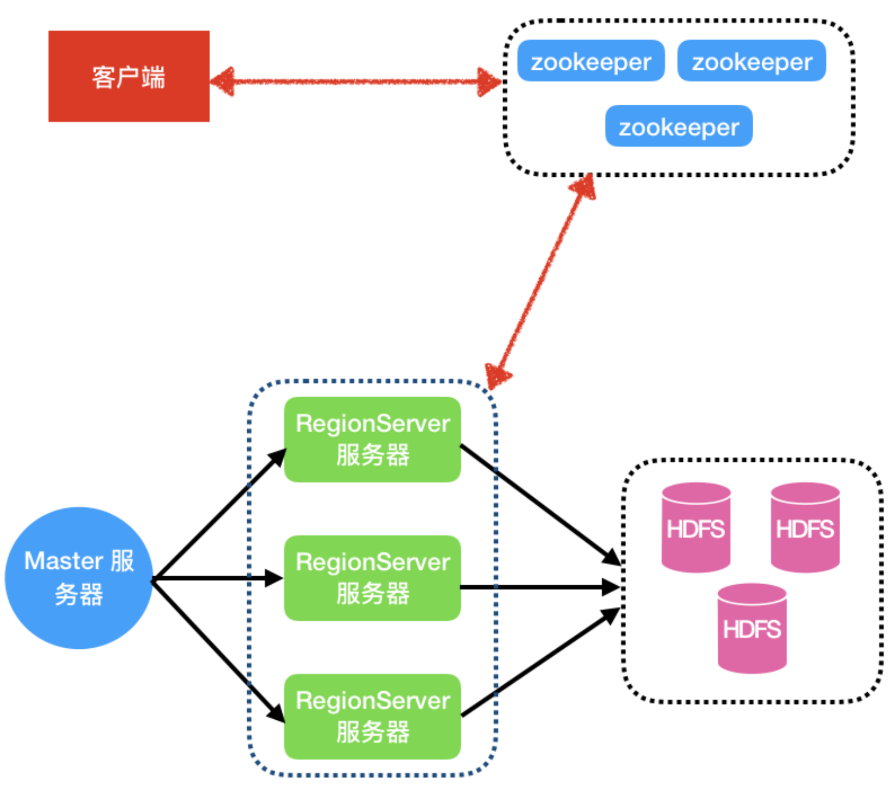
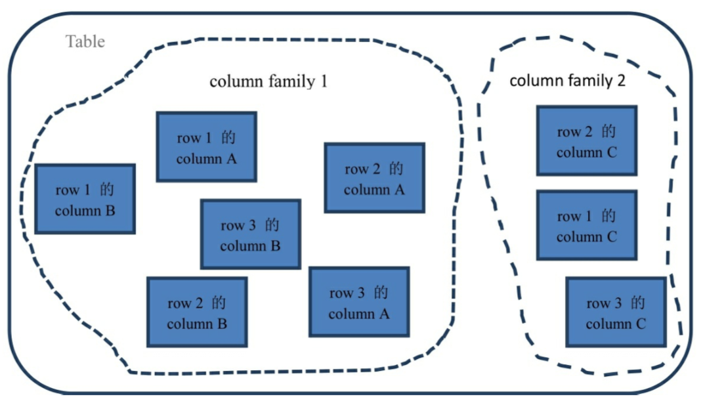

## HBase

HBase是Hadoop Database的简称，是建立在Hadoop文件系统之上的分布式面向列的数据库，为横向发展类型数据库，提供快速随机访问海量结构化数据，它是Hadoop生态系统，提供对数据的随机实时读/写访问，是Hadoop文件系统的一部分，利用了Hadoop的文件系统(HDFS)提供的容错能力。

HBase是分布式、面向列族的开源数据库，HDFS为HBase提供可靠的底层数据存储服务，MapReduce为HBase提供高性能的计算能力，Zookeeper为HBase提供稳定服务和Failover机制，可以说，HBase是一个通过大量廉价的机器解决海量数据的高速存储和读取的分布式数据库解决方案。

HBase 是一个高可靠性、高性能、面向列、可伸缩的分布式存储系统，利用 Hbase 技术可在廉价 PC Server 上搭建起大规模结构化存储集群。

HBase 的目标是存储并处理大型的数据，更具体来说是仅需使用普通的硬件配置，就能够处理由成千上万的行和列所组成的大型数据。

Hbase是一种NoSQL数据库，非常适用于海量明细数据（十亿、百亿）的随机实时查询，如交易清单、轨迹行为等。


HBase并不快，只是当数据量很大的时候它慢的不明显。

### 概述

2006 年 Google 技术人员 Fay Chang 发布了一篇文章 Bigtable: A Distributed Storage System for Structured Data。该文章向世人介绍了一种分布式的数据库，这种数据库可以在局部几台服务器崩溃的情况下继续提供高性能的服务。

2007年 Powerset 公司的工作人员基于此文研发了 BigTable 的Java 开源版本，即HBase。刚开始它只是 Hadoop 的一部分。

2008年 HBase 成为了 Apache 的一个子项目。HBase 几乎实现了 BigTable 的所有特性。它被称为一个开源的非关系型分布式数据库。

2010 年成为 Apache 的顶级项目. HBase 的开发速度打破了一直以来跟 Hadoop 版本一致的惯例，因为 HBase 的版本发布速度已经超越了 Hadoop。它的版本号一下从 0.20.x 跳跃到了 0.89.x。

#### 与 Google BigTable 的区别
HBase 是 Google BigTable 的开源实现，但是也有很多不同之处：

- Google BigTable 利用 GFS 作为其文件存储系统，HBase 利用 Hadoop HDFS 作为其文件存储系统；
- Google 运行 MAPREDUCE来处理 BigTable 中的海量数据，HBase 同样利用 Hadoop MapReduce 来处理 HBase 中的海量数据；
- Google BigTable 利用 Chubby 作为协同服务，HBase 利用 Zookeeper 作为对应。


#### 特点

- 海量存储

    Hbase 适合存储 PB 级别的海量数据，在 PB 级别的数据以及采用廉价 PC 存储的情况下，能在几十到百毫秒内返回数据。这与Hbase的极易扩展性息息相关。

    正式因为Hbase良好的扩展性，才为海量数据的存储提供了便利。

- 列式存储

    这里的列式存储其实说的是列族存储，Hbase是根据列族来存储数据的。

    列族下面可以有非常多的列，列族在创建表的时候不必指定列。

- 极易扩展

    Hbase 的扩展性主要体现在两个方面：

    - 一个是基于上层处理能力（RegionServer）的扩展，
    -  一个是基于存储的扩展(HDFS)

    通过横向添加 RegionSever 的机器，进行水平扩展，提升 Hbase 上层的处理能力，提升 Hbsae 服务更多 Region 的能力。

    备注：RegionServer 的作用是管理 region、承接业务的访问，通过横向添加 Datanode 的机器，进行存储层扩容，提升Hbase 的数据存储能力和提升后端存储的读写能力。

- 高并发

    由于目前大部分使用 Hbase 的架构，都是采用的廉价 PC，因此单个 IO 的延迟其实并不小，一般在几十到上百ms之间。这里说的高并发，主要是在并发的情况下，Hbase 的单个 IO 延迟下降并不多。能获得高并发、低延迟的服务。

- 稀疏

    稀疏主要是针对 Hbase 列的灵活性，在列族中，你可以指定任意多的列，在列数据为空的情况下，是不会占用存储空间的。


### 架构


在 Hbase 中有两种服务器:Master 服务器、RegionServer 服务器。一般一个 HBase 集群有一个 Master 服务器和几个 RegionServer 服务器。Master 服务器负责维护表结构信息，实际的数据都存储在 RegionServer 服务器上.

客户端获取数据由客户端直连 RegionServer 的，所以当Master挂掉之后依然可以查询数据，但就是不能新建表了。

RegionServer 是直接负责存储数据的服务器。RegionServer 保存的表数据直接存储在 Hadoop 的 HDFS 上。

RegionServer 非常依赖 ZooKeeper 服务，可以说没有 ZooKeeper 就没有 HBase。

ZooKeeper 在 HBase 中扮演的角色类似一个管家。ZooKeeper 管理了 HBase 所有RegionServer 的信息，包括具体的数据段存放在哪个 RegionServer 上。

客户端每次与 HBase 连接，其实都是先与 ZooKeeper 通信，查询出哪个 RegionServer 需要连接，然后再连接 RegionServer。

ACID，指数据库事务正确执行的四个基本要素的缩写，即：原子性（Atomicity），一致性（Consistency），隔离性（Isolation），持久性（Durability）。

HBase支持单行操作下的ACID，即对同一行的Put操作保证完全的ACID。

#### Master

可能你们会想当然地觉得 Master 是 HBase 的领导，所有的数据、所有的操作都会经过它。错！其实在HBase中Master的角色不像领导，更像是打杂的。

客户端从 ZooKeeper 获取了 RegionServer 的地址后，会直接从 RegionServer 获取数据。其实不光是获取数据，包括插入、删除等所有的数据操作都是直接操作 RegionServer，而不需要经过 Master。

Master 只负责各种协调工作（其实就是打杂），比如建表、删表、移动Region、合并等操作。它们的共性就是需要跨 RegionServer，这些操作由哪个 RegionServer 来执行都不合适，所以 HBase 就将这些操作放到了 Master 上了。

这种结构的好处是大大降低了集群对 Master 的依赖。而 Master 节点一般只有一个到两个，一旦宕机，如果集群对 Master 的依赖度很大，那么就会产生单点故障问题。

在 HBase 中，即使 Master 宕机了，集群依然可以正常地运行，依然可以存储和删除数据。

但是，如果 Master 长时间宕机也是不行的，毕竟他还是有一些工作需要做的.

主要功能：

1. 监控 RegionServer 
2. 处理 RegionServer 故障转移 
3. 处理元数据的变更 
4. 处理 Region 的分配或转移 
5. 在空闲时间进行数据的负载均衡 
6. 通过 Zookeeper 发布自己的位置给客户端


#### RegionServer
RegionServer 就是存放 Region 的容器，直观上说就是服务器上的一个服务(进程)。

一般来说，一个服务器只会安装一个 RegionServer 服务，不过你实在想在一个服务器上装多个 RegionServer 服务也不是不可以。

当客户端从 ZooKeeper 获取 RegionServer 的地址后，它会直接从 RegionServer获取数据。

优点类似于 Hadoop 中的 DataNode

RegionServer 主要工作：

1. 负责存储 HBase 的实际数据 
2. 处理分配给它的 Region 
3. 刷新缓存到 HDFS 
4. 维护 Hlog 
5. 执行压缩 
6. 负责处理 Region 分片

#### Region
Region 就是一段数据的集合。HBase中的表一般拥有一个到多个 Region。

最初，每张表只有一个 region，当一个 region 变得太大时，它就分裂成 2 个子 region。2个子 region，各占原始 region 的一半数据，仍然被相同的 region server 管理。然后 Region server 向 HBase master 节点汇报拆分完成.

如果集群内还有其他 region server，master 节点倾向于做负载均衡，所以 master 节点有可能调度新的 region 到其他 region server，由其他 region 管理新的分裂出的 region。

Region 的拆分分为自动拆分和手动拆分。

自动拆分采用不同的策略。0.94 版本之前采用的是 ConstantSizeRegionSplitPolicy 策略。从名字上就可以看出这个策略就是按照固定大小来拆分Region。它唯一用到的参数是： hbase.hregion.max.filesize, 默认值是 10G。0.94 版本之后，默认使用 IncreasingToUpperBoundRegionSplitPolicy 策略。这种策略从名字上就可以看出是限制不断增长的文件尺寸的策略。我们以前使用传统关系型数据库的时候或许有这样的经验，有的数据库的文件增长是翻倍增长的，比如第一个文件是64MB，第二个就是 128MB，第三个就是256MB。

Region有以下特性：

- Region 不能跨服务器，一个 RegionServer 上有一个或者多个 Region。
- 数据量小的时候，一个 Region 足以存储所有数据；但是，当数据量大的时候，HBase会拆分 Region。
- 当 HBase 在进行负载均衡的时候，也有可能会从一台 RegionServer 上把 Region移动到另一台 RegionServer 上。
- Region 是基于 HDFS 的，它的所有数据存取操作都是调用了 HDFS 的客户端接口来实现的。


#### 存储

最基本的存储单位是列（column），一个列或者多个列形成一行 （row）。

传统数据库是严格的行列对齐。比如这行有三个列a、b、c，下一行肯定也有三个列a、b、c。

而在HBase中，这一行有三个列 a、b、 c，下一个行也许是有 4 个列a、e、f、g。在HBase 中，行跟行的列可以完全不一样，这个行的数据跟另外一个行的数据也可以存储在不同的机器上，甚至同一行内的列也可以存储在完全不同的机器上！

每个行（row）都拥有唯一的行键（row key）来标定这个行的唯一性。每个列都有多个版本，多个版本的值存储在单元格（cell）中。

若干个列又可以被归类为一个列族。



- 命名空间（Namespace）：对表的逻辑分组，类似于关系型数据库中的Database概念。Namespace可以帮助用户在多租户场景下做到更好的资源和数据隔离。
- 表（Table）：HBase会将数据组织进一张张的表里面，一个HBase 表由多行组成。
- 行（Row）：HBase中的一行包含一个行键和一个或多个与其相关的值的列。在存储行时，行按字母顺序排序。出于这个原因，行键的设计非常重要。目标是以相关行相互靠近的方式存储数据。常用的行键模式是网站域。如果你的行键是域名，则你可能应该将它们存储在相反的位置（org.apache.www，org.apache.mail，org.apache.jira）。这样表中的所有Apache域都彼此靠近，而不是根据子域的第一个字母分布。
- 列（Column） ：HBase中的列由一个列族和一个列限定符组成，它们由冒号（:）字符分隔。
- 列族（Column Family）：由于性能原因，列族在物理上共同存在一组列和它们的值。在HBase中每个列族都有一组存储属性，例如其值是否应缓存在内存中，数据如何压缩或其行编码是如何编码的等等。表中的每一行都有相同的列族，但给定的行可能不会在给定的列族中存储任何内容。列族一旦确定后，就不能轻易修改，因为它会影响到HBase真实的物理存储结构，但是列族中的列标识（Column Qualifier）以及其对应的值可以动态增删。
- 列限定符（Column Qualifier）：列限定符被添加到列族中，以提供给定数据段的索引。鉴于列族的content，列限定符可能是content:html，而另一个可能是content:pdf。虽然列族在创建表时是固定的，但列限定符是可变的，并且在行之间可能差别很大。
- 单元格（Cell） ：单元格是行、列族和列限定符的组合，并且包含值和时间戳，它表示值的版本。
- 时间戳（Timestamp） ：时间戳与每个值一起编写，并且是给定版本的值的标识符。默认情况下，时间戳表示写入数据时RegionServer上的时间，但可以在将数据放入单元格时指定不同的时间戳值。


##### 三维有序存储

Hfile是HBase中Key-value数据的存储格式。key就是{row key，column key (= <family> + <label>)，version} ，而value就是cell中的值。

HBase的三维有序存储中的三维是指：rowkey（行主键），column key(= columnFamily + <label>)，timestamp(时间戳或者版本号)三部分组成的三维有序存储。

数据首先按rowkey字典排序，如果rowkey相同，则再根据column key来排序的，也是按字典排序。然后是按label排序。

timestamp 时间戳按降序排序的，即最新的数据排在最前面。

##### Rowkey

Rowkey的概念和mysql中的主键是完全一样的，Hbase使用Rowkey来唯一的区分某一行的数据。

Hbase只支持3种查询方式：

1. 基于Rowkey的单行查询 
2. 基于Rowkey的范围扫描 
3. 全表扫描

因此，Rowkey对Hbase的性能影响非常大，Rowkey的设计就显得尤为的重要。设计的时候要兼顾基于Rowkey的单行查询也要兼顾Rowkey的范围扫描。

在 HBase 内部，rowkey 保存为字节数组。

rowkey 行键可以是任意字符串，最大长度是64KB，实际应用中长度一般为 10\~100bytes。不过建议是越短越好，控制在 64 个字节以内是比较好。目前操作系统是都是 64 位系统，内存 8 字节对齐。控制在 8 个字节的次幂比较好: 比如，16字节，32字节，64字节比较好。

HBase 中无法根据某个column来排序 系统永远是根据 rowkey 来排序的。因此，rowkey 就是决定 row 存储顺序的唯一凭证。而这个排序也很简单：根据字典排序。

如果插入 HBase 的时候，不小心用了之前已经存在的 rowkey。那就会把之前存在的那个row 更新掉。之前已经存在的值会被放到这个单元格的历史记录里面，并不会丢掉，只是需要带上版本参数才可以找到这个值。

一个列上可以存储多个版本的单元格。单元格就是数据存储的最小单元。

##### ColumnFamily

Hbase通过列族划分数据的存储，列族可以包含任意多的列，实现灵活的数据存取。列族是由一个一个的列组成（任意多）。

Hbase表的创建的时候就必须指定列族。就像关系型数据库创建的时候必须指定具体的列是一样的。

Hbase的列族不是越多越好，官方推荐的是列族最好小于或者等于3。

HBase会把相同列族的列尽量放在同一台机器上，所以说，如果想让某几个列被放到一起，你就给他们定义相同的列族。

##### Column
列，可理解成MySQL列。

在 HBase 中一个列的名称前面总是带着它所属的列族。列名称的规范是列族:列名，比如brother:age、brother:name、parent:age、 parent:name。

##### timestamp
timestamp 时间戳

##### 单元格

虽然列已经是 HBase 的最基本单位了，但是，一个列上可以存储多个版本的值，多个版本的值被存储在多个单元格里面，多个版本之间用版本号(Version)来区分。

所以，唯一确定一条结果的表达式应该是行键:列族:列:版本号（rowkey:column family:column:version）。

不过，版本号是可以省略的，默认最后一个版本。

每个列或者单元格的值都被赋予一个时间戳。这个时间戳默认是由系统制定的，也可以由用户显示指定。

##### Rigion 和行的关系
一个 Region 就是多个行的集合。在 Region 中行的排序按照行键（rowkey）字典排序。


#### OLTP 和 OLAP
数据处理大致可以分成两大类：联机事务处理OLTP（on-line transaction processing）、联机分析处理OLAP（On-Line Analytical Processing）。

OLTP是传统的关系型数据库的主要应用，主要是基本的、日常的事务处理，例如银行交易。

面向行的数据库适用于联机事务处理(OLTP)，这样的数据库被设计为小数目的行和列。

OLAP是数据仓库系统的主要应用，支持复杂的分析操作，侧重决策支持，并且提供直观易懂的查询结果。

面向列的数据库适用于在线分析处理(OLAP)，可以设计为巨大表。


### 安装和使用
Hbase 也有 3 种运行模式:

- 单机模式
- 伪分布模式
- 完全分布式模式

https://hbase.apache.org/book.html#quickstart

#### 单机模式
Standalone HBase

包含所有 HBase 守护进程：HMaster、RegionServers 和 ZooKeeper（在一个持久化到本地文件系统的 JVM 中运行）。

```shell
start-hbase.sh

hbase-daemon.sh start master
hbase-daemon.sh start regionserver

stop-hbase.sh
```

#### 伪分布模式
Pseudo-Distributed for Local Testing

hbase-site.xml
```xml
<configuration>
  <property>
    <name>hbase.cluster.distributed</name>
    <value>true</value>
  </property>
  <!-- hbase存放数据目录 -->
  <property>
    <name>hbase.rootdir</name>
    <value>hdfs://hadoop101:9000/hbase</value>
  </property>
<!--
  <property>
    <name>hbase.tmp.dir</name>
    <value>./tmp</value>
  </property>
  <property>
    <name>hbase.unsafe.stream.capability.enforce</name>
    <value>false</value>
  </property>
-->
</configuration>
```

```shell
start-hbase.sh

local-master-backup.sh start 2 3 5
cat /tmp/hbase-xxx-1-master.pid |xargs kill -9
cat /tmp/hbase-xxx-2-master.pid |xargs kill -9
cat /tmp/hbase-xxx-master.pid |xargs kill -9

local-regionservers.sh start 2 3 4 5
local-regionservers.sh stop 3

stop-hbase.sh

```
Each HMaster uses two ports (16000 and 16010 by default). The port offset is added to these ports, so using an offset of 2, the backup HMaster would use ports 16002 and 16012. The following command starts 3 backup servers using ports 16002/16012, 16003/16013, and 16005/16015.


#### 完全分布模式
Fully Distributed for Production

| Node Name | Master | ZooKeeper | RegionServer |
| --------- | ------ | --------- | ------------ |
| node-a    | yes    | yes       | no           |
| node-b    | backup | yes       | yes          |
| node-c    | no     | yes       | yes          |

修改 conf/hbase-env.sh 文件
`export HBASE_MANAGES_ZK=false`

修改 conf/hbase-site.xml
```xml
<!-- hbase 在 hdfs 上存储数据时的目录 -->
<property>     
    <name>hbase.rootdir</name>     
    <value>hdfs://hadoop201:9000/hbase</value>   
</property>

<!-- 是否开启集群 -->
<property>   
    <name>hbase.cluster.distributed</name>
    <value>true</value>
</property>

<!-- master 的端口号 0.98后的新变动，之前版本没有.port,默认端口为16000 -->
<property>
    <name>hbase.master.port</name>
    <value>16000</value>
</property>

<!-- 配置 Zookeeper -->
<property>   
    <name>hbase.zookeeper.quorum</name>
    <value>hadoop101:2181,hadoop102:2181,hadoop103:2181</value>
</property>
<!-- Zookeeper 的 dataDir 目录 -->
<property>   
    <name>hbase.zookeeper.property.dataDir</name>
    <value>/data/zookeeper</value>
</property>
```

修改conf/regionservers文件。这个类似于 Hadoop 中的 slaves 文件，用来配置 Hbase 集群中的 RegionServer 的。
```
hadoop101
hadoop102
hadoop103
```

由于 Hbase 需要向 HDFS 中写入数据。所以 Hbase 需要知道 Hadoop 的一些配置。有 3 种办法：

1. 在 hbase-env.sh 文件中添加一个变量 HBASE_CLASSPATH 指向 HADOOP_CONF_DIR。
2. 把 hdfs-site.xml和core-site.xml copy 到 conf 目录下，或者更好的方式: 创建一个到 hdfs-site.xml, core-site.xml的软连接
    ```shell
    ln -s /usr/local/hadoop-2.10.1/etc/hadoop/core-site.xml /usr/local/hbase-1.3.1/conf/core-site.xml
    ln -s /usr/local/hadoop-2.10.1/etc/hadoop/hdfs-site.xml /usr/local/hbase-1.3.1/conf/hdfs-site.xml
    ```
3. 如果 hdfs 的配置比较少，直接 copy 到 hbase-site.xml 文件中。

```shell
start-dfs.sh
start-yarn.sh
zkServer.sh start
```

#### hbase shell

```shell
help # 帮助命令

list # 查看当前数据库中有哪些表


# 创建一个表，表名叫student，这个表内有一个列族叫info
# 定义表的时候不需要定义列.
create 'student','info'


# Hbase 是使用 put 命令向表中插入数据的.
put 'student','1001','info:sex','male'
put 'student','1001','info:age','20'

put 'student','1002','info:name','zhiling'
put 'student','1002','info:sex','female'
put 'student','1002','info:age','18'


# 查看表数据 - 全表扫描
scan 'student'

# 查看表数据 - 限制起始行和结束行的扫描
# STARROW和STOPROW必须大写.
# 显示的结果也是前闭后开的区间
scan 'student', {STARTROW => '1002'}
scan 'student', {STARTROW => '1001', STOPROW => '1001'}

# 查看表数据 - 获取指定行或者指定列的数据
get 'student', '1001' # 指定行
get 'student', '1001', 'info:age' # 指定列
get 'student', '1001', {COLUMN =>  'info:age', VERSIONS => 2} # 指定版本数


# 统计表数据行
count 'student'


# 更新指定列的数据
# 更新数据和添加数据的操作是一样的，都是使用的 put 命令.
# 如果指定行的列不存在就是添加，如果存在就是更新值. 但是旧值还存在，只是形成了不同的版本.
put 'student','1002','info:name','lisi'
put 'student','1002','info:name','fengjie'

# 删除数据
deleteall 'student', '1001' # 删除某行所有数据
delete 'student','1002','info:sex' # 删除某列数据

# 清空表数据
# 清空表会自动先 disable，然后再 truncate。
truncate 'student'

# 删除表
# 需要先把表 disable，然后再 drop
disable 'student'
drop 'student'

# 查看表结构
describe 'student'

# 变更表结构
alter 'student', {NAME => 'info', VERSIONS => 3} #  设置表 student 中ifno列族每列可以保存 3 个版本的数据

# 快照
snapshot 'student', 'student20211201'

# 列出快照
list_snapshots 

# 删除快照
delete_snapshot 'student20211201' 

# 快照恢复
disable 'student'
restore_snapshot 'student20211201'
enable 'student'

# 从快照克隆表
clone_snapshot 'student20211201', 'myTable' 


# Distcp
# CopyTable
# export  import 


list_namespace

list_namespace_tables "default"
list_namespace_tables "hbase"

describe_namespace "hbase"

create_namespace "test"
create_namespace "test002", {"author"=>"testor", "create_time"=>"2021-12-02 17:51:53"}

# 修改属性
alter_namespace "test", {METHOD => 'set', 'PROPERTY_NAME' => 'PROPERTY_VALUE'}

# 删除属性
alter_namespace 'test', {METHOD => 'unset', NAME=>'PROPERTY_NAME'}

drop_namespace 'test'

create 'test:student','info'

scan 'hbase:meta'
scan 'hbase:namespace'
```

### 配置


```hbase-env.sh
hbase_thrift_opts $HBASE_JMX_BASE -Dcom.sun.management.jmxremote.port=10103
hbase_regionserver_opts -Xms1536m -Xmx1536m -Xmn256m -verbose:gc -XX:+PrintGCDetails -XX:SurvivorRatio=2 -XX:+UseCMSInitiatingOccupancyOnly -XX:CMSInitiatingOccupancyFraction=85 -Xloggc:$HBASE_LOG_DIR/gc-regionserver.log -XX:PermSize=64m $HBASE_JMX_BASE -Dcom.sun.management.jmxremote.port=10102
hbase_master_opts -Xms128m -Xmx128m -Xmn64m -verbose:gc -XX:+PrintGCDetails -XX:SurvivorRatio=2 -XX:+UseCMSInitiatingOccupancyOnly -XX:CMSInitiatingOccupancyFraction=85 -Xloggc:$HBASE_LOG_DIR/gc-hmaster.log -XX:PermSize=64m $HBASE_JMX_BASE -Dcom.sun.management.jmxremote.port=10101
hbase_opts
hbase_jmx_base -Dcom.sun.management.jmxremote.ssl=false -Dcom.sun.management.jmxremote.authenticate=false
hbase_security_opts 
```

```hbase-site.xml
hbase.balancer.period 300000
hbase.bulkload.staging.dir ${hbase.fs.tmp.dir}
hbase.cells.scanned.per.heartbeat.check 10000
hbase.cluster.distributed true
hbase.column.max.version 1
hbase.config.read.zookeeper.config false
hbase.coordinated.state.manager.class org.apache.hadoop.hbase.coordination.ZkCoordinatedStateManager

hbase.coprocessor.abortonerror true
hbase.coprocessor.enabled true
hbase.coprocessor.master.classes
hbase.coprocessor.region.classes
hbase.coprocessor.user.enabled true

hbase.data.umask 000
hbase.data.umask.enable false

hbase.dfs.client.read.shortcircuit.buffer.size 131072
hbase.dynamic.jars.dir ${hbase.rootdir}/lib
hbase.fs.tmp.dir /user/${user.name}/hbase-staging

hbase.hregion.majorcompaction 864000000
hbase.hregion.majorcompaction.jitter 0.50
hbase.hregion.max.filesize 8589934592
hbase.hregion.memstore.block.multiplier 24
hbase.hregion.memstore.chunkpool.initialsize 1
hbase.hregion.memstore.chunkpool.maxsize 0.1
hbase.hregion.memstore.flush.size 134217728
hbase.hregion.memstore.mslab.enabled true
hbase.hregion.percolumnfamilyflush.size.lower.bound 16777216
hbase.hregion.preclose.flush.size 5242880

hbase.hstore.blockingStoreFiles 50
hbase.hstore.blockingWaitTime 3000
hbase.hstore.bytes.per.checksum 16384
hbase.hstore.checksum.algorithm CRC32
hbase.hstore.compaction.kv.max 10
hbase.hstore.compaction.max 10
hbase.hstore.compaction.max.size 2147483648
hbase.hstore.compaction.min 3
hbase.hstore.compaction.min.size 33554432
hbase.hstore.compactionThreshold 3
hbase.hstore.flusher.count 2
hbase.hstore.time.to.purge.deletes 0
hbase.hstore.useExploringCompation true

hbase.ipc.server.callqueue.handler.factor 0.1
hbase.ipc.server.callqueue.read.ratio 0
hbase.ipc.server.callqueue.scan.ratio 0

hbase.lease.recovery.dfs.timeout 64000
hbase.lease.recovery.timeout 900000

hbase.local.dir ${hbase.tmp.dir}/local/

hbase.master.catalog.timeout 600000
hbase.master.distributed.log.replay false
hbase.master.hfilecleaner.plugins org.apache.hadoop.hbase.master.cleaner.TimeToLiveHFileCleaner
hbase.master.info.bindAddress 0.0.0.0
hbase.master.info.port 16010
hbase.master.infoserver.redirect true
hbase.master.loadbalancer.class org.apache.hadoop.hbase.master.balancer.StochasticLoadBalancer
hbase.master.logcleaner.plugins org.apache.hadoop.hbase.master.cleaner.TimeToLiveLogCleaner
hbase.master.logcleaner.ttl 600000
hbase.master.port 16000

hbase.metrics.exposeOperationTimes true
hbase.metrics.showTableName true

hbase.online.schema.update.enable true

hbase.procedure.master.classes null
hbase.procedure.regionserver.classes

hbase.regions.slop 0.2

hbase.regionserver.catalog.timeout 600000
hbase.regionserver.checksum.verify true
hbase.regionserver.dns.interface default
hbase.regionserver.dns.nameserver default
hbase.regionserver.global.memstore.lowerLimit 0.3
hbase.regionserver.global.memstore.size 0.35
hbase.regionserver.handler.abort.on.error.percent 0.5
hbase.regionserver.handler.count 100
hbase.regionserver.hlog.blocksize 268435456
hbase.regionserver.hlog.reader.impl org.apache.hadoop.hbase.regionserver.wal.ProtobufLogReader
hbase.regionserver.hlog.splitlog.writer.threads 3
hbase.regionserver.hlog.writer.impl org.apache.hadoop.hbase.regionserver.wal.ProtobufLogWriter
hbase.regionserver.info.bindAddress 0.0.0.0
hbase.regionserver.info.port 16030
hbase.regionserver.info.port.auto false
hbase.regionserver.logroll.errors.tolerated 2
hbase.regionserver.logroll.period 3600000
hbase.regionserver.maxlogs 32
hbase.regionserver.msginterval 3000
hbase.regionserver.optionalcacheflushinterval 3600000
hbase.regionserver.port 16020
hbase.regionserver.region.split.policy org.apache.hadoop.hbase.regionserver.IncreasingToUpperBoundRegionSplitPolicy
hbase.regionserver.regionSplitLimit 1000
hbase.regionserver.storefile.refresh.period 0
hbase.regionserver.thread.compaction.large 1
hbase.regionserver.thread.compaction.small 1
hbase.regionserver.thread.compaction.throttle 268435456
hbase.regionserver.thrift.compact false
hbase.regionserver.thrift.framed false
hbase.regionserver.thrift.framed.max_frame_size_in_mb 2

hbase.replication false

hbase.rest.filter.classes org.apache.hadoop.hbase.rest.filter.GzipFilter
hbase.rest.port 8080
hbase.rest.readonly false
hbase.rest.support.proxyuser false
hbase.rest.threads.max 100
hbase.rest.threads.min 2

hbase.rootdir hdfs://emr-header-1.cluster-245192:9000/hbase
hbase.rootdir.perms 700

hbase.rpc.shortoperation.timeout 10000
hbase.rpc.timeout 60000

hbase.rs.cacheblocksonwrite false

hbase.server.compactchecker.interval.multiplier 1000
hbase.server.hostname.useip true
hbase.server.scanner.max.result.size 104857600
hbase.server.thread.wakefrequency 10000
hbase.server.versionfile.writeattempts 3

hbase.snapshot.enabled true
hbase.snapshot.restore.failsafe.name hbase-failsafe-{snapshot.name}-{restore.timestamp}
hbase.snapshot.restore.take.failsafe.snapshot true

hbase.status.listener.class org.apache.hadoop.hbase.client.ClusterStatusListener$MulticastListener
hbase.status.multicast.address.ip 226.1.1.3
hbase.status.multicast.address.port 16100
hbase.status.published false
hbase.status.publisher.class org.apache.hadoop.hbase.master.ClusterStatusPublisher$MulticastPublisher

hbase.storescanner.parallel.seek.enable false
hbase.storescanner.parallel.seek.threads 10

hbase.table.lock.enable true
hbase.table.max.rowsize 1073741824

hbase.thrift.htablepool.size.max 1000
hbase.thrift.maxQueuedRequests 1000
hbase.thrift.maxWorkerThreads 1000
hbase.thrift.minWorkerThreads 16

hbase.tmp.dir ${java.io.tmpdir}/hbase-${user.name}

hbase.zookeeper.dns.interface default
hbase.zookeeper.dns.nameserver default
hbase.zookeeper.leaderport 3888
hbase.zookeeper.peerport 2888
hbase.zookeeper.property.clientPort 2181
hbase.zookeeper.property.dataDir /mnt/disk1/hbase/zk-data/zookeeper
hbase.zookeeper.property.initLimit 10
hbase.zookeeper.property.maxClientCnxns 300
hbase.zookeeper.property.syncLimit 5
hbase.zookeeper.quorum emr-worker-2.cluster-245192,emr-header-1.cluster-245192,emr-worker-1.cluster-245192
hbase.zookeeper.useMulti true

hfile.block.bloom.cacheonwrite false
hfile.block.cache.size 0.4
hfile.block.index.cacheonwrite false
hfile.index.block.max.size 131072

io.storefile.bloom.block.size 131072
master_hostname emr-header-1

replication.sleep.before.failover 5000
replication.source.nb.capacity 2000
replication.source.ratio 1
replication.source.size.capacity 2097152

zookeeper.session.timeout 180000
zookeeper.znode.acl.parent acl
zookeeper.znode.parent /hbase
zookeeper.znode.rootserver root-region-server
```

### 最佳实践

"S" = supported
"X" = not supported
"NT" = Not tested

| Java Version/HBase Version | 1.3+ | 2.1+ |
| -------------------------- | ---- | ---- |
| JDK7                       | S    | X    |
| JDK8                       | S    | S    |
| JDK11                      | X    | NT   |

| Hadoop Version/HBase Version | 0.92.x | 0.94.x | 0.96.x | 0.98.x | 1.0.x | 1.1.x |
| ---------------------------- | ------ | ------ | ------ | ------ | ----- | ----- |
| Hadoop-0.20.205              | S      | X      | X      | X      | X     | X     |
| Hadoop-0.22.x                | S      | X      | X      | X      | X     | X     |
| Hadoop-1.0.x                 | X      | X      | X      | X      | X     | X     |
| Hadoop-1.1.x                 | NT     | S      | S      | NT     | X     | X     |
| Hadoop-0.23.x                | X      | S      | NT     | X      | X     | X     |
| Hadoop-2.0.x-alpha           | X      | NT     | X      | X      | X     | X     |
| Hadoop-2.1.0-beta            | X      | NT     | S      | X      | X     | X     |
| Hadoop-2.2.0                 | X      | NT     | S      | S      | NT    | NT    |
| Hadoop-2.3.x                 | X      | NT     | S      | S      | NT    | NT    |
| Hadoop-2.4.x                 | X      | NT     | S      | S      | S     | S     |
| Hadoop-2.5.x                 | X      | NT     | S      | S      | S     | S     |
| Hadoop-2.6.x                 | X      | NT     | NT     | NT     | S     | S     |
| Hadoop-2.7.x                 | X      | NT     | NT     | NT     | NT    | NT    |


| Hadoop Version/HBase Version | 1.2.x | 1.3.x | 1.4.x | 1.5.x | 1.7.x | 2.0.x | 2.1.x | 2.2.x | 2.3.x | 2.4.x |
| ---------------------------- | ----- | ----- | ----- | ----- | ----- | ----- | ----- | ----- | ----- | ----- |
| Hadoop-2.4.x                 | S     | S     | X     | X     | X     | X     | X     | X     | X     | X     |
| Hadoop-2.5.x                 | S     | S     | X     | X     | X     | X     | X     | X     | X     | X     |
| Hadoop-2.6.0                 | X     | X     | X     | X     | X     | X     | X     | X     | X     | X     |
| Hadoop-2.6.1+                | S     | S     | X     | X     | X     | S     | X     | X     | X     | X     |
| Hadoop-2.7.0                 | X     | X     | X     | X     | X     | X     | X     | X     | X     | X     |
| Hadoop-2.7.1+                | S     | S     | S     | X     | X     | S     | S     | X     | X     | X     |
| Hadoop-2.8.[0-2]             | X     | X     | X     | X     | X     | X     | X     | X     | X     | X     |
| Hadoop-2.8.[3-4]             | NT    | NT    | NT    | X     | X     | S     | S     | X     | X     | X     |
| Hadoop-2.8.5+                | NT    | NT    | NT    | S     | S     | S     | S     | S     | X     | X     |
| Hadoop-2.9.[0-1]             | X     | X     | X     | X     | X     | NT    | X     | X     | X     | X     |
| Hadoop-2.9.2+                | NT    | NT    | NT    | S     | S     | NT    | NT    | S     | X     | S     |
| Hadoop-2.10.0                | NT    | NT    | NT    | S     | S     | NT    | NT    | S     | S     | S     |
| Hadoop-3.0.[0-2]             | X     | X     | X     | X     | X     | X     | X     | X     | X     | X     |
| Hadoop-3.0.3+                | X     | X     | X     | X     | X     | S     | S     | X     | X     | X     |
| Hadoop-3.1.0                 | X     | X     | X     | X     | X     | X     | X     | X     | X     | X     |
| Hadoop-3.1.1+                | X     | X     | X     | X     | X     | S     | S     | S     | S     | S     |
| Hadoop-3.2.x                 | X     | X     | X     | X     | X     | X     | X     | S     | S     | S     |
| Hadoop-3.3.x                 | X     | X     | X     | X     | X     | X     | X     | X     | S     | S     |


##### 高可用
HBase 集群支持对 Hmaster 的高可用配置。

##### 预分区

每一个 region 维护着 startRow 与 endRowKey，如果加入的数据符合某个region 维护的 rowKey 范围，则该数据交给这个 region 维护。

那么依照这个原则，我们可以将数据所要投放的分区提前大致的规划好，以提高HBase 性能。在生产环境中，基本都会对表进行预分区。

有几种预分区的方式:

1. 手动设定分区点
`create 'staff1','info','partition1',SPLITS =>['1000','2000','3000','4000']`

2. 生成16进制序列预分区
`create 'staff2','info','partition2',{NUMREGIONS => 15, SPLITALGO => 'HexStringSplit'}`

3. 按照文件中设置的规则预分区
创建splits.txt文件内容如下：
```txt
aaaa
bbbb
cccc
dddd
```

然后执行：`create 'staff3','partition3',SPLITS_FILE => 'splits.txt'`

4. 使用 JavaAPI 创建预分区
```java
//自定义算法，产生一系列Hash散列值存储在二维数组中
byte[][] splitKeys = 某个散列值函数
//创建HBaseAdmin实例
HBaseAdmin hAdmin = new HBaseAdmin(HBaseConfiguration.create());
//创建HTableDescriptor实例
HTableDescriptor tableDesc = new HTableDescriptor(tableName);
//通过HTableDescriptor实例和散列值二维数组创建带有预分区的HBase表
hAdmin.createTable(tableDesc, splitKeys);
```
例如：
```java
public static void customSplitRegion(String tableName, String f1) throws IOException {
    if (isTableExists(tableName)) return;


    HTableDescriptor desc = new HTableDescriptor(TableName.valueOf(tableName));
    desc.addFamily(new HColumnDescriptor(f1));
    byte[][] keys = {
            Bytes.toBytes("aa"),
            Bytes.toBytes("bb"),
            Bytes.toBytes("cc"),
            Bytes.toBytes("dd"),
    };
    admin.createTable(desc, keys);

}
```

#### RowKey 设计
一条数据的唯一标识就是 rowkey，那么这条数据存储于哪个分区，取决于 rowkey 处于哪个一个预分区的区间内。设计 rowkey 的主要目的 ，就是让数据均匀的分布于所有的 region 中，在一定程度上防止数据倾斜。

如何设计rowkey 使写入数据时尽量均匀地写到各个 Region 中，起到负载均衡的作用。读取数据时要把一次查询的数据聚集到一个 Region 中，加速查询。

rowkey既想要能够快速检索，就想要内容最好集中到少量的region中，但是一旦集中了，就会产生热点问题，所以，他们是相伴相生。


**字符串类型**

虽然行键在 HBase 中是以 byte[] 字节数组的形式存储的，但是建议在系统开发过程中将其数据类型设置为String类型，保证通用性；如果在开发过程中将 RowKey 规定为其他类型，譬如Long型，那么数据的长度将可能受限于编译环境等所规定的数据长度。

常用的行键字符串有以下几种：

- 纯数字字符串，譬如9559820140512；
- 数字+特殊分隔符，譬如95598-20140512;
- 数字+英文字母，譬如city20140512；
- 数字+英文字母+特殊分隔符，譬如city_20140512。


**有明确的意义**

RowKey 的主要作用是为了进行数据记录的唯一性标示，但是唯一性并不是其全部，具有明确意义的行键对于应用开发、数据检索等都具有特殊意义。

譬如上面的数字字符串9559820140512，其实际意义是这样：95598（电网客服电话）+20140512（日期）。

行键往往由多个值组合而成，而各个值的位置顺序将影响到数据存储和检索效率，所以在设计行键时，需要对日后的业务应用开发有比较深入的了解和前瞻性预测，才能设计出可尽量高效率检索的行键。


**具有有序性**

RowKey 是按照字典序存储，因此，设计 RowKey 时，要充分利用这个排序特点，将经常一起读取的数据存储到一块，将最近可能会被访问的数据放在一块。

举个例子：如果最近写入 HBase 表中的数据是最可能被访问的，可以考虑将时间戳作为RowKey 的一部分，由于是字典序排序，所以可以使用 Long.MAX_VALUE–timestamp作为 RowKey，这样能保证新写入的数据在读取时可以被快速命中。

如果 Rowkey 是按时间戳的方式递增，不要将时间放在二进制码的前面，建议将Rowkey的高位作为散列字段，由程序循环生成，低位放时间字段，这样将提高数据均衡分布在每个 Regionserver 实现负载均衡的几率。

如果没有散列字段，首字段直接是时间信息将产生所有新数据都在一个 RegionServer 上堆积的热点现象，这样在做数据检索的时候负载将会集中在个别 RegionServer，降低查询效率。


**具有定长性**

行键具有有序性的基础便是定长。

譬如20140512080500、20140512083000，这两个日期时间形式的字符串是递增的，不管后面的秒数是多少，我们都将其设置为 14 位数字形式，如果我们把后面的 0 去除了，那么 201405120805 将大于 20140512083，其有序性发生了变更。

##### 解决热点问题

检索habse的记录首先要通过row key来定位数据行。当大量的client访问hbase集群的一个或少数几个节点，造成少数region server的读/写请求过多、负载过大，而其他region server负载却很小，就造成了“热点”现象。

**热点的解决办法**

预分区：预分区的目的让表的数据可以均衡的分散在集群中，而不是默认只有一个region分布在集群的一个节点上。

加盐：这里所说的加盐不是密码学中的加盐，而是在rowkey的前面增加随机数，具体就是给rowkey分配一个随机前缀以使得它和之前的rowkey的开头不同。

加盐通常用来解决数据热点和范围查询同时存在的场景。

加盐有较强的适用场景要求，场景不合适将会达不到预期期望：

- 写热点或写不均衡：比如以时间作为第一列主键，永远写表头或者表尾。
- 需要范围查询：要按第一列主键进行范围查询，不能使用hash打散。

有热点就要打散，但打散就难以做范围查询。因此，要同时满足这对相互矛盾的需求，必须有一种折中的方案：既能在一定程度上打散数据，又能保证有序。这个解决方案就是加盐，亦称分桶（salt buckets）。数据在桶内保序，桶之间随机。写入时按桶个数取模，数据随机落在某个桶里，保证写请求在桶之间是均衡的。查询时读取所有的桶来保证结果集的有序和完备。

一般来说，严格满足上述条件的业务场景并不常见。大多数场景都可以找到其他的业务字段来协助散列。考虑到其严重的副作用，不建议使用这个特性。

副作用：

- 写瓶颈：一般全表只有buckets个region用于承担写。当业务体量不断增长时，因为无法调整bucket数量，不能有更多的region帮助分担写，会导致写入吞吐无法随集群扩容而线性增加。导致写瓶颈，从而限制业务发展。
- 读扩散：select会按buckets数量进行拆分和并发，每个并发都会在执行时占用一个线程。select本身一旦并发过多会导致线程池迅速耗尽或导致QueryServer因过高的并发而FGC。同时，本应一个RPC完成的简单查询，现在也会拆分成多个，使得查询RT大大增加。

以上副作用会制约业务的发展，尤其对于大体量的、发展快速的业务。因为桶个数不能修改，写瓶颈会影响业务的扩张。读扩散带来的RT增加也大大降低了资源使用效率。

哈希：哈希会使同一行永远用一个前缀加盐。哈希也可以使负载分散到整个集群，但是读却是可以预测的。使用确定的哈希可以让客户端重构完整的rowkey，可以使用get操作准确获取某一个行数据。

反转：反转固定长度或者数字格式的rowkey。这样可以使得rowkey中经常改变的部分（最没有意义的部分）放在前面。这样可以有效的随机rowkey，但是牺牲了rowkey的有序性。


#### 内存优化
HBase 操作过程中需要大量的内存开销，毕竟 Table 是可以缓存在内存中的，一般会分配整个可用内存的 70% 给 HBase 的 Java 堆。

但是不建议分配非常大的堆内存，因为 GC 过程持续太久会导致 RegionServer 处于长期不可用状态，一般 16\~48G 内存就可以了，如果因为框架占用内存过高导致系统内存不足，框架一样会被系统服务拖死。


#### 基础优化
1. 允许在HDFS的文件中追加内容 hdfs-site.xml、hbase-site.xml 属性：dfs.support.append 解释：开启 HDFS 追加同步，可以优秀的配合 HBase 的数据同步和持久化。默认值为true。

2. 优化 DataNode 允许的最大传输的文件数 hdfs-site.xml 属性：dfs.datanode.max.transfer.threads 解释：HBase 一般都会同一时间操作大量的文件，根据集群的数量和规模以及数据动作，设置为4096或者更高。默认值：4096

3. 优化延迟高的数据操作的等待时间 hdfs-site.xml 属性：dfs.image.transfer.timeout 解释：如果对于某一次数据操作来讲，延迟非常高，socket 需要等待更长的时间，建议把该值设置为更大的值（默认60000毫秒），以确保 socket 不会被 timeout 掉。

4. 优化数据的写入效率 mapred-site.xml 属性： mapreduce.map.output.compress mapreduce.map.output.compress.codec 解释：开启这两个数据可以大大提高文件的写入效率，减少写入时间。第一个属性值修改为true，第二个属性值修改为：org.apache.hadoop.io.compress.GzipCodec或者其他压缩方式。

5. 设置 RPC 监听数量 hbase-site.xml 属性：hbase.regionserver.handler.count 解释：默认值为30，用于指定RPC监听的数量，可以根据客户端的请求数进行调整，读写请求较多时，增加此值。

6. 优化HStore文件大小 hbase-site.xml 属性：hbase.hregion.max.filesize 解释：默认值10737418240（10GB），如果需要运行HBase的MR任务，可以减小此值，因为一个region对应一个map任务，如果单个region过大，会导致map任务执行时间过长。该值的意思就是，如果HFile的大小达到这个数值，则这个region会被切分为两个Hfile。

7. 优化 hbase 客户端缓存 hbase-site.xml 属性：hbase.client.write.buffer 解释：用于指定 HBase 客户端缓存，增大该值可以减少RPC调用次数，但是会消耗更多内存，反之则反之。一般我们需要设定一定的缓存大小，以达到减少 RPC 次数的目的。

8. 指定scan.next扫描HBase所获取的行数 hbase-site.xml 属性：hbase.client.scanner.caching 解释：用于指定scan.next方法获取的默认行数，值越大，消耗内存越大。 默认: 2147483647

9. flush、compact、split机制

当 MemStore 达到阈值，将 Memstore 中的数据 Flush 进 Storefile；

compact 机制则是把 flush 出来的小文件合并成大的 Storefile 文件。

split 则是当 Region 达到阈值，会把过大的 Region 一分为二。

涉及属性：

hbase.hregion.memstore.flush.size：134217728 这个参数的作用是当单个 HRegion 内所有的 Memstore 大小总和超过指定值时，flush 该 HRegion 的所有 memstore。RegionServer 的 flush 是通过将请求添加一个队列，模拟生产消费模型来异步处理的。那这里就有一个问题，当队列来不及消费，产生大量积压请求时，可能会导致内存陡增，最坏的情况是触发OOM。

hbase.regionserver.global.memstore.size：0.4 hbase.regionserver.global.memstore.size.lower.limit：0.38 即：当 MemStore 使用内存总量达到总内存的hbase.regionserver.global.memstore.size指定值时，将会有多个MemStores flush 到文件中，MemStore flush 顺序是按照大小降序执行的，直到刷新到 MemStore 使用内存略小于 lowerLimit。

#### FAQ
##### RIT（Region-In-Transition）

为什么会处于RIT状态才是问题探索的根本，也是解决问题的关键。

四种会触发Region状态变迁的操作以及操作对应的Region状态。其中特定操作行为通常包括assign、unassign、split以及merge等，而很多其他操作都可以拆成unassign和assign，比如move操作实际上是先unassign再assign；

Region状态迁移是如何发生的？

这个过程有点类似于状态机，也是通过事件驱动的。和Region状态一样，HBase还定义了很多事件（具体见EventType类）。


### 时空大数据
一个包含管理「空间几何数据」、「时空轨迹」、「专题栅格」、「遥感影像」的时空大数据引擎系统。兼容开源GeoMesa、GeoServer等生态，内置高效的时空索引算法、空间拓扑几何算法、遥感影像处理算法等，结合HBase强大的分布式存储能力以及Spark分析平台能力，可广泛应用于空间/时空/遥感大数据存储、查询、分析与数据挖掘场景。

##### 时空几何

- 时空几何对象。
  + 矢量数据，如点、线、面状要素。
  + 在矢量数据基础上结合时间属性，组成的时空数据或时空轨迹数据。
- 针对时空几何对象的相关操作，如时空关系的判断

##### 时空索引
为时空数据建立高效的时空索引以提供优异的查询性能。在阿里云HBase Ganos中，时空索引以HBase的Rowkey形式存在。

1. ID索引

适应于根据空间对象ID（称为FID）查询的场景，要求每个空间对象的FID必须唯一。

2. Z2/XZ2索引

适应于空间查询，如地理围栏判断、周边范围查询等；其中Z2是用于「点」对象；XZ2用于「线」、「面」对象。

3. Z3/XZ3索引

适应于时空查询，如某个空间范围以及时间段内的历史轨迹等；其中Z3是用于「点」对象；XZ3用于「线」、「面」对象。

4. XYZ索引

适应于含有经度、纬度、高程信息的三维索引，目前仅用于为「点」对象构建三维索引。

5. 属性索引

适应于根据其他属性查询的场景。

```java
// sft为SimpleFeatureType的一个实例对象
sft.getUserData().put("geomesa.indices.enabled", "{index_name}:{col1}:{col2}:...,{index_name}:{col}");

// 一共创建了z3和attr两个索引，其中start列+dtg列为z3索引；end列+dtg列为z3索引；name列和dtg列为attr索引。
sft.getUserData().put("geomesa.indices.enabled", "z3:start:dtg,z3:end:dtg,attr:name:dtg");
```

**说明**

- Index_name取下面常量之一：id,attr,z2,z3,xz2,xz3,xyz。
- col为SimpleFeatureType中定义的列。
- 可以创建多个index，每个index之间用，分割。
- 可以将多个列添加到同一个索引中，索引和每个列之间用：分割。

##### 时空关系
时空关系是指两个时空几何对象之间的时间和空间的相对位置。典型的时空关系包括：相交、相离、覆盖、包含等。 在现实场景中“地理围栏判断”是指一个面状要素表示的地理围栏与目标对象（点、线、面）之间的关系。如果目标对象在地理围栏之内，则称之为包含；在面状要素之外，则称之为相离。 

##### OGC
OGC全称是开放地理空间信息联盟（Open Geospatial Consortium），是一个非盈利的国际标准组织，它制定了数据模型和相关操作的一系列标准，GIS厂商按照这个标准进行开发可保证空间数据的互操作。

##### GeoTools
GeoTools是一个遵循OGC标准，用于处理地理空间数据的工具包，实现了OGC标准的数据模型和接口，很多地理工具都基于GeoTools开发。

##### Geometry
在OGC的定义中，Geometry用来表示一个空间对象，例如空间点对象、空间线对象、空间面对象。Geometry只包含空间对象的位置信息，并不包含其附带的属性信息。 GeoTools提供了GeometryFactory工具类来帮助构建Geometry。具体可以通过两种方式创建：

- 通过Coordinate对象<br/>
这种方式创建比较直观，该对象表示一个坐标点，推荐使用。

- 通过WKT文本创建<br/>
WKT（Well-known text）是一种空间对象的文本标记语言，如字符串"POINT (1 1)"表示一个点对象，其坐标为1，1；字符串"LINESTRING(0 2, 2 0, 8 6)"表示一条线对象，由三个坐标点组成；字符串"POLYGON((20 10, 30 0, 40 10, 30 20, 20 10))"表示一个面对象，最首尾两个坐标点相同构成一个环。

```java
// 点对象
// 通过Coordinate对象创建
GeometryFactory geometryFactory = JTSFactoryFinder.getGeometryFactory();
Coordinate coord = new Coordinate(1, 1);
Point point = geometryFactory.createPoint(coord);

// 通过WKT创建
GeometryFactory geometryFactory = JTSFactoryFinder.getGeometryFactory();
WKTReader reader = new WKTReader(geometryFactory);
Point point = (Point) reader.read("POINT (1 1)");

// 线对象
// 通过Coordinate对象
GeometryFactory geometryFactory = JTSFactoryFinder.getGeometryFactory();
Coordinate[] coords  =
 new Coordinate[] {new Coordinate(0, 2), new Coordinate(2, 0), new Coordinate(8, 6) };
LineString line = geometryFactory.createLineString(coordinates);

// 通过WKT描述：
GeometryFactory geometryFactory = JTSFactoryFinder.getGeometryFactory();
WKTReader reader = new WKTReader( geometryFactory );
LineString line = (LineString) reader.read("LINESTRING(0 2, 2 0, 8 6)");

// 面对象
// 通过Coordinate对象
GeometryFactory geometryFactory = JTSFactoryFinder.getGeometryFactory();
Coordinate[] coords  =
   new Coordinate[] {new Coordinate(4, 0), new Coordinate(2, 2),
                     new Coordinate(4, 4), new Coordinate(6, 2), new Coordinate(4, 0) };
LinearRing ring = geometryFactory.createLinearRing( coords );
LinearRing holes[] = null; // use LinearRing[] to represent holes
Polygon polygon = geometryFactory.createPolygon(ring, holes );
      
// 通过WKT描述：
GeometryFactory geometryFactory = JTSFactoryFinder.getGeometryFactory( null );
WKTReader reader = new WKTReader( geometryFactory );
Polygon polygon = (Polygon) reader.read("POLYGON((20 10, 30 0, 40 10, 30 20, 20 10))");

```

##### SimpleFeature
简单要素，SimpleFeature包含Geometry以及其他属性信息。通常所说的一个轨迹点就是一个SimpleFeature，包含了该轨迹点的空间位置、时间信息以及其他属性信息，其中时间信息也是作为属性信息的一部分。

```java
SimpleFeatureType sft = ....;
SimpleFeatureBuilder sfBuilder = new SimpleFeatureBuilder(sft);
builder.set("属性名", 属性值);
 ...
builder.set("geom", Geometry); //设置空间对象，"geom"为固定写法
SimpleFeature feature = builder.buildFeature(object_id + "_" + date.getTime());
            
```

##### CQL&ECQL
CQL全称为Common Query Language，是OGC为方便地理服务的查询而定义的查询语言。ECQL全称Extended Common Query Language，是CQL的扩展版，比CQL更强大。 一般来说，ECQL更多的是定义filter，类似于SQL语言的where子句，通过文本描述的方式来筛选出目标对象。

##### WKT
WKT全称Well-known text，是OGC定义的一种用文本来描述空间对象的格式。例如点就可以写成POINT(0,0)，这在查询语句中经常使用，CQL&ECQL中也是用WKT来表示空间对象。

##### WKB
WKB全称Well-known Binary，是OGC定义的一种通过序列化字节来描述几何对象的格式。与WKT相比，其优点在于数据较小，适宜传输。GeoTools提供了工具可用于WKB与WKT之间的转换。

### Phoenix

Phoenix表是映射的hbase表，hbase存储的数据都是字节数组，因此限制数据类型的只能是Phoenix自己。

Phoenix的系统表有以下五张表：

1. SYSTEM.CATALOG：保存了建表的元数据信息
2. SYSTEM.FUNCTION
3. SYSTEM.LOG
4. SYSTEM.SEQUENCE
5. SYSTEM.STATS

#### 安装

Phoenix 4.x supports HBase 1.x running on Hadoop 2

Phoenix 5.x supports HBase 2.x running on Hadoop 3

**配置**

```xml
<!-- Phoenix订制的索引负载均衡器 -->
<property>
<name>hbase.master.loadbalancer.class</name>
<value>org.apache.phoenix.hbase.index.balancer.IndexLoadBalancer</value>
</property>
<!-- Phoenix订制的索引观察者 -->
<property>
<name>hbase.coprocessor.master.classes</name>
<value>org.apache.phoenix.hbase.index.master.IndexMasterObserver</value>
</property>

<!-- Enables custom WAL edits to be written, ensuring proper writing/replay of the index updates. This codec supports the usual host of WALEdit options, most notably WALEdit compression. -->
<!--使自定义WAL预写日志被写入，确保index的更新正确的写入或者重建。-->
<property>
 <name>hbase.regionserver.wal.codec</name>
 <value>org.apache.hadoop.hbase.regionserver.wal.IndexedWALEditCodec</value>
</property>

<!-- Prevent deadlocks from occurring during index maintenance for global indexes (HBase 0.98.4+ and Phoenix 4.3.1+ only) by ensuring index updates are processed with a higher priority than data updates. It also prevents deadlocks by ensuring metadata rpc calls are processed with a higher priority than data rpc calls -->
<!-- 通过确保索引更新的优先级高于数据更新，上述属性可防止在全局索引（HBase 0.98.4+和Phoenix 4.3.1+）的索引维护过程中发生死锁。它还通过确保元数据rpc调用比数据rpc调用具有更高的优先级来防止死锁。 -->
<property>
 <name>hbase.region.server.rpc.scheduler.factory.class</name>
 <value>org.apache.hadoop.hbase.ipc.PhoenixRpcSchedulerFactory</value>
<description>Factory to create the Phoenix RPC Scheduler that uses separate queues for index and metadata updates</description>
</property>
<property>
 <name>hbase.rpc.controllerfactory.class</name>
 <value>org.apache.hadoop.hbase.ipc.controller.ServerRpcControllerFactory</value>
<description>Factory to create the Phoenix RPC Scheduler that uses separate queues for index and metadata updates</description>
</property>

<!-- To support local index regions merge on data regions merge you will need to add the following parameter to hbase-site.xml in all the region servers and restart. (It’s applicable for Phoenix 4.3+ versions) -->
<!-- 在Phoenix 4.3到4.7，主服务器节点和区域服务器节点上的服务器端hbase-site.xml需要进行以下配置更改 -->
<!-- 从Phoenix 4.8.0开始，不需要更改配置就可以使用本地索引。 -->
<property>
 <name>hbase.coprocessor.regionserver.classes</name>
 <value>org.apache.hadoop.hbase.regionserver.LocalIndexMerger</value>
</property>
```

#### shell 操作

https://phoenix.apache.org/language/index.html

```shell
sqlline.py

# 查看其他操作
help

# 查看执行的历史SQL
!history

# 数据库信息
!dbinfo

# 查看表信息
!tables 

# 查看表字段信息
!describe tablename

# 查看表的索引
!index tablename

# 插入数据 
# upsert into
upsert into test values('ak','hhh',222)
upsert into test (stat,city,num) values('ak','hhh',222)

# upsert select
upsert into test2 (state,city,population) select state,city,population from tb2 where population > 1;


# 删除数据
delete from test where id = 1;

# 清空表中所有记录，Phoenix中不能使用truncate table test
delete from test

# 删除表 
drop table tb
delete from system.catalog where table_name = 'test';
drop table if exists test;
drop table my_schema.test;
drop table my_schema.test cascade; # 用于删除表的同时删除基于该表的所有视图。

# 修改数据
# 由于HBase的主键设计，相同rowkey的内容可以直接覆盖，这就变相的更新了数据。
# 所以Phoenix的更新操作仍旧是upsert into 和 upsert select
upsert into test (state,city,population) values('ak','juneau',40711);

# 查询数据
# union all， group by， order by， limit
select * from test limit 1000 offset 100;
select full_name from sales_person where ranking >= 5.0 union all select reviewer_name from customer_review where score >= 8.0

# 创建表
# Salting(加盐)
# 加盐能够通过预分区(pre-splitting)数据到多个region中来显著提升读写性能。
# 本质是在hbase中，rowkey的byte数组的第一个字节位置设定一个系统生成的byte值，
# 这个byte值是由主键生成rowkey的byte数组做一个哈希算法，计算得来的。
# Salting之后可以把数据分布到不同的region上，这样有利于phoenix并发的读写操作。
# SALT_BUCKETS的值范围在（1 ~ 256）
create table test(host varchar not null primary key, description  varchar)salt_buckets=16;

# Pre-split（预分区）
# Salting能够自动的设置表预分区，但是你得去控制表是如何分区的，
# 在建phoenix表时，可以精确的指定要根据什么值来做预分区
create table test (host varchar not null primary key, description varchar) split on ('cs','eu','na');

# 使用多列族
# 列族包含相关的数据都在独立的文件中，在Phoenix设置多个列族可以提高查询性能。
create table test (
 mykey varchar not null primary key,
 a.col1 varchar,
 a.col2 varchar, 
 b.col3 varchar
);

# 使用压缩
create table test (host varchar not null primary key, description varchar) compression='snappy';


# 创建视图
create view "my_hbase_table"( k varchar primary key, "v" unsigned_long) default_column_family='a';
create view my_view ( new_col smallint ) as select * from my_table where k = 100;
create view my_view_on_view as select * from my_view where new_col > 70
create view v1 as select *  from test where description in ('s1','s2','s3')

# 删除视图
drop view my_view
drop view if exists my_schema.my_view
drop view if exists my_schema.my_view cascade

# 创建二级索引
# 支持可变数据和不可变数据（数据插入后不再更新）上建立二级索引
create index my_idx on sales.opportunity(last_updated_date desc)
create index my_idx on log.event(created_date desc) include (name, payload) salt_buckets=10
create index if not exists my_comp_idx on server_metrics ( gc_time desc, created_date desc ) data_block_encoding='none',versions=?,max_filesize=2000000 split on (?, ?, ?)
create index my_idx on sales.opportunity(upper(contact_name));
create index test_index on test (host) include (description);

# 删除索引
drop index my_idx on sales.opportunity
drop index if exists my_idx on server_metrics
drop index if exists xdgl_acct_fee_index on xdgl_acct_fee

# 默认是可变表，手动创建不可变表
create table hao2 (k varchar primary key, v varchar) immutable_rows=true;
alter table HAO2 set IMMUTABLE_ROWS = false; # 修改为可变
alter index index1 on tb rebuild; # 索引重建是把索引表清空后重新装配数据。

# 与现有的HBase表关联
# 首先创建一张HBase表，再创建的Phoenix表，表名必须和HBase表名一致即可。
create  'stu' ,'cf1','cf2'
put 'stu', 'key1','cf1:name','zhangsan'
put 'stu', 'key1','cf1:sex','man'
put 'stu', 'key1','cf2:age','24'
put 'stu', 'key1','cf2:adress','jiangsu'

create table "stu" (
id VARCHAR NOT NULL PRIMARY KEY,
"cf1"."name" VARCHAR,
"cf1"."sex" VARCHAR,
"cf2"."age" VARCHAR,
"cf2"."adress" VARCHAR);
upsert into "stu"(id,"cf1"."name","cf1"."sex","cf2"."age","cf2"."adress") values('key6','zkk','man','111','Beijing');

```

#### Data Types

##### INTEGER
Possible values: -2147483648 to 2147483647.

Mapped to java.lang.Integer. The binary representation is a 4 byte integer with the sign bit flipped (so that negative values sorts before positive values).

##### UNSIGNED_INT
Possible values: 0 to 2147483647.

Mapped to java.lang.Integer. The binary representation is a 4 byte integer, matching the HBase Bytes.toBytes(int) method. The purpose of this type is to map to existing HBase data that was serialized using this HBase utility method. If that is not the case, use the regular signed type instead.

##### BIGINT
Possible values: -9223372036854775808 to 9223372036854775807. 

Mapped to java.lang.Long. The binary representation is an 8 byte long with the sign bit flipped (so that negative values sorts before positive values).

##### UNSIGNED_LONG
Possible values: 0 to 9223372036854775807. 

Mapped to java.lang.Long. The binary representation is an 8 byte integer, matching the HBase Bytes.toBytes(long) method. The purpose of this type is to map to existing HBase data that was serialized using this HBase utility method. If that is not the case, use the regular signed type instead.

##### TINYINT
Possible values: -128 to 127. 

Mapped to java.lang.Byte. The binary representation is a single byte, with the sign bit flipped (so that negative values sorts before positive values).

##### UNSIGNED_TINYINT
Possible values: 0 to 127. 

Mapped to java.lang.Byte. The binary representation is a single byte, matching the HBase Bytes.toBytes(byte) method. The purpose of this type is to map to existing HBase data that was serialized using this HBase utility method. If that is not the case, use the regular signed type instead.

##### SMALLINT
Possible values: -32768 to 32767. 

Mapped to java.lang.Short. The binary representation is a 2 byte short with the sign bit flipped (so that negative values sort before positive values).

##### UNSIGNED_SMALLINT
Possible values: 0 to 32767. 

Mapped to java.lang.Short. The binary representation is an 2 byte integer, matching the HBase Bytes.toBytes(short) method. The purpose of this type is to map to existing HBase data that was serialized using this HBase utility method. If that is not the case, use the regular signed type instead.

##### FLOAT
Possible values: -3.402823466 E + 38 to 3.402823466 E + 38. 

Mapped to java.lang.Float. The binary representation is an 4 byte float with the sign bit flipped (so that negative values sort before positive values).

##### UNSIGNED_FLOAT
Possible values: 0 to 3.402823466 E + 38. 

Mapped to java.lang.Float. The binary representation is an 4 byte float matching the HBase Bytes.toBytes(float) method. The purpose of this type is to map to existing HBase data that was serialized using this HBase utility method. If that is not the case, use the regular signed type instead.

##### DOUBLE
Possible values: -1.7976931348623158 E + 308 to 1.7976931348623158 E + 308. 

Mapped to java.lang.Double. The binary representation is an 8 byte double with the sign bit flipped (so that negative values sort before positive value).

##### UNSIGNED_DOUBLE
Possible values: 0 to  1.7976931348623158 E + 308. 

Mapped to java.lang.Double. The binary representation is an 8 byte double matching the HBase Bytes.toBytes(double) method. The purpose of this type is to map to existing HBase data that was serialized using this HBase utility method. If that is not the case, use the regular signed type instead.

##### DECIMAL
DECIMAL ( precisionInt , scaleInt )

Data type with fixed precision and scale. A user can specify precision and scale by expression DECIMAL(precision,scale) in a DDL statement, for example, DECIMAL(10,2). The maximum precision is 38 digits. 

Mapped to java.math.BigDecimal. The binary representation is binary comparable, variable length format. When used in a row key, it is terminated with a null byte unless it is the last column.

##### BOOLEAN
Possible values: TRUE and FALSE.

Mapped to java.lang.Boolean. The binary representation is a single byte with 0 for false and 1 for true

##### TIME
The time data type. The format is yyyy-MM-dd hh:mm:ss, with both the date and time parts maintained. 

Mapped to java.sql.Time. The binary representation is an 8 byte long (the number of milliseconds from the epoch), making it possible (although not necessarily recommended) to store more information within a TIME column than what is provided by java.sql.Time. Note that the internal representation is based on a number of milliseconds since the epoch (which is based on a time in GMT), while java.sql.Time will format times based on the client's local time zone. 

Please note that this TIME type is different than the TIME type as defined by the SQL 92 standard in that it includes year, month, and day components. As such, it is not in compliance with the JDBC APIs. As the underlying data is still stored as a long, only the presentation of the value is incorrect.

##### DATE
The date data type. The format is yyyy-MM-dd hh:mm:ss, with both the date and time parts maintained to a millisecond accuracy. 

Mapped to java.sql.Date. The binary representation is an 8 byte long (the number of milliseconds from the epoch), making it possible (although not necessarily recommended) to store more information within a DATE column than what is provided by java.sql.Date. Note that the internal representation is based on a number of milliseconds since the epoch (which is based on a time in GMT), while java.sql.Date will format dates based on the client's local time zone. 

Please note that this DATE type is different than the DATE type as defined by the SQL 92 standard in that it includes a time component. As such, it is not in compliance with the JDBC APIs. As the underlying data is still stored as a long, only the presentation of the value is incorrect.

##### TIMESTAMP
The timestamp data type. The format is yyyy-MM-dd hh:mm:ss[.nnnnnnnnn].

Mapped to java.sql.Timestamp with an internal representation of the number of nanos from the epoch. The binary representation is 12 bytes: an 8 byte long for the epoch time plus a 4 byte integer for the nanos. Note that the internal representation is based on a number of milliseconds since the epoch (which is based on a time in GMT), while java.sql.Timestamp will format timestamps based on the client's local time zone.

##### UNSIGNED_TIME
The unsigned time data type. The format is yyyy-MM-dd hh:mm:ss, with both the date and time parts maintained to the millisecond accuracy. 

Mapped to java.sql.Time. The binary representation is an 8 byte long (the number of milliseconds from the epoch) matching the HBase.toBytes(long) method. The purpose of this type is to map to existing HBase data that was serialized using this HBase utility method. If that is not the case, use the regular signed type instead.

##### UNSIGNED_DATE
The unsigned date data type. The format is yyyy-MM-dd hh:mm:ss, with both the date and time parts maintained to a millisecond accuracy. 

Mapped to java.sql.Date. The binary representation is an 8 byte long (the number of milliseconds from the epoch) matching the HBase.toBytes(long) method. The purpose of this type is to map to existing HBase data that was serialized using this HBase utility method. If that is not the case, use the regular signed type instead.

##### UNSIGNED_TIMESTAMP
The timestamp data type. The format is yyyy-MM-dd hh:mm:ss[.nnnnnnnnn]. 

Mapped to java.sql.Timestamp with an internal representation of the number of nanos from the epoch. The binary representation is 12 bytes: an 8 byte long for the epoch time plus a 4 byte integer for the nanos with the long serialized through the HBase.toBytes(long) method. The purpose of this type is to map to existing HBase data that was serialized using this HBase utility method. If that is not the case, use the regular signed type instead.

##### VARCHAR
VARCHAR ( precisionInt )

A variable length String with an optional max byte length. The binary representation is UTF8 matching the HBase Bytes.toBytes(String) method. When used in a row key, it is terminated with a null byte unless it is the last column.

Mapped to java.lang.String.

##### CHAR
CHAR ( precisionInt )

A fixed length String with single-byte characters. The binary representation is UTF8 matching the HBase Bytes.toBytes(String) method.

Mapped to java.lang.String.

##### BINARY
BINARY ( precisionInt )

Raw fixed length byte array.

Mapped to byte[].

##### VARBINARY
Raw variable length byte array.

Mapped to byte[].

##### ARRAY

ARRAY [ dimensionInt ]

Mapped to java.sql.Array. Every primitive type except for VARBINARY may be declared as an ARRAY. Only single dimensional arrays are supported.

Example:

VARCHAR ARRAY
CHAR(10) ARRAY [5]
INTEGER []
INTEGER [100]

#### 元数据

TENANT_ID 租户ID(这个不用管，租户用的)
TABLE_SCHEM 表的schema
TABLE_NAME  表名
COLUMN_NAME 列名
COLUMN_FAMIL  hbase底层的列族名
DATA_TYPE   列的数据类型
COLUMN_SIZE   列的数据长度(一般指char,varchar和decimal的长度)
DECIMAL_DIGITS  decimal类型的小数长度

#### 二级索引
二级索引是从主键访问数据的正交方式。

Hbase中有一个按照字典排序的主键Rowkey作为单一的索引。不按照Rowkey去读取记录都要遍历整张表，然后按照指定的过滤条件过滤。通过二级索引，索引的列或表达式形成一个备用行键，以允许沿着这个新轴进行点查找和范围扫描。

使用二级索引需要将以下参数添加到每个regionserver上的hbase-site.xml：

```xml
<property>
  <name>hbase.regionserver.wal.codec</name>
  <value>org.apache.hadoop.hbase.regionserver.wal.IndexedWALEditCodec</value>
</property>
```
添加后需要执行集群的滚动重新启动。如果未设置正确的属性，则将无法使用二级索引。

##### 覆盖索引（Covered Indexes）

Phoenix特别强大，因为它提供了覆盖索引。一旦找到索引的条目，不需要返回主表。相反，把我们关心的数据绑定到索引行，节省了读取的时间开销。

例如，以下内容将在v1和v2列上创建一个索引，并在索引中包含v3列，以防止从原始数据表中获取该列：
```sql
CREATE INDEX my_index ON my_table（v1，v2）INCLUDE（v3）
```
##### 功能索引（Functional Indexes）

功能索引（在4.3和更高版本中可用）允许在列上或者在任意表达式上创建索引。然后，当一个查询使用该表达式时，索引可以用来检索结果而不是数据表。例如，可以在UPPER（FIRST_NAME ||''|| LAST_NAME）上创建一个索引，以便可以对组合的名字和姓氏进行不区分大小写的搜索。

例如，下面将创建这个功能索引：

创建索引UPPER_NAME_IDX（UPPER（FIRST_NAME ||''|| LAST_NAME））

有了这个索引，发出下面的查询时，将使用索引而不是数据表来检索结果：

SELECT EMP_ID FROM EMP WHERE UPPER（FIRST_NAME ||''|| LAST_NAME）='JOHN DOE'

##### 全局索引

全局索引适合读操作任务重的用例。使用全局索引，索引的所有性能损失都是在写入时发生的。我们拦截数据表更新写（DELETE，UPSERT VALUES和UPSERT SELECT），建立索引更新，然后发送任何必要的更新到所有感兴趣的索引表。在读的时候，phoenix会选择索引表，然后使用它，这使得查询加快并且直接可想其它表一样scan索引表。默认情况下，除非暗示，否则索引不会用于引用不属于索引的列的查询。

##### 本地索引

本地索引适合写任务繁重，且空间有限的用例。就像全局索引一样，Phoenix会在查询时自动选择是否使用本地索引。使用本地索引，索引数据和表数据共同驻留在同一台服务器上，防止写入期间的任何网络开销。即使查询没有被完全覆盖，也可以使用本地索引（即Phoenix自动检索不在索引中的列，通过与数据表相对应的索引）。与全局索引不同，4.8.0版本之前所有的本地索引都存储在一个单独独立的共享表中。从4.8.0版本开始，所有的本地索引数据都存储于相同数据表的独立列簇里。在读取本地索引时，由于不能确定索引数据的确切区域位置，所以必须检查每个区域的数据。因此在读取时会发生一些开销。

实现上，一个global index表对应着一个hbase 表，local index是在主表上新增一列存储索引数据。
适用场景上，global index 适用于多读的场景，但存在同步索引时带来网络开销较大的问题。而local由于和原数据存储在一张表中同步索引数据会相对快一点。虽然local index也有一定适用场景，但仍然推荐使用global index，其原因有以下几点：

1. 当前版本的phoneix的local index的实现相对global index不太完善，问题较多，使用存在一定的风险。
2. local index不太完善，大的改动后，可能会存在不兼容，升级流程比较复杂。
3. 在大数据量下，原始数据和索引数据放在一起会加剧region分裂，且分裂后索引数据的本地性也会丧失。


##### 索引填写

默认情况下，创建索引时，会在CREATE INDEX调用期间同步填充该索引。根据数据表的当前大小，这可能是不可行的。从4.5开始，可以通过在索引创建DDL语句中包含ASYNC关键字来异步完成索引的填充：
```sql
CREATE INDEX async_index ON my_schema.my_table（v）ASYNC
```
必须通过HBase命令行单独启动填充索引表的map reduce作业，如下所示：
```shell
$ {HBASE_HOME} / bin / hbase org.apache.phoenix.mapreduce.index.IndexTool
  --schema MY_SCHEMA --data-table MY_TABLE --index-table ASYNC_IDX
  - 输出路径ASYNC_IDX_HFILES
```

只有mapreduce作业完成后，索引才会被激活并开始在查询中使用。这项工作对于退出的客户端是有弹性的。输出路径选项用于指定用于写入HFile的HDFS目录。

##### 索引用法

Phoenix会在查询的时候自动选择高效的索引。但是，除非查询中引用的所有列都包含在索引中，否则不会使用全局索引。

例如，以下查询不会使用索引，因为在查询中引用了v2，但未包含在索引中：
```sql
SELECT v2 FROM my_table WHERE v1 ='foo'
```
在这种情况下，有三种获取索引的方法：

1. 通过在索引中包含v2来创建一个覆盖索引：
```sql
 CREATE INDEX my_index ON my_table（v1）INCLUDE（v2）
```
这将导致v2列值被复制到索引中，并随着更改而保持同步。这显然会增加索引的大小。

2. 提示查询强制它使用索引：
```sql
 SELECT / * + INDEX（my_table my_index）* / v2 FROM my_table WHERE v1 ='foo'
```
这将导致在遍历索引时找到每个数据行以找到缺少的v2列值。这个提示只有在你知道索引有很好的选择性的时候才可以使用（例如，在这个例子中有少数量行的值是'foo'），否则你可以通过默认的行为来获得更好的性能全表扫描。

3. 创建一个本地索引：
```sql
CREATE LOCAL INDEX my_index ON my_table（v1）
```
与全局索引不同，即使查询中引用的所有列都不包含在索引中，本地索引也将使用索引。这是默认为本地索引完成的，因为我们知道在同一个区域服务器上的表和索引数据coreside确保查找是本地的。

##### 索引删除

要删除索引，使用以下语句：
```sql
DROP INDEX my_index ON my_table
```
如果索引列在数据表上被删除，索引会被自动删除。另外，如果一个覆盖的列在数据表中被删除，它也会被从索引表中本删除。

##### 索引属性

就像使用CREATE TABLE语句一样，CREATE INDEX语句可以通过属性应用到底层的HBase表，包括对其进行限制的能力：
```sql
CREATE INDEX my_index ON my_table（v2 DESC，v1）INCLUDE（v3）
    SALT_BUCKETS = 10，DATA_BLOCK_ENCODING ='NONE'
```
请注意，如果主表是salted，则对于全局索引，索引将以相同的方式自动被salted。另外，相对于主索引表与索引表的大小，索引的MAX_FILESIZE向下调整。另一方面，使用本地索引时，不允许指定SALT_BUCKETS。

##### 一致性保证

在提交后成功返回给客户端，所有数据保证写入所有感兴趣的索引和主表。换句话说，索引更新与HBase提供的相同强一致性保证是同步的。

然而，由于索引存储在与数据表不同的表中，取决于表的属性和索引类型，当服务器崩溃时提交失败时，表和索引之间的一致性会有所不同。这是一个由您的需求和用例驱动的重要设计考虑。

1. 事务表

通过将您的表声明为事务性的，您可以实现表和索引之间最高级别的一致性保证。在这种情况下，您的表突变和相关索引更新的提交是具有强ACID保证的原子。如果提交失败，那么您的数据（表或索引）都不会更新，从而确保您的表和索引始终保持同步。

为什么不总是把你的表声明为事务性的？这可能很好，特别是如果你的表被声明为不可变的，因为在这种情况下事务开销非常小。但是，如果您的数据是可变的，请确保与事务性表发生冲突检测相关的开销和运行事务管理器的运行开销是可以接受的。此外，具有二级索引的事务表可能会降低写入数据表的可用性，因为数据表及其辅助索引表必须可用，否则写入将失败。

2. 不变的表

对于其中数据只写入一次而从不更新的表格，可以进行某些优化以减少增量维护的写入时间开销。这是常见的时间序列数据，如日志或事件数据，一旦写入行，它将永远不会被更新。要利用这些优化，通过将IMMUTABLE_ROWS = true属性添加到您的DDL语句中，将您的表声明为不可变：
```sql
CREATE TABLE my_table（k VARCHAR PRIMARY KEY，v VARCHAR）IMMUTABLE_ROWS = true
```

用`IMMUTABLE_ROWS = true`声明的表上的所有索引都被认为是不可变的（请注意，默认情况下，表被认为是可变的）。对于全局不可变索引，索引完全在客户端维护，索引表是在数据表发生更改时生成的。另一方面，本地不可变索引在服务器端保持不变。请注意，没有任何保护措施可以强制执行，声明为不可变的表格实际上不会改变数据（因为这会否定所达到的性能增益）。如果发生这种情况，指数将不再与表格同步。

如果您有一个现有的表，您想从不可变索引切换到可变索引，请使用ALTER TABLE命令，如下所示：
```sql
ALTER TABLE my_table SET IMMUTABLE_ROWS = false
```
非事务性，不可变表的索引没有自动处理提交失败的机制。保持表和索引之间的一致性留给客户端处理。因为更新是幂等的，所以最简单的解决方案是客户端继续重试一批修改，直到它们成功。

3. 可变表

对于非事务性可变表，我们通过将索引更新添加到主表行的预写日志（WAL）条目来维护索引更新持久性。只有在WAL条目成功同步到磁盘后，我们才会尝试更新索引/主表。phoenix默认并行编写索引更新，从而导致非常高的吞吐量。如果服务器在我们写索引更新的时候崩溃了，我们会重做所有索引更新到WAL恢复过程中的索引表，并依赖更新的幂等性来确保正确性。因此，非事务性可变表上的索引只是主表的一批编辑。

重要注意几点：

- 对于非事务性表，可能看到索引表与主表不同步。
- 如上所述，由于我们只是有一小部分落后并且仅仅一小段时间不同步所以这是ok的。
- 每个数据行及其索引行保证被写入或丢失 - 从来没有看到部分更新，因为这是HBase原子性保证的一部分。
- 首先将数据写入表中，然后写入索引表（如果禁用WAL，则相反）。

3.1 单个写入路径

有一个保证失败属性的写入路径。所有写入HRegion的内容都被我们的协处理器拦截。然后，我们根据挂起更新（或更新，如果是批处理）构建索引更新。然后这些更新被附加到原始更新的WAL条目。

在此之前如果有任何失败，将会返回失败给客户端，并且没有数据会被持久化，客户端也看不到任何数据。

一旦WAL被写入，我们确保即使在失败的情况下，索引和主表数据也将变得可见。

- 如果服务崩溃，phoenix会使用WAL重复机制去重新构建索引更新。
- 如果服务器没有崩溃，我们只是将索引更新插入到它们各自的表中。
- 如果索引更新失败，下面概述了保持一致性的各种方法。
- 如果Phoenix系统目录表在发生故障时无法到达，phoenix强制服务器立即中止并失败，在JVM上调用System.exit，强制服务器死机。通过杀死服务器，我们确保WAL将在恢复时重新使用，将索引更新重新生成到相应的表中。这确保了二级索引在知道无效状态时不会继续使用。

3.2 禁止表写入，直到可变的索引是一致的

在非事务性表和索引之间保持一致性的最高级别是声明在更新索引失败的情况下应暂时禁止写入数据表。在此一致性模式下，表和索引将保留在发生故障之前的时间戳，写入数据表将被禁止，直到索引重新联机并与数据表同步。该索引将保持活动状态，并像往常一样继续使用查询。

以下服务器端配置控制此行为：

phoenix.index.failure.block.write必须为true，以便在发生提交失败时写入数据表失败，直到索引可以追上数据表。
phoenix.index.failure.handling.rebuild必须为true（缺省值），以便在发生提交失败的情况下在后台重建可变索引。

3.3 写入失败时禁用可变索引，直到一致性恢复

在写入的时候提交失败，可变索引的默认行为是将index标记为禁止，并且在后台部分构建它们，然后当写入一致性被重新保证的时候将索引标记为可用状态。在这种一致性模式下，在重建二级索引时，写入数据表不会被阻塞。但是，在重建过程中，二级索引不会被查询使用。

以下服务器端配置控制此行为：

phoenix.index.failure.handling.rebuild必须为true（缺省值），以便在发生提交失败的情况下在后台重建可变索引。
phoenix.index.failure.handling.rebuild.interval控制服务器检查是否需要部分重建可变索引以赶上数据表更新的毫秒频率。默认值是10000或10秒。
phoenix.index.failure.handling.rebuild.overlap.time控制执行部分重建时从发生故障的时间戳开始返回的毫秒数。默认值是1。

3.4 写入失败时禁用可变索引，手动重建

这是可变二级索引的最低一致性水平。在这种情况下，当写入二级索引失败时，索引将被标记为禁用，并且手动重建所需的索引以使其再次被查询使用。

以下服务器端配置控制此行为：

如果提交失败，phoenix.index.failure.handling.rebuild必须设置为false，以禁止在后台重建可变索引。

##### 索引调优

索引是相当快的。不过，为了优化您的特定环境和工作负载，您可以调整几个属性。以下所有参数必须在hbase-site.xml中设置- 对于整个集群和所有索引表，以及在同一台服务器上的所有区域上都是如此（例如，一台服务器也不会一次写入许多不同的索引表）。

1. index.builder.threads.max

用于从主表更新构建索引更新的线程数

增加此值克服了从底层HRegion读取当前行状态的瓶颈。调整这个值太高，只会导致HRegion瓶颈，因为它将无法处理太多的并发扫描请求，以及引入线程切换的问题。

默认：10

2. index.builder.threads.keepalivetime

在构建器线程池中的线程过期后的的时间（以秒为单位）。

在这段时间之后，未使用的线程立即被释放，而不是保留核心线程（尽管这是最后一个小问题，因为表预计将保持相当恒定的写负载），但同时允许我们在没有看到预期负载的情况下删除线程。

默认：60

3. index.writer.threads.max

写入目标索引表时使用的线程数。

并行化的第一级，基于每个表 - 它应该大致对应于索引表的数量

默认：10

4. index.writer.threads.keepalivetime

写入程序线程池中线程过期后的时间（以秒为单位）。

无用的线程会在这段时间后立即释放，而不会保留核心线程（尽管这最后一个小问题是因为表预计会承受相当恒定的写入负载），但同时允许我们在没有看到预期负载的情况下删除线程。

默认：60

5. hbase.htable.threads.max

HTable可用于写入的每个索引的线程数。

增加这个允许更多的并发索引更新（例如跨批次），从而使得整体吞吐量较高。

默认：2,147,483,647

6. hbase.htable.threads.keepalivetime

在HTable的线程池中使线程过期之后的时间（以秒为单位）。

使用“直接切换”方法，只有必要时才会创建新线程，并且将会无限增长。这可能是坏的，但HTables只能创建与区域服务器一样多的Runnables。因此，在添加新的regionserver时也会进行缩放。

默认：60

7. index.tablefactory.cache.size

我们应该保留在缓存中的索引HTable的数量。

增加这个数字可以确保我们不需要为每次尝试写入索引表而重新创建一个HTable。相反，如果此值设置得太高，则可能会看到内存压力。

默认：10

8. org.apache.phoenix.regionserver.index.priority.min

指定索引优先级的范围的最小（包含）值。

默认值：1000

9. org.apache.phoenix.regionserver.index.priority.max

用于指定索引优先级可能位于的范围的最大（不包括）值。

索引最小/最大范围内的更高优先级不意味着更新被更早地处理。

默认：1050

10. org.apache.phoenix.regionserver.index.handler.count

为全局索引维护提供索引写请求时要使用的线程数。

尽管线程的实际数量是由Max（调用队列数，处理器数）决定的，其中调用队列数由标准HBase配置决定。为了进一步调整队列，你可以调整标准的rpc队列长度参数（目前，没有特别的索引队列的旋钮），具体是ipc.server.max.callqueue.length和ipc.server.callqueue.handler.factor。有关更多详细信息，请参阅HBase参考指南。

默认：30

##### 索引审查工具

使用Phoenix 4.12，现在有一个工具可以运行MapReduce作业来验证索引表是否对数据表有效。在表中查找孤行的唯一方法是扫描表中的所有行，并在另一个表中查找相应的行。因此，该工具可以使用数据表或索引表作为“源”表，而另一个作为“目标”表运行。该工具将所有无效行写入文件或输出表PHOENIX_INDEX_SCRUTINY。无效行是在目标表中没有相应行或在目标表中具有不正确值的源行（即覆盖的列值）。无效行是在目标表中没有相应行或在目标表中具有不正确值的源行（即覆盖的列值）。

该工具具有跟踪其状态的工作计数器。VALID_ROW_COUNT，INVALID_ROW_COUNT，BAD_COVERED_COL_VAL_COUNT。请注意，无效的行 - 坏的行数=孤行的数量。这些计数器连同其他作业元数据一起被写入表PHOENIX_INDEX_SCRUTINY_METADATA。这些计数器连同其他作业元数据一起被写入表PHOENIX_INDEX_SCRUTINY_METADATA。

索引审查工具可以通过hbase命令（以hbase / bin）启动，如下所示：
```shell
hbase org.apache.phoenix.mapreduce.index.IndexScrutinyTool -dt my_table -it my_index -o
```
也可以使用phoenix-core或phoenix-server jar从Hadoop运行，如下所示：
```shell
HADOOP_CLASSPATH = $（hbase mapredcp）hadoop jar phoenix- <version> -server.jar org.apache.phoenix.mapreduce.index.IndexScrutinyTool -dt my_table -it my_index -o
```
默认情况下，启动两个mapreduce作业，一个以数据表作为源表，另一个以索引表作为源表。

索引检查工具可以使用以下参数：

| 参数              | 描述                                                         |
| ----------------- | ------------------------------------------------------------ |
| -dt,–data-table   | 数据表名(必填)                                               |
| -it,–index-table  | 索引表名称(必填                                              |
| -s,–schem         | Phoenix表schema名(可选                                       |
| -src,–sourc       | DATA_TABLE_SOURCE，INDEX_TABLE_SOURCE或BOTH。默认为BOT       |
| -o,–outpu         | 是否输出无效的行。默认关                                     |
| -of,–output-forma | TABLE或FILE输出格式。默认为TABL                              |
| -om,–output-ma    | 每个mapper输出的最大无效行数。默认为1                        |
| -op,–output-pat   | 对于FILE输出格式，写入文件的HDFS目                           |
| -t,–tim           | 以millis为单位的时间戳进行审查。这一点很重要，这样一来正在写入的数据不会被审查了。默认为当前时间减去60 |
| -b,–batch-siz     | 一次比较的行数                                               |

**限制**

如果在执行审查时正在更新或删除行，则该工具可能会给出不一致的误报（PHOENIX-4277）。

审查工具（PHOENIX-4270）不支持快照读取。

#### 性能

Phoenix性能测试结果：https://phoenix-bin.github.io/client/performance/latest.htm。

这是基于默认值的一般性能测试 - 结果将根据硬件规格和个人配置而变化。


#### 最佳实践

##### 二级索引使用指南

1. 是否需要使用覆盖索引？

覆盖索引需要将查询返回字段加入到索引表中，这样在命中索引时，只需要查询一次索引表即可，非覆盖索引，要想拿到完整结果则需要回查主表。不难理解，覆盖索引查询性能更好，但是会浪费一定存储空间，影响一定写性能。非覆盖索引使用时，有时执行计划并不能默认命中索引，此时需要加索引Hint。

2. 应该使用local Index还是global Index？

实现上，一个global index表对应着一个hbase 表，local index是在主表上新增一列存储索引数据。适用场景上，global index 适用于多读的场景，但存在同步索引时带来网络开销较大的问题。而local由于和原数据存储在一张表中同步索引数据会相对快一点。虽然local index也有一定适用场景，但仍然推荐使用global index，其原因有以下几点：

- 当前版本的phoneix的local index的实现相对global index不太完善，问题较多，使用存在一定的风险。
- local index不太完善，大的改动后，可能会存在不兼容，升级流程比较复杂。
- 在大数据量下，原始数据和索引数据放在一起会加剧region分裂，且分裂后索引数据的本地性也会丧失。

3. 索引表最多可以创建多少个？

索引会保证实时同步，也会引来写放大问题，一般建议不超过10个，如果超过建议使用HBase全文索引功能。

4. 构建索引需要注意哪些事项？

使用创建索引语句（CREATE INDEX）时，如果指定async参数，则为异步构建，语句完成时，会在SYSTEM.CATALOG表中建立索引表的元信息，并建立跟主表的关系，但是状态是building，索引表中没有数据，也不可查，需要后续用REBUILD语句。

##### 加盐
加盐通常用来解决数据热点和范围查询同时存在的场景。

加盐有较强的适用场景要求，场景不合适将会达不到预期期望：

- 写热点或写不均衡：比如以时间作为第一列主键，永远写表头或者表尾。
- 需要范围查询：要按第一列主键进行范围查询，不能使用hash打散。

有热点就要打散，但打散就难以做范围查询。因此，要同时满足这对相互矛盾的需求，必须有一种折中的方案：既能在一定程度上打散数据，又能保证有序。这个解决方案就是加盐，亦称分桶（salt buckets）。数据在桶内保序，桶之间随机。写入时按桶个数取模，数据随机落在某个桶里，保证写请求在桶之间是均衡的。查询时读取所有的桶来保证结果集的有序和完备。

一般来说，严格满足上述条件的业务场景并不常见。大多数场景都可以找到其他的业务字段来协助散列。考虑到其严重的副作用，不建议使用这个特性。

副作用：

- 写瓶颈：一般全表只有buckets个region用于承担写。当业务体量不断增长时，因为无法调整bucket数量，不能有更多的region帮助分担写，会导致写入吞吐无法随集群扩容而线性增加。导致写瓶颈，从而限制业务发展。
- 读扩散：select会按buckets数量进行拆分和并发，每个并发都会在执行时占用一个线程。select本身一旦并发过多会导致线程池迅速耗尽或导致QueryServer因过高的并发而FGC。同时，本应一个RPC完成的简单查询，现在也会拆分成多个，使得查询RT大大增加。

以上副作用会制约业务的发展，尤其对于大体量的、发展快速的业务。因为桶个数不能修改，写瓶颈会影响业务的扩张。读扩散带来的RT增加也大大降低了资源使用效率。

##### 常见的使用误区

1. 预分区：用分桶来实现建表的预分区最常见的误用。这是因为Phoenix提供的split on预分区语法很难使用。目前可用hbase shell的建表，指定预分区，之后关联为Phoenix表。在海量数据场景，合理的预分区是一个很有挑战的事情。
2. 伪热点：写入热点或不均衡大多数情况都是假象，通常还有其他字段可用于打散数据。比如监控数据场景，以metric名字的hash值做首列主键可有效解决写入均衡的问题。

一定不要为了预分区而使用加盐特性，要结合业务的读写模式来进行表设计。

3. Buckets个数跟机型配置和数据量有关系，可以参考下列方式计算，其中N为 Core/RS 节点数量：
单节点内存 8G: 2\*N
单节点内存 16G: 3\*N
单节点内存 32G: 4\*N
单节点内存 64G: 5\*N
单节点内存 128G: 6\*N

说明 索引表默认会继承主表的盐值；bucket的数目不能超过256；一个空的Region在内存中的数据结构大概2MB，用户可以评估下单个RegionServer承载的总Region数目，有用户发生过在低配置节点上，建大量加盐表直接把集群内存耗光的问题。

4. 慎用扫全表、OR、Join和子查询

虽然Phoenix支持各种Join操作，但是Phoenix主要还是定位为在线数据库，复杂Join，比如子查询返回数据量特别大或者大表Join大表，在实际计算过程中十分消耗系统资源，会严重影响在线业务，甚至导致OutOfMemory异常。对在线稳定性和实时性要求高的用户，建议只使用Phoenix的简单查询，且查询都命中主表或者索引表的主键。另外，建议在运行SQL前都执行下explain，确认是否命中索引，或者主键。

5. Phoenix不支持复杂查询

Phoenix的二级索引本质还是前缀匹配，用户可以建多个二级索引来增加对数据的查询模式，二级索引的一致性是通过协处理器实现的，索引数据可以实时可见，但也会影响写性能，特别是建多个索引的情况下。对于复杂查询，比如任意条件的and/or组合，模糊查找，分词检索等Phoenix不支持。

6. Phoenix不支持复杂分析

Phoenix定位为操作型分析（operational analytics），对于复杂分析，比如前面提到的复杂join则不适合，这种建议用Spark这种专门的大数据计算引擎来实现。

7. Phoenix是否支持映射已经存在的HBase表？

支持。可以通过Phoenix创建视图或者表映射已经存在的HBase表，如果使用表的方式映射HBase表，在Phoenix中执行DROP TABLE语句同样也会删除HBase表。另外，由于column family和列名是大小写敏感的，必须一一对应才能映射成功。Phoenix的字段编码方式大部分跟HBase的Bytes工具类不同，一般建议如果只有varchar类型，才进行映射，包含其他类型字段时不要使用映射。

### MapReduce

Hbase 只是一个单纯的数据存储框架，没有任何的分析能力。我们可以让 Hbase 和 MapReduce 结合起来，就扩展出来了数据分析功能。


### Hive
Hive是一个构建在Hadoop基础之上的数据仓库，主要解决分布式存储的大数据处理和计算问题。

Hive提供了类SQL语句，叫HiveQL。通过它可以使用SQL查询存放在HDFS上的数据，sql语句最终被转化为Map/Reduce任务运行，但是Hive不能够进行交互查询——它只能够在Haoop上批量的执行Map/Reduce任务。

Hive适合用来对一段时间内的数据进行分析查询，例如，用来计算趋势或者网站的日志。Hive不应该用来进行实时的查询。因为它需要很长时间才可以返回结果。

Hive诞生于FaceBook，它最初就是为方便FaceBook的数据分析人员而建立的。FaceBook的数据分析人员大多了解SQL的写法，但是如果要用MapReduce来实现同样的分析效果比如多表关联，其学习和开发成本都非常高。所以FaceBook的牛人们就开发了一个组件可以将SQL语句转换为MapReduce，极大的方便了这些数据分析人员。

在大数据架构中，Hive和HBase是协作关系，Hive方便地提供了HiveQL的接口来简化MapReduce的使用，而HBase提供了低延迟的数据库访问。如果两者结合，可以利用MapReduce的优势针对HBase存储的大量内容进行离线的计算和分析。

#### Hive 与 Hbase 的区别

**hive**

- 数据仓库：Hive的本质其实就相当于将 HDFS 中已经存储的文件在 Mysql 中做了一个双射关系，以方便使用 HQL 去管理查询。
- 用于数据分析、清洗：Hive 适用于离线的数据分析和清洗，延迟较高。
- 基于 HDFS、MapReduce：Hive 存储的数据依旧在 DataNode 上，编写的 HQL 语句终将是转换为MapReduce 代码执行。

**hbase**

- 数据库：是一种面向列存储的非关系型数据库。
- 用于存储结构化和非结构化的数据：适用于单表非关系型数据的存储，不适合做关联查询，类似JOIN等操作。
- 基于 HDFS 数据持久化存储的体现形式是 Hfile，存放于 DataNode 中，被 ResionServer 以 region 的形式进行管理。
- 延迟较低，接入在线业务使用：面对大量的企业数据，HBase 可以直线单表大量数据的存储，同时提供了高效的数据访问速度。

#### Hive 和 HBase 整合

整合后的目标:

1. 在 Hive 中创建的表能直接创建保存到 HBase 中。
2. 往 Hive 中的表插入数据，数据会同步更新到 HBase 对应的表中。
3. HBase 对应的列簇值变更，也会在 Hive 中对应的表中变更。

Hive 和 HBase 通信主要是依靠 $HIVE_HOME/lib 目录下的hive-hbase-handler-x.x.x.jar 来实现.


