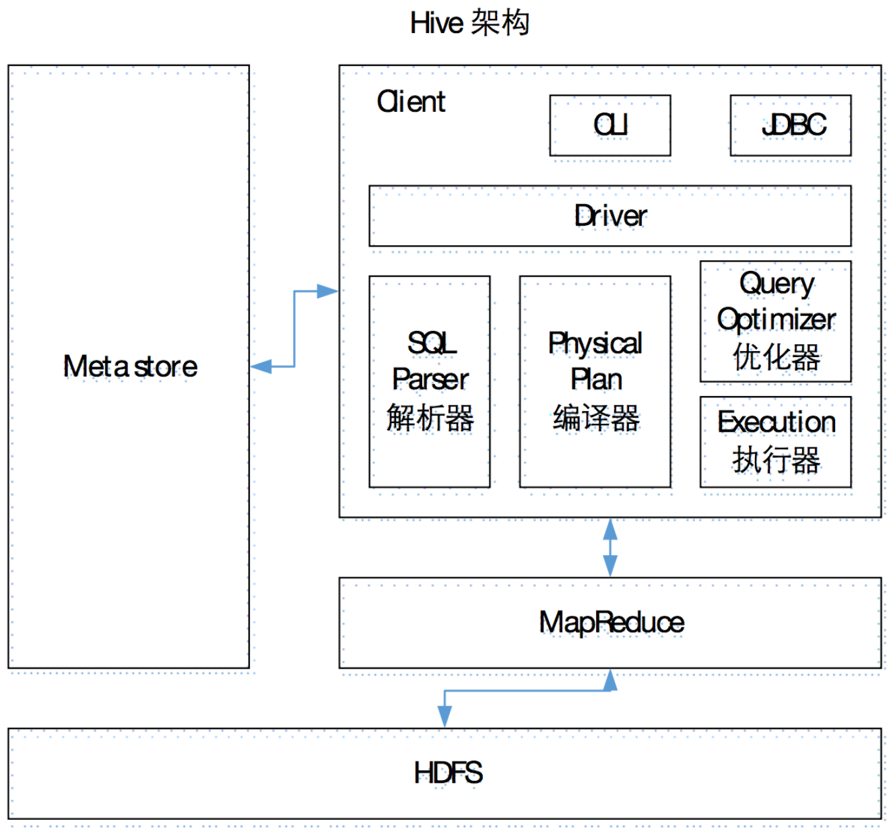

## hive

Apache Hive 是一种数据仓库，可以非常方便的使用 SQL 去读、写、管理存储在分布式式系统的大数据。

用户可以使用一个命令行工具和 JDBC 去连接到 Hive。

Hive 的设计初衷是：

- 对于大量的数据，使得数据汇总，查询和分析更加简单。
- 它提供 SQL，允许用户更加简单的进行查询，汇总和数据分析。
- 对用户的复杂需求，Hive 的 SQL 允许用户来集成自己的功能，做定制化的查询。例如使用自定义函数(User Defined Functions，UDFs)

Hive 表面是使用 SQL 像在数据库中查询数据一样从 HDFS 查询数据。

本质是，Hive 把 SQL 转换成 MapReduce 程序去执行相应的操作，并返回结果

### 架构

Hive 通过给用户提供的一系列交互接口，接收到用户的指令(SQL)，使用自己的Driver，结合元数据(MetaStore)，将这些指令翻译成MapReduce，提交到Hadoop中执行，最后，将执行返回的结果输出到用户交互接口。

主要分 4 部分:

1. 用户接口：Client

    CLI（hive shell）、JDBC/ODBC(java访问hive)、WEBUI（浏览器访问hive）

2. 元数据：Metastore。

    元数据包括：表名、表所属的数据库（默认是default）、表的拥有者、列/分区字段、表的类型（是否是外部表）、表的数据所在目录等；

    默认存储在自带的derby数据库中，推荐使用MySQL存储Metastore

3. 驱动器：Driver

    （1）解析器（SQL Parser）：将SQL字符串转换成抽象语法树AST，这一步一般都用第三方工具库完成，比如antlr；对AST进行语法分析，比如表是否存在、字段是否存在、SQL语义是否有误。 （2）编译器（Physical Plan）：将AST编译生成逻辑执行计划。 （3）优化器（Query Optimizer）：对逻辑执行计划进行优化。 （4）执行器（Execution）：把逻辑执行计划转换成可以运行的物理计划。对于Hive来说，就是MR/Spark。

4. Hadoop

    使用 HDFS 进行存储，使用 MapReduce 进行计算。



### 优缺点
优点

- 操作使用 HiveQL(非常类似于 SQL)语法，对开发人员来说比较简单，容易上手，提供快速开发的能力。
- 基于 Hadoop 构建，所以非常适合处理大批量的数据，并且这些数据的处理对实时性的要求不高。
- 使用 Hive 避免了写 MapReduce，降低了开发人员的学习成本，和开发难度。
- Hive 支持用户自定义函数，用户可以根据自己的实际需求来自己定义相应的功能函数。

总结: 使用 HiveQL 语言，来处理对延迟没有要求的大量数据。 比如:网络访问日志的分析。

缺点

- Hive 的 HiveQL 表达能力有限
    + 迭代算法无法表达
    + 数据挖掘方面不擅长
- 由于 Hadoop 通常有较高的延迟并且在作业和调度的时候需要大量的开销，所以 Hive 的执行效率相对较低。
    + 不适合要求延迟比较的场景。 比如为了处理在线事务。
    + Hive 自动生成的 MapReduce 作业通常情况下并不智能，不能满足复杂场景。
    + Hive 调优比较困难，粒度比较粗。

### Hive 和数据库比较

由于 Hive 采用了类似SQL 的查询语言 HQL(Hive Query Language)，因此很容易将 Hive 理解为数据库。其实从结构上来看，Hive 和数据库除了拥有类似的查询语言，再无类似之处。本文将从多个方面来阐述 Hive 和数据库的差异。数据库可以用在 Online 的应用中，但是 Hive 是为数据仓库而设计的，清楚这一点，有助于从应用角度理解 Hive 的特性。

- 查询语言

    由于SQL被广泛的应用在数据仓库中，因此，专门针对Hive的特性设计了类SQL的查询语言HQL。熟悉SQL开发的开发者可以很方便的使用Hive进行开发。

- 数据存储位置

    Hive 是建立在 Hadoop 之上的，所有 Hive 的数据都是存储在 HDFS 中的。而数据库则可以将数据保存在块设备或者本地文件系统中。

- 数据更新

    由于Hive是针对数据仓库应用设计的，而数据仓库的内容是读多写少的。因此，Hive中不建议对数据的改写，所有的数据都是在加载的时候确定好的。而数据库中的数据通常是需要经常进行修改的，因此可以使用 INSERT INTO … VALUES 添加数据，使用 UPDATE … SET修改数据。

- 索引

    Hive在加载数据的过程中不会对数据进行任何处理，甚至不会对数据进行扫描，因此也没有对数据中的某些Key建立索引。

    Hive要访问数据中满足条件的特定值时，需要暴力扫描整个数据，因此访问延迟较高。

    由于 MapReduce 的引入， Hive 可以并行访问数据，因此即使没有索引，对于大数据量的访问，Hive 仍然可以体现出优势。

    数据库中，通常会针对一个或者几个列建立索引，因此对于少量的特定条件的数据的访问，数据库可以有很高的效率，较低的延迟。由于数据的访问延迟较高，决定了 Hive 不适合在线数据查询。

- 执行

    Hive中大多数查询的执行是通过 Hadoop 提供的 MapReduce 来实现的。而数据库通常有自己的执行引擎。

- 执行延迟

    Hive 在查询数据的时候，由于没有索引，需要扫描整个表，因此延迟较高。

    另外一个导致 Hive 执行延迟高的因素是 MapReduce框架。由于MapReduce 本身具有较高的延迟，因此在利用MapReduce 执行Hive查询时，也会有较高的延迟。

    相对的，数据库的执行延迟较低。当然，这个低是有条件的，即数据规模较小，当数据规模大到超过数据库的处理能力的时候，Hive的并行计算显然能体现出优势。

- 可扩展性

    由于 Hive 是建立在Hadoop之上的，因此Hive的可扩展性是和Hadoop的可扩展性是一致的（世界上最大的Hadoop 集群在 Yahoo!，2009年的规模在4000 台节点左右）。而数据库由于 ACID 语义的严格限制，扩展行非常有限。目前最先进的并行数据库 Oracle 在理论上的扩展能力也只有100台左右。

- 数据规模

    由于Hive建立在集群上并可以利用MapReduce进行并行计算，因此可以支持很大规模的数据；对应的，数据库可以支持的数据规模较小。


### 使用
运行 Hive 前必须先启动 Hadoop 的 HDFS 和 Yarn
hive相对于 Hadoop 集群来说仅仅是个客户端，所以不用分发其他设备上使用.

#### 数据类型

##### 基本数据类型

string 就是在传统数据库中的varchar类型. 该类型是一个可变的字符串. 不过不能声明他的上限. 理论上可以存储2GB字节.

| hive 类型 | java类型 | 长度                                         | 例子    |
| --------- | -------- | -------------------------------------------- | ------- |
| TINYINT   | byte     | 1byte 有符号整数                             | 20      |
| SMALINT   | short    | 2byte 有符号整数                             | 20      |
| INT       | int      | 4byte 有符号整数                             | 20      |
| BIGINT    | long     | 8byte 有符号整数                             | 20      |
| BOOLEAN   | boolean  | 布尔类型                                     | true    |
| FLOAT     | float    | 单精度浮点数                                 | 3.14159 |
| DOUBLE    | double   | 双精度浮点数                                 | 3.14159 |
| STRING    | string   | 字符，可以指定字符集，可以使用单引号或双引号 |         |
| TIMESTAMP |          | 时间类型                                     |         |
| BINARY    |          | 字节数组                                     |         |

##### 复杂数据类型
Hive 有 4 中复杂类型：

1. arrays: ARRAY<data_type>

    数组是一组具有相同类型和名称的变量的集合。这些变量称为数组的元素，每个数组元素都有一个编号，编号从零开始。例如，数组值为[‘John’, ‘Doe’]，那么第2个元素可以通过数组名[1]进行引用。

2. maps: MAP<primitive_type, data_type>

    MAP 是一组键-值对元组集合，使用数组表示法可以访问数据。例如，如果某个列的数据类型是MAP，其中键->值对是’first’->’John’和’last’->’Doe’，那么可以通过字段名[‘last’]获取最后一个元素。

3. structs: STRUCT<col_name : data_type [COMMENT col_comment], ...>

    和c语言中的struct类似，都可以通过“点”符号访问元素内容。例如，如果某个列的数据类型是 STRUCT{first STRING, last STRING},那么第1个元素可以通过: 字段.first来引用。

4. union: UNIONTYPE<data_type, data_type, ...>

    联合型. 这种类型到目前支持还不完全. 建议不要使用。

复杂类型允许任意深层次的嵌套。

##### 类型的转换
Hive 的原子数据类型是可以进行隐式转换的，类似于 Java 的类型转换，例如某表达式使用 INT 类型，TINYINT 会自动转换为 INT 类型，但是 Hive 不会进行反向转化，

例如，某表达式使用 TINYINT 类型，INT 不会自动转换为 TINYINT 类型，它会返回错误，除非使用 CAST 操作。

1. 隐式类型转换规则如下：

    1. 任何整数类型都可以隐式地转换为一个范围更广的类型，如TINYINT可以转换成INT，INT可以转换成BIGINT。
    2. 所有整数类型、FLOAT和STRING类型都可以隐式地转换成DOUBLE。
    3. TINYINT、SMALLINT、INT都可以转换为FLOAT。
    4. BOOLEAN类型不可以转换为任何其它的类型。

2. 可以使用CAST操作显示进行数据类型转换 例如CAST('1' AS INT)将把字符串'1' 转换成整数1；如果强制类型转换失败，如执行CAST('X' AS INT)，表达式返回空值 NULL。

#### DDL 数据定义
DDL(Data Definition Language)是涉及到创建数据、创建表、创建视图等一系列的数据定义动作。不涉及到对数据本身的操作。

在 Hive中，主要有两种 DDL：数据库级别和表级别。

Hive 中的数据库的概念本质上仅仅是表的一个目录或者命名空间而已。然而，对于具有很多组或者用户的的大集群来说，这是很有用的，因为可以避免命名冲突。如果用户没有显示的指定数据库，那么将会使用默认的数据库default。

默认数据库位置: /user/hive/warehouse/xxx.db

```sql
desc database default; -- 显示数据库信息
desc database extended default; -- 显示数据库详细信息

desc t_xxx; -- 显示数据表信息
show create table t_xxx; -- 显示数据表DDL信息
```

##### 内部表和外部表
Hive 的表在逻辑上有两部分组成:

1. 存储的数据。真实的存储的数据在 Hive 中都是以文件的形式存在，这个其他的普通的关系型数据库有差别。Hive 的数据一般存储在 HDFS 中。
2. 表示表中数据的元数据。Hive 把元数据存储在通常的数据库中。比如默认情况我们所有表的元数据都是存储在 derby 数据库中。也可以不用 derby，整合成大家都比较熟悉的 MySql 数据库。

**内部表**

Hive 的数据存储在 HDFS 系统中，如果创建表的时候，Hive 把数据迁移到数据仓库中(/user/hive/warehouse)中，这种表我们把它称为内部表或者管理表、托管表。

Hive 默认情况创的表都是内部表。

当向内部表加载数据(load)的时候，数据会迁移到数据仓库中(这里指的是从 HDFS 加载数据才会迁移，从本地文件不会)。

当删除表(drop)的时候，表的元数据和实际存储的数据都会被删除，所以数据彻底会消失。

内部表使用简单，但是不方便的地方是不能与其他应用程序共享数据

**外部表**

创建表的时候加入关键字 external，这样创建的表就是外部表。

事实上，在创建外部表的时候，Hive 甚至就不检查这个数据是否存在。这是一个非常有用的特性，因为这意味着你可以把创建数据推迟到创建表之后。

删除外部表的时候，Hive 只会删除表的元数据，并不会删除数据。

**内部表和外部表的互换**

```sql
alter table dept set tblproperties('EXTERNAL'='FALSE'); -- 把 dept.txt 变成内部表
alter table stu set tblproperties('EXTERNAL'='TRUE'); -- 把 stu变成外部表
```


##### 分区表
Hive 把表组织成分区(partition)。这个是根据分区列的值对表进行粗略划分的机制。使用分区可以加快数据切片(slice)的查询速度。

分区表要创建表的时候就要指定好分区。每个分区对应 HDFS 文件系统中的一个文件夹。每个分区其实就是表目录下的子目录。

比如，查看日志文件比较大，我们只想看某一个的日志，普通的表需要挨个查询，如果按照日期分区后，则只需要在相应的分区中查询就可以了，大大提高了查询的速度。

**创建分区表**
```sql
create table dept_partition(
    deptno int, dname string, loc string
)
partitioned by (year string)
row format delimited fields 
terminated by '\t';
```
partitioned by (year string) 就表示在创建分区。year 就表示分区列。注意: 分区列不能是表中的字段，否则会抛出异常。

**向分区表中导入数据**
```sql
load data local inpath '/opt/module/datas/dept1.txt' into table dept_partition partition(year='201709');
```
注意: 导入数据的一定要指定导入到哪个分区。

**查询分区表中的数据**
```sql
select * from dept_partition where year="201709"; -- 使用 where子句从分区表中查询数据
show partitions dept_partition; -- 可以查看有哪些分区
```
注意:如果对不是分区表使用 show partitions 命令会抛出异常。

**增加分区**
```sql
alter table dept_partition add partition(month='201706') ; -- 增加单个分区
alter table dept_partition add partition(month='201705') partition(month='201704'); -- 同时增加多个分区:
```

**删除分区**
```sql
alter table dept_partition drop partition (month='201704'); -- 删除单个分区:
alter table dept_partition drop partition (month='201705'), partition (month='201706'); -- 同时删除多个分区:
```

**创建二级分区**
```sql
create table dept_partition2(
    deptno int, dname string, loc string
)
partitioned by (month string, day string)
row format delimited fields terminated by '\t';

-- 加载数据到分区
load data local inpath '/opt/module/datas/dept.txt' into table
 default.dept_partition2 partition(month='201709', day='13');

-- 使用where子句查询分区数据
select * from dept_partition2 where month='201709' and day='13'

-- 查询二级分区数
show partitions dept_partition2 partition(month='201709')


```

**分区表和数据产生关联**

根据情况不同有 3 种方式:

1. 上传数据后修复

    手动创建分区目录，后面直接通过 hdoop fs ... 的方式把数据上传到分区目录，则需要修复一下即可。

    msck repair table dept_partition2;

2. 上传数据后添加分区

    手动创建分区目录，后面直接通过 hdoop fs ... 的方式把数据上传到分区目录，则根据手动创建的目录，再执行添加分区的命令就可以了。

    alter table dept_partition2 add partition(month='201709', day='11');

3. 上传数据后load数据到分区
    手动创建分区目录，则再执行 load 命令也可以。

    load data local inpath '/opt/module/datas/dept.txt' into table dept_partition2 partition(month='201709',day='10');


##### 分桶表
分桶表是通过对数据进行Hash，放到不同文件存储，方便抽样和join查询。分桶表主要是将内部表、外部表和分区表进一步组织，可以指定表的某些列通过Hash算法进一步分解成不同的文件存储。创建分桶表是需要使用关键字clustered by并指定分桶的个数。

```
#创建分桶表buk_table根据id分桶，放入3个桶中
create table buk_table(id string,name string) clustered by(id) into 3 buckets ROW FORMAT DELIMITED FIELDS TERMINATED BY ',';
#加载数据，将inner_table中数据加载到buk_table;
insert into buk_table select * from inner_table;
#桶中数据抽样：select * from table_name tablesample(bucket X out of Y on field);
# X表示从哪个桶中开始抽取，Y表示相隔多少个桶再次抽取
select * from buk_table tablesample(bucket 1 out of 1 on id);
```

#### DML 数据操作
DML(Data Manipulation Language)执行的是对表中的数据增删改的操作。
##### 数据导入

**向表中装载文件**

Hive 处理的数据多是以文件的方式存在的.所以 Hive 最常见的就是把数据导入到数据库中.

语法:
```shell
LOAD DATA [LOCAL] INPATH 'filepath' [OVERWRITE] INTO TABLE tablename
 [PARTITION (partcol1=val1, partcol2=val2 ...)]
```
说明:

- load data 表示加载数据
- local 表示从本地文件系统导入数据。如果不加local表示从 HDFS 文件系统导入数据
- filepath 用引号括起来，表示要加载的数据的路径。
- overwrite 表示覆盖表中已有数据，不加参数表示追加数据到表中。
- partition 上传到指定分区。


**把查询结果插入到表中**
```sql
-- 创建一张分区表
create table student_1(id int, name string) 
partitioned by(year string) 
row format delimited 
fields terminated by '\t';

-- 插入一条数据
insert into table student_1 partition(year='2018') values(1, "lili");

-- 查询刚才的那条数据，并插入到新的分区中
insert overwrite table student_1 partition(year='2019') 
select id, name 
from student_1 
where year='2018';

-- 多插入模式
from student
insert overwrite table student partition(month='201707')
    select id, name where month='201709'
insert overwrite table student partition(month='201706')
    select id, name where month='201709';
```

**As Select**

指创建表的同时插入查询到的结果
```sql
create table if not exists student3
as select id, name from student;
```

**创建表时通过 location 指定数据路径**

1. 创建表，并指定路径
```sql
create table if not exists student_3(
    id int, name string
)
row format delimited fields terminated by '\t'
location '/user/hive/warehouse/student_3';
```

2. 上传数据到 HDFS 上/user/hive/warehouse/student_3
```shell
hadoop fs -put /opt/module/datas/students.txt /user/hive/warehouse/student_3;
```


##### 数据导出
**hive 命令导出**

```shell
# insert 将查询的结果导出到本地
insert overwrite local directory '/opt/module/datas/exports/' select * from student_3;

# 将查询的结果格式化导出到本地
insert overwrite local directory '/opt/module/datas/export/student_3'
ROW FORMAT DELIMITED 
FIELDS TERMINATED BY '\t'
select * from student_3;

# 将查询的结果导出到HDFS上(没有local)
insert overwrite directory '/user/atguigu/student_3'
ROW FORMAT DELIMITED FIELDS TERMINATED BY '\t' 
select * from student_3;

# export 导出到 HDFS 上
export table default.student to '/user/hive/warehouse/export/student';
```

**Hadoop 命令导出**

Hive 的表在 HDFS 上的表现就是文件。如果数据文件的格式正好是我们想要的格式，那么直接从 HDFS 上 copy 下面就可以了。

所以可以通过 Hadoop 命令直接从 HDFS 下载到本地
``` shell
hadoop fs -get /user/hive/warehouse/student_3
/opt/module/datas/export/student_3.txt;
```

##### 清空表中的数据
```sql
truncate table student_3;
```

#### 内置函数和自定义函数

常用内置函数主要分类:

- 数学函数
- 结合函数
- 类型转换函数
- 日期函数
- 条件函数
- 字符串函数
- 数据掩盖函数
- 其他函数
- UDAF函数(聚集函数) 多进一出
- UDTF函数(表生成函数) 一进多出

自定义函数分 3 种：

- 自定义 UDFs
- UDAF(User-Defined Aggregation Function) 聚集函数，多进一出 类似于：count/max/min
- UDTF(User-Defined Table-Generating Functions) 一进多出 lateral view explore()

步骤:

1. 继承org.apache.hadoop.hive.ql.UDF
2. 需要实现evaluate函数；evaluate函数支持重载；
3. 在hive的命令行窗口创建函数
    1. 添加jar add jar linux_jar_path
    2. 创建function， create [temporary] function [dbname.]function_name AS class_name;
4. 在hive的命令行窗口删除函数 Drop [temporary] function [if exists] [dbname.]function_name;


### 最佳实践

Hive 中出现 OOM 的异常原因大致分为以下几种：

1. Map 阶段 OOM：发生 OOM 的几率很小，除非你程序的逻辑不正常，亦或是程序写的不高效，产生垃圾太多。
2. Reduce 阶段 OOM：
    1. data skew 数据倾斜是引发这个的一个原因。 key 分布不均匀，导致某一个 reduce 所处理的数据超过预期，导致 jvm 频繁 GC。
    2. value 对象过多或者过大：某个 reduce 中的 value 堆积的对象过多，导致 jvm 频繁 GC。
    
    解决办法：

    1. 增加 reduce 个数，set mapred.reduce.tasks=300。
    2. 在 hive-site.xml 中设置，或者在 hive shell 里设置 set mapred.child.java.opts = -Xmx512m 或者只设置 reduce 的最大 heap 为 2G，并设置垃圾回收器的类型为并行标记回收器，这样可以显著减少 GC 停顿，但是稍微耗费 CPU。set mapred.reduce.child.java.opts=-Xmx2g -XX:+UseConcMarkSweepGC;
    3. 使用 map join 代替 common join. 可以 set hive.auto.convert.join = true
    4. 设置 hive.optimize.skewjoin = true 来解决数据倾斜问题

3. Driver 提交 Job 阶段 OOM：job 产生的执行计划的条目太多，比如扫描的分区过多，上到4k-6k个分区的时候，并且是好几张表的分区都很多时，这时做join。

究其原因，是因为序列化时，会将这些分区，即 hdfs 文件路径，封装为 Path 对象，这样，如果对象太多了，而且 Driver 启动的时候设置的 heap size 太小，则会导致在 Driver 内序列化这些 MapRedWork 时，生成的对象太多，导致频繁 GC，则会引发如下异常:
```java
java.lang.OutOfMemoryError: GC overhead limit exceeded
at sun.nio.cs.UTF_8.newEncoder(UTF_8.java:53)
at java.beans.XMLEncoder.createString(XMLEncoder.java:572)
```

    解决办法：

    1. 减少分区数量，将历史数据做成一张整合表，做成增量数据表，这样分区就很少了。
    2. 调大 Hive CLI Driver 的 heap size, 默认是 256MB，调节成 512MB或者更大。具体做法是在 bin/hive bin/hive-config 里可以找到启动 CLI 的 JVM OPTIONS。设置 export HADOOP_HEAPSIZE=512


#### 数据倾斜
Hive 在执行 MapReduce 任务时经常会碰到数据倾斜的问题，表现为一个或者几个 reduce 节点运行很慢，延长了整个任务完成的时间，这是由于某些 key 的条数比其他 key 多很多，这些 Key 所在的reduce节点所处理的数据量比其他节点就大很多，从而导致某几个节点迟迟运行不完。

那么经常有哪些情况会产生数据倾斜呢，又该如何解决，这里梳理了几种最常见的数据倾斜场景。

##### 小表与大表JOIN

小表与大表Join时容易发生数据倾斜，表现为小表的数据量比较少但key却比较集中，导致分发到某一个或几个reduce上的数据比其他reduce多很多，造成数据倾斜。

优化方法：使用Map Join将小表装入内存，在map端完成join操作，这样就避免了reduce操作。有两种方法可以执行Map Join：

(1) 通过hint指定小表做MapJoin

 select /*+ MAPJOIN(time_dim) */ count(*) from store_sales join time_dim on ss_sold_time_sk = t_time_sk;

(2) 通过配置参数自动做MapJoin

核心参数：

| 参数名称                         | 默认值   | 说明                                            |
| -------------------------------- | -------- | ----------------------------------------------- |
| hive.auto.convert.join           | false    | 是否将common join（reduce端join）转换成map join |
| hive.mapjoin.smalltable.filesize | 25000000 | 判断为小表的输入文件大小阈值，默认25M           |

因此，巧用MapJoin可以有效解决小表关联大表场景下的数据倾斜。


##### 大表与大表JOIN

大表与大表Join时，当其中一张表的NULL值（或其他值）比较多时，容易导致这些相同值在reduce阶段集中在某一个或几个reduce上，发生数据倾斜问题。

优化方法：

(1) 将NULL值提取出来最后合并，这一部分只有map操作；非NULL值的数据分散到不同reduce上，不会出现某个reduce任务数据加工时间过长的情况，整体效率提升明显。但这种方法由于有两次Table Scan会导致map增多。

```sql
SELECT a.user_Id,a.username,b.customer_id FROM user_info a 
LEFT JOIN customer_info b ON a.user_id = b.user_id where a.user_id IS NOT NULL
UNION ALL SELECT a.user_Id,a.username,NULL FROM user_info a WHERE a.user_id IS NULL
 ```

(2) 在Join时直接把NULL值打散成随机值来作为reduce的key值，不会出现某个reduce任务数据加工时间过长的情况，整体效率提升明显。这种方法解释计划只有一次map，效率一般优于第一种方法。

```sql
SELECT a.user_id,a.username,b.customer_id FROM user_info a
LEFT JOIN customer_info b
 ON
  CASE WHEN
   a.user_id IS NULL
  THEN
   CONCAT ('dp_hive', RAND())
  ELSE
   a.user_id
  END = b.user_id;
```

##### GROUP BY 操作

Hive做group by查询，当遇到group by字段的某些值特别多的时候，会将相同值拉到同一个reduce任务进行聚合，也容易发生数据倾斜。

优化方法：

(1) 开启Map端聚合

参数设置：

参数名称|默认值|说明
---|---|---
hive.map.aggr|true（Hive 0.3+）|是否开启Map端聚合
hive.groupby.mapaggr.checkinterval|100000|在Map端进行聚合操作的条目数目

(2) 有数据倾斜时进行负载均衡

参数设置：

参数名称|默认值|说明
---|---|---
hive.groupby.skewindata|false|当GROUP BY有数据倾斜时是否进行负载均衡

当设定 hive.groupby.skewindata 为 true 时，生成的查询计划会有两个 MapReduce 任务。在第一个 MapReduce 中，map 的输出结果集合会随机分布到 reduce 中， 每个 reduce 做部分聚合操作，这样处理之后，相同的 Group By Key 有可能分发到不同的 reduce 中，从而达到负载均衡的目的。在第二个 MapReduce 任务再根据第一步中处理的数据按照Group By Key 分布到 reduce 中，（这一步中相同的 key 在同一个 reduce 中），最终生成聚合操作结果。

##### COUNT(DISTINCT) 操作

当在数据量比较大的情况下，由于 COUNT DISTINCT 操作是用一个 reduce 任务来完成，这一个 reduce 需要处理的数据量太大，就会导致整个 job 很难完成，这也可以归纳为一种数据倾斜。

优化方法：将 COUNT DISTINCT 使用先 GROUP BY 再 COUNT 的方式替换。例如：
```sql
  select count(id) from (select id from bigtable group by id) a
```
因此，count distinct的优化本质上也是转成group by操作。

#### FAQ
##### return code 2 from org.apache.hadoop.hive.ql.exec.mr.MapRedTask

```java
java.lang.OutOfMemoryError: Java heap space
```

In order to change the average load for a reducer (in bytes):
  set hive.exec.reducers.bytes.per.reducer=<number>
In order to limit the maximum number of reducers:
  set hive.exec.reducers.max=<number>
In order to set a constant number of reducers:
  set mapreduce.job.reduces=<number>


### hive 结合 hbase

Hive 和 Hbase 在大数据架构中处在不同位置，Hive 是一个构建在 Hadoop 基础之上的数据仓库，Hbase 是一种 NoSQL 数据库，非常适用于海量明细数据的随机实时查询，在大数据架构中，Hive 和 HBase 是协作关系如果两者结合，可以利用MapReduce的优势针对HBase存储的大量内容进行离线的计算和分析。

Hive 与 HBase 利用两者本身对外的 API 来实现整合，主要是靠 HBaseStorageHandler 进行通信，利用 HBaseStorageHandler，Hive 可以获取到 Hive 表对应的 HBase 表名，列簇以及列，InputFormat 和 OutputFormat 类，创建和删除 HBase 表等。

Hive 访问 HBase 中表数据，实质上是通过 MapReduce 读取 HBase 表数据，其实现是在 MR 中，使用 HiveHBaseTableInputFormat 完成对 HBase 表的切分，获取 RecordReader 对象来读取数据。

对 HBase 表的切分原则是一个 Region 切分成一个 Split，即表中有多少个 Regions，MR 中就有多少个 Map；

读取 HBase 表数据都是通过构建 Scanner，对表进行全表扫描，如果有过滤条件，则转化为 Filter。当过滤条件为 rowkey 时，则转化为对 rowkey 的过滤；

Scanner 通过 RPC 调用 RegionServer 的 next()来获取数据；

在使用 Hive over HBase，对 HBase 中的表做统计分析时候，需要特别注意以下几个方面：

1. 对 HBase 表进行预分配 Region，根据表的数据量估算出一个合理的 Region 数；
2. rowkey 设计上需要注意，尽量使 rowkey 均匀分布在预分配的 N 个 Region 上；
3. 通过 set hbase.client.scanner.caching 设置合理的扫描器缓存；
4. 关闭 mapreduce 的推测执行：<br>
    set mapred.map.tasks.speculative.execution = false;<br>
    set mapred.reduce.tasks.speculative.execution = false;<br>

#### 配置

HIVE_HOME 和 HBASE_HOME 都进行配置.

检查 Hive 自带的 hive-hbase-handler-xxx.jar 文件是否兼容已安装的 HBase 版本。

要连接到 Zookeeper 的话，打开hive-site.xml 文件，添加如下配置:
```xml
<!-- zookeeper 地址-->
<property>
    <name>hive.zookeeper.quorum</name>
    <value>hadoop201,hadoop202,hadoop203</value>
    <description>The list of ZooKeeper servers to talk to. This is only needed for read/write locks.</description>
</property>
<!-- zookeeper 端口号 -->
<property>
    <name>hive.zookeeper.client.port</name>
    <value>2181</value>
    <description>The port of ZooKeeper servers to talk to. This is only needed for read/write locks.</description>
</property>
```

```sql
-- 在 Hive 中创建表同时关联 HBase
CREATE TABLE hive_hbase_emp_table(
    empno int,
    ename string,
    job string,
    mgr int,
    hiredate string,
    sal double,
    comm double,
    deptno int
)
STORED BY 'org.apache.hadoop.hive.hbase.HBaseStorageHandler'
WITH SERDEPROPERTIES ("hbase.columns.mapping" = ":key,info:ename,info:job,info:mgr,info:hiredate,info:sal,info:comm,info:deptno")
TBLPROPERTIES ("hbase.table.name" = "hbase_emp_table");
```

#### Hive over HBase 和 Hive over HDFS 性能比较

查询性能比较
query1:
select count(1) from on_hdfs;
select count(1) from on_hbase;

query2(根据key过滤)
select * from on_hdfs
where key = '13400000064_1388056783_460095106148962';
select * from on_hbase
where key = '13400000064_1388056783_460095106148962′;

query3(根据value过滤)
select * from on_hdfs where value = ‘XXX';
select * from on_hbase where value = ‘XXX';

 

on_hdfs (20万记录，150M，TextFile on HDFS)
on_hbase(20万记录，160M，HFile on HDFS)

on_hdfs (2500万记录，2.7G，TextFile on HDFS)
on_hbase(2500万记录，3G，HFile on HDFS)


对于全表扫描，hive_on_hbase查询时候如果不设置catching，性能远远不及hive_on_hdfs；

根据rowkey过滤，hive_on_hbase性能上略好于hive_on_hdfs，特别是数据量大的时候；

设置了caching之后，尽管比不设caching好很多，但还是略逊于hive_on_hdfs；

