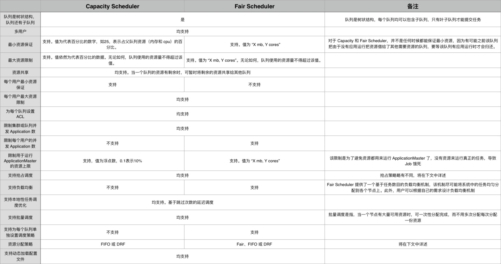

## YARN

### 概述
YARN是一个分布式的资源管理系统。YARN是Hadoop系统的核心组件，主要功能包括负责在Hadoop集群中的资源管理，负责对任务进行调度运行以及监控。

YARN组件信息如下：

- ResourceManager：负责集群的资源管理与调度，为运行在YARN上的各种类型任务分配资源。
  非HA集群部署在EMR的Master节点上，HA集群部署在EMR的多个Master节点上，保证了高可用性。

- NodeMananger：负责节点的资源管理、监控和任务运行。
  部署在EMR的Core或Task节点上。

- ApplicationMaster：负责应用程序相关事务。
  例如，ApplicationMaster负责协调来自ResourceManager的资源，并通过NodeManager进行监控和资源管理等。

- YARN Client：负责提交任务。
  部署在EMR的Master、Core和Task节点上。

- JobHistory：解析MapReduce任务的指标，并展示任务执行情况。
- App Timeline Server：收集任务的指标，并展示任务执行情况。
- WebAppProxyServer：负责任务链接跳转，降低基于Web的攻击。

EMR集群中的YARN优势如下：

- 高可用集群可以自动开启YARN HA部署。
- 便捷的运维。
  例如，支持通过控制台的方式进行节点扩容，NodeMananger下线和滚动重启等操作。

- 支持监控报警。
  可以对各项指标进行监控和智能报警。

- 弹性伸缩支持优雅下线功能。
  可以在一段时间内等待用户任务执行结束后再下线，而不是直接下线NodeManager导致大量任务重新计算。

### YARN 配置

```yarn-env.sh
yarn_resourcemanager_opts
yarn_proxy_heapsize 512
yarn_nodemanager_heapsize 1536
yarn_nodemanager_opts
yarn_resourcemanager_heapsize 2304
yarn_proxyserver_opts
yarn_timelineserver_opts
yarn_timelineserver_heapsize 512

```
```yarn-site.xml
am.liveness-monitor.expiry-interval-ms 600000

yarn.acl.enable false
yarn.admin.acl has
yarn.am.liveness-monitor.expiry-interval-ms 600000
yarn.app.mapreduce.am.labels CORE

yarn.application.classpath $HADOOP_CONF_DIR,$HADOOP_COMMON_HOME/share/hadoop/common/*,$HADOOP_COMMON_HOME/share/hadoop/common/lib/*,$HADOOP_HDFS_HOME/share/hadoop/hdfs/*,$HADOOP_HDFS_HOME/share/hadoop/hdfs/lib/*,$HADOOP_YARN_HOME/share/hadoop/yarn/*,$HADOOP_YARN_HOME/share/hadoop/yarn/lib/*,/opt/apps/extra-jars/*,$HADOOP_HOME/share/hadoop/tools/lib/*

yarn.client.application-client-protocol.poll-interval-ms 200
yarn.client.failover-proxy-provider org.apache.hadoop.yarn.client.ConfiguredRMFailoverProxyProvider

yarn.dispatcher.drain-events.timeout 300000
yarn.dispatcher.exit-on-error true

yarn.fail-fast false
yarn.label.enabled true

yarn.log-aggregation-enable true
yarn.log-aggregation.retain-seconds 604800
yarn.log.server.url http://emr-header-1.cluster-245192:19888/jobhistory/logs

yarn.nm.liveness-monitor.expiry-interval-ms 600000

yarn.nodemanager.aux-services mapreduce_shuffle,spark_shuffle
yarn.nodemanager.aux-services.spark_shuffle.class org.apache.spark.network.yarn.YarnShuffleService
yarn.nodemanager.bind-host 0.0.0.0
yarn.nodemanager.container-executor.class org.apache.hadoop.yarn.server.nodemanager.DefaultContainerExecutor
yarn.nodemanager.container-manager.thread-count 20
yarn.nodemanager.container-metrics.enable false
yarn.nodemanager.container-monitor.interval-ms 3000
yarn.nodemanager.delete.debug-delay-sec 0
yarn.nodemanager.delete.thread-count 4
yarn.nodemanager.disk-health-checker.max-disk-utilization-per-disk-percentage 90.0
yarn.nodemanager.disk-health-checker.min-free-space-per-disk-mb 0
yarn.nodemanager.disk-health-checker.min-healthy-disks 0.25
yarn.nodemanager.labels MASTER

yarn.nodemanager.local-dirs {{ comma() }}file:///mnt/disk{{ idx + 1 }}/yarn

yarn.nodemanager.localizer.client.thread-count 5
yarn.nodemanager.localizer.fetch.thread-count 4

yarn.nodemanager.log-dirs {{ comma() }}file:///mnt/disk{{ idx + 1 }}/log/hadoop-yarn/containers

yarn.nodemanager.process-kill-wait.ms 2000
yarn.nodemanager.remote-app-log-dir hdfs://emr-header-1.cluster-245192:9000/tmp/logs
yarn.nodemanager.resource.cpu-vcores 8
# 集群中某个计算节点分配给nodemanager的最大可用内存，这个最大可用内存不是该节点最大内存，而是该节点最大内存划分出来的给nodemanager使用的内存。
yarn.nodemanager.resource.memory-mb 11584
yarn.nodemanager.sleep-delay-before-sigkill.ms 250
yarn.nodemanager.vmem-check-enabled false
# 虚拟内存的比例，默认是2.1，即每使用1G物理内存，分配2.1的虚拟内存。
yarn.nodemanager.vmem-pmem-ratio 5000

yarn.resourcemanager.address emr-header-1.cluster-245192:8032
yarn.resourcemanager.am.max-attempts 2
yarn.resourcemanager.amlauncher.thread-count 50
yarn.resourcemanager.bind-host 0.0.0.0
yarn.resourcemanager.client.thread-count 50
yarn.resourcemanager.connect.max-wait.ms 900000
yarn.resourcemanager.connect.retry-interval.ms 30000
yarn.resourcemanager.container.liveness-monitor.interval-ms 600000
yarn.resourcemanager.ha.automatic-failover.embedded true
yarn.resourcemanager.ha.automatic-failover.enabled true
yarn.resourcemanager.hostname 0.0.0.0
yarn.resourcemanager.max-completed-applications 10000
yarn.resourcemanager.nodemanager-connect-retries 10
yarn.resourcemanager.nodemanagers.heartbeat-interval-ms 1000
yarn.resourcemanager.nodes.exclude-path /etc/ecm/hadoop-conf/yarn.exclude
yarn.resourcemanager.proxy-user-privileges.enabled false
yarn.resourcemanager.recovery.enabled false
yarn.resourcemanager.resource-tracker.address emr-header-1.cluster-245192:8025
yarn.resourcemanager.resource-tracker.client.thread-count 64
yarn.resourcemanager.scheduler.address emr-header-1.cluster-245192:8030
yarn.resourcemanager.scheduler.class org.apache.hadoop.yarn.server.resourcemanager.scheduler.capacity.CapacityScheduler
yarn.resourcemanager.scheduler.client.thread-count 50
yarn.resourcemanager.store.class org.apache.hadoop.yarn.server.resourcemanager.recovery.ZKRMStateStore
yarn.resourcemanager.system-metrics-publisher.enabled true
yarn.resourcemanager.webapp.address emr-header-1.cluster-245192:8088
yarn.resourcemanager.zk-timeout-ms 60000

yarn.scheduler.fair.allocation.file /etc/ecm/hadoop-conf/fair-scheduler.xml
yarn.scheduler.fair.allow-undeclared-pools true
yarn.scheduler.fair.assignmultiple false
yarn.scheduler.fair.dynamic.max.assign true
yarn.scheduler.fair.locality.threshold.node -1.0
yarn.scheduler.fair.locality.threshold.rack -1.0
yarn.scheduler.fair.max.assign -1
yarn.scheduler.fair.preemption false
yarn.scheduler.fair.preemption.cluster-utilization-threshold 0.8f
yarn.scheduler.fair.sizebasedweight false
yarn.scheduler.fair.update-interval-ms 500
yarn.scheduler.fair.user-as-default-queue false
yarn.scheduler.increment-allocation-mb 1024
yarn.scheduler.increment-allocation-vcores 1
# 指定单个容器(container)可申请的最大内存资源，
yarn.scheduler.maximum-allocation-mb 11584
yarn.scheduler.maximum-allocation-vcores 32
# 指定单个容器(container)可申请的最小内存资源，
yarn.scheduler.minimum-allocation-mb 32

yarn.timeline-service.bind-host 0.0.0.0
yarn.timeline-service.enabled true
yarn.timeline-service.hostname emr-header-1.cluster-245192
yarn.timeline-service.http-cross-origin.enabled true
yarn.timeline-service.store-class org.apache.hadoop.yarn.server.timeline.RollingLevelDBTimelineStore

yarn.web-proxy.address emr-header-1.cluster-245192:20888
```

```mapred-env.sh
jobhistory_heapsize 512

hadoop_job_historyserver_opts -javaagent:/var/lib/ecm-agent/data/jmxetric-1.0.8.jar=host=localhost,port=8649,mode=unicast,wireformat31x=true,process=YARN_JobHistory,config=/var/lib/ecm-agent/data/jmxetric.xml -verbose:gc -XX:+PrintGCDetails -XX:+PrintGCTimeStamps -XX:+PrintGCDateStamps -XX:+UseGCLogFileRotation -XX:NumberOfGCLogFiles=5 -XX:GCLogFileSize=128M -Xloggc:${YARN_LOG_DIR}/jobhistory-gc.log

```

```mapred-site.xml
map.sort.class org.apache.hadoop.util.QuickSort

mapred.local.dir {{ comma() }}file:///mnt/disk{{ idx + 1 }}/mapred/local

mapreduce.am.max-attempts 2

mapreduce.application.classpath $HADOOP_MAPRED_HOME/share/hadoop/mapreduce/*,$HADOOP_MAPRED_HOME/share/hadoop/mapreduce/lib/*,/usr/lib/hadoop-lzo/lib/*

mapreduce.cluster.acls.enabled false
mapreduce.cluster.local.dir {{ comma() }}file:///mnt/disk{{ idx + 1 }}/mapred/local

mapreduce.cluster.temp.dir ${hadoop.tmp.dir}/mapred/temp
mapreduce.framework.name yarn

mapreduce.job.acl-modify-job
mapreduce.job.acl-view-job
mapreduce.job.classloader false
mapreduce.job.counters.max 1000
mapreduce.job.jvm.numtasks 20
mapreduce.job.log4j-properties-file
mapreduce.job.maps 16
mapreduce.job.queuename default
mapreduce.job.reducer.preempt.delay.sec 0
mapreduce.job.reduces 7
mapreduce.job.running.map.limit 0
mapreduce.job.running.reduce.limit 0
mapreduce.job.tags
mapreduce.job.userlog.retain.hours 48

# Jobhistory 历史服务器
mapreduce.jobhistory.address emr-header-1.cluster-245192:10020
mapreduce.jobhistory.admin.acl *
mapreduce.jobhistory.admin.address emr-header-1.cluster-245192:10033
mapreduce.jobhistory.http.policy HTTP_ONLY
mapreduce.jobhistory.recovery.enable false
mapreduce.jobhistory.recovery.store.class org.apache.hadoop.mapreduce.v2.hs.HistoryServerFileSystemStateStoreService
mapreduce.jobhistory.recovery.store.fs.uri ${hadoop.tmp.dir}/mapred/history/recoverystore
mapreduce.jobhistory.store.class
mapreduce.jobhistory.webapp.address emr-header-1.cluster-245192:19888
mapreduce.jobtracker.addressemr-header-1.cluster-245192:8021
mapreduce.jobtracker.http.address emr-header-1.cluster-245192:50030
mapreduce.jobtracker.jobhistory.location
mapreduce.jobtracker.restart.recover false
mapreduce.jobtracker.taskscheduler org.apache.hadoop.mapred.JobQueueTaskScheduler

mapreduce.map.cpu.vcores 1
# 在map阶段的yarnchild进程执行jvm参数，必须小于mapreduce.map.memory.mb
mapreduce.map.java.opts -Xmx1158m -XX:ParallelGCThreads=2 -XX:CICompilerCount=2
mapreduce.map.log.level INFO
# 指定 map 任务时申请的内存
mapreduce.map.memory.mb 1448
mapreduce.map.output.compress true
mapreduce.map.output.compress.codec org.apache.hadoop.io.compress.DefaultCodec
mapreduce.map.sort.spill.percent 0.8
mapreduce.map.speculative true

mapreduce.output.fileoutputformat.compress false
mapreduce.output.fileoutputformat.compress.codec org.apache.hadoop.io.compress.DefaultCodec
mapreduce.output.fileoutputformat.compress.type BLOCK
mapreduce.outputcommitter.class com.aliyun.emr.fs.oss.commit.JindoOssCommitter

mapreduce.reduce.cpu.vcores 1
# 在reduce阶段的yarnchild进程执行jvm参数， 必须小于mapreduce.reduce.memory.mb
mapreduce.reduce.java.opts -Xmx2316m -XX:ParallelGCThreads=2 -XX:CICompilerCount=2
mapreduce.reduce.log.level INFO
# 指定 reduce 任务时申请的内存
mapreduce.reduce.memory.mb 2896
mapreduce.reduce.shuffle.parallelcopies 20
mapreduce.reduce.speculative true

mapreduce.shuffle.manage.os.cache false
mapreduce.shuffle.max.connections 0
mapreduce.shuffle.max.threads 0
mapreduce.shuffle.port 13562
mapreduce.shuffle.ssl.enabled false
mapreduce.shuffle.transfer.buffer.size 131072
mapreduce.shuffle.transferTo.allowed

mapreduce.task.io.sort.factor 48
mapreduce.task.io.sort.mb 200
mapreduce.task.timeout 600000

mapreduce.tasktracker.group
mapreduce.tasktracker.http.address emr-header-1.cluster-245192:50060
mapreduce.tasktracker.http.threads 60
mapreduce.tasktracker.map.tasks.maximum 1
mapreduce.tasktracker.reduce.tasks.maximum 1
mapreduce.tasktracker.taskcontroller org.apache.hadoop.mapred.DefaultTaskController

yarn.app.mapreduce.am.admin.user.env
yarn.app.mapreduce.am.command-opts -Xmx2316m
yarn.app.mapreduce.am.env
yarn.app.mapreduce.am.jhs.backup-dir file:///mnt/disk1/log/hadoop-mapreduce/history
yarn.app.mapreduce.am.jhs.backup.enabled true
yarn.app.mapreduce.am.job.task.listener.thread-count 60
yarn.app.mapreduce.am.resource.cpu-vcores 1
# 指定appMaster的运行内存，默认是1.5G。必须小于 yarn.scheduler.maximum-allocation-mb。
yarn.app.mapreduce.am.resource.mb 2896
yarn.app.mapreduce.am.staging-dir /tmp/hadoop-yarn/staging
yarn.app.mapreduce.client.job.max-retries 0
```

```xml capacity-scheduler
<configuration>
  <property>
    <name>yarn.scheduler.capacity.maximum-applications</name>
    <value>10000</value>
    <description>Maximum number of applications that can be pending and running.</description>
  </property>
  <property>
    <name>yarn.scheduler.capacity.maximum-am-resource-percent</name>
    <value>0.25</value>
    <description>Maximum percent of resources in the cluster which can be used to run application masters i.e. controls number of concurrent running applications.</description>
  </property>
  <property>
    <name>yarn.scheduler.capacity.resource-calculator</name>
    <value>org.apache.hadoop.yarn.util.resource.DefaultResourceCalculator</value>
    <description>The ResourceCalculator implementation to be used to compare Resources in the scheduler.The default i.e. DefaultResourceCalculator only uses Memory while DominantResourceCalculator uses dominant-resource to compare multi-dimensional resources such as Memory, CPU etc.</description>
  </property>
  <property>
    <name>yarn.scheduler.capacity.root.queues</name>
    <value>default</value>
    <description>The queues at the this level (root is the root queue).</description>
  </property>
  <property>
    <name>yarn.scheduler.capacity.root.default.capacity</name>
    <value>100</value>
    <description>Default queue target capacity.</description>
  </property>
  <property>
    <name>yarn.scheduler.capacity.root.default.user-limit-factor</name>
    <value>1</value>
    <description>Default queue user limit a percentage from 0.0 to 1.0.</description>
  </property>
  <property>
    <name>yarn.scheduler.capacity.root.default.maximum-capacity</name>
    <value>100</value>
    <description>The maximum capacity of the default queue.</description>
  </property>
  <property>
    <name>yarn.scheduler.capacity.root.default.state</name>
    <value>RUNNING</value>
    <description>The state of the default queue. State can be one of RUNNING or STOPPED.</description>
  </property>
  <property>
    <name>yarn.scheduler.capacity.root.default.acl_submit_applications</name>
    <value>*</value>
    <description>The ACL of who can submit jobs to the default queue.</description>
  </property>
  <property>
    <name>yarn.scheduler.capacity.root.default.acl_administer_queue</name>
    <value>*</value>
    <description>The ACL of who can administer jobs on the default queue.</description>
  </property>
  <property>
    <name>yarn.scheduler.capacity.node-locality-delay</name>
    <value>-1</value>
    <description>Number of missed scheduling opportunities after which the CapacityScheduler attempts to schedule rack-local containers. Typically this should be set to number of nodes in the cluster.</description>
  </property>
  <property>
    <name>yarn.scheduler.capacity.queue-mappings</name>
    <value></value>
    <description>A list of mappings that will be used to assign jobs to queues. The syntax for this list is [u|g]:[name]:[queue_name][,next mapping]* Typically this list will be used to map users to queues,for example, u:%user:%user maps all users to queues with the same name as the user.</description>
  </property>
  <property>
    <name>yarn.scheduler.capacity.queue-mappings-override.enable</name>
    <value>false</value>
    <description>If a queue mapping is present, will it override the value specified by the user? This can be used by administrators to place jobs in queues that are different than the one specified by the user. The default is false.</description>
  </property>
</configuration>
```

```xml fair-scheduler
<allocations>
  <queue name="root">
    <minResources>10000 mb,10 vcores</minResources>
    <maxRunningApps>50</maxRunningApps>
    <maxAMShare>0.5f</maxAMShare>
    <weight>2.0</weight>
    <schedulingPolicy>fair</schedulingPolicy>
    <aclSubmitApps>*</aclSubmitApps>
    <aclAdministerApps>*</aclAdministerApps>
    <allowPreemptionFrom>true</allowPreemptionFrom>
    <queue name="default">
      <aclSubmitApps>*</aclSubmitApps>
      <minResources>10000 mb,10vcores</minResources>
    </queue>
  </queue>
  <userMaxAppsDefault>50</userMaxAppsDefault>
  <queueMaxAMShareDefault>0.5</queueMaxAMShareDefault>
  <queueMaxAppsDefault>50</queueMaxAppsDefault>
  <defaultQueueSchedulingPolicy>fair</defaultQueueSchedulingPolicy>
</allocations>
```

### YARN CLI
```bash
start-yarn.sh

yarn-daemon.sh start nodemanager
yarn-daemon.sh start resourcemanager
yarn-daemon.sh stop nodemanager
yarn-daemon.sh stop resourcemanager
```

### 高阶使用

##### YARN 授权

YARN的授权根据授权实体，可以分为服务级别的授权、队列级别的授权。

**服务级别的授权**

- 控制特定用户访问集群服务，例如提交作业。
- 配置在hadoop-policy.xml。
- 服务级别的权限校验在其他权限校验之前（例如，HDFS的permission检查或Yarn提交作业到队列控制）。

说明 通常设置了HDFS permission检查或Yarn队列资源控制，可以不设置服务级别的授权控制，您可以根据自己需求进行相关配置。

**队列级别的授权**

YARN可以通过队列对资源进行授权管理，有Capacity Scheduler和Fair Scheduler两种队列调度。

这里以Capacity Scheduler为例。

队列也有两个级别的授权，一个是提交作业到队列的授权，一个是管理队列的授权。

说明

- 队列的ACL的控制对象为user或group，设置相关参数时，user和group可以同时设置，中间用空格分开，user/group内部可用逗号分开，只有一个空格表示任何人都没有权限。
- 队列ACL继承：如果一个user或group可以向某个队列中提交应用程序，则它可以向它的所有子队列中提交应用程序，同理管理队列的ACL也具有继承性。所以如果要防止某个user或group提交作业到某个队列，则需要设置该队列以及该队列的所有父队列的ACL来限制该user/group的提交作业的权限。

yarn.acl.enable ACL开关，设置为true。
yarn.admin.acl Yarn的管理员设置。例如，可以执行yarn rmadmin/yarn kill等命令时，该值必须配置，否则后续的队列相关的ACL管理员设置无法生效。
如上备注，配置值时可以设置user或group。
user1,user2 group1,group2 #user和group用空格隔开。
  group1,group2 #只有group情况下，必须在最前面加上空格。

EMR集群中需将has配置为admin的ACL权限。

yarn.scheduler.capacity.${queue-name}.acl_submit_applications

设置能够向该队列提交的user或group。

其中${queue-name}为队列的名称，可以是多级队列，注意多级情况下的ACL继承机制。

```xml
#queue-name=root
  <property>
      <name>yarn.scheduler.capacity.root.acl_submit_applications</name>
      <value> </value> #空格表示任何人都无法往root队列提交作业。
  </property>
 #queue-name=root.testqueue
 <property>
   <name>yarn.scheduler.capacity.root.testqueue.acl_submit_applications</name>
      <value>test testgrp</value> #testqueue只允许test用户或testgrp组提交作业。
  </property>
```

yarn.scheduler.capacity.${queue-name}.acl_administer_queue

设置某些user或group管理队列，例如终止队列中作业等。

queue-name可以是多级，注意多级情况下的ACL继承机制。

```xml
#queue-name=root
  <property>
      <name>yarn.scheduler.capacity.root.acl_administer_queue</name>
      <value> </value>
  </property>
 #queue-name=root.testqueue
 <property>
   <name>yarn.scheduler.capacity.root.testqueue.acl_administer_queue</name>
      <value>test testgrp</value>
  </property>
```

**重启YARN服务**

对于Kerberos安全集群已经默认开启ACL，用户可以根据自己需求配置队列的相关ACL权限控制。
对于非Kerberos安全集群根据上述开启ACL并配置好队列的权限控制，重启YARN服务。

**配置示例**

- yarn-site.xml
  yarn.acl.enable true
  yarn.admin.acl  has

- capacity-scheduler.xml
- default队列：禁用default队列，不允许任何用户提交或管理。
- q1队列：只允许test用户提交作业以及管理队列（如 kill）。
- q2队列：只允许foo用户提交作业以及管理队列。

```xml
<configuration>
    <property>
        <name>yarn.scheduler.capacity.maximum-applications</name>
        <value>10000</value>
        <description>Maximum number of applications that can be pending and running.</description>
    </property>
    <property>
        <name>yarn.scheduler.capacity.maximum-am-resource-percent</name>
        <value>0.25</value>
        <description>Maximum percent of resources in the cluster which can be used to run application masters i.e.
            controls number of concurrent running applications.
        </description>
    </property>
    <property>
        <name>yarn.scheduler.capacity.resource-calculator</name>
        <value>org.apache.hadoop.yarn.util.resource.DefaultResourceCalculator</value>
    </property>
    <property>
        <name>yarn.scheduler.capacity.root.queues</name>
        <value>default,q1,q2</value>
        <!-- 3个队列-->
        <description>The queues at the this level (root is the root queue).</description>
    </property>
    <property>
        <name>yarn.scheduler.capacity.root.default.capacity</name>
        <value>0</value>
        <description>Default queue target capacity.</description>
    </property>
    <property>
        <name>yarn.scheduler.capacity.root.default.user-limit-factor</name>
        <value>1</value>
        <description>Default queue user limit a percentage from 0.0 to 1.0.</description>
    </property>
    <property>
        <name>yarn.scheduler.capacity.root.default.maximum-capacity</name>
        <value>100</value>
        <description>The maximum capacity of the default queue.</description>
    </property>
    <property>
        <name>yarn.scheduler.capacity.root.default.state</name>
        <value>STOPPED</value>
        <!-- default队列状态设置为STOPPED-->
        <description>The state of the default queue. State can be one of RUNNING or STOPPED.</description>
    </property>
    <property>
        <name>yarn.scheduler.capacity.root.default.acl_submit_applications</name>
        <value> </value>
        <!-- default队列禁止提交作业-->
        <description>The ACL of who can submit jobs to the default queue.</description>
    </property>
    <property>
        <name>yarn.scheduler.capacity.root.default.acl_administer_queue</name>
        <value> </value>
        <!-- 禁止管理default队列-->
        <description>The ACL of who can administer jobs on the default queue.</description>
    </property>
    <property>
        <name>yarn.scheduler.capacity.node-locality-delay</name>
        <value>40</value>
    </property>
    <property>
        <name>yarn.scheduler.capacity.queue-mappings</name>
        <value>u:test:q1,u:foo:q2</value>
        <!-- 队列映射，test用户自动映射到q1队列-->
        <description>A list of mappings that will be used to assign jobs to queues. The syntax for this list is
            [u|g]:[name]:[queue_name][,next mapping]* Typically this list will be used to map users to queues,for
            example, u:%user:%user maps all users to queues with the same name as the user.
        </description>
    </property>
    <property>
        <name>yarn.scheduler.capacity.queue-mappings-override.enable</name>
        <value>true</value>
        <!-- 上述queue-mappings设置的映射，是否覆盖客户端设置的队列参数-->
        <description>If a queue mapping is present, will it override the value specified by the user? This can be used
            by administrators to place jobs in queues that are different than the one specified by the user. The default
            is false.
        </description>
    </property>
    <property>
        <name>yarn.scheduler.capacity.root.acl_submit_applications</name>
        <value> </value>
        <!-- ACL继承性，父队列需控制住权限-->
        <description>
            The ACL of who can submit jobs to the root queue.
        </description>
    </property>
    <property>
        <name>yarn.scheduler.capacity.root.q1.acl_submit_applications</name>
        <value>test</value>
        <!-- q1只允许test用户提交作业-->
    </property>
    <property>
        <name>yarn.scheduler.capacity.root.q2.acl_submit_applications</name>
        <value>foo</value>
        <!-- q2只允许foo用户提交作业-->
    </property>
    <property>
        <name>yarn.scheduler.capacity.root.q1.maximum-capacity</name>
        <value>100</value>
    </property>
    <property>
        <name>yarn.scheduler.capacity.root.q2.maximum-capacity</name>
        <value>100</value>
    </property>
    <property>
        <name>yarn.scheduler.capacity.root.q1.capacity</name>
        <value>50</value>
    </property>
    <property>
        <name>yarn.scheduler.capacity.root.q2.capacity</name>
        <value>50</value>
    </property>
    <property>
        <name>yarn.scheduler.capacity.root.acl_administer_queue</name>
        <value> </value>
        <!-- ACL继承性，父队列需控制住权限-->
    </property>
    <property>
        <name>yarn.scheduler.capacity.root.q1.acl_administer_queue</name>
        <value>test</value>
        <!-- q1队列只允许test用户管理，如kill作业-->
    </property>
    <property>
        <name>yarn.scheduler.capacity.root.q2.acl_administer_queue</name>
        <value>foo</value>
        <!-- q2队列只允许foo用户管理，如kill作业-->
    </property>
    <property>
        <name>yarn.scheduler.capacity.root.q1.state</name>
        <value>RUNNING</value>
    </property>
    <property>
        <name>yarn.scheduler.capacity.root.q2.state</name>
        <value>RUNNING</value>
    </property>
</configuration>
```

##### Capacity Scheduler（容量调度器）

以队列为单位划分资源，每个队列可设定一定比例的资源最低保证和使用上限，同时，每个用户也可设定一定的资源使用上限以防止资源滥用。而当一个队列的资源有剩余时，可暂时将剩余资源共享给其他队列。

Capacity Scheduler主要有以下几个特点：

- 容量保证：管理员可为每个队列设置资源最低保证和资源使用上限，而所有提交到该队列的应用程序共享这些资源
- 灵活性：如果一个队列中的资源有剩余，可以暂时共享给那些需要资源的队列，而一旦该队列有新的应用程序提交，则其他队列释放的资源会归还给该队列
- 多重租赁：支持多用户共享集群和多应用程序同时运行。为防止单个应用程序、用户或队列独占集群中的资源，管理员可为之增加多重约束（比如单个应用程序同时运行的任务数等）
- 安全保证：每个队列有严格的ACL列表规定它的访问用户，每个用户可指定哪些用户允许查看自己应用程序的运行状态或者控制应用程序（比如杀死应用程序）。此外，管理员可指定队列管理员和集群系统管理员
- 动态更新配置文件：管理员可根据需要动态修改各种配置参数，以实现在线集群管理

Capacity Scheduler的功能：

- Capacity Scheduler有自己的配置文件，即存放在conf目录下的capacity-scheduler.xml
- 在Capacity Scheduler的配置文件中，队列queueX的参数Y的配置名称为yarn.scheduler.capacity.queueX.Y
- 资源分配相关参数：
    + capacity：队列的最小资源容量（百分比）。注意，所有队列的容量之和应小于100
    + maximum-capacity：队列的资源使用上限
    + minimum-user-limit-percent：每个用户最低资源保障（百分比）
    + user-limit-factor：每个用户最多可使用的资源量（百分比）
- 限制应用程序数目的相关参数：
    + maximum-applications：集群或者队列中处于等待和运行状态的应用程序数目上限，这是一个强限制项，一旦集群中应用程序数目超过该上限，后续提交的应用程序将被拒绝。默认值为10000。Hadoop允许从集群和队列两个方面该值，其中，集群的总体数目上限可通过参数yarn.scheduler.capacity.maximum-applications设置，默认为10000，而单个队列可通过参数yarn.scheduler.capacity.<queue-path>.maximum-applications设置适合自己的值
    + maximum-am-resource-percent：集群中用于运行应用程序ApplicationMaster的资源比例上限，该参数通常用于限制处于活动状态的应用程序数目。所有队列的ApplicationMaster资源比例上限可通过参数yarn.scheduler.capacity.maximum-am-resource-percent设置，而单个队列可通过参数yarn.scheduler.capacity.<queue-path>.maximum-am-resource-percent设置适合自己的值
- 队列访问权限控制
    + state：队列状态，可以为STOPPED或者RUNNING。如果一个队列处于STOPPED状态，用户不可以将应用程序提交到该队列或者它的子队列中。类似的，如果root队列处于STOPPED状态，则用户不可以向集群提交应用程序，但正在运行的应用程序可以正常运行结束，以便队列可以优雅地退出
    + acl_submit_application：限定哪些用户/用户组可向给定队列中提交应用程序。该属性具有继承性，即如果一个用户可以向某个队列提交应用程序，则它可以向它所有子队列中提交应用程序
    + acl_administer_queue：为队列指定一个管理员，该管理员可控制该队列的所有应用程序，比如杀死任意一个应用程序等。同样，该属性具有继承性，如果一个用户可以向某个队列中提交应用程序，则它可以向它的所有子队列中提交应用程序
- 当管理员需动态修改队列资源配置时，可修改配置文件conf/capacity-scheduler.xml，然后运行“yarn rmadmin -refreshQueues”
- 当前Capacity Scheduler不允许管理员动态减少队列数目，且更新的配置参数值应是合法值，否则会导致配置文件加载失败


##### Fair Scheduler（公平调度器）
在Fair调度器中，我们不需要预先占用一定的系统资源，Fair调度器会为所有运行的job动态的调整系统资源。当第一个大job提交时，只有这一个job在运行，此时它获得了所有集群资源；当第二个小任务提交后，Fair调度器会分配一半资源给这个小任务，让这两个任务公平的共享集群资源。

需要注意的是，在Fair调度器中，从第二个任务提交到获得资源会有一定的延迟，因为它需要等待第一个任务释放占用的Container。小任务执行完成之后也会释放自己占用的资源，大任务又获得了全部的系统资源。最终的效果就是Fair调度器即得到了高的资源利用率又能保证小任务及时完成。



##### FIFO Scheduler

FIFO Scheduler把应用按提交的顺序排成一个队列，这是一个先进先出队列，在进行资源分配的时候，先给队列中最头上的应用进行分配资源，待最头上的应用需求满足后再给下一个分配，以此类推。

FIFO Scheduler是最简单也是最容易理解的调度器，也不需要任何配置，但它并不适用于共享集群。大的应用可能会占用所有集群资源，这就导致其它应用被阻塞。在共享集群中，更适合采用Capacity Scheduler或Fair Scheduler，这两个调度器都允许大任务和小任务在提交的同时获得一定的系统资源。


### 最佳实践

1. 增大MapReduce作业内存，在YARN服务的配置页面，调大mapreduce.map.java.opts或mapreduce.reduce.java.opts的值。

4. 在MR作业中使用本地共享库

```xml
<property>  
    <name>mapred.child.java.opts</name>  
    <value>-Xmx1024m -Djava.library.path=/usr/local/share/</value>  
    </property>  
    <property>  
    <name>mapreduce.admin.user.env</name>  
    <value>LD_LIBRARY_PATH=$HADOOP_COMMON_HOME/lib/native:/usr/local/lib</value>  
</property>
```

