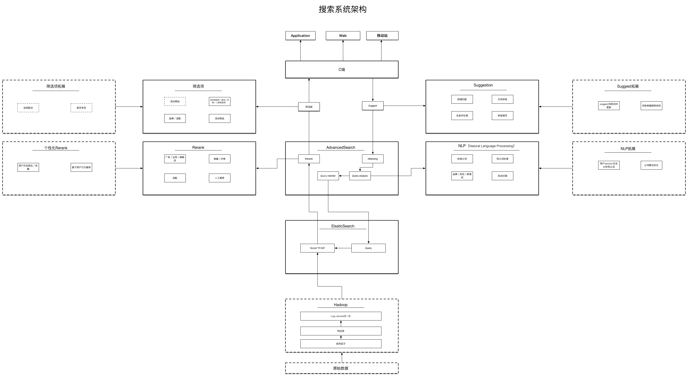
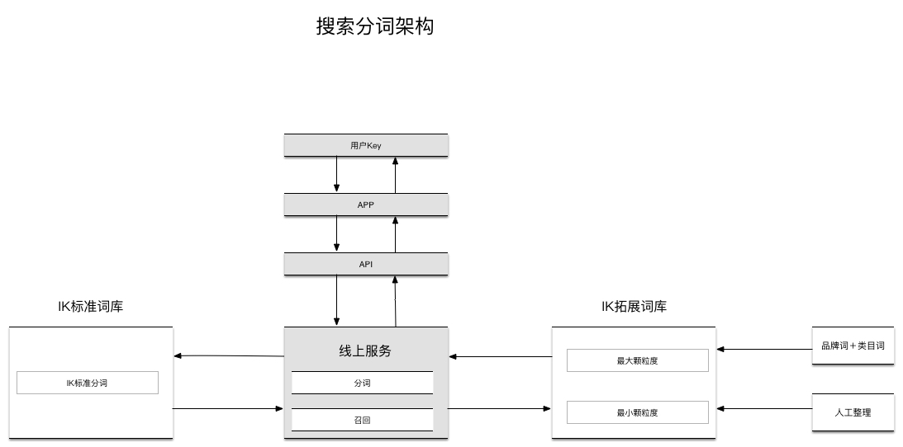

## search
搜索系统

搜索是一种非常普遍而通用的服务。不同的搜索服务有着共同基础技术（倒排索引，文本相关性等），但对于特定领域也有着很明显的差别。电商搜索是搜索服务的一种，电商搜索面向的对象主要是商品，其目的是让用户更快的找到满意的商品。

### 搜索引擎原理

搜索系统指从因特网或者数据库中搜集信息，经过一定整理以后，提供给用户进行查询的系统。一个完整的搜索系统包括三部分，分别为信息收集、整理信息、提供查询。

#### 信息收集
通用搜索引擎（Google、baidu）的信息搜集基本都是自动的。搜索引擎利用称为爬虫（网络蜘蛛）的自动搜索机器人程序来连上每一个网页上的超链接。机器人程序根据网页链到其中的超链接，就像日常生活中所说的“一传十，十传百……”一样，从少数几个网页开始，连到数据库上所有到其他网页的链接。理论上，若网页上有适当的超链接，机器人便可以遍历绝大部分网页。电商搜索引擎一般不需要用爬虫收集数据，定时或者实时读取产品信息或者配置就可以收集到所有信息。

#### 整理信息
搜索引擎整理信息的过程称为“创建索引”。搜索引擎不仅要保存搜集起来的信息，还要将它们按照一定的规则进行编排。这样，搜索引擎根本不用重新翻查它所有保存的信息而迅速找到所要的资料。想象一下，如果信息是不按任何规则地随意堆放在搜索引擎的数据库中，那么它每次找资料都得把整个资料库完全翻查一遍，如此一来再快的计算机系统也没有用。这种索引类比于图书馆索引设计，每个网站或者商品就像图书馆里的一本书，我们不可能在图书馆书架上一本本去找，只能通过索引卡片找到他们的位置，然后直接去书架上取。搜索引擎的索引建立是基于最基本的布尔运算，如1代表相应的商品中有这个关键词，0代表没有，则可以将搜索关键词转化成二进制数。

#### 提供查询
用户向搜索引擎发出查询，搜索引擎接受查询并向用户返回资料。搜索引擎每时每刻都要接到来自大量用户的几乎是同时发出的查询，它按照每个用户的要求检查自己的索引，在极短时间内找到用户需要的资料，并返回给用户。

### 电商搜索

电商搜索引擎要处理的原始数据本身就是结构化的，通常来自于数据库，且有多个数据源。相比与传统的搜索引擎，电商搜索在数据采集方面更侧重于各种数据源的数据更新。

电商搜索引擎的过滤功能其实比搜索功能要常用。甚至大于搜索本身。电商搜索面对的通常是商品名称，而商品名称是一个短文本标题，很难从文本相关性方面得到非常明显的差异。

电商搜索引擎支持各种维度的排序，包括支持好评、销量、评论、价格等属性的排序。而且对数据的实时性的要求非常高。电商搜索对数据的实时性要求主要体现在价格和上下架两个方面。

电商搜索引擎要考虑个性化，根据不同用户展示不同的结果是电商搜索的一个主要目的。从商业角度来说，个性化搜索结果可以帮助公司创造更多的营收，从用户角度来说，个性化搜索更加快速帮助用户找到相应的商品。

#### 电商搜索系统架构

电商搜索系统架构由八大部分组成，分别为：展示交互模块、suggest模块、NLP模块、AdcanceSearch模块、ElsaticSrerch模块、Hadoop模块、Rerank模块、筛选模块。

目前搜索引擎已经有非常成熟的开源解决方案, 最出名的ElasticSearch和Solr都是基于lucence的。很多中小型互联网公司搜索引擎都是基于这两个开源系统搭建的, 但是即便如此, 一个搜索引擎团队想把搜索引擎质量做到商用标准, 从系统熟悉, 服务搭建, 功能定制, 通常需要花费较长时间。

##### suggest模块
搜索关键字智能提示是一个搜索应用的标配，主要作用是避免用户输入错误的搜索词，并将用户引导到相应的关键词上，以提升用户搜索体验。

在用户输入关键词的时候，起到提示作用，减小用户输入量，提高用户输入准确度。能够智能的预测用户心中的期望；  
备挖掘基础数据对于suggest是很重要的，一般要来源于用户实际的输入，让程序能够借助历史数据预测用户意图；  
要关注被挖掘数据的来源、数据量、多样性、更新频率等  
suggest是交互性很强的产品。  
suggest尽量采用用户输入的query记录，基于历史的推荐比较靠谱的。  
“冷启动”问题，使用线上搜索引擎收集的历史纪录分析。  

suggest的一些质量评测点：

- 垃圾词过滤。比如带无意义符号的查询串要进行处理
- 意义重复的query，比如“天上人间照片”和“天上人间的照片”属于同意
- 在去重复基础上考虑多样性
- 匹配模式，前缀匹配、后缀匹配
- 中英文（拼音）混合串的质量
- 错别字智能纠错
- 政治、黄词、零结果等的过滤
- 如果有类似阿拉丁的直达区，考虑直达区策略以及展示样式
- 数据方面主要看CTR。但是要注意，用户只要输入query，就会调用suggestion，多一个查询词，suggest就又检索一次，如果以单纯的检索量做分母是不合适的。应该以一次完整的检索行为作为分母，以点击提示词的次数为分子。

需求分析

- 支持前缀匹配原则
- 在搜索框中输入“固特”，搜索框下面会以固特为前缀，展示“固特异”、“固特异轮胎”、“固特异飞足”等等搜索词；输入“三角”，会提示“三角轮胎”、“三角架”、等搜索词。
- 同时支持汉字、拼音输入
- 由于中文的特点，如果搜索自动提示可以支持拼音的话会给用户带来更大的方便，免得切换输入法。比如，输入“gute”提示的关键字和输入“固特”提示的一样，输入“sanjiao”与输入“三角”提示的关键字一样。
- 支持多音字输入提示
- 比如输入“sanjiao”或者“sanjue”都能提示出“三角轮胎”、“三脚架”。
- 支持拼音缩写输入
- 对于较长关键字，为了提高输入效率，有必要提供拼音缩写输入。比如输入“gt”应该能提示出“gute”相似的关键字，输入“sj”也一样能提示出“三角”关键字。
- 基于用户的历史搜索行为，按照关键字热度进行排序
- 为了提供suggest关键字的准确度，最终查询结果，根据用户查询关键字的频率进行排序，如输入[固特,gute,qt,] —> [“固特异”(f1),“固特异轮胎”(f2),“固特异飞足”(f3)，…]，查询频率f1 > f2 > f3。

解决方案

冷启动问题：商品库的title根据空格进行分割＋历史搜索记录数据分析挖掘

1、索引与前缀查询  
1）Trie树 + TopK算法（处理汉字suggest时不是很优雅，且需要维护两棵Trie树，实施起来比较复杂）

2）Solr自带Suggest智能提示（Solr自带的suggest智能提示组件存在问题是使用freq排序算法，返回的结果完全基于索引中字符的出现次数，没有兼顾用户搜索词语的频率，因此无法将一些热门词排在更靠前的位置。）

3）专门为关键字建立一个索引collection，利用solr前缀查询实现。solr中的copyField能很好解决我们同时索引多个字段(汉字、pinyin, abbre)的需求，且field的multiValued属性设置为true时能解决同一个关键字的多音字组合问题。

2、关键字收集

当用户输入一个前缀时，碰到提示的候选词很多的时候，如何取舍，哪些展示在前面，哪些展示在后面？用户在使用搜索引擎查找商品时，会输入大量的关键字，每一次输入就是对关键字的一次投票，那么关键字被输入的次数越多，它对应的查询就比较热门，所以需要把查询的关键字记录下来，并且统计出每个关键字的频率，方便提示结果按照频率排序。搜索引擎会通过日志文件把用户每次检索使用的所有检索串都记录下来，每个查询串的长度为1-255字节。

3、汉字转拼音

用户输入的关键字可能是汉字、数字，英文，拼音，特殊字符等等，由于需要实现拼音提示，我们需要把汉字转换成拼音。

4、拼音缩写提取

考虑到需要支持拼音缩写，汉字转换拼音的过程中，顺便提取出拼音缩写，如“sanjiao”,"sanjue"—>"sj",”sju”。

#### NLP（分词、个性化词库）
分词器的词库一般是由基础词汇和各领域常用词汇来组成，可以应用于大多数基本的分词场景。当分词器专门应用于某个领域时，一份领域相关的词典是必不可少的。例如，有很多出问题的case是由于无法识别这个词造成的，像”雨刮”、”车充”、”充气泵”这样的词，只能切分成单字，随之而来的就是一些不相关的商品被召回。目前的解决方案是从产品库和人工整理一批专用词语当做基础电商词语，尽量减少词语的无法识别率。

处理方法：

将电商专用的词语加入拓展词库，进行最大颗粒度分词，如果用户搜索的一个关键词key，如果完全匹配商品标题（或者广告语）中的部分连续名称时，搜索时应该使用最大粒度分词，以减少不相关的搜索结果；如果不完全匹配，那么需要使用最小粒度分词，用以匹配所有可能的结果。

#### 搜索排序
电商搜索排序的目的是帮助用户快速的找到需要的商品。从技术上来说，就是在用户输入关键词匹配到的商品中，把最符合用户需求的商品排到第一位，其它的依次排在后续相应的位置。为了更好的实现这个目标，算法排序系统必须考虑各个排序因子。

商业搜索引擎在排序过程中需要考虑2个因素:
- 相关性是指返回结果和输入query是否相关, 这是搜索引擎基本问题之一, 目前ElasticSearch用的文本相关性计算算法是TF／IDF, 得分用Dscore表示。
- 重要性是指商品被信赖的程度, 我们应该把最被用户信赖的商品返回给用户, 而不是让用户自己鉴别。必须赋予商品合理的重要性分数, 才能保证搜索结果的优质。 重要性分, 又叫做静态分, 使用Tscore表示.

搜索引擎最终的排序依据是:
Score = Dscore * Tscore
即综合考虑静态分和动态分, 给用户相关且重要的商品。

商品的静态分计算因子（以商品PID为计算单位），举例用下面四个因子表示：

- 下单数
- 好评率
- 推荐值
- 商品类目

静态分我们使用Tsocre表示，Tscore可以写成如下公式形式:

Tscore= a * A(下单数) + b * B(好评率) + c * C(推荐值)+d*D（商品类目）

a，b，c，d是权重参数, 用于平衡各个指标的影响程度. A，B，C，D是代表函数，用于把原始的指标转化成合理的度量。

由于各个度量范围不一样，必须归一化排序因子，如下单数的取值是0~100000，而好评率的取值为0~1。这种情况会影响到数据分析的结果和方便性，为了消除指标之间的量纲的影响，需要进行数据标准化处理，以解决数据指标之间的可比性。

##### 数据标准化处理
1. 首先对各个指标取log。log的导数是一个减函数，表示为了获得更好的分数需要花费越来越多的代价。
2. 标准化（归一化）。标准化的目的让各个度量可以在同一区间内进行比较。最常用的标准化方法是z-score标准化方法。我们先采取log归一化处理，log缓解数据增长速度，在log的基础上进行z-score归一化, z-score让数据变得非常平滑。

