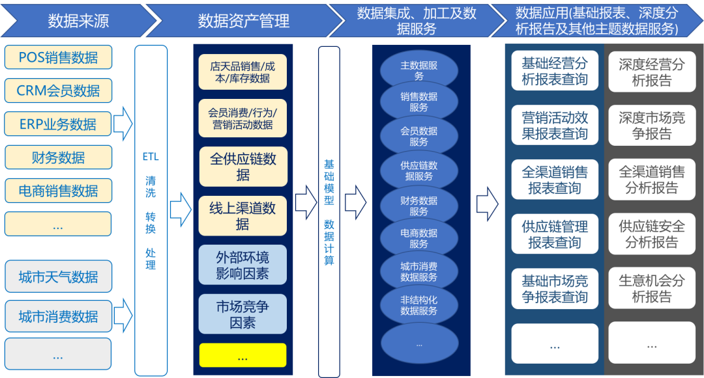

## Business Intelligence
商业智能(BI)

### 起源
早在1996年，加特纳集团（Gartner Group）提出BI的定义：商业智能描述了一系列的概念和方法，通过应用基于事实的支持系统来辅助商业决策的制定。它可以帮助企业梳理其生产关系，培养依托数据做决策的基础和习惯。

### 概念
关键在于利用数据仓库、数据挖掘和在线分析等技术对经营数据进行分析研究，以帮助企业改善经营能力，实现其商业价值。

BI的特点是可以把大量的多个系统的数据通过ETL(清理、转换、装载)变成统一格式的数据存储，再通过建模，将这些数据的维度特征和指标特征分门别类地用立方体存储，为后期的应用提供了一个快速的数据服务输出。

### 当前
BI本来属于前沿技术概念，可是时运不佳，始终没能在中国火起来。如今，大数据分析、数据中台、数据资产管理等潮流技术热词其实都是BI的近亲。

