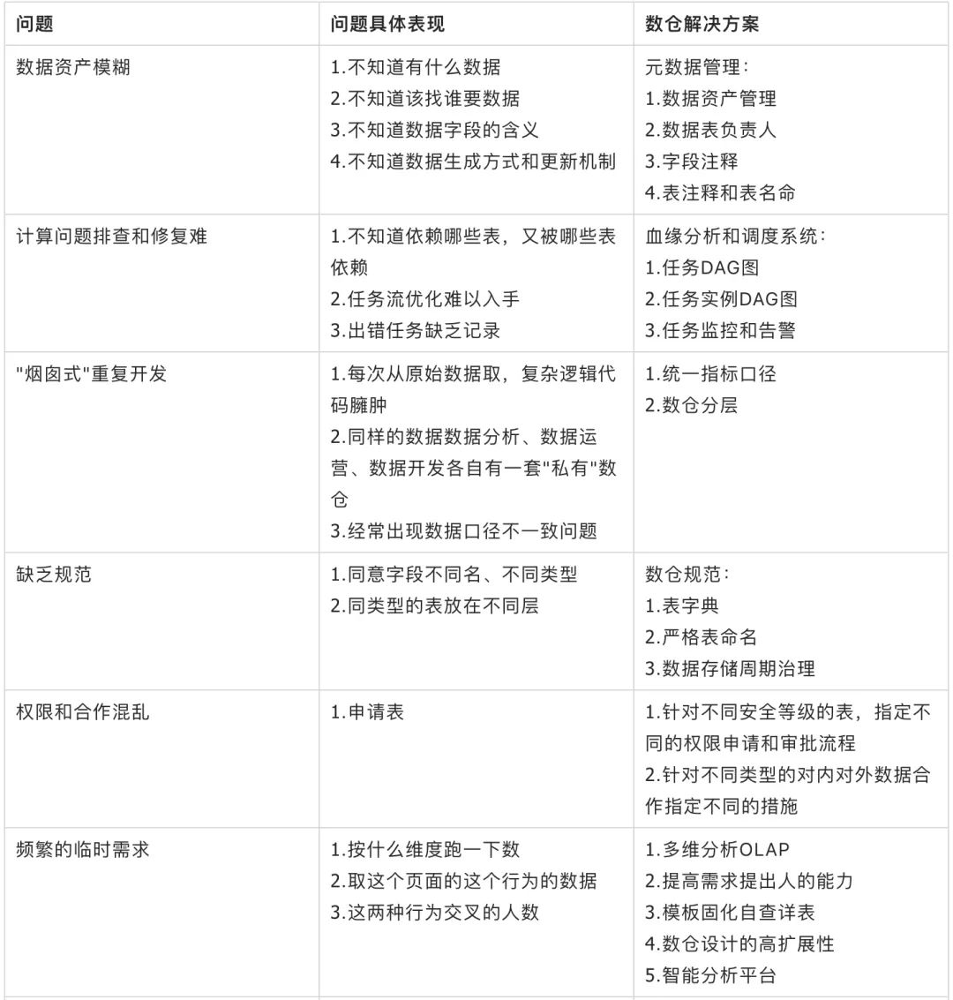

## 用户行为追踪

### 数仓
数据仓库的定义：数据管理、存储、计算、建模的方法论，是一种过程处理方法。 
数据仓库的特点：面向主题的、集成的、稳定的、反映历史变化。 
数据仓库的组成：元数据、数据建模、实现代码、血缘关系、规范准则。 
数仓在整个数据体系中的位置：数据采集->数据接入->数据仓库->数据报表/数据分析/数据挖掘。 

#### 数据库和数据仓库的对比
数据库和数据仓库的本质区别在于传统的数据库是一个存储引擎，而数据仓库是一套数据组织和应用的方法论，是需要很多的支持系统来协助（包含类似数据库这样的存储系统），最后达到支持分析决策的目的。

|数据库|数据仓库|备注|
|---|---|---|
|用于记录状态，面向事务|用于分析决策，面向主题|
|服务业务系统，作为数据源|服务数据分析师等|
|一般存储最新状态的业务数据|存储历史数据|数据仓库存在部分清除机制，历史数据并不是永久保存|
|严格遵循范式，避免冗余|为了方便使用故意引入部分冗余|
|数据量偏小|大数据量|分布式数据库也能存储大量数据|
|承载体一般为mysql、oracle等传统的关系型数据库|承载体一般为hive、greenplum等|也有部分使用oracle等传统数据库做数仓的|

#### 为什么要建设数仓
建设数仓可以带来以下的好处：

1. 方便沟通交流
2. 提高排查问题的效率
3. 提高数据开发的效率
    - 代码复用、表复用等
    - 复杂任务解耦（分散到各层或层内的不同表上）
4. 提高数据质量，避免数据口径不一致等问题
5. 减少存储成本和计算成本

无数仓或者数仓建设得不好常见的问题：

1. 数据资产模糊
    - 不知道有什么数据、该找谁要数据
    - 数据如何生成和更新的
    - 数据存储和计算资源评估缺乏必要的信息
2. 数据质量低
    - 字段命名不规范、口径不一致
    - 条件的过滤和规则等的理解差异带来的算法不一致
3. 重复建设
    - 无中间表或中间表建设的差，每次从原始数据取，数据开发周期长
    - 代码臃肿
    - 最底层取数据，带来存储和计算资源的浪费，同时滋生数据口径不一致问题
4. 底层轻微的改变对上层影响巨大
    - 业务数据轻微改动
    - 底层逻辑轻微改动
    - 底层数据异常
5. 问题定位难，周期长
    - 上下游依赖混乱
    - 任务上线容易，下线难，生命周期难以管理
    - 复杂问题耦合在一起
6. 频繁的临时性需求
    - 多维度拆解：OLAP、培养提高需求提出人的能力
    - 同质类似的小需求：即席查询、固化、详细自查、模板、培养提高需求提出人的能力

问题痛点和解决方案

虽然数仓建设能带来诸多的益处，但其是一个庞大复杂耗时的工程，需要一些支持系统的配合，比如说元数据管理系统、调度系统等，而且也并不是所有的业务一开始都要建设数仓，要根据业务发展所处的状态和未来的发展趋势以及分析决策的复杂性等综合评判。

虽然数仓可以不做，但是要做的话一定要提前规划和基本的规范制定，自由散漫野性生长的数仓有不如无。

#### 数仓建设
数仓建设的本质目的是支撑分析决策，那分析决策依赖什么样的数据，数仓建设是如何保障这些数据高效正确产出的。面向业务数据指标建设数仓，同时兼顾其它可能的扩展情况，是数仓建设的整体思路。

数仓对上层数据应用的支持主要体现在三个方面：业务监控数据（大盘数据洞察）、数据挖掘(用户画像、推荐等）、数据分析(业务诊断、提升优化等)。其中按支持的优先级来分，首先就是业务监控数据，然后是数据分析、再然后数据挖掘。这也是数据应用由浅到深的递进。

##### 业务监控支持
业务监控支持是数仓建设的主要也是最基础的服务对象。首先梳理业务，划分出业务主题，然后梳理指标体系，自顶向下的建设，主要体现在以下方面：

- 对指标体系进行分类，根据指标分类来建设数据主题集市
- 对维度进行抽象，根据抽象出的维度来建设维表，然后根据维表的生成方式配置调度策略、是线下录入还是线上生成，更新机制是日定时更新还是触发更新，以及维度的变化情况等

##### 数据分析支持
业务监控搭建起来了数据体系的基本框架，然而还是框架外的灵活数据分析需求，比如OLAP多维分析、交叉分析等，从这个角度来讲，数仓建设的中间表的维度一定要足够丰富，模型的选择上为了兼顾使用的方便性，一般以星型模型为主，同时尽可能的采用维度退化的方式，另外单主题多行为阶段的漏斗宽表和多主题多行为的宽表也能为数据分析提供极大的便利。

##### 数据挖掘支持
数据挖掘支持是在数据分析的基础上对用户行为宽表的要求更进步强化了，同时要兼顾维度的丰富性。

活动分解
数据仓库设计的具体流程，从业务需求分析、逻辑设计、物理设计、数仓的初始化方法以及更新方法
从数仓的组成上来分以下几个模块进行数仓的建设：

数仓规划策略
分层、分线、分主题（数据集市）

数仓模型思想
ER模型、维度模型、DataVault

数仓设计原则
下沉、分区、扩展

数据开发实施
代码、调度

数仓规范建设
表命名规范、字段命名、代码开发规范、任务调度规范

### 埋点
手动埋点，也叫代码埋点，本质是在客户端或者服务端一些特定的位置用代码拿到一些基本信息，然后返回给服务端。这种埋点方式虽然能精准的监控到用户的行为，和网页性能等数据，但是非常繁琐，需要大量的工作量，当然这部分工作也有人帮我们做了，比如像友盟、百度统计等给我们其实提供了服务。我们可以按照他们的流程使用手动埋点。

可视化埋点，也叫无痕埋点，解放了前端手动操的工作量，其实本质就是用系统去插入本来需要手动插入的埋点，这种埋点方式由于自带技术壁垒，所以开发人员基本基本不用考虑，花钱即可 ，比较靠谱的服务商 国外的Mixpanel，国内较早支持可视化埋点的有TalkingData、诸葛 IO，腾讯 MTA 等

无埋点，也叫全埋点，并不是没有任何埋点，所谓无只是不需要工程师在业务代码里面插入侵入式的代码。只需要简单的加载了一段定义好的SDK代码，技术门槛更低，使用与部署也简单，避免了需求变更，埋点错误导致的重新埋点。这也是大多网站的选择，因为实在太简单了。

#### 前端监控使用GIF进行上报
##### 没有跨域问题
一般而言，打点域名都不是当前域名，所有的GET/POST/HEAD请求都会构成跨域。而跨域请求很容易出现由于配置不当被浏览器拦截并报错。

##### 不会阻塞页面加载，影响用户体验
通常，创建资源节点后只有将对象注入到浏览器 DOM 树后，浏览器才会实际发送资源请求。反复操作 DOM 不仅会引发性能问题，而且载入js/css资源还会阻塞页面渲染，影响用户体验。

但是图片请求例外。构造图片打点不仅不用插入DOM，只要在js中new出Image对象就能发起请求，而且还没有阻塞问题，在没有js的浏览器环境中也能通过img标签正常打点，这是其他类型的资源请求所做不到的。

##### 在所有图片中GIF体积最小，可以节约网络资源。
上报时选用了1x1的透明GIF，而不是其他的PNG/JEPG/BMP文件。

首先，1x1像素是最小的合法图片。而且，因为是通过图片打点，所以图片最好是透明的，这样一来不会影响页面本身展示效果，二者表示图片透明只要使用一个二进制位标记图片是透明色即可，不用存储色彩空间数据，可以节约体积。因为需要透明色，所以可以直接排除JEPG(BMP32格式可以支持透明色)。同样的1x1像素透明图，BMP文件需要74个字节，PNG需要67个字节，而GIF，只需要43个字节。

hbase

hive

### 第三方平台
- 友盟优势APP统计，特别是游戏方面的
- GrowingIO亮点在无埋点
- 神策亮点在私有化，技术成熟
- 数数科技（ThinkingData）的用户行为分析方案，私有化、SaaS版本都有，支持全端的埋点采集，数据准确度、分析性能会更好。

如果你的是产品是游戏，选友盟，也可以选 talkingdata

如果你的产品是其他，选Growing/神策

如果是想私有化自己的数据，选神策

