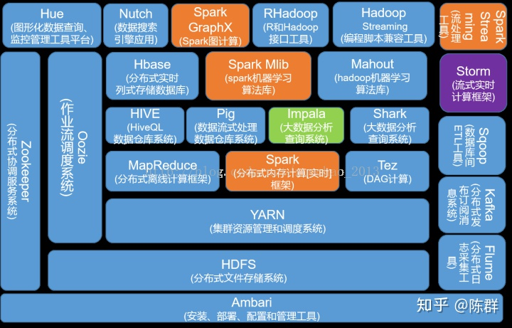

## Hadoop

Hadoop官方网站：http://hadoop.apache.org/

Hadoop 是一个由 Apache 基金会所开发的分布式系统基础架构，主要解决海量数据的存储和海量数据的分析计算问题。

广义上讲，Hadoop 通常是指一个更广泛的概念--Hadoop 生态圈。


##### MapReduce 跑的慢的原因
MapReduce 优化方法主要从六个方面考虑：数据输入、Map 阶段、Reduce 阶段、IO 传
输、数据倾斜问题和常用的调优参数。


### 历史由来

单一节点的服务器计算能力已经达到瓶颈

利用云计算的分布式技术获取网络中强大的计算存储资源，将消耗大量计算资源的复杂计算通过网络分布到多节点上进行计算，是当前一种高效的解决方案。

难题是输入文件的优化处理，分布式任务的运行管理等。

Hadoop 实质上更多是一个分布式数据基础设施: 它将巨大的数据集分派到一个由普通计算机组成的集群中的多个节点进行存储，意味着您不需要购买和维护昂贵的服务器硬件。

Spark，则是那么一个专门用来对那些分布式存储的大数据进行处理的工具，它并不会进行分布式数据的存储。

对于传统的数据库，当涉及到处理大量的可伸缩数据，这是一个繁忙的任务，只能通过单一的数据库瓶颈来处理这些数据。


谷歌使用一种称为 MapReduce 的算法解决了这个问题。这个算法将任务分成小份，并将它们分配到多台计算机，并且从这些机器收集结果并综合，形成了结果数据集。


使用谷歌提供的解决方案，Doug Cutting 和他的团队开发了一个开源项目叫做 HADOOP。
Hadoop 使用的 MapReduce 算法运行，其中数据在使用其他并行处理的应用程序。总之，Hadoop用于开发可以执行完整的统计分析大数据的应用程序。


Hadoop 是使用 Java 编写，允许分布在集群，使用简单的编程模型的计算机大型数据集处理的 Apache 的开源框架。 Hadoop框架应用工程提供跨计算机集群的分布式存储和计算的环境。 Hadoop 是专为从单一服务器到上千台机器扩展，每个机器都可以提供本地计算和存储。


### Hadoop 的架构
Hadoop 主要有两个层次，即：

- 加工/计算层(MapReduce)
- 存储层(Hadoop 分布式文件系统)


MapReduce 程序可在 Apache 的开源框架 Hadoop 上运行。在 Hadoop1.x时代 MapReduce 同时处理业务逻辑运算和资源调度，耦合性较大；在 Hadoop2.x时代，增加了 Yarn，Yarn 只负责资源的调度，MapReduce 只负责运算。

MapReduce 是一种并行编程模型，用于编写普通硬件的设计，谷歌对大量数据的高效处理(多TB数据集)的分布式应用在大型集群(数千个节点)以及可靠的容错方式。

MapReduce 将计算过程分为两个阶段：Map 和 Reduce。<br>
1）Map 阶段并行处理输入数据<br>
2）Reduce 阶段对 Map 结果进行汇总<br>

Hadoop 分布式文件系统（Hadoop Distributed File System，简称 HDFS）是基于谷歌文件系统（GFS），并提供了一个设计在普通硬件上运行的分布式文件系统。它与现有的分布式文件系统有许多相似之处。来自其他分布式文件系统的差别是显著。它高度容错并设计成部署在低成本的硬件。提供了高吞吐量的应用数据访问，并且适用于具有大数据集的应用程序。

除了上面提到的两个核心组件，Hadoop 的框架还包括以下两个模块：

- Hadoop 通用：这是 Java 库和其他 Hadoop 组件所需的实用工具。

- Hadoop YARN ：Yet Another Resource Negotiator，这是作业调度和集群资源管理的框架。


Hadoop 运行整个计算机集群代码。这个过程包括以下核心任务由 Hadoop 执行：

- 数据最初分为目录和文件。文件分为128M和64M（128M最好）统一大小块。
- 然后这些文件被分布在不同的群集节点，以便进一步处理。
- HDFS，本地文件系统的顶端、监管处理。
- 块复制处理硬件故障。
- 检查代码已成功执行。
- 执行发生映射之间，减少阶段的排序。
- 发送排序的数据到某一计算机。
- 为每个作业编写的调试日志。

### Hadoop 运行模式
Hadoop 运行模式包括：本地模式、伪分布式模式以及完全分布式模式。

#### 配置文件说明
Hadoop 配置文件分两类：默认配置文件和自定义配置文件，只有用户想修改某一默认
配置值时，才需要修改自定义配置文件，更改相应属性值。

（1）默认配置文件：<br>
[core-default.xml] hadoop-common-2.7.2.jar/core-default.xml<br>
[hdfs-default.xml] hadoop-hdfs-2.7.2.jar/hdfs-default.xml<br>
[yarn-default.xml] hadoop-yarn-common-2.7.2.jar/yarn-default.xml<br>
[mapred-default.xml] hadoop-mapreduce-client-core-2.7.2.jar/mapred-default.xml<br>

（2）自定义配置文件：<br>
core-site.xml、hdfs-site.xml、yarn-site.xml、mapred-site.xml四个配置文件存放在$HADOOP_HOME/etc/hadoop这个路径上，可以根据项目需求重新进行修改配置。<br>

#### 本地运行模式-官方 Grep 案例
```
在hadoop-2.7.2文件下面创建一个input文件夹
cd $HADOOP_HOME
mkdir input
将Hadoop的xml配置文件复制到input
cp etc/hadoop/*.xml input
执行share目录下的MapReduce程序
bin/hadoop jar share/hadoop/mapreduce/hadoop-mapreduce-examples-2.7.2.jar
grep input output 'dfs[a-z.]+'
查看输出结果
cat output/*
```

#### 本地运行模式-官方 WordCount 案例
```
在hadoop-2.7.2文件下面创建一个wcinput文件夹
cd $HADOOP_HOME
mkdir wcinput
在wcinput文件下创建一个wc.input文件
cd wcinput
touch wc.input
编辑wc.input文件
vi wc.input
在文件中输入如下内容
hadoop yarn
hadoop mapreduce
atguigu
atguigu
保存退出：：wq
回到Hadoop目录，执行share目录下的MapReduce程序
bin/hadoop jar share/hadoop/mapreduce/hadoop-mapreduce-examples-2.7.2.jar
wordcount wcinput wcoutput
查看输出结果
cat wcoutput/part-r-00000
```

#### 伪分布式运行模式-启动 HDFS 并运行 MapReduce 程序
```
（1）配置集群
（a）配置：hadoop-env.sh
配置JAVA_HOME
（b）配置：core-site.xml
<!--指定HDFS中NameNode的地址-->
<property>
    <name>fs.defaultFS</name>
    <value>hdfs://hadoop101:9000</value>
</property>
<!--指定Hadoop运行时产生文件的存储目录-->
<property>
    <name>hadoop.tmp.dir</name>
    <value>/opt/module/hadoop-2.7.2/data/tmp</value>
</property>
（c）配置：hdfs-site.xml
<!--指定HDFS副本的数量-->
<property>
<name>dfs.replication</name>
<value>1</value>
</property>
（2）启动集群
（a）格式化NameNode（第一次启动时格式化，以后就不要总格式化）
bin/hdfs namenode -format
（b）启动NameNode
sbin/hadoop-daemon.sh start namenode
（c）启动DataNode
sbin/hadoop-daemon.sh start datanode
（3）查看集群
（a）查看是否启动成功
jps #注意：jps是JDK中的命令，不是Linux命令。
（b）web端查看HDFS文件系统
http://hadoop101:50070/dfshealth.html#tab-overview
（c）查看产生的Log日志
（d）思考：为什么不能一直格式化NameNode，格式化NameNode，要注意什么？
注意：格式化NameNode，会产生新的集群id,导致NameNode和DataNode的集群id不一致，集群找不到已往数据。所以，格式NameNode时，一定要先删除data数据和log日志，然后再格式化NameNode。
（4）操作集群
（a）在HDFS文件系统上创建一个input文件夹
bin/hdfs dfs -mkdir -p /user/atguigu/input
（b）将测试文件内容上传到文件系统上
bin/hdfs dfs -put wcinput/wc.input /user/atguigu/input/
（c）查看上传的文件是否正确
bin/hdfs dfs -ls /user/atguigu/input/
bin/hdfs dfs -cat /user/atguigu/input/wc.input
（d）运行MapReduce程序
bin/hadoop jar share/hadoop/mapreduce/hadoop-mapreduce-examples-2.7.2.jar wordcount /user/atguigu/input/ /user/atguigu/output
（e）查看输出结果
bin/hdfs dfs -cat /user/atguigu/output/*
（f）将测试文件内容下载到本地
hdfs dfs -get /user/atguigu/output/part-r-00000./wcoutput/
（g）删除输出结果
hdfs dfs -rm -r /user/atguigu/output
```

#### 伪分布式运行模式-启动 YARN 并运行 MapReduce 程序
```
（1）配置集群
（a）配置yarn-env.sh
配置JAVA_HOME
（b）配置yarn-site.xml
<!--Reducer获取数据的方式-->
<property>
    <name>yarn.nodemanager.aux-services</name>
    <value>mapreduce_shuffle</value>
</property>
<!--指定YARN的ResourceManager的地址-->
<property>
    <name>yarn.resourcemanager.hostname</name>
    <value>hadoop101</value>
</property>
（c）配置：mapred-env.sh
配置JAVA_HOME
（d）配置：(对mapred-site.xml.template重新命名为)mapred-site.xml
<!--指定MR运行在YARN上-->
<property>
    <name>mapreduce.framework.name</name>
    <value>yarn</value>
</property>
（2）启动集群
（a）启动前必须保证NameNode和DataNode已经启动
（b）启动ResourceManager
sbin/yarn-daemon.sh start resourcemanager
（c）启动NodeManager
sbin/yarn-daemon.sh start nodemanager
（3）集群操作
（a）YARN的浏览器页面查看http://hadoop101:8088/cluster
（b）删除文件系统上的output文件
bin/hdfs dfs -rm -R /user/atguigu/output
（c）执行MapReduce程序
bin/hadoop jar share/hadoop/mapreduce/hadoop-mapreduce-examples-2.7.2.jar wordcount /user/atguigu/input /user/atguigu/output
（d）查看运行结果
bin/hdfs dfs -cat /user/atguigu/output/*
```

#### 伪分布式运行模式-配置历史服务器
```
（1）配置mapred-site.xml
vi mapred-site.xml
在该文件里面增加如下配置。
<!--历史服务器端地址-->
<property>
    <name>mapreduce.jobhistory.address</name>
    <value>hadoop101:10020</value>
</property>
<!--历史服务器web端地址-->
<property>
    <name>mapreduce.jobhistory.webapp.address</name>
    <value>hadoop101:19888</value>
</property>
（2）启动历史服务器
sbin/mr-jobhistory-daemon.sh start historyserver
（3）查看历史服务器是否启动
jps
（4）查看JobHistory http://hadoop101:19888/jobhistory
```

#### 伪分布式运行模式-配置日志的聚集
日志聚集概念：应用运行完成以后，将程序运行日志信息上传到HDFS系统上。
注意：开启日志聚集功能，需要重新启动NodeManager、ResourceManager和HistoryManager。
```
（1）配置yarn-site.xml
vi yarn-site.xml
在该文件里面增加如下配置。
<!--日志聚集功能使能-->
<property>
    <name>yarn.log-aggregation-enable</name>
    <value>true</value>
</property>
<!--日志保留时间设置7天-->
<property>
    <name>yarn.log-aggregation.retain-seconds</name>
    <value>604800</value>
</property>
（2）关闭NodeManager、ResourceManager和HistoryManager
sbin/yarn-daemon.sh stop resourcemanager
sbin/yarn-daemon.sh stop nodemanager
sbin/mr-jobhistory-daemon.sh stop historyserver
（3）启动NodeManager、ResourceManager和HistoryManager
sbin/yarn-daemon.sh start resourcemanager
sbin/yarn-daemon.sh start nodemanager
sbin/mr-jobhistory-daemon.sh start historyserver
（4）删除HDFS上已经存在的输出文件
bin/hdfs dfs -rm -R /user/atguigu/output
（5）执行WordCount程序
hadoop jar share/hadoop/mapreduce/hadoop-mapreduce-examples-2.7.2.jar wordcount /user/atguigu/input 
/user/atguigu/output
（6）查看日志http://hadoop101:19888/jobhistory
```

#### 完全分布式运行模式
1. 准备客户机（关闭防火墙、静态ip、主机名称）
2. 安装JDK
3. 配置环境变量
4. 安装Hadoop
5. 配置环境变量
6. 配置集群
7. 单点启动
8. 配置ssh
9. 群起并测试集群

#### Hadoop编译源码
```
1.准备工作：CentOS联网、jar包准备(hadoop源码、JDK8、maven、ant、protobuf)
（1）hadoop-2.7.2-src.tar.gz
（2）jdk-8u144-linux-x64.tar.gz
（3）apache-ant-1.9.9-bin.tar.gz（build工具，打包用的）
（4）apache-maven-3.0.5-bin.tar.gz
（5）protobuf-2.5.0.tar.gz（序列化的框架）
注意：采用root角色编译，减少文件夹权限出现问题
2.jar包安装：
（1）JDK解压、配置环境变量JAVA_HOME和PATH
（2）Maven解压、配置MAVEN_HOME和PATH
（3）ant解压、配置ANT_HOME和PATH
（4）安装glibc-headers和g++命令如下
yum install glibc-headers
yum install gcc-c++
（5）安装make和cmake
yum install make
yum install cmake
（6）解压protobuf，进入到解压后protobuf主目录，/opt/module/protobuf-2.5.0，
然后相继执行命令
tar -zxvf protobuf-2.5.0.tar.gz -C /opt/module/
cd /opt/module/protobuf-2.5.0/
./configure
make
make check
make install
ldconfig

vi /etc/profile
#LD_LIBRARY_PATH
export LD_LIBRARY_PATH=/opt/module/protobuf-2.5.0
export PATH=$PATH:$LD_LIBRARY_PATH
source/etc/profile
（7）安装openssl库、安装ncurses-devel库
yum install openssl-devel
yum install ncurses-devel
3.编译源码
（1）解压源码到/opt/目录
tar -zxvf hadoop-2.7.2-src.tar.gz -C /opt/
（2）进入到hadoop源码主目录
cd /opt/hadoop-2.7.2-src
（3）通过maven执行编译命令
mvn package -Pdist,native -DskipTests -Dtar
等待时间30分钟左右，最终成功是全部SUCCESS，
（4）成功的64位hadoop包在/opt/hadoop-2.7.2-src/hadoop-dist/target下
4.编译源码过程中常见的问题及解决方案
（1）MAVEN install时候JVM内存溢出
处理方式：在环境配置文件和maven的执行文件均可调整MAVEN_OPT的heap大小。
（2）编译期间maven报错。可能网络阻塞问题导致依赖库下载不完整导致，多次执行命令
（一次通过比较难）。
（3）报ant、protobuf等错误，插件下载未完整或者插件版本问题，最开始链接有较多特殊
情况，同时推荐2.7.0版本的问题汇总帖子http://www.tuicool.com/articles/IBn63qf
```

### Hadoop的特点
Hadoop框架允许用户快速地编写和测试的分布式系统。有效并在整个机器和反过来自动分配数据和工作，利用CPU内核的基本平行度。
<br>
Hadoop不依赖于硬件，以提供容错和高可用性（FTHA），而Hadoop库本身已被设计在应用层可以检测和处理故障。
<br>
服务器可以添加或从集群动态删除，Hadoop可继续不中断地运行。
<br>
Hadoop的的另一大优势在于，除了是开源的，因为它是基于Java并兼容所有的平台。
<br>

### Hadoop生态圈


Hadoop生态圈由以下内容组成：

- HDFS—— Hadoop生态圈的基本组成部分是Hadoop分布式文件系统（Hadoop Distributed File System）。HDFS是一种数据分布式保存机制，数据被保存在计算机集群上。数据写入一次，读取多次。HDFS为HBase等工具提供了基础。
- MapReduce——Hadoop的主要执行框架是MapReduce，它是一个分布式、并行处理的编程模型。MapReduce把任务分为map(映射)阶段和reduce(化简)。开发人员使用存储在HDFS中数据（可实现快速存储），编写Hadoop的MapReduce任务。由于MapReduce工作原理的特性， Hadoop能以并行的方式访问数据，从而实现快速访问数据。
- Hbase——HBase是一个建立在HDFS之上，面向列的NoSQL数据库，用于快速读/写大量数据。HBase使用Zookeeper进行管理，确保所有组件都正常运行。
- Zookeeper ——用于Hadoop的分布式协调服务。Hadoop的许多组件依赖于Zookeeper，它运行在计算机集群上面，用于管理Hadoop操作。
- Oozie——Oozie是一个可扩展的工作体系，集成于Hadoop的堆栈，用于协调多个MapReduce作业的执行。它能够管理一个复杂的系统，基于外部事件来执行，外部事件包括数据的定时和数据的出现。
- Pig——它是MapReduce编程的复杂性的抽象。Pig平台包括运行环境和用于分析Hadoop数据集的脚本语言(Pig Latin)。其编译器将Pig Latin翻译成MapReduce程序序列。
- Hive ——Hive类似于SQL高级语言，用于运行存储在Hadoop上的查询语句，Hive让不熟悉MapReduce开发人员也能编写数据查询语句，然后这些语句被翻译为Hadoop上面的MapReduce任务。像Pig一样，Hive作为一个抽象层工具，吸引了很多熟悉SQL而不是Java编程的数据分析师。

- Sqoop是一个连接工具，用于在关系数据库、数据仓库和Hadoop之间转移数据。Sqoop利用数据库技术描述架构，进行数据的导入/导出；利用MapReduce实现并行化运行和容错技术。
- Flume提供了分布式、可靠、高效的服务，用于收集、汇总大数据，并将单台计算机的大量数据转移到HDFS。它基于一个简单而灵活的架构，并提供了数据流的流。它利用简单的可扩展的数据模型，将企业中多台计算机上的数据转移到Hadoop。
- Kafka是一种高吞吐量的分布式发布订阅消息系统，有如下特性：（1）通过O(1)的磁盘数据结构提供消息的持久化，这种结构对于即使数以TB的消息存储也能够保持长时间的稳定性能。（2）高吞吐量：即使是非常普通的硬件Kafka也可以支持每秒数百万的消息。（3）支持通过Kafka服务器和消费机集群来分区消息。（4）支持Hadoop并行数据加载。
- Storm用于“连续计算”，对数据流做连续查询，在计算时就将结果以流的形式输出给用户。
- Spark是当前最流行的开源大数据内存计算框架。可以基于Hadoop上存储的大数据进行计算。

- Whirr——Whirr是一组用来运行云服务的Java类库，使用户能够轻松地将Hadoop集群运行于Amazon EC2、Rackspace等虚拟云计算平台。
- Mahout——Mahout是一个机器学习和数据挖掘库，它提供的MapReduce包含很多实现，包括聚类算法、回归测试、统计建模。通过使用 Apache Hadoop 库，可以将Mahout有效地扩展到云中。
- BigTop —— BigTop作为Hadoop子项目和相关组件，是一个用于打包和互用性测试的程序和框架。
- Ambari——Ambar通过为配置、管理和监控Hadoop集群提供支持，简化了Hadoop的管理。

### Hadoop三大发行版本
Hadoop三大发行版本：Apache、Cloudera、Hortonworks。

Apache版本最原始（最基础）的版本，对于入门学习最好。<br>
Cloudera在大型互联网企业中用的较多。<br>
Hortonworks文档较好。<br>

1.ApacheHadoop<br>
官网地址：http://hadoop.apache.org/releases.html<br>
下载地址：https://archive.apache.org/dist/hadoop/common/<br>
2.ClouderaHadoop<br>
官网地址：https://www.cloudera.com/downloads/cdh/5-10-0.html<br>
下载地址：http://archive-primary.cloudera.com/cdh5/cdh/5/<br>
（1）2008年成立的Cloudera是最早将Hadoop商用的公司，为合作伙伴提供Hadoop
的商用解决方案，主要是包括支持、咨询服务、培训。<br>
（2）2009年Hadoop的创始人DougCutting也加盟Cloudera公司。Cloudera产品主
要为CDH，ClouderaManager，ClouderaSupport<br>
（3）CDH是Cloudera的Hadoop发行版，完全开源，比ApacheHadoop在兼容性，安
全性，稳定性上有所增强。<br>
（4）ClouderaManager是集群的软件分发及管理监控平台，可以在几个小时内部署好一
个Hadoop集群，并对集群的节点及服务进行实时监控。ClouderaSupport即是对Hadoop的
技术支持。<br>
（5）Cloudera的标价为每年每个节点4000美元。Cloudera开发并贡献了可实时处理大
数据的Impala项目。<br>
3.HortonworksHadoop<br>
官网地址：https://hortonworks.com/products/data-center/hdp/<br>
下载地址：https://hortonworks.com/downloads/#data-platform<br>
（1）2011年成立的Hortonworks是雅虎与硅谷风投公司BenchmarkCapital合资组建。<br>
（2）公司成立之初就吸纳了大约25名至30名专门研究Hadoop的雅虎工程师，上述
工程师均在2005年开始协助雅虎开发Hadoop，贡献了Hadoop80%的代码。<br>
（3）雅虎工程副总裁、雅虎Hadoop开发团队负责人EricBaldeschwieler出任Hortonworks
的首席执行官。<br>
（4）Hortonworks的主打产品是HortonworksDataPlatform（HDP），也同样是100%开
源的产品，HDP除常见的项目外还包括了Ambari，一款开源的安装和管理系统。<br>
（5）HCatalog，一个元数据管理系统，HCatalog现已集成到Facebook开源的Hive中。
Hortonworks的Stinger开创性的极大的优化了Hive项目。Hortonworks为入门提供了一个非
常好的，易于使用的沙盒。<br>
（6）Hortonworks开发了很多增强特性并提交至核心主干，这使得ApacheHadoop能够在包括WindowServer和WindowsAzure在内的MicrosoftWindows平台上本地运行。定价以集群为基础，每10个节点每年为12500美元。<br>

### Hadoop的应用现状

Yahoo是Hadoop的最大支持者，截至2012年，Yahoo的Hadoop机器总节点数目超过42?000个，有超过10万的核心CPU在运行Hadoop。最大的一个单Master节点集群有4500个节点（每个节点双路4核心CPUboxesw，4×1TB磁盘，16GBRAM）。总的集群存储容量大于350PB，每月提交的作业数目超过1000万个，在Pig中超过60%的Hadoop作业是使用Pig编写提交的。
Yahoo的Hadoop应用主要包括以下几个方面：

- 支持广告系统
- 用户行为分析
- 支持Web搜索
- 反垃圾邮件系统
- 会员反滥用
- 内容敏捷
- 个性化推荐

Facebook使用Hadoop存储内部日志与多维数据，并以此作为报告、分析和机器学习的数据源。目前Hadoop集群的机器节点超过1400台，共计11?200个核心CPU，超过15PB原始存储容量，每个商用机器节点配置了8核CPU，12TB数据存储，主要使用StreamingAPI和JavaAPI编程接口。Facebook同时在Hadoop基础上建立了一个名为Hive的高级数据仓库框架，Hive已经正式成为基于Hadoop的Apache一级项目。此外，还开发了HDFS上的FUSE实现。

A9.com为Amazon使用Hadoop构建了商品搜索索引，主要使用StreamingAPI以及C++、Perl和Python工具，同时使用Java和StreamingAPI分析处理每日数以百万计的会话。A9.com为Amazon构建的索引服务运行在100节点左右的Hadoop集群上。

Adobe主要使用Hadoop及HBase，同于支撑社会服务计算，以及结构化的数据存储和处理。大约有超过30个节点的Hadoop-HBase生产集群。Adobe将数据直接持续地存储在HBase中，并以HBase作为数据源运行MapReduce作业处理，然后将其运行结果直接存到HBase或外部系统。Adobe在2008年10月就已经将Hadoop和HBase应用于生产集群。

自2008年4月以来，日本的CbIR（Content-basedInformationRetrieval）公司在AmazonEC2上使用Hadoop来构建图像处理环境，用于图像产品推荐系统。使用Hadoop环境生成源数据库，便于Web应用对其快速访问，同时使用Hadoop分析用户行为的相似性。

Datagraph主要使用Hadoop批量处理大量的RDF数据集，尤其是利用Hadoop对RDF数据建立索引。Datagraph也使用Hadoop为客户执行长时间运行的离线SPARQL查询。Datagraph是使用AmazonS3和Cassandra存储RDF数据输入和输出文件的，并已经开发了一个基于MapReduce处理RDF数据的Ruby框架——RDFgrid。
Datagraph主要使用Ruby、RDF.rb以及自己开发的RDFgrid框架来处理RDF数据，主要使用HadoopStreaming接口。

EBay单集群超过532节点集群，单节点8核心CPU，容量超过5.3PB存储。大量使用的MapReduce的Java接口、Pig、Hive来处理大规模的数据，还使用HBase进行搜索优化和研究。

IBM蓝云也利用Hadoop来构建云基础设施。IBM蓝云使用的技术包括：Xen和PowerVM虚拟化的Linux操作系统映像及Hadoop并行工作量调度，并发布了自己的Hadoop发行版及大数据解决方案。

Last.Fm主要用于图表计算、专利申报、日志分析、A/B测试、数据集合并等，也使用Hadoop对超过百万的曲目进行大规模的音频特征分析。
节点超过100台机器，集群节点配置双四核XeonL5520@2.27GHzL5630@2.13GHz，24GB内存，8TB（4×2TB）存储。

LinkedIn有多种硬件配置的Hadoop集群，主要集群配置如下：

- 800节点集群，基于Westmere的惠普SL170X与2×4的核心，24GB内存，6×2TBSATA。
- 1900节点集群，基于Westmere的超微-HX8DTT，与2×6的核心，24GB内存，6×2TBSATA。
- 1400节点集群，基于SandyBridge超微与2×6的核心，32GB内存，6×2TBSATA。
使用的软件如下：

- 操作系统使用RHEL6.3。
- JDK使用SUNJDK1.6.0_32。
- Apache的Hadoop0.20.2的补丁和ApacheHadoop的1.0.4补丁。
- Azkaban和Azkaban用于作业调度。
- Hive、Avro、Kafka等。

MobileAnalytic.TV主要使用Hadoop应用在并行化算法领域，涉及的MapReduce应用算法如下。

- 信息检索和分析。
- 机器生成的内容——文档、文本、音频、视频。
- 自然语言处理。
- 项目组合包括：
- 移动社交网络。
- 网络爬虫。
- 文本到语音转化。
- 音频和视频自动生成。

Openstat主要利用Hadoop定制一个网络日志分析并生成报告，其生产环境下超过50个节点集群（双路四核Xeon处理器，16GB的RAM，4～6硬盘驱动器），还有两个相对小的集群用于个性化分析，每天处理约500万的事件，每月15亿美元的交易数据，集群每天产生大约25GB的报告。
使用的技术主要包括：CDH、Cascading、Janino。

Quantcast 3000个CPU核心，3500TB存储，每日处理1PB以上的数据，使用完全自定义的数据路径和排序器的Hadoop调度器，对KFS文件系统有突出贡献。

Rapleaf 超过80个节点的集群（每个节点有2个双核CPU，2TB×8存储，16GBRAM内存）；主要使用Hadoop、Hive处理Web上关联到个人的数据，并引入Cascading简化数据流穿过各种处理阶段。

WorldLingo硬件上超过44台服务器（每台有2个双核CPU，2TB存储，8GB内存），每台服务器均运行Xen，启动一个虚拟机实例运行Hadoop/HBase，再启动一个虚拟机实例运行Web或应用程序服务器，即有88台可用的虚拟机；运行两套独立的Hadoop/HBase机群，它们各自拥有22个节点。Hadoop主要用于运行HBase和MapReduce作业，扫描HBase的数据表，执行特定的任务。HBase作为一种可扩展的、快速的存储后端，用于保存数以百万的文档。目前存储了1200万篇文档，近期的目标是存储4.5亿篇文档。

格拉斯哥大学的TerrierTeam超过30个节点的实验集群（每节点配置XeonQuadCore2.4GHz，4GB内存，1TB存储）。使用Hadoop促进信息检索研究和试验，特别是用于TREC，用于TerrierIR平台。Terrier的开源发行版中包含了基于HadoopMapReduce的大规模分布式索引。

内布拉斯加大学的HollandComputingCenter运行一个中等规模的Hadoop机群（共计1.6PB存储）用于存储和提供物理数据，以支持紧凑型μ子螺旋型磁谱仪（CompactMuonSolenoid，CMS）实验的计算。这需要一类能够以几Gbps的速度下载数据，并以更高的速度处理数据的文件系统的支持。

VisibleMeasures将Hadoop作为可扩展数据流水线的一个组件，最终用于VisibleSuite等产品。使用Hadoop汇总、存储和分析与网络视频观众收看行为相关的数据流。目前的网格包括超过128个CPU核心，超过100TB的存储，并计划大幅扩容。


百度在2006年就开始关注Hadoop并开始调研和使用，在2012年其总的集群规模达到近十个，单集群超过2800台机器节点，Hadoop机器总数有上万台机器，总的存储容量超过100PB，已经使用的超过74PB，每天提交的作业数目有数千个之多，每天的输入数据量已经超过7500TB，输出超过1700TB。
百度的Hadoop集群为整个公司的数据团队、大搜索团队、社区产品团队、广告团队，以及LBS团体提供统一的计算和存储服务，主要应用包括：

- 数据挖掘与分析。
- 日志分析平台。
- 数据仓库系统。
- 推荐引擎系统。
- 用户行为分析系统。
同时百度在Hadoop的基础上还开发了自己的日志分析平台、数据仓库系统，以及统一的C++编程接口，并对Hadoop进行深度改造，开发了HadoopC++扩展HCE系统。

阿里巴巴的Hadoop集群截至2012年大约有3200台服务器，大约30?000物理CPU核心，总内存100TB，总的存储容量超过60PB，每天的作业数目超过150?000个，每天hivequery查询大于6000个，每天扫描数据量约为7.5PB，每天扫描文件数约为4亿，存储利用率大约为80%，CPU利用率平均为65%，峰值可以达到80%。阿里巴巴的Hadoop集群拥有150个用户组、4500个集群用户，为淘宝、天猫、一淘、聚划算、CBU、支付宝提供底层的基础计算和存储服务，主要应用包括：

- 数据平台系统。
- 搜索支撑。
- 广告系统。
- 数据魔方。
- 量子统计。
- 淘数据。
- 推荐引擎系统。
- 搜索排行榜。
为了便于开发，其还开发了WebIDE继承开发环境，使用的相关系统包括：Hive、Pig、Mahout、Hbase等。

腾讯也是使用Hadoop最早的中国互联网公司之一，截至2012年年底，腾讯的Hadoop集群机器总量超过5000台，最大单集群约为2000个节点，并利用Hadoop-Hive构建了自己的数据仓库系统TDW，同时还开发了自己的TDW-IDE基础开发环境。腾讯的Hadoop为腾讯各个产品线提供基础云计算和云存储服务，其支持以下产品：

- 腾讯社交广告平台。
- 搜搜（SOSO）。
- 拍拍网。
- 腾讯微博。
- 腾讯罗盘。
- QQ会员。
- 腾讯游戏支撑。
- QQ空间。
- 朋友网。
- 腾讯开放平台。
- 财付通。
- 手机QQ。
- QQ音乐。

奇虎360主要使用Hadoop-HBase作为其搜索引擎so.com的底层网页存储架构系统，360搜索的网页可到千亿记录，数据量在PB级别。截至2012年年底，其HBase集群规模超过300节点，region个数大于10万个，使用的平台版本如下。

- HBase版本：facebook0.89-fb。
- HDFS版本：facebookHadoop-20。
奇虎360在Hadoop-HBase方面的工作主要为了优化减少HBase集群的启停时间，并优化减少RS异常退出后的恢复时间。

华为公司也是Hadoop主要做出贡献的公司之一，排在Google和Cisco的前面，华为对Hadoop的HA方案，以及HBase领域有深入研究，并已经向业界推出了自己的基于Hadoop的大数据解决方案。

中国移动于2010年5月正式推出大云BigCloud1.0，集群节点达到了1024。中国移动的大云基于Hadoop的MapReduce实现了分布式计算，并利用了HDFS来实现分布式存储，并开发了基于Hadoop的数据仓库系统HugeTable，并行数据挖掘工具集BC-PDM，以及并行数据抽取转化BC-ETL，对象存储系统BC-ONestd等系统，并开源了自己的BC-Hadoop
版本。
中国移动主要在电信领域应用Hadoop，其规划的应用领域包括：

- 经分KPI集中运算。
- 经分系统ETL/DM。
- 结算系统。
- 信令系统。
- 云计算资源池系统。
- 物联网应用系统。
- E-mail。
- IDC服务等。

盘古搜索（目前已和即刻搜索合并为中国搜索）主要使用Hadoop集群作为搜索引擎的基础架构支撑系统，截至2013年年初，集群中机器数量总计超过380台，存储总量总计3.66PB，主要包括的应用如下：

- 网页存储。
- 网页解析。
- 建索引。
- Pagerank计算。
- 日志统计分析。
- 推荐引擎等。

即刻搜索（目前已与盘古搜索合并为中国搜索）也使用Hadoop作为其搜索引擎的支撑系统，截至2013年，其Hadoop集群规模总计超过500台节点，配置为双路6核心CPU，48G内存，11×2T存储，集群总容量超过10PB，使用率在78%左右，每天处理读取的数据量约为500TB，峰值大于1P，平均约为300TB。
即刻搜索在搜索引擎中使用sstable格式存储网页并直接将sstable文件存储在HDFS上面，主要使用HadoopPipes编程接口进行后续处理，也使用Streaming接口处理数据，主要的应用包括：

- 网页存储。
- 解析。
- 建索引。
- 推荐引擎。
