## books

书单

《编码：隐匿在计算机软硬件背后的语言》 豆瓣评分：9.2分

《代码整洁之道》 豆瓣评分：8.6分

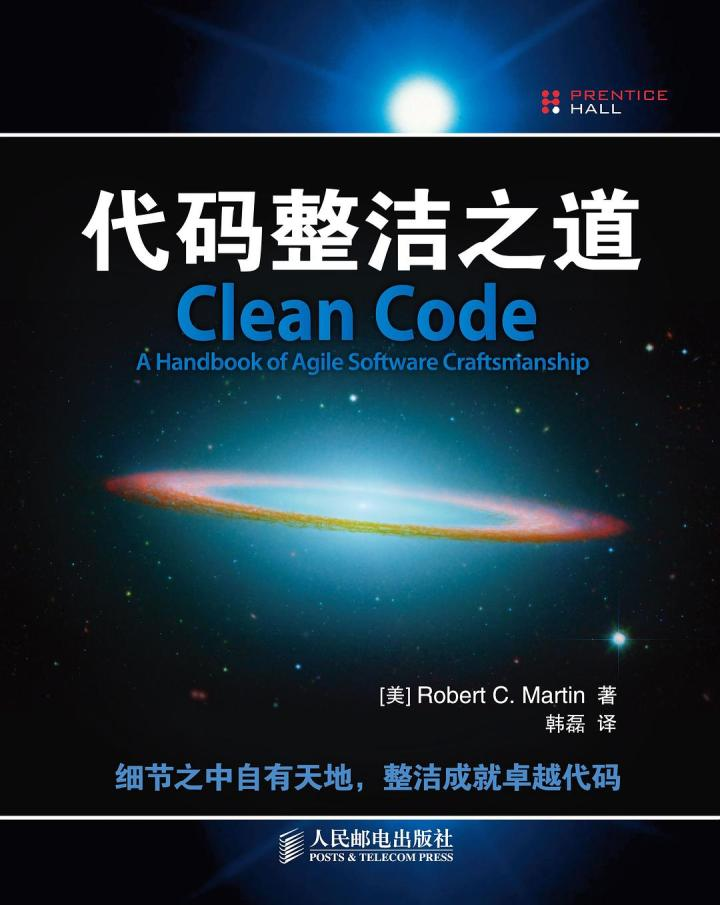

《编程珠玑》 豆瓣评分：9.1

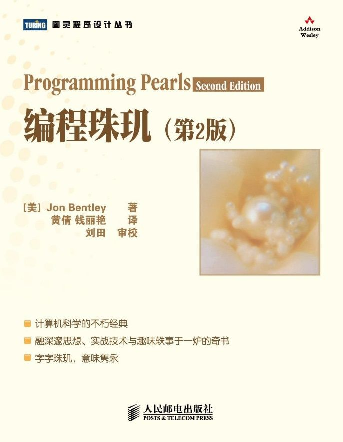

《数据结构和算法分析（套书）》 豆瓣均分：8.7分

《软技能—代码之外的生存指南》 豆瓣评分：8.0分

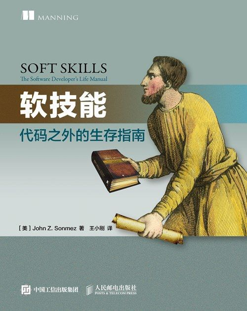

《重构:改善既有代码的设计》 豆瓣评分：9.0分

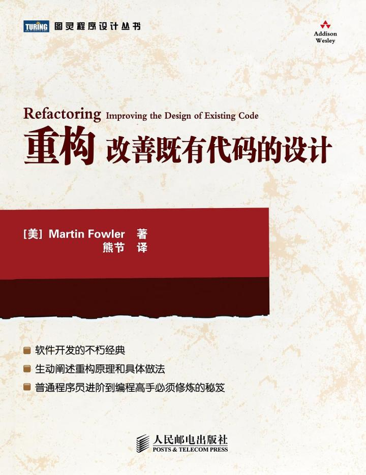

《快速软件开发》 豆瓣评分：8.4分

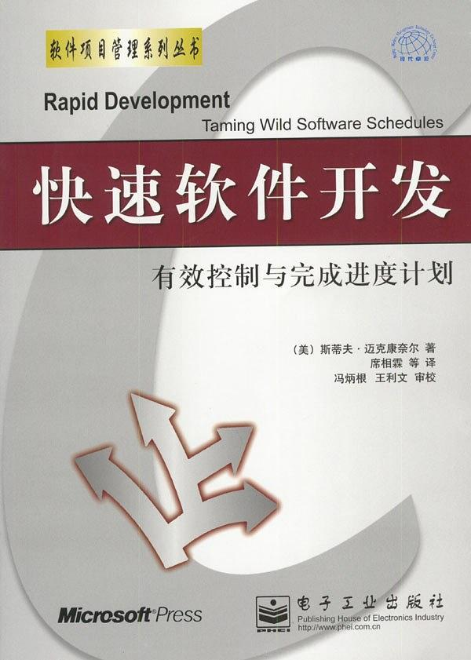

《高效程序员的45个习惯》 豆瓣评分：8.2分

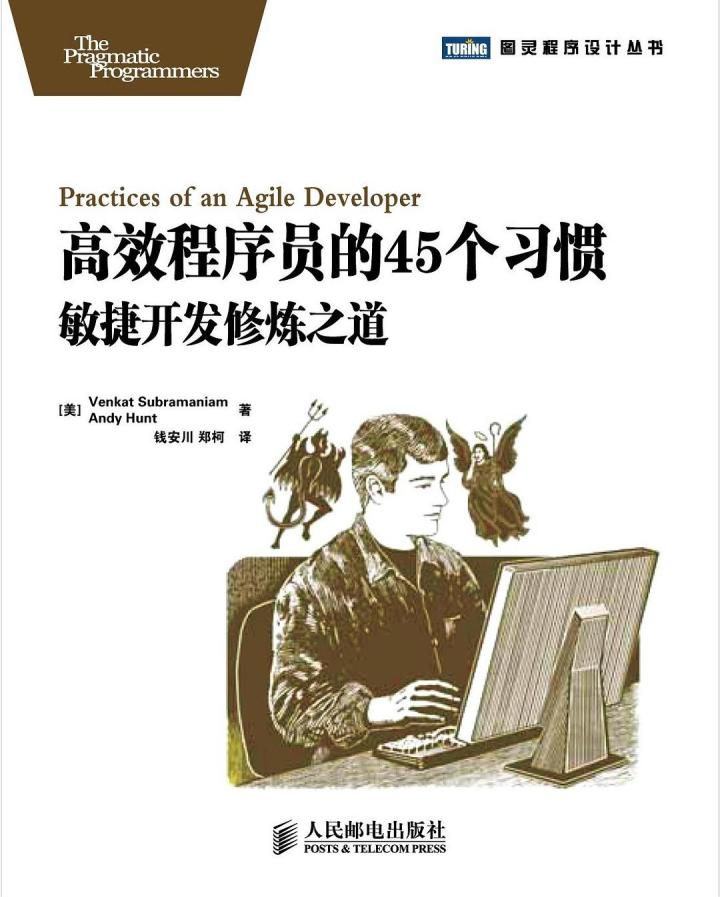

《软技能2：软件开发者职业生涯指南》 豆瓣评分：9.0分

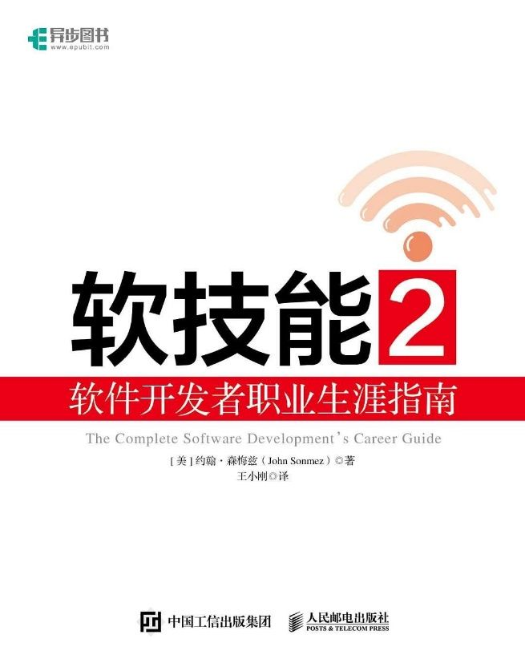

《程序员修炼之道：通向务实的最高境界（第2版）》 豆瓣评分：9.2分

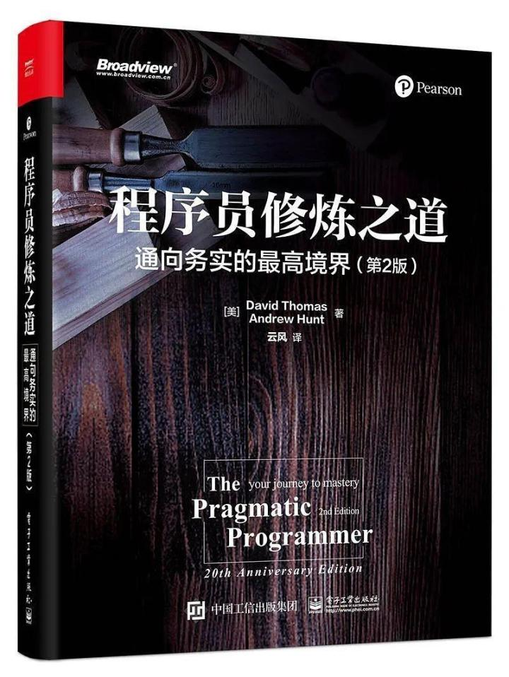

《人月神话》 豆瓣评分：8.4分

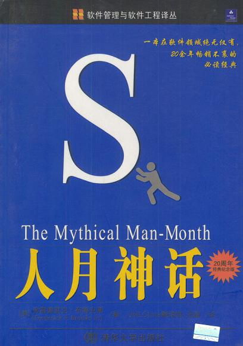

《点石成金 : 访客至上的Web和移动可用性设计秘笈》 豆瓣评分：8.2分

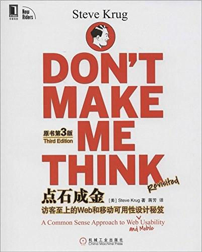

《设计模式》 豆瓣评分：9.1分

《交互设计之路》 豆瓣评分：7.9分

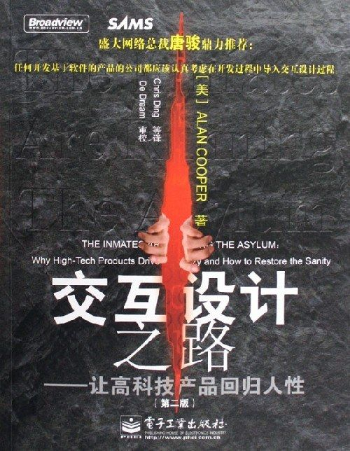

《禅与摩托车维修艺术》 豆瓣评分：8.3分

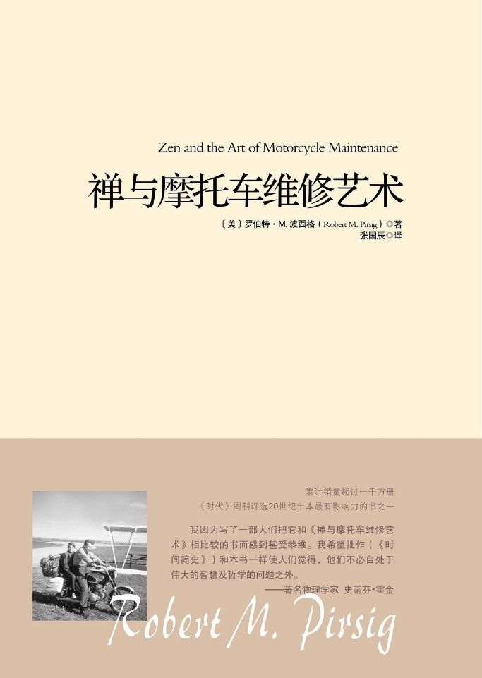

《企业应用架构模式》 豆瓣评分：8.3分

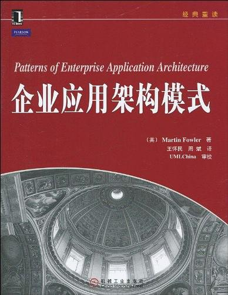

《极客与团队》豆瓣评分：8.3分

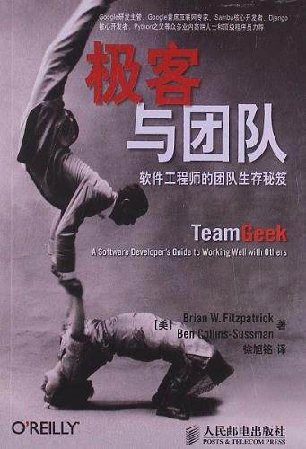

《敏捷转型：打造VUCA时代的高效能组织》 豆瓣评分：9.2分

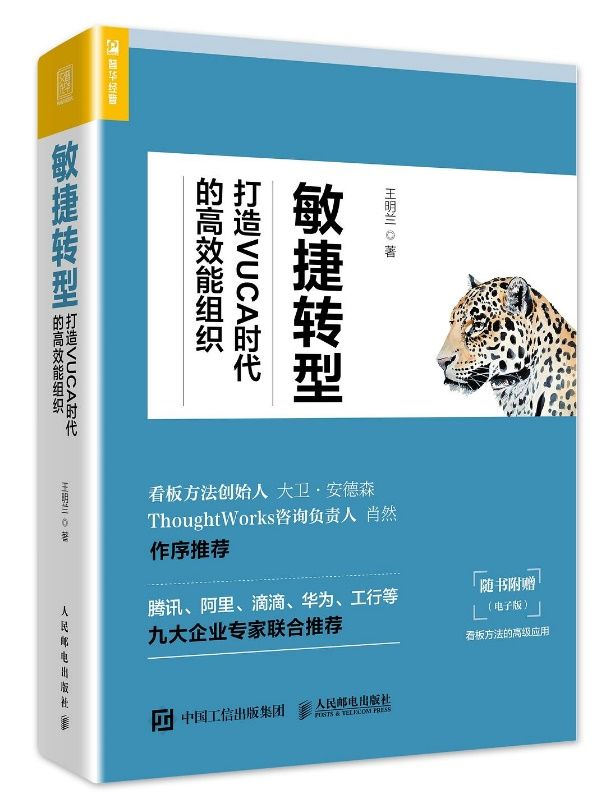

《成为技术领导者》 豆瓣评分：8.3分

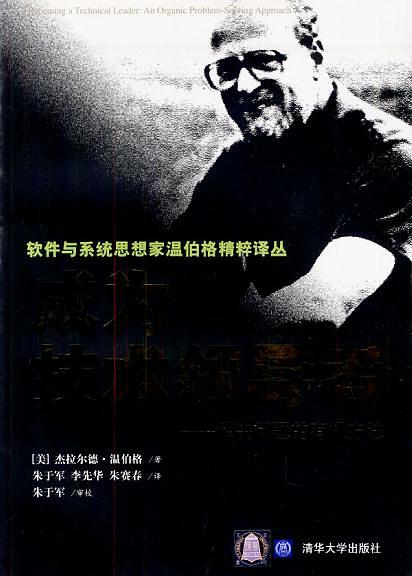

《人件》 豆瓣评分：8.2分

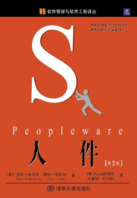

