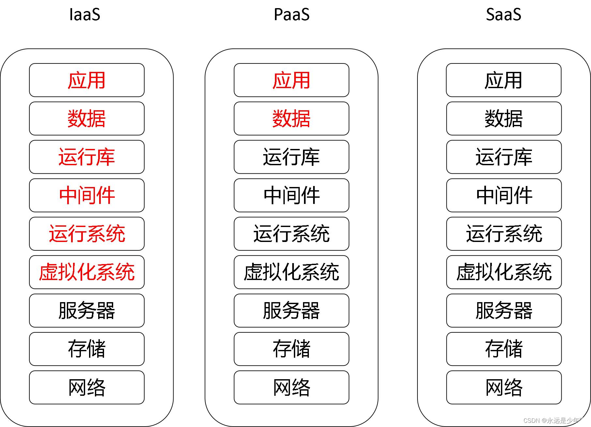

## Cloud Computing

云计算是分布式计算、并行计算和网格计算的发展，或者说是这些概念的商业实现。

云计算不但包括分布式计算还包括分布式存储和分布式缓存。分布式存储又包括分布式文件存储和分布式数据存储。

### 概述

云计算（Cloud computing）是继20世纪80年代由大型计算机向客户端/服务器（C/S）模式大转变后，信息技术的又一次革命性变化。2006年8月9日，Google首席执行官Eric Schmidt在搜索引擎大会（SES San Jose 2006）上首次提出云计算概念。云计算是网格计算，分布式计算，并行计算、效用技术、网络存储、虚拟化和负载均衡等传统计算机和网络技术发展融合的产物。其目的是通过基于网络的计算方式，将共享的软件/硬件资源和信息进行组织整合，按需提供给计算机和其他系统使用。

云计算是从集群技术发展而来，区别在于集群虽然把多台机器联了起来，但其某项具体任务执行的时候还是会被转发到某台服务器上，而云可以简单的认为是任务可以被分割成多个进程在多台服务器上并行计算，然后得到结果，好处在于大数据量的操作性能非常好。云可以使用廉价的PC服务器 ，可以管理大数据量与大集群，关键技术在于能够对云内的基础设施进行动态按需分配与管理。

云计算与并行计算、分布式计算的区别，以计算机用户来说，并行计算是由单个用户完成的，分布式计算是由多个用户合作完成的，云计算是没有用户参与，而是交给网络另一端的服务器完成的。

#### 并行计算（Parallel Computing）　　

并行计算或称平行计算是相对于串行计算来说的。并行计算是指同时使用多种计算资源解决计算问题的过程。为执行并行计算，计算资源应包括一台配有多处理机（并行处理）的计算机、一个与网络相连的计算机专有编号，或者两者结合使用。并行计算的主要目的是快速解决大型且复杂的计算问题。

并行计算可以划分成时间并行和空间并行。时间并行即流水线技术，空间并行使用多个处理器执行并发计算，当前研究的主要是空间的并行问题。以程序和算法设计人员的角度看，并行计算又可分为数据并行和任务并行。数据并行把大的任务化解成若干个相同的子任务，处理起来比任务并行简单。

空间上的并行导致两类并行机的产生，按照Michael Flynn（费林分类法）的说法分为单指令流多数据流（SIMD）和多指令流多数据流（MIMD），而常用的串行机也称为单指令流单数据流（SISD）。MIMD类的机器又可分为常见的五类：并行向量处理机（PVP）、对称多处理机（SMP）、大规模并行处理机（MPP）、工作站机群（COW）、分布式共享存储处理机（DSM）。

#### 分布式计算（Distributed Computing）

分布式计算这个研究领域，主要研究分散系统（Distributed system）如何进行计算。分散系统是一组计算机，通过计算机网络相互链接与通信后形成的系统。把需要进行大量计算的工程数据分区成小块，由多台计算机分别计算，在上传运算结果后，将结果统一合并得出数据结论的科学。

目前常见的分布式计算项目通常使用世界各地上千万志愿者计算机的闲置计算能力，通过互联网进行数据传输。如分析计算蛋白质的内部结构和相关药物的Folding@home项目，该项目结构庞大，需要惊人的计算量，由一台电脑计算是不可能完成的。即使现在有了计算能力超强的超级电脑，但是一些科研机构的经费却又十分有限。

分布式计算比起其它算法具有以下几个优点： 

1. 稀有资源可以共享。
2. 通过分布式计算可以在多台计算机上平衡计算负载。
3. 可以把程序放在最适合运行它的计算机上。其中，共享稀有资源和平衡负载是计算机分布式计算的核心思想之一。

 

#### 并行计算与分布式计算的区别

简单的理解，引用Answers.com上一个答案：

Parallel computing and distributed computing are ways of exploiting parallelism in computing to achieve higher performance. Multiple processing elements are used to solve a problem, either to have it done faster or to have a larger size problem been solved. To state simply, if the processing elements share the memory, it is called parallel computing, otherwise it is called distributed computing. Some have opinion that distributed computing is a special form of parallel computing.

并行计算与分布式计算都是运用并行来获得更高性能，化大任务为小任务。简单说来，如果处理单元共享内存，就称为并行计算，反之就是分布式计算。也有人认为分布式计算是并行计算的一种特例。

但是分布式的任务包互相之间有独立性，上一个任务包的结果未返回或者是结果处理错误，对下一个任务包的处理几乎没有什么影响。因此，分布式的实时性要求不高，而且允许存在计算错误（因为每个计算任务给好几个参与者计算，上传结果到服务器后要比较结果，然后对结果差异大的进行验证。

分布式要处理的问题一般是基于“寻找”模式的。所谓的“寻找”，就相当于穷举法！为了尝试到每一个可能存在的结果，一般从0～N（ 某一数值）被一个一个的测试，直到我们找到所要求的结果。事实上，为了易于一次性探测到正确的结果，我们假设结果是以某个特殊形式开始的。在这种类型的搜索里，我们也许幸运的一开始就找到答案；也许不够走运以至于到最后才找到答案，这都很公平。

这么说，并行程序并行处理的任务包之间有很大的联系，而且并行计算的每一个任务块都是必要的，没有浪费的分割的，就是每个任务包都要处理，而且计算结果相互影响，就要求每个的计算结果要绝对正确，而且在时间上要尽量做到同步，而分布式的很多任务块可以根本就不处理，有大量的无用数据块，所以说分布式计算的速度尽管很快，但是真正的“效率”是低之再低 的，可能一直在寻找，但是永远都找不到，也可能一开始就找到了；而并行处理不同，它的任务包个数相对有限，在一个有限的时间应该是可能完成的。

分布式的编写一般用的是C++（也有用JAVA的，但是都不是主流），基本不用MPI接口。并行计算用MPI或者OpenMP。

#### 集群计算(Cluster Computing)

计算机集群将一组松散集成的计算机软件或硬件连接起来高度紧密地协作完成计算工作。在某种意义上，他们可以被看作是一台计算机。集群系统中的单个计算机通常称为节点，通常通过局域网连接，但也有其它的可能连接方式。集群计算机通常用来改进单个计算机的计算速度和/或可靠性。一般情况下集群计算机比单个计算机，比如工作站或超级计算机性价比要高得多。

根据组成集群系统的计算机之间体系结构是否相同，集群可分为同构与异构两种。集群计算机按功能和结构可以分为，高可用性集群（High-availability (HA) clusters）、负载均衡集群（Loadbalancing clusters）、高性能计算集群（High-performance (HPC)clusters）、网格计算（Grid computing）。

高可用性集群，一般是指当集群中有某个节点失效的情况下，其上的任务会自动转移到其他正常的节点上。还指可以将集群中的某节点进行离线维护再上线，该过程并不影响整个集群的运行。

负载均衡集群，负载均衡集群运行时，一般通过一个或者多个前端负载均衡器，将工作负载分发到后端的一组服务器上，从而达到整个系统的高性能和高可用性。这样的计算机集群有时也被称为服务器群（Server Farm）。一般高可用性集群和负载均衡集群会使用类似的技术，或同时具有高可用性与负载均衡的特点。Linux虚拟服务器（LVS）项目在Linux操作系统上提供了最常用的负载均衡软件。

高性能计算集群，高性能计算集群采用将计算任务分配到集群的不同计算节点儿提高计算能力，因而主要应用在科学计算领域。比较流行的HPC采用Linux操作系统和其它一些免费软件来完成并行运算。这一集群配置通常被称为Beowulf集群。这类集群通常运行特定的程序以发挥HPC cluster的并行能力。这类程序一般应用特定的运行库, 比如专为科学计算设计的MPI库。HPC集群特别适合于在计算中各计算节点之间发生大量数据通讯的计算作业，比如一个节点的中间结果或影响到其它节点计算结果的情况。

#### 网格计算（Grid Computing）

网格计算是分布式计算的一种，也是一种与集群计算非常相关的技术。如果我们说某项工作是分布式的，那么，参与这项工作的一定不只是一台计算机，而是一个计算机网络，显然这种“蚂蚁搬山”的方式将具有很强的数据处理能力。网格计算的实质就是组合与共享资源并确保系统安全。

网格计算通过利用大量异构计算机的未用资源（CPU周 期和磁盘存储），将其作为嵌入在分布式电信基础设施中的一个虚拟的计算机集群，为解决大规模的计算问题提供一个模型。网格计算的焦点放在支持跨管理域计算 的能力，这使它与传统的计算机集群或传统的分布式计算相区别。网格计算的目标是解决对于任何单一的超级计算机来说仍然大得难以解决的问题，并同时保持解决 多个较小的问题的灵活性。这样，网格计算就提供了一个多用户环境。

#### 集群计算与网格计算的区别

1. 简单地，网格与传统集群的主要差别是网格是连接一组相关并不信任的计算机，它的运作更像一个计算公共设施而不是一个独立的计算机。网格通常比集群支持更多不同类型的计算机集合。
2. 网格本质上就是动态的，集群包含的处理器和资源的数量通常都是静态的。在网格上，资源则可以动态出现，资源可以根据需要添加到网格中或从网格中删除。
3. 网格天生就是在本地网、城域网或广域网上进行分布的。网格可以分布在任何地方。而集群物理上都包含在一个位置的相同地方，通常只是局域网互连。集群互连技 术可以产生非常低的网络延时，如果集群距离很远，这可能会导致产生很多问题。物理临近和网络延时限制了集群地域分布的能力，而网格由于动态特性，可以提供 很好的高可扩展性。
4. 集群仅仅通过增加服务器满足增长的需求。然而，集群的服务器数量、以及由此导致的集群性能是有限的：互连网络容量。也就是说如果一味地想通过扩大规模来提高集群计算机的性能，它的性价比会相应下降，这意味着我们不可能无限制地扩大集群的规模。 而网格虚拟出空前的超级计算机，不受规模的限制，成为下一代Internet的发展方向。
5. 集群和网格计算是相互补充的。很多网格都在自己管理的资源中采用了集群。实际上，网格用户可能并不清楚他的工作负载是在一个远程的集群上执行的。尽管网格与集群之间存在很多区别，但是这些区别使它们构成了一个非常重要的关系，因为集群在网格中总有一席之地—— 特定的问题通常都需要一些紧耦合的处理器来解决。然而，随着网络功能和带宽的发展，以前采用集群计算很难解决的问题现在可以使用网格计算技术解决了。理解网格固有的可扩展性和集群提供的紧耦合互连机制所带来的性能优势之间的平衡是非常重要的。

### 云计算架构

比较公认的云架构是划分为基础设施层（IaaS）、平台层（PaaS）和软件服务层（SaaS）三个层次的。

#### IaaS

Infrastructure-as-a-Service（基础设施即服务）：硬件资源服务（cpu，内存，存储，网络等等）。

这层作用是为给其它中间件层或者用户准备其所需的计算和存储等资源，如如服务器、网络设备、存储设备等，将这些物理设备，通过虚拟化层采用相应技术形成动态资源池，主要有四种技术：

1. 虚拟化：也可以理解它为基础设施层的“多租户”，因为通过虚拟化技术，能够在一个物理服务器上生成多个虚拟机，并且能在这些虚拟机之间能实现全面的隔离，这样不仅能减低服务器的购置成本，而且还能同时降低服务器的运维成本，成熟的X86虚拟化技术有 VMware的ESX和开源的Xen。
2. 分布式存储：为了承载海量的数据，同时也要保证这些数据的可管理性，所以需要一整套分布式的存储系统。
3. 关系型数据库：基本是在原有的关系型数据库的基础上做了扩展和管理等方面的优化，使其在云中更适应。
4. NoSQL：为了满足一些关系数据库所无法满足的目标，比如支撑海量的数据等，一些公司特地设计一批不是基于关系模型的数据库。

#### PaaS

Platform-as-a-Service（平台即服务）：组件服务（比如数据库，操作系统，redis等等）。

它把软件开发环境当做服务提供给用户，主要为应用程序开发者设计，面向广大互联网应用开发者，把分布式软件开发、测试、部署、运行环境以及复杂的应用程序托管当作服务，使得开发者可以从复杂低效的环境搭建、配置和维护工作中解放出来，将精力集中在软件编写上，从而大大提高软件开发的效率，平台层是整个云计算系统的核心层，包括并行程序设计和开发环境。这层是承上启下的，它在下面的基础设施层所提供资源的基础上提供了多种服务，比如缓存服务和REST服务等，而且这些服务即可用于支撑显示层，也可以直接让用户调用，并主要有五种技术：

1. REST：通过REST技术，能够非常方便和优雅地将中间件层所支撑的部分服务提供给调用者。
2. 多租户：就是能让一个单独的应用实例可以为多个组织服务，而且保持良好的隔离性和安全性，并且通过这种技术，能有效地降低应用的购置和维护成本。
3. 并行处理：为了处理海量的数据，需要利用庞大的X86集群进行规模巨大的并行处理，Google的MapReduce是这方面的代表之作。
4. 应用服务器：在原有的应用服务器的基础上为云计算做了一定程度的优化，比如用于Google App Engine的Jetty应用服务器。
5. 分布式缓存：通过分布式缓存技术，不仅能有效地降低对后台服务器的压力，而且还能加快相应的反应速度，最著名的分布式缓存例子莫过于Memcached。

#### SaaS

Software-as-a-Service（软件即服务）：应用层。

用户只需要支付一定的租赁费用，就可以通过互联网享受到相应的服务，而且整个系统的维护也由厂商负责，不必再购买软硬件、建设机房及配备维护人员。多数数据中心云计算架构的这层主要是用于以友好的方式展现用户所需的内容和服务体验，并会利用到下面中间件层提供的多种服务，主要有五种技术：

1、HTML：标准的Web页面技术，主要以HTML4为主，但是将要推出的HTML5会在很多方面推动Web页面的发展，比如视频[和本地存储等方面。
2、JavaScript：一种用于Web页面的动态语言，通过JavaScript，能够极大地丰富Web页面的功能，并且用以JavaScript为基础的AJAX创建更具交互性的动态页面。
3、CSS：主要用于控制Web页面的外观，而且能使页面的内容与其表现形式之间进行优雅地分离。
4、Flash：业界最常用的RIA(Rich Internet Applications)技术，能够在现阶段提供HTML等技术所无法提供的基于Web的富应用，而且在用户体验方面，非常不错。
5、Silverlight：来自业界巨擎微软的RIA技术，虽然其市场占有率稍逊于Flash，但由于其可以使用C#来进行编程，所以对开发者非常友好。

#### 云计算特点

1. 动态可扩展：云计算使用虚拟化技术，突破了应用底层架构与上层服务之间的联系，因此支持动态扩展集群。
2. 按需部署：借助虚拟化技术，云计算可以按照用户需求给用户提供不同的服务，提供不同级别的运算、存储、网络等资源。
3. 灵活性高：云计算集群通常兼容性比较好，可以支持大部分的硬件、操作系统。
4. 可靠性高：因为云计算服务的提供依靠的是服务器集群，因此避免了服务器单点故障。一台服务器一旦出现故障，那么该服务器上的应用可以在管理控制平台的操作下转移至其他的服务器，从而不会影响服务的正常提供。
5. 性价比高：云计算可以将运算、存储和网络等资源统一管理、统一分配、按需供给，用户只需要购买相应的服务即可，而不需要购买昂贵的大型服务器。

#### 公有云和私有云

区别是：

1. 公有云是互联网上发布的云计算服务，私有云是企业内部发布的云服务；
2. 公有云搭建云的资源在提供商的场所内，私有云搭建云平台所需的资源由企业自给。

区别分析如下：

1. 从云的建设地点划分，公有云——互联网上发布的云计算服务，搭建云的资源在提供商的场所内；私有云——企业内部（专网）发布的云服务，搭建云平台所需的资源由企业自给。
2. 从云服务的协议开发程度划分，公有云——协议开放的云计算服务，不需要专有的客户端软件解析。所有应用都是以服务的形式提供给用户的，而不是以软件包的形式提供。私有云——比如微软的“云端（云+端）”，最终用户需要有专用的软件。
3. 从服务对象划分，私有云——为“一个”客户单独使用而构建的，因而提供对数据、安全性和服务质量的最有效控制；该公司拥有基础设施，并可以控制在此基础设施上部署应用程序的方式；私有云可部署在企业数据中心的防火墙内，也可以将它们部署在一个安全的主机托管场所；私有云可由云提供商进行构建，通过托管模式，构筑一个公司企业数据中心内的专用云。而公有云——则是针对外部客户，通过网络方式提供可扩展的弹性服务。

1. 安全性能上，这是公有云部署无法逃开的短板，“公有”顾名思义就代表着开放和共享，极有可能与你的竞争对手共用着一台服务器。而私有云部署主打私有化的服务器和独立的IP、域名，可以完美避免着一问题。
2. 扩展功能上，两者都可以实现功能的扩展使用，但是私有云可以确保扩展的无风险化。
3. 定制功能上，私有云部署可以保证功能的灵活定制以及个性化服务的提供。企业自主性上，这个方面主要还是在于不同企业的不同需求，公有云会比较依赖于服务提供方，而私有云主要在于用户自身的控制，自主性较强。
4. 业务适配度上，公有云主要依靠系统平台本身所提供的配置要求来更改自己的业务运作模式，得以适配，而私有云强调系统自动适配用户的业务需求。后期运维上，两者的侧重点大有不同，公有云用户是无法实现自主运维的，需要依赖于服务提供商的定期维护更新，而私有云主要会为用户提供自主运营和托管的服务。
5. 成本投入上，公有云由于服务共享的原因，公有云服务商的定价通常处在一个相当低的水平，但是公有云所有的用户是共享底层的资源，如果处理不得当的话，不同的用户之间很有可能会出现资源争抢的情况，加重用户成本的不必要投入。私有云由于单独部署私人服务器，成本相对较高，但所投入成本具有固定性和可预测性。

在团队人数较少的情况下，公有云是具有一定价格优势的，按需付费。但是当团队人数超过一定规模时，私有云部署的性价比往往要高于公有云。从长远来看，两者之间的费用差距会逐渐缩小。

大多数服务商在公有云和私有云的数据迁移上较困难，且收费较高。

世界头号黑客凯文·米特尼克（Kevin Mitnick）说：“最擅长发现的漏洞不是技术问题，而是人性的弱点”。有数据说明，“人”是在整个网络安全体系中最薄弱的一个环节；这说明，数据的存储管理在企业内部并不意味着化解掉最大的风险部分，相反，由于大多数甲方的核心业务并不以IT系统服务为目标，往往在相关方面投入的人力资源不如专业乙方IT服务商；数据看似自己保管，却好像把钱存在自家保险柜，而不选择存在银行。

#### 混合云

混合云融合了公有云和私有云，是近年来云计算的主要模式和发展方向。私有云主要是面向企业用户，出于安全考虑，企业更愿意将数据存放在私有云中，但是同时又希望可以获得公有云的计算资源，在这种情况下混合云被越来越多的采用，它将公有云和私有云进行混合和匹配，以获得最佳的效果，这种个性化的解决方案，达到了既省钱又安全的目的。

虽然有很多的人呼吁使用混合云，因其可以利用私有云与公有的好处。但混合云也不是完全没有缺点的，它仍旧包含了一些安全障碍，要谨记下面五个问题：

1. 缺少数据冗余
>公有云提供商提供重要的资源，以确保其基础架构在终端用户需要时有效且可访问。尽管云提供商尽了最大努力，问题仍不可避免。
>
>大量宣传的宕机事件突出了将应用运转在单一数据中心且没有在其他数据中心进行故障恢复的风险。云架构师需要跨数据中心的冗余来减缓单一数据中心宕机的影响。缺少冗余对于混合云来说可能是严重的安全风险，尤其是如果数据冗余备份没有跨数据中心分布。在数据中心之间转移虚拟机(VM)实例比在大型数据集之间容易的多。
>
>云架构师可以使用一个厂商的多个数据中心实现冗余，或者多个公共云厂商或者是混合云。同时可以用混合云改善业务连续性，因为这并不是实现这个模型的原因。同时使用来自单一厂商的多个数据中心，你可以节省成本，达到减少类似风险的水平。

2. 法规遵从
>维护和证明混合云法规尊从更加困难。你不但要确保你的公有云提供商和私有云提供商符合法规，而且你必须证明两个云之间的协调是顺从的。
>
>比如，如果你的企业处理支付卡数据，你可能能够证明你的内部系统和你的云提供商遵从支付卡行业数据安全标准（PaymentCardIndustryDataSecurityStandard(PCIDSS)）。引入了混合云，你必须确保两个云之间的数据转移是受到保护的。
>
>此外，你还需要确保卡数据不会从一个私有云上的法规遵从数据中心转移到一个较少安全性的公有云存储系统。你内部系统使用的预防漏洞的方法可能不会直接转化到公有云上。

3. 拙劣构架的SLA
>你可能坚信你的公有云提供商能够始终如一的符合服务水平协议（SLA）中期望的详细说明，但是你的私有云是否有同样的SLA？如果没有，你可能需要基于两个云的期望创建SLA，很可能就是基于你自己的私有云了。
>
>在你的私有云的可用性和性能的显示工作负载下收集数据。集成公有云和私有云寻求潜在的问题都会破坏服务。例如，如果一个私有云的关键业务驱动在本地保持敏感和机密数据，然后你的SLA应该体现出在公有云中使用这些服务的限制性。

4. 风险管理
>从业务角度，信息安全是管理管理风险的。云计算（尤其是混合云）使用新的应用程序接口（API），要求复杂的网络配置，并对传统的系统管理员的知识和能力范围造成挑战。
>
>这些因素引入了新型的威胁。云计算并不比内部基础架构安全，但是混合云是个复杂的系统，管理员在管理上有限的经验，可能就造成了风险。

5. 安全管理
现有的安全控制，像身份认证、授权和身份认证管理需要在公有云和私有云中共同工作。整合这些安全协议，你只能选择其一：在两个云中复制控制并保持安全数据同步，或者使用身份认证管理服务，提供单一的服务运转在云端。在计划和时间阶段分配足够的时间，以便解决这些相当复杂的整合问题。

### Kubernetes

