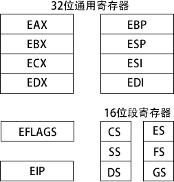
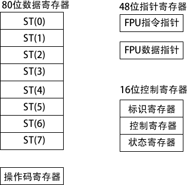
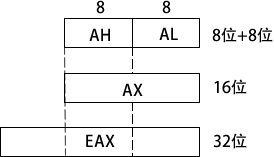
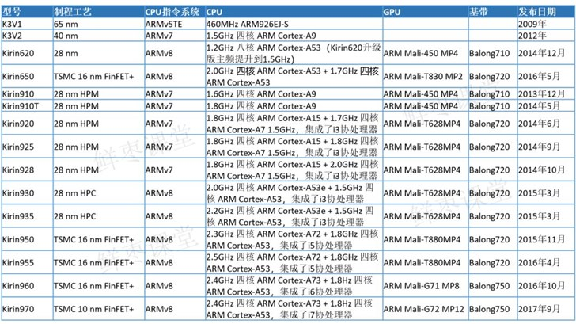

## 中央处理器

Central Processing Unit，CPU

### 概述

中央处理器（CPU）是执行指令的物理设备。CPU执行的指令通常非常简单。指令可能要求他们使用的数据存储在一个称为寄存器的特殊储存位置中。CPU可以比访问内存更快地访问寄存器里的数据。然而，在CPU里的寄存器是有限的，所以程序员必须注意只保存现在使用的数据到寄存器中。

各类CPU执行的指令组成了该CPU的机器语言。机器语言拥有比高级语言更基本的结构。机器语言指令被编码成未加工的数字，而不是友好的文本格式。为了更有效的运行，CPU必须能很快地解释一个指令的目的。机器语言就是为了这个目的设计的，而不是让人们更容易理解而设计。一个其他语言写的程序必须转换成CPU的本地机器语言，才能在电脑上运行。

编译器是一个将用用程序语言写的程序翻译成特殊结构的电脑的机器语言的程序。通常，每一种类型的CPU都有它自己唯一的机器语言。这是为什么为Mac写的程序不能在IBM类型PC机运行的一个原因。

电脑通过使用时钟来同步指令的执行。时钟脉冲在一个固定的频率（称为时钟频率）。当你买了一台1.5GHz的电脑，1.5GHz就是时钟频率。时钟并不记录分和秒。它以不变的速率简单跳动。电子计算机通过使用这个跳动来正确执行它们的操作，就像节拍器的跳动如何来帮助你以正确的节奏播放音乐。一个指令需要跳动的次数（或就像他们经常说的执行周期）依赖CPU的产生和模仿。周期的次数取决于它之前的指令和其他因素。

处理器包括一组寄存器，提供一定的存储能力。有两个功能：

1. 用户可见寄存器；
可以被应用程序、系统程序使用。

数据寄存器
地址寄存器
索引寄存器
段指针
栈指针

2. 控制和状态寄存器。

程序计数器
指令寄存器
条件码

指令的执行
处理器-存储器
处理器-i/o
数据处理
控制

主存储器
输入/输出模块
系统总线

进程 多线程 对称多处理smp 微内核

单一系统 并发机制 互斥和死锁

存储器管理技术 虚拟存储器

进程调度 线程调度 smp调度 实时调度

输入、输出和文件管理

分布式系统和安全

windows 多任务操作系统 个人计算机 工作站和服务器

unix 多用户操作系统 微机到超级计算机

#### CPU 80x86系列

IBM型号的PC机包含了一个来自Intel 80x86家族（或它的克隆）的CPU。在这个家族的所有CPU都有一些普遍的特征，包括有一种基本的机器语言。

8088，8086: 这些CPU从编程的观点来看是完全相同的。它们是用在早期PC机上的CPU。它们提供一些16位的寄存器：AX，BX，CX，DX，SI，DI，BP，SP，CS，DS，SS，ES，IP，FLAGS。它们仅仅支持1M字节的内存，而且只能工作在实模式下。在这种模式下，一个程序可以访问任何内存地址，甚至其它程序的内存！这会使排除故障和保证安全变得非常困难！而且，程序的内存需要分成段。每段不能大于64K。

80286: 这种CPU使用在AT系列的PC机中。它在8088/86的基本机器语言中加入了一些新的指令。然而，它主要的新的特征是16位保护模式。在这种模式下，它可以访问16M字节的内存和通过阻止访问其它程序的内存来保护程序。可是，程序依然是分成不能大于64K的段。

80386: 这种CPU极大地增强了80286的性能。首先，它扩展了许多寄存器来容纳32位数据（EAX，EBX，ECX，EDX，ESI，EDI，EBP，ESP，EIP）而且增加了两个新的16位寄存器（FS，GS）。它同样增加了一个新的32位保护模式。在这种模式下，它可以访问4G字节。程序同样分成段，但是现在每段大小同样可以到4G。

80486/Pentium/Pentium Pro: 这些80x86家族的成员增加了不多的新的特征。它们主要是提高了指令执行的速度。

Pentium MMX: 这些处理器在Pentium基础上增加了MMX指令（多媒体扩展）。这些指令可以提高普通的图像操作的速率。

Pentium II: 它是拥有MMX 指令的Pentium处理器。（Pentium III 本质上就是一个更快的Pentium II。）

##### 8086 16位寄存器

最初的8086CPU提供4个16位通用寄存器：AX，BX，CX和DX。这些寄存器都可以分解成两个8位寄存器。例如：AX寄存器可以分解成AH和AL寄存器。AH寄存器包含AX的上（或高）8位，而AL包含AX的低8位。通常AH和AL都当做独立的一个字节的寄存器来用；但是，清楚它们不能独立于AX是非常重要的。改变AX的值将会改变AH和AL的值，反之亦然。通用寄存器多数使用在数据移动和算术指令中。

还有两个16位指针寄存器：SI和DI。通常它们都是当作指针来使用，但是在许多情况下也可以像通用寄存器一样使用。但是，它们不可以分解成8位寄存器。

16位BP和SP寄存器用来指向机器语言堆栈里的数据，被各自称为基址寄存器和堆栈指针寄存器。

16位CS，DS，SS和ES寄存器是段寄存器。它们指出程序不同部分所使用的内存。CS代表代码段，DS代表数据段，SS代表堆栈段和ES代表附加段。ES当作一个暂时段寄存器来使用。

指令指针寄存器（IP）与CS寄存器一起使用来跟踪CPU下一条执行指令的地址。通常，当一条指令执行时，IP提前指向内存里的下一条指令。

FLAGS寄存器储存了前面指令执行结果的重要信息。这些结果在寄存器里以单个的位储存。例如：如果前面指令执行结果是0，Z位为1，反之为0。并不是所有指令都修改FLAGS里的位，查看附录里的表看单个指令是如何影响FLAGS寄存器的。

##### 80386 32位寄存器

80386及以后的处理器扩展了寄存器。例如：16位AX寄存器扩展成了32位。为了向后兼容，AX依然表示16位寄存器，而EAX用来表示扩展的32位寄存器。AX是EAX的低16位就像AL是AX（EAX）的低8位一样。但是没有直接访问EAX高16位的方法。其它的扩展寄存器是EBX，ECX，EDX，ESI和EDI。

许多其它类型的寄存器同样也扩展了。BP变成了EBP；SP变成了ESP；FLAGS变成了EFLAG、SEFLAGS；而IP变成了EIP。但是，不同于指针寄存器和通用寄存器，在32位保护模式下，只有这些寄存器的扩展形式被使用。

在80386里，段寄存器依然是16位的。有两个新的段寄存器：FS和GS。它们名字并不代表什么。它们是附加段寄存器（像ES一样）。术语中“字”的一个定义为CPU数据寄存器的大小。对于80x86家族，这个术语现在有一点混乱了。当8086第一次发行时它被定义成两个字节。当80386开发出来后，它被决定依旧保持这个“字”定义不改变，即使寄存器的大小已经改变了。

### 32位x86处理器架构

包括了 Intel IA-32 系列中的成员和所有 32 位 AMD 处理器。

#### 操作模式

x86 处理器有三个主要的操作模式：保护模式、实地址模式和系统管理模式；以及一个子模式：虚拟 8086（virtual-8086） 模式，这是保护模式的特殊情况。

1) 保护模式 (Protected Mode)
保护模式是处理器的原生状态，在这种模式下，所有的指令和特性都是可用的。分配给程序的独立内存区域被称为段，而处理器会阻止程序使用自身段范围之外的内存。

2) 虚拟 8086 模式 (Virtual-8086 Mode)
保护模式下，处理器可以在一个安全环境中，直接执行实地址模式软件，如 MS-DOS 程序。换句话说，如果一个程序崩溃了或是试图向系统内存区域写数据，都不会影响到同一时间内执行的其他程序。现代操作系统可以同时执行多个独立的虚拟 8086 会话。

3) 实地址模式 (Real-Address Mode)
实地址模式实现的是早期 Intel 处理器的编程环境，但是增加了一些其他的特性，如切换到其他模式的功能。当程序需要直接访问系统内存和硬件设备时，这种模式就很有用。

4) 系统管理模式 (System Management Mode)
系统管理模式 (SMM) 向操作系统提供了实现诸如电源管理和系统安全等功能的机制。这些功能通常是由计算机制造商实现的，他们为了一个特定的系统设置而定制处理器。

#### 基本执行环境

1) 地址空间
在 32 位保护模式下，一个任务或程序最大可以寻址 4GB 的线性地址空间。从 P6 处理器开始，一种被称为扩展物理寻址 (extended physical addressing) 的技术使得可以被寻址的物理内存空间增加到 64GB。

与之相反，实地址模式程序只能寻址 1MB 空间。如果处理器在保护模式下运行多个虚拟 8086 程序，则每个程序只能拥有自己的 1MB 内存空间。

2) 基本程序执行寄存器
寄存器是直接位于 CPU 内的高速存储位置，其设计访问速度远高于传统存储器。例如，当一个循环处理为了速度进行优化时，其循环计数会保留在寄存器中而不是变量中。

下图展示的是基本程序执行寄存器（basic program execution registers）。8 个通用寄存器，6 个段寄存器，一个处理器状态标志寄存器（EFLAGS），和一 个指令指针寄存器（EIP）。

3) MMX 寄存器
在实现高级多媒体和通信应用时，MMX 技术提高了 Intel 处理器的性能。8 个 64 位 MMX 寄存器支持称为 SIMD（单指令，多数据，Single-Instruction，Multiple-Data）的特殊指令。

顾名思义，MMX 指令对 MMX 寄存器中的数据值进行并行操作。虽然，它们看上去是独立的寄存器，但是 MMX 寄存器名实际上是浮点单元中使用的同样寄存器的别名。

4) XMM 寄存器
x86 结构还包括了 8 个 128 位 XMM 寄存器，它们被用于 SIMD 流扩展指令集。
浮点单元
浮点单元（FPU, floating-point unit）执行高速浮点算术运算。之前为了这个目的，需要一个独立的协处理器芯片。从 Intel486 处理器开始，FPU 已经集成到主处理器芯片上。

FPU 中有 8 个浮点数据寄存器，分别命名为 ST（0），ST（1），ST（2），ST（3），ST（4）， ST（5）， ST （6）和 ST（7）。其他控制寄存器和指针寄存器如下图所示。

#### 通用寄存器
通用寄存器主要用于算术运算和数据传输。如下图所示，EAX 寄存器的低 16 位在使用时可以用 AX 表示。

一些寄存器的组成部分可以处理 8 位的值。例如，AX 寄存器的高 8 位被称为 AH，而低 8 位被称为 AL。同样的重叠关系也存在于 EAX、EBX、ECX 和 EDX 寄存器中：

32 位|16 位|8 位（高）|8 位（低）
---|---|---|---
EAX|AX|AH|AL
EBX|BX|BH|BL
ECX|CX|CH|CL
EDX|DX|DH|DL

其他通用寄存器只能用 32 位或 16 位名称来访问，如下表所示：

32 位|16 位
---|---
ESI|SI
EDI|DI
EBP|BP
ESP|SP

##### 特殊用法
某些通用寄存器有特殊用法：
- 乘除指令默认使用EAX。它常常被称为扩展累加器（extended accumulator）寄存器。
- CPU 默认使用 ECX 为循环计数器。
- ESP 用于寻址堆栈（一种系统内存结构）数据。它极少用于一般算术运算和数据传输，通常被称为扩展堆栈指针（extended stack pointer）寄存器。
- ESI 和 EDI 用于高速存储器传输指令，有时也被称为扩展源变址（extended source index）寄存器和扩展目的变址（extended destination index）寄存器。
- 高级语言通过 EBP 来引用堆栈中的函数参数和局部变量。除了高级编程，它不用于一般算术运算和数据传输。它常常被称为扩展帧指针（extended frame pointer）寄存器。

#### 段寄存器
实地址模式中，16 位段寄存器表示的是预先分配的内存区域的基址，这个内存区域称为段。保护模式中，段寄存器中存放的是段描述符表指针。一些段中存放程序指令（代码），其他段存放变量（数据），还有一个堆栈段存放的是局部函数变量和函数参数。

##### 指令指针
指令指针（EIP）寄存器中包含下一条将要执行指令的地址。某些机器指令能控制 EIP，使得程序分支转向到一个新位置。

#### EFLAGS 寄存器
EFLAGS （或 Flags）寄存器包含了独立的二进制位，用于控制 CPU 的操作，或是反映一些 CPU 操作的结果。有些指令可以测试和控制这些单独的处理器标志位。

设置标志位时，该标识位 =1；清除（或重置）标识位时，该标志位 =0。

##### 控制标志位

控制标志位控制 CPU 的操作。例如，它们能使得 CPU 每执行一条指令后进入中断；在侦测到算术运算溢出时中断执行；进入虚拟 8086 模式，以及进入保护模式。

程序能够通过设置 EFLAGS 寄存器中的单独位来控制 CPU 的操作，比如，方向标志位和中断标志位。

##### 状态标志位

状态标志位反映了 CPU 执行的算术和逻辑操作的结果。其中包括：溢出位、符号位、零标志位、辅助进位标志位、奇偶校验位和进位标志位。

下述说明中，标志位的缩写紧跟在标志位名称之后：
- 进位标志位（CF），与目标位置相比，无符号算术运算结果太大时，设置该标志位。
- 溢出标志位（OF），与目标位置相比，有符号算术运算结果太大或太小时，设置该标志位。
- 符号标志位（SF），算术或逻辑操作产生负结果时，设置该标志位。
- 零标志位（ZF），算术或逻辑操作产生的结果为零时，设置该标志位。
- 辅助进位标志位（AC），算术操作在 8 位操作数中产生了位 3 向位 4 的进位时，设置该标志位。
- 奇偶校验标志位（PF），结果的最低有效字节包含偶数个 1 时，设置该标志位，否则，清除该标志位。一般情况下，如果数据有可能被修改或损坏时，该标志位用于进行错误检测。

#### x86 内存管理

x86 处理器按照前面讨论的基本操作模式来管理内存。保护模式是最可靠、最强大的，但是它对应用程序直接访问系统硬件有着严格的限制。

在实地址模式中，只能寻址 1MB 内存，地址从 00000H 到 FFFFFH。处理器一次只能运行一个程序，但是可以暂时中断程序来处理来自外围设备的请求（称为中断（interrupt））。

应用程序被允许访问内存的任何位置，包括那些直接与系统硬件相关的地址。MS-DOS 操作系统在实地址模式下运行，Windows 95 和 98 能够引导进入这种模式。

在保护模式中，处理器可以同时运行多个程序，它为每个进程（运行中的程序）分配总共 4GB 的内存。每个程序都分配有自己的保留内存区域，程序之间禁止意外访问其他程序的代码和数据。MS-Windows 和 Linux 运行在保护模式下。

在虚拟 8086 模式中，计算机运行在保护模式下，通过创建一个带有 1MB 地址空间的虚拟 8086 机器来模拟运行于实地址模式的 80x86 计算机。例如，在 Windows NT 和 2000 下，当打开一个命令窗口时，就创建了一个虚拟 8086 机器。同一时间可以运行多个这样的窗口，并且窗口之间都是受到保护的。

在 Windows NT，2000 和 XP 系统中，某些需要直接使用计算机硬件的 MS-DOS 程序不能运行在虚拟 8086 模式下。

### 64位x86-64处理器架构

包括 Intel 64 和 AMD64 处理器系列。

指令集是 x86 指令集的 64 位扩展。以下为一些基本特征：
1) 向后兼容 x86 指令集。
2) 地址长度为 64 位，虚拟地址空间为 2 64 字节。按照当前芯片的实现情况，只能使用地址的低 48 位。
3) 可以使用 64 位通用寄存器，允许指令具有 64 位整数操作数。
4) 比 x86 多了 8 个通用寄存器。
5) 物理地址为 48 位，支持高达 256TB 的 RAM。

另一方面，当处理器运行于本机 64 位模式时，是不支持 16 位实模式或虚拟 8086 模式的。（在传统模式（legacy mode）下，还是支持 16 位编程，但是在 Microsoft Windows 64 位版本中不可用。）

注意尽管 x86-64 指的是指令集，但是也可以将其看作是处理器类型。学习汇编语言时，没有必要考虑支持 x86-64 的处理器之间的硬件实现差异。

第一个使用 x86-64 的 Intel 处理器是 Xeon，之后还有许多其他的处理器，包括 Core i5 和 Core i7。AMD 处理器中使用 x86-64 的例子有 Opteron 和 Athlon 64。

另一个为人所知的 64 位 Intel 架构是 IA-64，后来被称为 Itanium。 IA-64 指令集与 x86 和 x86-64 完全不同，Itanium 处理器通常用于高性能数据库和网络服务器。

#### 64 位操作模式

Intel 64 架构引入了一个新模式，称为 IA-32e。从技术上看，这个模式包含两个子模式：兼容模式（compatibility mode）和 64 位模式（64-bit mode）。不过它们常常被看做是模式而不是子模式，因此，先来了解这两个模式。

1) 兼容模式
在兼容模式下，现有的 16 位与 32 位应用程序通常不用进行重新编译就可以运行。但是，16 位 Windows（Win16）和 DOS 应用程序不能运行在 64 位 Microsoft Windows 下。

与早期 Windows 版本不同，64 位 Windows 没有虚拟 DOS 机器子系统来利用处理器的功能切换到虚拟 8086 模式。

2) 64 位模式
在 64 位模式下，处理器执行的是使用 64 位线性地址空间的应用程序。这是 64 位 Microsoft Windows 的原生模式，该模式能使用 64 位指令操作数。

#### 基本 64 位执行环境

64 位模式下，虽然处理器现在只能支持 48 位的地址，但是理论上，地址最大为 64 位。从寄存器来看，64 位模式与 32 位最主要的区别如下所示：
- 16 个 64 位通用寄存器（32 位模式只有 8 个通用寄存器）
- 8 个 80 位浮点寄存器
- 1 个 64 位状态标志寄存器 RFLAGS （只使用低 32 位）
- 1 个 64 位指令指针寄存器 RIP

32 位标志寄存器和指令指针寄存器分别称为 EFLAGS 和 EIP。此外，还有一些 x86 处理器用于多媒体处理的特殊寄存器：
- 8 个 64 位 MMX 寄存器
- 16 个 128 位 XMM 寄存器（32 位模式只有 8 个 XMM 寄存器）

#### 通用寄存器

类似32 位处理器的通用寄存器，它们是算术运算、数据传输和循环遍历数据指令的基本操作数。通用寄存器可以访问 8 位、16 位、32 位或 64 位操作数（需使用特殊前缀）。

64 位模式下，操作数的默认大小是 32 位，并且有 8 个通用寄存器。但是，给每条指令加上 REX（寄存器扩展）前缀后，操作数可以达到 64 位，可用通用寄存器的数量也增加到 16 个：32 位模式下的寄存器，再加上 8 个有标号的寄存器，R8 到 R15。下表给出了 REX 前缀下可用的寄存器。

操作数大小|可用寄存器
---|---
8 位|AL、BL、CL、DL、DIL、SIL、BPL、SPL、R8L、R9L、R10L、R11L、R12L、R13L、R14L、R15L
16 位|AX、BX、CX、DX、DI、SI、BP、SP、R8W、R9W、R10W、R11W、R12W、R13W、R14W、R15W
32 位|EAX、EBX、ECX、EDX、EDI、ESI、EBP、ESP、R8D、R9D、R10D、R11D、R12D、R13D、R14D、R15D
64 位|RAX、RBX、RCX、RDX、RDI、RSI、RBP、RSP、R8、R9、R10、R11、R12、R13、R14、R15

还有一些需要记住的细节：
- 64 位模式下，单条指令不能同时访问寄存器高字节，如 AH、BH、CH 和 DH，以及新字节寄存器的低字节（如 DIL）。
- 64 位模式下，32 位 EFLAGS 寄存器由 64 位 RFLAGS 寄存器取代。这两个寄存器共享低 32 位，而 RFLAGS 的高 32 位是不使用的。
- 32 位模式和 64 位模式具有相同的状态标志。

### 多核处理器

仅仅提高单核芯片的速度会产生过多热量且无法带来相应的性能改善。即便是没有热量问题，其性价比也令人难以接受，速度稍快的处理器价格要高很多。

1971年，英特尔推出的全球第一颗通用型微处理器4004，由2300个晶体管构成。“摩尔定律”——每过18个月，芯片上可以集成的晶体管数目将增加一倍。

CPU主频的提高，或许在一定程度上也要归功于1975年进入这个领域的AMD公司的挑战。到了2005年，当主频接近4GHz时，英特尔和AMD发现，速度也会遇到自己的极限：那就是单纯的主频提升，已经无法明显提升系统整体性能。

2005年4月，英特尔仓促推出简单封装双核的奔腾D和奔腾四至尊版840。AMD在之后也发布了双核皓龙（Opteron）和速龙（Athlon）64 X2和处理器。但真正的“双核元年”，则被认为是2006年。这一年的7月23日，英特尔基于酷睿（Core）架构的处理器正式发布。2006年11月，又推出面向服务器、工作站和高端个人电脑的至强（Xeon）5300和酷睿双核和四核至尊版系列处理器。

#### 云计算

并行计算技术是云计算的核心技术，也是最具挑战性的技术之一。多核处理器的出现增加了并行的层次性能使得并行程序的开发比以往更难。而当前业内并无有效的并行计算解决方案，无论是编程模型、开发语言还是开发工具，距离开发者的期望都有很大的差距。

核结构研究 同构还是异构

程序执行模型

多级Cache设计与一致性问题

核间通信技术

总线设计

操作系统设计

任务调度、中断处理、同步互斥

低功耗设计

存储器墙

可靠性及安全性设计

### 工作模式

#### 实模式

在实模式下，内存被限制为仅有1M字节（2^20字节）。有效的地址从00000到FFFFF（十六进制）。这些地址需要用20位的数来表示。显然，一个20位的数不适合任何一个8086的16位寄存器。Intel通过利用两个16位数值来决定一个地址的方法来解决这个问题。开始的16位值称为段地址（selector）。段地址的值存储在段寄存器中。第二个16位值称为偏移地址（offset）。偏移地址表示的物理地址可以由公式计算：`16 * selector + offset`。

实际上，段地址的值是一节的首地址。真实的段地址有以下的缺点：

1. 一个段地址只能指向64K内存（16位偏移的上限）。如果一个程序拥有大于64K的代码那又怎么办呢？在CS里的一个单一的值不能满足整个程序执行的需要。程序必须分成小于64K的段（segment）。当执行从一段移到另一段时，CS里的值必须改变。同样的问题发生在大量的数据和DS寄存器之间。这样使用是非常不方便的！
2. 每个字节在内存里并不只有唯一的段地址。物理地址04808可以表示为：047C:0048，047D:0038，047E:0028或047B:0058。这将使段地址的比较变得复杂。

#### 16位保护模式

在80286的16位保护模式下，段地址的值与实模式相比解释得完全不同。在实模式下，一个段地址的值是物理内存里的一节的首地址。在保护模式下，一个段地址的值是一个指向描述符表的指针。两种模式下，程序都是被分成段。在实模式下，这些段在物理内存的固定位置而且段地址的值表示段开始处所在节的首地址。在保护模式下，这些段不是在物理内存的固定的地址。事实上，它们根本不一定需要在内存中。

保护模式使用了一种叫做虚拟内存的技术。虚拟内存的基本思想是仅仅保存程序现在正在使用的代码和数据到内存中。其它数据和代码暂时储存在硬盘中直到它们再次需要时。当一段从硬盘重新回到内存中，它很有可能放在不同于它移动到硬盘之前时的位置的内存中。所有这些都由操作系统透明地执行。程序并不需要因为要让虚拟内存工作而使用不同的书写方法。

在保护模式下，每一段都分配了一条描述符表里的条目。这个条目拥有系统想知道的关于这段的所有信息。这些信息包括：现在是否在内存中；如果在内存中，在哪；访问权限(例如： 只读)。段的条目的指针是储存在段寄存器里的段地址值。

16位保护模式的一个大的缺点是偏移地址依然是16位数。这个的后果就是段的大小依然限制为最大64K。这会导致使用大的数组时会有问题。

#### 32位保护模式

80386引入了32位保护模式。386 32位保护模式和286 16位保护模式之间最主要的区别是：
1. 偏移地址扩展成了32位。这就允许偏移地址范围升至4G。因此，段的大小也升至4G。
2. 段可以分成较小的4K大小的单元，称为内存页。虚拟内存系统工作在页的方式下，代替了段方式。这就意味着一段在任何一个时刻只有部分可能在内存中。在28616位保护模式下，要么整个段在内存中，要么整个不在。这样在32位模式下允许的大的段的情况下很不实用。

在Windows 3.x系统中，标准模式为286 16位保护模式而增强模式为32位保护模式。Windows 9X，Windows NT/2000/XP，OS/2和Linux都运行在分页管理的32位保护模式下。

#### 中断

有时候普通的程序流必须可以被要求快速反应的处理事件中断。电脑提供了一个称为中断的结构来处理这些事件。例如：当一个鼠标移动了，硬件鼠标中断现在的程序来处理鼠标移动(移动鼠标，等等)。中断导致控制权转移到一个中断处理程序。中断处理程序是处理中断的程序。每种类型的中断都分配了一个中断号。在物理内存的开始处，存在一张包含中断处理程序段地址的中断向量表。中断号是这张表中最基本的指针。

外部中断由CPU的外部引起。(鼠标就是这一类型的例子。)许多I/O设备引起中断(例如：键盘，时钟，硬盘驱动器，CD-ROM和声卡)。内部中断由CPU的内部引起，要么是由一个错误引起，要么由中断指令引起。错误中断称为陷阱。由中断指令引起的中断称为软中断。DOS使用这些类型的中断来实现它的API(应用程序接口)。许多现代的操作系统(如：Windows和UNIX)使用一个基于C的接口。

许多中断处理程序当它执行完成时，将控制权返回给被中断的程序。它们恢复寄存器，里面的值与中断发生之前的值相同。因此，被中断的程序就像没有任何事情发生一样运行(除了它失去了一些CPU周期)。陷阱通常不返回。通常它们中止程序。

### 厂商

#### 高通

高通（Qualcomm）公司是一个位于美国加州圣地亚哥的无线电通信技术研发公司，由加州大学圣地亚哥分校教授厄文·马克·雅各布和安德鲁·维特比创建，于1985年成立。

目前，高通是持有高级3G移动网络技术专利权最多的公司，这其中包括{CDMA1X、CDMA2000【Ev-DO（Rev.A、Rev.B）】｝及其派生技术；WCDMA、HSPA（WCDMA的高速版）及其派生技术；TD-SCDMA以及部分4G技术专利。

现在使用的UMTS技术的空中接口的主体是基于高通的专利，这为高通带来了可观的专利费。同时带来了一系列关于专利的法律诉讼和反垄断申诉。

2005年由移动设备制造商爱立信、诺基亚、NEC、松下和德州仪器向欧盟委员会提起反垄断投诉，2007年，欧盟委员会开始就高通是否滥用其在3G网络市场的优势地位展开调查。

2008年，诺基亚宣布一次性支付22.9亿美元与高通达成部分专利认可。

虽然中国声称其3G技术TD-SCDMA在开发上极大的避免了高通的专利，但是高通认为该标准依然侵犯了高通许多专利。

2005年7月，美国博通公司对高通发起反垄断诉讼，最终达成和解，高通向博通赔付8.91亿美元。

2007年1月，韩国对高通进行反垄断调查，2010年1月，韩国政府对高通处以2.08亿美元的罚款，但高通向首尔法院提起诉讼，最终只能维持原判。2013年，高通向韩国最高法院提起上诉，目前仍在审理中。

2007年10月，欧盟委员会根据诺基亚等六家公司举报对高通进行了反垄断调查，2009年以和解宣布停止调查。

2013年11月，中国国家发展改革委员会启动对高通的反垄断调查。2015年2月10日，发改委公布了对高通公司反垄断调查和处罚的结果，处2013年度中国市场销售额8%的罚款，折合9.75亿美元，创下《中华人民共和国反垄断法》实施以来的单笔罚款最高纪录。对上述结果，高通表示接受，既不申请行政复议，也不提起行政诉讼。

2015年2月，”中华民国行政院“公平交易委员会（公平会）立案对高通展开调查。2017年10月11日，公平会宣布因高通公司违反《公平交易法》第9条第1款规定，将重罚新台币234亿元，是公平会于1991年成立后对单一公司的最高罚锾。但在2018年8月10日，公平会宣布基于公共利益，高通案已于智能财产法院合议庭达成诉讼上和解，罚金降为高通已缴纳的新台币27.3亿元，其余200多亿元罚款免缴，改以5年期的方案与台湾相关产业在5G的合作。

2015年7月，欧盟委员会对高通重启反垄断调查。2018年1月24日，欧盟决定对高通处以9.97亿欧元的罚款，高通宣布将对此判决结果立即提起上诉。

##### 高通骁龙

Qualcomm Snapdragon

第一款Snapdragon产品为2007年11月发表的QSD8250，采用基于自有架构Scorpion，同时也是第一款时脉达到1GHz的移动设备处理器。

2011年高通发表了第二代自有处理器架构Krait，并公布旗下处理器新的命名分类规则，将处理器等级由低至高分为S1、S2、S3、S4，其中S4再被细分为Play、Plus、Pro、Prime四个等级，并在S4将制程推至28nm(除了Play)。

2013年高通发表新一代处理器Snapdragon 600、800，采用Krait 400架构，同时公布新的命名规则，将处理器分类为Snapdragon 200、400、600、700、800，通常缩写为S200、S400、S600、S800。

2014年4月高通公布了旗下第一款64位架构处理器Snapdragon 810、808，不同于以往Snapdragon处理器，S810以及S808采用ARM标准架构，S810采用4+4核心的A57+A53架构，S808则采用2+4核心的A57+A53架构。

2015年9月高通回归自主架构，发表新的Kryo架构设计以及新一代旗舰处理器平台S820。

Scorpion架构由高通基于ARMv7指令集自行修改设计；第二代自有处理器架构Krait，同样基于ARMv7指令集修改；Kryo为高通基于ARMv8指令集修改的全新架构，延续Krait设计理念。

MSM型号产品均具备2G、3G通信模块，自S4平台之后，旗下产品大多皆集成Wi-Fi、GPS/GLONASS和Bluetooth连线能力。

- Snapdragon S1、S2、S3、S4
- Snapdragon 200 系列
- Snapdragon 400 系列

- Snapdragon 600 系列
	+ 600
	+ 602A
	+ 610/615/616/617
	硬件支持 HEVC/H.265 解码
	+ 625/626/630/632/636
	支持Quick Charge 3.0
	+ 650/652/653/660/662/665
	+ 670/675
	+ 690
	8nm LPP
	2 + 6 cores (2.0GHz Kryo560 Gold – Cortex-A77 derivative + 1.7GHz Kryo560 Silver – Cortex-A55 derivative)

- Snapdragon 700 系列
	+ 710/712/720G/730/730G
	+ 765/765G/768G
	1 + 1 + 6 cores (2.3 GHz Kryo 475 Prime – Cortex-A76 derivative + 2.2 GHz Kryo 475 Gold(625MHz) – Cortex-A76 derivative + 1.8 GHz Kryo 475 Silver – Cortex-A55 derivative)

- Snapdragon 800 系列
	+ 800/801
	支持 eMMC 5.0
	4KB + 4KB L0 缓存, 16KB + 16KB L1 缓存, 2MB L2 缓存
	4K × 2K UHD 视频拍摄、回放
	相机最高支持2100万像素，双ISP
	支持 USB 2.0、3.0
	VP8 编码/解码
	Quick Charge 2.0

	+ 805
	相机最高支持5500万像素，双ISP
	H.265/HEVC 解码
	VP9 解码

	+ 808/810
	64位处理器
	相机最高支持2100万像素，12位双ISP/相机最高支持5500万像素，14位双ISP
	/H.265/HEVC 解码
	/VP9 解码
	/4K 主屏幕显示

	+ 820/821
	支持 eMMC 5.1/UFS2.0, HDMI 2.0, Quick Charge 3.0
	支持 60fps/120Hz 4K显示
	支持 60fps 4K H.265/HEVC解码
	支持 60fps 4K VP9解码

	+ 835
	支持Quick Charge 4.0及4+
	相机最高支持1600万像素双镜头 或 3200万单镜头，14-bit双ISP

	+ 845/850
	
	+ 855/855 Plus/SQ1
	高通 Snapdragon 855由台积电7nm的工艺代工生产，2019年正式推出。
	拥有四个低功耗的 Kryo Silver 核心，每个核心具备 128KB L2缓冲存储器，该核心可以达到 1.8GHz 运行速率。此外还有三个 Kryo Gold 核心，具备 256KB L2 缓冲存储器，最高运行速率则为 2.419GHz，并另外独立出一个单一 Kryo Gold 核心，具有两倍 L2 512KB 缓冲存储器，最大频率则为 2.842Ghz。

	+ 865/865+
	高通 Snapdragon 865由台积电7nm的工艺代工生产，2020年正式推出。
	S865支持UFS 3.0闪存及LPDDR5随机存取存储器。

	+ 875
	高通骁龙875将由使用 Samsung 5nm EUV 工艺制造，1平方毫米晶体数提升到1.713亿个。预计于2020年底发布，2021年商用。

#### 联发科

#### 华为

##### 海思麒麟

HiSilicon Kirin

1991 年，华为成立了自己的 ASIC 设计中心，专门负责设计「专用集成电路」（Application-specific integrated circuit，ASIC）。

1993 年，ASIC 设计中心成功研发出华为第一块数字 ASIC。随后，分别在 1996 年、2000 年、2003 年，研发成功十万门级、百万门级、千万门级 ASIC。

在2004年，华为正式将前研发部独立出去，成立全资子公司海思半导体（HiSilicon）。主要是做一些行业用芯片，用于配套网络和视频应用。并没有进入智能手机市场。但由于常年与通讯巨头合作，海思的3G芯片在全球范围内获得了巨大的成功，在通讯领域的积累，也为后来华为海思的成功奠定了重要的基础。

2009年，时隔五年华为才拿出第一款手机芯片，命名K3V1，但由于第一款产品在很多方面依然不够成熟，迫于自身研发实力和市场原因都以失败告终。

2012年，华为发布了K3V2，号称是全球最小的四核ARM A9架构处理器。集成GC4000的GPU，40nm制程工艺， 这款芯片得到了华为手机部门的高度重视，直接商用搭载在了华为P6和华为Mate1等产品上面，可谓寄予厚望，要知道当初华为P6是作为旗舰产品定位。
但由于其芯片发热过于严重且GPU兼容性太差等，使得该芯片被各大网友所诟病。但华为顶着压力坚持数款手机采用该芯片，当时华为芯片被众人耻笑，接下来华为开始了自己的刻苦钻研。

2014年初，海思发布麒麟910，也从这里开始改变了芯片命名方式，作为全球首款4核手机处理器，改用了Mali-450MP4 的GPU。
麒麟910首次集成华为自研的巴龙Balong710基带，制程升级到28nm，把GPU换成Mali。

2014年6月，随着荣耀6的发布，华为给我们带来了麒麟920，一颗28nm的八核心soc，还集成了音频芯片、视频芯片、ISP，集成自研第一款LTE Cat.6的Balong720基带，使得荣耀6成为全球第一款支持LTE Cat.6的手机。

同年，海思还带来了小幅度升级的麒麟925与麒麟928，主要在于主频的提升，开始集成协处理器。

2014年12月，海思发布麒麟620芯片。它是海思旗下首款64位芯片，集成自研Balong基带、音视频解码等组件。

2015年3月，发布麒麟930和935芯片，这系列芯片没有过多亮点，依然是28nm工艺，但是海思巧妙避开发热不成熟的A57架构，转而使用提升主频的能耗比高的A53架构，借着功耗优势，借着高通810的发热翻车，麒麟930系列打了一个漂亮的翻身仗。

同年5月，发布麒麟620升级版麒麟650 ，全球第一款采用16nm 工艺的中端芯片。海思旗下第一款集成了CDMA的全网通基带SoC芯片，这款芯片首发于荣耀5C，在后来，小幅度升级的麒麟659。

2015年11月，发布麒麟950首发于华为Mate8。
这次海思采用了16nm工艺，集成自研Balong720基带，首次集成自研双核14-bit ISP，集成i5协处理器，集成自研的音视频解码芯片，是一款集成度非常高的SoC。是全球首款A72架构和Mali-T880 GPU的SoC

2016年10月19日，麒麟960首次配备ARM Cortex-A73 CPU核心，小核心为A53，GPU为Mali G71 MP8。存储方面，支持UFS2.1，稍微遗憾的是依然采用的16nm制程工艺。但解决了GPU性能短板

2017年9月2日，华为发布人工智能芯片麒麟970，它首次采用台积电10nm工艺，与高通最新的骁龙835芯片是一个工艺。
集成55亿个晶体管远比高通的31亿颗、苹果A10的33亿颗的多，带来的是功耗降低20%。AI是此次麒麟970的“大脑”，AI技术的核心是对海量数据进行处理。
同年10月16日，首款采用麒麟970的华为手机为Mate 10在德国慕尼黑正式发布。

2018年7月，华为发布了Nova 3i手机，这款手机使用了麒麟710处理器。采用8核心设计，由台积电12nm工艺打造。

2018年8月31日，华为在德国柏林IFA展会上发布麒麟980芯片。全球首款7nm处理器，最高主频高达2.6Ghz，全面升级的CPU、GPU、新的双核NPU，再有GPU Turbo加持，这也让华为Mate 20大放异彩。

2019年6月21日，华为发布了麒麟810芯片，性能对比麒麟710有了质的飞跃，一度超过麒麟970，狠狠地抽打了上一代旗舰的脸！

2019年8月23日，华为自研云端AI芯片昇腾910正式商用发布，

2019年9月6日，华为发布麒麟990、麒麟990 5G处理器。使用台积电二代的7nm和EUV（Extreme Ultraviolet Lithography，极紫外光刻）工艺制造。
麒麟990 5G内置巴龙5000基带，不需要外挂5G芯片就可以实现5G网络。
麒麟990 5G是华为推出的全球首款旗舰5G SoC芯片，是业内最小的5G手机芯片方案，面积更小，功耗更低；它可率先支持NSA/SA双架构和TDD/FDD全频段，是业界首个全网通5G SoC。同时，麒麟990 5G是首款采用达芬奇架构NPU的旗舰级SoC。

2020年3月30日，麒麟820随着荣耀30S的发布

2020年4月15日下午，华为的第三款5G芯片麒麟985亮相。麒麟985采用7nm工艺，大致参数为1+3+4 CPU架构，8核Mali-G77 GPU，双核NPU，麒麟ISP 5.0。

麒麟系列产品
K3V1
K3V2

910
920

620

930/935

650/655/658/659

950/955

960

970

980

810/820

昇腾910

990

985

