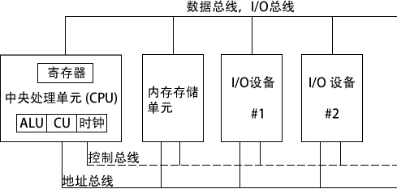
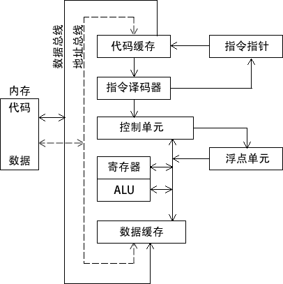

## 基本微机设计

The design of the basic microcomputer

### CPU处理器架构和工作原理

假想机的基本设计：中央处理单元（CPU）是进行算术和逻辑操作的部件，包含了有限数量的存储位置——寄存器（register），一个高频时钟、一个控制单元和一个算术逻辑单元。

其中：
- 时钟 (clock) 对 CPU 内部操作与系统其他组件进行同步。
- 控制单元 (control unit, CU) 协调参与机器指令执行的步骤序列。
- 算术逻辑单元 (arithmetic logic unit, ALU) 执行算术运算，如加法和减法，以及逻辑运算，如 AND（与）、OR（或）和 NOT（非）。

CPU 通过主板上 CPU 插座的引脚与计算机其他部分相连。大部分引脚连接的是数据总线、控制总线和地址总线。

内存存储单元 (memory storage unit) 用于在程序运行时保存指令与数据。它接受来自 CPU 的数据请求，将数据从随机存储器 (RAM) 传输到 CPU，并从 CPU 传输到内存。

由于所有的数据处理都在 CPU 内进行，因此保存在内存中的程序在执行前需要被复制到 CPU 中。程序指令在复制到 CPU 时，可以一次复制一条，也可以一次复制多条。

总线 (bus) 是一组并行线，用于将数据从计算机一个部分传送到另一个部分。一个计算机系统通常包含四类总线：数据类、I/O 类、控制类和地址类。

数据总线 (data bus) 在 CPU 和内存之间传输指令和数据。I/O 总线在 CPU 和系统输入 / 输出设备之间传输数据。控制总线 (control bus) 用二进制信号对所有连接在系统总线上设备的行为进行同步。当前执行指令在 CPU 和内存之间传输数据时，地址总线 (address bus) 用于保持指令和数据的地址。

时钟与 CPU 和系统总线相关的每一个操作都是由一个恒定速率的内部时钟脉冲来进行同步。机器指令的基本时间单位是机器周期 (machine cycle) 或时钟周期 (clock cycle)。

一个时钟周期的时长是一个完整时钟脉冲所需要的时间。

时钟周期持续时间用时钟速度的倒数来计算，而时钟速度则用每秒振荡数来衡量。例如，一个每秒振荡 10 亿次 (1GHz) 的时钟，其时钟周期为 10 亿分之 1 秒 (1 纳秒 )。

执行一条机器指令最少需要 1 个时钟周期，有几个需要的时钟则超过了 50 个（比如 8088 处理器中的乘法指令）。由于在 CPU、系统总线和内存电路之间存在速度差异，因此，需要访问内存的指令常常需要空时钟周期，也被称为等待状态 (wait states)。

### 指令执行周期

CPU 在执行一条机器指令时，需要经过一系列预先定义好的步骤，这些步骤被称为指令执行周期 (instruction execution cycle)。

1) CPU 从被称为指令队列 (instruction queue) 的内存区域取得指令，之后立即增加指令指针的值。

2) CPU 对指令的二进制位模式进行译码。这种位模式可能会表示该指令有操作数（输入值）。

3) 如果有操作数，CPU 就从寄存器和内存中取得操作数。有时，这步还包括了地址计算。

4) 使用步骤 3 得到的操作数，CPU 执行该指令。同时更新部分状态标志位，如零标志 (Zero)、进位标志 (Carry) 和溢出标志 (Overflow)。

5) 如果输出操作数也是该指令的一部分，则 CPU 还需要存放其执行结果。

通常将上述听起来很复杂的过程简化为三个步骤：取指 (Fetch)、译码 (Decode) 和执行 (Execute)。

操作数 (operand) 是指操作过程中输入或输出的值。例如，表达式 Z=X+Y 有两个输入操作数 (X 和 Y)，—个输岀操作数 (Z)。

下图是一个典型 CPU 中的数据流框图。该图表现了在指令执行周期中相互交互部件之间的关系。在从内存读取程序指令之前，将其地址放到地址总线上。然后，内存控制器将所需代码送到数据总线上，存入代码高速缓存 (code cache)。指令指针的值决定下一条将要执行的指令。指令由指令译码器分析，并产生相应的数值信号送往控制单元，其协调 ALU 和浮点单元。虽然图中没有画出控制总线，但是其上传输的信号用系统时钟协调不同 CPU 部件之间的数据传输。

### 读取内存

作为一个常见现象，计算机从内存读取数据比从内部寄存器读取速度要慢很多。这是因为从内存读取一个值，需要经过下述步骤：
将想要读取的值的地址放到地址总线上。
设置处理器 RD（读取）引脚（改变 RD 的值）。
等待一个时钟周期给存储器芯片进行响应。
将数据从数据总线复制到目标操作数。

上述每一步常常只需要一个时钟周期，时钟周期是基于处理器内固定速率时钟节拍的一种时间测量方法。计算机的 CPU 通常是用其时钟速率来描述。例如，速率为 1.2GHz 意味着时钟节拍或振荡为每秒 12 亿次。

因此，考虑到每个时钟周期仅为 1/1 200 000 000 秒，4 个时钟周期也是非常快的。但是，与 CPU 寄存器相比，这个速度还是慢了，因为访问寄存器一般只需要 1 个时钟周期。

幸运的是，CPU 设计者很早之前就已经指出，因为绝大多数程序都需要访问变量，计算机内存成为了速度瓶颈。他们想出了一个聪明的方法来减少读写内存的时间一一将大部分近期使用过的指令和数据存放在高速存储器 cache 中。

其思想是，程序更可能希望反复访问相同的内存和指令，因此，cache 保存这些值就能使它们能被快速访问到。此外，当 CPU 开始执行一个程序时，它会预先将后续（比如）一千条指令加载到 cache 中，这个行为是基于这样一种假设，即这些指令很快就会被用到。

如果这种情况重复发生在一个代码块中，则 cache 中就会有相同的指令。当处理器能够在 cache 存储器中发现想要的数据，则称为 cache 命中 (cache hit)。反之，如果 CPU 在 cache 中没有找到数据，则称为 cache 未命中 (cache miss)。

x86 系列中的 cache 存储器有两种类型：一级 cache（或主 cache）位于 CPU 上；二级 cache （或次 cache）速度略慢，通过高速数据总线与 CPU 相连。这两种 cache 以最佳方式一 起工作。

还有一个原因使得 cache 存储器比传统 RAM 速度快，cache 存储器是由一种被称为静态 RAM (static RAM) 的特殊存储器芯片构成的。这种芯片比较贵，但是不需要为了保持其内容进行不断地刷新。另一方面，传统存储器，即动态 RAM (dynamic RAM)，就需要持续刷新。它速度慢一些，但是价格更便宜。

### 加载并执行程序

在程序执行之前，需要用一种工具程序将其加载到内存，这种工具程序称为程序加载器 (program loader)。加载后，操作系统必须将 CPU 向程序的入口，即程序开始执行的地址。以下步骤是对这一过程的详细分解。

1) 操作系统（OS）在当前磁盘目录下搜索程序的文件名。如果找不到，则在预定目录列表（称为路径（path））下搜索文件名。当 OS 无法检索到文件名时，它会发出一个出错信息。

2) 如果程序文件被找到，OS 就访问磁盘目录中的程序文件基本信息，包括文件大小，及其在磁盘驱动器上的物理位置。

3) OS 确定内存中下一个可使用的位置，将程序文件加载到内存。为该程序分配内存块，并将程序大小和位置信息加入表中（有时称为描述符表（descriptor table））。另外，OS 可能调整程序内指针的值，使得它们包括程序数据地址。

4) OS 开始执行程序的第一条机器指令（程序入口）。当程序开始执行后，就成为一个进程（process）。OS 为这个进程分配一个标识号（进程 ID），用于在执行期间对其进行追踪。

5) 进程自动运行。OS 的工作是追踪进程的执行，并响应系统资源的请求。这些资源包括内存、磁盘文件和输入输出设备等。

6) 进程结束后，就会从内存中移除。

不论使用哪个版本的 Microsoft Windows，按下 Ctrl-Alt-Delete 组合键，可以选择任务管理器（task manager）选项。在任务管理器窗口可以查看应用程序和进程列表。

应用程序列表中列出了当前正在运行的完整程序名称，比如，Windows 浏览器，或者 Microsoft Visual C++。如果选择进程列表，则会看见一长串进程名。其中的每个进程都是一个独立于其他进程的，并处于运行中的小程序。

可以连续追踪每个进程使用的 CPU 时间和内存容量。在某些情况下，选定一个进程名称后，按下 Delete 键就可以关闭该进程。

