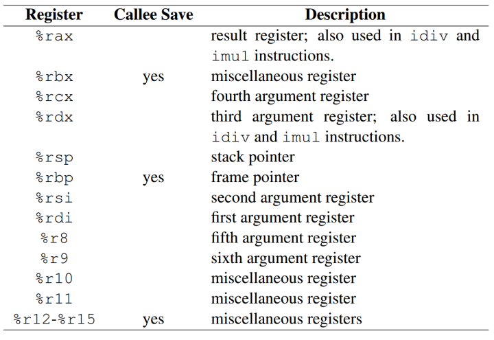

## 计算机语言

计算机语言分类：机器语言、汇编语言、标记语言、脚本语言、编程语言。


shell（bash）

编程语言：C/C++，Java，Perl等
标记语言：xml，html，xhtml（xml和html的合体）等
脚本语言：php，js，asp，Python，ruby等


1. 相对于其他两类语言，编程语言有很强的逻辑和行为能力。
2. 标记语言不用于向计算机发出指令，常用于格式化和链接。
3. 脚本语言介于标记语言和编程语言之间，脚本语言脚本语言不需要编译，可以直接用，由解释器来负责解释。
4. 脚本语言的运行速度相对较快，且脚本文件明显小于程序语言。
5. 脚本语言一般都是以文本形式存在，类似于一种命令。
6. 脚本语言的特点是语法简单，一般以文本形式保存，并且不需要编译成目标程序，在调用的时候直接解释。
7. 脚本语言的一个大特性：能用记事本写出程序，不需要编译环境生成目标程序
8. 脚本一般不具备通用性，所能处理的问题范围有限。
9. 脚本语言是解释执行语言。特点是较容易上手，编程功能上相对简单一些。例如：html语言、php语言等。
10. 编程语言：例如 C 语言、C# 语言等功能较强大，可以用来开发规模较大的系统软件，或者做系统底层的开发。

### 机器语言

machine language

机器语言是计算机最原始的语言，是由0和1的代码构成，cpu在工作的时候只认识机器语言，即0和1的代码。

机器语言是机器能直接识别的程序语言或指令代码，勿需经过翻译，每一操作码在计算机内部都有相应的电路来完成。

机器语言使用绝对地址和绝对操作码。

优点：直接执行，速度快，资源占用少

缺点：可读性、可移植性差，编程繁杂

#### 指令格式

一条指令必须包含下列信息：
1) 操作码。它具体说明了操作的性质及功能。一台计算机可能有几十条至几百条指令，每一条指令都有一个相应的操作码，计算机通过识别该操作码来完成不同的操作。
2) 操作数的地址。CPU通过该地址就可以取得所需的操作数。
3) 操作结果的存储地址。把对操作数的处理所产生的结果保存在该地址中，以便再次使用。
4) 下条指令的地址。执行程序时，大多数指令按顺序依次从主存中取出执行，只有在遇到转移指令时，程序的执行顺序才会改变。为了压缩指令的长度，可以用一个程序计数器（ProgramCounter，PC）存放指令地址。每执行一条指令，PC的指令地址就自动+1（设该指令只占一个主存单元），指出将要执行的下一条指令的地址。当遇到执行转移指令时，则用转移地址修改PC的内容。由于使用了PC，指令中就不必明显地给出下一条将要执行指令的地址。

各计算机公司设计生产的计算机，其指令的数量与功能、指令格式、寻址方式、数据格式都有差别，即使是一些常用的基本指令，如算术逻辑运算指令、转移指令等也是各不相同的。因此，尽管各种型号计算机的高级语言基本相同，但将高级语言程序编译成机器语言后，其差别也是很大的。因此将用机器语言表示的程序移植到其他机器上去几乎是不可能的。

为了缓解新机器的推出与原有应用程序的继续使用之间的矛盾，1964年在设计IBM360计算机时所采用的系列机思想较好地解决了这一问题。从此以后，每个计算机公司生产的同一系列的计算机尽管其硬件实现方法可以不同，但指令系统、数据格式、I/O系统等保持相同，因而软件完全兼容（在此基础上，产生了兼容机）。当研制该系列计算机的新型号或高档产品时，尽管指令系统可以有较大的扩充，但仍保留了原来的全部指令，保持软件向上兼容的特点，即低档机或旧机型上的软件不加修改即可在比它高档的新机器上运行，以保护用户在软件上的投资。

#### 指令集架构

计算机芯片制造商在处理器内部设计一个指令集来实现基本操作，如传送、加法或乘法。这个指令集也被称为机器语言。每一个机器语言指令或者直接在机器硬件上执行，或者由嵌入到微处理器芯片的程序来执行，该程序被称为微程序。


### 汇编语言
#### 汇编器（assembler）

Microsoft 宏汇编器（称为 MASM），TASM（Turbo 汇编器），NASM（Netwide 汇编器）和 MASM32（MASM 的一种变体）。

GAS（GNU 汇编器）和 NASM 是两种基于 Linux 的汇编器。在这些汇编器中，NASM 的语法与 MASM 的最相似。

#### 指令（instruction）

编器将指令翻译为机器语言字节，并且在运行时由 CPU 加载和执行。

一条指令有四个组成部分：
- 标号（可选）
- 指令助记符（必需）
- 操作数（通常是必需的）
- 注释（可选）

`[label: ] mnemonic [operands] [;comment]`


1) 标号、标签（label）
标号是一种标识符，是指令和数据的位置标记。标号位于指令的前端，表示指令的地址。同样，标号也位于变量的前端，表示变量的地址。

标号有两种类型：数据标号和代码标号。

数据标号标识变量的位置，它提供了一种方便的手段在代码中引用该变量。

标号以冒号（:）结尾，且开头不能是数字。

定义标号并不会对__DATA段__data节产生影响。

一般来说，定义的标号只能在同一个汇编文件中使用，如果一个汇编文件想使用另一个汇编文件定义的标签，需要另一个汇编文件用.globl声明标签是全局可见的，比如说`.globl _main`。


2) 指令助记符(instruction mnemonic)

指令助记符是标记一条指令的短单词。在英语中，助记符是帮助记忆的方法。

助记符|说明
---|---
MOV|传送（分配）数值
MUL|两个数值相乘
ADD|两个数值相加
SUB|从一个数值中减去另一个数值
JMP|跳转到一个新位置
CALL|调用一个子程序

3) 操作数

操作数是指令输入输出的数值。汇编语言指令操作数的个数范围是 0〜3 个，每个操作数可以是寄存器、内存操作数、整数表达式和输入输岀端口。

生成内存操作数有不同的方法，比如，使用变量名、带方括号的寄存器等。变量名暗示了变量地址，并指示计算机使用给定地址的内存内容。


4) 注释

注释是程序编写者与阅读者交流程序设计信息的重要途径。程序清单的开始部分通常包含如下信息：
- 程序目标的说明
- 程序创建者或修改者的名单
- 程序创建和修改的日期
- 程序实现技术的说明

注释有两种指定方法：
- 单行注释，用分号（;）开始。汇编器将忽略在同一行上分号之后的所有字符。
- 块注释，用 COMMENT 伪指令和一个用户定义的符号开始。汇编器将忽略其后所有的文本行，直到相同的用户定义符号出现为止。


5) NOP（空操作）指令

最安全（也是最无用）的指令是 NOP（空操作）。它在程序空间中占有一个字节，但是不做任何操作。它有时被编译器和汇编器用于将代码对齐到有效的地址边界。

##### jmp

无条件跳转对应的助记符是jmp. 其操作数是标签。

条件跳转
```
cmp $0x114514, %rax
je  loop_begin
```

je代表相等时跳转，jne代表不相等时跳转；jg代表大于时跳转，jge代表大于等于时跳转；jl代表小于时跳转，jle代表小于等于时跳转。这里还要强调一下，“大于”、“小于”究竟是谁大谁小。在我们cmp a, b时，实际上执行的是b-a。

跳转指令一般指适用在控制语句中，并不会用于函数的调用。当我们进行函数调用时，应该使用全新的指令——call和ret.

call指令和jmp指令一样，接受一个标签作为操作数，直观上看和jmp的效果也类似，直接跳转到该标签所在的指令。但是，call指令还干了一件事——把当前的rip寄存器push到栈区里。这实际上和我们利用jmp解决跳出去回不来的问题的方法类似，把返回的地址放到栈上。

执行完函数的运算之后，想要返回之前调用函数的地方，这就用到了ret. 
ret无操作数，默认当前栈顶，也就是rsp指向的位置，存储的是当初call时push到栈区的地址，然后直接跳转，并且把那个地址弹栈。

call和ret都可以加上一个q，形成callq和retq. 这和call和ret实际上是没有区别的，只是强调那个地址是8个字节的地址。


##### movq

mov 是一个在汇编语言中很常见的指令，意思是赋值。`mov a b`就是将a赋值给b。它可以将立即数赋值给寄存器、内存，可以把寄存器赋值给寄存器、内存，把内存赋值给寄存器。

一个场景：在C语言中用long a在一块内存上存储了一个64位整型数a，又用int b在一块内存上存储了一个32位整型数b。那么，每次给a赋值的时候，实质上都是将数放入a的地址对应的内存中。因此，就是一个mov指令。

但是，如果只有mov指令的话，那么a = 0x114514;和b = 0x114514;这两个C语句翻译成汇编语言的话并没有区别，都是将一个数赋值给一块内存地址。然而，在x86-64架构下采用小端法，因此，在a的内存区域中实际应该存储的是14 45 11 00 00 00 00 00, b的内存区域中存储的是14 45 11 00。这看上去似乎没有什么区别。然而，在向a赋值的时候，实际上是把整个8个字节的高位都清零，而b仅仅是把4个字节的高位清零。

然而，汇编层面并不认得long, int的变量之类，因此，就必须扩展助记符来完成这个事情。

在GAS语法中，会在助记符后加上b, w, l或q, 分别表示操作的是1个，2个，4个或8个字节。因此，long的赋值可以用movq, int的赋值可以用movl.


##### leaq
lea是load effective address的简称，其拥有两个操作数。

##### $0
$0, 作为其源操作数。在GAS语法下，一个数字前加上$表示这个数本身。如果不加的话，则表示0这个地址里存储的数。此外，也可以在前面加0x来表示16进制数，如 movq    $0x2000001, %rax

##### %rax
%rax 通常用于存储函数调用的返回结果，同时也用于乘法和除法指令中。在imul 指令中，两个64位的乘法最多会产生128位的结果，需要 %rax 与 %rdx 共同存储乘法结果，在div 指令中被除数是128 位的，同样需要%rax 与 %rdx 共同存储被除数。

在GAS语法中，寄存器名字前面一定要跟着%.

在x86-64架构下，CPU中一共有16个64位通用寄存器，它们的名字依次是rax, rbx, rcx, rdx, rdi, rsi, rbp, rsp, r8, r9, r10, r11, r12, r13, r14, r15. 

对于前8个通用寄存器，也就是名字不是数字的寄存器，还可以用eax, ebx, ecx, edx, edi, esi, ebp, esp指代其低32位，用ax, bx, cx, dx, di, si, bp, sp指代其低16位。而对于rax, rbx, rcx, rdx这四个通用寄存器而言，还可以单独引用它低16位中的高8位和低8位，如对ax而言，ah指代其高8位，al指代其低8位。

%rsp 是堆栈指针寄存器，通常会指向栈顶位置，堆栈的 pop 和push 操作就是通过改变 %rsp 的值即移动堆栈指针的位置来实现的。

%rbp 是栈帧指针，用于标识当前栈帧的起始位置

%rdi, %rsi, %rdx, %rcx,%r8, %r9 六个寄存器用于存储函数调用时的6个参数（如果有6个或6个以上参数的话）。

被标识为 “miscellaneous registers” 的寄存器，属于通用性更为广泛的寄存器，编译器或汇编程序可以根据需要存储任何数据。

“Caller Save” 和 ”Callee Save” 寄存器，即寄存器的值是由”调用者保存“ 还是由 ”被调用者保存“。当产生函数调用时，子函数内通常也会使用到通用寄存器，那么这些寄存器中之前保存的调用者(父函数）的值就会被覆盖。为了避免数据覆盖而导致从子函数返回时寄存器中的数据不可恢复，CPU 体系结构中就规定了通用寄存器的保存方式。

如果一个寄存器被标识为”Caller Save”， 那么在进行子函数调用前，就需要由调用者提前保存好这些寄存器的值，保存方法通常是把寄存器的值压入堆栈中，调用者保存完成后，在被调用者（子函数）中就可以随意覆盖这些寄存器的值了。如果一个寄存被标识为“Callee Save”，那么在函数调用时，调用者就不必保存这些寄存器的值而直接进行子函数调用，进入子函数后，子函数在覆盖这些寄存器之前，需要先保存这些寄存器的值，即这些寄存器的值是由被调用者来保存和恢复的。




##### retq

从当前 %rsp 指向的位置（即栈顶）弹出数据，并跳转到此数据代表的地址处。

##### leave

函数返回时，只需要得到函数的返回值（保存在 %rax 中），之后就需要将栈的结构恢复到函数调用之差的状态，并跳转到父函数的返回地址处继续执行。

由于函数调用时已经保存了返回地址和父函数栈帧的起始地址，要恢复到子函数调用之前的父栈帧，我们只需要执行以下两条指令：
```
movq %rbp, %rsp    # 使 %rsp 和 %rbp 指向同一位置，即子栈帧的起始处
popq %rbp # 将栈中保存的父栈帧的 %rbp 的值赋值给 %rbp，并且 %rsp 上移一个位置指向父栈帧的结尾处
```
为了便于栈帧恢复，x86-64 架构中提供了 leave 指令来实现上述两条命令的功能。


#### 伪指令（Directive）

伪指令是嵌入源代码中的命令，由汇编器识别和执行。伪指令不在运行时执行，但是它们可以定义变量、宏和子程序；为内存段分配名称，执行许多其他与汇编器相关的日常任务。

默认情况下，伪指令不区分大小写。

以.开头的都是汇编器伪指令，如.section, .globl等。

由汇编器伪指令开头的语句，一般不会被直接翻译成机器码。汇编器伪指令并不是告诉汇编器做什么，而是告诉汇编器如何做。

##### .section
`.section    segname, sectname`。其中segment是段名，sectname是节名。

- 数据段用于定义变量，用`.DATA`伪指令进行标识：`.data`。
- 代码段.CODE 伪指令标识的程序区段包含了可执行的指令：`.code`
- 堆栈段.STACK 伪指令标识的程序区段定义了运行时堆栈，并设置了其大小：`.stack 100h`
- 附加段

汇编器伪指令的一个重要功能是定义程序区段。

一个段对应整数个页。

`__TEXT`段

`__DATA`段，用于存放数据。

`__DATA`是在逻辑地址空间中是单独的页，这里存放的数据和字面量不同，拥有自己的地址；和栈上分配的数据不同，可以被所有函数访问。

在`__DATA`段中，`__data`节存放所有非const的已经被初始化过的变量，`__bss`节存放所有未被初始化的static的变量，`__common`节存放所有未被初始化过的外部全局变量。

在`__DATA`段中存储数据，需要告诉汇编器这个数据占多少字节，也就是说多少字节的高位要被清零。汇编器指令`.byte`，`.short`，`.long`，`.quad`分别代表1字节，2字节，4字节和8字节。


由于有些节过于常用，因此，汇编器给予了我们一组简单的记号：
- `.text`代替`.section __TEXT, __text`
- `.data`来代替`.section __DATA, __data`
- `.bss`代替`.section __DATA, __bss`


一个标准的完整段定义
```
datas segment
	;此处输入数据段代码
datas ends

stacks segment
	;此处输入堆栈段代码
	       db 128 dup (0)
stacks ends

codes segment
	      assume cs:codes,ds:datas,ss:stacks
	start:
	      mov    ax, datas
	      mov    ds, ax

              ...        ;代码

	      mov    ax,4c00h
	      int    21h
codes ends
    end start
```

##### .globl

我们在由汇编语言翻译机器码的时候，得到的文件并不仅仅包含操作的指令，还需要包含一些名字和记号。比如说，C语言中，程序执行的起点是main函数。那么，这个函数的名字main就要包含在文件中，使得程序执行的时候知道执行哪个函数。

##### `_main`

macOS中，汇编语言程序执行的起点是_main函数。是谁决定它叫这个名字的呢，是链接器。如果我们写的程序想把它主函数叫做_start, 那么只需要在链接的时候写上`ld -e _start exit.o -o exit -lSystem`即可。

##### .equ
如C语言中的#define定义的宏一样，.equ定义的变量只是一个简单的替换，并不支持对这个变量重新赋值之类的操作。这个变量也没有其地址，只是一个字面量。


##### 等号伪指令（equal-sign directive）
等号伪指令把一个符号名称与一个整数表达式连接起来：name = expression

程序员可以直接用常量来编写 MOV 指令，但是经验表明，如果使用符号将会让程序更加容易阅读和维护。

##### 当前地址计数器（current location counter）
当前地址计数器，表示为 $。

##### DUP操作符
使用 DUP 操作符来存储数组和字符串。为了简化程序的维护，DUP 使用的计数器应该是符号计数器。

##### EQU伪指令
EQU 伪指令把一个符号名称与一个整数表达式或一个任意文本连接起来，它有 3 种格式：
```
name EQU expression
name EQU symbol
name EQU <text>
```

##### TEXTEQU伪指令
TEXTEQU 伪指令，类似于 EQU，创建了文本宏（text macro）。它有 3 种格式：第一种为名称分配的是文本；第二种分配的是已有文本宏的内容；第三种分配的是整数常量表达式：
```
name TEXTEQU <text>
name TEXTEQU textmacro
name TEXTEQU %constExpr
```


#### 寄存器（register）

CPU 本身只负责运算，不负责储存数据。数据一般都储存在内存之中，CPU 要用的时候就去内存读写数据。

但是，CPU 的运算速度远高于内存的读写速度，为了避免被拖慢，CPU 都自带一级缓存和二级缓存。基本上，CPU 缓存可以看作是读写速度较快的内存。

但是，CPU 缓存还是不够快，另外数据在缓存里面的地址是不固定的，CPU 每次读写都要寻址也会拖慢速度。因此，除了缓存之外，CPU 还自带了寄存器（register），用来储存最常用的数据。也就是说，那些最频繁读写的数据（比如循环变量），都会放在寄存器里面，CPU 优先读写寄存器，再由寄存器跟内存交换数据。

寄存器不依靠地址区分数据，而依靠名称。每一个寄存器都有自己的名称，我们告诉 CPU 去具体的哪一个寄存器拿数据，这样的速度是最快的。有人比喻寄存器是 CPU 的零级缓存。有人比喻寄存器是 CPU 的零级缓存。


早期的 x86 CPU 只有8个寄存器，而且每个都有不同的用途。现在的寄存器已经有100多个了，都变成通用寄存器，不特别指定用途了，但是早期寄存器的名字都被保存了下来。

- EAX
- EBX
- ECX
- EDX
- EDI
- ESI
- EBP
- ESP

上面这8个寄存器之中，前面七个都是通用的。ESP 寄存器有特定用途，保存当前 Stack 的地址。

EAX 属于最频繁使用的通用寄存器 存储返回值

我们常常看到 32位 CPU、64位 CPU 这样的名称，其实指的就是寄存器的大小。32 位 CPU 的寄存器大小就是4个字节。


rflags寄存器/状态标志寄存器

#### 常量、保留字和标记符

##### 常量

整数常量（integer literal）（又称为整型常量（integer constant））由一个可选前置符号、一个或多个数字，以及一个指明其基数的可选基数字符构成：
`[{+|-}] digits [radix]`


整型常量表达式 (constant integer expression) 是一种算术表达式，它包含了整数常量和算术运算符。每个表达式的计算结果必须是一个整数，并可用 32 位 (从 0 到 FFFFFFFFh) 来存放。


实数常量（real number literal）（又称为浮点数常量（floating-point literal））用于表示十进制实数和编码（十六进制）实数。十进制实数包含一个可选符号，其后跟随一个整数，一个十进制小数点，一个可选的表示小数部分的整数，和一个可选的指数：
`[sign]integer.[integer] [exponent]`

符号和指数的格式如下：
```
sign{+,-}
exponent E[{+,-}]integer
```

下面是一些有效的十进制实数：
```
2.
+3.0
-44.2E+05
26.E5
```
字符常量（character literal）是指，用单引号或双引号包含的一个字符。汇编器在内存中保存的是该字符二进制 ASCII 码的数值。

字符串常量（string literal）是用单引号或双引号包含的一个字符 ( 含空格符 ) 序列。

##### 保留字

保留字（reserved words）有特殊意义并且只能在其正确的上下文中使用。默认情况下，保留字是没有大小写之分的。比如，MOV 与 mov、Mov 是相同的。


保留字有不同的类型：
- 指令助记符，如 MOV、ADD 和 MUL。
- 寄存器名称。
- 伪指令，告诉汇编器如何汇编程序。
- 属性，提供变量和操作数的大小与使用信息。例如 BYTE 和 WORD。
- 运算符，在常量表达式中使用。
- 预定义符号，比如 @data，它在汇编时返回常量的整数值。


##### 标识符

标识符（identifier）是由程序员选择的名称，它用于标识变量、常数、子程序和代码标签。

标识符的形成有一些规则：
- 可以包含 1 到 247 个字符。
- 不区分大小写。
- 第一个字符必须为字母 (A---Z, a---z) A 下划线 (_)、@、? 或 $。其后的字符也可以是数字。
- 标识符不能与汇编器保留字相同。

一般情况下，应避免用符号 @ 和下划线作为第一个字符，因为它们既用于汇编器，也用于高级语言编译器。


#### 字符表示

##### ANSI 字符集

美国国家标准协会（ANSI）定义了 8 位字符集来表示多达 256 个字符。前 128 个字符对应标准美国键盘上的字母和符号。后 128 个字符表示特殊字符，诸如国际字母表、重音符号、货币符号和分数。

Microsoft Windows 早期版本使用 ANSI 字符集。

**ASCII 字符串**

ASCII 是美国标准信息交换码（AmeTican Standard Code for Information Interchange）的首字母缩写。在 ASCII 中，每个字符都被分配了一个独一无二的 7 位整数。

由于 ASCII 只用字节中的低 7 位，因此最高位在不同计算机上被用于创建其专有字符集。比如，IBM 兼容微机就用数值 128〜255 来表示图形符号和希腊字符。

**ASCII 控制字符**

0〜31 的字符代码被称为 ASCII 控制字符。若程序用这些代码编写标准输出（比如 C++ 中），控制字符就会执行预先定义的动作。


##### Unicode 标准

Unicode 被创建出来，用于提供一种定义文字和符号的通用方法。

Unicode 定义了数字代码（称为代码点（code point）），定义的对象为文字、符号以及所有主要语言中使用的标点符号，包括欧洲字母文字、中东的从右到左书写的文字和很多亚洲文字。代码点转换为可显示字符的格式有三种：
- UTF-8 用于 HTML，与 ASCII 有相同的字节数值。
- UTF-16 用于节约使用内存与高效访问字符相互平衡的环境中。比如，Microsoft Windows 近期版本使用了 UTF-16，其中的每个字符都有一个 16 位的编码。
- UTF-32 用于不考虑空间，但需要固定宽度字符的环境中。每个字符都有一个 32 位的编码。

#### 表达式（Expression）和语句（Statement）

##### 布尔表达式

布尔代数（boolean algebra）定义了一组操作，其值为真（true）或假（false）。它的发明者是十九世纪中叶的数学家乔治・布尔（George Boole）。

在数字计算机发明的早期，人们发现布尔代数可以用来描述数字电路的设计。同时，在计算机程序中，布尔表达式被用来表示逻辑操作。

一个布尔表达式（boolean expression）包括一个布尔运算符以及一个或多个操作数。每个布尔表达式都意味着一个为真或假的值。

以下为运算符集合：
- 非（NOT）：标记为`¬`或`~`或`'`
- 与（AND）：标记为`^`或`·`
- 或（OR）：标记为`∨`或`+`

#### 函数调用

##### 调用约定

1. 参数传递：参数传递按从左至右的顺序依次是：rdi，rsi，rdx，rcx，r8，r9。如果参数多于6个，则将多于6个的部分按从右往左的顺序压入栈内。
1. 返回值
1. 保留寄存器
	遵循一个约定，那就是哪些寄存器是保留寄存器。

	比如说，在函数`_func`里面，修改了寄存器rbx的值，那么在主函数中，`callq _func`之后，并没有任何表征表示rbx的值改变了，那么在后续的编程中就有可能使用了错误的rbx值。因此，在函数执行的时候，哪些寄存器应当保留，也属于调用约定。
	
	在这里，称调用的函数为called函数，调用called函数的函数称为calling函数。
1. 调用本文件中的函数：不需要任何别的东西，直接call就好了。
1. 调用别的汇编文件中的函数
	这个函数在它被定义的那个文件中一定要是被.globl声明过的。
	```
	as test.s -o test.o
	as main.s -o main.o
	ld test.o main.o -o main -lSystem
	```
1. 调用C语言中的函数
	假设有一个C语言中的函数`int func(int a, int b, int c)`，那么如果想在别的汇编代码中调用这个函数，只需要将这个函数的名字前加一个`_`. 也就是`callq _func`即可。
	```
	clang test.c -c -o test.o
	as main.s -o main.o
	ld test.o main.o -o main -lSystem
	```
1. 调用库函数
	操作系统提供了大量的库。在macOS中，大量的库函数都包含在文件/usr/lib/libSystem.dylib中。包括：libc C标准库，libinfo NetInfo库，libkvm 内核虚存库，libm 数学库，libpthread POSIX线程库。

	这些库的C头文件可以在/Library/Developer/CommandLineTools/SDKs/MacOSX.sdk 1/usr/include/目录下找到。

	在链接时的参数-lSystem就代表链接libSystem.dylib. 

	系统调用/Library/Developer/CommandLineTools/SDKs/MacOSX.sdk 1/usr/include/sys/syscall.h。这个文件的格式如下：
	```
	#define SYS_syscall        0
	#define SYS_exit           1
	#define SYS_fork           2
	#define SYS_read           3
	#define SYS_write          4
	#define SYS_open           5
	#define SYS_close          6
	#define SYS_wait4          7
	```
	第二列是系统调用的名字，第三列是系统调用号。

	使用系统调用和使用系统库函数类似，但是，系统库函数可以通过函数名进行调用，如`_exit`,`_printf`等。但是，使用系统调用只能利用系统调用号进行调用。

	这里还有一点需要注意的，macOS的内核XNU是分为BSD层和Mach层。常用的系统调用都属于BSD的系统调用。而BSD层在逻辑地址上是位于Mach层之上的，BSD层要从0x2000000开始。因此，实际使用的调用号应该是syscall.h给出的调用号加上0x2000000之后的结果，如SYS_exit的调用号就应当是0x2000001.


### 标记语言

标记语言不用于向计算机发出指令，常用于格式化和链接。

一种将文本以及文本相关的其他信息结合起来，展现出关于文档结构和数据处理细节的电脑文字编码。

与文本相关的其他信息（包括文本的结构和表示信息等）与原来的文本结合在一起，但是使用标记进行标识。

标记语言不仅仅是一种语言，就像许多语言一样，它需要一个运行时环境，使其有用。


### 脚本语言

scripting language

又称解释型语言

为了缩短编程语言的“编写、编译、链接、运行”（edit-compile-link-run）等过程而创建的计算机编程语言。

一种用来解释某些东西的语言，又被称为扩建的语言，或者动态语言，用来控制软件应用程序，脚本通常以文本保存，只在被调用时进行解释或编译。


早期的脚本语言经常被称为批量处理语言或工作控制语言。 一个脚本通常是解释运行而非编译。


各种动态语言，如ASP、PHP、CGI、JSP、JavaScript、VBScript等，都是脚本语言。


### 编程语言

#### 动态内存分配（堆分配）

动态内存分配 (dynamic memory allocation)，又被称为堆分配 (heap allocation)，是编程语言使用的一种技术，用于在创建对象、数组和其他结构时预留内存。


### 集成开发环境

Integrated Development Environment（IDE）

实际开发中，除了编译器是必须的工具，我们往往还需要很多其他辅助软件，例如：
- 编辑器：用来编写代码，并且给代码着色，以方便阅读；
- 代码提示器：输入部分代码，即可提示全部代码，加速代码的编写过程；
- 调试器：观察程序的每一个运行步骤，发现程序的逻辑错误；
- 项目管理工具：对程序涉及到的所有资源进行管理，包括源文件、图片、视频、第三方库等；
- 漂亮的界面：各种按钮、面板、菜单、窗口等控件整齐排布，操作更方便。


