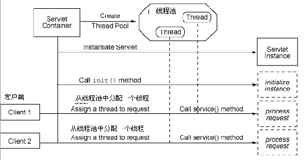
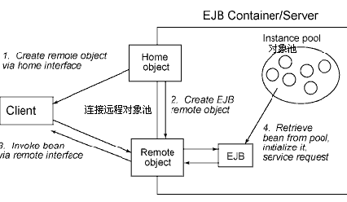

## Java EE Platform

前身：J2EE，2005年之后更名为JAVA EE
Java 2 Platform, Enterprise Edition

### 概述

目前所有的B/S系统应用可以分为：有状态(statefull)和无状态(stateless)两大类别。 有状态是指在整个系统的处理过程中要保留记住一些信息，而无状态则相反，每次request都是独立的连接，不需要在每个request之间共享数据等等。

为达到最大化的性能，对于Java系统，以前通常的作法是使用对象池，这样节约对象生成时的性能开销，也就是说系统启动时，预先生成一定数目的对象实例在内存中，需要使用时，从对象池中取出实例，用完，归还对象池，对于有状态的应用，可以使用相关持久化（persistence）策略来保存状态。

下一步，如何并行访问对象池将是非常重要，java的多线程技术为我们提供了实现可能，线程的创建销毁也是可能非常耗时的，那么，无疑象使用对象池一样，我们必须使用线程池来实现多线程并行计算的最优化。

使用线程池和对象池，每次客户端请求发生一次就从线程池中借用一个线程，处理完这个请求就将线程返回线程池，同样，使用线程快速的访问对象，对象也是从对象池中借用，用完就还回对象池。 整个这样的架构设计在性能上是最优的。

性能保证，安全机制、事务机制、集群技术将是选择IT技术的主要依据。

J2EE就是这样一个实现上述多种考量的综合标准框架系统

J2EE中必然应该有上述线程池和对象池的实现技术，servlet实际是基于线程池的更好的线程容器；EJB是基于对象池的更好的对象容器。

Servlet的架构图：

当client1发生请求时servlet容器会从线程池中分配一个线程给这个request.

EJB的架构图：

instance Pool作为一个对象实例池，维持着EJB实例，当然这个对象池是用生命周期的，简单的说 EJB=对象池+远程对象池
但是，EJB还整合了相当的其它增强功能，如安全 事务机制等，这些对于一般应用都是必需的，当然你还必须根据你的需要来选择是否使用J2EE，如果你的应用对安全 事务机制没有要求，直接使用线程池和对象池技术肯定获得最好的性能。
所以，根据Servler和EJB的原理，我们已经可以规划我们的应用，什么可以放在servlet，或什么需要放在EJB中实现：
线程的本质决定了servlet只适合一些轻量的应用，如分析简单XML文档, 通过JDBC访问数据源，使用JMS或JavaMail处理简单的信息Message，或使用JTS/JTA处理简单的事务机制，注意这些用词都是"简单"的，一旦复杂了，就要使用EJB了。

将所有核心计算放置入EJB中。
所有的复杂商务计算核心都在EJB中完成

如果你的客户端和服务器端之间有防火墙，那么目前能够无障碍通过防火墙的协议只有Http了(Web Service也是基于http就是这个道理)，既然使用http了，而Servlet是基于Http协议的，那么就需要通过servlet来访问EJB，这是我们最普遍的应用情况。
但是，如果你的客户端和服务器端可以放置在一个网络内，之间没有防火墙，那么就不必使用Servlet，直接使用Java调用RMI来访问EJB，这样性能是最好的，这时的Servlet大概只有用于控制Jsp的页面的输出了(MVC模式中的控制作用)。

### 其它

- hibernate\mybatis主要是用于持久层，负责和数据库进行连接，负责SQL的处理，以及将查询到的数据映射成指定的java对象。
- spring主要用于aop和ioc
- spring mvc和struts都是mvc框架，另外还有JSF/Tapestry负责根据不同的API请求来调用程序中不同的处理方法，负责将调用者传入的数据映射成java对象，也负责处理程序返回给客户端的响应数据格式等。

和业务逻辑相关的
spring
guice

spring boot 进一步简化基于 spring 框架的项目的构建工具。

Spring Boot提供了各种组件的启动器（starters），开发者只要能配置好对应组件参数，Spring Boot就会自动配置，让开发者能快速搭建依赖于Spring组件的Java项目。
Spring Boot不但能创建传统的war包应用，还能创建独立的不依赖于任何外部容器（如：tomcat）的独立应用，使用java -jar命令就能启动。同时，Spring Boot也提供了一个命令行工具来执行Spring的脚本。

Spring Boot内嵌了各种Servlet容器，Tomcat、Jetty等，现在不再需要打成war包部署到容器中，Spring Boot只要打成一个可执行的jar包就能独立运行，所有的依赖包都在一个jar包内。

SpringBoot主要是实现了前后端分离
SpringCloud则为后端服务建立了一套分布式系统架构

