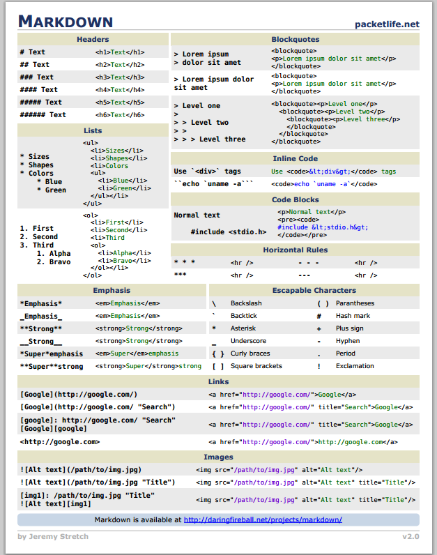
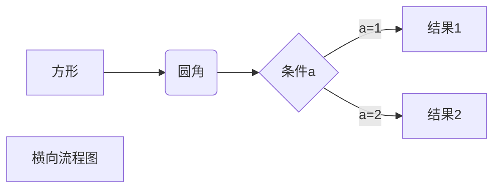
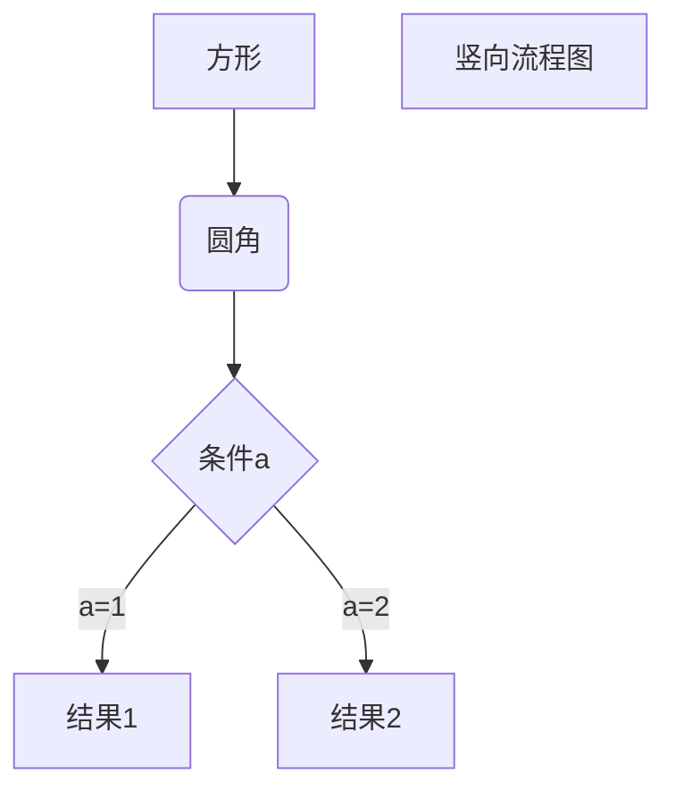
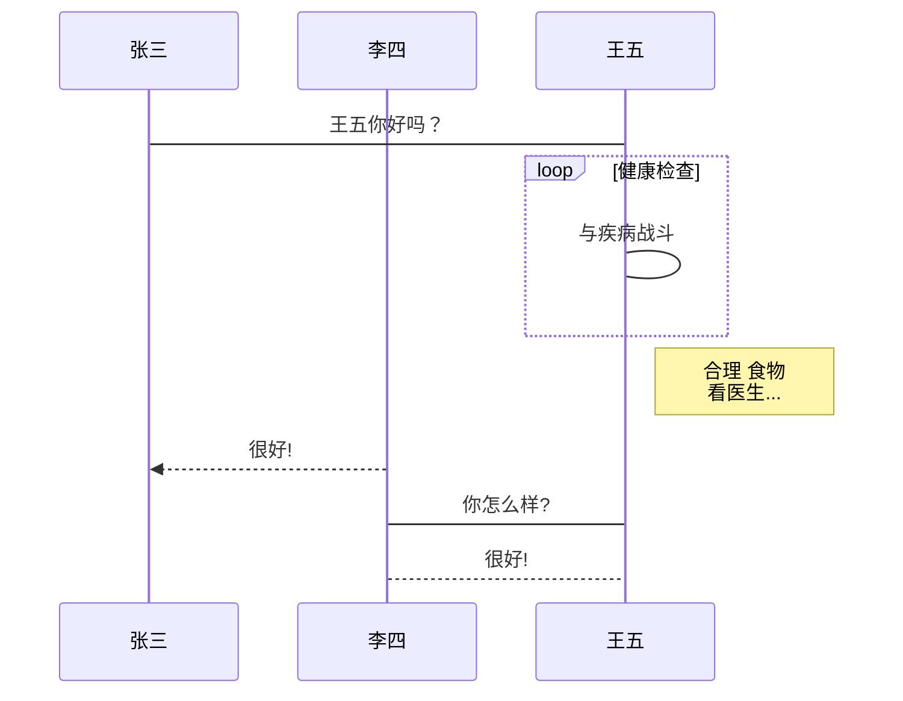
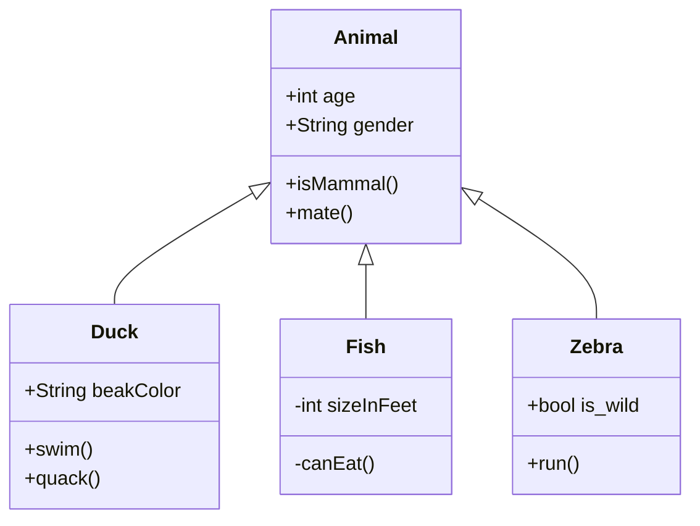
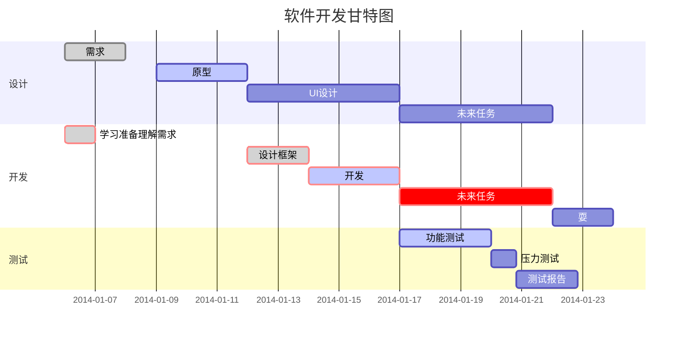
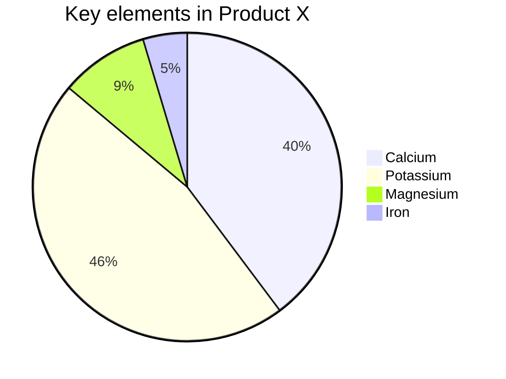
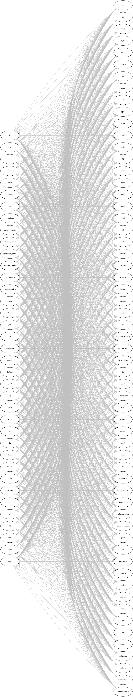

## Markdown

Markdown 设计灵感主要来源于纯文本电子邮件的格式，目标是让人们能够使用易读、易写的纯文本格式编写文档。

Markdown 是一种轻量级标记语言，它允许人们使用易读易写的纯文本格式编写文档。<br>
Markdown 语言在 2004 由约翰·格鲁伯（John Gruber）创建。  
Markdown 编写的文档可以导出 HTML 、Word、图像、PDF、Epub 等多种格式的文档。\n\n
Markdown 编写的文档后缀为 .md, .markdownn, .mdown, .mkdn。  

### 语法说明



#### Markdown 标题
Markdown 标题有两种格式。

1. 使用 = 和 - 标记一级和二级标题  
= 和 - 标记语法格式如下：
```markdown
我展示的是一级标题
=================

我展示的是二级标题
-----------------
```

2. 使用 # 号标记  
使用 # 号可表示 1-6 级标题，一级标题对应一个 # 号，二级标题对应两个 # 号，以此类推。
```markdown
# 一级标题
## 二级标题
### 三级标题
#### 四级标题
##### 五级标题
###### 六级标题
```

#### Markdown 段落
Markdown 段落没有特殊的格式，直接编写文字就好，段落的换行是使用两个以上空格加上回车。  
当然也可以在段落后面使用一个空行来表示重新开始一个段落。

#### Markdown 字体
Markdown 可以使用以下几种字体：  
```markdown
*斜体文本*
_斜体文本_
**粗体文本**
__粗体文本__
***粗斜体文本***
___粗斜体文本___
```

#### Markdown 列表
Markdown 支持有序列表和无序列表。

1. 无序列表使用星号(\*)、加号(+)或是减号(-)作为列表标记，这些标记后面要添加一个空格，然后再填写内容：
```markdown
* 第一项
* 第二项
* 第三项

+ 第一项
+ 第二项
+ 第三项

- 第一项
- 第二项
- 第三项
```

2. 有序列表使用数字并加上 . 号来表示，如：
```markdown
1. 第一项
2. 第二项
3. 第三项
```

#### Markdown 嵌套列表
列表嵌套只需在子列表中的选项前面添加四个空格即可：
```markdown
1. 第一项：
    - 第一项嵌套的第一个元素
    - 第一项嵌套的第二个元素
2. 第二项：
    - 第二项嵌套的第一个元素
    - 第二项嵌套的第二个元素
```

#### Markdown 区块引用
Markdown 区块引用是在段落开头使用 > 符号 ，然后后面紧跟一个空格符号：
```markdown
> 区块引用
> 菜鸟教程
> 学的不仅是技术更是梦想
```

另外区块是可以嵌套的，一个 > 符号是最外层，两个 > 符号是第一层嵌套，以此类推：
```markdown
> 最外层
> > 第一层嵌套
> > > 第二层嵌套
```

区块中使用列表，实例如下：
```markdown
> 区块中使用列表
> 1. 第一项
> 2. 第二项
> + 第一项
> + 第二项
> + 第三项
```

如果要在列表项目内放进区块，那么就需要在 > 前添加四个空格的缩进。  
列表中使用区块实例如下：
```markdown
* 第一项
    > 菜鸟教程
    > 学的不仅是技术更是梦想
* 第二项
```

#### Markdown 代码
如果是段落上的一个函数或片段的代码可以用反引号（\`）把它包起来，即可显示原有格式的文本。
例如：
```markdown
`printf()` 函数
```

跨行代码块，代码区块使用4个空格或者一个制表符（Tab 键）。实例如下：

```markdown
    echo 'RUNOOB'
    function test() {
        echo 'test';
    }
```

也可以不用缩进4个空格，使用3个反引号(\`)包住文本区块，并指定一种语言（也可以不指定）：

```php
    <?php
    echo 'RUNOOB'
    function test() {
        echo 'test';
    }
```

```javascript
$(document).ready(function () {
    alert('RUNOOB');
});
```

#### Markdown 链接
链接使用方法如下：  
`[链接名称](链接地址) `
或者
`<链接地址>`

例如：  
```markdown
这是一个链接 [菜鸟教程](https://www.runoob.com)
```

也可以直接使用链接地址：
```markdown
<https://www.runoob.com>
```

##### 高级链接
我们可以通过变量来设置一个链接，变量赋值在文档末尾进行：
```markdown
这个链接用 1 作为网址变量 [Google][1]
这个链接用 runoob 作为网址变量 [Runoob][runoob]
然后在文档的结尾为变量赋值（网址）

[1]: http://www.google.com/
[runoob]: http://www.runoob.com/
```

#### Markdown 图片
Markdown 图片语法格式如下：
```markdown


```

开头一个感叹号 !  
接着一个方括号，里面放上图片的替代文字  
接着一个普通括号，里面放上图片的网址，最后还可以用引号包住并加上选择性的 'title'  属性的文字。

也可以像网址那样对图片网址使用变量:
```markdown
这个链接用 1 作为网址变量 [RUNOOB][1].
然后在文档的结尾为变量赋值（网址）

[1]: http://static.runoob.com/images/runoob-logo.png
```

Markdown 还没有办法指定图片的高度与宽度，但可以使用普通的  标签。
```markdown

```

#### Markdown 表格
Markdown 制作表格使用 | 来分隔不同的单元格，使用 - 来分隔表头和其他行。  
顶部的连字符无需一定匹配表头文本的长度（但必须保证至少3个连字符）  
可以添加行内的Markdown语法文本，如链接、加粗、删除线等  

语法格式如下：
```markdown
|  表头  |  表头  |
|  ----  |  ----  |
| 单元格 | 单元格 |
| 单元格 | 单元格 |
```

可以设置表格的对齐方式：  
-: 设置内容和标题栏居右对齐。  
:- 设置内容和标题栏居左对齐。  
:-: 设置内容和标题栏居中对齐。  
```markdown
| 左对齐 | 右对齐 | 居中对齐 |
| :-----| ----: | :----: |
| 单元格 | 单元格 | 单元格 |
| 单元格 | 单元格 | 单元格 |
```

#### Markdown 支持的 HTML 元素
不在 Markdown 涵盖范围之内的标签，都可以直接在文档里面用 HTML 撰写。  
目前支持的 HTML 元素有：`<kbd> <b> <i> <em> <sup> <sub> <br>`等 ，如：
```markdown
使用 <kbd>Ctrl</kbd>+<kbd>Alt</kbd>+<kbd>Del</kbd> 重启电脑
```

#### Markdown 转义
Markdown使用了很多特殊符号来表示特定的意义，如果需要显示特定的符号则需要使用转义字符，Markdown 使用反斜杠转义特殊字符：
```markdown
**文本加粗** 
\*\* 正常显示星号 \*\*
```

Markdown 支持以下这些符号前面加上反斜杠来帮助插入普通的符号：
```markdown
\   反斜线
`   反引号
*   星号
_   下划线
{}  花括号
[]  方括号
()  小括号
#   井字号
+   加号
-   减号
.   英文句点
!   感叹号
```

#### Markdown 注脚

注脚
使用 [^keyword] 表示注脚。例如：
```markdown
[^footnote1]: 这是一个 *注脚* 的 **文本**。
[^footnote2]: 这是另一个 *注脚* 的 **文本**。
```

#### Markdown 公式
当需要在编辑器中插入数学公式时，可以使用两个美元符 \$\$ 包裹 TeX 或 LaTeX 格式的数学公式来实现。如：

行内公式$y=a+b$

公式块：
```markdown
$$
\mathbf{V}_1 \times \mathbf{V}_2 =  \begin{vmatrix} 
\mathbf{i} & \mathbf{j} & \mathbf{k} \\
\frac{\partial X}{\partial u} &  \frac{\partial Y}{\partial u} & 0 \\
\frac{\partial X}{\partial v} &  \frac{\partial Y}{\partial v} & 0 \\
\end{vmatrix}
${$tep1}{\style{visibility:hidden}{(x+1)(x+1)}}
$$
```
$$
\mathbf{V}_1 \times \mathbf{V}_2 =  \begin{vmatrix} 
\mathbf{i} & \mathbf{j} & \mathbf{k} \\
\frac{\partial X}{\partial u} &  \frac{\partial Y}{\partial u} & 0 \\
\frac{\partial X}{\partial v} &  \frac{\partial Y}{\partial v} & 0 \\
\end{vmatrix}
${$tep1}{\style{visibility:hidden}{(x+1)(x+1)}}
$$


#### Markdown 流程图

typora 画流程图、时序图(顺序图)、类图、甘特图、饼图

Mermaid 绘制哪些图：

- 饼图：使用 pie 关键字
- 流程图：使用 graph 关键字
- 序列图：使用 sequenceDiagram 关键字
- 甘特图：使用 gantt 关键字
- 类图：使用 classDiagram 关键字
- 状态图：使用 stateDiagram 关键字
- 用户旅程图：使用 journey 关键字
- 实体关系图：使用 erDiagram 关键字
- Git图表：使用 gitGraph 关键字

Flow 绘制标准流程图

1、横向流程图：


2、竖向流程图：


3、标准流程图：
```flow
st=>start: 开始框
op=>operation: 处理框
cond=>condition: 判断框(是或否?)
sub1=>subroutine: 子流程
io=>inputoutput: 输入输出框
e=>end: 结束框
st->op->cond
cond(yes)->io->e
cond(no)->sub1(right)->op
```

4、标准流程图（横向）：
```flow
st=>start: 开始框
op=>operation: 处理框
cond=>condition: 判断框(是或否?)
sub1=>subroutine: 子流程
io=>inputoutput: 输入输出框
e=>end: 结束框
st(right)->op(right)->cond
cond(yes)->io(bottom)->e
cond(no)->sub1(right)->op
```

5、UML时序图：
```sequence
对象A->对象B: 对象B你好吗?（请求）
Note right of 对象B: 对象B的描述
Note left of 对象A: 对象A的描述(提示)
对象B-->对象A: 我很好(响应)
对象A->对象B: 你真的好吗？
```

6、UML时序图：
```sequence
Title: 标题：复杂使用
对象A->对象B: 对象B你好吗?（请求）
Note right of 对象B: 对象B的描述
Note left of 对象A: 对象A的描述(提示)
对象B-->对象A: 我很好(响应)
对象B->小三: 你好吗
小三-->>对象A: 对象B找我了
对象A->对象B: 你真的好吗？
Note over 小三,对象B: 我们是朋友
participant C
Note right of C: 没人陪我玩
```

7、UML标准时序图：


8、类图


9、甘特图：


10、饼图



### Markdown 解析器和扩展语法

由于 Markdown 作者的反对标准化立场，现行的Markdown解析器百花齐放。各个网站或者App的解析器可能都不一样。

原生 Markdown 不支持直接换行，也不支持表格。

GFM跟标准MD一样，行尾不允许直接回车换行，必须是\n\n或者空格空格\n。

#### Markdown 原生
- 初始版本：(2004-03-19)
- 最新版本：V1.0.1(2004-12-17)
- 作者：John Gruber 和 Aaron Swartz（互联网之子，已逝）
- 语言： 第一个版本为 Perl，目前有其他实现
- 网站：
    - 官网[^1]：https://daringfireball.net/projects/markdown
    - 翻译：https://github.com/riku/Markdown-Syntax-CN
- 特性：
    - 易读易写
    - 文字格式：粗体，斜体
    - 插入内容：标题，图片，链接，引用，水平线，块（\`）
    - 功能：列表（无序，有序）
    - 限制：
        - 不支持表格
        - 块级标签必须前后空行，且不能被空格或制表符缩进
        - 块级标签内不能使用 Markdown 语法
        - 支持列表、段落、引用嵌套，方法为每行行首使用4个空格或1个制表符进行缩进

 [^1]:John Gruber在其个人主页中公布了详细的Markdown语法说明


#### CommonMark
- 初始版本：2012 年发起，2014-10-25 发布 Release 0.5
- 最新版本：V0.30.0（2021-06-21）
- 作者：Jeff Atwood 和 John MacFarlane 为首的小组
- 语言： 实现版本众多，commonmark.js 和 cmark 是最广泛。
- 网站：
    * 项目地址: https://github.com/commonmark
    * 官网: https://commonmark.org/
    * 翻译：http://yanxyz.github.io/commonmark-spec/
- 特性：严格定义了 Markdown 语法转为 Html 的实现

由于创始人自2004年Markdown诞生之后就没有更新过Markdown语法，众多的遗留问题没有得到解决，加上扩展语法的自由发展和Markdown编辑器的涌现，导致了很严重的方言和兼容性问题。因此有人希望对Markdown语法进行规整和统一，建立一套Markdown的语法规范，而CommonMark正是这样产物。

最早的名字叫 Standard Markdown，后来迫于 Markdown 原作者 John Gruber 的压力而改名。

CommonMark与一般的衍生语法不同，它的目的不是扩展Markdown的功能，而是解决原生markdown的遗留问题和方言问题，规范Markdown的书写，成为Markdown的标准。可惜此举得到Markdown创始人John Gruber的强力反对，所以至今CommonMark并没有得到广泛的认可。

但是其实就CommonMark本身而言，它规范了Markdown的各项语法，有许多可取之处。CommonMark的语法说明是所有markdown语法说明中最长最详细的，优先问题、缩进问题、空行问题、嵌套问题等等容易出现语法冲突的地方都作了非常详细的说明。

- 定义了优先级别：区块语法的优先级别大于行内语法。
- 支持围栏式区块代码
- 支持1）作为有序列表的项目标记
- 支持\\作为换行符。
- 列表嵌套采用行首内容对齐，而非4个空格
- Setext式标题支持多行

CommonMark基本没有新增内容，主要式对语法规范进行说明，对理解Markdown很有帮助，就是需要一定的Markdown基础，而且英文文档有点长，不好啃动。详细的语法说明：http://spec.commonmark.org/


#### Pandoc Markdown
- 初始版本：(2006)
- 最新版本：V2.3()
- 作者：John MacFarlane
- 语言： Haskell
- 网站：
    * 官网帮助： http://pandoc.org/MANUAL.html#pandocs-markdown
    * 繁体翻译： http://pages.tzengyuxio.me/pandoc/
- 特性：多格式文档的转换工具
    - 根据配置可以支持多种 Markdown 扩展格式，自由配置启用或不用特性（+/-EXTENSION）

Pandoc本身是一个多格式文档的转换工具，所以 Pandoc Markdown 与 MultiMarkdown 的设计目的相似，使Markdown可以转换成更多的不同格式，因为Pandoc支持的格式很多，这也就使的Pandoc's Markdown非常的丰富，比如表格就有4种不同的书写方法。


- 强制换行支持两种方式：行尾两个空格换行，反斜杆换行。
- Atx式标题之前一定要预留空行。标题行尾可加标题识别符。
- 区块引用之前一定要预留空行。
- 围栏式区块代码可以用3个以上波浪线或反引号组成的行包裹代码。之前必须留空行。
- 支持行区块
- 不同形式的列表会生成不同的列表
- 支持连续编号的范例清单，范例项目应用与整个文档，不局限与单一清单
- 支持定义列表
- 支持简单表格、多行表格、格框表格和管线表格四种表格样式
- 支持文件标题区块（类似元数据）
- 支持删除线
- 支持上标、下标
- 支持数字公式
- 支持内嵌TeX

详细的语法说明见：http://pandoc.org/MANUAL.html#pandocs-markdown 


#### Multi Markdown
- 初始版本：(2011-04)
- 最新版本：V6.6.0 (2020-10-29)
- 作者：Fletcher T. Penney
- 语言
    - 初始版本为 perl
    - V3 后基于 peg-markdown 项目重构修改为 C 语言
    - 使用 PEG（解析表达文法）处理文本
- 网站：
    - 官网： http://fletcherpenney.net/multimarkdown/
    - 项目地址：https://github.com/fletcher/MultiMarkdown-6/
- 特性：加强导出转换功能
    - 基于 Markdown，兼容 PHP Markdown Extra
        - 插入内容新增：支持脚注，参考文献，缩略语，交叉引用，上下标（^,\~）
        - 功能新增：
            - 支持元数据
            - 数学公式（MathJax），行内，块$
            - 部分复杂表格
            - 修订功能（CriticMarkup）显示修订痕迹
            - 内嵌其他文件
            - 目录（TOC）
        - 修改
            - 换行方式改为行末使用\\换行（原生Markdown使用2个空格换行）
            - Html 块内语法支持
            - 导出支持 HTML,LaTeX,OPML,OpenDocument Text document

原生markdown文档只能从纯文本转换HTML。而MultiMarkdown则是扩大了原生markdown的转换范围，让其可以方便的转换成：

- HTML/XHTML
- LaTeX (which can be processed into a PDF)
- OpenDocument Text document
- OPML

二次转换可以转换成更多格式，比如docx等。

- 支持元数据：标题、作者、日期等信息，兼容部分YAML。
- 支持交叉引用。
- 支持添加链接和图片的属性。
- 图片可以作为区块元素：如果一个图片语言独立成段，会被自动解释为区块元素，图片下会添加一行图片说明。
- 支持部分复杂表格：兼容PHP Markdown Extra的表格，同时可以——多行表头，单元格横向合并，表格分区，表格下行表格说明等。
- 支持脚注：同PHP Markdown Extra中的脚注。
- 支持参考文献（Citations）
- 支持定义列表：同PHP Markdown Extra。
- 支持缩略语（Abbreviations）：同PHP Markdown Extra。
- 支持栅栏式区块代码：上下行3到5个反引号包裹代码，可定义语法种类，选择性语法高亮。 
注意：首尾行的反引号数量要一致。

- 支持MathJax公式（区块与行内）：区块公式在新行用`\\[`和`\\]`包裹，或首尾用两个dollar\$\$包裹。行内公式用`\\(`和`\\)`包裹，或首尾各用一个dollar$包裹。
- 支持上标与下标：上标为单个字符，前面加^，为多个字符，用^包裹。下标为单个字符，前面加~，为多个字符，用~包裹。
- 支持术语表
- 支持修订功能（CriticMarkup）：可以显示修订痕迹
  - 删除：`{--删除的文本 --}`
  - 添加：`{++新增的文本 ++}`
  - 替换：`{~~删除的文本~>新增文本~~}`
  - 高亮：`{==高亮的文本==}`
  - 备注：`{>>备注文本<<}`
- 内嵌HTML，可在块级HTML中选择性地添加MultiMarkdown语法。
- 支持内嵌其他文件，txt、tet、fodt、html等
- 换行方式改为行末使用\\换行。（原生Markdown使用2个空格换行）
- 支持目录：{{TOC}}添加目录

详细的语法说明见：http://fletcherpenney.net 


#### PHP Markdown Extra
- 初始版本：First release 1.3 (2013-08-11)
- 最新版本：1.9.0 (2019-12-19)
- 作者：Michel Fortin
- 语言：初始版本为 PHP
- 网站：https://github.com/michelf/php-markdown
- 特性：加强网页展示功能
    - 基于 Markdown
        - 插入内容新增：
            - 标题增加锚点属性（方便引用，样式，属性设置）
            - 增加脚注
            - 缩写备注（HTML tag ）
        - 功能新增：
            - 表格（支持对齐：）
            - 任务列表
            - 与 GFM 相似的代码块及代码高亮功能
        - 修改:
            - 内嵌 Html：块标签可缩进不超3空格，可在块标签使用 Markdown 语法
            - 强调：两字词中间的下划线不会被解释成强调
            - 不支持多词强调，反斜杠使用替代的 ： 和 |


- 内嵌html：块标签可以缩进不超过3个空格，且可以在块标签中选择性使用markdown语法。
- 可以为区块元素设置id和class属性，实现文章内部跳转。
- 区块代码：与GFM相似，可以使用栅栏方式，在代码上下行用3个或以上波浪号~或反引号`包裹，亦支持代码高亮。
- 表格：同GFM
- 支持定义列表
- 支持脚注：
```
[^1]，在新行[^1]: 脚注内容
```
>注意：脚注名字必须唯一
- 支持缩略语
- 强调：两字词中间的下划线不会被解释成强调。

详细的语法说明见：https://michelf.ca/projects/php-markdown/extra/ 

#### Markdown GFM
- 初始版本：V0.28-gfm (2017-08-01)
- 最新版本：V0.29.0.gfm.0 (2019-08-08)
- 作者：Github
- 语言：C 语言，forked from commonmark/cmark
- 网站：
    - 官网：https://github.github.com/gfm/
    - 项目地址：https://github.com/github/cmark
- 特性：描述代码项目功能和变更
    - 基于 CommonMark 的 cmark 分支
        - 文字格式新增：删除线（\~\~）
        - 插入内容新增：自动链接，修订版本（+/-）
        - 功能新增：简单表格（支持对齐：），任务列表，代码块及高亮功能（\`\`\`）
        - 限制：
            - Html 支持限制
            - 列表嵌套方法：改为每次嵌套缩进两个空格

原生Markdown发布后，最早在程序员圈内流行。由于Markdown的易读易写，而且对程序员很友好（支持区块代码和行内代码），代码托管平台Github引入了Markdown，并且对原生Markdown语法进行了拓展，这种衍生Markdown叫做 Github Flavored Markdown，简称 GFM。

- 斜体：标准的Markdown在单词左右加_或\*成斜体。GFM 忽略单词内部的_。
- URL自动链接：标准Markdown使用<URL>来支持自动链接。GFM支持不加尖括号的标准URL。
- 代码块：标准Markdown只支持4个空格/Tab缩进的代码块。GFM还支持```格式的代码块，并能指定具体语言。
- 语法高亮：代码块基础上可以指定语言，来进行着色渲染。
- 删除线：增加了标准markdown中不支持的删除线~~
```
~~被删除的文字~~
```
- 表格：增加了标准markdown中不支持的表格
- 锚点：增加了标准markdown中不支持的锚点
`[锚点描述](#锚点名)`
- 任务列表：GFM支持在列表符号与文字中间加[ ]、[x]，分别表示未完成/完成。x 可以小写也可以大写，有些编辑器可能不支持大写。
- HTML：可以使用一个HTML的子集，所有支持的标签和属性可以在 https://github.com/github/markup 找到。
- 表情符号:
`:表情代码:`:smile::laughing::+1::-1::clap:

详细的GFM说明见：https://help.github.com/categories/writing-on-github/


### 最佳实践
虽然目前编辑器对Markdown的支持存在很大差异，方言现象严重，但是对于Markdown的基础语法的支持都是相似的。而且针对Markdown基础语法产生的差异大部分是在区块相接、嵌套、软输入和Lazy输入时产生的，所以养成一个良好的书写习惯可以规避掉大部分兼容性问题。

#### 标题
- `#+空格+标题`
- 文章的顶层标题使用二级标题（有时文章的标题并不需要写在文章里，比如大多数博客有专门的位置填写文章标题，此时这级标题可以省略）
- 每个小节的标题使用三级标题
- 小节中进一步分层组织时使用四级标题
- 尽量少用五级标题和六级标题，考虑用有序列表和无序列表代替
- 完全不用一级标题

#### 粗体、斜体
需要强调某处内容时使用粗体，如：
>中文全角标点符号占**一个**汉字宽度，英文半角标点占**半个**汉字宽度（亦即一个字母宽度）。

在中文排版中不使用斜体。在英文排版中可用斜体表达强调，或表示书名、题目。

强调默认是斜体，重强调默认是粗体。

#### 引用
以下情况使用引用标记：

- 引述内容时（也可直接用引号替代）
- 作示例时
- 给出提示、警告等额外说明时

#### 空白符号的运用
##### 1. 半角空格
半角空格的使用很重要，一些情况下能调节文字间距使得排版更加美观。

- 中英文混排时，英文前后各加一个空格。
- 中文和阿拉伯数字混排时，数字前后各加一个空格。
- 若英文或阿拉伯数字若紧邻中文全角标点，则其与标点之间不加空格。
- 行内代码的两端各添加一个空格。若行内代码紧邻标点符号，则其与标点之间不加空格。

##### 2. 空行
正文段落之间用一个空行来分隔，可以显得段落分明、结构不拥挤。

##### 3. 缩进
- 文章中每个段落的开头不要缩进
- 列表中嵌套列表时，内层列表使用 4 个空格进行缩进
- 想要像上面那样在一个列表项中嵌入引用块，只要在 Markdown 中将引用块用 4 个空格缩进。除此之外，图片、代码块等元素也可以在列表下缩进
- 缩进时使用空格符，不用 Tab 符

#### 标点符号
中文排版时应全文使用中文全角标点，无论内容中是否包含英文词语。除非内容中包含完整的英文句子或段落，这种情况下英文内的标点使用半角标点。

##### 1. 引号
网络文章排版时使用直角引号——单引号「」，双引号『』。通常先使用「」，在引号嵌套时才在内层用『』。

直角引号在自媒体中比较常见，但也会有一些争议。

##### 2. 省略号
在中文输入法状态下，可使用「Shift + 6」输入省略号。注意是 6 个点，而非 3 个点。

##### 3. 破折号
在中文输入法状态下，可使用「Shift + -」输入破折号。注意该符号应占两个汉字宽度。

##### 4. 波浪线
在中文输入法状态下，可使用「Shift + \`（ESC 键下方）」输入波浪线。可用波浪线表示数值的区间。

注意，日期时间或地名的区间用破折号表示

