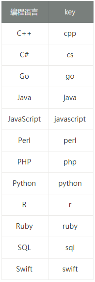
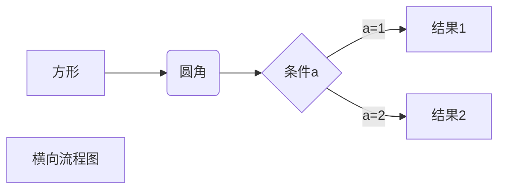
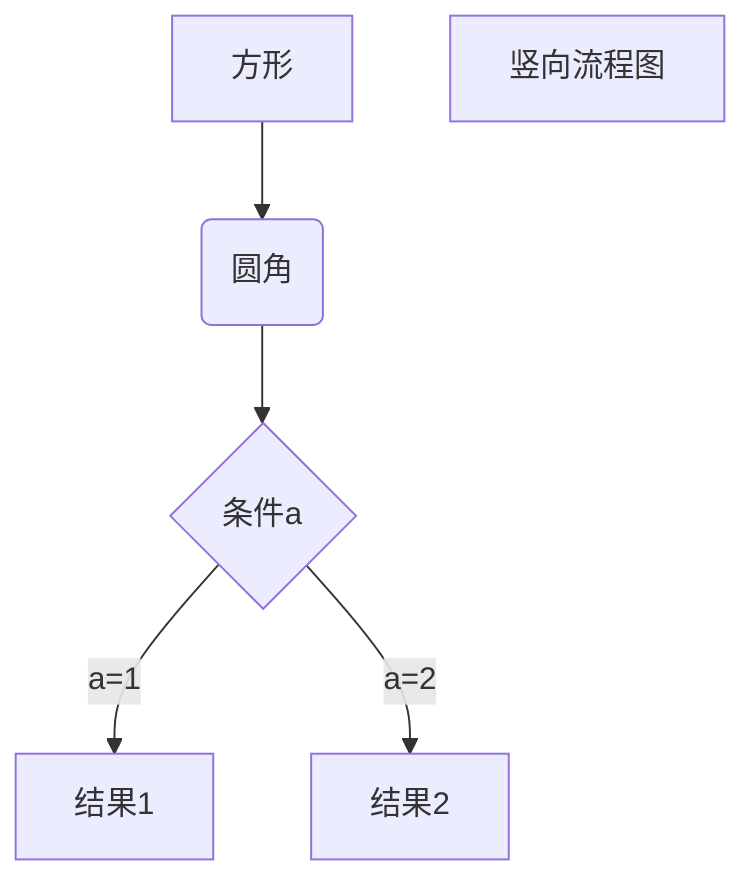
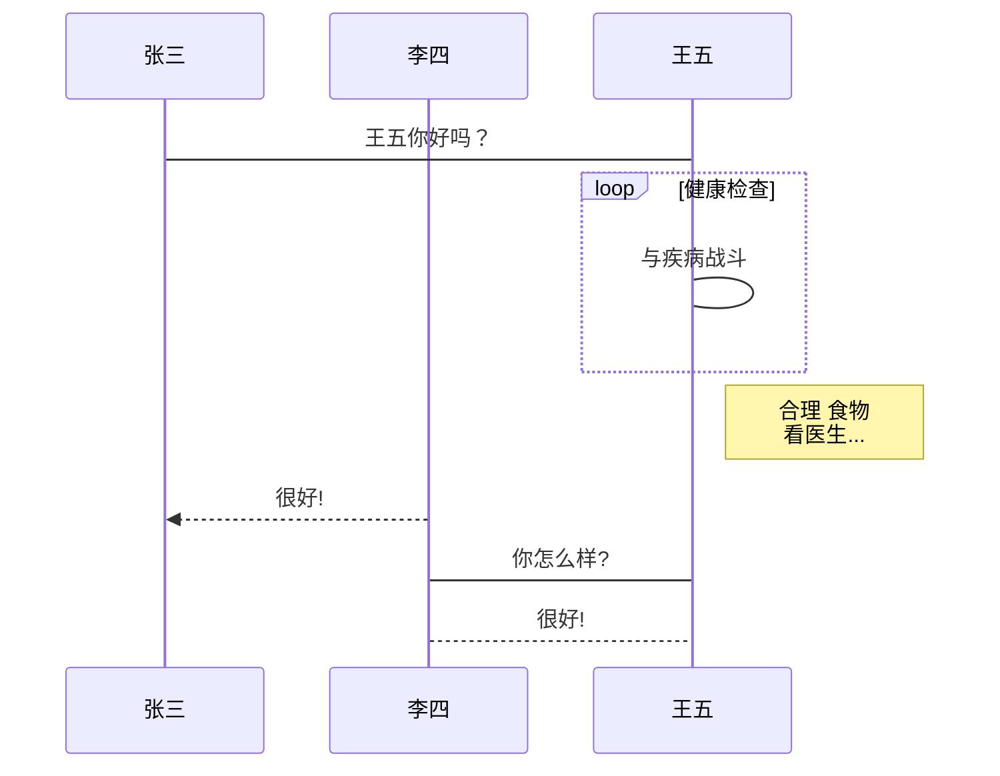
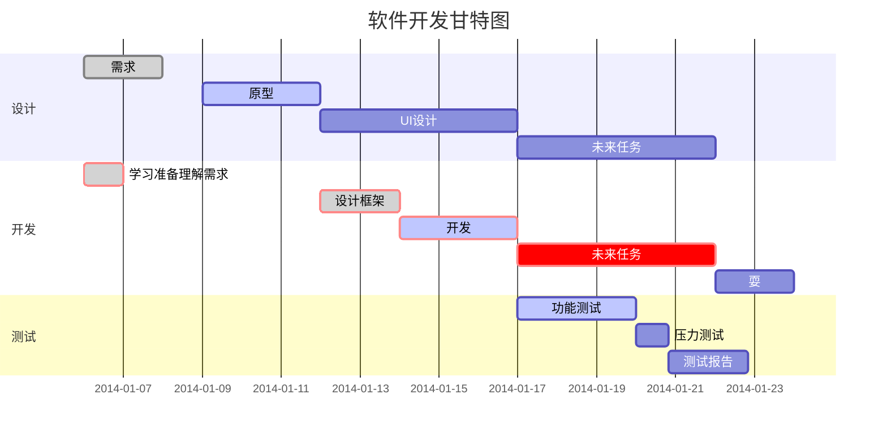

## Markdown 

Markdown 设计灵感主要来源于纯文本电子邮件的格式，目标是让人们能够使用易读、易写的纯文本格式编写文档。

Markdown 是一种轻量级标记语言，它允许人们使用易读易写的纯文本格式编写文档。  
Markdown 语言在 2004 由约翰·格鲁伯（英语：John Gruber）创建。  
Markdown 编写的文档可以导出 HTML 、Word、图像、PDF、Epub 等多种格式的文档。  
Markdown 编写的文档后缀为 .md, .markdownn, .mdown, .mkdn。  

### 语法说明


#### Markdown 标题
Markdown 标题有两种格式。

1. 使用 = 和 - 标记一级和二级标题  
= 和 - 标记语法格式如下：
```
我展示的是一级标题
=================

我展示的是二级标题
-----------------
```

2. 使用 # 号标记  
使用 # 号可表示 1-6 级标题，一级标题对应一个 # 号，二级标题对应两个 # 号，以此类推。
```
# 一级标题
## 二级标题
### 三级标题
#### 四级标题
##### 五级标题
###### 六级标题
```

#### Markdown 段落
Markdown 段落没有特殊的格式，直接编写文字就好，段落的换行是使用两个以上空格加上回车。  
当然也可以在段落后面使用一个空行来表示重新开始一个段落。

#### Markdown 字体
Markdown 可以使用以下几种字体：  
```
*斜体文本*
_斜体文本_
**粗体文本**
__粗体文本__
***粗斜体文本***
___粗斜体文本___
```

#### Markdown 列表
Markdown 支持有序列表和无序列表。  
1. 无序列表使用星号(*)、加号(+)或是减号(-)作为列表标记，这些标记后面要添加一个空格，然后再填写内容：
```
* 第一项
* 第二项
* 第三项

+ 第一项
+ 第二项
+ 第三项

- 第一项
- 第二项
- 第三项
```

2. 有序列表使用数字并加上 . 号来表示，如：
```
1. 第一项
2. 第二项
3. 第三项
```

#### Markdown 嵌套列表
列表嵌套只需在子列表中的选项前面添加四个空格即可：
```
1. 第一项：
    - 第一项嵌套的第一个元素
    - 第一项嵌套的第二个元素
2. 第二项：
    - 第二项嵌套的第一个元素
    - 第二项嵌套的第二个元素
```

#### Markdown 区块引用
Markdown 区块引用是在段落开头使用 > 符号 ，然后后面紧跟一个空格符号：
```
> 区块引用
> 菜鸟教程
> 学的不仅是技术更是梦想
```

另外区块是可以嵌套的，一个 > 符号是最外层，两个 > 符号是第一层嵌套，以此类推：
```
> 最外层
> > 第一层嵌套
> > > 第二层嵌套
```

区块中使用列表，实例如下：
```
> 区块中使用列表
> 1. 第一项
> 2. 第二项
> + 第一项
> + 第二项
> + 第三项
```

如果要在列表项目内放进区块，那么就需要在 > 前添加四个空格的缩进。  
列表中使用区块实例如下：
```
* 第一项
    > 菜鸟教程
    > 学的不仅是技术更是梦想
* 第二项
```

#### Markdown 代码
如果是段落上的一个函数或片段的代码可以用反引号（`）把它包起来，即可显示原有格式的文本。
例如：
```
`printf()` 函数
```

跨行代码块，代码区块使用4个空格或者一个制表符（Tab 键）。实例如下：
```
    <?php
    echo 'RUNOOB'
    function test() {
        echo 'test';
    }
```

也可以不用缩进4个空格，使用3个反引号(\`\`\`)包住文本区块，并指定一种语言（也可以不指定）：
```javascript
$(document).ready(function () {
    alert('RUNOOB');
});
```


#### Markdown 链接
链接使用方法如下：  
```
[链接名称](链接地址) 
```
或者
```
<链接地址>
```
例如：  
```
这是一个链接 [菜鸟教程](https://www.runoob.com)
```

也可以直接使用链接地址：
```
<https://www.runoob.com>
```

##### 高级链接
我们可以通过变量来设置一个链接，变量赋值在文档末尾进行：
```
这个链接用 1 作为网址变量 [Google][1]
这个链接用 runoob 作为网址变量 [Runoob][runoob]
然后在文档的结尾为变量赋值（网址）

[1]: http://www.google.com/
[runoob]: http://www.runoob.com/
```

#### Markdown 图片
Markdown 图片语法格式如下：
```


```

开头一个感叹号 !  
接着一个方括号，里面放上图片的替代文字  
接着一个普通括号，里面放上图片的网址，最后还可以用引号包住并加上选择性的 'title'  属性的文字。

也可以像网址那样对图片网址使用变量:
```
这个链接用 1 作为网址变量 [RUNOOB][1].
然后在文档的结尾为变量赋值（网址）

[1]: http://static.runoob.com/images/runoob-logo.png
```

Markdown 还没有办法指定图片的高度与宽度，但可以使用普通的  标签。
```

```

#### Markdown 表格
Markdown 制作表格使用 | 来分隔不同的单元格，使用 - 来分隔表头和其他行。  
顶部的连字符无需一定匹配表头文本的长度（但必须保证至少3个连字符）  
可以添加行内的Markdown语法文本，如链接、加粗、删除线等  

语法格式如下：
```
|  表头   | 表头  |
|  ----  | ----  |
| 单元格  | 单元格 |
| 单元格  | 单元格 |
```

可以设置表格的对齐方式：  
-: 设置内容和标题栏居右对齐。  
:- 设置内容和标题栏居左对齐。  
:-: 设置内容和标题栏居中对齐。  
```
| 左对齐 | 右对齐 | 居中对齐 |
| :-----| ----: | :----: |
| 单元格 | 单元格 | 单元格 |
| 单元格 | 单元格 | 单元格 |
```

#### Markdown 支持的 HTML 元素
不在 Markdown 涵盖范围之内的标签，都可以直接在文档里面用 HTML 撰写。  
目前支持的 HTML 元素有：`<kbd> <b> <i> <em> <sup> <sub> <br>`等 ，如：
```
使用 <kbd>Ctrl</kbd>+<kbd>Alt</kbd>+<kbd>Del</kbd> 重启电脑
```

#### Markdown 转义
Markdown使用了很多特殊符号来表示特定的意义，如果需要显示特定的符号则需要使用转义字符，Markdown 使用反斜杠转义特殊字符：
```
**文本加粗** 
\*\* 正常显示星号 \*\*
```

Markdown 支持以下这些符号前面加上反斜杠来帮助插入普通的符号：
```
\   反斜线
`   反引号
*   星号
_   下划线
{}  花括号
[]  方括号
()  小括号
#   井字号
+   加号
-   减号
.   英文句点
!   感叹号
```

#### Markdown 注脚

注脚
使用 [^keyword] 表示注脚。例如：
```
[^footnote1]: 这是一个 *注脚* 的 **文本**。
[^footnote2]: 这是另一个 *注脚* 的 **文本**。
```

#### Markdown 公式
当需要在编辑器中插入数学公式时，可以使用两个美元符 $$ 包裹 TeX 或 LaTeX 格式的数学公式来实现。如：
```
$$
\mathbf{V}_1 \times \mathbf{V}_2 =  \begin{vmatrix} 
\mathbf{i} & \mathbf{j} & \mathbf{k} \\
\frac{\partial X}{\partial u} &  \frac{\partial Y}{\partial u} & 0 \\
\frac{\partial X}{\partial v} &  \frac{\partial Y}{\partial v} & 0 \\
\end{vmatrix}
${$tep1}{\style{visibility:hidden}{(x+1)(x+1)}}
$$
```
$$
\mathbf{V}_1 \times \mathbf{V}_2 =  \begin{vmatrix} 
\mathbf{i} & \mathbf{j} & \mathbf{k} \\
\frac{\partial X}{\partial u} &  \frac{\partial Y}{\partial u} & 0 \\
\frac{\partial X}{\partial v} &  \frac{\partial Y}{\partial v} & 0 \\
\end{vmatrix}
${$tep1}{\style{visibility:hidden}{(x+1)(x+1)}}
$$


根据需要加载 Mathjax 对数学公式进行渲染。


#### Markdown 流程图

typora 画流程图、时序图(顺序图)、甘特图

1、横向流程图：


2、竖向流程图：


3、标准流程图：
```flow
st=>start: 开始框
op=>operation: 处理框
cond=>condition: 判断框(是或否?)
sub1=>subroutine: 子流程
io=>inputoutput: 输入输出框
e=>end: 结束框
st->op->cond
cond(yes)->io->e
cond(no)->sub1(right)->op
```

4、标准流程图（横向）：
```flow
st=>start: 开始框
op=>operation: 处理框
cond=>condition: 判断框(是或否?)
sub1=>subroutine: 子流程
io=>inputoutput: 输入输出框
e=>end: 结束框
st(right)->op(right)->cond
cond(yes)->io(bottom)->e
cond(no)->sub1(right)->op
```

5、UML时序图：
```sequence
对象A->对象B: 对象B你好吗?（请求）
Note right of 对象B: 对象B的描述
Note left of 对象A: 对象A的描述(提示)
对象B-->对象A: 我很好(响应)
对象A->对象B: 你真的好吗？
```

6、UML时序图：
```sequence
Title: 标题：复杂使用
对象A->对象B: 对象B你好吗?（请求）
Note right of 对象B: 对象B的描述
Note left of 对象A: 对象A的描述(提示)
对象B-->对象A: 我很好(响应)
对象B->小三: 你好吗
小三-->>对象A: 对象B找我了
对象A->对象B: 你真的好吗？
Note over 小三,对象B: 我们是朋友
participant C
Note right of C: 没人陪我玩
```

7、UML标准时序图：


8、甘特图：


### Markdown 解析器和扩展语法

由于Markdown作者的反对标准化立场，现行的Markdown解析器百花齐放。各个网站或者App的解析器可能都不一样。

原生 Markdown 不支持直接换行，也不支持表格。

因为GFM跟标准MD一样，行尾不允许直接回车换行，必须是\n\n或者空格空格\n。


#### Markdown GFM
标准MD的超集GFM(GitHub Flavored Markdown)

斜体：标准的Markdown在单词左右加 _或* 成斜体。GFM忽略了单词内部的 _。  
URL自动链接：标准Markdown使用 <URL> 来支持自动链接。GFM支持不加尖括号的标准URL。  
代码块：标准Markdown只支持 4个空格/Tab 缩进的代码块。GFM还支持```格式的代码块，并能指定具体语言。  
语法高亮：代码块基础上可以指定语言，来进行着色渲染。  
删除线：增加了标准markdown中不支持的删除线~~
```
~~被删除的文字~~
```

表格：增加了标准markdown中不支持的表格  
锚点：增加了标准markdown中不支持的锚点  
`[锚点描述](#锚点名)`

任务列表：GFM支持在列表符号与文字中间加[ ]、[x]，分别表示未完成/完成。x 可以小写也可以大写，有些编辑器可能不支持大写。  

HTML：可以使用一个HTML的子集，所有支持的标签和属性可以在 https://github.com/github/markup 找到。  
表情符号:
`:表情代码:`:smile::laughing::+1::-1::clap:

#### Multi Markdown

### 最佳实践
虽然目前编辑器对Markdown的支持存在很大差异，方言现象严重，但是对于Markdown的基础语法的支持都是相似的。而且针对Markdown基础语法产生的差异大部分是在区块相接、嵌套、软输入和Lazy输入时产生的，所以养成一个良好的书写习惯可以规避掉大部分兼容性问题。

#### 标题
- `#+空格+标题`
- 文章的顶层标题使用二级标题（有时文章的标题并不需要写在文章里，比如大多数博客有专门的位置填写文章标题，此时这级标题可以省略）
- 每个小节的标题使用三级标题
- 小节中进一步分层组织时使用四级标题
- 尽量少用五级标题和六级标题，考虑用有序列表和无序列表代替
- 完全不用一级标题

#### 粗体、斜体
需要强调某处内容时使用粗体，如：
>中文全角标点符号占**一个**汉字宽度，英文半角标点占**半个**汉字宽度（亦即一个字母宽度）。

在中文排版中不使用斜体。在英文排版中可用斜体表达强调，或表示书名、题目。

强调默认是斜体，重强调默认是粗体。

#### 引用
以下情况使用引用标记：

- 引述内容时（也可直接用引号替代）
- 作示例时
- 给出提示、警告等额外说明时

#### 空白符号的运用
##### 1. 半角空格
半角空格的使用很重要，一些情况下能调节文字间距使得排版更加美观。

- 中英文混排时，英文前后各加一个空格。
- 中文和阿拉伯数字混排时，数字前后各加一个空格。
- 若英文或阿拉伯数字若紧邻中文全角标点，则其与标点之间不加空格。
- 行内代码的两端各添加一个空格。若行内代码紧邻标点符号，则其与标点之间不加空格。

##### 2. 空行
正文段落之间用一个空行来分隔，可以显得段落分明、结构不拥挤。

##### 3. 缩进
- 文章中每个段落的开头不要缩进
- 列表中嵌套列表时，内层列表使用 4 个空格进行缩进
- 想要像上面那样在一个列表项中嵌入引用块，只要在 Markdown 中将引用块用 4 个空格缩进。除此之外，图片、代码块等元素也可以在列表下缩进
- 缩进时使用空格符，不用 Tab 符

#### 标点符号
中文排版时应全文使用中文全角标点，无论内容中是否包含英文词语。除非内容中包含完整的英文句子或段落，这种情况下英文内的标点使用半角标点。

##### 1. 引号
网络文章排版时使用直角引号——单引号「」，双引号『』。通常先使用「」，在引号嵌套时才在内层用『』。

直角引号在自媒体中比较常见，但也会有一些争议。

##### 2. 省略号
在中文输入法状态下，可使用「Shift + 6」输入省略号。注意是 6 个点，而非 3 个点。

##### 3. 破折号
在中文输入法状态下，可使用「Shift + -」输入破折号。注意该符号应占两个汉字宽度。

##### 4. 波浪线
在中文输入法状态下，可使用「Shift + `（ESC 键下方）」输入波浪线。可用波浪线表示数值的区间。

注意，日期时间或地名的区间用破折号表示，如


